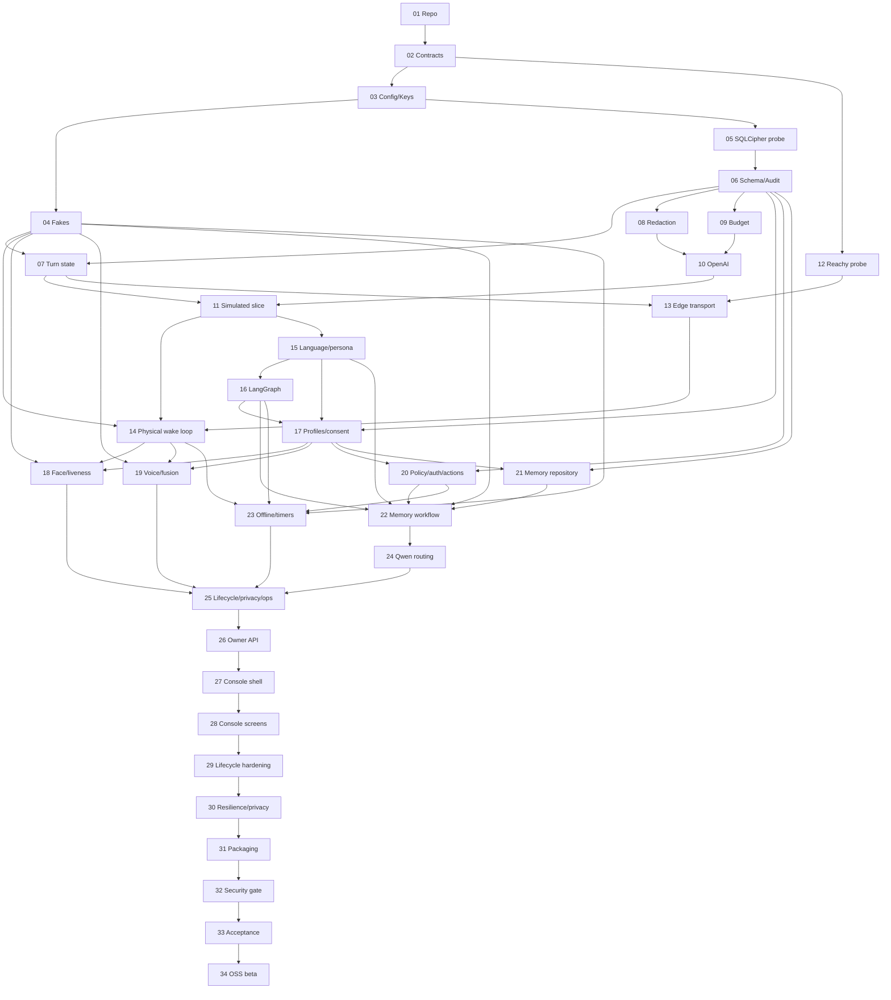

# Tuntun Phase 1 “Anchor” Implementation Plan

> **For agentic workers:** REQUIRED SUB-SKILL: Use superpowers:subagent-driven-development (recommended) or superpowers:executing-plans to implement this plan task-by-task. Steps use checkbox (`- [ ]`) syntax for tracking.

**Goal:** Deliver a private, bilingual Reachy Mini Wireless family assistant whose canonical identity, policy, seven memory types, audit, and budget state remain encrypted on the household Mac, then package the same implementation as an open-source Phase 1 beta.

**Architecture:** Run a narrow `tuntun-edge` service on Reachy for local wake/VAD, media, privacy/stop, and gestures. Run one ports-and-adapters modular monolith, `tuntun-core`, on the owner-approved Darwin `arm64` Core Mac from ADR 0001 for orchestration, local identity, policy/auth, canonical memory, provider routing, audit, owner API, and the React console. Intel macOS remains a mandatory supported-distribution target, not the active household host unless fresh real-host probes requalify it. Connect Core and Reachy over a paired mTLS WebSocket protocol; use only explicit outbound cloud calls and no public inbound access.

**Tech Stack:** Python 3.12, `uv`, Pydantic v2, FastAPI/Uvicorn, asyncio, LangGraph behind an adapter, SQLAlchemy 2/Alembic, `sqlcipher3==0.6.2` compatibility candidate, `cryptography`, macOS Keychain, OpenAI Python SDK, OpenCV headless, ONNX Runtime, governed SpeechBrain-to-ONNX conversion candidate, openWakeWord/Silero behind replaceable ports; React, TypeScript, Vite, TanStack Query, React Router, pnpm; pytest, pytest-asyncio, Hypothesis, Ruff, mypy, Vitest, Testing Library, Playwright, and GitHub Actions.

**Spec:** [Tuntun Phase 1 “Anchor” Architecture Specification](../specs/2026-08-27-tuntun-phase1-anchor-design.md)

## Execution Plan Pack

This document is the dependency, scope, estimate, and acceptance roadmap. Its 34 numbered tasks are work packages. Implementers must execute the smaller test-driven task packets in the six plans below; those plans are normative for exact files, literal failing tests, minimal implementation, verification commands, and commits. The controlled-web supplement uses CW01–CW04 and does not renumber or masquerade as Tasks 01–34.

1. [Foundation and frozen contracts](2026-08-27-tuntun-phase1-foundation-execution.md) — repository bootstrap, configuration, v1 contracts, encrypted persistence, audit, redaction, and budget controls.
2. [Conversation and Reachy](2026-08-27-tuntun-phase1-conversation-reachy-execution.md) — simulated slice, hardware probe, paired edge transport, audio/wake/stop, bilingual orchestration, and provider speech/LLM adapters.
3. [Identity, policy, and seven memories](2026-08-27-tuntun-phase1-identity-memory-execution.md) — profiles, consent, face/voice evidence and liveness, fusion, authorization, canonical memory, and retention-safe writes.
4. [Control, lifecycle, console, and resilience](2026-08-27-tuntun-phase1-control-console-execution.md) — offline commands, timers, Qwen evaluation, backup/recovery, owner API/UI, privacy control, and fault handling.
5. [Packaging, security, acceptance, and release](2026-08-27-tuntun-phase1-release-execution.md) — signed local deployment, threat/security gates, complete acceptance evidence, staged household trial, and reproducible Phase 1-only open-source preview.
6. [Controlled web/search supplement](2026-08-27-tuntun-phase1-controlled-web-execution.md) — the missing 15-day separately consented/budgeted adult controlled-search path: approximately seven FB0-critical days plus eight post-FB0 preview-hardening days.

Follow the plans in order where their declared dependencies require it. Independent tasks may run in separate clean worktrees only after their consumed contracts are frozen. The master work-package acceptance criteria still apply when a subplan task closes.

## Global Constraints

1. The specification above is normative. A task that requires changing a locked decision first updates the specification and adds an ADR.
2. No real family name, audio, transcript, image, embedding, credential, memory, or provider response is committed to source control, CI artifacts, test reports, model fixtures, or public issues.
3. Raw pre/post-wake audio, camera frames/crops, and verbatim transcripts remain ephemeral in Tuntun. Tests must prove their absence from local durable storage and logs; provider-side handling remains subject to current provider data controls and terms.
4. Reachy holds no cloud credential, Mac database key, canonical memory, or durable biometric template.
5. The Mac holds canonical state. LangGraph checkpoints contain only bounded pseudonymous workflow state and expire; LangGraph Store is not the memory database.
6. All concrete robot, model, speech, biometric, database, key store, clock, and network implementations sit behind project-owned contracts.
7. Language-model adapters accept only `SanitizedProviderRequest`. STT/TTS adapters accept only their narrow speech contracts plus a local route/budget authorization. No provider adapter accepts a profile, memory record, identity template, or internal conversation object.
8. A model can propose an answer, memory, or action. Local schema validation, policy, authentication, budget, and idempotency checks decide what is committed or executed.
9. Face and voice evidence personalize only. They never authorize an action: every low-risk action needs explicit per-action confirmation, and medium/high-risk actions need their typed step-up factor. Uncertainty or conflict is Guest.
10. Unknown actions, unknown prices, expired credentials, unavailable encryption keys, invalid signatures, and incompatible major protocol versions fail closed.
11. Privacy and stop preempt speech, motion, provider calls, memory work, and ordinary errors. Their edge-local path must not depend on the Mac or WAN.
12. The owner API binds `127.0.0.1` by default. LAN administration requires an explicit HTTPS/passkey configuration. Public inbound and port forwarding are forbidden.
13. The edge gateway is the only default LAN listener. It uses mTLS, paired device identity, event signatures, replay defense, bounded messages, and an explicit private-interface bind. The console becomes a second LAN listener only when the owner explicitly enables its HTTPS/passkey mode.
14. Every cloud call reserves worst-case cost first. The S$100 soft limit warns; the S$150 hard limit denies new cloud work. Money uses integer micro-SGD.
15. Qwen is disabled by default, receives no mirrored live conversations, and cannot activate until its synthetic/de-identified evaluation and privacy gates pass.
16. No smart-home, Reolink, MOES MZHUB/Zigbee, Home Assistant, multi-room, or NAS implementation enters Phase 1.
17. No microservice broker, distributed cache, container orchestrator, or external telemetry service is introduced.
18. Ordinary tests never access hardware or paid APIs. `live_cloud` and `reachy_hardware` suites require explicit flags and synthetic data.
19. Critical policy, auth, memory-isolation, provider-boundary, audit-integrity, retention, and safety modules require at least 95% branch coverage; project-wide branch coverage must remain at least 85%.
20. Each implementation task follows red → green → refactor → affected suite → static checks → documentation → independently reviewable commit.
21. Execute each task in a clean isolated git worktree/branch. Before staging, require `git status --short` to contain only task-owned paths; abort on any unrelated change. A directory pathspec is allowed only when every changed descendant is named by that task. Inspect both `git diff --cached --name-only` and `git diff --cached` before commit; never stage broadly in a dirty/shared worktree.
22. Cloud STT, reasoning, and TTS each require current purpose-specific consent and a route authorization. Adult subjects consent for themselves; a guardian consents for a child. Guest is offline-only unless a local per-session disclosure and consent succeeds.
23. Privacy/mute activation may be local voice/edge initiated; disabling either requires an authenticated owner console or a documented physical local-presence ceremony. Voice alone never reduces privacy.

### Safety-critical execution clarifications

- Privacy Shield closes new local media/cloud authority synchronously, then fans out acknowledgements concurrently under one absolute monotonic 500 ms deadline. Its receipt names missing acknowledgements truthfully; reconciliation/audit run idempotently after the response.
- Profile revocation requires active state, advances a subject-authority generation, and atomically revokes sessions, consent, enrollment/templates, and all unconsumed provider/search/action/memory authority. The SQLCipher writer defines revoke-versus-consume order and restart tests cover every stale authority family.
- Reachy production authority separates the commissioned reserved numeric inner-Mac IPv4/MAC/port and household-CA leaf IP SAN/generations from the strictly validated local Reachy ingress-interface configuration. mDNS is discovery-only. Edge-initiated mTLS WSS has one-second heartbeats, two-miss failure, bounded reconnect, no replay/resume, and default-deny IPv4/IPv6 firewall tests for reboot, scans, spoofing, and drift.
- `start_attempted` survives ephemeral erasure. Every terminal path invokes one locked idempotent `finish(turn_id)` and cleanup never masks the primary outcome.
- Expired provider reservations are reconciled at startup and periodically: release only exact proven-unsent attempts; settle sent, malformed, or ambiguous attempts in their original Singapore month. Crash windows and mark/reconcile races are tested.
- Memory create/replace writes carry the exact approved proposal/source ID into both the current row and newly materialized immutable revision; a real migrated file-backed SQLCipher close/reopen proves reconstruction.
- Bilingual gating uses actual candidate prompts and closed expectations for English, Devanagari Hindi, Romanized Hindi, and mixed switching, then independently verifies a signed result report bound to prompt/policy/corpus/scorer/result hashes.
- Optional experimental search uses a private owner/session parent capability that atomically mints a new single-use route authorization, idempotency key, and budget reservation for every provider attempt. Disabled builds prove config/API/UI/package/runtime absence.
- Clean install separates host checks from post-initialization verification and provisions purpose roots, SQLCipher, audit genesis, household CA, backup recipient, and recovery ceremony before readiness. Upgrade probes the newly started candidate inside the rollback boundary.
- Release evidence includes candidate/time/config/target-bound process-tree, DNS, listener/socket, payload-free packet, LAN-scan, and outer-scan receipts. Private-data scanning accepts explicit roots, never skips them, and reads complete bounded files/archive members.
- Reachy packaging uses a pinned cross-platform deterministic archive writer. On the final frozen commit, a signed nonpublic qualification manifest binds two byte-identical builds; a clean locally commissioned target installs those exact bytes in evidence-pending state before target/LAN/outer evidence, and later candidate assembly consumes the same hashes without rebuilding. Every workflow action is a full commit SHA on fixed runner labels; hosted CI is portability evidence, not target-hardware qualification.
- Optional LAN administration stays loopback until exact private DNS, matching local-CA TLS/SAN, and all admin-device trust receipts are commissioned. `.home.arpa` is never assumed to resolve; drift revokes LAN sessions and closes port 8443.

## Definition of Done

A task is complete only when all of these are true:

- The named failing test was observed before implementation and its failure reason matched the intended missing behavior.
- The narrow test and all affected suites pass.
- `ruff format --check`, `ruff check`, and strict mypy pass for touched Python packages.
- Vitest, lint, type-check, and production build pass for touched web code.
- Logs and artifacts were inspected for sentinel private data when the task crosses a privacy boundary.
- Public contract changes include serialization/compatibility tests and protocol version treatment.
- Data model changes include forward migration, tested downgrade or restore strategy, and encrypted pre-migration backup behavior.
- Operational behavior, configuration defaults, and failure mode are documented.
- No untracked generated or secret-bearing file remains.
- The task is committed with the exact intent shown in its commit step or an equally scoped conventional commit.

## Planned Repository Map

```text
Project_TunTun/
├── .github/
│   └── workflows/
│       ├── ci.yml
│       ├── security.yml
│       └── release.yml
├── .gitignore
├── .pre-commit-config.yaml
├── .python-version
├── .env.example
├── Makefile
├── README.md
├── SECURITY.md
├── PRIVACY.md
├── CONTRIBUTING.md
├── LICENSE
├── NOTICE
├── pyproject.toml
├── uv.lock
├── package.json
├── pnpm-lock.yaml
├── pnpm-workspace.yaml
├── apps/
│   ├── core/
│   │   ├── pyproject.toml
│   │   ├── migrations/
│   │   │   ├── env.py
│   │   │   └── versions/
│   │   └── src/tuntun_core/
│   │       ├── api/
│   │       │   ├── app.py
│   │       │   ├── auth.py
│   │       │   ├── dependencies.py
│   │       │   └── routes/
│   │       ├── bootstrap/
│   │       │   ├── container.py
│   │       │   └── lifecycle.py
│   │       ├── config/
│   │       │   ├── loader.py
│   │       │   ├── settings.py
│   │       │   └── paths.py
│   │       ├── domain/
│   │       │   ├── actions.py
│   │       │   ├── conversation.py
│   │       │   ├── profile.py
│   │       │   └── timer.py
│   │       ├── services/
│   │       │   ├── actions/
│   │       │   ├── audit/
│   │       │   ├── auth/
│   │       │   ├── budget/
│   │       │   ├── data_lifecycle/
│   │       │   ├── identity/
│   │       │   ├── memory/
│   │       │   ├── models/
│   │       │   ├── policy/
│   │       │   ├── privacy/
│   │       │   ├── providers/
│   │       │   ├── resilience/
│   │       │   ├── sessions/
│   │       │   ├── timers/
│   │       │   ├── context_builder.py
│   │       │   ├── health.py
│   │       │   ├── language_tracker.py
│   │       │   ├── persona_builder.py
│   │       │   ├── runtime_status.py
│   │       │   └── usage.py
│   │       ├── adapters/
│   │       │   ├── embeddings/
│   │       │   ├── identity/
│   │       │   ├── keychain/
│   │       │   ├── local_audio/
│   │       │   ├── openai/
│   │       │   ├── qwen/
│   │       │   ├── reachy/
│   │       │   └── sqlcipher/
│   │       ├── workflows/
│   │       │   ├── conversation.py
│   │       │   ├── ephemeral_turn_context.py
│   │       │   └── langgraph_adapter.py
│   │       ├── offline/
│   │       │   ├── grammar.py
│   │       │   ├── router.py
│   │       │   └── prompts.py
│   │       └── cli/
│   │           ├── main.py
│   │           └── commands/
│   ├── edge/
│   │   ├── pyproject.toml
│   │   └── src/tuntun_edge/
│   │       ├── audio/
│   │       │   ├── buffer.py
│   │       │   ├── vad.py
│   │       │   └── wakeword.py
│   │       ├── reachy/
│   │       │   ├── client.py
│   │       │   ├── gestures.py
│   │       │   └── probe.py
│   │       ├── safety/
│   │       │   ├── privacy.py
│   │       │   ├── state_machine.py
│   │       │   └── watchdog.py
│   │       ├── transport/
│   │       │   ├── pairing.py
│   │       │   ├── protocol.py
│   │       │   └── websocket.py
│   │       ├── config.py
│   │       └── runtime.py
│   └── admin/
│       ├── package.json
│       ├── vite.config.ts
│       └── src/
│           ├── api/
│           ├── app/
│           ├── components/
│           ├── features/
│           ├── routes/
│           └── styles/
├── packages/
│   ├── contracts/
│   │   ├── pyproject.toml
│   │   ├── openapi/admin-v1.yaml
│   │   ├── fixtures/v1/
│   │   └── src/tuntun_contracts/
│   │       ├── base.py
│   │       ├── audit.py
│   │       ├── budget.py
│   │       ├── events.py
│   │       ├── identity.py
│   │       ├── memory.py
│   │       ├── policy.py
│   │       ├── provider.py
│   │       ├── reachy.py
│   │       ├── speech.py
│   │       └── ports.py
│   └── testing/
│       ├── pyproject.toml
│       └── src/tuntun_testing/
│           ├── fake_clock.py
│           ├── fake_providers.py
│           ├── fake_reachy.py
│           └── scenario.py
├── config/
│   ├── policies/default.yaml
│   ├── providers/default.yaml
│   └── tuntun.example.yaml
├── prompts/
│   ├── conversation/base.md
│   ├── conversation/family-role-rules.yaml
│   ├── memory/proposal-schema.json
│   └── versions.yaml
├── models/
│   ├── manifest.schema.json
│   ├── manifest.yaml
│   └── wake/hello-tuntun/
├── assets/
│   └── offline-prompts/
├── evals/
│   ├── cases/
│   ├── reports/
│   └── scorers/
├── tests/
│   ├── acceptance/
│   ├── contract/
│   ├── e2e/
│   ├── hardware/
│   ├── integration/
│   ├── property/
│   ├── security/
│   ├── unit/
│   └── fixtures/
├── deploy/
│   ├── macos/
│   └── reachy/
├── scripts/
│   ├── check_model_manifest.py
│   ├── generate_openapi_client.sh
│   ├── run_acceptance.sh
│   ├── verify_private_data.py
│   └── verify_release.sh
└── docs/
    ├── adr/
    ├── architecture/
    ├── operations/
    ├── privacy/
    └── superpowers/
```

## Stable Contract Baseline

These types are defined before adapters. They are immutable Pydantic v2 models with `extra="forbid"`, aware UTC timestamps, random UUIDs, bounded text/bytes, and explicit schema version `1.0`.

```python
import base64
from enum import StrEnum
from typing import Annotated, Literal
from uuid import UUID

from pydantic import AwareDatetime, BaseModel, ConfigDict, Field, field_validator


class ContractModel(BaseModel):
    model_config = ConfigDict(
        extra="forbid",
        frozen=True,
        strict=True,
        allow_inf_nan=False,
        validate_assignment=True,
        str_strip_whitespace=True,
    )


class Sensitivity(StrEnum):
    PUBLIC = "public"
    HOUSEHOLD = "household"
    PERSONAL = "personal"
    SENSITIVE = "sensitive"
    RESTRICTED = "restricted"


class EventType(StrEnum):
    WAKE_DETECTED = "speech.wake_detected"
    STOP_REQUESTED = "safety.stop_requested"


class WakeDetectedPayload(ContractModel):
    kind: Literal["speech.wake_detected"]
    turn_id: UUID
    score_micros: Annotated[int, Field(ge=0, le=1_000_000)]


class StopRequestedPayload(ContractModel):
    kind: Literal["safety.stop_requested"]
    turn_id: UUID | None
    source: Literal["edge_keyword", "physical_input", "owner_console", "watchdog"]


EventPayload = Annotated[
    WakeDetectedPayload | StopRequestedPayload,
    Field(discriminator="kind"),
]


class Commitment(ContractModel):
    algorithm: Literal["HMAC-SHA-256"]
    key_id: str = Field(min_length=8, max_length=128, pattern=r"^[A-Za-z0-9_.:-]+$")
    value_b64: str = Field(min_length=44, max_length=44, pattern=r"^[A-Za-z0-9+/]{43}=$")

    @field_validator("value_b64")
    @classmethod
    def canonical_hmac_sha256(cls, value: str) -> str:
        try:
            decoded = base64.b64decode(value, validate=True)
        except (ValueError, base64.binascii.Error) as error:
            raise ValueError("commitment must be canonical base64") from error
        if len(decoded) != 32 or base64.b64encode(decoded).decode("ascii") != value:
            raise ValueError("commitment must encode exactly 32 bytes canonically")
        return value


class AudioFormat(ContractModel):
    sample_format: Literal["float32_le", "s16le"]
    sample_rate_hz: Annotated[int, Field(ge=8_000, le=96_000)]
    channels: Annotated[int, Field(ge=1, le=4)]
    interleaved: bool
    channel_layout: Literal["mono", "stereo", "reachy_native"]


class EventEnvelope(ContractModel):
    schema_version: Literal["1.0"]
    event_id: UUID
    event_type: EventType
    household_id: UUID
    device_id: UUID
    session_id: UUID | None
    correlation_id: UUID
    causation_id: UUID | None
    device_sequence: Annotated[int, Field(ge=0)]
    occurred_at: AwareDatetime
    sensitivity: Sensitivity
    payload_commitment: Commitment
    payload: EventPayload
```

The real union contains every registered event payload. A model validator enforces `event_type == payload.kind`. Nested data uses tuples/frozen models, not mutable dictionaries/lists. RFC 8785/JCS canonical UTF-8 bytes, Unicode NFC, and UTC timestamps with exactly six fractional digits are used for signatures and commitments. Every signed, network, provider-output, or control ingress first calls the shared bounded `parse_contract_json(model_type, raw_bytes, max_bytes=..., require_canonical=...)`, which delegates its first pass to public `parse_bounded_json_value(raw_bytes, max_bytes=..., max_depth<=32, max_containers<=4096, max_structure_tokens<=16384)`. That first pass rejects duplicate keys, non-finite/non-standard numbers, excessive flat scalar members/separators, oversized or invalid UTF-8 input before strict Pydantic JSON validation. Every hostile raw-byte size/UTF-8/syntax/shape/number/schema/canonicality rejection is normalized to the exported `ContractParseError(ValueError)`; invalid parser configuration, a non-contract model type, or another programmer fault is not relabeled. Signed/control frames require byte-for-byte canonical JCS; provider JSON may set `require_canonical=False` but is canonicalized only after the safe parse. Direct `model_validate_json` is forbidden at runtime ingress boundaries; its sole runtime occurrence is inside the shared primitive.

Required port families are `ReachyPort`, `StopInputPort`, `AudioConverterPort`, `SpeechToTextPort`, `TextToSpeechPort`, `LanguageModelPort`, `IdentityFusionPort`, `MemoryRepositoryPort`, `PolicyEnginePort`, `AuthenticationPort`, `ActionProviderPort`, `AuditPort`, `BudgetPort`, `ClockPort`, and `ConversationWorkflow`. Task 02 freezes their exact async signatures in `ports.py`; the execution subplan includes the complete definitions and contract tests. No domain/service/workflow module imports from `adapters`.

The critical provider boundary is:

```python
class RouteAuthorization(ContractModel):
    authorization_id: UUID
    request_id: UUID
    attempt_id: UUID
    purpose: Literal["cloud_stt", "cloud_reasoning", "cloud_tts"]
    household_id: UUID
    subject_id: UUID | None
    session_id: UUID
    turn_id: UUID
    provider: Literal["openai", "qwen"]
    model: Annotated[str, Field(min_length=1, max_length=128)]
    request_commitment: Commitment
    max_input_bytes: Annotated[int, Field(ge=1, le=8_388_608)]
    max_input_units: Annotated[int, Field(ge=1)]
    privacy_receipt_id: UUID
    consent_receipt_ids: Annotated[tuple[UUID, ...], Field(min_length=1, max_length=8)]
    budget_reservation_id: UUID
    maximum_sensitivity: Sensitivity
    expires_at: AwareDatetime


class SanitizedProviderMessage(ContractModel):
    role: Literal["system", "user", "assistant", "memory_data"]
    content: Annotated[str, Field(min_length=1, max_length=32_000)]


class SanitizedToolReference(ContractModel):
    registered_name: Annotated[str, Field(pattern=r"^[a-z][a-z0-9_.-]{1,127}$")]
    schema_version: Literal["1.0"]
    schema_commitment: Commitment


class SanitizedProviderRequest(ContractModel):
    request_id: UUID
    provider: Literal["openai", "qwen"]
    model: Annotated[str, Field(min_length=1, max_length=128)]
    messages: Annotated[tuple[SanitizedProviderMessage, ...], Field(min_length=1, max_length=32)]
    allowed_tools: Annotated[tuple[SanitizedToolReference, ...], Field(min_length=0, max_length=8)]
    max_output_tokens: Annotated[int, Field(ge=1, le=16_384)]
    store: Literal[False] = False
    redaction_receipt_id: UUID
    route: RouteAuthorization
    timeout_ms: Annotated[int, Field(ge=1_000, le=120_000)]


class AuthorizedTranscriptionRequest(ContractModel):
    request_id: UUID
    turn_id: UUID
    audio_format: "AudioFormat"
    audio_commitment: Commitment
    audio_bytes: Annotated[int, Field(ge=1, le=8_388_608)]
    duration_ms: Annotated[int, Field(ge=1, le=90_000)]
    language_hints: Annotated[tuple[Literal["en", "hi"], ...], Field(min_length=1, max_length=2)]
    route: RouteAuthorization

    @field_validator("language_hints")
    @classmethod
    def unique_language_hints(cls, value):
        if len(set(value)) != len(value): raise ValueError("duplicate language hint")
        return value


class AuthorizedSynthesisRequest(ContractModel):
    request_id: UUID
    turn_id: UUID
    text: Annotated[str, Field(min_length=1, max_length=4_096)]
    text_commitment: Commitment
    segment_index: Annotated[int, Field(ge=0, le=255)]
    segment_count: Annotated[int, Field(ge=1, le=256)]
    language: Literal["en", "hi", "hinglish"]
    dlp_receipt_id: UUID
    route: RouteAuthorization
```

`MemoryProposalDraft` is a discriminated operation/kind union over the seven typed memory payloads. `ActionProposalDraft` is a discriminated union over the exact Phase 1 action-parameter contracts; it contains action name/version, resource reference, `uncertainty_micros`, expiry, and an idempotency key. Neither accepts `dict[str, object]`. Those trusted internal drafts are never provider output schemas. The model may return only closed `ProviderMemoryIntent`/`ProviderActionIntent` unions containing pseudonymous references issued for the current turn and bounded user-level values. A local `ProposalMapper` rejects unknown/stale references and adds household/subject UUIDs, proposal/turn/idempotency identifiers, current record versions, expiry, signed provider-response provenance, and purpose-separated HMAC commitments before constructing frozen internal drafts. The provider gateway resolves tool references from a local immutable registry; no arbitrary JSON Schema supplied by a model/LAN client reaches an adapter. STT receives the audio iterator separately, but the adapter recomputes its HMAC commitment/bytes/duration while streaming and rejects any mismatch with `AuthorizedTranscriptionRequest` and `RouteAuthorization` before final upload. TTS similarly recomputes the segment text commitment. Each authorization is household/subject/session/turn/provider/model/request/purpose/attempt/bounds-specific and invalid immediately after consent revocation, privacy activation, cancellation, expiry, input mismatch, or reservation settlement.

## Database Schema Map

The final Phase 1 encrypted schema and migration ownership have these tables and invariants:

| Table | Required data/invariant |
|---|---|
| `households` | UUID, display label, fixed timezone `Asia/Singapore`, created time |
| `subjects` | UUID, household FK, canonical owner/adult/k2/n1 class, encrypted display data and versioned typed persona envelope, active/version state, monotonic authority generation, timestamps; Guest is never persisted |
| `devices` | UUID, household FK, kind, certificate fingerprint, signing public key/key ID, pairing/revocation, last sequence |
| `sessions` | UUID, household/device FKs, state, optional speaker, open/activity/close times; partial unique index permits one active household session |
| `event_receipts` | Event IDs, types, correlations, device-global sequence, keyed commitments, decision; never event payload |
| `idempotency_receipts` | Operation/scope/key, state, result commitment, first/last time, expiry; unique operation/scope/key |
| `consent_receipts` | Purpose including face/voice/personalization/cloud STT/reasoning/TTS and adult-self-only web search, subject/guardian, grant/revoke state, policy/disclosure version, timestamp; Guest tables retain only the three cloud purposes |
| `enrollment_sessions` | Subject/purpose/state, auth/consent receipts, create/expiry/close; no source media |
| `biometric_templates` | Subject/modality/model version, AEAD ciphertext/nonce/wrapped random DEK/root key ID, consent, create/revoke; no media |
| `memory_proposals` | Typed candidate claim, subject authority generation, operation, target/version, closed audience, sensitivity, reasons, source receipt IDs, status, expiry/decision |
| `memories` | Seven-kind typed content, namespace, closed audience, sensitivity/source/confidence, status/version, exact non-null approved proposal FK, validity/expiry, consent and purpose-separated content commitment |
| `memory_revisions` | Immutable newly materialized per-memory versions including closed audience, operation, non-null approved proposal FK, purpose-separated commitments, timestamp |
| `memory_embeddings` | Memory/model IDs, dimensions, AEAD ciphertext/nonce/wrapped random DEK/root key ID, timestamp; never provider-visible |
| `auth_credentials` | PIN/recovery hashes or passkey public data/counter, algorithm, use/revoke times |
| `auth_challenges` | Nonce commitment, subject/session, factor kind, bound action/resource/parameters/policy version, attempts, expiry/consumption |
| `admin_sessions` | Opaque session ID commitment, subject, assurance, origin/RP, create/expiry/revoke/rotation |
| `auth_rate_limits` | Subject/source bucket, failure count/window, lockout time; restart-persistent |
| `audit_receipts` | Ordered append-only public SHA-256 chain plus versioned HMAC commitments; update/delete rejected by database triggers |
| `audit_segments` | Segment UUID, ordinal range/count, first/last HMAC, terminal root/MAC, seal/export state; profile deletion removes pseudonym mapping, not chain integrity |
| `redaction_receipts` | Purpose-separated keyed input/output commitments, removed categories/counts, policy version, maximum sensitivity; no body |
| `provider_calls` | Purpose-separated keyed request/response commitments, provider/model, receipt, category, timing/outcome, exact attempt/reservation, ordering version and durable transport phase; no body |
| `provider_prices` | Versioned native price units, dated conservative FX-to-SGD, effective/expiry |
| `budget_reservations` | Atomic worst-case reservation, immutable Singapore month/category/provider/model, state/expiry/settlement/reconciliation time, exact attempt, ordering version and durable transport phase |
| `cost_ledger` | Original reservation month, final micro-SGD charge, usage metadata, conservative-use flag; unique reservation settlement |
| `reachy_core_tx_sequences` | Content-free reserved core-to-edge transmit high-water mark per commissioned device |
| `reachy_duplex_correlations` | Content-free signed-frame correlation purpose/direction/state/sequence tombstones |
| `timers` | Owner/session, label HMAC commitment, due time, state, announcement idempotency key; no transcript |
| `runtime_settings` | Registry-approved non-secret settings and version; secrets are Keychain references only |

All UUIDs are stored as canonical lowercase strings, booleans as constrained integers, confidence as integer micros, monetary values as integer micro-SGD, and times as UTC ISO-8601 text. SQLCipher covers the full file; biometric/recovery-sensitive blobs receive per-record random DEKs wrapped by purpose-specific Keychain roots. Low-entropy private content uses purpose-separated HMAC commitments, not bare hashes.

**Migration ownership:**

1. `0001_foundation.py`: households, devices, sessions, event/idempotency/audit/audit-segment/redaction/provider/price/budget/cost/runtime tables plus reserved content-free Reachy core transmit-sequence and duplex-correlation state.
2. `0002_profiles_consent_enrollment.py`: subjects, consent receipts, enrollment sessions, and modality-neutral biometric templates needed independently by face/voice adapters.
3. `0003_authentication.py`: auth credentials/challenges/admin sessions/rate limits.
4. `0004_memory.py`: memory proposals, memories, revisions.
5. `0005_memory_embeddings.py`: encrypted memory embeddings.
6. `0006_timers.py`: timers.
7. `0007_privacy_post_response_jobs.py`: durable privacy finish/reconciliation jobs; it follows `0006_timers`.
8. `0008_prepared_mutations.py`: prepared owner mutations and their durable execution binding; it follows `0007_privacy_post_response_jobs` and is the sole Phase 1 core head in every artifact.

An experimental-search-enabled artifact independently packages `apps/core/migrations/features/experimental_search/versions/search_0001_experimental_search.py`, whose `down_revision` is `None` and whose dedicated version table is exactly `alembic_version_experimental_search`. It never appears in the core graph, so the Phase 2 core migration remains the sole child of `0008_prepared_mutations`. An absent-search artifact omits that feature namespace, feature version table, tables, facades, configuration, routes, and runtime registration. Enabled-to-absent replacement first uses the still-installed feature manager to withdraw dispatch, drain or conservatively settle work, downgrade the feature graph, remove its empty version table, and verify a signed removal receipt; residue blocks the artifact switch.

## Standard Commands

The first task makes these commands authoritative:

```bash
make bootstrap
make format
make lint
make typecheck
make test
make test-security
make test-contract
make web-test
make web-build
make check
make verify-private-data
```

Hardware and paid tests remain explicit:

```bash
TUNTUN_ALLOW_REACHY_HARDWARE=1 uv run pytest -m reachy_hardware tests/hardware
TUNTUN_ALLOW_LIVE_CLOUD=1 uv run pytest -m live_cloud tests/acceptance/live_cloud
```

## Delivery Waves and Checkpoints

| Wave | Tasks | Primary result | Stop/go review |
|---|---|---|---|
| 0: foundation | 01–06 | Reproducible repo, contracts, fakes, encryption/audit base | Contracts and SQLCipher review |
| 1: first voice loop | 07–14 | Simulated then physical bilingual Guest conversation | Physical Reachy demo |
| 2: personal core | 15–22 | Language/persona, identity, policy/auth, seven memories | Isolation/privacy review before family enrollment |
| 3: owner control | 23–28 | Offline essentials, provider routing, lifecycle/recovery/privacy backends, API and console | Owner console walkthrough |
| 4: hardening/release | 29–34 | Adversarial lifecycle/resilience hardening, packaging, acceptance, Phase 1-only open-source preview | P1R0 preview-candidate approval, then optional P1R1 preview publication |

After Task 03, robot/conversation, identity/data/policy, and web/API work may proceed in parallel against contract fakes. Integration remains gated at the checkpoints above.

Checkpoint taxonomy is explicit: A0, A0.5, A1, B1, and B2 are five Phase 1 engineering implementation checkpoints; FB0 is the family-ready private-beta gate; P1R0 is the later owner go/no-go gate for a Phase 1-only standalone preview candidate; and P1R1 is the optional Phase 1-only published-preview condition. Inline execution pauses for owner input through P1R0, then verifies rather than “reviews” P1R1. Neither P1R0 nor P1R1 is the whole-program Phase 6 `C0/C1` gate or makes a Phase 2–6 support claim.

---

## Wave 0 — Foundation, Contracts, Encryption, and Fakes

### Task 01: Create the reproducible monorepo and quality gate

**Depends on:** approved specification
**Estimated effort:** 1.5 person-days

**Files:**

- Create `.python-version`, `pyproject.toml`, `uv.lock`, `.gitignore`, `.pre-commit-config.yaml`, `Makefile`.
- Create `apps/core/pyproject.toml`, `apps/edge/pyproject.toml`, `packages/contracts/pyproject.toml`, `packages/testing/pyproject.toml`.
- Create `package.json`, `pnpm-workspace.yaml` with `apps/*` and `packages/*`, `apps/admin/package.json`, `apps/admin/vite.config.ts`, and `pnpm-lock.yaml`.
- Create `apps/admin/index.html`, `tsconfig.json`, `eslint.config.js`, `playwright.config.ts`, `src/main.tsx`, `src/app.tsx`, `src/app.test.tsx`, and `src/test-setup.ts`; create the root Playwright smoke/accessibility specs and a CI sentinel that proves both `tests/e2e` and `tests/ui` have a nonzero discovered test count.
- Create `apps/core/src/tuntun_core/__init__.py`, `apps/edge/src/tuntun_edge/__init__.py`, `packages/contracts/src/tuntun_contracts/__init__.py`, `packages/testing/src/tuntun_testing/__init__.py`, and `tests/unit/test_package_smoke.py`.
- Create a minimal Typer CLI at `apps/core/src/tuntun_core/cli/main.py` and register `tuntunctl = "tuntun_core.cli.main:app"` in `apps/core/pyproject.toml`.
- Create `scripts/verify_private_data.py` and `tests/security/test_private_data_scanner.py`.
- Create `.github/workflows/ci.yml` with no live-provider or hardware access.

**Consumes:** no runtime interface.
**Produces:** importable Python packages, buildable admin app, standard commands, test markers, deterministic lockfiles.

**Steps:**

- [ ] Add `tests/unit/test_package_smoke.py` importing `tuntun_core`, `tuntun_edge`, `tuntun_contracts`, and `tuntun_testing` and asserting each exposes a non-empty `__version__`.
- [ ] Run `uv run pytest tests/unit/test_package_smoke.py -q`; confirm collection/import fails because the packages do not exist.
- [ ] Configure a root `uv` workspace for Python 3.12 and four package members; add Typer and dev dependencies for pytest, pytest-asyncio, Hypothesis, Ruff, mypy, coverage, and respx.
- [ ] Add the four `src` packages with version `0.1.0.dev0`; make the smoke test pass.
- [ ] Configure strict mypy, Ruff formatting/lint, pytest markers `live_cloud` and `reachy_hardware`, and branch coverage thresholds.
- [ ] Configure pnpm/Vite/React/TypeScript, React Router, TanStack Query, React Intl/ICU, Vitest, Testing Library, ESLint, Playwright, `@axe-core/playwright`, and a minimal non-networked admin entrypoint/smoke test rendering “Tuntun setup in progress.” Add `make web-e2e`.
- [ ] Implement `Makefile` targets listed under Standard Commands. `make check` must exclude paid/hardware markers.
- [ ] Add `.gitignore` entries for `.env`, `var/`, coverage, Playwright output, model weights, audio/video/image fixtures outside the synthetic fixture allowlist, macOS app data, and local certificates/keys.
- [ ] Implement a fail-closed private-data scanner for forbidden extensions, sentinel patterns, local paths/host identifiers, credentials/certificates/keys, SQLite/backups, non-synthetic media, and model weights. Add unit fixtures proving detection and allowlisting behavior.
- [ ] Add CI jobs for Python, web, contract fixtures, and the private-data scanner. Use least-privilege workflow permissions and no repository secrets on pull requests.
- [ ] Run `make bootstrap && make check`; confirm a clean local pass.
- [ ] Run `git status --short` and verify every entry is named in Task 01. Stage the Task 01 paths with `git add .python-version pyproject.toml uv.lock .gitignore .pre-commit-config.yaml Makefile package.json pnpm-workspace.yaml pnpm-lock.yaml apps/core apps/edge apps/admin packages/contracts packages/testing tests/unit/test_package_smoke.py tests/security/test_private_data_scanner.py scripts/verify_private_data.py .github/workflows/ci.yml`, inspect `git diff --cached --name-only` and `git diff --cached`, then run `git commit -m "build: establish Tuntun monorepo and quality gates"`.

**Verification evidence:** clean-clone bootstrap instructions; CI YAML has no provider secrets; `git status --short` is empty after commit.

### Task 02: Define strict versioned contracts and ports

**Depends on:** Task 01
**Estimated effort:** 3 person-days

**Files:**

- Create `packages/contracts/src/tuntun_contracts/base.py`, `audit.py`, `budget.py`, `events.py`, `identity.py`, `memory.py`, `policy.py`, `provider.py`, `reachy.py`, `speech.py`, and `ports.py`.
- Create frozen JSON fixtures in `packages/contracts/fixtures/v1/` for events, speech, identity, memory, policy, provider, budget, audit, and Reachy.
- Create `tests/contract/test_strict_models.py`, `tests/contract/test_v1_fixtures.py`, and `tests/contract/test_dependency_direction.py`.
- Create the initial `docs/privacy/threat-model.md` and `docs/privacy/data-flow-inventory.md` before freezing contracts.

**Consumes:** Global Constraints and Stable Contract Baseline.
**Produces:** initial threat/data-flow baseline plus schema version `1.0`, DTOs, enums, and Protocols used by every later task.

**Required enums:**

- `Sensitivity`: public, household, personal, sensitive, restricted.
- `MemoryKind`: working, episodic, semantic, preference, procedural, relational, policy.
- `RiskTier`: personalization, low, medium, high.
- `AssuranceLevel`: guest, identified, confirmed, pin_verified, passkey_verified, recovery_verified.
- `IdentityStatus`: verified, ambiguous, unknown, conflict.
- `ProviderName`: openai, qwen.
- `ReachyState`: booting, connecting, idle, wake_listening, thinking, speaking, muted, privacy, offline_essential, error_safe, shutting_down.
- `PolicyEffect`: allow, deny, step_up.

**Steps:**

- [ ] Inventory assets, actors, data classes, processors, stores, outbound routes, retention, deletion, and the Reachy/LAN/Mac/browser/provider/supply-chain trust boundaries. Write the initial threat model and data-flow inventory before deciding fields.
- [ ] Write tests proving unknown fields and naive datetimes are rejected, instances and nested collections are immutable, text/bytes bounds apply, and malformed public SHA-256 or private HMAC commitments fail.
- [ ] Run `uv run pytest tests/contract/test_strict_models.py -q`; confirm imports fail.
- [ ] Implement `ContractModel`, bounded aliases, the required enums, and discriminated memory content models.
- [ ] Pin a reviewed RFC 8785/JCS canonicalization implementation (or a small conformance-tested project implementation) and run its official/reference edge vectors for numbers, Unicode, ordering, and invalid values before using it for signatures/commitments.
- [ ] Define `EventEnvelope`, `SignedEventEnvelope`, `AudioFormat`, audio/turn models, identity evidence/decision, auth request/decision/challenge, `MemoryProposalDraft`, `ActionProposalDraft`, memory record/proposal/query, redaction receipt, provider request/response, usage, budget reservation/settlement, audit receipt, Reachy command/health/safety receipt, and timer intent. Confidence/uncertainty values are integer micros, never floating point.
- [ ] Make every trust-boundary payload a discriminated frozen contract—no arbitrary dictionaries. Enforce `event_type == payload.kind`, RFC 8785/JCS canonical bytes, Unicode NFC, exactly six UTC fractional digits, a persistent device-global event sequence, and per-stream media sequence.
- [ ] Define the port families named in Stable Contract Baseline using async methods and async iterators. Port methods must expose only contracts, not SDK/provider/database types.
- [ ] Write and check in canonical version-1 JSON fixtures for one valid instance of every public model.
- [ ] Add tests that deserialize and reserialize fixtures byte-for-byte after canonical ordering, reject event-type/payload mismatch, and prove mutation after commitment/signature creation cannot change serialized content.
- [ ] Add an import-graph test that fails when `domain`, `services`, or `workflows` imports a path containing `.adapters`.
- [ ] Add compatibility tests: removing/changing a required v1 field without raising the major schema version must fail the fixture test; extra optional minor fields are handled only through an explicit version adapter.
- [ ] Run `make test-contract && make typecheck`.
- [ ] Commit with `git add packages/contracts tests/contract docs/privacy/threat-model.md docs/privacy/data-flow-inventory.md && git commit -m "feat(contracts): define Tuntun protocol version 1"`.

**Verification evidence:** generated JSON Schema snapshots are deterministic; no adapter dependency appears in contracts.

### Task 03: Implement settings, filesystem paths, Keychain abstraction, and log redaction

**Depends on:** Tasks 01–02
**Estimated effort:** 2 person-days

**Files:**

- Create `apps/core/src/tuntun_core/config/settings.py`, `loader.py`, `paths.py`.
- Create `apps/core/src/tuntun_core/adapters/keychain/provider.py` and `macos.py`.
- Create `config/tuntun.example.yaml`, `.env.example`, `tests/unit/config/test_settings.py`, `tests/security/test_log_redaction.py`, `tests/security/test_key_handling.py`.

**Consumes:** `Sensitivity`, provider/budget enums, filesystem conventions.
**Produces:** validated non-secret settings, `SecretProvider`, production Mac Keychain adapter, safe structured logging.

**Required defaults:**

```yaml
household:
  timezone: Asia/Singapore
conversation:
  active_limit: 1
  follow_up_window_seconds: 30
  idle_close_seconds: 60
  absolute_session_limit_minutes: 30
privacy:
  audit_default_view_days: 180
network:
  admin_host: 127.0.0.1
  admin_port: 8787
  admin_lan_port: 8443
  edge_gateway_port: 7443
providers:
  primary_model: gpt-5.6-sol
  qwen_enabled: false
  context_max_tokens: 8000
  connect_timeout_ms: 5000
  write_timeout_ms: 30000
  read_timeout_ms: 120000
  pool_timeout_ms: 5000
  max_attempts: 2
memory:
  max_items_per_turn: 6
identity:
  child_reenrollment_reminder_days: 180
  child_biometric_hard_expiry_days: 365
admin:
  session_idle_seconds: 900
  session_absolute_seconds: 28800
  json_body_max_bytes: 1048576
  read_requests_per_minute: 120
  mutation_requests_per_minute: 30
  auth_requests_per_minute: 10
  trust_proxy_headers: false
budget:
  soft_limit_micros_sgd: 100000000
  hard_limit_micros_sgd: 150000000
```

**Steps:**

- [ ] Write settings tests for every locked default and for rejection of active limit above one, hard limit below soft limit, non-`8443` production LAN mode without an explicit migration, wildcard/public bind, timeout or attempt count outside its bound, trusted proxy headers, empty production secrets, and unknown YAML keys. Add a negative schema assertion that no passive-discovery or unknown-candidate retention setting is accepted.
- [ ] Run the settings tests and confirm imports fail.
- [ ] Implement immutable Pydantic settings, precedence `defaults < YAML < explicit TUNTUN_ environment override`, and owner-only application data/log/model/backup paths via `platformdirs`.
- [ ] Define `SecretProvider.get`, `set`, `delete`, and `exists`; implement an in-memory test provider and macOS Keychain provider through the Python `keyring` backend.
- [ ] Give database, audit, backup, OpenAI, Qwen, edge-CA, and device-signing keys separate service/account identifiers. Never return secret values from diagnostics.
- [ ] Add startup validation that production-required keys are present and that the selected keyring backend is macOS Keychain.
- [ ] Add explicit `telemetry_enabled=false`, `cloud_tracing_enabled=false`, and `provider_body_logging=false` production settings whose validators reject `true`; test that no OpenTelemetry/Sentry exporter or provider tracing hook is constructed by default.
- [ ] Add a `structlog` processor that replaces authorization headers, cookies, API keys, PINs, recovery codes, audio bytes, transcript fields, prompt/message fields, memory content, embeddings, frames, and provider bodies with typed redaction markers.
- [ ] Use unique sentinel secrets and nested objects in log tests; assert neither literal nor common encoded form is emitted.
- [ ] Set owner-only directory/file permissions and test them on macOS; skip only the permission-mode assertion on unsupported CI filesystems with a recorded reason.
- [ ] Run `uv run pytest tests/unit/config tests/security/test_log_redaction.py tests/security/test_key_handling.py -q` and `make typecheck`.
- [ ] Commit with `git add apps/core/src/tuntun_core/config apps/core/src/tuntun_core/adapters/keychain config .env.example tests && git commit -m "feat(core): add fail-closed configuration and secret handling"`.

**Verification evidence:** configuration diagnostics show only key presence/source; example configuration contains no valid-looking credential.

### Task 04: Build deterministic fakes, the governed model registry, and scenario runner

**Depends on:** Tasks 01–03
**Estimated effort:** 4 person-days

**Files:**

- Create `packages/testing/src/tuntun_testing/fake_clock.py`, `fake_providers.py`, `fake_reachy.py`, `scenario.py`.
- Modify `apps/core/src/tuntun_core/cli/main.py`; create `apps/core/src/tuntun_core/cli/commands/simulate.py`.
- Create `apps/core/src/tuntun_core/services/models/fs.py`, `network.py`, `registry.py`, `installer.py`.
- Create `models/manifest.schema.json`, `models/manifest.yaml`, `scripts/check_model_manifest.py`.
- Create `tests/security/test_model_governance.py`, `tests/fixtures/scenarios/guest-hinglish.yaml`, and `tests/fixtures/synthetic/README.md` defining the allowed synthetic-fixture contract.
- Create `tests/unit/testing/test_scenario.py` and `tests/integration/test_deterministic_turn.py`.

**Consumes:** all Task 02 ports.
**Produces:** network-free scripted fakes plus the immutable, license-aware model install/activation gate used by every local ML adapter.

**Steps:**

- [ ] Write a scenario test containing wake, synthetic audio token, deterministic transcript, Guest identity, model result, TTS chunks, playback, and audit outcome.
- [ ] Write model-governance tests that reject floating revisions, missing artifact hashes/licenses/provenance/allowed-purpose/runtime/input-output metadata, unsafe serialization, runtime downloads, unexpected files, or an unaccepted redistribution decision.
- [ ] Run the test and confirm fake classes are missing.
- [ ] Implement `FakeClock` with explicit `advance` and scheduled callbacks; tests must not use real sleeps.
- [ ] Implement fakes for Reachy, STT, TTS, LLM, identity, memory, policy, auth, audit, budget, and edge transport.
- [ ] Support scripted latency, disconnect, timeout, malformed provider result, stale turn, retry, cancellation, and queue saturation.
- [ ] Map synthetic audio UUIDs to synthetic transcripts without embedding actual speech recordings.
- [ ] Make the scenario runner capture ordered event/audit/usage summaries and reject unexpected calls.
- [ ] Implement a bounded, duplicate/alias-rejecting YAML plus JSON-Schema manifest registry with independent runtime checks. Every model entry includes a closed model ID, immutable upstream revision and exact HTTPS URL, unique bounded file names/sizes/lowercase SHA-256 values, total size, license/provenance, redistribution decision, approved purpose, architecture/runtime, input/output contract, benchmark/calibration gate, and review date. Manifest/root/revision/file opens are descriptor-relative, owner/mode-checked, no-follow, and identity-frozen.
- [ ] Implement `tuntunctl models install|verify|list`: download only on an explicit owner command through an exact-host, public-IP-pinned HTTPS transport with normal hostname/SNI verification and no redirects/proxies; enforce declared bytes while streaming; fsync every same-descriptor hash; stage the whole revision in a private sibling; publish it read-only with an atomic platform no-replace rename only when complete; serialize concurrent installers; reconcile abandoned private stages; never overwrite a revision; forbid pickle/remote code; and never fetch at service startup.
- [ ] Require adapters to obtain an `ActivatedModel` containing the exact verified artifact descriptors and to return a signed runtime-loader receipt over the bytes consumed from those descriptors; no adapter receives/reopens a registry path. Missing/rejected/unverified models produce an explicit disabled capability rather than an implicit download.
- [ ] Add `uv run tuntunctl simulate --scenario tests/fixtures/scenarios/guest-hinglish.yaml --json` with stable output.
- [ ] Run a scenario twice and byte-compare canonical JSON outputs.
- [ ] Run `uv run pytest tests/unit/testing tests/integration/test_deterministic_turn.py tests/security/test_model_governance.py -q` and `uv run python scripts/check_model_manifest.py models/manifest.yaml`.
- [ ] Commit with `git add packages/testing apps/core/src/tuntun_core/cli apps/core/src/tuntun_core/services/models models scripts/check_model_manifest.py tests && git commit -m "test: add deterministic simulation and governed models"`.

**Verification evidence:** the scenario runs with network disabled and creates no application-data file.

### Task 05: Prove SQLCipher and Keychain compatibility on the target Mac

**Depends on:** Task 03
**Estimated effort:** 1 person-day

**Files:**

- Create `apps/core/src/tuntun_core/adapters/sqlcipher/connection.py`, `probe.py`, `crypto.py`.
- Modify `apps/core/pyproject.toml` and `uv.lock` for the probed SQLCipher/cryptography artifacts.
- Create `apps/core/src/tuntun_core/cli/commands/storage_probe.py`.
- Create `tests/security/test_sqlcipher.py`, `tests/security/test_record_crypto.py`.
- Create `docs/operations/sqlcipher-compatibility.md`.

**Consumes:** `SecretProvider`, application paths.
**Produces:** verified SQLCipher connection factory and application-level AEAD codec; no schema yet.

**Steps:**

- [ ] Pin `sqlcipher3==0.6.2` and `cryptography` in the core package, then lock exact artifacts/hashes with `uv lock`.
- [ ] Write failing tests: correct key creates/reads, wrong key cannot inspect schema, ordinary SQLite cannot read the file, plaintext sentinel is absent from raw bytes, cipher integrity passes, and nonce reuse is rejected by the record codec.
- [ ] Run `uv run pytest tests/security/test_sqlcipher.py tests/security/test_record_crypto.py -q`; confirm connection/codec imports fail.
- [ ] Implement a DB-API connection factory that sets the key before any other query, verifies `cipher_version`, enables foreign keys and `secure_delete=ON`, uses WAL with a documented encrypted sidecar/checkpoint policy, sets a busy timeout, and runs `cipher_integrity_check` at startup.
- [ ] Implement AES-256-GCM record encryption with a random DEK and random 96-bit nonce per record, associated data containing household/table/row UUID/purpose/schema version, and a separately wrapped DEK under a purpose-specific Keychain root. Never deterministically derive a record key from its row ID.
- [ ] Ensure temporary test DB, WAL, and shared-memory files use owner-only permissions and are deleted by the test fixture.
- [ ] Add `tuntunctl storage probe --json`, reporting architecture, Python/driver/cipher versions, integrity result, and file permissions without paths containing usernames or any key material.
- [ ] Run the active-host probe on the owner-approved Darwin `arm64` Core Mac, and keep hosted/physical Intel macOS as a separate supported-distribution compatibility row. Record the exact tested versions and result in `docs/operations/sqlcipher-compatibility.md`; moving household deployment back to Intel requires repeating the real-host probe.
- [ ] If any encryption gate fails, stop this implementation wave. Do not create a plaintext fallback. Resolve or replace the driver behind the same connection factory, rerun all gates, and record the accepted driver/version.
- [ ] Run `make test-security && make typecheck`.
- [ ] Commit with `git add apps/core pyproject.toml uv.lock tests/security docs/operations && git commit -m "feat(storage): verify encrypted SQLCipher foundation"`.

**Verification evidence:** raw-byte sentinel scan, wrong-key failure, `cipher_integrity_check` result, and the target-Mac compatibility record.

### Task 06: Create the encrypted foundation schema, unit of work, migrations, and audit chain

**Depends on:** Tasks 02, 03, 05
**Estimated effort:** 4 person-days

**Files:**

- Create `apps/core/src/tuntun_core/adapters/sqlcipher/engine.py`, `unit_of_work.py`, `models.py`.
- Modify `apps/core/pyproject.toml` and `uv.lock` for SQLAlchemy/Alembic.
- Create `apps/core/migrations/env.py` and `apps/core/migrations/versions/0001_foundation.py`.
- Create `apps/core/src/tuntun_core/services/audit/ledger.py`, `verifier.py`.
- Create `tests/integration/storage/test_migrations.py`, `test_transactions.py`, `tests/unit/audit/test_chain.py`, `tests/security/test_audit_tamper.py`, `tests/integration/audit/test_concurrency.py`.

**Consumes:** Database Schema Map, `AuditPort`, Keychain keys, SQLCipher connection factory.
**Produces:** encrypted foundation tables `households`, `devices`, `sessions`, `event_receipts`, `idempotency_receipts`, `audit_receipts`, `audit_segments`, `redaction_receipts`, `provider_calls`, `provider_prices`, `budget_reservations`, `cost_ledger`, and `runtime_settings`; transaction boundary; append-only content-minimized audit ledger. Later feature tasks own their listed migrations.

**Steps:**

- [ ] Write a migration test that upgrades an empty encrypted DB through `0001_foundation`, verifies only its named tables/indexes/triggers/constraints, downgrades to empty, and upgrades again. Add a guard that rejects a later task creating a table owned by this migration.
- [ ] Write audit tests for RFC 8785/JCS canonical ordering, public SHA-256 chaining, versioned purpose-separated HMAC commitments, segment sealing, parallel append serialization, tamper detection, key rotation, and database-level update/delete rejection.
- [ ] Run the narrow tests; confirm the migration and ledger are absent.
- [ ] Implement SQLAlchemy metadata for the foundation-owned subset of Database Schema Map. Use UUID strings, UTC timestamps, integer confidence/money, JSON validity checks, foreign keys, and the one-active-session partial unique index.
- [ ] Implement Alembic using the already-keyed connection; migration code must never open plain `sqlite3` directly.
- [ ] Implement low-level synchronous `UnitOfWork` plus an `AsyncUnitOfWork` facade that pins every operation of a live transaction to one serialized SQLCipher worker/connection, with explicit cancellation-safe commit/rollback and bounded busy retry. Async repositories and `AsyncAuditLedger` use only that facade. State change, consumed grant/prepared record, action receipt, and audit outbox/receipt commit once in the same transaction; never await network/robot/filesystem/browser I/O while holding the writer transaction.
- [ ] Implement canonical JSON plus previous public-chain hash plus purpose-separated HMAC-SHA-256 commitments. Store HMAC key IDs and segment roots; versioned keys remain in Keychain for as long as retained segments need verification.
- [ ] Add an initialization receipt with schema/application version and no machine username or absolute path.
- [ ] Add kill/rollback tests proving a failed service write leaves neither partial domain state nor an orphan audit receipt.
- [ ] Scan the encrypted file for all test sentinels and the ordinary SQLite header.
- [ ] Run `uv run pytest tests/integration/storage tests/unit/audit tests/security/test_audit_tamper.py tests/integration/audit -q`.
- [ ] Commit with `git add apps/core/migrations apps/core/src/tuntun_core/adapters/sqlcipher apps/core/src/tuntun_core/services/audit apps/core/pyproject.toml uv.lock tests && git commit -m "feat(storage): add encrypted schema and tamper-evident audit"`.

**Verification evidence:** migration matrix, audit chain verification, ciphertext scan, transaction-kill result.

---

## Wave 1 — First Simulated and Physical Reachy Conversation

### Task 07: Implement the core event router and conversation state machine

**Depends on:** Tasks 02, 04, 06
**Estimated effort:** 3 person-days

**Files:**

- Create `apps/core/src/tuntun_core/domain/conversation.py`.
- Create `apps/core/src/tuntun_core/services/sessions/manager.py`, `turn_coordinator.py`, `idempotency.py`.
- Create `apps/core/src/tuntun_core/bootstrap/container.py`, `lifecycle.py`.
- Create `tests/unit/conversation/test_state_machine.py`, `tests/property/test_conversation_sequences.py`, `tests/integration/test_session_exclusivity.py`.

**Consumes:** event/session contracts, fake clock/providers, unit of work, audit.
**Produces:** one-session coordinator, explicit turn state, cancellation tokens, bounded in-process event router.

**State transitions:**

```text
IDLE → AWAKE → LISTENING → TRANSCRIBING → IDENTIFYING
     → AUTHORIZING → THINKING → SPEAKING → IDLE

ACTIVE_STATE → IDLE       on stop/cancel
ACTIVE_STATE → PRIVACY    on privacy activation
ACTIVE_STATE → ERROR_SAFE on invariant, key, or safety failure
```

**Steps:**

- [ ] Write example tests for legal transitions, illegal-transition rejection, one active session, deterministic competing-wake rejection, 30-second follow-up, 60-second idle close, 30-minute absolute limit, and stale-turn result rejection. A competing wake returns typed `SessionRejected(reason="busy", retry_after_ms=1000)` and plays one bundled local busy tone/phrase in the active session language (neutral bilingual tone when unknown), with zero new identity/memory/provider work.
- [ ] Write Hypothesis state-machine tests generating wake, audio, provider, stop, privacy, timeout, and disconnect events; assert there is never more than one active session or playback turn.
- [ ] Run the tests and confirm the state machine is absent.
- [ ] Implement pure transition functions first; return typed effects rather than performing I/O.
- [ ] Implement an async coordinator using `asyncio.TaskGroup`, per-turn cancellation scope, monotonic internal time, correlation/idempotency IDs, and bounded queues.
- [ ] Implement an in-process event router with ordered per-session delivery, duplicate event detection, and no payload persistence.
- [ ] On stop/privacy, cancel STT/model/TTS tasks, invalidate the turn UUID, conservatively settle potentially billable attempts, release only provably unsent reservations, clear ephemeral buffers, and request Reachy safe state.
- [ ] Persist only session metadata/idempotency receipts; never transcript/audio/event payload.
- [ ] Test 50 consecutive deterministic turns and cancellation at every state.
- [ ] Run `uv run pytest tests/unit/conversation tests/property/test_conversation_sequences.py tests/integration/test_session_exclusivity.py -q`.
- [ ] Commit with `git add apps/core/src/tuntun_core/domain apps/core/src/tuntun_core/services/sessions apps/core/src/tuntun_core/bootstrap tests && git commit -m "feat(conversation): add single-session turn coordinator"`.

**Verification evidence:** property-test seed/case count, 50-turn task-leak check, no-content database scan.

### Task 08: Implement provider redaction and the hard provider type boundary

**Depends on:** Tasks 02, 03, 06
**Estimated effort:** 3 person-days

**Files:**

- Create `apps/core/src/tuntun_core/services/providers/redactor.py`, `allowlist.py`, `gateway.py`.
- Create `tests/unit/providers/test_redaction.py`, `tests/security/test_provider_boundary.py`, `tests/property/test_secret_non_disclosure.py`, `tests/security/test_prompt_injection.py`.

**Consumes:** internal model request, `SanitizedProviderRequest`, policy version, audit/redaction repository.
**Produces:** two-pass sanitizer, per-session pseudonyms, provider/model/tool destination allowlist, content-minimized redaction receipts.

**Required preparation sequence:**

1. Unicode-normalize and reject prohibited control characters.
2. Copy only fields on an explicit allowlist.
3. Detect configured secrets, biometric values, direct/contact/location identifiers, child identifiers, memory/device IDs, and family relationships.
4. Reject secret or biometric presence; do not attempt lossy redaction of those categories.
5. Replace allowed identifiers with per-session pseudonyms such as `[ADULT_1]` and `[CHILD_K2]`.
6. Serialize memories as delimited `memory_data`, never as system instructions.
7. Scan the result again.
8. Store purpose-separated HMAC commitments/counts/categories in a redaction receipt; store no content. SHA-256 remains only for public artifact/file integrity.
9. Construct the only object a provider adapter accepts.

**Steps:**

- [ ] Write exact tests for names, emails, phone numbers, addresses, UUIDs, child identifiers, API-key patterns, biometric markers, Unicode obfuscation, malicious memory instructions, and nested tool schemas.
- [ ] Write a type/architecture test proving OpenAI/Qwen adapters accept only `SanitizedProviderRequest`.
- [ ] Run the tests and confirm sanitizer/gateway imports fail.
- [ ] Implement deterministic per-session pseudonym mapping and category detectors. Keep detection rules versioned.
- [ ] Implement reject-versus-redact policy and the second scan; return machine-readable reason codes.
- [ ] Implement compile-time HTTPS host/model allowlists and reject redirects to any different host.
- [ ] Persist a content-minimized `RedactionReceipt` and audit outcome transactionally before the network adapter is invoked.
- [ ] Use Hypothesis to generate 5,000 secret/identifier variants and assert forbidden values never reach the fake provider capture.
- [ ] Prove prompt-like text in a memory remains quoted data and cannot change system/tool policy.
- [ ] Run `uv run pytest tests/unit/providers tests/security/test_provider_boundary.py tests/property/test_secret_non_disclosure.py tests/security/test_prompt_injection.py -q`.
- [ ] Commit with `git add apps/core/src/tuntun_core/services/providers tests && git commit -m "feat(privacy): enforce sanitized provider boundary"`.

**Verification evidence:** provider-capture corpus scan, rule version, property-test count, content-minimized receipt inspection.

### Task 09: Implement atomic pricing, budget reservation, and settlement

**Depends on:** Tasks 02, 06
**Estimated effort:** 3 person-days

**Files:**

- Create `apps/core/src/tuntun_core/services/budget/pricing.py`, `ledger.py`, `guard.py`, `reconciler.py`.
- Create `config/providers/default.yaml`.
- Create `tests/unit/budget/test_boundaries.py`, `test_pricing.py`, `test_currency.py`, `test_month_boundary.py`, `test_settlement.py`.
- Create `tests/integration/budget/test_concurrency.py`, `test_hard_stop.py`.

**Consumes:** `BudgetPort`, provider usage contracts, provider-price/reservation/ledger tables, clock.
**Produces:** versioned price catalog, worst-case reservation, exact micro-SGD accounting, S$100 warning, S$150 denial.

**Initial price snapshot:** record the source URL, retrieval date, units, accounting basis, missing-evidence policy, and effective date for each model. The initial official values checked for this plan are GPT-5.6 Sol US$4/M input and US$20/M output, GPT Transcribe estimated US$0.0045/minute, and TTS-1 US$15/M input characters. TTS-1 is request-bound exact accounting: the gateway charges the immutable NFC character count and never invents per-response speech usage. Use a conservative `1.50` SGD/USD bootstrap rate expiring after 30 days; the owner must replace it with a dated rate before expiry. A stale or missing rate denies the call.

**Pinned source records:** GPT-5.6 Sol uses `https://developers.openai.com/api/docs/models/gpt-5.6-sol`; transcription uses `https://developers.openai.com/api/docs/models/gpt-transcribe`; TTS uses `https://developers.openai.com/api/docs/models/tts-1`; OpenAI handling/retention uses `https://platform.openai.com/docs/models/default-usage-policies-by-endpoint` plus `https://openai.com/business-data/`. Seed all with `retrieved_at=2026-08-27`, `pricing_version=openai-2026-08-27`, and a SHA-256 of the owner-reviewed captured text/JSON stored outside source control. The `1.50` FX value is an explicit conservative safety factor, not a market-rate claim; record `fx_version=bootstrap-safety-factor-2026-08-27`, source `owner_policy`, and expiry `2026-09-26`. Cloud remains disabled until the owner replaces/accepts these records on the actual install; if the TTS-1 request-bound accounting probe fails, only the verified local bilingual TTS activation branch is eligible.

**Steps:**

- [ ] Write boundary tests immediately below, exactly at, and one micro-SGD above each limit; assert no float is used.
- [ ] Write a 50-concurrent-reservation test where aggregate worst-case cost would exceed the hard cap; assert committed plus reserved never exceeds `150_000_000`.
- [ ] Write Singapore month-boundary tests around UTC conversion and daylight-independent `Asia/Singapore` calendar rollover.
- [ ] Run the budget tests and confirm services are missing.
- [ ] Implement typed price formulas for input/output tokens, audio seconds/units, native currency, effective/expiry timestamps, and conservative FX.
- [ ] Implement reservation with `BEGIN IMMEDIATE`, request-id uniqueness, 15-minute expiry, worst-case output/audio units, and explicit outcomes `ALLOW`, `ALLOW_SOFT_WARNING`, `DENY_HARD_LIMIT`, `DENY_UNKNOWN_PRICE`.
- [ ] Implement settlement using actual provider usage when present; otherwise charge the full reservation and mark `conservative_estimate_used=true`.
- [ ] Implement `ProviderReviewRecord` in `runtime_settings`: provider, data-control/terms URLs and captured commitments, account/project dashboard setting commitments, owner acceptance receipt, reviewed/effective/expiry timestamps, and allowed endpoint purposes. OpenAI review expires after 90 days or on detected page/config change; a stale/missing record denies all OpenAI cloud routes.
- [ ] Implement a reconciler that releases an expired reservation only after transport proves its provider call was never sent and is absent/not in flight. A timeout or ambiguous disconnect after upload is conservatively settled at the full reservation.
- [ ] Emit one content-minimized soft-limit audit/UI event per threshold crossing. Do not silently change model quality at the soft limit.
- [ ] At the hard limit, allow an aggregate projected value exactly equal to `150_000_000`; deny every new cloud STT/LLM/TTS attempt projected above it and return the offline-essential route. Changing the cap is not implemented as a speech override.
- [ ] Run `uv run pytest tests/unit/budget tests/integration/budget -q` and inspect the ledger for exact integer values.
- [ ] Commit with `git add apps/core/src/tuntun_core/services/budget config/providers tests && git commit -m "feat(budget): enforce atomic household cloud caps"`.

**Verification evidence:** concurrency maximum, exact cap results, pricing/FX versions, Singapore month-key cases.

### Task 10: Implement OpenAI STT, Sol, and TTS adapters

**Depends on:** Tasks 03, 08, 09
**Estimated effort:** 4 person-days

**Files:**

- Create `apps/core/src/tuntun_core/adapters/openai/client.py`, `transcribe.py`, `sol.py`, `tts.py`, `errors.py`.
- Modify `apps/core/pyproject.toml` and `uv.lock` for the pinned OpenAI SDK/HTTP stack.
- Create `apps/core/src/tuntun_core/services/providers/output_validator.py`.
- Create `tests/contract/openai/test_transcribe_request.py`, `test_responses_request.py`, `test_tts_request.py`.
- Create `tests/integration/providers/test_openai_failures.py`, `tests/security/test_openai_local_non_retention.py`.

**Consumes:** sanitized provider requests, budget authorization, ephemeral audio iterator, answer schema.
**Produces:** cancellable OpenAI adapters and validated `AssistantTurn` output; no direct action/memory side effects.

**Assistant result schema:**

```python
class AssistantTurn(ContractModel):
    answer_text: Annotated[str, Field(min_length=1, max_length=8_000)]
    answer_language: Literal["en", "hi", "hinglish"]
    memory_proposals: Annotated[tuple[ProviderMemoryIntent, ...], Field(min_length=0, max_length=8)]
    action_proposals: Annotated[tuple[ProviderActionIntent, ...], Field(min_length=0, max_length=8)]
    uncertainty_micros: Annotated[int, Field(ge=0, le=1_000_000)]
```

`ProviderMemoryIntent` and `ProviderActionIntent` are the closed, discriminated, extra-forbidden provider-facing unions frozen in the conversation execution plan. They contain only bounded values and turn-local pseudonymous references; they contain no household/subject/resource UUID, receipt ID, HMAC commitment, idempotency key, policy version, or expiry. After validation, the local `ProposalMapper` resolves only references issued for the same session/turn, attaches signed provider-response provenance, generates internal identifiers and commitments, and emits `tuntun_contracts.memory.MemoryProposalDraft` or `tuntun_contracts.actions.ActionProposalDraft`. An unknown/stale/cross-turn reference rejects the whole proposed item before policy, persistence, or execution.

**Steps:**

- [ ] Add HTTP-capture tests for completed-turn `gpt-transcribe`, Responses `gpt-5.6-sol`, and binary/streaming `tts-1` requests, including proof that speech responses expose no fabricated usage and that the exact NFC character ceiling is bound before network I/O.
- [ ] Assert Responses requests contain `store: false`, structured-output schema, bounded output tokens, model allowlist, timeout, and only sanitized messages/tool schemas.
- [ ] Assert STT accepts only `AuthorizedTranscriptionRequest`, uses an in-memory file object, bounded audio, English/Hindi/code-switch hints, and begins at the recorded wake boundary with no pre-wake bytes.
- [ ] Assert TTS accepts only `AuthorizedSynthesisRequest`, rejects non-NFC or input above 4,096 characters before network I/O, binds the exact character count to route/reservation/body, runs the second DLP/sensitivity/consent gate, explicitly requests `response_format="pcm"`, segments on sentence boundaries, persists accounting and settlement before the empty terminal marker, and supports cancellation between PCM chunks.
- [ ] Add onboarding/Guest tests proving the system discloses that Tuntun uses an AI-generated voice before first cloud TTS use and versions the accepted disclosure with TTS consent.
- [ ] Run contract tests and confirm adapter imports fail.
- [ ] Implement one shared `AsyncOpenAI(max_retries=0, timeout=httpx.Timeout(120.0, connect=5.0, read=120.0, write=30.0, pool=5.0))` client loaded from Keychain with TLS verification, at most 20 connections/10 keep-alive connections, and no body logging. Settings may lower these defaults but may not exceed 120 seconds or two application attempts. Provider SDK retries must never bypass budget accounting.
- [ ] Implement completed-turn transcription first. Normalize Reachy PCM to a bounded WAV in `BytesIO`; never create an audio file.
- [ ] Implement Sol streaming/structured output with default low reasoning effort and a policy-controlled higher effort for complex owner questions.
- [ ] Validate every output with the frozen schema; reject unknown fields, unknown tool names, oversized answers, invalid language, and malformed memory/action proposals.
- [ ] Run generated answer text through a second DLP/sensitivity/consent policy before TTS. Secrets, restricted data, direct identifiers not explicitly allowed for that subject, revoked-purpose content, or sensitivity above the route ceiling never reaches cloud TTS; return a fixed local generic prompt or text-only denial and record only reason categories/commitments.
- [ ] Implement TTS streaming and sentence segmentation. Decode the documented 24 kHz signed-16-bit little-endian mono PCM response, convert to float32, and resample/channel-map through `AudioConverterPort` to the Task 12 probed Reachy playback format.
- [ ] Permit at most two total attempts. Retry only a pre-response connection failure proven unsent, or HTTP 408/409/429/500/502/503/504 before any response/audio byte is accepted; conservatively settle the prior attempt, reserve the next attempt separately, use `Idempotency-Key` where the provider endpoint supports it, and apply one 250–1,000 ms full-jitter delay. Never retry malformed output, authentication/permission errors, a cancelled/settled turn, or any TTS segment after a byte was forwarded.
- [ ] Treat every TTS segment as a separate consent/authorization/reservation/call/settlement with fixed `segment_index`, `segment_count`, and text commitment. Playback idempotency rejects a duplicated segment even if a provider retry returns twice.
- [ ] In every provider path, verify consent/policy and reserve before network I/O. Settle actual usage when known; conservatively settle potentially billable timeouts/ambiguous disconnects, and release only when transport proves no request was sent.
- [ ] Test rate limit, timeout, disconnect, malformed JSON, truncated audio, incomplete TTS stream, cancellation, missing usage, and late response.
- [ ] Run sentinel scans proving raw audio/transcript/provider body is absent from filesystem, DB, and logs.
- [ ] Run `uv run pytest tests/contract/openai tests/integration/providers tests/security/test_openai_local_non_retention.py -q`.
- [ ] Commit with `git add apps/core/src/tuntun_core/adapters/openai apps/core/src/tuntun_core/services/providers apps/core/pyproject.toml uv.lock tests && git commit -m "feat(providers): add privacy-bounded OpenAI voice pipeline"`.

**Verification evidence:** captured request fields, cancellation timing, usage settlement, and sentinel scan.

### Task 11: Compose the simulated Guest-mode conversation vertical slice

**Depends on:** Tasks 04, 07–10
**Estimated effort:** 2.5 person-days

**Files:**

- Create `apps/core/src/tuntun_core/workflows/conversation.py`.
- Create `apps/core/src/tuntun_core/api/app.py`, `api/dependencies.py`, `api/routes/session.py`, `api/routes/health.py`.
- Create `apps/core/src/tuntun_core/cli/commands/talk.py`.
- Create `tests/integration/test_simulated_voice_turn.py`, `tests/integration/test_turn_cancellation.py`, `tests/security/test_turn_non_retention.py`.

**Consumes:** fake Reachy, speech/model adapters, Guest identity/policy fakes, provider gateway, budget/audit, turn coordinator.
**Produces:** first complete voice workflow and local CLI/API entry point.

**Initial linear workflow:**

```text
wake → reserve session → collect bounded post-wake audio
→ authorize cloud STT + reserve STT → transcribe + settle STT
→ Guest identity → Guest policy → empty private memory context
→ sanitize → authorize/reserve LLM → Sol → validate + settle LLM
→ second DLP/TTS consent + reserve TTS → TTS + settle TTS
→ fake Reachy playback → audit → clear ephemeral state
```

**Steps:**

- [ ] Write an integration test for one English, one Hindi, and one Hinglish synthetic turn through every port with ordered event assertions.
- [ ] Write cancellation tests at STT, model streaming, TTS streaming, and playback; assert one safe response at most, no stale playback, and each reservation is released only when provably unsent or otherwise conservatively settled.
- [ ] Run tests and confirm the workflow is missing.
- [ ] Implement a `ConversationWorkflow` interface and a minimal linear implementation. Do not couple the coordinator to LangGraph yet.
- [ ] Build the dependency container with fakes by default and real providers only when explicitly configured.
- [ ] Add `/healthz` and `/readyz`; readiness requires Keychain, encrypted DB, price catalog, workflow, and paired-edge capability only when hardware mode is enabled.
- [ ] Add `tuntunctl talk --reachy fake --input tests/fixtures/synthetic/hindi-turn.json` and a push-to-talk development mode.
- [ ] Run 50 sequential and 10 cancellation-heavy simulated turns; assert no pending async tasks, DB content leak, duplicate audit, or cost mismatch.
- [ ] Add an opt-in live-cloud acceptance case using only synthetic text/audio and the same provider-capture sanitizer.
- [ ] Run `make check && make verify-private-data`.
- [ ] Commit with `git add apps/core/src/tuntun_core/workflows apps/core/src/tuntun_core/api apps/core/src/tuntun_core/cli tests && git commit -m "feat(core): complete simulated voice-assistant slice"`.

**Verification evidence:** ordered three-language fake traces, exact per-provider reservations/settlements, cancellation matrix, zero-content persistence scan, and task/FD deltas after 50 turns.

**Checkpoint A0:** Demonstrate a deterministic end-to-end Guest turn with internet disabled; then demonstrate the opt-in synthetic cloud route and its privacy/cost receipts.

**Disposable week-2 prototype:** after Task 12 probes the delivered robot, reuse this push-to-talk flow over an authenticated owner SSH tunnel with synthetic/owner test speech only. It is a learning artifact, not Checkpoint A1: no wake guarantee, enrollment, biometric activation, durable family memory, LAN service, or release claim is allowed.

### Task 12: Probe the delivered Reachy Mini Wireless and pin compatibility

**Depends on:** Task 02 and physical Reachy arrival
**Estimated effort:** 1.5 person-days

**Files:**

- Create `apps/edge/src/tuntun_edge/reachy/probe.py`, `apps/edge/src/tuntun_edge/config.py`.
- Create `tests/hardware/test_reachy_capabilities.py`.
- Create `docs/operations/reachy-commissioning.md`, `docs/operations/reachy-compatibility.md`.
- Modify `apps/edge/pyproject.toml` and `uv.lock` after observing the daemon version.

**Consumes:** official Reachy daemon/local SDK and hardware.
**Produces:** sanitized capability report, exact SDK/daemon compatibility pin, commissioning checklist.

**Probe record fields:** daemon version, Python SDK version, Python version, OS/architecture, robot model, native `AudioFormat` for input/output (sample representation/rate/channels/interleaving/channel semantics), AEC/DoA availability and measured behavior, any physical button/touch/local `StopInputPort`, camera dimensions/FPS, safe gesture control, `/api/move/running` and `/api/move/stop` behavior, daemon bind/firewall capabilities, secure-storage/full-disk-encryption capability, API status, local media round trip, Mac LAN round trip, CM4 CPU/RAM/temperature, and installed-app lock behavior. Serial number, MAC/IP address, SSH user, and household hostname stay in local `var/hardware/` and are not committed.

**Steps:**

- [ ] Write a hardware test that uses `ReachyMini(media_backend="local")` and checks one in-memory camera frame, microphone samples, speaker tone, safe gesture, stop, and health.
- [ ] Install the probe in a temporary Reachy virtual environment without modifying/replacing the official daemon.
- [ ] Run `/api/daemon/status` and inspect the robot’s `/docs`; capture released API/version details rather than assuming repository `main`.
- [ ] Run the probe with `TUNTUN_ALLOW_REACHY_HARDWARE=1`; keep raw media in RAM and save only the sanitized capability JSON to `var/hardware/`.
- [ ] Verify current daemon/SDK version matching rules, then pin the exact compatible Reachy Python package in the edge lockfile. Add CI rejection of an unpinned Reachy dependency.
- [ ] Measure native float/sample/channel semantics, microphone AEC rather than assuming it, direction-of-arrival availability, output playback, camera sample rate, safe motion range, daemon movement stop, and a hardware-local stop input. Barge-in requires AEC. Stop during playback requires either verified AEC acoustic recognition or a verified local physical input; if neither exists, A1 is blocked until an owner-approved local button adapter is added behind `StopInputPort`.
- [ ] Package a minimal managed `ReachyMiniApp` and verify exclusion against another managed local app and central WebRTC session. Record that arbitrary unmanaged LAN/direct-SDK clients can bypass the app lock; operationally forbid them and add detectable competing-controller health signals rather than claiming complete exclusion.
- [ ] Change default SSH credentials, install an owner SSH key, pin the Reachy host key in a dedicated known-hosts file, disable password SSH if supported, and restrict port 22 to the trusted LAN.
- [ ] Record the sanitized pass/fail matrix and exact supported path in `docs/operations/reachy-compatibility.md`.
- [ ] Reuse Task 11 in owner-operated push-to-talk mode through an authenticated, host-key-pinned SSH tunnel for one synthetic/owner English and Hindi exchange. Do not install a LAN listener, enroll anyone, retain content, or label this disposable compatibility prototype production-ready.
- [ ] Run `uv run pytest -m reachy_hardware tests/hardware/test_reachy_capabilities.py -q`.
- [ ] Commit with `git add apps/edge docs/operations tests/hardware uv.lock && git commit -m "docs(reachy): pin delivered hardware compatibility"`.

**Verification evidence:** signed/sanitized capability JSON, exact daemon/SDK/audio/stop/firewall/secure-storage matrix, target temperatures/resources, pinned SSH host key fingerprint kept outside Git, and disposable PTT trace with no retained media.

**Stop/go gate:** do not implement robot media assumptions until the probe passes. A failed capability becomes an adapter/placement decision, not a bypass of the official daemon.

**Checkpoint A0.5:** by the end of week 2, record the disposable push-to-talk Reachy loop and its sanitized capability findings. Delete its temporary environment/tunnel state after the demo; hardened pairing, wake/stop, privacy, and media bounds remain Tasks 13–14.

### Task 13: Build the paired edge protocol, mTLS transport, and Reachy embodiment adapter

**Depends on:** Tasks 02, 07, 12
**Estimated effort:** 5 person-days

**Files:**

- Create `apps/edge/src/tuntun_edge/transport/pairing.py`, `protocol.py`, `websocket.py`; `apps/edge/src/tuntun_edge/reachy/client.py`, `gestures.py`; and `apps/edge/src/tuntun_edge/audio/converter.py`.
- Create `apps/core/src/tuntun_core/adapters/reachy/gateway.py`, `pairing.py`, `session.py`, `audio_converter.py`.
- Create `tests/contract/reachy/test_control_protocol.py`, `test_binary_media.py`, `tests/security/test_reachy_pairing.py`, `test_reachy_replay.py`.
- Create `tests/integration/reachy/test_disconnect.py`, `test_backpressure.py`, `tests/hardware/test_reachy_transport.py`.

**Consumes:** Reachy contracts, local SDK capability report, core turn coordinator.
**Produces:** paired device identity, versioned WSS control/media protocol, safe gesture/playback adapter.

**Wire format:**

- Control: RFC 8785/JCS canonical UTF-8 JSON `SignedEventEnvelope`, Unicode NFC and six-digit UTC fractional timestamps, Ed25519 signature, protocol major/minor, persistent device-global sequence, maximum 64 KiB.
- Binary media: 12-byte fixed prefix `TTN1 | type:u8 | flags:u8 | header_len:u16 | payload_len:u32`, followed by canonical JSON header and bounded payload.
- Audio header: stream/turn UUID, per-stream sequence, captured time, duration, and negotiated `AudioFormat`.
- mTLS protects all frames; control signatures provide durable device/replay attribution. Audio frames are not individually signed.

**Hard allocation limits:** canonical media header ≤4 KiB; audio payload ≤64 KiB/frame, duration ≤200 ms, rate ≤50 frames/s, total turn ≤90 seconds and ≤8 MiB. A camera authorization is action/subject/session/purpose-bound, single-use, revocable, and valid for at most 10 seconds, 20 frames, and 10 MiB total; each frame is ≤1 MiB and rate ≤2 frames/s. Privacy/cancel/identity completion/revocation closes it immediately. Compression is disabled. Prefix/header lengths, overflow, and rate/aggregate quotas are checked before allocating payload buffers.

**Event commitment:** `base64url_no_pad(HMAC-SHA-256(device_commitment_key, b"tuntun:event-payload:v1\x00" + key_id_utf8 + b"\x00" + RFC8785_JCS(payload)))`. The Ed25519 signature covers the entire canonical envelope including commitment, household/device IDs, event type, sequence, and timestamp. Verify commitment in constant time before dispatch. Rotation accepts the old/new key IDs for at most 24 hours; revocation rejects both the certificate/signing/HMAC identity immediately.

**Steps:**

- [ ] Write golden-byte protocol tests, RFC 8785/Unicode/timestamp cases, event-type/payload mismatch, wrong commitment/key ID/domain/purpose, constant-time verifier behavior, 24-hour rotation overlap, revoked HMAC identity, persistent device-sequence after reboot, per-stream sequence, malformed-length/overflow/allocation property tests, hard audio/camera window/rate/aggregate limits, authorization expiry/revocation, compression rejection, major-version rejection, minor-version negotiation, invalid signature, revoked cert, replayed event/sequence, stale command, wrong household, oversized message, bootstrap pairing preconditions, and bootstrap-disable-after-passkey cases.
- [ ] Run protocol/security tests and confirm implementations are absent.
- [ ] Implement commissioning: create the household CA/server certificate on the Mac; Reachy creates its TLS-client, Ed25519 event-signing, and ephemeral X25519 agreement private keys locally and returns only a CSR/public keys. Derive the random generation-bound HMAC commitment root independently on Reachy and the Mac with X25519/HKDF, compare only its digest, and never transmit a private or symmetric key through the pairing channel; store each local root owner-only on Reachy and under its own Mac Keychain ID. Keep the CA signing key in Keychain. Store the Python/Uvicorn Mac leaf TLS key as an owner-only `0600` PEM under FileVault with short validity, rotation, exclusion from data backups, reboot exposure checks, and documented compromise handling.
- [ ] Add `tuntunctl reachy pair --host reachy-mini.local`, `status`, `revoke`, and `rotate-cert`. Use a dedicated pinned SSH known-hosts file, agent/standard SSH key handling, and no temporary private-key files. Before Task 20, first pairing is allowed only from a non-SSH/non-remote interactive Mac console when no owner credential/device exists, the API is loopback-only, and a one-time Reachy-displayed physical-presence code is confirmed; this bootstrap path permanently disables after the first owner passkey is registered. Subsequent pairing/revocation/rotation requires a fresh action-bound owner passkey and local-presence receipt.
- [ ] Implement the edge-initiated `wss` connection, pinned household CA/server identity, client certificate, signed control envelopes, sequence window, heartbeat, bounded queues, and exponential reconnect with jitter.
- [ ] Bind the Mac edge gateway only to the configured private interface/port 7443; reject wildcard/public binds in production validation.
- [ ] After the Task 12 bind probe, restrict Reachy daemon/media/API/WebRTC ports to loopback with the platform firewall and allow only restricted SSH plus the edge-initiated outbound 7443 path. Verify from a second LAN host. If the delivered firmware cannot enforce this safely, require an isolated household VLAN and keep production identity/camera disabled until the residual route is explicitly accepted.
- [ ] Implement Reachy local SDK ownership as a managed app using the probed `reachy-mini-app-assistant` mechanism, `AudioConverterPort` from/to the Task 12 negotiated formats, requested in-memory camera sampling, safe gesture table, and `stop_all`. Track daemon `goto_target` task UUIDs, query `/api/move/running`, cancel through `/api/move/stop`, verify none remain, and stop playback independently; do not assume SDK `cancel_move()` cancels daemon work.
- [ ] Map core states to only `neutral`, `acknowledge`, `listen`, `think`, `speak`, `confirm`, `deny`, `error`, and `sleep`; clamp all trajectories to tested safe limits.
- [ ] On queue saturation, drop stale audio for cancelled/old turns before current control/safety messages. Never let a gesture delay privacy/stop.
- [ ] Test network pull during listening/speaking, core restart, Reachy restart, certificate revocation, and reconnection. No old audio/gesture may replay.
- [ ] Test managed-app exclusion and deliberately introduce an unmanaged SDK controller. Detection must close camera/audio egress, cancel motion/playback, enter `ERROR_SAFE`, and require an owner-authenticated recovery after the competing client is gone; do not claim the official lock blocks every LAN client.
- [ ] Probe hardware-backed/encrypted secret storage on Reachy. When unavailable, store TLS/Ed25519/HMAC keys as root-owned `0600` files outside app/public paths, disable core dumps and backups of them, document root/physical-extraction residual risk, and provide one command that revokes/reimages/rotates the device after theft or suspected extraction.
- [ ] Run `uv run pytest tests/contract/reachy tests/security/test_reachy_pairing.py tests/security/test_reachy_replay.py tests/integration/reachy -q` and the hardware transport test.
- [ ] Commit with `git add apps/edge apps/core/src/tuntun_core/adapters/reachy tests && git commit -m "feat(reachy): add paired edge transport and embodiment"`.

**Verification evidence:** packet fixture hashes, port/bind inspection, revoked-client failure, reconnect/no-replay trace.

### Task 14: Add governed edge wake/stop words, VAD, privacy supervisor, and the physical Guest loop

**Depends on:** Tasks 04, 10–13
**Estimated effort:** 6 person-days

**Files:**

- Create `apps/edge/src/tuntun_edge/audio/buffer.py`, `wakeword.py`, `vad.py`.
- Modify `apps/edge/pyproject.toml` and `uv.lock` for only the manifest-approved wake/VAD runtimes that pass the CM4 gate.
- Create `apps/edge/src/tuntun_edge/safety/state_machine.py`, `privacy.py`, `watchdog.py` and `runtime.py`.
- Modify `models/manifest.yaml`; create `models/wake/hello-tuntun/model-card.yaml` and `models/wake/stop/model-card.yaml` without committing model weights.
- Create `tests/unit/edge/test_audio_buffer.py`, `test_safety_state.py`, `tests/security/test_privacy_gate.py`.
- Create `tests/hardware/bench_wakeword.py`, `test_stop_latency.py`, `test_physical_guest_turn.py`.

**Consumes:** Reachy local media, edge transport, wake/VAD ports, physical conversation workflow.
**Produces:** local “Hello Tuntun,” bounded post-wake turn, edge fail-safe, first physical bilingual Guest assistant.

**Steps:**

- [ ] Write converter/buffer tests for Reachy float32 stereo/native probed input → AEC only if confirmed → deliberate channel selection/downmix → clip/scale signed `int16` → exact 1,280-sample/80 ms openWakeWord frames; assert ordering, three-to-five-second RAM pre-roll, recorded wake boundary, 90-second/8 MiB post-wake cap, overflow policy, buffer release on reject/cancel/privacy, and absence of filesystem writes.
- [ ] Write pure safety-state tests for priority `PRIVACY > STOP > MUTE > ERROR_SAFE > SPEECH > GESTURE`, two-second core watchdog, expired command rejection, and no old-turn resume.
- [ ] Run unit/security tests and confirm edge modules are missing.
- [ ] Implement `WakeWordEngine`, `StopKeywordEngine`, and `VoiceActivityDetector` ports. Add openWakeWord and Silero/ONNX adapters only through the Task 04 model registry with file SHA-256, immutable source, license, training/provenance statement, runtime, architecture, input/output, and approved-use fields.
- [ ] Train/export project-owned “Hello Tuntun” and “stop” models using synthetic/consented non-family training material, document each process/model card, and do not redistribute bundled pretrained weights whose license conflicts with the project release. Both models must pass manifest/license/hash/activation gates.
- [ ] Implement consecutive-score plus VAD gating; calibrate thresholds from consented household-position utterances kept outside the repository.
- [ ] Implement edge-local governed keyword recognition for “stop”; VAD alone is never treated as word recognition. Measure stop latency from the recognizer event, target P95 ≤250 ms, cancel all tracked daemon movement UUIDs, verify `/api/move/running` is empty, and stop playback. Map core-local Hindi/Hinglish stop variants in Task 23. The watchdog stops speech/motion if the Mac disappears.
- [ ] Implement Privacy Shield state at edge: close outbound media streams, stop audio/motion, clear buffers, block camera requests, and expose an unambiguous Reachy state before success acknowledgement.
- [ ] Keep pre-roll and calibration media in RAM only. Cloud timestamps must begin at or after the wake boundary. Persist aggregate calibration metrics/model versions only; never attach utterances/audio to reports.
- [ ] Benchmark inference per exact 80 ms frame, CPU, RAM, temperature, false rejects, TV/music false accepts, stop recognition, and an eight-hour soak on the CM4.
- [ ] If the CM4 model fails inference, thermal, packaging, or accuracy gates, switch the existing `WakeWordEngine` placement to the Mac only under an explicit owner-visible “local-LAN wake fallback” setting. Keep pre-wake data off cloud, retain the edge privacy/watchdog path, and record this changed trust route in UI/audit.
- [ ] Connect the physical audio stream to Task 11 and test English, Hindi, and Hinglish synthetic/owner test turns under an explicit development-only owner cloud-consent receipt, plus barge-in, stop, privacy, WAN loss, and recovery. Do not treat unidentified household Guests as cloud-consented before Tasks 17 and 23.
- [ ] Gate on P95 wake acknowledgement ≤500 ms, local stop/privacy ≤250 ms, ≤5% household false rejects, ≤1 false accept per eight-hour run, ≤25% of one CM4 core, and no unbounded growth.
- [ ] Run `make check`, hardware wake/safety tests, and `make verify-private-data`.
- [ ] Commit with `git add apps/edge models uv.lock tests docs && git commit -m "feat(edge): deliver local wake safety and physical voice loop"`.

**Verification evidence:** governed wake/stop manifest records, frame-conversion vectors, no-pre-wake-cloud timestamp capture, false accept/reject aggregates, CM4 resource/thermal report, stop/privacy P95, and eight-hour leak deltas.

**Checkpoint A1 (hardened, weeks 4–5):** Demonstrate governed “Hello Tuntun” and stop models on the physical robot, one English turn, one Hindi turn, one mid-conversation language switch, AEC-dependent barge-in only if the probe passed, Privacy Shield, no-pre-wake-cloud proof, and WAN-loss safe behavior. Do not start real family enrollment until this checkpoint and the no-retention scan pass.

---

## Wave 2 — Language, Identity, Policy, Authentication, and Seven Memories

### Task 15: Implement language following, household personas, and the evaluation harness

**Depends on:** Task 11
**Estimated effort:** 4 person-days

**Files:**

- Create `apps/core/src/tuntun_core/services/language_tracker.py`, `persona_builder.py`, `context_builder.py`.
- Create `prompts/conversation/base.md`, `prompts/conversation/family-role-rules.yaml`, `prompts/versions.yaml`.
- Create `evals/cases/bilingual-family.jsonl`, `evals/scorers/language_following.py`, `profile_safety.py`, `relevance.py`.
- Create `tests/unit/persona/test_language_tracker.py`, `test_persona_builder.py`, `tests/acceptance/test_bilingual_personas.py`.

**Consumes:** final transcript, current-turn language evidence, sanitized context builder, and the minimized `PersonaProjection(role, context, tone, depth, learning_level)`. Canonical role plus safe defaults remain available without personalization consent; only closed custom trait overrides are consent-bound. No subject ID or free-form trait enters persona construction.
**Produces:** versioned persona/context instructions and balanced English/Hindi/Hinglish evaluation report.

**Evaluation composition:** 20 cases × 4 family roles × 3 language modes = 240 family cases, plus at least 40 Guest/ambiguous-identity safety cases. Cases use synthetic roles and facts, never household names or memories.

**Steps:**

- [ ] Write tracker tests for English, Devanagari Hindi, Romanized Hindi, natural Hinglish, mid-session switching, quoted foreign text, and explicit “reply in” overrides.
- [ ] Write persona tests proving role changes depth/reading level but never reveals a private trait, hardcodes a family name, or alters authorization.
- [ ] Run tests and confirm language/persona services are missing.
- [ ] Implement a turn-local language evidence model combining STT language metadata, Unicode script ratios, a versioned Roman-Hindi lexicon, explicit user preference, and previous-turn evidence with rapid decay.
- [ ] Implement one Tuntun base persona plus generic closed role/context/tone/depth/learning rules. Keep the security-architect, homemaker, K2, and N1 examples only in de-identified synthetic configuration fixtures, never production code or household defaults; keep identity labels pseudonymous in provider context.
- [ ] Hash/version base prompt, role rules, language rules, memory schema, and allowed-tool registry; include versions in audit receipts.
- [ ] Implement response checks: selected language, child length/complexity ceiling, no disallowed private-role content, no invented identity, and one retry maximum for malformed structured output.
- [ ] Populate the balanced evaluation corpus and deterministic scorers. Human-review fields store rubric scores only, not live household text.
- [ ] Gate on ≥95% language following, 100% critical child-safety cases, 100% ambiguous identity as Guest, and no more than a five-point blind quality gap between language modes.
- [ ] Add `uv run tuntunctl eval bilingual --provider fake --report evals/reports/bilingual-baseline.json`; live-provider evaluation is explicit and budgeted.
- [ ] Run `uv run pytest tests/unit/persona tests/acceptance/test_bilingual_personas.py -q` and the fake evaluation.
- [ ] Commit with `git add apps/core/src/tuntun_core/services prompts evals tests && git commit -m "feat(persona): add bilingual family-aware response policy"`.

**Verification evidence:** 280+ case report, prompt/version hashes, failed-case reason codes, zero private fixtures.

### Task 16: Put LangGraph behind the conversation-workflow seam

**Depends on:** Tasks 07, 11, 15
**Estimated effort:** 3 person-days

**Files:**

- Create `apps/core/src/tuntun_core/workflows/langgraph_adapter.py`, `state.py`, `nodes.py`, `ephemeral_turn_context.py`.
- Modify `apps/core/pyproject.toml` and `uv.lock` for the pinned LangGraph version.
- Create `tests/unit/workflows/test_graph_topology.py`, `test_graph_state.py`, `tests/integration/test_langgraph_turn.py`, `tests/security/test_langgraph_non_ownership.py`.
- Create `docs/adr/0001-langgraph-is-orchestration-not-memory.md`.

**Consumes:** `ConversationWorkflow`, existing services/ports, turn UUID/cancellation.
**Produces:** replaceable LangGraph implementation with bounded in-memory checkpointing and no canonical-memory ownership.

**Graph:**

```text
ingress → transcribe → resolve_identity → authorize_recall
→ retrieve_context → sanitize_and_reserve → generate
→ validate → synthesize → propose_memories → audit_and_finish
```

Safety/stop/privacy are out-of-band preemptions, not graph nodes.

**Steps:**

- [ ] Write a topology test that asserts exact node/edge names and disallows any adapter/network/repository object in serialized graph state.
- [ ] Write non-ownership tests proving the graph cannot use LangGraph Store, cannot write canonical memory, and cannot persist a transcript after turn settlement.
- [ ] Run tests and confirm adapter/state files are absent.
- [ ] Define minimal graph state containing IDs, state enum, pseudonymous language/persona labels, purpose-separated commitments, approved context references, response schema, and cancellation status. Keep raw audio, transcript, provider messages, answer, TTS text, and memory bodies outside graph state.
- [ ] Implement `EphemeralTurnContext`, a process-local non-checkpointed map keyed by random turn UUID. Nodes exchange only the handle/commitment in graph state and resolve transient transcript/answer objects through this bounded service.
- [ ] Use `InMemorySaver` for Phase 1, keyed by random turn UUID, with one active household thread; it supports process-local orchestration only, not crash resume of conversation content. On completion, stop, privacy, timeout, and every error, clear the ephemeral context and call `delete_thread`/`adelete_thread` for the checkpoint.
- [ ] Inject every node dependency through project ports. LangGraph code may coordinate calls but may not instantiate providers or repositories.
- [ ] Make proposal and action nodes call local staging services only; model output cannot mutate state outside the unit of work.
- [ ] Implement cancellation propagation and stale-checkpoint rejection. A process crash abandons the ephemeral turn and requires a new wake; it does not recover a raw transcript.
- [ ] Serialize checkpoint state at every node and scan for transcript/answer/prompt/memory sentinels. Run identical fake scenarios through the linear and LangGraph implementations and assert equivalent externally visible events/audit receipts.
- [ ] Switch the production container to `LangGraphConversationWorkflow` while keeping the linear workflow as a contract-test oracle.
- [ ] Run `uv run pytest tests/unit/workflows tests/integration/test_langgraph_turn.py tests/security/test_langgraph_non_ownership.py -q`.
- [ ] Commit with `git add apps/core/src/tuntun_core/workflows apps/core/pyproject.toml uv.lock tests docs/adr && git commit -m "feat(workflow): integrate replaceable LangGraph orchestration"`.

**Verification evidence:** topology snapshot, equivalent-scenario diff, post-turn checkpoint count zero.

### Task 17: Implement household profiles, consent, and enrollment lifecycle

**Depends on:** Tasks 06, 15–16
**Estimated effort:** 3 person-days

**Files:**

- Create `apps/core/src/tuntun_core/domain/profile.py`.
- Create `apps/core/src/tuntun_core/services/identity/profiles.py`, `consent.py`, `enrollment.py`.
- Create `apps/core/src/tuntun_core/services/providers/consent_guard.py`; modify `apps/core/src/tuntun_core/services/providers/gateway.py`, `apps/core/src/tuntun_core/workflows/conversation.py`, and `apps/core/src/tuntun_core/workflows/nodes.py`.
- Create `apps/core/migrations/versions/0002_profiles_consent_enrollment.py`.
- Create `tests/unit/identity/test_profiles.py`, `test_consent.py`, `tests/security/test_enrollment_authorization.py`.

**Consumes:** subject/consent tables, profile contracts, policy/auth ports initially faked.
**Produces:** canonical owner/adult/k2/n1 profiles, Guest projection, a five-field minimized persona projection, encrypted optimistic-version persona replace/clear, consent/revocation state, enrollment sessions, and the modality-neutral encrypted template table used independently by face/voice adapters.

**Steps:**

- [ ] Write tests for owner, adult, K2, N1, inactive, revoked, and Guest behavior; Guest must be synthesized and never stored as a person with private memory.
- [ ] Write tests that enrollment/admin mutations use their exact authority, an adult consent or persona replace/clear needs that adult's subject-bound passkey, and child consent/persona settings require the current guardian and the child-safe age/learning shape. The owner manages only the owner persona and cannot impersonate another adult; replace requires personalization consent while authorized clear remains privacy-reducing after revocation.
- [ ] Run tests and confirm services are missing.
- [ ] Add a `0002_profiles_consent_enrollment` migration test that verifies `subjects`, versioned encrypted persona storage/profile version, `consent_receipts`, exact Guest-purpose checks, `enrollment_sessions`, and `biometric_templates` with wrapped-DEK fields, then downgrade/upgrade on an encrypted database.
- [ ] Implement minimal subject data: encrypted display label, canonical profile class, versioned encrypted typed persona traits, active status, consent references, created/updated/revoked time. The consumer projection is exactly role/context/tone/depth/learning level and contains no exact child identifier or arbitrary string. Do not require school, birthdate, contact, profession string, secret, or legal name.
- [ ] Implement enrollment-session states `requested`, `capturing`, `calibrating`, `approved`, `cancelled`, `expired`; source media references are RAM handles only.
- [ ] Implement separate grant/revoke receipts per face, voice, personalization, cloud STT, cloud reasoning, cloud TTS, `web_search`, and `child_durable_memory_v1` purpose. Adults consent with a subject-bound passkey (production activation waits for Task 20); `web_search` is owner/adult self-only and child/Guest search is denied before consent lookup. A current primary guardian may consent for a child to the first six purposes and separately to bounded durable child memory with exact guardian generation and expiry. Guest disclosure/session-consent lists remain exactly cloud STT/reasoning/TTS. Reject unknown consent purposes, including `passive_discovery`.
- [ ] Make consent checks part of each speech/provider route authorization; revocation blocks the next egress even within a follow-up session. Record that STT receives bounded raw post-wake voice while derived biometric templates never leave the Mac.
- [ ] Apply immediate purpose-scoped revocation: face/voice stops that biometric identity modality, cancels matching enrollment, and requests biometric/WAL/managed-backup erasure; personalization suppresses encrypted custom traits and private recall while preserving the canonical role and safe defaults; each cloud purpose blocks only its next matching egress; `web_search` blocks search; `child_durable_memory_v1` cancels pending child proposals and blocks child-memory candidate/decrypt/serialization checks without claiming SSD erasure. Content-minimized audit remains for every path.
- [ ] Add optimistic version checks to profile mutations and test simultaneous owner edits.
- [ ] Implement `profile.edit` persona replace/clear with an exact action binding, per-record encrypted envelope, version increment, and content-minimized audit. Adult subjects act only for self; owner acts only for the owner profile; a current guardian acts only for a K2/N1 profile with closed child-safe values. Fold this work and the minimized persona consumer into existing Tasks 15 and 17 without changing either task estimate.
- [ ] Schedule child face/voice re-enrollment reminders at 180 days and hard-expire child biometric personalization at 365 days unless renewed with guardian consent; the profile and non-biometric memory remain intact.
- [ ] Add synthetic bootstrap profiles only in simulator fixtures, never production startup.
- [ ] Run `uv run pytest tests/unit/identity/test_profiles.py tests/unit/identity/test_consent.py tests/security/test_enrollment_authorization.py -q`.
- [ ] Commit with `git add apps/core/src/tuntun_core/domain/profile.py apps/core/src/tuntun_core/services/identity apps/core/src/tuntun_core/services/providers/consent_guard.py apps/core/src/tuntun_core/services/providers/gateway.py apps/core/src/tuntun_core/workflows/conversation.py apps/core/src/tuntun_core/workflows/nodes.py apps/core/migrations tests && git commit -m "feat(identity): add consented household profiles"`.

**Verification evidence:** profile schema migration, revocation trace, absence of unnecessary identifiers.

### Task 18: Add governed interaction-gated local face matching and liveness

**Depends on:** Tasks 04, 12–14, 17
**Estimated effort:** 5 person-days

**Files:**

- Create `apps/core/src/tuntun_core/services/identity/face_enrollment.py`, `active_face_identity.py`, `face_liveness.py`.
- Modify `apps/core/pyproject.toml` and `uv.lock` for one headless OpenCV and the governed ONNX runtime only.
- Create `apps/core/src/tuntun_core/adapters/identity/face_yunet_sface.py`, `worker.py`.
- Modify `models/manifest.yaml`; create `docs/privacy/biometric-model-governance.md`.
- Create `tests/unit/identity/test_face_consensus.py`, `test_face_liveness.py`, `tests/security/test_face_retention.py`, `test_face_presentation_attacks.py`, `tests/acceptance/test_face_calibration.py`.

**Consumes:** explicitly requested in-memory Reachy frames from an active interaction or enrollment ceremony, consent/profile services, AEAD codec, and the Task 17 biometric-template table.
**Produces:** governed interaction-gated local face evidence and Guest fallback; no face-based authorization, background scan, passive discovery, unknown-candidate record, or re-encounter workflow.

**Model gate:** YuNet detector and SFace embedder are the first CPU candidates. Model source, immutable revision/hash, file hash, license, training/provenance statement, allowed use, redistribution decision, runtime, input/output, benchmark, and review date are mandatory. The SFace provenance concern keeps redistribution and production activation disabled until the owner records acceptance; the adapter and fake matcher remain usable without committing weights.

Development in Tasks 18–19 uses synthetic profiles and a fake `AuthenticationPort`. Production enrollment/identity activation remains disabled until Task 20 supplies the real passkey/policy gate and Checkpoint B1 is accepted.

**Steps:**

- [ ] Extend Task 04 manifest tests for a single governed `face-yunet-sface` bundle containing both YuNet detector and SFace embedder artifacts; reject activation if either immutable file/hash/license/provenance decision is missing or unaccepted.
- [ ] Write retention tests using a unique image sentinel: after enrollment or active-interaction matching, no frame/crop/sentinel exists in filesystem, DB, logs, checkpoint, or provider capture.
- [ ] Run tests and confirm the face adapter is absent.
- [ ] Install the `face-yunet-sface` bundle only through Task 04 `tuntunctl models install`; activation requires both verified assets and never downloads at service startup.
- [ ] Implement YuNet detection, quality checks, alignment, SFace normalization/cosine matching, and a bounded single-worker executor. Do not install both GUI and headless OpenCV wheels.
- [ ] Enrollment captures 5–10 varied in-memory observations, requires multi-frame quality/consensus, stores only AEAD-encrypted normalized templates/centroids, and deletes source buffers.
- [ ] Active-conversation identification samples at most two frames/second during a short configured window.
- [ ] Add negative-reachability tests proving there is no passive/background frame consumer, `passive_discovery` consent purpose, discovery setting/action/intent, candidate table/repository, unknown-person UI card, re-encounter route, or feature manifest entry. An unknown, uncertain, conflicting, low-quality, or non-consenting active interaction becomes Guest and persists no biometric candidate.
- [ ] Add presentation/liveness checks and tests for printed faces, screen/replay faces, masks/occlusion, stale frames, and injected frames. Face evidence is always personalization-only; low-risk actions require explicit per-action confirmation even when liveness succeeds.
- [ ] Version the exact face-liveness algorithm/artifacts in the model manifest: randomized two-step blink/head-pose challenge using a governed landmark artifact, thresholds, input quality, challenge entropy, evidence age ≤10 seconds, and calibration date. Gate automatic personalization on zero accepted attacks in 500 held-out print/screen/injection cases and ≥90% accepted-quality genuine completion; otherwise return Guest or require an explicit non-biometric profile choice.
- [ ] Implement three-of-five multi-frame consensus and Guest fallback for no face, multiple faces, low quality, close candidates, and unapproved models.
- [ ] Build a consented local calibration procedure; keep samples outside the repo and persist only thresholds, aggregate metrics, model hash, conditions, and date.
- [ ] Gate on zero false personalizations in 500 held-out impostor/cross-profile comparisons and ≥90% accepted-quality genuine matches. Do not present this household test as a universal biometric guarantee.
- [ ] If YuNet/SFace provenance, redistribution, calibration, or liveness remains rejected, keep production face activation blocked and require an explicit owner scope-reduction/replacement decision; a fake adapter does not satisfy face acceptance.
- [ ] Run `uv run pytest tests/unit/identity/test_face_consensus.py tests/unit/identity/test_face_liveness.py tests/security/test_face_retention.py tests/security/test_face_presentation_attacks.py tests/acceptance/test_face_calibration.py -q` and the Task 04 model-governance suite.
- [ ] Commit with `git add apps/core/src/tuntun_core/services/identity apps/core/src/tuntun_core/adapters/identity apps/core/migrations apps/core/pyproject.toml uv.lock models docs/privacy tests && git commit -m "feat(identity): add governed local face evidence"`.

**Verification evidence:** signed-off model manifest, no-media sentinel scan, aggregate calibration report, and passive/unknown-candidate negative-reachability report.

### Task 19: Add local voice matching and quality-aware identity fusion

**Depends on:** Tasks 04, 14, 17
**Estimated effort:** 6 person-days

**Files:**

- Create `apps/core/src/tuntun_core/services/identity/voice_enrollment.py`, `fusion.py`, `calibration.py`.
- Modify `apps/core/pyproject.toml` and `uv.lock` only after the Intel ONNX runtime gate passes; the isolated conversion environment uses its own lock.
- Create `apps/core/src/tuntun_core/adapters/identity/voice_onnx.py` and isolated conversion tooling under `scripts/models/convert_speechbrain_ecapa.py`.
- Modify `models/manifest.yaml`.
- Create `tests/unit/identity/test_voice_quality.py`, `test_fusion.py`, `tests/security/test_biometric_authorization.py`, `test_voice_retention.py`, `test_voice_replay_attacks.py`, `tests/acceptance/test_voice_calibration.py`, `tests/hardware/test_intel_voice_runtime.py`.

**Consumes:** post-wake VAD-trimmed voice RAM handle, profiles/consent, Task 17 encrypted-template table, and optional face evidence supplied through `IdentityFusionPort` (fake/absent when Task 18 is disabled).
**Produces:** local voice evidence, deterministic evidence fusion, Guest-on-conflict behavior.

**Steps:**

- [ ] Write tests for minimum voiced duration, clipping/noise/echo rejection, low-confidence Guest, face/voice agreement, face/voice conflict, expired evidence, one-modality personalization, and biometric inability to authorize any action without the separate required confirmation/factor.
- [ ] Write a voice-sentinel test scanning disk, DB, logs, graph state, and provider capture after enrollment and matching.
- [ ] Run tests and confirm adapter/fusion are missing.
- [ ] Pin SpeechBrain ECAPA source revision `0f99f2d0ebe89ac095bcc5903c4dd8f72b367286` in the manifest with license/provenance and use an isolated, non-production conversion environment to turn the reviewed `.ckpt` source into verified ONNX/safe artifacts. Production never imports pickle checkpoints or enables remote code.
- [ ] Run an active Core Mac stop/go probe for Python/ONNX Runtime performance and correctness, and keep Intel macOS as distribution compatibility evidence rather than the household performance baseline. Do not place any unsupported PyTorch/Torchaudio stack in the long-lived core; if conversion/runtime/vulnerability gates fail, disable voice production and evaluate another governed encoder behind the same port.
- [ ] Load the ONNX model once in a bounded worker. Accept approximately 1.5–3 seconds of quality speech and normalize embeddings before per-record-DEK AEAD storage/comparison.
- [ ] Enrollment uses several in-memory utterances across distances/noise, stores only encrypted centroids/templates, and releases recordings immediately.
- [ ] Implement per-profile calibrated thresholds and quality-aware normalized scores. Do not copy the model card’s EER into household claims.
- [ ] Implement deterministic fusion reason codes: agreement may personalize; one high-quality signal with no conflict may personalize only; conflict, ambiguity, poor quality, or threshold failure returns Guest.
- [ ] Add liveness/replay checks and recorded/synthetic/voice-conversion replay tests, including a combined face+voice presentation attack. Voice/combined biometrics are always personalization-only; low-risk actions require explicit per-action confirmation even when liveness succeeds.
- [ ] Version voice liveness as a randomized local three-digit phrase challenge plus channel/replay-quality rules and any governed artifact; evidence expires after 10 seconds. Task 23's local ASR must verify the phrase before production activation. Gate on zero accepted attacks in 500 recorded/synthetic/conversion cases and ≥90% accepted-quality genuine completion; otherwise return Guest/non-biometric profile choice.
- [ ] Set identity evidence expiries within the active session and require fresh evidence after long idle/re-entry.
- [ ] Add consented household calibration and impostor/genuine aggregate reports without raw samples.
- [ ] Run `uv run pytest tests/unit/identity/test_voice_quality.py tests/unit/identity/test_fusion.py tests/security/test_biometric_authorization.py tests/security/test_voice_retention.py tests/security/test_voice_replay_attacks.py tests/acceptance/test_voice_calibration.py tests/hardware/test_intel_voice_runtime.py -q`.
- [ ] Commit with `git add apps/core/src/tuntun_core/services/identity apps/core/src/tuntun_core/adapters/identity apps/core/pyproject.toml uv.lock scripts/models models tests && git commit -m "feat(identity): add local voice evidence and safe fusion"`.

**Verification evidence:** fusion decision table, no-audio sentinel scan, model hash, aggregate calibration results.

### Task 20: Implement the default-deny policy engine, PIN, passkey, and recovery

**Depends on:** Tasks 06, 17
**Estimated effort:** 8 person-days

**Files:**

- Create `apps/core/src/tuntun_core/services/policy/action_registry.py`, `risk_classifier.py`, `engine.py`.
- Modify `apps/core/pyproject.toml` and `uv.lock` for Argon2 and WebAuthn libraries.
- Create `apps/core/src/tuntun_core/services/auth/confirmation.py`, `pin.py`, `passkey.py`, `recovery.py`, `sessions.py`.
- Create `apps/core/src/tuntun_core/services/actions/proposals.py`, `validator.py`, `executor.py`.
- Create `apps/core/migrations/versions/0003_authentication.py`.
- Create `config/policies/default.yaml`.
- Create `tests/unit/policy/test_risk_matrix.py`, `tests/security/test_confirmation_binding.py`, `test_auth_replay.py`, `test_auth_rate_limit.py`, `test_recovery.py`, `test_child_permissions.py`, `test_policy_default_deny.py`.
- Create `tests/security/test_action_proposal_boundary.py`, `test_local_presence.py`, `tests/integration/test_action_idempotency.py`.

**Consumes:** identity decision, profile/consent, auth credential/challenge tables, `PolicyEnginePort`, `AuthenticationPort`.
**Produces:** versioned action/risk registry, action-bound step-up decisions, Argon2id PIN, WebAuthn passkey, one-time recovery, and the only validated/idempotent Phase 1 action-execution boundary.

**Phase 1 action registry:** timer create/cancel plus its typed status query; privacy on/off, mute/unmute, stop; system/Reachy status queries and registered diagnostic tests; memory propose/approve/edit-approve/reject/expire/delete/export; profile create/edit/revoke/delete/export; consent grant/revoke; identity enroll/enrollment-cancel; provider review/configure, budget change, and access change; passkey add/revoke, PIN change, and recovery-code rotation; audit export/verify; backup recovery-key creation/create/verify/restore; security-finding suppression; latency-deviation acceptance; family-stage review; and release P1R0 approval. `privacy.on`, `mute`, and `stop` are privacy/safety-enhancing preemptive operations and do not wait for ordinary step-up. Timer/system/Reachy status are read-only typed query handlers at personalization assurance and never mint an action grant or mutation authority. Every state-changing low-risk action still requires explicit action-bound confirmation. Unknown actions deny. Smart-home action names and every passive-discovery/candidate action are absent. `security.finding.suppress`, `release.latency.accept`, `release.family_stage.review`, and `release.p1r0` are high risk and require a fresh owner passkey; each release action binds the complete candidate/evidence decision it authorizes, and suppression additionally binds the exact finding digest, severity/code, policy version, and at-most-30-day expiry. `memory.expire` is medium risk for another subject and high risk for policy memory; owner-self ordinary-memory expiry is medium risk.

**Steps:**

- [ ] Encode the complete actor × action × requested risk × sensitivity × evidence × assurance decision table as parametrized failing tests.
- [ ] Add tests that a caller may raise but never lower registry risk; Guest/child restrictions; no face/voice combination reaches action assurance; every low-risk action requires a ≤60-second explicit action-bound confirmation; expired proof fails; passkey proof is one action or ≤2 minutes; PIN proof is ≤5 minutes.
- [ ] Bind every challenge and grant to household, proposal, turn, idempotency key, `action_name`, resource type/ID, purpose-separated canonical parameter commitment, policy version, conversation session, subject, issue/expiry, and nonce. Add wrong-household/proposal/turn/idempotency/action/resource/parameter/policy/session/subject and replay tests; consume proof atomically with the authorized mutation. Model the long-lived console login as a distinct `AdminSessionPrincipal`; it identifies the owner but never substitutes for an action grant.
- [ ] Add challenge expiry, three-failure lockout, persistent rate limit, recovery single-use, and secret non-logging tests.
- [ ] Define `LocalPresenceReceipt`: a ≤60-second, single-use receipt created only by an interactive physical Mac-console ceremony after verifying the current console user, rejecting SSH/remote sessions, invoking OS authentication when available, and signing an action/device/challenge-bound payload with a Keychain key. Test spoofed environment, SSH/remote, wrong binding, expiry, and replay. Use the same receipt for post-bootstrap Reachy pairing/recovery ceremonies.
- [ ] Run tests and confirm policy/auth services are absent.
- [ ] Implement a compiled, versioned YAML action registry and default-deny engine returning allow/deny/step-up with reason codes, required factors, policy version, and validity. Model `confirmed` separately from `identified`; only a fresh explicit confirmation bound to the exact low-risk action produces it. Safety activation (`privacy.on`, `mute`, `stop`) remains an edge-local preemptive path and is never weakened by this action policy.
- [ ] Hash PINs with Argon2id, per-credential salt, calibrated memory/time parameters, constant-time verification, and rehash-on-success.
- [ ] Implement WebAuthn registration/assertion using the maintained Python `webauthn` package. Store credential ID, public key, sign counter, transports, subject, and timestamps only.
- [ ] Support exactly three credential capabilities: `owner_admin`, `adult_self_consent`, and `profile_persona`. An owner creates a time-limited capability-bound enrollment invitation but cannot complete the adult ceremony. The adult registers/asserts their own passkey: `adult_self_consent` may grant/revoke only that adult's own consent, while `profile_persona` may authorize only an exact `profile.edit` for self or, under a current-primary-guardian relation, K2/N1 typed persona replace/clear. It never authorizes consent, administration, another adult, or a stale guardian; replace still requires current personalization consent and an otherwise-authorized clear remains available after revocation. Test owner impersonation, subject/target/commitment mismatch, stale guardian, invitation replay/expiry, and cross-capability escalation denial.
- [ ] Implement localhost origin/RP settings first. Optional LAN mode uses a stable `tuntun.home.arpa` HTTPS origin/local-CA trust ceremony and distinct WebAuthn RP ID; switching modes requires fresh passkey authorization and credential re-enrollment where RP scope changes. Reject origin/RP mismatch or cloned-counter regression.
- [ ] Generate high-entropy recovery codes once, display once, store Argon2id hashes, and require local PIN + unused code + local-presence event. Consume atomically.
- [ ] Audit every challenge start/result without credential material. Keep lockout state across restart.
- [ ] Require recent owner passkey for profile/enrollment, policy, hard-cap, backup restore, export/delete, and LAN-access changes.
- [ ] Implement `ActionProposalService` and a registered executor accepting only typed `ActionProposalDraft`; the model, provider adapter, and memory procedure can never call the executor directly. Validate current registry action/schema, policy/auth binding, consent, expiry, uncertainty, and idempotency before one transaction executes the small Phase 1 action and records its receipt. Unknown/expired/replayed proposals deny.
- [ ] Run `uv run pytest tests/unit/policy tests/security/test_confirmation_binding.py tests/security/test_auth_replay.py tests/security/test_auth_rate_limit.py tests/security/test_recovery.py tests/security/test_child_permissions.py tests/security/test_policy_default_deny.py tests/security/test_action_proposal_boundary.py tests/security/test_local_presence.py tests/integration/test_action_idempotency.py -q`.
- [ ] Commit with `git add apps/core/src/tuntun_core/services/policy apps/core/src/tuntun_core/services/auth apps/core/src/tuntun_core/services/actions apps/core/migrations apps/core/pyproject.toml uv.lock config/policies tests && git commit -m "feat(policy): enforce risk-tiered household authorization"`.

**Verification evidence:** complete matrix report, Argon2 calibration, passkey origin tests, replay/lockout/recovery results.

### Task 21: Implement the seven-type canonical memory repository and revisions

**Depends on:** Tasks 06, 17
**Estimated effort:** 5 person-days

**Files:**

- Create `apps/core/src/tuntun_core/services/memory/repository.py`, `schemas.py`, `revisions.py`, `scoping.py`.
- Create `apps/core/migrations/versions/0004_memory.py`.
- Create `tests/integration/memory/test_repository.py`, `test_revisions.py`, `test_concurrency.py`, `tests/security/test_memory_isolation.py`, `test_procedural_memory.py`.

**Consumes:** seven discriminated memory contracts, subject/profile state, policy/auth context, memory tables.
**Produces:** profile-scoped repository, optimistic immutable revisions, expired/superseded filtering.

**Required content shapes:**

- Working: `state_summary`, `unresolved_intents`.
- Episodic: `event_summary`, `occurred_at`, `participant_ids`.
- Semantic: `subject`, `predicate`, `object`.
- Preference: `category`, `key`, `value`, `strength_micros`.
- Procedural: `name`, ordered inert instruction steps, optional allowlisted tool label.
- Relational: subject ID, relation registry value, object subject ID, optional approved note.
- Policy: compiled policy key plus typed scalar value.

**Steps:**

- [ ] Write repository tests for every memory kind, profile/household scoping, sensitivity ceiling, expiry, supersession, deletion tombstone, consent reference, provenance, and source receipt.
- [ ] Write 1,000 randomized isolation cases across owner/adult/children/Guest and all statuses/sensitivities; expected unauthorized recall count is zero.
- [ ] Write projection tests proving administrative authority alone never reveals a memory body or proposal claim: an owner-not-subject with legitimate lifecycle authority receives only the exact opaque administrative field set—request-scoped opaque ID, kind, state, sensitivity band, created/review/expiry times, storage/count impact, and consent health—with no audience detail, private provenance, commitment, content-length, or other oracle; an adult subject sees their own body; the current guardian sees the exact governed child body/proposal; stale/other guardians without independent lifecycle authority, other adults, children outside the record audience, and Guest receive no object or distinguishing existence signal. `household_adults`/`household_all` visibility comes only from independent audience membership, never the admin role.
- [ ] Write concurrent replace/delete tests using expected version; exactly one stale writer fails cleanly.
- [ ] Run tests and confirm repository is missing.
- [ ] Implement strict serialization from discriminated contracts; never accept arbitrary free-form JSON as policy or procedure authority.
- [ ] Add mandatory household/subject scope to every query method; there is no unscoped `list_all` method in the conversational port.
- [ ] Implement immutable revisions and optimistic updates. Memory/revision private content uses purpose-separated HMAC commitments, not bare content hashes. Deleted content becomes inaccessible by record/wrapped-DEK destruction while a content-minimized audit tombstone preserves ledger integrity.
- [ ] Enforce default lifecycles from the specification and query-time exclusion of pending/expired/deleted/superseded/revoked records.
- [ ] Make working memory an approved state summary, not turns/messages; it expires at session end plus 30 minutes.
- [ ] Ensure procedural tool labels are inert and never call the executor; policy memory keys must exist in the compiled registry.
- [ ] Add indexes for household/subject/kind/status/expiry and benchmark 10,000 synthetic memories on the owner-approved Darwin `arm64` Core Mac.
- [ ] Run `uv run pytest tests/integration/memory tests/security/test_memory_isolation.py tests/security/test_procedural_memory.py -q`.
- [ ] Commit with `git add apps/core/src/tuntun_core/services/memory apps/core/migrations tests && git commit -m "feat(memory): add seven-type canonical repository"`.

**Verification evidence:** 1,000-case isolation result, version-conflict trace, 10,000-record local benchmark.

### Task 22: Implement memory proposal policy, approval, local retrieval, and minimum context

**Depends on:** Tasks 04, 08, 15–16, 20–21
**Estimated effort:** 7 person-days

**Files:**

- Create `apps/core/src/tuntun_core/services/memory/proposals.py`, `write_policy.py`, `approval.py`, `retrieval.py`, `embeddings.py`, `context.py`.
- Create `apps/core/src/tuntun_core/services/providers/token_counter.py`.
- Create `apps/core/src/tuntun_core/adapters/embeddings/multilingual_e5.py`.
- Create `apps/core/migrations/versions/0005_memory_embeddings.py`.
- Modify `models/manifest.yaml`, `apps/core/src/tuntun_core/workflows/nodes.py`, and `apps/core/src/tuntun_core/workflows/conversation.py`; create `prompts/memory/proposal-schema.json`.
- Create `tests/unit/memory/test_write_policy.py`, `test_retrieval.py`, `tests/security/test_memory_write_policy.py`, `test_context_minimization.py`, `test_memory_deletion.py`, `tests/acceptance/test_multilingual_memory_retrieval.py`.
- Create `tests/integration/test_personalized_memory_turn.py`, `test_guest_private_memory_denial.py`.

**Consumes:** validated model proposal, identity/auth/policy, canonical repository, redactor, local embedding model.
**Produces:** staged/approved writes, local multilingual retrieval, provenance map, minimal provider context.

**Write matrix:**

| Kind/sensitivity | Behavior |
|---|---|
| Working summary | auto-apply with short expiry |
| Ordinary semantic/preference | stage for approval |
| Personal/sensitive semantic/preference | explicit approval and required step-up |
| Episodic/relational/procedural | explicit approval |
| Policy | fresh owner passkey |
| Audit | automatic in separate ledger; never a memory proposal |

**Steps:**

- [ ] Write tests proving direct model-to-repository calls are structurally impossible; all model memory output enters `MemoryProposalService`.
- [ ] Write matrix tests for auto-apply/stage/step-up/deny, pending non-recall, idempotent approval, rejection, same-turn re-proposal suppression, stale target version, and child/Guest restrictions.
- [ ] Write transcript sentinel tests proving a staged proposal contains only a derived claim and source receipt IDs, never verbatim conversation.
- [ ] Run tests and confirm services are missing.
- [ ] Implement strict local validation of proposal operation, typed content, subject, closed audience, sensitivity, provenance, confidence, expiry, target/version, and reason codes. The provider cannot nominate or broaden audience; local policy defaults ordinary adult proposals to `subject_private`, and any later audience expansion is its own exact approved mutation.
- [ ] Implement idempotent approve/edit/reject/delete with policy/auth receipt binding and one transaction for proposal disposition, memory revision, and audit.
- [ ] Add `intfloat/multilingual-e5-small` at immutable revision `0e60b8d9d2166d80387f86e3b48ec9ced55f4d15` to the governed model manifest. Record MIT license, 94-language claim, exact file hashes, 384-dimensional output, and local-only purpose.
- [ ] Pre-download verified safe/ONNX assets through the Task 04 model installer; disable runtime network loading and unsafe remote code. A rejected/unverified manifest entry keeps semantic retrieval degraded and cannot be bypassed.
- [ ] Add `memory_embeddings` with memory/model IDs, dimensions, AEAD ciphertext/nonce/key ID, and create time. Embeddings never appear in provider context or logs.
- [ ] Filter eligible memories in SQL by household/subject/kind/status/expiry before decrypting candidate embeddings. Use E5 `query:`/`passage:` prefixes, normalized cosine scoring, recency/confidence weighting, deterministic tie-breaks, and bounded top-k.
- [ ] If the governed embedding model is unavailable, use deterministic exact tag/type/recency fallback and expose degraded retrieval; never call a cloud embedding service silently.
- [ ] Assemble at most six memories and enforce the full serialized provider-context ceiling of 8,000 tokens with the provider-appropriate local `TokenCounter`; fail closed or reduce context deterministically if counting is unavailable. Attach provenance/“why selected” locally but send providers only pseudonymous minimal claims.
- [ ] Integrate the complete identity → policy → scoped recall → context minimization → sanitizer → budget/provider path into both workflow implementations. Capture the fake provider request and prove Guest/child/private namespace denials happen before decryption/serialization.
- [ ] Evaluate at least 120 fixed synthetic English/Hindi/Hinglish recall queries, including Romanized Hindi and distractors. Gate on Recall@6 ≥0.90, MRR@6 ≥0.75, zero cross-profile leakage, at most six items, and total provider context ≤8,000 tokens; do not replace fixed gates with subjective approval.
- [ ] Run `uv run pytest tests/unit/memory tests/security/test_memory_write_policy.py tests/security/test_context_minimization.py tests/security/test_memory_deletion.py tests/acceptance/test_multilingual_memory_retrieval.py tests/integration/test_personalized_memory_turn.py tests/integration/test_guest_private_memory_denial.py -q`.
- [ ] Commit with `git add apps/core/src/tuntun_core/services/memory apps/core/src/tuntun_core/services/providers/token_counter.py apps/core/src/tuntun_core/adapters/embeddings apps/core/src/tuntun_core/workflows apps/core/migrations models prompts tests && git commit -m "feat(memory): add governed approvals and local retrieval"`.

**Verification evidence:** fixed Recall@6/MRR@6 report, 1,000-case isolation, captured ≤6/≤8,000-token provider context, proposal disposition/idempotency traces, and Guest provider-capture denial.

**Checkpoint B1:** Review the policy matrix, no-retention scan, biometric calibration aggregates, 1,000-case memory isolation, and memory approval UX/API contract before enrolling real family members or entering real memories.

---

## Wave 3 — Offline Essentials, Provider Routing, API, and Owner Console

### Task 23: Implement deterministic offline commands and persistent timers

**Depends on:** Tasks 04, 14, 16, 20
**Estimated effort:** 5 person-days

**Files:**

- Create `apps/core/src/tuntun_core/offline/grammar.py`, `router.py`, `prompts.py`, `local_asr.py`.
- Modify `apps/core/src/tuntun_core/services/sessions/turn_coordinator.py`, `apps/core/src/tuntun_core/workflows/conversation.py`, `workflows/nodes.py`, and `workflows/langgraph_adapter.py` to run offline recognition before cloud STT.
- Modify `apps/core/pyproject.toml` and `uv.lock` for the local ASR runtime selected by the Task 04 registry.
- Create `apps/core/src/tuntun_core/domain/timer.py`, `services/timers/service.py`, `adapters/local_audio/player.py`.
- Create `apps/core/migrations/versions/0006_timers.py`.
- Create `assets/offline-prompts/manifest.json` and licensed/checksummed English/Hindi/Hinglish fixed clips/tones.
- Modify `models/manifest.yaml` for Vosk small English and Hindi models.
- Create `tests/unit/offline/test_grammar.py`, `test_timer_service.py`, `tests/integration/test_offline_mode.py`, `tests/security/test_offline_action_safety.py`.

**Consumes:** post-wake audio, action/policy registry, timer table, Reachy playback/stop/privacy.
**Produces:** WAN-independent fixed commands and idempotent encrypted timers; no generative action guessing.

**Supported intent set:**

- `STOP`, `PRIVACY_ON`, `MUTE_ON`. Privacy/mute disable is intentionally absent from voice grammar.
- `TIMER_CREATE`, `TIMER_CANCEL`, `TIMER_STATUS`.
- `TIME_NOW`, `SYSTEM_STATUS`, `REACHY_STATUS`, `REPEAT_STATUS`.
- `CLOUD_STT_CONSENT_YES|NO`, `CLOUD_REASONING_CONSENT_YES|NO`, and `CLOUD_TTS_CONSENT_YES|NO`, each valid only for its currently active versioned local Guest disclosure challenge; none can change another subject's stored consent.

**Steps:**

- [ ] Create at least 15 synthetic text variants per intent across English, Devanagari Hindi, and common Romanized Hinglish, plus 200 near-miss/unsafe negatives. Assert unknown input returns `NO_MATCH`.
- [ ] Write timer tests for create/cancel/status, duplicate idempotency key, restart, clock jump, overdue recovery, and exactly-once announcement.
- [ ] Run tests and confirm offline modules are absent.
- [ ] Add governed `vosk-model-small-en-us-0.15` and `vosk-model-small-hi-0.22` metadata, immutable download hashes, Apache-2.0 license, runtime memory estimate, and local-only purpose. Install explicitly through the model registry.
- [ ] Modify the turn coordinator and both workflow implementations so the local recognizer receives post-wake audio before any cloud-STT authorization/reservation. A local match completes with exactly zero provider calls and zero cloud budget reservation.
- [ ] Implement short-command recognition on the Mac with both local language models under a bounded worker and fixed vocabulary/grammar where supported. Select an intent only when normalized hypotheses agree with the deterministic grammar above a calibrated confidence.
- [ ] Keep edge-local “stop” and watchdog as the fastest safety path. Core-local Hindi/Hinglish stop/privacy variants use LAN only and never require WAN.
- [ ] Parse timer duration with a bounded English/Hindi number/unit grammar. Reject ambiguous, negative, over-24-hour, or malformed durations in Phase 1.
- [ ] Route every non-safety action through the local action registry and policy engine; local ASR does not confer authorization.
- [ ] Implement fixed local English/Hindi/Hinglish Guest disclosures and three bounded sequential yes/no choices for the current session: raw post-wake voice to cloud STT; sanitized text to cloud reasoning; answer text to cloud TTS/AI-generated voice. A declined prerequisite skips later cloud stages, offers local-only behavior, and never bundles purposes. Silence/ambiguity/no remains offline-only.
- [ ] Implement authenticated owner-console/physical-local-presence operations for `PRIVACY_OFF` and `MUTE_OFF`; prove voice, Guest, replayed audio, and model proposals cannot disable either state.
- [ ] Create fixed confirmation/error/status clips or tones with a documented redistributable license and AI-voice disclosure where applicable. Store no household voice.
- [ ] Persist timer intent/result and idempotency metadata only, not source audio/transcript. Announce once after restart even if the due time passed.
- [ ] For unmatched speech, proceed to cloud only when purpose-specific consent, policy, provider health, and budget allow it. Unknown speech under WAN loss, missing Guest consent, or hard-cap denial returns a fixed language-matched inability response and never guesses.
- [ ] Block WAN in an integration test and verify every supported command, privacy/stop precedence, timer restart, unknown-input behavior, and zero calls captured by all provider fakes for matched local commands.
- [ ] Run `uv run pytest tests/unit/offline tests/integration/test_offline_mode.py tests/security/test_offline_action_safety.py -q`.
- [ ] Commit with `git add apps/core/src/tuntun_core/offline apps/core/src/tuntun_core/services/sessions/turn_coordinator.py apps/core/src/tuntun_core/workflows/conversation.py apps/core/src/tuntun_core/workflows/nodes.py apps/core/src/tuntun_core/workflows/langgraph_adapter.py apps/core/src/tuntun_core/domain/timer.py apps/core/src/tuntun_core/services/timers apps/core/src/tuntun_core/adapters/local_audio apps/core/migrations apps/core/pyproject.toml uv.lock assets models tests/unit/offline tests/integration/test_offline_mode.py tests/security/test_offline_action_safety.py && git commit -m "feat(offline): add bilingual essentials and timers"`.

**Verification evidence:** WAN-blocked test, near-miss confusion matrix, timer restart trace, model/asset licenses and hashes.

### Task 24: Implement provider routing and gated Qwen3.7 Plus fallback

**Depends on:** Tasks 08–10, 15, 22
**Estimated effort:** 4 person-days

**Files:**

- Create `apps/core/src/tuntun_core/services/providers/router.py`, `fallback.py`, `evaluation_gate.py`.
- Create `apps/core/src/tuntun_core/adapters/qwen/client.py`.
- Modify `config/providers/default.yaml`.
- Create `evals/cases/qwen-fallback.jsonl`, `evals/scorers/provider_comparison.py`.
- Create `tests/security/test_provider_routing.py`, `test_qwen_privacy.py`, `tests/integration/providers/test_failover.py`, `tests/acceptance/test_qwen_gate.py`.

**Consumes:** sanitized request/redaction receipt, policy sensitivity/categories, budget, primary provider health, evaluation report.
**Produces:** sole-primary Sol route and disabled, policy-gated Qwen fallback without live mirroring.

**Activation gates:**

- At least 240 synthetic/de-identified cases balanced across four enrolled family roles (`owner|adult|k2|n1`) and three language modes, plus separate Guest zero-call denial cases.
- ≥95% language following; blind relevance/correctness/personality no more than five percentage points below Sol.
- 100% cross-profile isolation, child-safety, PII-redaction, confirmation, and prohibited-memory critical cases.
- ≥99% valid structured/action/memory proposal output and zero unconfirmed sensitive actions.
- P95 time-to-first-token no worse than 1.5× the measured Sol baseline.
- Measured cost no more than 40% of Sol on the same corpus.
- Failover creates no duplicate speech, action, proposal, usage settlement, or audit receipt.
- Only owner/adult subject classes are fallback-eligible; K2, N1, and Guest produce zero Qwen calls even when another cloud-reasoning route would be consent-eligible.

**Steps:**

- [ ] Write routing tests for owner/adult eligibility; K2/N1/Guest denial; public, household, personal, sensitive, and restricted sensitivity; child identifier, biometric, secret, missing receipt, disabled provider, failed evaluation, hard cap, outage, and cancellation.
- [ ] Assert Qwen cannot receive raw audio, internal memory IDs, full memory records, biometrics, child identifiers, audit data, or live shadow copies.
- [ ] Run tests and confirm Qwen/router modules are absent.
- [ ] Implement Qwen3.7 Plus through its official Singapore OpenAI-compatible API, separate least-privilege Keychain key/workspace, HTTPS allowlist, logging disabled, and the same output validator/budget settlement as Sol.
- [ ] Keep `qwen_enabled=false`, `live_shadow=false`, and `qwen3.7-max` unavailable to runtime routing in default configuration.
- [ ] Require provider maximum sensitivity public/household, no prohibited redaction categories, no child-identifying context, low-risk/no-action turn, owner activation, current accepted evaluation hash, and provider-health reason.
- [ ] Record that Singapore data at rest does not prove Singapore-only inference processing; require owner acceptance of current Alibaba terms and retention ambiguity before activation.
- [ ] Implement failover as one atomic route decision before output. A late Sol result after Qwen selection is discarded; it cannot speak or propose memory/actions.
- [ ] Run the synthetic/de-identified comparison suite under the same household budget. Never use real family conversations as evaluation traffic.
- [ ] Persist the accepted report hash, provider terms review date, model/version, prompt versions, and owner passkey receipt.
- [ ] Run `uv run pytest tests/security/test_provider_routing.py tests/security/test_qwen_privacy.py tests/integration/providers/test_failover.py tests/acceptance/test_qwen_gate.py -q`.
- [ ] Commit with `git add apps/core/src/tuntun_core/services/providers apps/core/src/tuntun_core/adapters/qwen config/providers evals tests && git commit -m "feat(providers): add disabled policy-gated Qwen fallback"`.

**Verification evidence:** provider payload captures, 240-case comparison, activation receipt, failover idempotency trace.

### Task 25: Complete lifecycle, recovery, Privacy Shield, health, usage, and operational audit backends

**Depends on:** Tasks 06–24
**Estimated effort:** 12 person-days

**Files:**

- Create `apps/core/src/tuntun_core/services/audit/privacy_receipts.py`, `retention_view.py`.
- Create `apps/core/src/tuntun_core/services/health.py`, `services/usage.py`, `services/runtime_status.py`.
- Create `apps/core/src/tuntun_core/services/privacy/supervisor.py`.
- Create `apps/core/src/tuntun_core/services/data_lifecycle/retention.py`, `export.py`, `deletion.py`, `backup.py`, `backup_format.py`.
- Create `apps/core/src/tuntun_core/cli/commands/backup.py`, `restore.py`, `recovery.py`, `export.py`, `delete_profile.py`.
- Create `tests/unit/audit/test_privacy_receipt.py`, `tests/security/test_audit_content.py`, `tests/integration/test_health_status.py`, `test_usage_view.py`.
- Create `tests/unit/data_lifecycle/test_retention.py`, `tests/integration/data_lifecycle/test_export_delete.py`, `test_backup_restore.py`, `tests/security/test_backup_encryption.py`, `test_deletion_completeness.py`, `tests/security/test_privacy_end_to_end.py`.
- Create `docs/operations/observability.md`, `docs/privacy/data-lifecycle.md`, `docs/operations/backup-restore.md`.

**Consumes:** all durable repositories, Keychain roots, policy/passkey/local-presence receipts, scheduler, edge/safety cancellation, redaction/provider/budget/identity/memory outcomes.
**Produces:** the complete backend required by Tasks 26–28: retention, profile export/delete, portable fresh-Mac recovery, authoritative Privacy Shield, content-minimized status/usage, and verifiable operational audit.

**Privacy route receipt fields:** turn/correlation ID, identity mode and confidence band, language mode, removed data categories, maximum outbound sensitivity, provider/model, prompt/policy/model-manifest versions, `store=false`, memory item count/types but not content/IDs, consent/redaction/budget receipt references, outcome, and retention actions.

**Backup format `TTBK1`:** versioned canonical clear header containing no secret/user data; schema/application/cipher versions; creation time; random backup ID; chunk size; encrypted manifest; 4 MiB AES-256-GCM chunks with nonce prefix + monotonic counter + header commitment as associated data; local-Keychain and owner X25519/age-compatible recovery recipients; final integrity manifest. The encrypted recovery key bundle contains the SQLCipher database key, all audit HMAC key versions still needed by retained segments, record-encryption roots, and archive data key. Provider credentials, passkey private keys, recovery private key, and Mac/Reachy TLS private keys are excluded.

**Steps:**

- [ ] Write a maximally sensitive synthetic-turn test and assert no prompt/transcript/memory/biometric/secret sentinel appears in audit, health, metrics, status, lifecycle receipts, or exports where not explicitly authorized.
- [ ] Write audit verifier tests for missing ordinal, changed row, wrong/retired HMAC key version, parallel append, sealed segment, 180-day default view, and export/import verification while the integrity chain remains retained.
- [ ] Write fake-clock retention tests for working 30-minute grace, proposals 30 days, rejected-content immediate inaccessibility, cost 13 months, kind-specific memory lifecycle, and seven-daily/four-weekly backup rotation. Assert no unknown-biometric-candidate retention class or job exists.
- [ ] Write profile export/delete tests covering profiles, consent, enrollment, memories/revisions/proposals/embeddings, enrolled biometric templates, credentials/challenges/sessions, timers, provider metadata, caches, pseudonym mapping, managed backups, and content-minimized audit tombstones.
- [ ] Write `TTBK1` tests for correct/wrong local key, recovery key, modified/truncated/replayed chunks, manifest/header corruption, schema mismatch, disk full, interruption, and a fresh Mac with an empty Keychain.
- [ ] Write Privacy Shield tests requiring edge media/motion stop, egress gates closed, active STT/LLM/TTS cancellation, outputs invalidated, budget reconciliation, graph/ephemeral/identity buffers cleared, admin caches invalidated, explicit component acknowledgements, and truthful degraded state when any acknowledgement is missing.
- [ ] Run the narrow tests and confirm lifecycle/privacy/status services are absent.
- [ ] Implement content-minimized privacy receipts using purpose-separated HMAC commitments and link redaction/consent/budget/audit references without exposing internal memory/credential IDs to UI view models.
- [ ] Implement retention in bounded transactions using current DB time. Never extend expiry. Destroy per-record wrapped DEKs for deletions, run `secure_delete=ON`, checkpoint/truncate WAL during maintenance, and avoid claiming physical SSD erasure.
- [ ] Implement policy-authorized human-readable profile export inside `TTBK1`; exclude raw media/transcripts and biometric/embedding vectors by default. Warn that owner-exported copies cannot be remotely revoked.
- [ ] Implement deletion as immediate session/consent/retrieval/cache revocation, dependent record/wrapped-DEK destruction, index and pseudonym-mapping cleanup, then deletion of every managed backup containing the profile followed by a verified post-deletion backup. Prove restore cannot resurrect the profile.
- [ ] Generate the owner recovery X25519/age-compatible key pair under a fresh passkey + local-presence ceremony, retain only its public recipient for automated backups, display/export the private key exactly once, and store no recoverable private copy. Automated backups encrypt the full recovery key bundle to that public recipient.
- [ ] Implement online SQLCipher backup after checkpoint/integrity validation. Normal restore requires an action-bound current owner passkey. Fresh-Mac bootstrap restore is a separate loopback-disabled CLI ceremony: require an empty Tuntun install, physical non-SSH Mac console, FileVault on, OS authentication, exact archive label, and owner recovery private key; decrypt only into a private temporary area, load the restored owner credential/recovery hashes, then require either the restored owner passkey assertion or local PIN + unused restored recovery code before importing keys/atomic activation. Provider/TLS credentials remain absent. Failure wipes temporary imported keys and leaves no listener enabled.
- [ ] Implement the authoritative idempotent Privacy Shield fan-out and completion/degraded-state rules now, before exposing its API/UI. Voice can activate it; only action-bound owner authentication or physical local presence can disable it.
- [ ] Implement component health for edge/daemon, DB/keys/migrations/audit, models/wake/identity, STT/LLM/TTS/Qwen, queues/disk, privacy, backup, scheduler, and cost. Keep `/healthz` minimal on loopback; authenticate detailed readiness outside process-local diagnostics.
- [ ] Implement bounded-label local latency/count metrics, content-minimized usage views, audit-segment verification/export, and operator diagnosis for degraded wake/provider/budget/Keychain/disk/audit/model/privacy/backup states.
- [ ] Add `tuntunctl backup create|list|verify|restore`, `tuntunctl recovery bootstrap-restore`, and `tuntunctl profile export|delete`; normal destructive operations require the exact label, `Idempotency-Key`, and an action-bound fresh passkey. Only the bootstrap command may use the fresh-Mac multi-factor ceremony above.
- [ ] Execute a synthetic create/restore/delete/fresh-Mac/no-resurrection drill; scan live/archive/temp/export/status/audit paths for unauthorized plaintext.
- [ ] Run `uv run pytest tests/unit/audit tests/unit/data_lifecycle tests/integration/data_lifecycle tests/integration/test_health_status.py tests/integration/test_usage_view.py tests/security/test_audit_content.py tests/security/test_backup_encryption.py tests/security/test_deletion_completeness.py tests/security/test_privacy_end_to_end.py -q`.
- [ ] Commit with `git add apps/core/src/tuntun_core/services/audit apps/core/src/tuntun_core/services/health.py apps/core/src/tuntun_core/services/usage.py apps/core/src/tuntun_core/services/runtime_status.py apps/core/src/tuntun_core/services/privacy apps/core/src/tuntun_core/services/data_lifecycle apps/core/src/tuntun_core/cli tests docs && git commit -m "feat(ops): complete private lifecycle recovery and status backends"`.

**Verification evidence:** sensitive-turn scan, lifecycle inventory/no-resurrection proof, fresh-Mac restore, Privacy Shield acknowledgement matrix, audit-chain/segment report, and bounded metrics-label inventory.

### Task 26: Implement the versioned owner API, authentication, CSRF, and live status

**Depends on:** Tasks 17–25
**Estimated effort:** 5 person-days

**Files:**

- Create `apps/core/src/tuntun_core/api/auth.py`, `errors.py`, `middleware.py`, `static.py`; modify `apps/core/src/tuntun_core/api/app.py` and `dependencies.py` from Task 11 to register middleware, routes, OpenAPI, SSE, and SPA fallback.
- Create route files `auth.py`, `credentials.py`, `overview.py`, `approvals.py`, `profiles.py`, `consents.py`, `identity.py`, `memories.py`, `providers.py`, `budget.py`, `reachy.py`, `offline.py`, `privacy.py`, `access.py`, `audit.py`, `backups.py`, `exports.py` under `apps/core/src/tuntun_core/api/routes/`.
- Create `packages/contracts/openapi/admin-v1.yaml` and `scripts/generate_openapi_client.sh`.
- Generate `apps/admin/src/api/generated/admin-v1.ts`; Task 27 creates only the handwritten authenticated wrapper around this generated file.
- Create `tests/contract/api/test_openapi.py`, `tests/security/test_admin_api.py`, `test_object_authorization.py`, `tests/integration/api/test_routes.py`, `test_status_stream.py`.

**Consumes:** an authenticated `AdminSessionPrincipal`, action registry/authentication service, all application services, and content-minimized view models.
**Produces:** `/api/v1` same-origin REST plus authenticated server-sent status events; server-staged exact mutation bindings; one-time action grants; generated TypeScript client.

**Endpoint groups:**

```text
POST   /api/v1/auth/login/passkey/options                 PasskeyOptionsRequest -> PasskeyOptionsView
POST   /api/v1/auth/login/passkey/verify                  PasskeyAssertionRequest -> LoopbackOrLanSessionView
POST   /api/v1/auth/step-up/confirmation                  PreparedMutationConfirmationRequest -> StepUpGrantView
POST   /api/v1/auth/step-up/pin                           PinChallengeRequest -> StepUpGrantView
POST   /api/v1/auth/step-up/passkey/options               BoundActionRequest -> PasskeyOptionsView
POST   /api/v1/auth/step-up/passkey/verify                BoundPasskeyAssertionRequest -> StepUpGrantView
POST   /api/v1/auth/logout                                Empty -> 204
GET    /api/v1/credentials/passkeys                       Empty -> PasskeyListView
POST   /api/v1/credentials/passkeys/registration/options  PasskeyRegistrationOptionsRequest -> PasskeyOptionsView
POST   /api/v1/credentials/passkeys/registration/verify   PasskeyRegistrationRequest -> PasskeyView
DELETE /api/v1/credentials/passkeys/{credential_id}       BoundMutationRequest -> 204
PUT    /api/v1/credentials/pin                            PinSetRequest -> CredentialStatusView
POST   /api/v1/credentials/recovery-codes                 BoundMutationRequest -> OneTimeRecoveryCodesView
GET    /api/v1/overview                                   Empty -> OverviewView
GET    /api/v1/status/events                              Empty -> text/event-stream StatusEventView
GET    /api/v1/profiles                                   ProfileFilter -> ProfileListView
POST   /api/v1/profiles                                   ProfileCreateRequest -> ProfileView
GET    /api/v1/profiles/{profile_id}                      Empty -> ProfileView
PATCH  /api/v1/profiles/{profile_id}                      ProfilePatchRequest -> ProfileView
DELETE /api/v1/profiles/{profile_id}                      ProfileDeleteRequest -> AcceptedOperationView
GET    /api/v1/profiles/{profile_id}/consents             Empty -> ConsentListView
POST   /api/v1/profiles/{profile_id}/consents             ConsentGrantRequest -> ConsentReceiptView
DELETE /api/v1/profiles/{profile_id}/consents/{purpose}   ConsentRevokeRequest -> ConsentReceiptView
POST   /api/v1/profiles/{profile_id}/exports              ProfileExportRequest -> OneTimeDownloadView
POST   /api/v1/identity/enrollments                       EnrollmentCreateRequest -> EnrollmentView
GET    /api/v1/identity/enrollments/{enrollment_id}        Empty -> EnrollmentView
DELETE /api/v1/identity/enrollments/{enrollment_id}       EnrollmentCancelRequest -> 204
GET    /api/v1/memories                                   MemoryFilter -> MemoryListView
GET    /api/v1/memories/{memory_id}                       Empty -> MemoryView
PATCH  /api/v1/memories/{memory_id}                       MemoryEditRequest -> MemoryView
POST   /api/v1/memories/{memory_id}/expire                MemoryExpireRequest -> MemoryView
DELETE /api/v1/memories/{memory_id}                       MemoryDeleteRequest -> 204
POST   /api/v1/memories/exports                           MemoryExportRequest -> OneTimeDownloadView
GET    /api/v1/approvals                                  ApprovalFilter -> ApprovalListView
POST   /api/v1/approvals/{approval_id}/approve            ApprovalDecisionRequest -> ApprovalView
POST   /api/v1/approvals/{approval_id}/edit-approve       ApprovalEditDecisionRequest -> ApprovalView
POST   /api/v1/approvals/{approval_id}/reject             ApprovalDecisionRequest -> ApprovalView
GET    /api/v1/providers                                  Empty -> ProviderListView
PATCH  /api/v1/providers/{provider}                       ProviderPatchRequest -> ProviderView
POST   /api/v1/providers/{provider}/review                ProviderReviewRequest -> ProviderReviewView
GET    /api/v1/budget                                     Empty -> BudgetView
PATCH  /api/v1/budget                                     BudgetPatchRequest -> BudgetView
GET    /api/v1/reachy                                     Empty -> ReachyView
POST   /api/v1/reachy/gestures/{gesture}/test             GestureTestRequest -> AcceptedOperationView
GET    /api/v1/offline                                    Empty -> OfflineCapabilityView
POST   /api/v1/offline/prompts/test                       OfflinePromptTestRequest -> AcceptedOperationView
GET    /api/v1/privacy                                    Empty -> PrivacyView
POST   /api/v1/privacy/activate                           PrivacyActivateRequest -> PrivacyView
POST   /api/v1/privacy/deactivate                         PrivacyDeactivateRequest -> PrivacyView
GET    /api/v1/access                                     Empty -> AccessConfigView
PATCH  /api/v1/access                                     AccessConfigPatchRequest -> AccessConfigView
GET    /api/v1/audit                                      AuditFilter -> AuditListView
POST   /api/v1/audit/verify                               AuditVerifyRequest -> AuditVerificationView
POST   /api/v1/audit/exports                              AuditExportRequest -> OneTimeDownloadView
GET    /api/v1/backups                                    Empty -> BackupListView
POST   /api/v1/backups                                    BackupCreateRequest -> BackupView
POST   /api/v1/backups/{backup_id}/verify                 BackupVerifyRequest -> BackupVerificationView
POST   /api/v1/backups/{backup_id}/restore                BackupRestoreRequest -> AcceptedOperationView
GET    /api/v1/downloads/{one_time_token}                 Empty -> bounded no-store attachment stream
```

For a mutation without sufficient action assurance, the server validates and canonicalizes the request, stages only a short-lived encrypted prepared mutation, constructs the authoritative `ActionBinding`, and returns `428 action_confirmation_required` with an opaque `prepared_mutation_id` and safe human-readable summary. The confirmation endpoint accepts that ID plus the explicit decision, mints a single-use ≤60-second grant for the exact staged binding, and never accepts binding fields from the browser. The client retries the same request with the same `Idempotency-Key` and returned `step_up_grant_id`; the mutation transaction consumes the grant and prepared record atomically. PIN/passkey step-up uses the same prepared binding. Mismatch, edit, expiry, replay, cancellation, or policy/version change invalidates both. The console login principal authenticates the owner but never authorizes a mutation by itself.

**Steps:**

- [ ] Write API security tests: unauthenticated default deny, object-level authorization, server-staged prepared mutation, explicit confirmation, exact-binding grant, edit/expiry/replay/policy-change denial, mandatory stable `Idempotency-Key` on mutations, loopback in-memory token + per-tab WebCrypto/RFC 9449-style proof bound to exact method/URL/nonce/token, no loopback cookie, CSRF on LAN cookie mutations, strict Origin, no CORS, Trusted Host, LAN HTTPS cookie attributes, session rotation/TTL, numeric body/rate limits, status-stream auth, untrusted proxy-header rejection, and no production docs/debug traceback.
- [ ] Write response tests proving no route returns a raw transcript, frame, audio, embedding, secret, credential hash, recovery code, internal provider body, or unapproved memory.
- [ ] Run tests and confirm routes are absent.
- [ ] Implement a central owner dependency returning only `AdminSessionPrincipal`, then a per-operation policy dependency that canonicalizes/stages the request, constructs the complete binding on the server, and consumes the matching `AuthGrant` with the mutation. Never treat a login session as `AuthContext`, accept a client-authored binding, or scatter ad hoc role checks across routes.
- [ ] In loopback mode, return a short opaque server-side session token once, bind it to a per-tab P-256 public key, keep it only in SPA memory, and require a fresh signed proof with server nonce on every request; never set a session cookie. In LAN HTTPS mode only, use an HttpOnly Secure SameSite=Strict opaque cookie plus synchronizer CSRF. Store server-side session state encrypted, idle-expire after 15 minutes/absolute-expire after 8 hours, rotate after authentication/step-up, and revoke on logout/privacy/recovery/credential change.
- [ ] Implement synchronizer CSRF tokens for LAN cookie-authenticated mutations plus exact origin checks. Loopback proof verification rejects wrong port/path/method/body commitment, nonce/jti replay, key mismatch, and clock skew over 30 seconds. Reject wildcard origins/hosts and all proxy-forwarded host/scheme/client headers unless a future explicit trusted-proxy mode is designed.
- [ ] Implement Pydantic request/response view models separate from persistence/domain models.
- [ ] Enforce numeric limits: JSON body ≤1 MiB; general reads 120/min/session+source; mutations 30/min; auth options/assertions 10/min/source and three failed PIN attempts per persisted challenge; one SSE connection/session; one active export/session; one-time downloads ≤512 MiB/10 minutes and expire after 60 seconds before first use. Reject `Forwarded`/`X-Forwarded-*` by default.
- [ ] Add authenticated SSE for listening, camera-processing, cloud-transmission, privacy, Reachy/provider health, budget, and approval counts. Send no family content in events.
- [ ] Generate and commit OpenAPI v1 plus `apps/admin/src/api/generated/admin-v1.ts`; CI regenerates both and fails on diff. Task 27's `client.ts` imports this file and adds authentication/proof/error behavior only.
- [ ] Serve the built SPA through `api/static.py`: hashed public assets receive immutable caching; `index.html`, authenticated API/status, and export/download responses receive `Cache-Control: no-store`. Add SPA fallback tests that never shadow `/api`, `/healthz`, or `/readyz`.
- [ ] Add CSP with `frame-ancestors 'none'`, `X-Content-Type-Options: nosniff`, strict `Referrer-Policy`, least-privilege `Permissions-Policy`, and no inline/eval script allowances. Test every production response class.
- [ ] Stream export/backup/audit downloads through authenticated one-time tokens with short expiry, safe RFC 6266 `Content-Disposition`, fixed content type, no public/static path, no-store, cancellation cleanup, and size/time bounds.
- [ ] Default production to loopback, docs off, debug off, CORS off. Loopback HTTP uses no ambient cookie at all. LAN mode requires local-CA HTTPS on port 8443 at stable `tuntun.home.arpa`, its matching WebAuthn RP, Secure/HttpOnly/SameSite=Strict cookie, and fresh owner passkey approval. Mode/RP changes require re-enrollment and cannot silently downgrade.
- [ ] Run `uv run pytest tests/contract/api tests/security/test_admin_api.py tests/security/test_object_authorization.py tests/integration/api -q`.
- [ ] Commit with `git add apps/core/src/tuntun_core/api packages/contracts/openapi/admin-v1.yaml scripts/generate_openapi_client.sh apps/admin/src/api/generated/admin-v1.ts tests/contract/api tests/security/test_admin_api.py tests/security/test_object_authorization.py tests/integration/api && git commit -m "feat(api): add hardened owner management API"`.

**Verification evidence:** OpenAPI diff clean, route authorization matrix, cookie/header capture, response forbidden-field scan.

### Task 27: Build the owner-console shell, authentication, overview, and Privacy Shield

**Depends on:** Task 26
**Estimated effort:** 5 person-days

**Files:**

- Create `apps/admin/src/app/router.tsx`, `providers.tsx`; `apps/admin/src/api/client.ts`, `query-client.ts`, `status-events.ts`; and `apps/admin/src/styles/tokens.css`, `global.css`.
- Create `apps/admin/src/routes/login.tsx`, `overview.tsx`, `not-found.tsx`.
- Create `apps/admin/src/features/auth/index.ts`, `features/system/index.ts`, and `features/privacy/index.ts`.
- Create `apps/admin/src/components/state-indicator.tsx`, `privacy-shield.tsx`, `side-nav.tsx`, `route-receipt.tsx`.
- Create `tests/e2e/admin-auth.spec.ts`, `overview.spec.ts`, `privacy-shield.spec.ts`.

**Consumes:** generated API client, passkey/PIN endpoints, status SSE, overview/privacy view models.
**Produces:** accessible authenticated console shell and truthful real-time Overview.

**Steps:**

- [ ] Write Vitest/Testing Library tests for logged-out, passkey, PIN step-up, expired session, degraded provider, offline, active listening, active camera-processing, active cloud-transmission, privacy, and pending-approval states.
- [ ] Write Playwright tests for keyboard-only login/navigation, focus restoration, session expiry, CSRF failure, mobile/tablet/desktop layout, and no sensitive data in browser storage/cache.
- [ ] Run web tests and confirm the UI is absent.
- [ ] Implement a distinctive calm household-console visual system with high-contrast state colors, readable typography, reduced-motion support, visible focus, and no decorative “security score.”
- [ ] Implement passkey-first login, PIN step-up dialogs, inactivity logout, and no credential/profile/session data in `localStorage`, `sessionStorage`, IndexedDB, URL parameters, or analytics. Loopback mode generates a non-exportable per-tab WebCrypto P-256 key and keeps its token only in React memory; page close/reload requires login.
- [ ] Implement Overview cards for microphone listening, camera processing, cloud transmission, privacy, Reachy, Mac, STT, LLM, TTS, offline, budget, approvals, backup, and audit-chain state.
- [ ] Keep microphone, camera, and cloud as three separate truthful indicators; provide the current privacy-route receipt and timestamps/source.
- [ ] Implement a prominent Privacy Shield with a clear confirmation for turning privacy off, immediate optimistic “requesting” state, server-confirmed safe state, and error handling that never falsely claims completion.
- [ ] Subscribe to authenticated SSE with backoff, last-event ID, session-expiry handling, and no duplicate toast/state application.
- [ ] Add `Cache-Control: no-store` expectations and clear in-memory query cache on logout/privacy activation.
- [ ] Run `pnpm --filter @tuntun/admin test`, `pnpm --filter @tuntun/admin typecheck`, `pnpm --filter @tuntun/admin build`, `pnpm --filter @tuntun/admin e2e`, and axe accessibility checks.
- [ ] Commit with `git add apps/admin tests/e2e && git commit -m "feat(admin): add owner overview and Privacy Shield"`.

**Verification evidence:** viewport screenshots, axe report, keyboard trace, Privacy Shield server-confirmed test.

### Task 28: Build approvals, people, memory, AI, Reachy, privacy/access, backup, and audit screens

**Depends on:** Tasks 18–27
**Estimated effort:** 8 person-days

**Files:**

- Create routes `apps/admin/src/routes/approvals.tsx`, `people-identity.tsx`, `memory.tsx`, `ai-budget.tsx`, `reachy-offline.tsx`, `privacy-access.tsx`, `backups.tsx`, and `audit.tsx`.
- Create feature entry modules `apps/admin/src/features/approvals/index.ts`, `profiles/index.ts`, `identity/index.ts`, `memory/index.ts`, `providers/index.ts`, `budget/index.ts`, `reachy/index.ts`, `offline/index.ts`, `access/index.ts`, `backups/index.ts`, and `audit/index.ts`.
- Create Playwright specs `approvals.spec.ts`, `identity-enrollment.spec.ts`, `memory.spec.ts`, `providers-budget.spec.ts`, `reachy-offline.spec.ts`, `privacy-access.spec.ts`, `backups.spec.ts`, `audit.spec.ts`.

**Consumes:** all API v1 management endpoints and live status.
**Produces:** complete Phase 1 owner management interface.

**Required behavior by screen:**

- **Approvals:** memory/action/identity/budget requests, sensitivity/risk/reasons, approve/edit/reject, required step-up, idempotent disposition.
- **People & identity:** create/edit/revoke profile, consent purposes, guided face/voice enrollment, bounded enrollment/calibration state, re-enrollment and cancellation; no unknown-person/candidate list, encounter history, browser camera stream, or stored portrait/embedding display.
- **Memory:** person/type/sensitivity/status filters; derived claim, provenance explanation, validity/expiry/version; approve/edit/reject/expire/delete/export.
- **AI & budget:** provider/model health, price/FX version/expiry, current and projected spend, S$100/S$150 thresholds, Qwen evaluation/terms/activation state.
- **Reachy & offline:** daemon/SDK/protocol, wake/VAD/audio/camera/AEC/DoA, latency/false-wake aggregates, safe gesture test, offline command status.
- **Privacy & access:** current media routes, retention, passkeys, PIN/recovery, console bind mode, provider permissions, profile export/delete.
- **Backups:** create/list/verify/restore controls; restore requires fresh passkey and typed confirmation.
- **Audit:** content-minimized receipts, reason/policy/prompt/model versions, filters, chain verification/export; never prompt/transcript/memory bodies.

**Steps:**

- [ ] Write route-level tests for loading/empty/degraded/error/success/expired-auth states and destructive-operation confirmation.
- [ ] Write E2E tests that duplicate submit/refresh/back navigation cannot repeat an approval, enrollment disposition, memory mutation, cap change, restore, export, or delete.
- [ ] Run web tests and confirm routes are absent.
- [ ] Implement pages using the generated client and shared query keys; mutations invalidate only affected content-minimized views.
- [ ] For explicit enrollment, show only the consented subject, enrollment step, bounded quality/calibration state, expiry, and start/cancel/retry controls. Never proxy, render, or retain a browser camera stream. Add a negative navigation/network test proving no unknown-person list, candidate confirm/dismiss action, encounter history, or candidate portrait is reachable.
- [ ] Apply the normative memory-body visibility matrix in every memory/approval view and export. Owner administration alone reveals only content-minimized metadata and commitments for another adult; bodies appear only to the subject, the current primary guardian for governed child content, or a principal independently included by the record audience.
- [ ] Hide no data merely through CSS: the API remains the authorization boundary. The UI still avoids retaining sensitive response data after logout/Privacy Shield.
- [ ] Require typed resource label plus fresh passkey for high-risk delete/restore/export/provider/bind operations.
- [ ] Mark price, cost, confidence, latency, and wake metrics as measured, estimated, or configured; never mix them visually.
- [ ] Add WCAG keyboard/focus/label/status support, reduced motion, 320 px minimum width, tablet and desktop layouts, and printable content-minimized audit/export summaries.
- [ ] Capture approved baseline screenshots with synthetic data only and run visual regression at mobile/tablet/desktop widths.
- [ ] Run `pnpm --filter @tuntun/admin test`, `pnpm --filter @tuntun/admin typecheck`, `pnpm --filter @tuntun/admin build`, `pnpm --filter @tuntun/admin e2e`, accessibility, and forbidden-browser-storage scans.
- [ ] Commit with `git add apps/admin tests/e2e && git commit -m "feat(admin): complete Phase 1 management console"`.

**Verification evidence:** all route-state/duplicate-submit Playwright traces, mobile/tablet/desktop synthetic screenshots, axe report, browser-storage/cache scan, action-bound destructive-flow receipts, and no-camera-stream network capture.

**UI readiness review (not B2):** owner walks through enrollment, identity uncertainty, memory proposal/edit/reject, Privacy Shield, cost cap, offline status, backup restore warning, profile export/delete, and audit verification with synthetic data. B2 remains blocked until Tasks 29–30 prove lifecycle and resilience behind these screens.

---

## Wave 4 — Data Lifecycle, Resilience, Deployment, and Open-Source Release

### Task 29: Adversarially harden lifecycle, cryptographic deletion, and fresh-Mac recovery

**Depends on:** Tasks 25–28
**Estimated effort:** 7 person-days

**Files:**

- Modify `apps/core/src/tuntun_core/services/data_lifecycle/retention.py`, `export.py`, `deletion.py`, `backup.py`, `backup_format.py`, and `apps/core/src/tuntun_core/cli/commands/backup.py`, `restore.py`, `recovery.py`, `export.py`, `delete_profile.py`.
- Create `tests/integration/data_lifecycle/test_backup_rotation.py`, `test_fresh_mac_restore.py`, `test_delete_backup_no_resurrection.py`, `test_wal_purge.py`, `test_key_rotation_restore.py`.
- Create `tests/security/test_backup_parser_adversarial.py`, `test_crypto_shred_scope.py`, `test_export_download_cleanup.py`.
- Expand `docs/privacy/data-lifecycle.md` and `docs/operations/backup-restore.md` with verified drills and residual limits.

**Consumes:** the complete Task 25 lifecycle backend plus the real Task 26 API and Task 28 workflows.
**Produces:** attack-tested lifecycle semantics, bounded hostile-container parsing, key-version recovery, managed-backup no-resurrection, and operational proof that a replacement Mac can restore with no pre-existing Keychain state.

**Steps:**

- [ ] Generate adversarial `TTBK1` cases for extreme counts/lengths, integer overflow, duplicate/reordered/replayed chunks, nonce reuse, decompression flags, path traversal names, extra trailing data, unknown critical versions, wrong recipients, key-bundle omission, invalid audit-key versions, and partial network/download cancellation. Reject before unbounded allocation or filesystem escape.
- [ ] Build a fresh-Mac integration fixture with an empty fake Keychain/data directory and no listener. Require OS-local-presence proof + recovery private key, then the restored owner passkey or local PIN + unused restored recovery code before activation. Restore the database plus required DB/audit/record roots, verify all retained audit segments, and prove provider/TLS credentials remain absent and require reconfiguration/re-pairing.
- [ ] Build multi-generation/key-rotation fixtures proving every retained backup declares and carries exactly the still-required audit HMAC versions/record roots, retired keys disappear only after no retained segment/archive needs them, and wrong/missing versions fail closed.
- [ ] Create a profile across every durable/cache/index table, generate daily/weekly backups and an owner export, delete it, and assert: live access is immediately revoked; wrapped DEKs/rows/pseudonym mapping are gone; WAL is checkpointed/truncated; every managed containing backup is deleted; the post-deletion backup cannot resurrect it. Explicitly document that the separately held owner export cannot be revoked.
- [ ] Inject process kill/disk full/read-only/key-lock between each create/verify/restore/delete/rotation phase. Prove live data remains either entirely old or entirely new, temporary key imports roll back, no partial archive is listed valid, and startup never falls back to plaintext.
- [ ] Exercise the real API one-time download path: duplicate `Idempotency-Key`, disconnect, expiry, logout, Privacy Shield, filename injection, cache inspection, and concurrent deletion. Assert no static URL, browser cache, or orphan temporary export remains.
- [ ] Run randomized retention around Singapore month/day boundaries and clock rollback/forward while using DB time for expiry and monotonic time for deadlines. No record gains a later expiry.
- [ ] Perform a real target-Mac encrypted backup → fresh local test account/keychain → recovery → integrity → application start drill using synthetic data; retain only aggregate results and archive hashes.
- [ ] Update lifecycle docs with key custody, loss implications, SSD/backup deletion limits, exported-copy warning, rotation, disaster-recovery order, and an annual restore-drill checklist.
- [ ] Run `uv run pytest tests/unit/data_lifecycle tests/integration/data_lifecycle tests/security/test_backup_encryption.py tests/security/test_deletion_completeness.py tests/security/test_backup_parser_adversarial.py tests/security/test_crypto_shred_scope.py tests/security/test_export_download_cleanup.py -q` and `make verify-private-data`.
- [ ] Commit with `git add apps/core/src/tuntun_core/services/data_lifecycle apps/core/src/tuntun_core/cli tests docs/privacy/data-lifecycle.md docs/operations/backup-restore.md && git commit -m "security(data): harden deletion and portable recovery"`.

**Verification evidence:** hostile-container corpus, empty-Keychain fresh-Mac restore, key-version matrix, managed-backup no-resurrection inventory, WAL check, and interruption atomicity report.

### Task 30: Harden Privacy Shield, circuit breakers, fault recovery, and backpressure

**Depends on:** Tasks 07, 09–14, 23–29
**Estimated effort:** 6 person-days

**Files:**

- Create `apps/core/src/tuntun_core/services/resilience/circuit_breaker.py`, `recovery.py`, `backpressure.py`, `faults.py`.
- Modify `apps/core/src/tuntun_core/services/privacy/supervisor.py` from Task 25.
- Create `tests/integration/faults/test_state_boundary_failures.py`, `test_provider_breakers.py`, `test_disk_and_key_failures.py`, `test_clock_change.py`, `test_queue_saturation.py`.
- Create `tests/e2e/test_privacy_interrupt.py`; expand `tests/security/test_privacy_end_to_end.py`.
- Create `docs/operations/failure-recovery.md`.

**Consumes:** all cancellation/idempotency/safety/health ports and lifecycle services.
**Produces:** one authoritative privacy supervisor, bounded failure behavior, no duplicate effects, safe degraded/offline modes.

**Privacy activation completion criteria:** Reachy audio/motion stopped; microphone and camera egress gates closed; active STT/model/TTS requests cancelled; provider outputs invalidated; budget reservations conservatively settled or released only when provably unsent; LangGraph/checkpoints/ephemeral context cleared; identity frame/voice buffers released; admin caches invalidated; final edge/core/UI privacy state confirmed; content-minimized receipt appended.

**Steps:**

- [ ] Build a parametrized fault matrix injecting failure before/after every transition and side effect: wake, session reserve, audio, STT, identity, policy, recall, redaction, budget, LLM, validation, TTS, playback, proposal, audit, timer, backup.
- [ ] Write P95 privacy/stop latency tests with deliberately slow providers and saturated queues; safety messages must use a reserved priority lane.
- [ ] Write disk-full, read-only data dir, locked/missing Keychain, SQLCipher integrity error, audit-chain failure, backwards/forwards wall-clock jump, CM4/core restart, network partition, provider 429/5xx/timeout, and malformed output tests.
- [ ] Run tests and confirm resilience modules/fault behavior are absent or failing against the Task 25 supervisor.
- [ ] Implement provider-specific closed/open/half-open circuit breakers using monotonic time, failure categories, small probe allowance, and content-minimized health reasons.
- [ ] Implement bounded queues with per-turn quotas. Safety/control always preempt; stale media drops before current media; new work refuses rather than exhausting RAM.
- [ ] Implement idempotency receipts for timer, memory, approval, backup/restore, export/delete, provider settlement, playback, and gesture effects.
- [ ] Harden the Task 25 privacy supervisor as an idempotent priority-lane fan-out with a deadline, explicit per-component acknowledgements, restart reconciliation, and saturation tests. A missing acknowledgement leaves the displayed state “privacy degraded—media blocked at edge,” never “fully private.”
- [ ] On DB/key/audit integrity failure, enter fail-safe: edge privacy/offline essentials, no cloud, no memory/auth mutation, content-minimized local diagnostic where possible. Never create an unencrypted substitute DB.
- [ ] On WAN/provider failure, retain local privacy/stop/status/timers and give one short language-matched unavailability response.
- [ ] On reconnect/restart, reconcile in-flight reservations and idempotency state, but never resume prior speech, gestures, enrollment media, or unapproved proposals.
- [ ] Run `uv run pytest tests/integration/faults tests/security/test_privacy_end_to_end.py -q`, `uv run pytest tests/e2e/test_privacy_interrupt.py -q`, then the 500-turn simulation, task/FD/memory leak checks, and `make check && make verify-private-data`.
- [ ] Commit with `git add apps/core/src/tuntun_core/services/resilience apps/core/src/tuntun_core/services/privacy tests docs/operations && git commit -m "feat(resilience): enforce privacy-first fault recovery"`.

**Verification evidence:** fault matrix report, P95 stop/privacy, 500-turn resource deltas, no-duplicate ledger, fail-safe screenshots/status.

**Checkpoint B2:** owner accepts the household-private-beta backend/UI only after Task 28's walkthrough, Task 29's empty-Keychain/no-resurrection drill, and Task 30's full fault/privacy matrix all pass together.

### Task 31: Package macOS core/admin and the Reachy edge with safe install, upgrade, rollback, and uninstall

**Depends on:** Tasks 12–14, 26–30
**Estimated effort:** 6 person-days

**Files:**

- Create `deploy/macos/install.sh`, `upgrade.sh`, `rollback.sh`, `uninstall.sh`, `preflight.sh`, `com.tuntun.core.plist`.
- Create `deploy/reachy/build_app.sh`, `install_app.sh`, `uninstall_app.sh`, and the official Reachy app manifest/entry point required by the probed SDK version.
- Create `apps/core/src/tuntun_core/cli/commands/doctor.py`, `service.py`, `update.py`.
- Create `tests/integration/deploy/test_macos_layout.py`, `test_upgrade_rollback.py`, `test_uninstall_preserves_data.py`, `tests/hardware/test_edge_package.py`.
- Create `docs/operations/install-macos.md`, `install-reachy.md`, `upgrade-rollback.md`, `uninstall.md`.

**Consumes:** built Python wheels/admin assets, migration/backup, Reachy compatibility report.
**Produces:** user-level LaunchAgent, versioned release layout, Reachy app package, reversible upgrade, data-preserving uninstall.

**macOS layout:**

```text
~/Library/Application Support/Tuntun/runtime/releases/0.1.0-beta.1/
~/Library/Application Support/Tuntun/runtime/current -> releases/0.1.0-beta.1
~/Library/Application Support/Tuntun/data/
~/Library/Application Support/Tuntun/models/
~/Library/Application Support/Tuntun/backups/
~/Library/LaunchAgents/com.tuntun.core.plist
~/Library/Logs/Tuntun/
```

**Steps:**

- [ ] Write layout/permission tests and an upgrade test from the previous fixture schema/release to the candidate, followed by rollback and data hash comparison.
- [ ] Write an uninstall test proving runtime/service removal preserves data, models, backups, and Keychain items unless the separately authenticated destructive purge command is used.
- [ ] Run deploy tests and confirm scripts/layout are absent.
- [ ] Implement `preflight.sh` to verify the active Darwin `arm64` household target, mandatory Intel macOS distribution support, Python/runtime architecture, free disk, FileVault state, Keychain availability, private LAN, ports 7443/8787/8443, wake/power state, and Reachy reachability. Production install fails closed when FileVault is off, the data/runtime paths are not owner-only, or a required listener is already occupied; development probe mode may report but cannot enable family data.
- [ ] Build locked wheels and static admin assets in a staged release directory; verify hashes/SBOM before switching the `current` symlink.
- [ ] Install an owner-only LaunchAgent with `KeepAlive`/restart throttling, explicit working/data/log paths, no secret environment variables, loopback admin bind (or explicit LAN 8443), private edge bind, `SoftResourceLimits/Core=0`, bounded files/processes, and no app crash-body capture. Add a test reading the installed plist and a deliberate crash proving no core file/app transcript diagnostic is produced.
- [ ] Require the Mac to be logged into the runtime account for the private beta. Document a future signed system service as a separate post-beta option.
- [ ] Package `tuntun-edge` as a managed Reachy application using the Task 12-pinned `reachy-mini-app-assistant` entrypoint/mechanism. Do not replace/bypass the daemon or claim the managed-app lock prevents arbitrary unmanaged SDK clients; surface a competing-controller diagnostic.
- [ ] Before upgrade: doctor, provider disable/drain, Privacy Shield, encrypted backup, DB/audit integrity, model/protocol compatibility, then staged install and migration.
- [ ] On failed health/readiness/migration, stop candidate, atomically restore prior runtime symlink and compatible encrypted DB backup, restart prior version, and verify edge protocol.
- [ ] Add `tuntunctl doctor`, `service status|start|stop|restart`, `update preflight|apply|rollback` with JSON and human output.
- [ ] Reboot the Mac and Reachy; verify automatic service/app start, pairing, no public listener, offline essentials, and a synthetic conversation.
- [ ] Run `shellcheck deploy/macos/*.sh deploy/reachy/*.sh`, `uv run pytest tests/integration/deploy -q`, and `uv run pytest -m reachy_hardware tests/hardware/test_edge_package.py -q` on the robot package.
- [ ] Commit with `git add deploy apps/core/src/tuntun_core/cli tests docs/operations && git commit -m "build: package reversible macOS and Reachy services"`.

**Verification evidence:** clean install, reboot, staged upgrade/rollback transcript, listener list, preserved-data uninstall result.

### Task 32: Perform security/privacy hardening and establish release CI

**Depends on:** all functional Tasks 01–31
**Estimated effort:** 7 person-days

**Files:**

- Update `docs/privacy/threat-model.md` and `data-flow-inventory.md`; create `provider-boundaries.md`, `residual-risks.md`.
- Create `SECURITY.md`, `PRIVACY.md`, `.github/workflows/security.yml`, `.github/workflows/release.yml`.
- Modify `scripts/verify_private_data.py`; create `scripts/verify_release.sh`.
- Create the signed qualification-manifest schema and `scripts/qualify_release_artifacts.py`; official qualification remains deferred until every Task 34 implementation file is committed and the commit is frozen.
- Create `tests/property/test_event_parser_fuzz.py`, `test_media_header_fuzz.py`, `test_model_output_fuzz.py`, `test_memory_proposal_fuzz.py`, `test_backup_parser_fuzz.py`, `test_import_export_fuzz.py`; expand the exact existing security tests referenced by Tasks 01–31.

**Consumes:** complete system, dependency/model manifests, deployment artifacts.
**Produces:** threat model, data inventory, scans, SBOM/provenance, hardened network/API/parsers, release-blocking security workflow.

**Threat boundaries:** Reachy hardware/daemon/edge; LAN and pairing/SSH; Mac account/Keychain/filesystem/process; browser/admin session; SQLCipher/backups; model weights; OpenAI; disabled Alibaba/Qwen; prompts/model outputs; open-source supply chain and CI.

**Steps:**

- [ ] Reconcile the Task 02 threat model against the implemented system, adding eavesdropping, spoofed/unmanaged Reachy clients, replay, malicious LAN client, prompt/memory injection, identity/presentation attacks, child/private disclosure, model-weight substitution, secret exfiltration, local account compromise, stolen/malicious backup, CSRF/session theft, budget exhaustion, audit tampering, rollback attack, and unsafe motion.
- [ ] Reconcile every Task 02 data-flow row to implemented source, purpose/consent, processors, locations, outbound route, retention, deletion/backups, encryption/key custody, access, audit, and residual risk. Fail the release if undocumented egress or storage exists.
- [ ] Add pinned CI tools and explicit policy files for `pip-audit`, `pnpm audit --prod`, Gitleaks, Bandit and/or Semgrep rules, lockfile/hash verification, license inventory, Task 04 model-manifest verification, and CycloneDX Python/npm SBOM generation. Document justified suppressions with owner/review expiry; no silent ignore.
- [ ] Add parser/property fuzzing for event JSON, binary media header, OpenAPI inputs, model structured output, memory proposals, backup container, provider usage, and import/export.
- [ ] Add prompt-injection and malicious-memory suites proving system/tool policy cannot be rewritten and returned tool arguments are schema-validated and reauthorized.
- [ ] Test TLS versions/ciphers, client-certificate revocation, SSH restriction, bind addresses, CORS/Origin/Host/CSRF/session cookies, request/rate limits, production docs/debug disabled, and WebAuthn RP/origin.
- [ ] Run a port scan from another LAN host. Only documented private edge/optional HTTPS console and restricted SSH ports may appear; admin 8787 remains loopback.
- [ ] Run an egress test with DNS/proxy capture; only owner-enabled, allowlisted provider/model download endpoints may be contacted, and model downloads cannot occur during service startup.
- [ ] Generate source/dependency/model license inventory. Use Apache-2.0 for Tuntun source only after owner approval; keep incompatible/non-commercial weights out of release artifacts and document separate downloads.
- [ ] Set release blockers: any secret finding, real-family fixture, raw-media/transcript retention, unauthorized egress, high/critical unmitigated vulnerability, invalid audit chain, plaintext fallback, failed isolation/auth/child-safety test, or incompatible model license.
- [ ] Add named Make targets `security-scan`, `model-manifest-check`, `sbom`, `license-check`, `listener-scan`, `egress-scan`, `fuzz`, and `verify-release`, each fail-closed and documented.
- [ ] Run `make check && make verify-private-data && make security-scan && make model-manifest-check && make sbom && make license-check && make fuzz`, then `make listener-scan`, `make egress-scan`, and `scripts/verify_release.sh` against the staged artifact.
- [ ] Commit with `git add docs/privacy SECURITY.md PRIVACY.md .github scripts tests && git commit -m "security: harden Tuntun and add release gates"`.

**Verification evidence:** threat/data-flow docs, zero-blocker report, SBOM, license inventory, port/egress capture, fuzz case counts.

### Task 33: Run system acceptance, soak tests, and the staged household trial

**Depends on:** Tasks 01–32
**Estimated effort:** 8 person-days plus two elapsed eight-hour soaks and a four-calendar-day staged household trial

**Files:**

- Create `tests/e2e/test_full_conversation.py`, `test_memory_approval.py`, `test_identity_guest_fallback.py`, `test_budget_offline.py`.
- Create `evals/reports/phase1-baseline.md`, `docs/operations/family-beta-checklist.md`, `docs/operations/acceptance-runbook.md`.
- Create `scripts/run_acceptance.sh` and machine-readable acceptance report schema.

**Consumes:** installed candidate on physical Mac/Reachy, synthetic evaluation sets, consented household calibration held outside repo.
**Produces:** signed Phase 1 acceptance report and private-beta go/no-go decision.

**Mandatory matrix:**

- 240+ bilingual/persona cases plus Guest ambiguity/child-safety cases.
- 1,000 randomized cross-profile memory-isolation cases.
- 500-turn simulator/physical mixed soak.
- Eight-hour household-noise wake/thermal/memory run.
- WAN loss during STT, reasoning, TTS, and Qwen failover path.
- Reachy/core/browser restart/disconnect during every state.
- Stop/Privacy Shield during listening, identity, thinking, TTS, playback, enrollment, export, backup, and restore preparation.
- Enrollment, disagreement/Guest, re-enrollment, consent revoke, plus negative proof that passive discovery and durable unknown-candidate paths are absent.
- Every memory kind, proposal matrix, approval/edit/reject/delete/expiry/export.
- PIN/passkey/recovery/lockout/replay/origin and all risk tiers.
- S$100/S$150 exact budget boundaries and Singapore month rollover.
- Encrypted backup, portable recovery, corrupt restore, upgrade, rollback, reboot, uninstall-preserve.
- Fresh-Mac restore from an empty Keychain, audit-key rotation, profile deletion with managed-backup no-resurrection, and export-copy warning.
- Printed/screen face, recorded/synthetic voice, combined presentation attack, and the personalization-only behavior when liveness is unavailable.
- Cloud STT/reasoning/TTS grant and immediate revoke, Guest offline default/disclosure, no pre-wake cloud bytes, second TTS DLP, and AI-generated-voice disclosure.
- Wrong action/resource/parameters/policy/session step-up binding, local-presence spoof/SSH/replay/expiry, and model-to-action boundary.

**Steps:**

- [ ] Freeze application, prompt, policy, contract, model, provider-price, FX, daemon/SDK, and evaluation versions in the candidate report.
- [ ] Run `scripts/run_acceptance.sh --mode synthetic --report var/acceptance/synthetic.json`; all critical privacy/security/child/isolation gates must pass before real enrollment.
- [ ] Run hardware wake/stop/transport tests and the eight-hour representative-noise run. Record aggregate results only.
- [ ] Run the 500-turn soak while capturing CPU, RAM, disk, queue depths, file descriptors, latency, provider cost, reconnects, and failures without conversation content.
- [ ] Verify P95 local stop/privacy ≤250 ms, wake acknowledgement ≤500 ms, Reachy reconnect ≤30 seconds, language following ≥95%, wake false rejects ≤5%, and ≤1 false wake/eight hours.
- [ ] Measure first spoken audio P50/P95. The target is P95 ≤4 seconds on healthy broadband; publish the measured result rather than hiding a quality-first model delay.
- [ ] Verify zero false personalization in 500 held-out comparisons, ≥90% accepted-quality genuine identity, zero cross-profile leakage, and 100% critical child/authorization/privacy cases.
- [ ] Run the complete private-data sentinel scan across DB/checkpoints/logs/cache/temp/backups/browser storage/provider captures/CI artifacts.
- [ ] Run the fixed memory-retrieval gates (Recall@6 ≥0.90, MRR@6 ≥0.75, zero leakage, ≤6 items, ≤8,000 context tokens) and the offline-first provider-capture gate (matched local commands make zero cloud calls).
- [ ] Conduct a staged family trial: owner-only for 48 hours, second adult for 48 hours, children only after reviewing prior results and confirming guardian consent. Begin with memory writes queued; passive discovery remains absent by design.
- [ ] Record failures as severity 0–3. Severity 0/1 privacy, child, auth, identity disclosure, data loss, unsafe motion, or duplicate side effect blocks beta; accepted performance deviations require an explicit release note.
- [ ] Re-run affected suites after every correction and attach report hashes to the final acceptance document.
- [ ] Commit only synthetic report templates/aggregate sanitized baseline with `git add tests/e2e evals/reports docs/operations scripts && git commit -m "test: certify Tuntun Phase 1 private beta"`.

**Verification evidence:** signed machine-readable acceptance report, frozen version manifest, soak/latency/resource aggregates, family-stage exit record without content, full sentinel scan, severity inventory, and hashes of every attached sanitized report.

**Checkpoint P1R0:** after FB0, the owner explicitly approves or rejects a **Phase 1-only standalone preview candidate** based on the signed acceptance report. Public preview packaging proceeds only after approval and removal of every real-household artifact from the release workspace. This checkpoint does not approve the six-phase program or satisfy Phase 6 C0.

### Task 34: Publish the open-source Phase 1 beta

**Depends on:** successful Task 33 checkpoint and owner license approval
**Estimated effort:** 5 person-days

**Files:**

- Expand `README.md`.
- Create `CONTRIBUTING.md`, `LICENSE`, `NOTICE`, `CHANGELOG.md`, `CODE_OF_CONDUCT.md`.
- Create `docs/architecture/overview.md`, `docs/operations/quickstart-simulator.md`, `docs/operations/provider-setup.md`, `docs/operations/model-installation.md`, `docs/operations/troubleshooting.md`.
- Finalize `.github/workflows/release.yml` and release artifact manifests.

**Consumes:** accepted build, SBOM/license inventory, simulator, install/rollback docs, security/privacy documents.
**Produces:** reproducible `v0.1.0-beta.1` source/release artifacts with simulator-first onboarding and no household data.

**Steps:**

- [ ] Select Apache-2.0 for Tuntun source after owner approval and generate `NOTICE` for dependencies/assets. Exclude any model weight whose license/provenance is incompatible; provide governed download instructions instead.
- [ ] Write README outcomes, architecture diagram, hardware/software matrix, privacy guarantees/limits, cloud costs, simulator quickstart, physical Reachy commissioning, management UI, and future seams.
- [ ] Document that software privacy is not a physical mic disconnect, `store=false` is not contractual ZDR, biometrics are personalization evidence, Qwen is disabled, and no NAS/smart-home integration is required.
- [ ] Make `make bootstrap && make check` and the simulator work without Reachy, cloud credentials, model weights, or household data.
- [ ] On the clean frozen commit, reproducibly build locked source archives/wheels/admin assets/Reachy package twice and sign the exact nonpublic qualification manifest. During an owner-approved maintenance window after verified encrypted backup, independently verify the owner-approved Darwin `arm64` Core Mac has no managed Tuntun runtime/key/listener/journal residue, locally commission it against that manifest, install the same bytes in evidence-pending state, and collect target/LAN/outer evidence before acceptance. Preserve unrelated office data; a VM/hosted runner cannot substitute for this real-host lifecycle receipt. Intel macOS distribution evidence remains mandatory, and promoting Intel back to household target requires repeating the real-host lifecycle probes. Later candidate assembly consumes those byte-identical role paths plus evidence and never rebuilds.
- [ ] Run `scripts/verify_release.sh` in a clean temporary checkout with network blocked except the explicit bootstrap dependency phase.
- [ ] Search release bytes and git history for API keys, local paths/usernames, IP/MAC/serial/hostnames, family data sentinels, audio/image/model weights, `.env`, certificates, private keys, DB/backups, and acceptance raw data.
- [ ] Install the staged artifact on a clean macOS test account, run simulator, install physical services, complete one synthetic turn, upgrade/rollback, and uninstall-preserve.
- [ ] Tag signed `v0.1.0-beta.1`; after the manual gate, publish release notes and the canonical Reachy archive/checksum/manifest triple. Re-download all three adjacent, verify the candidate `SHA256SUMS`, and reopen the archive inventory before recording publication; no workflow may publish automatically.
- [ ] Monitor initial issues for install/security/privacy regressions; do not request user logs containing conversation or biometric data.
- [ ] Commit with `git add README.md CONTRIBUTING.md LICENSE NOTICE CHANGELOG.md CODE_OF_CONDUCT.md docs .github && git commit -m "docs: prepare Tuntun v0.1.0 beta release"` before the signed tag/release workflow.

**Verification evidence:** clean-checkout bootstrap log, simulator output, staged artifact SHA-256/SBOM/license/provenance set, source/history private-data scan, clean-account install/turn/rollback/uninstall transcript, signed tag verification, and published artifact re-download verification.

**Checkpoint P1R1:** the optional Apache-2.0 **Phase 1-only preview** is complete only when the published artifacts reproduce, the simulator works without secrets, release scans are clean, and the private-family installation remains on the accepted build or a separately accepted upgrade. It is not the supported whole-program beta and does not satisfy Phase 6 C1.

---

## Dependency and Parallelization Map



### Workstreams after contract freeze

| Workstream | Primary tasks | Integration checkpoints |
|---|---|---|
| Robot/conversation | 07, 10–16, 23, 30–31 | A0 simulated, A0.5 disposable PTT, A1 hardened physical bilingual |
| Identity/data/policy | 04–06, 08–09, 17–25, 29–30 | B1 enrollment/liveness/memory isolation |
| API/console/release | API mocks after 02, then 26–28, 31–34 | B2 owner walkthrough, P1R0/P1R1 |

The estimates for baseline Tasks 01–34 total exactly **162.5 person-days**. The linked [controlled-web supplement](2026-08-27-tuntun-phase1-controlled-web-execution.md) adds exactly **15 person-days** without renumbering those tasks, making the complete Phase 1 preview scope **177.5 person-days**. CW01–CW02 contribute approximately seven days on the FB0 critical path; CW03–CW04 contribute approximately eight post-FB0 hardening days. The requested 1–2 week first loop is the explicitly disposable A0.5 push-to-talk prototype; it is not the hardened privacy/identity beta. The dependency-aware target is approximately **15–17 calendar weeks** with three integration-disciplined workstreams and favorable Reachy/model/search compatibility; Tasks 31–34 deliberately form a sequential release tail after B2. A single engineer should budget about **nine to ten calendar months**. Do not compress privacy, identity, controlled-search, backup, or release gates to preserve a date.

## Calendar Target

The controlled-web column below is a linked overlay allocated across the same three primary workstreams, not a fourth workstream and not additional anchor task numbers.

| Calendar | Robot/conversation | Identity/data/policy | API/console/release | Linked controlled-web overlay |
|---|---|---|---|---|
| Week 1 | Tasks 01–03 and 07 foundation/simulated skeleton | Tasks 04–06 encrypted state, audit, redaction, and budget foundations | Task 01 admin entrypoint only; no production API work | prerequisite review only; CW work waits for contract/consent/budget primitives |
| Week 2 | Tasks 08–12 synthetic vertical slice, support matrix, Reachy probe, and disposable owner/synthetic PTT (A0.5) | model registry and policy fixtures support | contract review only; Task 26 remains blocked | frozen search contract and threat review |
| Week 3 | Task 13 paired transport/audio conversion | Tasks 15–17 language/workflow/profile groundwork | no API implementation before Task 25 | CW01, three-day contracts/consent/budget slice |
| Weeks 4–5 | Task 14 governed wake/stop and hardened physical Guest loop (A1) | consent/model-gate support | synthetic UI design review only, no repository edits | CW02, four-day two-pass adapter/citation slice; seven-day FB0 search path closes |
| Weeks 6–7 | Tasks 15–16 workflow integration | Tasks 18–22 face/voice/policy/auth/memory (B1 target) | assist contract/evaluation review | FB0 controlled/no-web integration corrections only |
| Week 8 | Task 23 offline-first integration | Task 24 Qwen gate and Task 25 lifecycle start | Task 26 begins only after Task 25 completes | FB0 search evidence consumed; no CW03/CW04 claim yet |
| Weeks 9–10 | Tasks 29–30 lifecycle/resilience | Task 25 lifecycle/recovery and calibration closeout | Tasks 26–28 API/UI; combined B2 at Task 30 exit | CW03, three-day full modes/console/experimental gate |
| Week 11 | Task 31 packaging/reboot/rollback | deployment support | packaging/accessibility evidence | CW04 adversarial corpus/evidence work begins |
| Weeks 12–13 | Task 32 threat/data-flow/security reconciliation | security corrections | CI/SBOM/license/release-candidate preparation | CW04 completes its five-day evaluation/release/docs slice; eight post-FB0 days close |
| Weeks 13–15 | Task 33 system/soak/physical acceptance | four-day staged household trial after synthetic gates | P1R0 decision and corrections | same-candidate controlled-web evidence is bound into acceptance/P1R0 |
| Weeks 16–17 | accepted-build monitoring | release scan support | Task 34 reproducible Phase 1-only open-source preview (P1R1) | experimental enabled evidence or signed absence is verified unchanged |

## Requirements Traceability

| Requirement | Implementation tasks | Primary proof |
|---|---|---|
| “Hello Tuntun” | 12–14 | hardware wake benchmark and physical turn |
| English/Hindi/Hinglish switching | 10, 14–15 | 240+ language/persona cases and physical switch |
| Profile-specific answers | 15, 17, 22 | persona evaluation and minimum-context capture |
| Face recognition | 17–18 | governed model, no-frame scan, calibration |
| Voice recognition | 17, 19 | no-audio scan, fusion/calibration |
| Guest on uncertainty | 17–20 | conflict/low-confidence decision tests |
| Seven local memories | 21–22 | typed repository, proposal matrix, isolation suite |
| Canonical local ownership | 05–06, 16, 21 | SQLCipher tests and LangGraph non-ownership test |
| No raw conversation retention | 03, 08, 10–14, 18–19, 22, 29–33 | end-to-end sentinel scan |
| Owner approvals/auth tiers | 20, 22, 26–28 | full risk matrix and E2E step-up |
| S$100/S$150 budget | 09, 24, 28 | exact/concurrent boundary tests |
| Offline essentials | 14, 23, 30 | WAN-blocked integration suite |
| Privacy Shield | 14, 27, 30 | P95 interrupt and truthful UI state |
| Owner management UI | 26–28 | Playwright/accessibility walkthrough |
| Qwen controlled fallback | 24 | payload capture and accepted evaluation hash |
| Controlled/no-web/`OFFLINE_ONLY` search | CW01–CW04 supplement | adult consent/budget separation, child/Guest zero calls, two-pass/citation gates, signed same-candidate evidence |
| Local-only administration | 03, 13, 20, 26, 31–32 | bind/origin/passkey/port-scan tests |
| No NAS/smart-home now | all tasks | dependency/code scan has no corresponding adapter/runtime |
| Open-source framework | 01–04, 31–34 | clean simulator, SBOM/license/release verification |

## Risk Register and Contingencies

| Risk/trigger | Consequence | Required response |
|---|---|---|
| Reachy remote media on macOS remains incomplete | Direct Mac SDK media route fails | Keep `tuntun-edge` local to Reachy and use paired WSS; never depend on remote macOS SDK media |
| Reachy daemon/SDK version mismatch | Media/motion instability | Probe delivered robot, pin equal compatible release, block startup on unsupported major mismatch |
| CM4 wake model packaging/thermal/accuracy gate fails | Always-on edge wake unavailable | Use explicit owner-visible Mac-local LAN wake placement behind same port; no cloud pre-wake audio; keep edge privacy/watchdog |
| Wake/model asset license blocks redistribution | Public release cannot ship weights | Ship model metadata/installer only or replace model; source release proceeds without incompatible weight |
| Python SQLCipher driver fails or becomes untrusted | Canonical storage unavailable | Stop; select/test another SQLCipher binding behind connection factory; never use plaintext fallback |
| SFace provenance remains unacceptable | Face production feature unavailable | Keep face adapter disabled; use voice/Guest; evaluate a governed replacement without schema change |
| SpeechBrain is too slow or weak for children/far field | Identity latency/false personalization | Bounded worker, stricter quality threshold, Guest fallback, lighter governed adapter evaluation |
| Hindi/Hinglish STT/persona quality misses gate | Poor family experience | Expand synthetic/de-identified eval, hints/turn handling, compare Realtime adapter; do not weaken safety/privacy |
| Active Core Mac memory/CPU pressure causes audio gaps | Conversation instability | Load heavy models lazily/one at a time, bounded workers/queues; trigger private-appliance review if sustained |
| Provider latency exceeds four-second target | Slow answers | Report measured P95, stream TTS/model output where safe, optimize turn/VAD; retain quality-first Sol unless owner changes decision |
| Provider pricing/FX expires | Budget calculation uncertain | Fail closed for cloud, update dated price/FX through authenticated owner workflow |
| Cloud cost repeatedly reaches hard cap | Assistant loses open-ended cloud Q&A | Review usage for three months; consider private AI appliance only after measured total-cost/quality analysis |
| Qwen processing/retention terms remain ambiguous | Expanded privacy boundary | Keep disabled; do not enable until owner accepts current terms and test gate |
| LAN admin TLS/WebAuthn complexity | Console unavailable from other devices | Keep localhost default; LAN mode remains optional and cannot downgrade auth |
| Mac sleeps/reboots or loses power | Service unavailable | Preflight power settings, LaunchAgent restart, encrypted timers, graceful edge offline mode; consider UPS later |
| Family trial reveals identity/memory discomfort | Trust loss | Default Guest/proposal queues, interaction-gated identity only, immediate revoke/delete/export controls; pause rollout |
| Open-source dependency/model license conflict | Release/legal risk | Block artifact, remove asset, update NOTICE/installer; no automatic license exception |

## Hardware Purchase Triggers

No NAS, VPS, AWS instance, GPU, or mini-PC is needed to begin this plan.

- Consider a NAS only when Reolink recording/retention becomes a separate approved phase, or when encrypted Tuntun backups need a second always-on target. Tuntun’s Phase 1 DB alone does not justify it.
- Consider a private AI appliance after at least eight weeks of measurements show sustained active Core Mac CPU/memory pressure, unacceptable local identity/offline latency, or cloud spend/availability that materially harms the experience.
- For a quality local LLM/vision path, use the later architecture seam and evaluate at least 48 GB unified Apple Silicon memory; 64 GB is the safer multi-model target. Do not buy this for hosted Qwen3.7.
- A UPS may be more valuable than compute during the home-server phase if power interruptions affect timers/availability.

## Final Release Go/No-Go Checklist

- [ ] All five implementation checkpoints A0, A0.5, A1, B1, and B2 are accepted, with A0.5 explicitly recorded as disposable/non-hardened.
- [ ] P1R0 private-beta acceptance has no severity 0/1 blocker.
- [ ] SQLCipher/Keychain, backup/restore, upgrade/rollback, reboot, and uninstall-preserve pass on the owner-approved Darwin `arm64` Core Mac; Intel macOS distribution support has its separate current compatibility evidence.
- [ ] Reachy daemon/SDK/protocol/model compatibility is pinned and documented.
- [ ] No raw media/transcript/secret/private-memory sentinel exists outside its authorized ephemeral boundary.
- [ ] Identity uncertainty always fails to Guest; biometrics never authorize any action, including low-risk actions.
- [ ] Cross-profile isolation, child safety, action policy, auth replay/lockout/recovery, provider boundary, and cost caps pass.
- [ ] Privacy/stop latency and truthful edge/core/UI state pass under provider delay and network failure.
- [ ] Qwen remains disabled unless the current signed gate report and terms review pass.
- [ ] Threat model, privacy inventory, residual risks, SBOM, model/dependency licenses, vulnerability and secret scans pass.
- [ ] Public artifact/history scan contains no household identifiers/data, credentials, certs, DBs, backups, model weights, or local machine paths.
- [ ] Clean simulator install works with no hardware, cloud key, or model download.
- [ ] Owner approves the Apache-2.0 source license and `v0.1.0-beta.1` release notes.

## Implementation Handoff

Choose one execution mode after reviewing this plan:

1. **Subagent-Driven (recommended):** execute one task at a time in this session with a fresh implementation subagent and separate specification/code-quality review gates per task.
2. **Inline Execution:** execute sequentially in the current agent context, stopping at A0, A0.5, A1, B1, B2, and P1R0 for owner review.

In either mode, begin with Task 01 and do not skip the target-Mac SQLCipher or delivered-Reachy compatibility gates.
