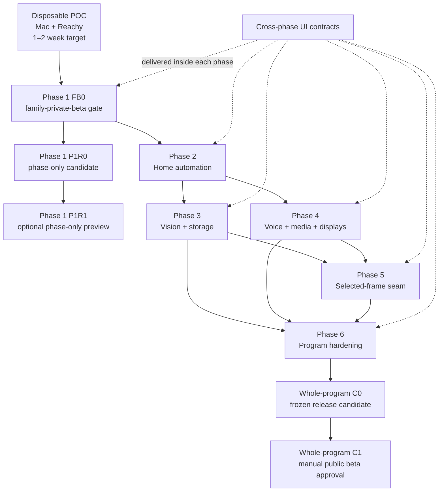

# Tuntun Six-Phase Master Implementation Roadmap

> **For agentic workers:** REQUIRED SUB-SKILL: Use superpowers:subagent-driven-development for bounded work packages in the current session, or superpowers:executing-plans for a checkpointed implementation session. This roadmap controls sequencing; the linked phase plans control exact files, tests, and commits.

**Goal:** Build Tuntun from a disposable Mac-and-Reachy bilingual voice proof into a family-ready, locally governed, open-source home-assistant platform without allowing later home, camera, media, AI, desktop, robot, plugin, or remote capabilities to bypass the identity, child-safety, privacy, authorization, audit, and recovery boundaries established earlier.

**Architecture:** Keep canonical household authority in a local modular monolith on the 2020 Intel Mac. Reachy and later room/display/robot endpoints are bounded edge devices. Home Assistant Green is the deterministic device plane. Reolink recording is a process/key/storage-separated video plane. Local and cloud models remain untrusted computation behind typed gateways. Every external effect uses an exact prepared authorization and truthful result. Optional capabilities are absent from package, configuration, API, UI, and runtime until their positive gate passes.

**Primary stack:** Python 3.12, FastAPI, Pydantic v2, SQLAlchemy 2/Alembic, SQLCipher, macOS Keychain/Secure Enclave ports, React 19/TypeScript/Vite, strict JSON Schema/JCS contracts, pytest/Hypothesis, Vitest/Testing Library/Playwright, Ruff/mypy, Home Assistant custom integration APIs, signed local mTLS/Unix-socket adapters, and synthetic evidence tooling. Hardware/provider/runtime selections remain behind ports and exact acceptance records.

**Normative specifications:**

- [Program architecture A–H](../specs/2026-08-27-tuntun-program-architecture-a-h.md)
- [Program assurance and delivery I–S](../specs/2026-08-27-tuntun-program-assurance-delivery-i-s.md)
- [Six-phase UI/UX](../specs/2026-08-27-tuntun-six-phase-ui-ux-design.md)
- [Phase 1](../specs/2026-08-27-tuntun-phase1-anchor-design.md), [Phase 2](../specs/2026-08-27-tuntun-phase2-home-automation-design.md), [Phase 3](../specs/2026-08-27-tuntun-phase3-vision-presence-storage-design.md), [Phase 4](../specs/2026-08-27-tuntun-phase4-voice-media-displays-design.md), [Phase 5](../specs/2026-08-27-tuntun-phase5-private-ai-desktop-robotics-design.md), and [Phase 6](../specs/2026-08-27-tuntun-phase6-remote-access-product-hardening-design.md)

---

## 1. Locked household baseline

| Boundary | Locked baseline |
|---|---|
| Core host | 2020 Intel MacBook Pro, 16 GB RAM, normally at home; FileVault and owner-only local administration required |
| Embodied endpoint | Reachy Mini Wireless; wake phrase “Hello Tuntun” |
| Language | English, Hindi, and natural Hinglish; follow the active speaker's switches within a conversation |
| Family | One owner/operator; adult partner; K2 child; N1 child; guarded child policy and distinct current-primary-guardian decisions |
| Initial inference | Quality-first approved cloud route, S$100 monthly soft warning and S$150 hard cap; offline essentials remain local |
| Memory | Local encrypted seven-kind memory with subject/audience/guardian visibility; no hosted canonical memory |
| Home devices | Twelve MOES Zigbee ceiling lights through existing MZHUB, tested first as a local Matter bridge; Home Assistant Green selected |
| Power | Signalling-capable UPS required for the Phase 2 family-ready gate; exact unit waits for current NUT compatibility and landed quote |
| Cameras | TrackMix in hall/pathway toward bedrooms; two E1-family units in kitchen from different views; exact SKU/firmware capability gates |
| Camera privacy | Audio off/stripped; Reolink never identifies or greets; raw media never reaches LLM/VLM, memory, Home Assistant, or cloud |
| Initial camera storage | Existing encrypted external SSD; exactly seven days low-resolution continuous plus 90 days full-resolution native-event clips |
| NAS | Decision pending until measured seven-day camera/storage campaign and one-/three-/five-year VMS/licence/power/recovery comparison |
| TVs | Samsung Neo LED 49-inch and TCL 42-inch; manual HDMI display first, exact-unit control/observation gates later |
| Network | Archer BE800 is outer/primary router; office laptop wired to it. ASUS GT-AX6000 is downstream inner router with three AX5400 AiMesh nodes |
| Remote boundary | LAN-only through Phase 5. Phase 6 implements Tailscale only, no forwarding/public bind/Funnel/subnet route/direct WireGuard |
| Robotics | Existing Raspbot and LILYGO hardware may be evaluated; no autonomous child supervision or model-generated motion |
| Distribution | Apache-2.0 framework, synthetic public fixtures, signed/notarized evidence-bound macOS beta |

These are design inputs, not permission to purchase conditional hardware, enable a vendor cloud, publish a release, or expose a network route.

## 2. Execution documents

| Scope | Controlling execution document |
|---|---|
| Phase 1 master work packages | [Phase 1 anchor plan](./2026-08-27-tuntun-phase1-anchor.md) |
| Phase 1 foundation | [Foundation execution](./2026-08-27-tuntun-phase1-foundation-execution.md) |
| Phase 1 conversation and Reachy | [Conversation/Reachy execution](./2026-08-27-tuntun-phase1-conversation-reachy-execution.md) |
| Phase 1 controlled web/search | [Controlled-web execution supplement](./2026-08-27-tuntun-phase1-controlled-web-execution.md) |
| Phase 1 identity and memory | [Identity/memory execution](./2026-08-27-tuntun-phase1-identity-memory-execution.md) |
| Phase 1 owner console | [Control-console execution](./2026-08-27-tuntun-phase1-control-console-execution.md) |
| Phase 1 packaging/release | [Phase 1 release execution](./2026-08-27-tuntun-phase1-release-execution.md) |
| Phase 2 | [Home-automation execution](./2026-08-27-tuntun-phase2-home-automation-execution.md) |
| Phase 3 | [Vision/presence/storage execution](./2026-08-27-tuntun-phase3-vision-presence-storage-execution.md) |
| Phase 4 | [Voice/media/displays execution](./2026-08-27-tuntun-phase4-voice-media-displays-execution.md) |
| Phase 5 | [Private-AI/desktop/robotics execution](./2026-08-27-tuntun-phase5-private-ai-desktop-robotics-execution.md) |
| Phase 6 | [Remote-access/product-hardening execution](./2026-08-27-tuntun-phase6-remote-access-product-hardening-execution.md) |
| Cross-phase UI | [Six-phase UI execution](./2026-08-27-tuntun-six-phase-ui-execution.md) |

If a linked phase plan and its normative phase specification differ, stop implementation and reconcile the contract, policy corpus, migration, generated client, feature manifest, tests, and documentation in one reviewed change. Do not silently choose the less restrictive wording.

## 3. Dependency and promotion graph



Rules:

1. Simulator, schema, UI-fixture, and adapter work for a later phase may begin after the consumed contract is frozen.
2. Household mutation, capture, media, execution, motion, or remote routes cannot open before every prerequisite positive gate passes on the real target.
3. Optional absence is an engineering result: package registration, configuration, routes, direct APIs, prepared-action issuance, UI, client bundle, and runtime entry points are all negatively tested.
4. A failure quarantines only the affected capability when separation is proved. It never grants a fallback with broader data or authority.
5. P1R0/P1R1 are Phase 1-only. Only Phase 6 can produce whole-program C0/C1.

## 4. Phase-by-phase delivery contract

| Phase | Family outcome | Entry | Mandatory exit | Conditional/absent result | Solo engineering estimate |
|---:|---|---|---|---|---:|
| 1 | Reachy bilingual personal family assistant, guarded profiles, seven memories, owner console, offline essentials | Supported Mac baseline and delivered Reachy probes | FB0 physical loop, child safety, Guest fallback, memory isolation, auth, privacy/stop, budget, backup/restore; later phase-only P1R0/R1 evidence | Automatic identity, Qwen, Realtime, LAN console, or advanced preview routes may be absent only where Phase 1 marks them optional; passive identity is always absent | 177.5 person-days for complete preview scope; aggressive FB0 feedback target 6–8 weeks, about 9–10 months solo for the full scope |
| 2 | Deterministic local lights, governed scenes/routines, screen-time simulator | Phase 1 FB0 stable; shared contracts reconciled | Green/UPS/recovery, one-light then twelve-light proof, signed HA bridge, policy corpus, durable results, Manual/Assisted/Learning, screen-time simulator, failures/restore/soak | Failed Matter bridge leaves estate native and opens a separately owner-approved ZBT-2 pilot; no silent reset or purchase | 8–12 focused weeks |
| 3 | Private local recording, owner alerts, optional anonymous occupancy | Phase 2 topology/event/auth contracts stable | Exact camera/zone/vendor-egress gates, TrackMix privacy arc, audio-off, seven-day capacity run, exact 7/90 deletion, gaps/full-disk/recovery, owner playback, local inbox/SSE alerts, false-vacancy prevention, NAS decision receipt | Ineligible E1/camera stays inventory/vendor-native only; unsupported TrackMix second view stays absent; NAS remains pending | 7–11 weeks plus any 30-day optional migration comparison |
| 4 | Whole-home voice endpoint, media, teaching display, exact-TV screen-time capability | Phase 2 signed bridge/simulator stable; Phase 1 room policies current | Hardware bakeoff, physical mute/indicator, duplicate arbitration, one-slot routing, legal media adapter, closed display renderer, exact TV probes, bounded screen-time enforcement, consent/accessibility/soak | TV stays manual/display-only or Advisory; second conversation and private-room rollout remain absent until their gates pass | 88–130 person-days, 18–26 focused weeks |
| 5 | Staged local inference, private corpus, bounded desktop help, supervised Raspbot | Phase 3 frame and Phase 4 endpoint contracts stable | Task-specific inference evidence, one identity-bound corpus root/recovery, owner-only desktop grant/egress, D3/D4 separation, anonymous CV, robot safety, optional-board decision, soak/rollback | No appliance purchase if benchmark fails; D4 absent without proved sandbox; robot stays simulation/bench if safety fails; LILYGO route removed if no unique value | 130–210 person-days, 26–42 focused weeks |
| 6 | VPN-constrained owner access, closed plugins, complete recovery/release hardening | Accepted Phase 1–5 mandatory gates and stable contracts | Tailscale least-route/app auth, exact two-capability no-egress plugin registry, `T01`–`T25`, supply chain, clean restore/update/rollback/uninstall, incidents/retirement, operations burden, C0 then C1 | Optional remote low-risk action/playback classes may remain absent; mandatory plugin and release gates cannot be waived; direct WireGuard absent | 8–12 focused weeks plus non-compressible soak/rolling evidence |

Estimates describe engineering effort, not permission to compress physical, seven-day, 30-day, 60-day maintenance-logging start, minimum-90-day/three-complete-month promotion evaluation, recovery, or family-soak evidence.

## 5. First eight weeks: feedback track

This track is deliberately narrower than complete Phase 1 implementation.

### Days 0–2 — delivered-hardware truth

- [ ] Inventory the exact Mac OS/build, disk reserve, FileVault, sleep/power settings, interfaces, listeners, and external SSD identity.
- [ ] Inventory the delivered Reachy Mini Wireless SKU, serial commitment, firmware, SDK/daemon version, network services, audio formats, camera APIs, buttons/LEDs, reboot behavior, and physical safety path.
- [ ] Keep Reachy on an isolated/test path until the daemon/media/API/WebRTC/SSH negative-reachability gate passes.
- [ ] Record content-free evidence outside Git; commit only synthetic fixtures and schema examples.

### Weeks 1–2 — disposable voice POC

- [ ] Implement local “Hello Tuntun” candidate wake, bounded post-wake capture, explicit push-to-talk diagnostic, stop/privacy, cloud STT/reasoning/TTS, bilingual reply, basic role-aware persona, and per-attempt cost reservation.
- [ ] Exclude biometrics, children in production, durable/personal memory, web, home control, cameras, document/desktop/robot, remote, and public packaging.
- [ ] Run the scripted English/Hindi/Hinglish quality, latency, stop, outage, cost, buffer-clearing, and content-scan corpus.
- [ ] Produce a keep/change/stop POC receipt. Do not harden disposable code into the family architecture without the Phase 1 contracts.

### Weeks 3–5 — canonical core

- [ ] Establish strict contracts, SQLCipher serialized unit of work, Keychain roots, audit/outbox, configuration, provider/cost gateway, one-turn state machine, offline timers/status, and owner authentication.
- [ ] Build the owner console shell, signed feature registry, Privacy Shield, health, approvals, audit, cost, backup, and subject/guardian exact-decision surfaces.
- [ ] Add owner and adult partner profiles with explicit consent and non-biometric selection/Guest fallback.
- [ ] Keep every device/camera/media/desktop/robot/remote domain absent from production registration.

### Weeks 5–8 — family-private-beta attempt

- [ ] Complete interaction-gated Reachy face/voice enrollment and liveness attempt; retain explicit profile choice and Guest if automatic personalization does not pass.
- [ ] Implement the seven memory kinds, subject visibility, child proposal plus separate current-guardian consent/approval, retrieval triple checks, deletion, and backup no-resurrection.
- [ ] Complete guarded child answer policy, no-web child baseline, English/Hindi/Hinglish corpora, controlled adult search, and exact provider disclosures.
- [ ] Run FB0 acceptance, two-hour/50-turn bounded-resource soak, seven-day maintenance rehearsal, and owner then second-adult staged family trial.
- [ ] Enable family use only for the exact FB0 feature manifest. Continue complete P1R0/R1 work on the longer evidence schedule.

## 6. Long-horizon release train

The safest solo sequence is:

1. complete the Phase 1 FB0 foundation and stabilize real household use;
2. finish the Phase 1 mandatory foundation used by hardware phases while continuing phase-only preview hardening;
3. commission Phase 2 Green/UPS and lights without resetting the estate until one-light proof;
4. build Phase 3 recorder/storage before alerts, and alerts before anonymous presence;
5. build Phase 4 in one common room before private/additional rooms;
6. run Phase 3 and Phase 4 contract work in parallel only where they share no mutable implementation state;
7. enter Phase 5 only after the frame, endpoint, display, policy, and sandbox inputs are stable;
8. run Phase 6 whole-system hardening only against accepted real feature manifests, then freeze C0 and separately approve/publish C1.

A single owner-engineer should plan roughly **24–34 months** for the complete six-phase scope when the Phase 1 full-preview estimate, Phase 2–6 focused ranges, hardware lead time, and non-compressible evidence are treated honestly. A useful family assistant arrives much earlier at FB0; later phases are independently valuable increments, not one all-or-nothing launch.

Safe calendar overlap:

| Can overlap | Must remain sequential |
|---|---|
| Synthetic contracts, fake adapters, UI fixtures, documentation, threat cases, procurement research | Real household enablement and owning-phase gates |
| Phase 3 recorder simulator and Phase 4 endpoint simulator after Phase 2 schemas freeze | Camera alerts after recording/storage truth; presence after alert/source calibration |
| Phase 5 model benchmark harness and corpus parser threat fixtures | Appliance purchase after benchmark; D4 after sandbox proof; robot floor run after bench/e-stop proof |
| Phase 6 release tooling and synthetic plugin sandbox research | Remote route after P1–5 auth/operations; C0 after every mandatory gate; C1 after unchanged C0 artifacts |

## 7. Cross-phase workstreams

### 7.1 Contracts and feature registration

- [ ] Keep one strict schema registry with generated Python/JSON/OpenAPI/TypeScript artifacts.
- [ ] Use `area_id` as the sole canonical household location; `zone_id` is a versioned child of one area and binding generation.
- [ ] Register a capability only with schema, policy, retention, auth, UI, audit, backup/restore, failure behavior, and negative tests.
- [ ] Reject unknown major versions, fields, enum values, payload variants, signature domains, capabilities, and action types.

### 7.2 Identity, subjects, and memory

- [ ] Keep Reachy identity interaction-gated; store no unknown/passive candidate or re-encounter history.
- [ ] Treat biometrics as personalization evidence only; use confirmations/passkeys for authority.
- [ ] Enforce subject/audience/guardian/consent checks before search, decryption, and serialization.
- [ ] Ensure system administration never reveals a `subject_private` or `guardian_child` body to an otherwise unauthorized owner.

### 7.3 Privacy and truthful state

- [ ] Implement one canonical Privacy Shield generation transaction and the complete cross-phase effect registry.
- [ ] Report authority revocation, stop requested, acknowledged, physically verified, and unverified as different states.
- [ ] Keep independent Reolink recording, manual/HA device control, media, and already completed egress/write facts visible.
- [ ] Make every stop, delete, export, retention, remote, and physical-state statement testable and source-attributed.

### 7.4 Authorization and external effects

- [ ] Server-prepare every mutation from current resource/policy/principal/generation facts.
- [ ] Bind exact principal slots and enforce owner/guardian distinctness where required.
- [ ] Atomically commit authorization/audit/outbox before external I/O.
- [ ] Reconcile unknown effects; never invent success or retry under a new key automatically.
- [ ] Return complete, ordered per-target results for multi-target operations.

### 7.5 UI and accessibility

- [ ] Deliver owner console, Reachy interaction, subject/guardian one-use ceremony, and shared-display surfaces as separate trust zones.
- [ ] Ship the UI work assigned to each phase before that phase's family gate; do not postpone it as dashboard polish.
- [ ] Maintain English/Hindi/mixed-script, keyboard, VoiceOver, 200% zoom, 320-pixel width, high contrast, reduced motion, and safe degraded-state fixtures.
- [ ] Keep absent routes out of navigation, direct URL, API, prepared-action issuance, feature registration, and client bundles.

### 7.6 Security, evidence, and operations

- [ ] Map every control to `T01`–`T25`, a test/evidence command, owner, expiry, and revalidation trigger.
- [ ] Use synthetic fixtures in Git/CI; keep household evidence encrypted and ignored outside source.
- [ ] Pin dependencies/models/actions, generate SBOM/licence records, scan secrets/private data, and quarantine drift.
- [ ] Prove backup, restore, update, rollback, uninstall, device retirement, owner lockout, and incident containment before relying on them.
- [ ] Evidence logging may begin after 60 steady-state days; evaluate the rolling three-month median for promotion only after at least 90 steady-state days and three complete monthly buckets, then hold ordinary full-system owner maintenance to at most eight hours/month; three consecutive months above eight freeze expansion.

## 8. Procurement gates

| Purchase | Earliest decision point | Required evidence before order |
|---|---|---|
| Home Assistant Green | Phase 2 P2-0 | Exact SKU/current landed quote, warranty/return, network placement, backup plan |
| UPS | Phase 2 P2-0 | Exact hardware revision, current NUT driver/signalling, complete connected load, estimated runtime, shutdown/recovery plan, landed quote |
| ZBT-2 | Only after MZHUB one-light bridge failure and owner approval | Failure record, exact MOES identifiers, one-light migration/rollback plan, stock/landed quote |
| Reolink Home Hub/NVR | Phase 3 source-path decision only | Exact E1 compatibility, local/WAN-off behavior, channel/view/licence count, retention/export/recovery limits |
| NAS/VMS | After Phase 3 seven-day campaign | Measured 3/4/6/8 stream capacity, drives/RAID/backup/UPS/licences, one-/three-/five-year TCO, owner maintenance, recovery and exit plan |
| Room endpoint fleet | After Phase 4 one-room bakeoff | Exact winner's acoustic/privacy/mute/indicator/update/recovery/maintenance evidence; buy one room at a time |
| TV/CEC/IR adapter | After exact-TV probe | One capability gap, desired-state operation, separate observation evidence, manual override and no-hostile-loop proof |
| Local inference host | After Phase 5 named-task benchmark | Quality, bilingual safety, latency, throughput, privacy, watts/noise/thermal, maintenance, three-year TCO, rollback; entry 1.5–3.5k, preferred 24 GB 3.5–7.5k, 48 GB+ 8–18k SGD are separate planning tiers |
| Raspbot modifications | Phase 5 safety gate | Physical e-stop, barriers/sensors/power, exact owned-kit inventory, stopping-distance/geofence plan |
| Apple Developer membership | Phase 6 release path | Decision to produce a notarized public macOS beta and current local price/tax/account eligibility |

No marketplace listing, foreign list price, brand label, protocol logo, or model-loading demonstration is procurement approval.

## 9. Gate ledger

| Gate | Meaning | May be waived? |
|---|---|---|
| POC receipt | Disposable physical voice-loop learning decision | No; a failed POC changes the approach rather than being relabelled family-ready |
| `FB0` | First Phase 1 family-private-beta eligibility | No mandatory safety/privacy/auth/child/recovery requirement may be waived |
| `P1R0` | Phase 1-only release-candidate preview | No; optional feature absence follows Phase 1's explicit list and negative tests |
| `P1R1` | Optional Phase 1-only Apache preview publication | No; never represents whole-program readiness |
| P2-0…P2-7/P2-F | Home commissioning and conditional direct-Zigbee gates | Only P2-F is conditional; it needs a separate owner decision |
| P3-0…P3-6 / conditional P3-F | Camera/storage/alerts/presence gates | Conditional cameras/views/sensors and the migration pilot may remain absent; privacy, audio, storage truth and access gates cannot |
| P4-0…P4-7 | Endpoint/media/display/TV/room rollout gates | Exact TV/room/second-slot capabilities may remain at their weaker declared state; no false enforcement |
| P5-0…P5-9 | Inference/corpus/desktop/perception/robot gates | Appliance, D4, robot floor, or LILYGO routes may be absent as explicitly defined; no weaker execution/motion path |
| P6-0…P6-5 | Remote/plugin/recovery/release hardening | Optional remote scopes may be absent; mandatory plugin, recovery, security and release gates cannot |
| `C0` | Frozen whole-program release candidate on one commit/version/feature manifest | Never; any tracked or evidence-policy change invalidates it |
| `C1` | Separate manual public beta approval over unchanged C0 artifacts/evidence | Never; CI cannot infer it and publication remains manual |

## 10. Evidence packet and repository discipline

Every task-level commit must include or update:

- failing test observed first and passing narrow/affected suites afterward;
- strict schema and generated artifact diff when a contract changes;
- threat/control/test reference for a trust-boundary change;
- synthetic fixtures only;
- rollback/quarantine behavior for migration or external effect;
- exact file staging and reviewed `git diff --cached --check`;
- no secrets, household names, media, memories, local identifiers, absolute private paths, device credentials, or production evidence in Git.

Every phase promotion packet binds:

```text
phase_and_gate
candidate_version_and_commit
feature_manifest_digest
schema_policy_migration_versions
hardware_firmware_configuration_commitments
dataset_corpus_and_seed_versions
test_commands_and_start_end_times
metrics_and_thresholds
fault_recovery_and_negative_reachability_results
privacy_security_content_scan_results
known_limitations_and_absent_features
artifact_hashes
operator_reviewer_and_expiry
owner_approval_or_rejection_commitment
```

The packet contains commitments and aggregate evidence, not raw family content. Real local evidence is stored under an ignored owner-only evidence root with encryption, retention, and deletion policy.

## 11. Program completion definition

The six-phase design-and-plan package is implementation-ready when:

- [x] all nine normative specifications are internally consistent and pass link, fence, Mermaid, terminology, and whitespace checks;
- [x] each phase has a detailed file/test/interface/task execution plan and the UI has a cross-phase execution plan;
- [x] the master plan maps every locked household decision, purchase gate, dependency, release gate, and deferment;
- [x] no passive identity; no Reolink identity/audio or raw-media edge to an LLM, VLM, memory, Home Assistant, or cloud; and no unrestricted HA/model/desktop/plugin/robot authority, public inbound route, or silent optional fallback remains;
- [x] the canonical area/zone, memory visibility, Privacy Shield, alert delivery, selected-frame, desktop egress/D3/D4, remote/plugin, recovery, maintenance, and C0/C1 contracts agree across documents;
- [x] a clean repository audit identifies the exact document set and no unintended user file is changed;
- [x] the final handoff clearly distinguishes completed design work from code/hardware implementation still to execute.

The product itself is complete only after C1 is explicitly approved and the immutable artifact is manually published. Writing or accepting this roadmap is not C0, C1, a hardware purchase, a family-use authorization, or a release.
