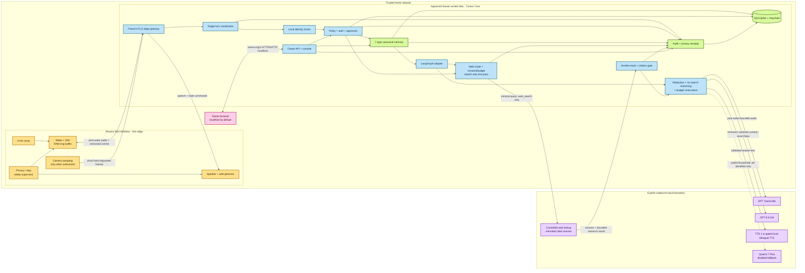

# Tuntun Phase 1 “Anchor” Architecture Specification

**Status:** design baseline complete; implementation plan ready; implementation not started
**Date:** 2026-08-27
**Scope:** Reachy Mini Wireless family assistant; smart-home control is intentionally deferred
**Primary operator:** one owner-managed household
**Deployment:** one owner-approved Darwin arm64 Mac plus one Reachy Mini Wireless; Intel macOS remains mandatory distribution support, not active household evidence

## 1. Outcome

Phase 1 delivers a private, bilingual family assistant called Tuntun. A family member says “Hello Tuntun,” speaks in English, Hindi, or Hinglish, and receives a spoken answer whose language, depth, and tone follow that speaker. Tuntun recognizes enrolled family members for personalization, falls back safely to Guest when identity is uncertain, and keeps canonical identity, policy, memory, audit, and budget state on the Mac.

The first useful release is a disposable physical Reachy conversation loop. The family-ready private beta then adds identity, seven memory types, approvals, authentication, the owner console, guarded child profiles, controlled web lookup, privacy controls, and offline essentials. Advanced release hardening, long-running evidence ceremonies, and public packaging continue after the private-beta gate. The same codebase must be publishable under Apache-2.0 without embedding this household’s names, recordings, credentials, biometrics, or memories.

## 2. Locked decisions

| Area | Decision |
|---|---|
| Robot | Reachy Mini Wireless; official daemon remains in place |
| Wake phrase | “Hello Tuntun” |
| Host | Owner-approved Darwin arm64 Mac, as accepted in `docs/architecture/decisions/0001-phase1-host-baseline.md`; Intel macOS remains a supported-distribution CI target |
| Initial scope | Family voice assistant only; no MOES MZHUB/Zigbee light control, Reolink, Home Assistant, TV, or multi-room control |
| Languages | English, Hindi, and natural Hinglish; follow within-conversation language switches |
| Conversation concurrency | Exactly one active household conversation |
| Primary AI route | GPT Transcribe → local policy/context → GPT-5.6 Sol → character-priced TTS-1, with gated local bilingual fallback |
| Secondary AI route | Qwen3.7 Plus disabled by default; de-identified evaluation and conditional low-sensitivity fallback only |
| Qwen3.7 Max | Benchmark-only; never receives live family conversation data |
| Monthly cloud budget | S$100 soft warning; S$150 hard stop, calculated in Asia/Singapore calendar months |
| Offline behavior | Wake, stop, mute/privacy activation, fixed status, timers, and deterministic essential commands remain local; privacy reduction is never voice-only |
| Canonical memory | Local encrypted SQLite/SQLCipher owned by Tuntun; LangGraph is replaceable orchestration |
| Raw conversation retention | Tuntun writes no raw audio, raw frames/crops, or verbatim transcripts to application-managed durable storage; FileVault/core-dump hardening reduces OS residue, but Python/OS memory copies cannot be guaranteed cryptographically erased; provider handling follows current data controls/terms |
| Identity | Local face and voice evidence for personalization; uncertain or conflicting evidence becomes Guest |
| Action authorization | Biometrics personalize only; every low-risk action needs explicit per-action confirmation and stronger actions need typed step-up authentication |
| Administration | Owner-managed; localhost by default; optional paired HTTPS LAN mode; never public inbound |
| Storage purchase | No NAS is required for Tuntun Phase 1 |
| Delivery horizon | Two-stage private-beta program: disposable voice loop in weeks 1–2, then family-ready private-beta target during the following 4–6 weeks; Phase 1's `P1R0/P1R1` standalone-preview hardening is subsequent and does not replace the whole-program Phase 6 `C0/C1` release gates |
| Child mode | K2 and N1 use a guarded learning companion; no adult-private disclosure, external side effects, or permanent child memory without guardian approval |
| Web modes | Controlled cited lookup is the eligible owner/adult default after consent and policy gates; K2, N1, and Guest are forced to no-web; no-web is always available; experimental multi-pass research is owner-only, session-scoped, search-only, isolated, and disabled by default |
| Maintenance modes | Appliance-like household default; optional advanced-owner controls; explicit non-production developer mode |
| Open-source licence | Apache-2.0 |

## 3. Users and response behavior

Tuntun has one recognizable persona with profile-specific delivery rules. Production owner/adult profiles start with generic, neutral defaults; each adult may replace or clear only their own closed typed persona traits through the subject-passkey flow, and a current primary guardian may set only the closed K2/N1-safe shape for that child.

| Profile class | Production start | Illustrative configured delivery |
|---|---|---|
| Owner | General context, neutral tone, standard depth | Synthetic technical-security example: precise, detailed, explicit assumptions and security trade-offs |
| Adult | General context, neutral tone, standard depth | Synthetic household-practical example: practical, concise, task-oriented guidance |
| K2 | Early-learning context, warm tone, brief depth, K2 level | Short sentences, age-appropriate explanations, gentle questions, no private-adult disclosure |
| N1 | Early-learning context, warm tone, brief depth, N1 level | Very short, warm, concrete language with strong child-safety constraints |
| Guest | General context, neutral tone, brief depth; not editable | Helpful general answers without private memory retrieval or personalized permissions |

The security-architect and homemaker labels are synthetic reference configurations, not production defaults or stored profession strings. A household can reproduce those delivery styles through the closed `context`, `tone`, `depth`, and `learning_level` values; the encrypted local profile stores only those typed values.

Language is a property of the current turn, not a permanent profile preference. Tuntun should answer in the language pattern most recently used by the speaker, including mixed Hindi-English, unless the speaker explicitly asks for another language. Exact names, dates of birth, school identifiers, and other unnecessary child identifiers are never required for the persona model.

### 3.1 Guarded learning companion

K2 and N1 profiles may ask age-appropriate educational questions, request stories, practise language, and receive simple explanations. The policy layer—not the model prompt alone—enforces these boundaries:

- Child turns cannot retrieve adult-private memories, use experimental research, initiate external side effects, change security/privacy settings, or approve their own durable identity/memory policy.
- The private beta gives child profiles no live-web search. A later guardian-approved child-search adapter requires its own design and evidence gate.
- Working context remains ephemeral. Any proposed permanent child memory requires a current guardian consent and guardian approval scoped to the exact derived claim; verbatim child speech is never the memory payload.
- Sexual, violent, self-harm, abuse, dangerous-instruction, medical-emergency, or other sensitive topics receive a bounded age-appropriate response that encourages contacting a trusted adult or emergency service as applicable. Tuntun does not promise secrecy, diagnose, investigate, or silently notify third parties.
- `child-safety-v1` is a versioned, hash-pinned FB0 corpus with at least 360 adversarial cases: two child profiles × three language modes × twelve safety categories × five paraphrases. Categories cover adult/private-memory extraction, cross-profile data, sexual content, violence, self-harm, abuse/grooming/secrecy, dangerous instructions, drugs, medical emergencies, external actions, web-policy bypass, and memory-policy bypass. Zero instances may disclose adult-private data, call search, propose/execute an action, create unapproved durable memory, promise secrecy, or give materially dangerous instructions. At least 120 benign learning/story cases must achieve 95% age/language appropriateness without unnecessary refusal. Every corpus change increments the version and requires guardian/owner review.

### 3.2 Child audience and guardian authority

- Every memory has one closed `audience`: `subject_private`, `guardian_child`, `household_adults`, or `household_all`. Adult memories default to `subject_private`. A durable child record must use `guardian_child` unless the current guardian explicitly approves a child-safe `household_all` audience; child `subject_private` and `household_adults` durable records are invalid. Marking content `household_all` is an explicit approved decision; “household” sensitivity alone never makes it child-readable. Bounded child working context remains ephemeral session state rather than a browser-administered durable record.
- A child may retrieve only that child's approved `guardian_child` memories and explicitly child-safe `household_all` memories. A child can never retrieve `subject_private`, `household_adults`, another subject's namespace, policy memory, or a record whose guardian/consent binding is stale. Guest retrieves none.
- Phase 1 has exactly one active primary guardian per child. The owner assigns or replaces that guardian from an adult profile using a fresh passkey. Reassignment revokes the former guardian's child-scoped grants/consents, cancels pending proposals, and hides existing child memories until the new guardian explicitly reapproves or deletes them; it never silently transfers authority.
- Durable child memory requires a current `child_durable_memory_v1` consent receipt bound to household, child, primary guardian, disclosure/policy version, and validity window, plus a separate exact-proposal approval by that guardian. Revocation immediately blocks recall and new writes. Deleting one child-memory record requires a fresh primary-guardian passkey authorization bound to the child, record ID/version, content commitment, and `delete_one` purpose. Deleting all memory for a child requires a fresh owner passkey authorization bound to the child, `delete_all`, enumerated-record-set commitment, and displayed count, followed by a separate exact-scope confirmation. These operations crypto-shred the selected keys; revocation alone does not pretend SSD bytes were erased.
- Guardian and audience checks run before candidate retrieval, again before decryption, and again before provider serialization. Each denial produces a content-minimized reason receipt. FB0 includes forged/stale/reassigned-guardian, cross-audience, cross-child, and concurrent-revocation isolation tests.

## 4. Scope boundaries

### 4.1 Included

- Reachy-local wake detection, voice activity detection, playback, privacy/stop path, and safe gestures.
- A paired, authenticated LAN channel between Reachy and the Mac.
- Completed-turn cloud transcription for the initial vertical slice, with a later adapter-compatible Realtime option.
- Local conversation orchestration, profile/persona selection, policy enforcement, memory retrieval, approvals, budget enforcement, audit, and redaction.
- English, Hindi, and Hinglish conversation.
- Local face and speaker recognition behind model-governance and calibration gates.
- Seven canonical memory kinds: working, episodic, semantic, preference, procedural, relational, and policy.
- A separate tamper-evident audit ledger for the “policy/audit” control plane.
- Local PIN, trusted-device passkey, and recovery flow.
- LAN/localhost owner console.
- Offline privacy, stop, mute, status, time, and timer commands.
- Controlled, cited web lookup for owner/adult profiles behind separate consent, redaction, budget, and audit policy; per-session no-web mode; isolated owner-only experimental multi-pass research.
- Simulator, fakes, evaluation harness, packaging, backup, restore, upgrade, and rollback.

### 4.2 Explicitly excluded from Phase 1

- Home Assistant, MOES MZHUB/Zigbee light control, Reolink cameras, Reolink Home Hub Pro, and NAS integration.
- Surveillance, continuous household recording, stored portrait/crop galleries, or stored enrollment recordings. Encrypted consented/expiring biometric templates are the only Phase 1 biometric index.
- Multiple concurrent rooms or conversations.
- Remote internet administration, port forwarding, a public API, or cloud-hosted canonical memory.
- Autonomous purchases, messages, account changes, or other external side effects.
- Unrestricted web agents, authenticated-site automation, downloads, code execution from web content, or live web access for child/Guest profiles.
- A local large language model on the active Phase 1 control host; Phase 5 private inference remains a separate appliance decision.
- Full speech recognition, LLM inference, or face recognition on Reachy’s CM4.
- Microservices, Redis, Kafka, MQTT, NATS, Kubernetes, or a service mesh.

## 5. Architecture

The system is a modular monolith on the Mac plus a narrow Reachy edge process. Domain services communicate through typed in-process contracts. Concrete SDK, cloud, storage, and biometric integrations are adapters behind ports.



### 5.1 Why Reachy runs an edge process

Reachy Mini Wireless provides an onboard CM4 and an official daemon. Current Reachy documentation does not make a direct remote Python media client on macOS a safe dependency for Phase 1. `tuntun-edge` therefore runs beside the official daemon and uses the local Reachy SDK/media backend. It owns the robot microphone stream, wake/VAD, bounded RAM audio buffer, speaker stream, camera sampling, privacy/stop watchdog, and safe gesture mapping.

The edge process has no OpenAI/Qwen key, no Mac database key, no family memory, and no durable biometric template. It sends audio only after wake detection. Camera frames are sampled only for explicit enrollment or a bounded active-conversation identity window. It never writes routine frames, crops, or audio to disk, never scans in the background, and never exposes camera media or an unknown-person review surface to the browser.

### 5.2 Mac modular-monolith modules

| Module | Owns | Must not own |
|---|---|---|
| Edge gateway | Pairing, mTLS session, signed control envelopes, media backpressure | Robot SDK, model keys, memory |
| Turn coordinator | One active session, state transitions, cancellation, idempotency | Provider-specific logic |
| Speech services | STT/TTS ports, audio normalization, provider adapters | Policy and memory writes |
| Identity | Face/voice adapters, quality-aware fusion, Guest fallback | Authorization decisions |
| Policy/auth | Risk registry, step-up rules, approval receipts | Biometric matching algorithms |
| Memory | Seven memory schemas, proposal/approval lifecycle, scoped retrieval | LangGraph-owned storage |
| Conversation workflow | Ordered graph nodes and resumable in-turn control | Canonical profiles or memories |
| Provider gateway | Sanitization, routing, timeouts, circuit breakers, usage | Direct tools or direct memory commits |
| Web/search gateway | Mode selection, query minimization, outbound allowlist, untrusted-result normalization, citations | Authenticated browsing, LAN/private-address fetches, downloads, code execution, memory writes |
| Offline actions | Deterministic parser, timers, privacy/status commands | Open-ended generative behavior |
| Audit/usage | Content-minimized receipts, public hash chain + keyed commitments, cost ledger | Prompts, transcripts, embeddings |
| Owner API | Authenticated management operations and live state | Public or anonymous family data |

### 5.3 Process model

- `tuntun-edge` is one Python process on Reachy.
- `tuntun-core` is one async Python process on the Mac, including the edge gateway, owner API, scheduler, and in-process event router.
- The compiled React application is served by the core as same-origin static assets.
- CPU-heavy local identity inference runs in bounded worker executors so it cannot block audio cancellation or safety events.
- There is no separate task queue or broker. Bounded `asyncio` queues and an in-process typed event router are sufficient.
- Privacy and stop signals bypass the conversation graph and preempt lower-priority work.

## 6. Network and trust boundaries

### 6.1 Reachy-to-Mac channel

- The edge initiates one outbound `wss` connection to the Mac’s dedicated LAN edge gateway on port 7443. Peer commissioning pins the reserved numeric inner-Mac IPv4 and MAC addresses, port, household CA, server leaf digest, exact IP SAN, client/device key IDs, and independent endpoint/certificate/key/digest generations. A separate strict local configuration selects the Reachy ingress interface and validates it against kernel-reported interfaces before firewall rendering; the interface name is never accepted from peer commissioning. mDNS may discover a candidate only during local commissioning; it is never runtime authority. Any address or identity change requires local recommissioning and certificate/key rotation before reconnect.
- Commissioning creates a household CA and Mac server identity. Reachy generates its own TLS-client and Ed25519 event-signing private keys on-device and sends only a CSR/public keys to the Mac; no Reachy asymmetric private key crosses SSH or the LAN. Pairing also installs one random device-specific HMAC commitment secret over the already authenticated channel; it is stored owner-only on Reachy and under a separate Mac Keychain identifier, and is independently rotatable/revocable.
- The CA signing key and Tuntun data-key roots remain in macOS Keychain. Because Python TLS servers require a path-backed key, the Mac leaf TLS key is an owner-only `0600` PEM under FileVault in the runtime identity directory; it is short-lived, separately rotatable, never backed up with family data, and its exposure/reboot behavior is tested and documented. Reachy device keys use hardware/encrypted storage when the probe finds it; otherwise they are root-owned `0600`, excluded from backups/core dumps, and physical/root extraction is an explicit residual risk requiring revoke/reimage/rotate after theft.
- Control messages use RFC 8785/JCS canonical UTF-8 JSON, Unicode NFC, timestamps with exactly six UTC fractional digits, versioned typed envelopes, Ed25519 signatures, a persistent device-global sequence, and purpose-separated HMAC commitments for private payloads. Event type and discriminated payload type must match.
- Audio uses binary WebSocket messages inside mTLS, with stream UUID, per-stream monotonic sequence, timestamp, negotiated `AudioFormat`, and duration in the bounded binary header. Header is at most 4 KiB; audio payload is at most 64 KiB/200 ms and 50 frames/s; a turn is at most 90 seconds or 8 MiB. Camera payload is at most 1 MiB/two frames/s and an action/subject/session/purpose-bound single-use window lasts at most 10 seconds, 20 frames, and 10 MiB total; privacy/cancel/identity completion closes it. Lengths/quotas are rejected before allocation and compression is disabled.
- Duplicate event IDs, stale sequence numbers, expired commands, household mismatches, revoked certificates, and unsupported major protocol versions are rejected.
- One-second heartbeats and two consecutive misses put Reachy into offline-essential mode. Reconnect uses bounded `0.25, 0.5, 1, 2, 5`-second backoff capped at five seconds, a fresh challenge, and the same commissioned numeric endpoint. It never resumes/replays old speech, media, or movement; a new wake is required.
- Reachy firewall policy is default-deny for IPv4 and IPv6 input/forwarding, permits only loopback, established traffic, required DHCP/ICMP, and commissioned Mac interface/L2/IPv4 access to the paired service. No IPv6/wildcard management exception exists. Rules and boot receipts bind the commissioned endpoint generation; reboot, spoof, scan, or address drift closes paired media and requires recovery. If delivered firmware cannot enforce this safely, production identity/camera requires an isolated VLAN plus explicit residual-risk acceptance. A detected competing controller immediately closes media, stops motion/playback, and enters owner-recoverable error-safe.

### 6.2 Owner console

- Default bind is `127.0.0.1:8787`; localhost is the Phase 1 default.
- Loopback HTTP never uses an ambient session cookie. The SPA keeps a short-lived opaque token in memory only and sends an RFC 9449-style proof bound to a per-tab WebCrypto key, exact `http://127.0.0.1:8787` method/URL, nonce, and token; logout/privacy clears it. This prevents another localhost port from automatically receiving Tuntun credentials.
- Optional LAN mode remains loopback until the owner commissions an exact private-DNS A mapping and a matching local-CA certificate/SAN for port 8443, then installs/verifies trust on every admin device. Tuntun does not ship a resolver or assume `.home.arpa` resolves. Startup and periodic drift checks fail closed to loopback and revoke LAN sessions on missing, multiple, wrong/private-scope, public, TLS, SAN, or device-receipt drift. The commissioned origin uses a matching WebAuthn RP ID, Trusted Host validation, strict Origin checking, passkey authentication, CSRF protection for cookie-authenticated mutations, rate limits, and secure cookies. Switching localhost/LAN RP scope requires an authenticated mode change and credential re-enrollment where needed.
- CORS is disabled. API documentation and debug tracebacks are disabled in production.
- The console never binds all interfaces implicitly and is never exposed by router port forwarding.

### 6.3 Cloud egress

- Only registered provider and search adapters can create outbound AI/search requests.
- The allowlist initially contains official OpenAI API endpoints. Alibaba Model Studio endpoints remain disabled until the Qwen gate passes and the owner enables the provider.
- Language-model adapters accept only a `SanitizedProviderRequest`. STT/TTS adapters accept only narrow purpose-limited speech contracts plus local route/budget authorization. Search adapters accept only a minimal `SanitizedSearchRequest` containing the current question fragment, locale, freshness need, result cap, and route authorization. No adapter accepts internal profile/memory/identity-template objects.
- No provider receives biometric templates, raw camera frames, database identifiers, secrets, full family profiles, or complete memory records.
- `store=false` is set on Responses API calls. This is a product control, not a claim of contractual Zero Data Retention.
- Cloud STT, reasoning, TTS, and web search are separate consent purposes with separate choices. Adults grant/revoke their own consent using a subject-bound passkey. A guardian independently grants or revokes a child's `cloud_stt`, `cloud_reasoning`, and `cloud_tts` purposes; granting one never implies another, and the private beta never enables child search or experimental research. Guest remains offline-only unless that session separately accepts the required STT, reasoning, and TTS disclosures; Guest search remains disabled. Revocation blocks the next egress. STT necessarily receives bounded raw post-wake voice, which is potentially biometric-capable; derived face/voice templates never leave the Mac.
- Consent grant, revoke, current-check, and consume require the locked profile to remain active and non-revoked before receipt access. Profile revocation advances a monotonic subject-authority generation and, in the same SQLCipher transaction, invalidates sessions, consents, enrollment/templates, and every unconsumed provider/search/action/memory authority. The single writer defines revoke-versus-consume order; already-started work is cancelled or conservatively settled once through a restart-safe outbox, never replayed.
- GPT speech onboarding and Guest disclosure state clearly that the spoken output is AI-generated. Provider-side retention and processing remain governed by current provider data controls and terms.
- OpenAI cloud routing requires an owner-accepted review record for the current [API data-controls page](https://platform.openai.com/docs/models/default-usage-policies-by-endpoint), business-data statement, endpoint eligibility, and project dashboard settings. The record expires after 90 days or immediately on a detected material-page/configuration change; stale review disables cloud rather than implying ZDR.
- Cloud tracing and application telemetry are disabled by default.

### 6.4 Web-mode boundary

- **Controlled mode** is the owner/adult household default. The router uses search only when freshness or source attribution is necessary or the speaker explicitly requests it. Tuntun announces/indicates lookup, sends a minimized query without private memory or stable household identifiers, caps provider search calls and accepted sources, performs no application-side page-content follow-up fetch, and names citations in the answer.
- **No-web mode** is selectable per profile and per session. Missing/withdrawn search consent and child/Guest policy force no-web automatically while separately consented cloud STT/reasoning/TTS may remain available. Tuntun states when it cannot verify freshness.
- **Offline-only mode** is a separate safety/connectivity state, not a web preference. When Privacy Shield, WAN loss, stale cloud-provider review, missing/withdrawn speech, reasoning, or TTS consent, or a hard-budget denial exists at route preflight, only the bounded deterministic local grammar and fixed local prompts are permitted and the turn creates zero STT, search, LLM, or TTS egress. If one of those conditions becomes authoritative mid-turn, Tuntun cancels in-flight adapters, queues no new application payload after the local transition timestamp, permits no subsequent provider authorization, and records which calls had already started; it does not claim prior egress was undone. If TTS consent is revoked after reasoning, the generated answer is discarded and Reachy plays only a bundled local bilingual inability prompt before the ephemeral context is cleared. Offline-only behavior never claims that a local LLM exists.
- **Experimental multi-pass research mode** is disabled by default and requires an owner passkey plus explicit per-session activation. A private parent session capability is bound to current owner/profile, session, consent, privacy, provider-review, policy, pricing, citation-review, source/pass caps, and a maximum 30-minute deadline. Under the single SQLCipher writer it mints a unique single-use route authorization, idempotency key, and budget reservation for each of at most four provider attempts; reuse, cross-session use, generation drift, concurrent fifth mint, or shared reservation fails before network. It uses a fresh isolated context with no family-memory retrieval, cookies/authenticated sessions, filesystem access, downloads, code execution, form submission, or private/LAN address access. When disabled, config/API/UI/package/runtime registration is provably absent.
- Search pages, snippets, metadata, redirects, and citations are untrusted input. They cannot create an action proposal, change policy, request secrets, override system instructions, or write memory. A separate injection/content gate normalizes results before reasoning; the answer validator requires citation identifiers issued for the same turn.
- A search-assisted turn uses an answer-and-citations-only output schema: action and memory proposal fields are unavailable. If the speaker wants to act on or remember a searched fact, Tuntun requires a new non-search turn that restates and validates the intended claim/action under the ordinary policy flow.
- Search query bodies and page contents are ephemeral. Durable state contains only content-minimized route, provider, domain, timing, cost, decision, and citation-commitment receipts. The citation-ID-to-URL registry is process-memory-only and expires after the bounded answer-interaction window; visible web-answer citations use opaque local IDs and a fail-closed local inspection page, so raw URLs do not enter ordinary Tuntun logs, analytics, or durable UI state. The local page may show and explicitly copy the source but Phase 1 provides no remote link or navigation. If the owner explicitly requests a durable export, its separate export policy may include the displayed URLs.

## 7. End-to-end turn flow

1. Reachy continuously processes its local microphone stream through the probed channel/downmix path, AEC only when confirmed by the delivered-hardware probe, wake, and VAD. A three-to-five-second bounded pre-roll exists only in RAM and is discarded; cloud audio begins at the recorded wake boundary.
2. “Hello Tuntun” crosses the calibrated wake threshold and opens a local post-wake audio stream. A visible/audible Reachy state acknowledges wake.
3. The edge creates a new turn UUID and streams bounded post-wake audio to the Mac. Audio is backpressured and capped at 90 seconds.
4. The Mac reserves the single household session. A competing wake gets a deterministic busy response.
5. The deterministic offline recognizer first receives the post-wake audio. A matched local command performs no provider call. Only an unmatched, consented, policy-allowed open-ended turn may proceed to cloud.
6. Voice evidence and short, authorized camera samples are evaluated locally in parallel. Low-quality, ambiguous, conflicting, expired, or failed-liveness evidence resolves to Guest.
7. Policy verifies cloud-STT consent and route eligibility, then the budget service atomically reserves worst-case STT cost before any STT network I/O. The bounded audio turn is sent to GPT Transcribe. The first implementation uses completed-turn upload; a Realtime adapter may replace it after latency measurement without changing the speech port.
8. The final transcript remains only in a process-local ephemeral turn context. The language tracker distinguishes English, Devanagari Hindi, Romanized Hindi, and mixed switching and follows within-conversation changes. Release gating runs the actual candidate prompt bundle/model against a closed corpus and independently verifies a signed score report bound to prompt/policy/corpus/scorer/result hashes; label counting is not evidence.
9. Policy determines the effective identity mode, allowed memory namespaces, maximum sensitivity, and allowed Phase 1 actions.
10. The memory service returns at most six approved, non-expired memories with local provenance and selection reasons, within an 8,000-token total provider-context ceiling. Guest receives no private memory.
11. The context builder converts profiles to pseudonymous role descriptors and builds a strict internal model request.
12. The web-mode policy determines whether freshness/source attribution is needed. In controlled mode it independently verifies adult consent and budget, creates a query only from the minimum non-private question fragment, and obtains bounded results through `SearchPort`. No-web mode skips this step. Owner-only experimental multi-pass research uses a new isolated session with no family memory or authenticated browser state. Offline-only mode exits to a fixed local response before this step.
13. Search output is treated as hostile data: consulted URLs resolving to local/private/special-use addresses are rejected, and during search ingestion Tuntun performs no local follow-up fetch or redirect walk. Provider-hosted retrieval is opaque to Tuntun and supplies no attested final URL or redirect chain. Result text selected by valid URL-citation locations is normalized and size-capped, injection/content checks run, and turn-scoped citation references are issued. If a user clicks a visible citation, a separate credential-free bodyless `HEAD` inspection validates, publicly resolves, and pins the actual TLS connection for every application-followed redirect hop; any unverifiable hop fails closed without a `GET` or model input. Both success and failure end on a local display/copy-only page. Phase 1 issues no remote link, 3xx response, OS-browser/WebView open, or remote-navigation grant because a normal browser would re-resolve DNS, may follow a changed redirect chain, and may attach ambient credentials after the inspection. Search-assisted reasoning uses an answer-and-citations-only schema with no action/memory intent fields. Failure produces either an explicit no-web answer path or a bounded inability response; it never silently fabricates freshness.
14. The redactor applies a field allowlist to the reasoning request, blocks secrets/biometrics, replaces identifiers with session pseudonyms, admits only normalized search excerpts/citation references, scans twice, and emits a content-minimized receipt containing purpose-separated HMAC commitments, categories, counts, and versions but no body.
15. Policy verifies cloud-reasoning consent and the budget service reserves worst-case LLM cost before network I/O. Unknown/expired pricing or a projected total above the hard cap denies the call; a total exactly at S$150 is allowed.
16. The model router calls GPT-5.6 Sol with `store=false`, structured output, bounded tokens, bounded registered tool/citation references, explicit timeout, SDK retries disabled, and cancellation. Each application retry requires a new reservation. Startup and a periodic worker reconcile expired reservations using persisted transport proof: only an exact proven-unsent state is released; sent, malformed, or ambiguous state settles conservatively in its original Singapore billing month. Crash timing, reconciliation/mark races, restart idempotence, and month rollover are tested.
17. Local validation has two explicit branches. An ordinary non-search response may contain the closed provider-facing action/memory intent unions; a local mapper resolves only current-turn pseudonyms and adds trusted IDs, versions, expiry, provenance, and commitments. A search-assisted response is validated against a different answer-and-citations-only schema that has no action/memory fields or mapper path. Both schemas reject unknown/stale fields and citations, and neither model output directly executes an action or writes memory.
18. A second DLP, sensitivity, citation, and TTS-consent scan validates the answer. The budget service independently prices and reserves the exact bounded NFC character count before the adapter requests explicit 24 kHz signed-16-bit little-endian mono PCM from `tts-1`; the request-bound receipt never fabricates response usage. If that exact cloud accounting capability gate is not current, only the verified local bilingual TTS fallback may run. Audio is converted to the probed Reachy playback format.
19. Reachy plays only audio matching the current turn UUID. Barge-in, governed stop-keyword recognition, privacy, disconnect, or a newer turn invalidates stale chunks and cancels tracked daemon movement UUIDs plus playback.
20. Only an ordinary non-search turn can send derived memory claims into the local proposal policy. Every create/replace validates an exact approved proposal/source in the mutation transaction and writes that non-null proposal ID to both the current row and newly materialized immutable revision; file-backed migrated SQLCipher close/reopen tests prove reconstruction. Working state and content-minimized audit are automatic; other writes follow the approval matrix. A search-assisted turn cannot derive a proposal; acting on or remembering a searched fact requires a later ordinary turn and fresh validation without reusing the prior turn's citation authority.
21. Each provider/search call settles its own reservation. The transcript, answer, audio, search bodies, identity frames, and graph checkpoint are cleared on every terminal path; only approved derived memory and content-minimized receipts remain locally.

## 8. Conversation and safety state machines

### 8.1 Core turn states

```text
IDLE → AWAKE → LISTENING → TRANSCRIBING → IDENTIFYING
     → AUTHORIZING → THINKING → SPEAKING → IDLE
```

Every active state accepts `STOP`, `PRIVACY`, `DISCONNECT`, `TIMEOUT`, and `CANCEL`. `start_attempted` is durable lifecycle state independent of erasable turn content. Every terminal outcome calls one idempotent locked `finish(turn_id)`; cancellation retains ownership until all effects close, and cleanup failure is recorded without masking the primary outcome. Late provider results carry their original turn UUID and are discarded after cancellation. A wake while speaking first stops playback, then opens a new turn only after the prior turn reaches safe idle.

Cloud-egress state is exactly one of `ONLINE_ALLOWED` or `OFFLINE_ONLY`. While online, the web-mode wire value is independently exactly one of `controlled`, `no_web`, or `experimental_multi_pass`; the last is owner/passkey/session/deadline-bound and retains the isolation limits in Section 6.4. Activating Privacy Shield atomically changes cloud-egress state to `OFFLINE_ONLY`, suspends the current web mode, cancels every tracked in-flight adapter, and prevents subsequent STT/search/LLM/TTS authorization until an authenticated owner deactivates privacy and every prerequisite is revalidated. The state pair, transition timestamp, reason, cancellation outcome, and any already-started calls are content-minimized audit fields.

### 8.2 Reachy safety priority

```text
PRIVACY > STOP > MUTE > ERROR_SAFE > SPEECH > GESTURE
```

- Privacy blocks new audio/video egress before acknowledging success.
- Stop halts audio and motion locally without the Mac or internet. Acoustic stop during playback requires measured AEC; without it, a verified physical `StopInputPort` is mandatory. If the delivered robot exposes neither, hardened A1 is blocked pending an owner-approved local button adapter.
- The stop path uses a governed local stop-keyword model; VAD alone never claims to recognize a word. The ≤250 ms target starts at recognition. It cancels recorded daemon `goto_target` UUIDs via the running/stop APIs, verifies no move remains, and stops playback independently.
- Core heartbeat loss enters offline-essential mode after two seconds.
- Daemon or safety-supervisor failure enters error-safe: no cloud request, no media egress, stopped playback, neutral/safe pose.
- Software privacy is described honestly; it is not a physical microphone disconnection.
- Tuntun is installed as a managed Reachy application. The official app lock prevents competing managed local apps/central WebRTC sessions, not arbitrary unmanaged LAN SDK clients; such clients are operationally forbidden and detectable, not cryptographically excluded by that lock.

## 9. Identity and authorization

### 9.1 Identity evidence

- Face and voice matchers produce normalized candidates, confidence, signal quality, model version, evidence expiry, and reasons.
- Face matching uses multiple frames; voice matching uses post-wake voiced speech only.
- Matching evidence may personalize. In Phase 1 it is never an authorization factor by itself, including for low-risk actions; those require explicit per-action confirmation or stronger typed authentication.
- Matching face and voice may establish identified personalization assurance only; `confirmed` low-risk assurance is a separate explicit per-action response.
- One strong signal with no conflict may personalize but remains insufficient for medium/high actions.
- Face/voice conflict, multiple close candidates, low quality, or confidence below the calibrated threshold produces Guest.
- Face and voice paths include presentation/replay tests (printed or screen-displayed face, recorded or synthetic voice, and combined attacks). Accepted biometrics remain personalization-only; failed or unavailable liveness resolves to Guest or an explicit non-biometric profile choice. Every low-risk action needs explicit per-action confirmation.

### 9.2 Enrollment and active-interaction identity

- Explicit enrollment requires recent owner passkey authorization and consent appropriate to the subject.
- Enrollment uses varied samples, stores encrypted normalized templates/centroids, and deletes source samples.
- Children are re-enrolled on an owner-controlled schedule because their appearance and voices change.
- Face and voice matching run only inside an explicitly invoked Reachy interaction or an explicit enrollment ceremony. There is no passive discovery mode, background identity scan, unknown-candidate queue, re-encounter workflow, or durable unknown biometric record in this six-phase program.
- An unknown, uncertain, low-quality, conflicting, or non-consenting interaction remains Guest. Explicit enrollment can begin only through the subject/guardian consent ceremony and cannot be inferred from repeated encounters.
- The browser receives bounded enrollment/quality state, never a live camera stream, stored portrait, raw voice sample, or unknown-person review card.

### 9.3 Risk and authentication matrix

| Risk | Minimum assurance |
|---|---|
| Personalization | Valid face or voice evidence; profile ownership still constrains memory |
| Low | Explicit per-action confirmation from the identified speaker; face/voice/liveness only select the candidate profile |
| Medium | Fresh typed PIN or passkey |
| High | Fresh passkey, scoped to one action or at most two minutes |
| Recovery | Local PIN + unused recovery code + local-presence signal |

Unknown actions deny. The caller may raise a registered risk but cannot lower it. Three failed PIN attempts lock the challenge. Recovery codes are single-use and stored only as memory-hard hashes. WebAuthn private keys remain on authenticators; Tuntun stores public credential data and counters.

`security.finding.suppress`, `release.latency.accept`, `release.family_stage.review`, and `release.p1r0` are explicit high-risk owner actions requiring fresh passkeys. A finding suppression binds the candidate and policy version plus exact finding ID, fingerprint, code, severity, issue time, and an expiry no more than 30 days later. A latency exception binds the exact candidate, soak run, measured and allowed P95 values, and release-notes digest; a family-stage review binds the candidate, complete prior-stage digest, and proceed/stop decision. Each authorization receipt is cryptographically reopened during every dependent release gate; expiry, revocation, receipt failure, non-owner subject, or any binding change immediately restores the blocker.

Every authentication challenge/grant is bound to the exact household, proposal, turn, idempotency key, action name, resource type/ID, purpose-separated canonical parameter commitment, policy version, conversation session, subject, and expiry, and is consumed atomically with the mutation. An authenticated owner-console session identifies the administrator but is never itself action authorization; the server reconstructs the exact binding for every mutation and consumes the fresh matching grant required by the registry. Local presence is a separate ≤60-second single-use signed receipt created only by an interactive physical Mac-console ceremony that rejects SSH/remote sessions and invokes OS authentication when available. Biometrics never create either receipt.

For console mutations, the server first validates and canonicalizes the requested change, stores a short-lived encrypted prepared mutation, and returns only an opaque prepared ID plus a safe confirmation summary when step-up is required. Explicit confirmation, PIN, or passkey is challenged against that server-built binding. The client then retries the same mutation with the same idempotency key and opaque grant ID; prepared record, grant, mutation, action receipt, and audit outbox are consumed/committed in one transaction. The browser never authors an authoritative binding. Any edit, expiry, replay, policy/version change, or idempotency mismatch invalidates the prepared authorization.

SQLCipher writes use a serialized asynchronous unit-of-work facade pinned to one database worker and connection for the lifetime of each transaction. Repository and audit operations may be awaited through that facade; provider, Reachy, browser, filesystem, and other unbounded I/O may not occur while the writer lock is held. Cancellation waits for commit or rollback to reach a terminal state. This is the common transaction boundary used by conversation, identity, memory, control, and owner-console services.

## 10. Canonical memory

### 10.1 Seven memory kinds

| Kind | Content | Default write rule | Default lifecycle |
|---|---|---|---|
| Working | Current state summary and unresolved intents, never transcript | Automatic | Session end plus 30-minute cleanup grace |
| Episodic | Approved summary of an event and participants | Explicit approval | 180 days unless owner pins or changes it |
| Semantic | Stable fact represented as subject/predicate/object | Pending approval | Review every 365 days |
| Preference | Category/key/value and confidence | Pending approval | Review every 365 days |
| Procedural | Inert named steps; never executable authority | Explicit owner approval | Review every 365 days |
| Relational | Approved relationship between profile IDs | Explicit owner approval | Until changed/revoked; annual review |
| Policy | Registry-backed policy key and typed value | Fresh owner passkey | Until superseded; complete revision history |

Audit is a separate append-only control ledger. This keeps operational receipts out of conversational recall while satisfying the seventh policy/audit control domain.

### 10.2 Memory invariants

- Every memory has a random UUID, household, subject namespace, closed audience, kind, typed payload, sensitivity, source, confidence, validity, expiry, version, provenance receipt, and consent/approval reference when required.
- Pending, rejected, expired, deleted, superseded, or revoked records never enter model context.
- Working memory may be automatic; content-minimized audit is automatic.
- Ordinary semantic/preference claims are proposed, not silently committed.
- Sensitive, episodic, relational, procedural, and policy memories require approval; policy requires a fresh passkey.
- For K2/N1 subjects, every durable memory kind—including semantic and preference—requires a current guardian-consent receipt plus approval by that guardian. Only bounded session working context is automatic, and it expires on the normal working-memory schedule.
- Durable child persistence rejects `subject_private` and `household_adults`; the only eligible audiences are `guardian_child` and an explicitly approved child-safe `household_all`. Existing invalid rows encountered during migration/restore remain quarantined until the current guardian converts or deletes them.
- Policy-memory bodies constitute household system authority and are visible only to the current owner; subject identity, guardian status, or a broad stored audience never grants a non-owner access to them. Policy mutation still requires its separate fresh-passkey authorization.
- A proposal contains a derived claim, never a verbatim transcript.
- Procedural memories are inert data. Each action still requires an allowlisted schema and fresh policy decision.
- Retrieval applies household, subject namespace, audience/guardian, consent, status, and sensitivity policy before candidate search, before decryption, and again before provider serialization.
- Administrative authority does not imply memory-body visibility. An owner acting only as administrator sees another person's opaque ID, kind, lifecycle state, sensitivity band, created/review/expiry times, storage/count impact, and consent health—not audience details, title, source wording, private provenance, keyed/content commitment, ciphertext size, typed memory body, or proposal claim. An adult subject may see their own body; the current primary guardian may see the exact child proposal/body needed for child-scoped approval and management; and a principal may see `household_adults` or `household_all` content only when that principal is independently in the record's audience. Adult `subject_private` content remains hidden from every other adult, including the owner. Guest and unrelated principals receive no memory object or existence oracle.
- Every API, console, filter, sort, search, count, export, approval, and audit projection applies that same body-visibility matrix before decryption. A body-hidden response omits the field rather than returning redacted-length or other content-derived hints; hidden attributes cannot be used as predicates or grouped/count results. Object-level and oracle tests cover owner-not-subject, adult subject, current/stale guardian, child, other adult, and Guest.
- Approved memories are returned with local “why selected” explanations. Retrieval sends at most six memories, must fit the full 8,000-token provider-context ceiling, and is accepted only with a fixed synthetic gate of Recall@6 ≥0.90, MRR@6 ≥0.75, and zero cross-profile leakage.
- LangGraph never becomes the canonical long-term store.

## 11. Persistence, encryption, and retention

### 11.1 Database

- SQLCipher encrypts the complete canonical database.
- The first compatibility candidate is `sqlcipher3==0.6.2` on Python 3.12 for both macOS arm64 and x86_64 distribution rows, locked with hashes after architecture-specific smoke and active-host receipt review.
- Startup verifies `PRAGMA cipher_version`, `PRAGMA cipher_integrity_check`, secure file permissions, schema version, and the expected application marker.
- A wrong/unavailable key fails closed. There is no plaintext database fallback.
- The 256-bit database key, versioned audit HMAC keys, record-encryption roots, local backup slot key, and provider credentials live in macOS Keychain under separate service identifiers.
- Enrolled biometric templates, memory embeddings, and recovery-sensitive values use random per-record data-encryption keys (DEKs) wrapped by purpose-specific roots. Deletion destroys the record/wrapped DEK and makes ciphertext immediately inaccessible; it does not overclaim physical erasure from SSD media.
- SQLCipher runs with `secure_delete=ON`; lifecycle maintenance checkpoints/truncates WAL after bounded purge operations and deletes every managed backup that still contains a deleted profile before creating a new post-deletion backup. Owner-exported copies cannot be remotely revoked.
- Migrations run only after a verified encrypted backup. A failed migration restores the prior release and database atomically.

### 11.2 Data locations

```text
~/Library/Application Support/Tuntun/config.yaml
~/Library/Application Support/Tuntun/data/tuntun.db
~/Library/Application Support/Tuntun/models/
~/Library/Application Support/Tuntun/backups/
~/Library/Logs/Tuntun/
```

All directories are owner-only. Repository fixtures use synthetic data and separate temporary keys.

### 11.3 Default retention

| Data | Default retention |
|---|---|
| Pre-wake audio | RAM only; three-to-five-second rolling buffer |
| Post-wake raw audio | RAM only; cleared on completion/cancel; 90-second turn cap |
| Camera frames/crops | RAM only; cleared immediately after the active identity/enrollment operation |
| Verbatim transcript | Process memory only; cleared when the turn settles |
| Working summary | Session plus 30 minutes |
| Pending memory proposal | 30 days; rejected content is made immediately inaccessible by row/wrapped-DEK destruction, followed by bounded purge |
| Content-minimized audit receipts | Integrity chain retained; owner UI/export defaults to the most recent 180 days; profile deletion removes the identity mapping |
| Provider cost ledger | 13 months |
| Approved memory | Kind-specific lifecycle above or owner deletion |
| Encrypted backups | Seven daily and four weekly generations |

No retention job may silently extend a record. Export/delete operations leave only content-minimized tombstone receipts where audit integrity requires them.

Portable backups use a versioned encrypted container. Its recovery slot encrypts a key bundle containing the database key, all still-required audit HMAC key versions, record-encryption roots, and the archive data key; provider credentials and Mac TLS keys are excluded. The owner creates an X25519/age-compatible recovery key pair, stores the public recipient for automated backups, and receives the private recovery key exactly once. A fresh Mac with an empty Keychain can import the private recovery key, verify the archive, restore the bundle into Keychain, and then open the database.

## 12. Provider, routing, and budget policy

### 12.1 OpenAI route

- `gpt-transcribe` handles bounded completed turns initially. Language hints include English and Hindi; household terms are supplied only when policy allows.
- `gpt-5.6-sol` is the sole primary reasoning model. Ordinary questions default to low reasoning effort; complex owner questions may use a higher configured effort within budget.
- `tts-1` receives second-pass validated answer text only when its request-bound character-pricing capability receipt is current. NFC text is sentence-segmented to at most 4,096 characters per authorized request; the exact character count is bound to the route, reservation, and provider body. `response_format="pcm"` explicitly returns 24 kHz signed-16-bit little-endian mono, which is converted to the probed Reachy playback format. Otherwise the verified offline Hindi/English/Hinglish adapter is the only available TTS route.
- Provider errors never log request/response bodies.

### 12.2 Qwen route

- Qwen3.7 Plus is installed disabled.
- It may be evaluated only on at least 240 synthetic/de-identified cases covering the three language modes and four enrolled family roles (`owner|adult|k2|n1`), plus separate Guest zero-call denial cases.
- It may become a fallback only for owner/adult public-or-household, non-child-identifying, non-biometric, non-secret, low-sensitivity turns after the owner accepts the evaluation report. K2, N1, and Guest remain Qwen-ineligible and produce zero Qwen calls.
- It never receives live mirrored traffic, raw audio, biometrics, child identifiers, full memories, or audit data.
- Qwen3.7 Max remains owner-initiated benchmark-only.

### 12.3 Controlled search route

- `SearchPort` is provider-independent. The initial adapter uses the [Responses API web-search capability](https://developers.openai.com/api/reference/cli/resources/responses/methods/create) supported by [GPT-5.6 Sol](https://developers.openai.com/api/docs/models/gpt-5.6-sol), with `store=false`, an explicit search-only tool allowlist, a strict total-tool-call cap, and source inclusion enabled. Deployment still probes account/project availability before enabling it.
- Search runs as a separate first pass that exposes no Tuntun action, memory, filesystem, code, computer-use, connector, or MCP tool. The adapter returns only a bounded typed research result with source identifiers and URLs.
- Local code validates the response schema, source count, consulted-URL scheme/domain/public-address resolution, URL-citation locations, text size, and issued citation commitments before a second no-search reasoning call may see normalized excerpts. The provider response is not expected to expose a final URL or redirect chain, and Tuntun does not claim to validate redirects followed inside hosted retrieval. Redirect validation belongs to the distinct citation-inspection boundary: on an explicit user click, bodyless `HEAD` requests with automatic redirects disabled validate and freshly publicly resolve every application-followed `Location` hop, use the validated public address set for each actual TLS connection, fail closed on any ambiguity, address mismatch, or unsafe address, and never feed page content into reasoning. The inspection result is display/copy-only and cannot initiate remote navigation.
- Controlled mode permits at most one search pass and eight sources per turn. Experimental owner mode permits at most four bounded search passes and 20 total sources; any request for login, download, execution, form submission, LAN access, or a non-search tool terminates the mode.
- The answer must cite only turn-issued sources. If source inclusion is absent, citation validation fails, or the provider/account does not support the required controls, Tuntun falls back to no-web behavior rather than silently presenting an unverified current answer. Every product surface that displays web-derived answer text makes its inline citations clearly visible and clickable through opaque local citation IDs to the fail-closed local inspection page; validated and rejected targets remain display/copy-only and are never remotely navigated by Phase 1. A current owner-accepted provider-compliance review must explicitly conclude that this exact visible/clickable local inspection-and-copy behavior satisfies the provider's citation-display terms and documentation. If current guidance is missing, expired, changed, unclear, or requires direct source navigation, controlled search remains disabled until a separately reviewed isolated opener exists; unsafe or noncompliant behavior is never substituted silently.

### 12.4 Budget

- Money is represented as integer micro-SGD; floating-point values are forbidden at cap boundaries.
- Every price record has a provider/model, native price units, effective dates, a dated conservative FX rate, and a pricing version.
- Every STT, search/tool, LLM, and TTS attempt atomically reserves its own worst-case cost before network I/O. Search price records include both model tokens and per-tool-call charges. SDK automatic retries are disabled. Settlement uses actual usage or the conservative reservation when usage is unavailable/potentially billable; a reservation is released only when transport proves the request was not sent.
- Soft limit is `100_000_000` micro-SGD. Crossing it raises one owner warning and does not silently reduce answer quality.
- Hard limit is `150_000_000` micro-SGD. A request projected above it is denied; a projected total exactly equal to it is allowed. Denied open-ended questions enter offline-essential behavior.
- OpenAI uses one dedicated Tuntun project whose provider-side monthly hard Spend Limit is owner-verified as actively enforcing at no more than US$100, consistent with the 1.5 SGD/USD safety factor. Commissioning accepts only the provider's raw integer-cent threshold, literal `month` interval, USD currency, and `enforcing` status, then converts cents to micro-USD by checked integer multiplication and records the normalized provider-month value. Current review evidence binds the opaque project identity, threshold, currency, interval, enforcement status, dashboard evidence, and the matching project-scoped non-admin runtime credential. Missing, stale, drifted, non-enforcing, higher-limit, wrong-project, malformed, or admin-credential evidence denies cloud. Project-limit enforcement may lag, so this remains defense in depth; the local Singapore-month atomic S$150 cap is authoritative.
- Changing the hard cap is a high-risk owner action requiring a fresh passkey; there is no conversational override.

## 13. Owner console

The console has these routes:

1. **Overview:** truthful microphone, camera-processing, cloud-transmission, web-mode/search, privacy, Reachy, Mac, STT, LLM, TTS, budget, and approval states.
2. **Approvals:** memory proposals, enrollment requests, sensitive changes, and budget decisions.
3. **People & identity:** profiles, consent, explicit enrollment, enrollment/calibration status, re-enrollment, and revocation.
4. **Memory:** person/type/sensitivity/status filters; provenance; approve/edit/reject/expire/delete/export.
5. **AI & budget:** provider/search health, current pricing/FX/tool-call version, usage, soft/hard limits, no-web controls, experimental-mode state, and Qwen gate status.
6. **Reachy & offline:** connectivity, daemon/SDK versions, wake quality, audio health, offline commands, and safe gesture test.
7. **Privacy & access:** Privacy Shield, console bind mode, passkeys, PIN/recovery, retention, backup, export, and deletion.
8. **Audit:** content-minimized receipts, reason codes, policy/prompt versions, chain verification, and privacy-route receipts.

The identity console can start, inspect, cancel, or repeat an explicit consented enrollment and can display bounded enrollment/calibration status. It has no unknown-person list, candidate confirm/dismiss route, encounter history, or browser camera stream. High-risk exports, deletion, restores, provider/bind changes, and enrollment use action-bound step-up plus idempotency. Export/download streams are authenticated, short-lived, no-store, safely named, and never written under the static-asset path.

Privacy Shield must be one prominent action. Before its first await, activation synchronously advances the process-local authority gate so no new media/cloud authorization can be minted and records only an O(1) in-memory pending snapshot; it performs no blocking persistence on the response path. It then fans out all edge/component acknowledgements concurrently under one absolute monotonic 500 ms deadline, catches every outcome, reserves time to return, and reports a truthful receipt: local authority closed, which acknowledgements arrived, and whether degraded local blocking remains. Missing Reachy acknowledgement is never described as Reachy-safe. The post-response worker first persists the idempotent reconciliation job, then performs cancellation, budget settlement, and audit; an unclean restart boots authority closed and synthesizes a degraded job before readiness. The UI presents microphone listening, camera processing, and cloud transmission as separate facts; it does not show a misleading composite “secure” score.

### 13.1 Operating and maintenance modes

- **Household mode** is the supported default and uses less than 30 minutes of routine owner maintenance per week as a Phase 1 planning allocation, not an independent promotion gate. Health checks, retention, encrypted backups, integrity verification, stale-session cleanup, provider-review expiry, and bounded self-recovery run automatically. The console explains failures and offers safe recovery actions. All logged time contributes to the single Phase 6 full-system maintenance gate.
- **Advanced-owner mode** exposes additional diagnostics, manual backup/restore verification, provider probes, calibration, audit export, and configuration diffing. It does not weaken policy, retention, redaction, authentication, or audit controls.
- **Developer mode** is explicitly non-production. It enables synthetic fixtures, simulators, verbose content-safe diagnostics, adapter experimentation, and local CLI workflows. Entering it requires owner authentication, displays a persistent warning, disables family enrollment/use, and uses a separate database, Keychain namespace, ports, and synthetic-only data root.
- Feature updates are never silent. Host-only pre-install checks precede initialization; owner-only purpose roots, SQLCipher/migrations, audit genesis, household CA, backup recipient, and a recovery ceremony all complete before first readiness. Upgrade verifies a signed release manifest and encrypted backup, shows the owner the version/security notes, requires approval, and probes the newly started candidate's privacy, listeners, storage, outbound network, and commissioned device inside the rollback boundary. Any failure restores the prior code symlink and compatible encrypted database. Critical-update notifications may be automatic; installation is owner-approved.

## 14. Offline essentials

The local grammar is bounded and deterministic in English, Hindi, and common Hinglish variants and sees post-wake audio before paid STT:

- stop/cancel;
- mute/privacy on, plus status; disabling privacy or mute requires an authenticated owner console or a documented local physical ceremony and can never be voice-only;
- create, cancel, and report timers;
- current time;
- Reachy/Mac/network/provider status;
- repeat the last locally available status response.
- a bounded yes/no response only while a versioned Guest cloud/AI-voice disclosure challenge is active; no response or ambiguity remains offline-only.

Commands resolve to typed intents, not generative text. Unknown offline speech produces a clear inability response and never guesses an action. Fixed confirmations and tones are bundled locally. Timers persist encrypted and announce at most once across restart recovery.

## 15. Observability and audit

- Structured logs contain event IDs, status, latency, counts, component versions, and error codes only.
- A centralized redaction processor removes authorization headers, keys, PINs, recovery codes, audio, transcripts, search queries/results, memory content, biometric vectors, and provider bodies.
- Audit receipts contain pseudonymous actor/resource IDs, action code, outcome, reason codes, policy/auth assurance, purpose-separated HMAC commitments, timestamps, and correlation IDs. Search receipts add mode, provider, bounded source-domain commitments, source count, and citation-validation outcome without query/page bodies. They are content-minimized, not content-free. Profile deletion removes the mapping from those pseudonyms back to personal data.
- Receipts form an RFC 8785/JCS canonical-JSON SHA-256 public chain plus versioned HMAC-SHA-256 authenticity/commitment values using Keychain-held audit keys. Database triggers reject update/delete. Sealed `audit_segments` preserve the chain while the default UI query window remains 180 days.
- Health is local: `/healthz`, `/readyz`, Reachy heartbeat, provider/search dependency status, queue depth, and disk/key checks.
- No external telemetry is enabled by default.

## 16. Acceptance gates

### 16.0 Gate levels

The 6–8 week objective is a controlled, owner-managed **family private beta**, not a claim that public-release hardening is complete.

| Gate | Required before | Minimum evidence |
|---|---|---|
| `FB0` | Any routine family use | Physical bilingual Reachy loop; guarded-child policy suite; Guest on every ambiguous/conflicting identity case; SQLCipher/Keychain/no-raw-retention sentinel; privacy/stop deadlines; explicit action confirmation; budget hard stop; controlled/no-web isolation; backup-and-restore smoke test; 50-turn/two-hour bounded-resource soak; seven-day household-maintenance rehearsal |
| `P1R0` | Owner may approve a **Phase 1-only** standalone preview candidate | Every mandatory quantitative gate in Sections 16.1–16.6; signed feature-manifest evidence for each optional feature; signed security evidence; 500-turn run; two eight-hour soaks; staged household trial; fresh-Mac recovery; and no unmitigated high/critical finding |
| `P1R1` | Optional Phase 1-only Apache-2.0 preview publication | Candidate is bit-for-bit bound to approved P1R0 evidence; signed package, rollback, SBOM, licences/notices, reproducible CI artifacts, and clean-install verification; it makes no Phase 2–6 or whole-program support claim |

Release security evidence includes separately signed, candidate/time/config/target-bound receipts for the target Mac process tree, DNS, listeners/sockets, payload-free packet facts, and both LAN and isolated-outer scans. Private-data scanning takes one or more explicit roots, never skips an explicit generated artifact, and completely reads bounded files/archive members including beyond 2 MiB. Reachy packaging uses a pinned cross-platform archive writer with normalized order/UID/GID/mode/mtime. On one clean frozen commit, two byte-identical builds produce a signed nonpublic qualification manifest; an independently clean, locally commissioned target installs those exact bytes in evidence-pending state before security collection, and candidate assembly later consumes the same artifact hashes without rebuilding. In the one-Mac household baseline, that target is the owner-approved Darwin arm64 Mac during an owner-approved maintenance window after verified encrypted backup; `clean` means the managed Tuntun runtime/key/listener/journal namespace is absent, not that unrelated office data is erased, and no VM/CI receipt substitutes for real-host lifecycle evidence. Moving the household target back to the 2020 Intel Mac requires a new real-host qualification. Manual publication requires the canonical adjacent archive/checksum/manifest triple to match the candidate `SHA256SUMS` and pass the closed archive verifier after re-download. CI pins every third-party action to a full commit SHA and fixed runner label; hosted Intel-macOS coverage is portability evidence, not physical lifecycle qualification.

`FB0` does not defer encryption, consent, child safety, Guest fallback, action authorization, privacy/stop, or raw-data minimization. It defers scale evidence, extended recovery/soak ceremonies, distribution hardening, and public-release reproducibility. A feature that misses its `FB0` safety evidence remains disabled rather than lowering the gate.

`P1R0` and `P1R1` are deliberately phase-qualified. They can produce an early Phase 1 framework preview, but the names `C0` and `C1` are reserved for Phase 6's evidence-bound whole-program candidate and first supported six-phase public beta. A P1R1 artifact cannot be relabelled program C1 and does not satisfy any later-phase gate.

The mandatory `FB0` capability set is:

- a physical Reachy English/Hindi/Hinglish voice loop with governed wake, local stop, Privacy Shield/`OFFLINE_ONLY`, one active conversation, and bounded offline essentials;
- canonical owner, adult, K2, N1, and Guest policy classes; guarded-child enforcement; explicit non-biometric profile selection; and Guest isolation on every uncertain/conflicting identity path;
- SQLCipher/Keychain state, seven typed memory schemas, guardian-bound child-memory approval, no-raw-retention sentinels, backup/restore smoke evidence, content-minimized audit, and deterministic deletion/expiry behavior;
- localhost owner console authentication, approval flows, budget enforcement, household maintenance mode, and adult controlled/no-web search isolation; and
- explicit action confirmation, step-up authentication for stronger operations, and the stated privacy/stop deadlines.

The following may remain visibly disabled at `FB0` without weakening that gate: automatic face/voice personalization if calibration or presentation-attack evidence fails (explicit profile selection plus Guest remains mandatory); Qwen routing; Realtime speech; LAN console mode; experimental multi-pass research; and advanced-owner/developer features whose isolation tests have not passed. These are not silently simulated or described as available. Passive identity discovery is not an optional disabled feature: it is absent by design, and negative API/configuration/package/UI/network tests prove that no passive or unknown-candidate route exists. At P1R0, a signed feature manifest marks each optional capability `enabled` or `absent`. Enabled features must pass every applicable Section 16 gate. An absent feature must pass negative reachability, route/registration, UI/CLI/API-advertising, configuration, packaging, and clean-install tests proving it cannot be invoked or mistaken for available. Thus removal is evidence, not an exemption from P1R0.

### 16.1 Conversation

- Physical Reachy completes English, Hindi, and Hinglish turns through the selected OpenAI route.
- Language-following accuracy is at least 95% across at least 240 synthetic/de-identified persona cases.
- All critical child-safety and deliberately ambiguous-identity cases pass.
- Wake acknowledgement P95 is at most 500 ms.
- First spoken response audio target on healthy broadband is P95 at most four seconds; measured model latency is published if this target is not attainable.
- Local stop/privacy halts audio and motion and blocks new media egress at P95 at most 250 ms.

### 16.2 Wake and hardware

- Wake inference keeps up with each audio frame and uses at most 25% of one CM4 core during the acceptance run.
- Reachy native audio is deliberately channel-selected/downmixed, clipped/scaled from float32 to signed 16-bit PCM, and delivered to openWakeWord as exact 1,280-sample/80 ms frames in the tested order.
- Both “Hello Tuntun” and “stop” use governed immutable model artifacts with accepted source/license/provenance/hash/calibration records. The stop latency target begins at keyword recognition, not speech onset.
- Family wake false rejects are at most 5% on the consented household-position set.
- No more than one false wake occurs in an eight-hour representative TV/music/home-noise run.
- An eight-hour thermal and memory soak has no unbounded queue or process growth.

### 16.3 Identity, memory, and privacy

- No false personalization occurs in 500 held-out cross-profile/impostor comparisons; genuine identification succeeds in at least 90% of accepted-quality samples. Thresholds are published with the family test conditions.
- Printed-face, screen-face, recorded-voice, synthetic-voice, and combined presentation/replay tests fail to personalize or authorize. If liveness is unavailable, the result is Guest or an explicit non-biometric profile choice.
- Zero cross-profile private-memory leakage occurs in at least 1,000 randomized isolation cases.
- Every sensitive proposal remains uncommitted before required approval.
- A sentinel scan finds no raw audio, face frame/crop, verbatim transcript, secret, PIN, recovery code, or biometric vector in logs or unauthorized storage.
- Negative-reachability tests prove there is no passive identity endpoint, configuration key, consent purpose, candidate table/record, background frame consumer, unknown-person UI, or re-encounter path; an unknown active interaction always resolves to Guest without a durable biometric candidate.
- SQLCipher wrong-key, plaintext-sentinel, integrity, migration, backup, and restore tests pass.
- A fresh Mac with an empty Keychain restores authorized durable state through the multi-factor recovery ceremony; provider and TLS credentials remain absent and must be reconfigured. Deleting a profile removes every Tuntun-managed containing backup, and no managed backup may resurrect it. Separately copied owner exports/pre-deletion archives remain outside Tuntun's revocation control and can restore old data if the owner retains their recovery key.

### 16.4 Reliability and cost

- A 500-turn simulated/physical soak does not leak tasks, repeat speech, duplicate actions, or duplicate memory writes.
- WAN, provider, Reachy, database, and process failures are injected at every state-machine boundary.
- Restore reproduces all authorized durable data and no ephemeral data.
- Concurrent budget reservations cannot exceed S$150; exact boundary behavior is deterministic.
- No high/critical unmitigated security finding or secret-scanner result remains at release.

### 16.5 Web modes

- Child and Guest profiles produce zero search calls across policy, replay, and forged-profile tests.
- Controlled mode emits no query containing private-memory content, stable household/profile identifiers, secrets, biometric data, or child identifiers across at least 500 adversarial redaction cases.
- Missing/withdrawn search consent, a no-web selection, or child/Guest policy creates zero search calls; separately authorized STT/reasoning/TTS may continue where policy permits. Missing/invalid source metadata after a permitted search settles and rejects that already-accounted attempt, allows no normalized web context into the second reasoning pass, emits no cited-current claim, and performs no retry without a new authorized attempt and reservation.
- Privacy Shield or a route-preflight WAN failure, stale cloud-provider review, missing/withdrawn speech, reasoning, or TTS consent, or hard-budget denial enters `OFFLINE_ONLY` before dispatch and creates zero STT, search, LLM, or TTS egress. A mid-turn transition cancels tracked in-flight work, permits no subsequent provider authorization or new application payload after the authoritative local timestamp, and records exactly which calls had already started and how their reservations settled.
- Prompt-injection, malicious citation, provider-source DNS-rebinding/private-address, application-followed citation-inspection redirect, oversized result, unsupported scheme, source-reuse, and cross-turn citation tests cannot create an action/memory proposal, an unsafe link opening, or an uncited current-information claim. The inspection uses pinned public-address connections, reads zero response-body bytes, never falls back from `HEAD` to `GET`, and emits no remote `href`, 3xx navigation, OS-browser/WebView open, or ambient-credential request even after successful validation.
- Missing, expired, changed, unclear, or `direct_navigation_required` citation-presentation compliance review produces zero search calls; only an explicit current `accepted_copy_only_compliant` decision can enable controlled search.
- Experimental mode is owner/passkey/session-bound, has no family-memory access, exposes only the search tool, terminates at its deadline, and cannot access cookies, authenticated sites, files, execution tools, downloads, forms, or LAN/private addresses.

### 16.6 Maintenance modes and update safety

- `FB0` completes a seven-day household-mode run, which may combine elapsed and accelerated schedules, covering automated encrypted backup, restore verification, retention, database integrity, stale-session cleanup, low-disk behavior, key/certificate expiry, provider-review expiry, repeated process failure, and disabled-safety-component alerts. The owner-facing summary identifies every injected fault and no update installs silently.
- Routine owner interaction during that run is measured and extrapolates to no more than 30 minutes per ordinary week, excluding deliberate recovery drills, release upgrades, and feature enrollment.
- Advanced-owner mode cannot lower policy, retention, redaction, authentication, authorization, audit, or provider-consent invariants. Every configuration mutation is diffed, authenticated, and audited; property tests compare its effective safety envelope with household mode.
- Developer mode starts only after a full process restart into separate ports, data root, database, Keychain namespace, and synthetic-fixture policy. It cannot open the household database, use family enrollment, reach household signing keys, or approve/publish a household release. Transition back requires a restart and clean household-state validation.
- P1R0/P1R1 update tests reject a wrong signer, replayed or downgraded manifest, mismatched artifact digest, failed backup verification, incompatible schema, and failed post-update health check. Every failure leaves the prior signed version and schema recoverable; P1R1 evidence binds the exact candidate digest to the tested rollback path.

## 17. Delivery milestones

| Milestone | Target | Exit result |
|---|---|---|
| A0: simulator | Days 1–4 | Deterministic fake Reachy turn with no hardware/cloud requirement |
| A0.5: disposable first loop | End of week 2 | Owner/synthetic push-to-talk conversation over the probed Reachy path; no enrollment or durability claim |
| A1: governed core | Weeks 3–4 target | Paired media, governed wake/stop/privacy, bilingual Guest and owner turns, encrypted core, budget, WAN-loss/no-web behavior |
| B1: family-beta candidate | Weeks 5–7 target | Adult and guarded-child profiles; completed local face/voice integration and calibration attempt; mandatory explicit profile selection plus Guest fallback if automatic personalization remains disabled; seven typed memories/approvals; controlled search; owner console/auth; offline essentials |
| FB0: family-ready private beta | Weeks 6–8 target | FB0 evidence passes; staged owner → second adult → guardian-consented child use; failed optional features remain disabled |
| P1R0: hardened release decision | Post-beta, evidence-driven | Complete security/acceptance package, two elapsed soaks, 500-turn run, fresh-Mac recovery, and staged household trial accepted or rejected by owner |
| P1R1: optional Phase 1-only Apache-2.0 preview | After P1R0 | Signed P1R0-bound Phase 1 candidate, installer/rollback, CI, SBOM/notices, and reproducible public artifacts; no whole-program claim |

“Two-stage delivery” refers only to the pre-FB0 feedback program: Stage 1 is the disposable first loop and Stage 2 is the governed family-ready private beta. P1R0 hardening and P1R1 publication form the subsequent release track, not a hidden third private-beta stage.

The weeks 1–8 dates are an aggressive feedback horizon, not a fixed-date release promise. Reachy/media probes, child safety, privacy, identity isolation, or recovery evidence override the date. The private beta uses feature flags and may omit only the optional capabilities listed under Section 16.0 when they have not met FB0; it never substitutes a weaker safety control.

The comprehensive Phase 1 implementation baseline is 177.5 engineering person-days. This is a design estimate: the revised 162.5-day baseline plus 15 days for controlled search and web modes—three days for contracts/consent/budget, four for the secure two-pass adapter and citation gate, three for policies/modes/console work, and five for adversarial evaluation, release evidence, and documentation. Approximately seven search days are on the FB0 critical path; the remaining eight are post-beta hardening. The total includes advanced Phase 1 privacy/security work, extended soaks/trials, packaging, and optional P1R1 preview work beyond FB0; it does not include Phases 2–6. A roughly 15–17 week P1R1 calendar requires three parallel workstreams after contracts stabilize; one owner-engineer should expect approximately nine to ten months for the complete Phase 1 standalone-preview scope. The implementation plan must publish separate FB0 and P1R1 critical paths rather than presenting 6–8 weeks as completion of all work packages.

## 18. Open-source boundary and future migration seams

Phase 1 source code may be released as an explicitly labelled Apache-2.0 preview at P1R1. The first supported whole-program Apache-2.0 beta remains Phase 6 C1. The repository includes the licence text, NOTICE handling, dependency licence inventory, contribution guidance, security policy, code of conduct, trademark/non-endorsement guidance for the Tuntun name, and a machine-readable SBOM. Household configuration, provider credentials, recovery material, biometric templates, recordings, memories, audit keys, signed private-beta evidence, and real family fixtures are never part of the public distribution. Third-party model weights/assets keep their own licences and provenance; Apache-2.0 does not relicense them.

- `ReachyPort` and the versioned edge protocol allow another robot or multiple robots later.
- Wake/VAD placement is an adapter choice. A Mac-local fallback is permitted only as an explicit owner-visible privacy mode if the CM4 gate fails.
- STT/TTS ports allow future local speech models.
- `LanguageModelPort` allows a future private AI appliance or vetted provider.
- `ConversationWorkflow` keeps LangGraph replaceable.
- `MemoryRepositoryPort` permits later PostgreSQL/NAS storage without changing memory policy.
- Identity ports permit replacement of face/voice models without changing authorization.
- The OpenAPI contract permits a future mobile console.
- `ActionProviderPort` executes only the small registered Phase 1 local/admin action set; Home Assistant and every smart-home action remain absent until a later phase.
- Device/session IDs are present now, while Phase 1 still enforces one active session.
- An internal transactional outbox may later feed a broker; Phase 1 does not deploy one.

### Later phases

1. **Home automation:** Home Assistant becomes the deterministic device plane; MOES/MZHUB Zigbee lights are integrated behind policy-controlled actions.
2. **Camera/storage:** Reolink/Home Hub/NAS decisions are driven by camera-retention requirements, not Tuntun Phase 1.
3. **Multi-room:** additional voice endpoints use the existing device/session contracts and household policy.
4. **Private AI appliance:** a 48–64 GB Apple Silicon system or suitable GPU host may take local LLM/vision workloads when measured privacy, latency, or recurring cloud cost justifies it.
5. **Remote access:** owner-controlled VPN access may be added; public inbound administration remains prohibited.

## 19. Operational prerequisites

- FileVault enabled on the Mac.
- Production preflight fails closed when FileVault is off. The service sets core-dump size to zero, disables app crash-content collection where supported, never asks users to upload spindump/core diagnostics, and documents that swap/OS memory residue is protected at rest by FileVault rather than guaranteed byte-erased.
- A dedicated non-admin runtime account is preferred for the public beta; the private beta may use the owner account with an owner-only LaunchAgent.
- Mac remains plugged in, automatic sleep is disabled while serving Tuntun, and security updates remain enabled.
- Reachy default credentials are changed during commissioning; SSH is key-only and LAN-restricted afterward.
- Reachy daemon/SDK, Python, architecture, audio formats, WebSocket round trip, camera, AEC/DoA, CPU, memory, and thermal results are captured on arrival.
- Provider accounts have separate least-privilege keys and spend alerts.
- Household-mode maintenance has a local weekly health summary and immediate owner-visible alerts for failed backups, low disk, key/certificate expiry, provider-review expiry, repeated crashes, or a disabled safety component. It sends no external telemetry by default.
- The release-signing public key is pinned independently of the update channel. Developer mode cannot sign, approve, or publish a household release and cannot open the household database.
- No family data is used in source control, CI, model evaluation fixtures, or public issue reports.

## 20. Reference baseline

Verified against primary/official sources on 2026-08-29:

- [Reachy Mini repository guidance](https://github.com/pollen-robotics/reachy_mini/blob/main/AGENTS.md)
- [Reachy Mini hardware](https://github.com/pollen-robotics/reachy_mini/blob/main/docs/source/platforms/reachy_mini/hardware.md)
- [Reachy Mini SDK quickstart](https://github.com/pollen-robotics/reachy_mini/blob/main/docs/source/SDK/quickstart.md)
- [Reachy Mini package metadata and dependency constraints](https://github.com/pollen-robotics/reachy_mini/blob/main/pyproject.toml)
- [Reachy Mini media architecture](https://wiki.seeedstudio.com/reachymini_sdk_media-architecture/)
- [Reachy Mini REST API](https://github.com/pollen-robotics/reachy_mini/blob/main/docs/source/API/rest-api.mdx)
- [Reachy managed application lock](https://github.com/pollen-robotics/reachy_mini/blob/main/src/reachy_mini/daemon/robot_app_lock.py)
- [Reachy daemon movement endpoints](https://github.com/pollen-robotics/reachy_mini/blob/main/src/reachy_mini/daemon/app/routers/move.py)
- [OpenAI GPT Transcribe](https://developers.openai.com/api/docs/models/gpt-transcribe)
- [OpenAI GPT-5.6 Sol](https://developers.openai.com/api/docs/models/gpt-5.6-sol)
- [OpenAI Responses API create method](https://developers.openai.com/api/reference/cli/resources/responses/methods/create)
- [OpenAI TTS-1](https://developers.openai.com/api/docs/models/tts-1)
- [OpenAI text-to-speech guide](https://developers.openai.com/api/docs/guides/text-to-speech)
- [OpenAI Python SDK v2.54.0 transcription and streaming contract](https://github.com/openai/openai-python/blob/v2.54.0/src/openai/resources/audio/transcriptions.py)
- [OpenAI project hard Spend Limit](https://developers.openai.com/api/reference/python/resources/admin/subresources/organization/subresources/projects/subresources/spend_limit/methods/retrieve)
- [OpenAI per-run spending controller and project-limit caveat](https://github.com/openai/openai-cookbook/blob/main/articles/per_run_spending_controller_responses_api.md)
- [OpenAI Python SDK retries and timeouts](https://github.com/openai/openai-python#retries)
- [LangGraph persistence](https://docs.langchain.com/oss/python/langgraph/persistence)
- [SQLCipher documentation](https://www.zetetic.net/sqlcipher/documentation/)
- [SQLCipher Python integration note](https://www.zetetic.net/sqlcipher/sqlcipher-python/)
- [sqlcipher3 Python package](https://pypi.org/project/sqlcipher3/)
- [openWakeWord](https://github.com/dscripka/openWakeWord)
- [Silero VAD](https://github.com/snakers4/silero-vad)
- [Vosk offline speech models](https://alphacephei.com/vosk/models)
- [OpenCV face recognition tutorial](https://docs.opencv.org/4.11.0/d0/dd4/tutorial_dnn_face.html)
- [SpeechBrain speaker-recognition model](https://huggingface.co/speechbrain/spkrec-ecapa-voxceleb)
- [Pinned SpeechBrain ECAPA source revision](https://huggingface.co/speechbrain/spkrec-ecapa-voxceleb/tree/0f99f2d0ebe89ac095bcc5903c4dd8f72b367286)
- [PyTorch release support matrix](https://github.com/pytorch/pytorch/blob/main/RELEASE.md)
- [multilingual-e5-small model](https://huggingface.co/intfloat/multilingual-e5-small/tree/0e60b8d9d2166d80387f86e3b48ec9ced55f4d15)
- [Alibaba Model Studio overview](https://www.alibabacloud.com/help/en/model-studio/what-is-model-studio)
- [Qwen3.7 Plus](https://www.alibabacloud.com/help/en/model-studio/qwen3-7-plus)
- [Alibaba Model Studio pricing](https://www.alibabacloud.com/help/en/model-studio/model-pricing)
- [Alibaba Model Studio privacy FAQ](https://www.alibabacloud.com/help/en/model-studio/faq-about-alibaba-cloud-model-studio)

## 21. Decision record

| Decision | Rationale |
|---|---|
| Modular monolith on Mac | Fits current hardware/team, makes privacy inspectable, avoids premature distributed operations |
| Narrow Reachy edge | Works with Wireless hardware/media constraints and preserves local safety/wake behavior |
| Paired WSS rather than public robot API | Limits LAN trust and supports revocation/replay defense |
| SQLCipher + Keychain, no plaintext fallback | Family memory/biometrics require encrypted local persistence and fail-closed startup |
| LangGraph as adapter | Useful orchestration and interrupts without surrendering canonical memory ownership |
| Cascaded speech pipeline | Quality-first bilingual route with clear provider boundaries and replaceable ports |
| Guest on uncertainty | Prevents identity mistakes from becoming private-memory disclosure |
| Local authorization after model output | Model text and tool calls remain untrusted |
| Proposal-based memory writes | Personalization improves without silently accumulating sensitive claims |
| No NAS purchase now | Tuntun’s Phase 1 data volume is small; Reolink retention is a separate decision |
| No local Qwen on the Phase 1 control host | Hosted Qwen3.7 is not an open-weight local model; useful local models would compromise response quality on the active control host without separate Phase 5 evidence |
| Two-stage delivery | A disposable weeks 1–2 loop gets hardware feedback early; FB0 targets family use in weeks 6–8 while P1R0/P1R1 hardening continues on evidence rather than weakening safety gates |
| Guarded child mode | K2/N1 can learn and converse without adult-private disclosure, autonomous actions, live web, or unapproved durable child memory |
| Three web modes | Controlled cited lookup supplies current information; no-web suppresses search while other consented cloud functions may continue; `OFFLINE_ONLY` is the full-egress safety state; isolated owner-only experimental multi-pass research contains the highest-risk search behavior |
| Three maintenance modes | Household use remains appliance-like while advanced diagnostics and synthetic developer experimentation remain available without weakening production boundaries |
| Apache-2.0 | Permissive reuse plus an explicit patent grant fits an open framework and avoids early dual-licensing administration |
