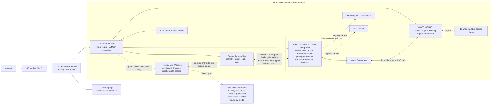

# Tuntun Phase 2 “Home Automation” Architecture Specification

**Status:** design approved; written-spec review pending
**Date:** 2026-08-27
**Scope:** deterministic local household control, governed automations, and screen-time policy foundations
**Primary operator:** one owner-managed household
**Depends on:** Phase 1 family-private-beta identity, policy, audit, authentication, Reachy, and owner-console boundaries

## 1. Outcome

Phase 2 lets Tuntun control the household’s twelve MOES Zigbee ceiling lights through a dedicated Home Assistant Green while preserving the Phase 1 trust model. Home Assistant owns device integration, current device state, and deterministic automations. The Tuntun service on the Mac remains the only authority for speaker identity, family roles, permissions, confirmations, passkeys, conversational context, memory, and Tuntun-originated audit receipts.

An identified adult can execute one unambiguous, reversible, allowlisted light action without repeated confirmation. A child may control ordinary lights only inside room and time boundaries configured by the owner and consented to by a distinct current primary guardian. An owner-designated Guest may request a common-area light action, but every exact Guest action requires owner co-approval on the trusted console with a passkey; Guest voice confirmation alone never executes it. An anonymous or identity-uncertain speaker outside a valid designated-Guest request session has no Phase 2 side-effect authority, and restrictive identity evidence always wins; uncertainty can never increase a child’s or any other person’s permissions. A registered, bounded light scene requires adult confirmation, persistent routines and policy changes require exact-scope owner authentication, and security or hazardous device classes are not registered in Phase 2 at all.

The existing MOES MZHUB is tested first as a local Matter bridge. The twelve lights are not reset or migrated until a one-light pilot proves capability fidelity, bidirectional state, reboot recovery, and WAN-off operation. A Home Assistant Connect ZBT-2 direct-Zigbee network is a conditional fallback, not an initial purchase or migration requirement.

Phase 2 also establishes Manual, Assisted, and Learning automation-governance modes and the policy state machine for family TV screen time. Real TV enforcement remains disabled until each exact television exposes a trustworthy control path and an independently observable state signal.

## 2. Locked decisions

| Area | Decision |
|---|---|
| Device plane | Home Assistant Green running Home Assistant OS |
| Intelligence and authority | Tuntun on the Mac owns identity, family policy, approvals, passkeys, memory, and Tuntun audit |
| Existing Zigbee estate | Test the MOES MZHUB as a local Matter bridge before resetting any light |
| Direct Zigbee fallback | Home Assistant Connect ZBT-2 only after the Matter-bridge gate fails; dedicate it to Zigbee |
| Direct Zigbee software | ZHA by default; Zigbee2MQTT only when exact MOES identifiers have materially better converter support |
| Initial devices | Twelve MOES Zigbee ceiling lights |
| Adult convenience | Risk-tiered and low-friction: one identified-adult, reversible, unambiguous light action may execute immediately |
| Child control | Owner-configured, distinct-primary-guardian-consented ordinary-light control in allowed rooms and hours; no routine authoring or broad scenes |
| Guest control | A valid owner-designated session may carry an otherwise unidentified visitor’s common-area request; each exact action requires owner console/passkey co-approval, restrictive identity evidence cancels it, and uncertainty outside that session has no side-effect authority |
| Persistent change | Exact-scope owner passkey; biometrics never authorize it |
| Home Assistant command authority | Tuntun receives no HA API user/token; a narrowly routed HA Core custom integration authenticates signed Tuntun channel proofs/action envelopes and is the explicit privileged TCB for allowlisted desired-state light calls |
| Security/hazardous devices | Absent from the Phase 2 action registry and denied regardless of authentication |
| Automation modes | Manual is the commissioning default; owner-enabled Assisted and Learning modes are scoped per domain; Learning creates drafts only |
| Screen-time modes | Advisory, Cooperative, and Strict; Cooperative is the default once real enforcement is eligible |
| Televisions | Samsung Neo LED 49-inch and TCL 42-inch; exact model/OS/control capability remains a commissioning gate |
| Network edge | TP-Link Archer BE800 connected to ISP ONT/modem as the primary router |
| Household network | ASUS ROG Rapture GT-AX6000 downstream, controlling three AX5400 AiMesh nodes |
| Office laptop | Wired directly to BE800 for maximum speed; outer-to-inner NAT plus host/BE800 controls block both unsolicited directions |
| Phase 2 placement | Tuntun Mac, Green, MZHUB, TVs, lights, and household clients use the inner ASUS network; Reachy joins only if its Phase 1 service-isolation gate passes |
| Remote access | No public inbound service or port forwarding; any later remote owner path uses VPN and is designed in Phase 6 |
| Canonical inventory | Phase 2 introduces the shared room/area/device/endpoint/capability registry and cross-domain event envelope |
| Storage | Green keeps operational state; backups are exported to encrypted owner storage; Green never stores Tuntun family memory or biometrics |

## 3. Scope boundaries

### 3.1 Included

- Home Assistant Green commissioning, backup, recovery, updates, and local health monitoring.
- Exact inventory of the MZHUB, twelve lights, two televisions, routers, AiMesh nodes, and relevant firmware.
- MZHUB-to-Home-Assistant Matter bridge pilot and staged twelve-light onboarding.
- Stable rooms, areas, entity identifiers, endpoint identifiers, capabilities, and device aliases.
- A Home Assistant-side mediation boundary plus a closed Tuntun adapter that observes allowlisted state and exposes only registered typed actions.
- Adult, child, guardian, designated-Guest, and anonymous-restricted policy evaluation for light actions.
- Local confirmations, exact-scope passkey step-up, durable action recovery, HA Core-side deduplication, reconciliation, and minimized audit receipts.
- Manual, Assisted, and Learning automation-governance modes.
- Screen-time allowance, warning, grace, extension, override, and bounded-enforcement state machines.
- Failure injection for WAN, Mac, Reachy, Green, MZHUB, router, stale state, duplicate command, and manual-drift cases.
- A conditional one-light direct-Zigbee fallback pilot.

### 3.2 Explicitly excluded

- Reolink cameras, video retention, NAS selection, and camera-derived identity; those belong to Phase 3.
- Multi-room voice and media routing, whole-home audio, TV teaching surfaces, and display sessions; those belong to Phase 4.
- Local LLM or vision inference migration; that belongs to Phase 5.
- Public internet administration, router port forwarding, or a public Home Assistant API.
- Unrestricted model access to Home Assistant service calls, templates, scripts, YAML, shells, add-on installation, or arbitrary entity IDs.
- Autonomous purchases, door locks, alarms, cooking/heating equipment, mains relays, or other hazardous/security device control; these routes remain absent even for an authenticated owner.
- Silent automation installation or silent conversion of observed behavior into policy.
- A claim that VLAN isolation exists until the exact router/AiMesh firmware proves the required behavior.
- A claim that either TV can be enforced until control and observation gates pass.

## 4. Architecture



The two-router topology is accepted for Phase 2 even if it creates double NAT. Inner local automation must not depend on internet reachability or outer-to-inner unsolicited connections. Home Assistant Green and the MZHUB remain on the same inner LAN during the initial Matter pilot so IPv6 and multicast discovery are not broken by speculative segmentation. Reachy may share that LAN only if the Phase 1 loopback/firewall probe closes its daemon/media/API exposure; otherwise automatic voice/face processing stays disabled until a tested isolated SSID/VLAN/firewall boundary exists.

## 5. Component ownership

| Component | Owns | Must not own |
|---|---|---|
| Tuntun policy/action service | Speaker role, household rules, risk classification, approval, action commitment, Tuntun receipt | Device-driver details, arbitrary HA services, or physical-state assumptions |
| Tuntun Home Assistant adapter | Allowlisted entity/capability synchronization, typed translation, durable action coordination, timeout and result reconciliation | Identity decisions, family memory, permission policy, or direct general-purpose HA API access |
| HA Core Tuntun custom integration | Signed-channel authentication, Tuntun action/routine-signature verification, endpoint/action allowlist, desired-state deduplication, bounded system-context light-service translation and deterministic routine evaluation, correlation-context mapping, minimized state/receipts | Speaker identity, family policy evaluation, a Supervisor/admin/HA API token, general service/automation proxying, templates/YAML, or a second memory store |
| Home Assistant Green | Authoritative integration state, local service execution, deterministic automations, device logbook, Green backups | Family biometrics, conversation transcripts, private memory, or Tuntun authorization |
| MOES MZHUB | Existing Zigbee network, vendor provisioning, Matter-exposed device functions | Tuntun profiles, speaker identity, or family permissions |
| Lights and physical controls | Physical outcome and local/manual recovery path | Conversational authorization |
| Learning detector | Minimized state-event patterns and inactive routine proposals | Silent activation, profile inference from surveillance, or policy mutation |
| Screen-time policy service | Allowance/session state, warnings, grace, extension, mode, override, bounded retry | An unverified claim that a TV is off or that a person is watching |

Home Assistant is the authoritative source for the state its integrations can observe. A physical device may still disagree with a stale, optimistic, or lossy integration. Results therefore carry an observation source and verification strength. Tuntun says an action is completed only after a fresh observation path that the device pilot has proven truthful; otherwise it says that the command was accepted or that the outcome is unknown.

## 6. Canonical registries and contracts

### 6.1 Household topology registry

Phase 2 creates the shared registry used by every later hardware phase:

- `area`: a stable household location such as `living_room`; display names are mutable.
- `device`: a physical or virtual product, with vendor/model/firmware and lifecycle state.
- `endpoint`: one addressable function exposed by a device or bridge.
- `capability`: one closed operation or observation schema such as `light.on_off.v1`.
- `binding`: the current mapping from Tuntun endpoint to Home Assistant entity/integration source.
- `policy_tags`: room class, device risk, child eligibility, designated-Guest eligibility, and privacy class.

Stable Tuntun IDs never contain a person’s name, room nickname with sensitive meaning, MAC address, IP address, Home Assistant access token, or vendor account identifier. Integration-specific IDs are adapter data and may change without changing the Tuntun policy identity.

Every binding has an immutable binding ID, topology version, exact Home Assistant entity commitment, observed capability digest, freshness timestamp, source integration, availability state, and commissioning generation. An owner-authenticated binding, alias, room, or topology mutation increments the affected generation, invalidates outstanding action commitments, and creates an audit receipt. A missing, stale, duplicated, renamed, rebound, or capability-drifted binding is ineligible for Tuntun execution until reconciled.

### 6.2 Cross-domain event envelope

Later phases reuse one versioned event envelope:

```text
event_id
schema_version
event_type
source_endpoint_id
observed_at
ingested_at
correlation_id
causation_id
deduplication_key
sensitivity_class
payload
```

The payload is validated against the registered event schema. Unknown fields and unknown schema versions are quarantined, not passed to a model. Device events contain no speaker identity, transcript, biometric evidence, or private memory. Tuntun may correlate an event with a current local session inside its policy boundary without writing that identity into Home Assistant.

### 6.3 Closed action request

The model may propose only a typed intent. Local deterministic code resolves it into an exact request:

```text
action_id
action_schema_version
action_type
target_endpoint_id
desired_state
controller_epoch
topology_version
binding_id
binding_generation
binding_digest
resolved_ha_entity_commitment
expected_capability_digest
policy_version
authorization_commitment
signing_key_id
authorized_at
issued_at
expires_at
idempotency_key
correlation_id
envelope_signature
```

The authorization decision, actor, evidence, confirmation, and passkey binding remain in Tuntun. The HA Core custom integration receives only the minimum target/action commitments and correlation material needed to execute and reconcile. `action_type` selects one registered closed desired-state schema; there is no free-form argument bag. `authorized_at` is the Mac transaction-commit time; signing must set `issued_at` no earlier than that time and no more than five seconds later, and `expires_at` may be no later than 30 seconds after `authorized_at`. Mac and Green mutation paths require measured wall-clock offset no greater than two seconds; loss of that gate disables mutation. The HA integration must finish validation and durably commit `PRE_DISPATCH` before `expires_at`, then begin the service invocation no more than two seconds after that commit and still before expiry. A crash-recovered `PRE_DISPATCH` row after expiry produces no new device I/O; `DISPATCHING` is reconciled as potentially in flight and is never blindly repeated. Crossing expiry does not erase an actual service call already in flight, which is reconciled truthfully. A late envelope expires without device I/O or automatic reauthorization.

The canonical envelope is signed only by the Tuntun action service after the authorization/intent transaction reaches `AUTHORIZED_COMMITTED`; model/tool code cannot invoke the signing provider. The integration verifies the signed channel proof plus the pinned action key/signature over every action field except `envelope_signature`, and then independently checks its compiled allowlist, exact entity binding/generation, controller epoch, command time window, schema, rate limits, and idempotency state. Only after all checks pass may trusted in-process integration code translate the exact desired state into a system-context allowlisted light service call. Wildcard targets, `toggle`, templated entity IDs, user-supplied service names, unbounded lists, model-produced YAML, and every non-idempotent operation are invalid.

The ordinary Home Assistant REST and WebSocket service-call APIs do not implement Tuntun idempotency. Phase 2 therefore never treats a client-supplied key as magic. The HA Core custom integration maintains its own receipt database at `/config/tuntun_bridge/receipts.sqlite3`, outside Recorder and inside the encrypted Home Assistant backup set. Before invoking any Home Assistant service, it commits and flushes a `PRE_DISPATCH` row containing the action ID, idempotency key, canonical payload hash, controller epoch, signing key ID, topology version, binding generation/digest, entity commitment, and expiry. SQLite runs in WAL mode with `synchronous=FULL`; a commit failure blocks dispatch. Reusing a key with different content is a security error. The committed row is advanced to `DISPATCHING` before the service call and then mapped to the Home Assistant-generated context ID and reconciled result. The integration accepts only desired-state operations such as “set this light on” or “set brightness to this exact value.” Receipt schema migration, corruption recovery, and restore are tested across Core, custom-integration, and HAOS upgrades.

Every transition into `VERIFIED`, `ACCEPTED_UNVERIFIED`, `FAILED`, `UNKNOWN`, or `EXPIRED` atomically sets one immutable `terminal_at`; later reconciliation cannot rewrite that retention origin. A receipt that remains nonterminal through 24 hours after action expiry transitions to `UNKNOWN` at that deadline and receives its immutable timestamp. Full terminal receipt detail is retained in the live database until `terminal_at + 10 days`. It then compacts to a tombstone containing only keyed hashes of action/idempotency identifiers and canonical payload, terminal class, immutable `terminal_at`, original expiry, controller epoch, and prune time; the tombstone is deleted from the live database at `terminal_at + 30 days`, not 30 days after compaction. Encrypted HA backups are retained for at most 28 days from snapshot creation, so the archive-age bound is deliberately disclosed separately: a snapshot taken just before live compaction can preserve full terminal detail until at most `terminal_at + 38 days`, and one taken just before tombstone deletion can preserve a tombstone until at most `terminal_at + 58 days`. Archive deletion—not restore-time compaction—is what ends that encrypted-at-rest retention; restore still runs expiry/compaction before mutation can reopen. The store has a 100 MiB quota: at 75% it runs integrity check/expired-detail compaction and alerts, and at 90% it rejects new mutation commands while preserving nonterminal receipts and physical/manual control. It never purges a live receipt to make room. Weekly maintenance checkpoints WAL and securely replaces the compacted database; acceptance measures bounded size and recovery after corruption.

The Mac and integration pin the same random 256-bit `controller_epoch`. A mismatch disables every mutation. Home Assistant restore/rollback occurs while controller/device paths are isolated, then requires owner-passkey plus local HA-admin rotation to a fresh epoch before mutation is re-enabled. All pre-restore nonterminal Mac actions become `UNKNOWN`; no action signed under the prior epoch may dispatch. This protects against a restored backup erasing newer deduplication receipts, including a restore that occurs between physical dispatch and reconciliation.

### 6.4 Durable action state and result

Before external I/O, the Phase 1 serialized unit of work atomically consumes the exact authorization grant and commits the action intent, target/binding/policy commitments, audit outbox entry, and state `AUTHORIZED_COMMITTED`. After that transaction commits, the action service signs the canonical committed envelope through the key-provider port and records the envelope digest/key ID before dispatch; signing failure moves the action to `FAILED` without Home Assistant I/O. External I/O never occurs while the database writer lock is held. The durable state machine is:

```text
PREPARED
  -> AUTHORIZED_COMMITTED
  -> SIGNED
  -> DISPATCHING
  -> RECONCILING
  -> VERIFIED | ACCEPTED_UNVERIFIED | FAILED | UNKNOWN | EXPIRED
```

On restart, Tuntun queries the HA Core-side receipt before considering redispatch. The same desired-state request may be retried only through the same custom-integration idempotency record and only while its authorization, topology, binding, capability, policy, and expiry commitments still match. A non-terminal receipt that cannot be reconciled becomes `UNKNOWN`; it is never repeated as a new action automatically.

Every result contains `dispatch_status`, `ha_context_id`, `observed_state`, `observed_at`, `observation_source`, `verification_strength`, `terminal_reason`, and the matching commitments. `VERIFIED` requires a fresh device/integration observation path proven by commissioning tests. `ACCEPTED_UNVERIFIED` means Home Assistant accepted the desired state but physical outcome is not independently established. Human-facing language must preserve that distinction.

### 6.5 Bounded light-scene contract

Phase 2 supports only registered light scenes represented as immutable manifests; it never calls a user-named Home Assistant `scene`, script, template, or arbitrary service. A manifest contains:

```text
scene_execution_id
scene_idempotency_key
scene_manifest_id
scene_manifest_version
scene_manifest_digest
controller_epoch
topology_version
policy_version
signing_key_id
authorized_at
issued_at
expires_at
entries[1..12]:
  endpoint_id
  desired_state
  binding_id
  binding_generation
  binding_digest
  resolved_ha_entity_commitment
  expected_capability_digest
  child_action_id
  child_idempotency_key
aggregate_envelope_signature
```

The owner registers or edits a scene with an exact-scope passkey. Execution is available only to an identified adult after one confirmation that displays the scene name, exact manifest digest, rooms, endpoint count, and desired effects. The aggregate uses the same `authorized_at`/`issued_at` checks and 30-second pre-dispatch admission deadline as a single action. Child, designated-Guest, and anonymous roles cannot execute a scene. A manifest contains at most the twelve Phase 2 light endpoints, each exactly once and canonically ordered by stable endpoint ID; duplicate or conflicting entries are rejected. Wildcard areas, dynamic membership, nested scenes, non-light endpoints, `toggle`, and relative state are invalid.

There is no cross-machine transaction. Commit order is strict: (1) the Mac atomically commits the aggregate execution plus every child intent and consumes one aggregate authorization; (2) it signs the canonical aggregate envelope; (3) the HA integration verifies it, reserves all endpoint and session rate-limit capacity, and commits the aggregate plus every child `PRE_DISPATCH` receipt in one local SQLite transaction; and only then (4) device service calls may begin. Failure in steps 1–3 produces no device I/O and no partial rate-limit reservation. Every child invocation, including the last, must start before the aggregate `expires_at` and within two seconds of the aggregate/child receipt transaction; a child that misses either bound transitions to `EXPIRED` with no service I/O. After a crash, `DISPATCHING` children are reconciled without replay and still-`PRE_DISPATCH` children past the bound expire without dispatch.

Each endpoint has its own desired-state idempotency and result. Physical execution after step 4 is not atomic: a partial failure or child expiry is reported endpoint by endpoint, successful entries are not described as rolled back, and no automatic rollback writes a potentially stale prior state. A retry may address only unresolved entries through their original child keys while the aggregate authorization, controller epoch, signed deadline, and every frozen commitment remain valid; after that deadline, a new execution requires a new confirmation and new aggregate/child IDs. Reusing an aggregate or child key with a different manifest/payload is rejected. The terminal aggregate result is `VERIFIED` only when every child result is verified; otherwise it truthfully reports partial, accepted-unverified, failed, expired, or unknown outcomes.

## 7. Governed light-action flow

1. Reachy sends the bounded turn through the Phase 1 paired channel.
2. Tuntun resolves the active profile and request-channel precedence. A valid owner-created, time-bounded `designated_guest` bearer session may carry an otherwise unidentified adult visitor’s request, but it does not authenticate which visitor spoke. Absent, expired, cancelled, or out-of-scope Guest sessions map to `anonymous_restricted`. Conflicting enrolled identity, failed liveness, mixed-speaker evidence, or any evidence that could correspond to a child overrides the bearer session and also maps to `anonymous_restricted`; a Guest session never defeats a more restrictive identity signal.
3. Before cloud routing, a local English/Hindi/Hinglish grammar recognizes the closed Phase 2 light intents. When WAN is available, the model may alternatively propose the same registered intent; neither path can call Home Assistant directly.
4. Local code resolves one exact room and endpoint from the topology registry, or one registered immutable scene manifest under Section 6.5. It never guesses the current room or expands a scene from prose alone.
5. The adapter obtains a fresh HA custom-integration observation and freezes the exact topology, binding, entity, capability, and policy commitments.
6. The policy service evaluates actor role, target room, device class, action, time window, household mode, breadth, reversibility, and current rule version. When evidence could correspond to an enrolled child or another more restricted role, the intersection of applicable permissions wins; uncertainty never grants more authority.
7. Tuntun obtains the required immediate authorization, exact confirmation, or action-bound passkey. A designated Guest’s voice/session is not an authenticator: the exact request remains pending until the owner reviews it on the trusted console and supplies an action-bound passkey co-approval. A denial, expiry, or owner absence stops before dispatch.
8. Tuntun atomically consumes the grant and commits `AUTHORIZED_COMMITTED` plus the audit outbox before external I/O. This commit is the policy/guardian-revocation linearization point: a revision committed before it forces transaction conflict and re-evaluation; a revision after it cannot retroactively cancel the already-authorized low-risk action and is recorded as crossing an in-flight action.
9. The action service signs only the canonical committed envelope, records its digest and key ID, and transitions to `SIGNED`. Signing failure transitions to `FAILED` with no Home Assistant I/O.
10. The adapter sends one closed, expiring desired-state action—or the bounded scene manifest and its child actions—to the HA integration. The integration revalidates the binding, capability, epoch, expiry, schema, signature, and idempotency commitments and writes durable pre-dispatch receipts before service I/O. It does not pretend to possess the Mac’s live family-policy state.
11. Home Assistant controls the MZHUB locally through Matter; MZHUB controls the light through Zigbee.
12. The adapter reconciles the resulting state, source, freshness, and verification strength and detects stale, optimistic, or contradictory results.
13. Tuntun reports `completed and verified`, `command accepted but not verified`, `not completed`, or `outcome unknown`; a timeout never becomes a verbal success.
14. The Mac commits the terminal result and minimized receipt containing actor class, policy/action versions, target commitment, decision, dispatch, and result—not transcript or biometric material.

Manual Home Assistant UI changes remain possible for the owner. They are HA-authored state changes and cannot silently become Tuntun policy, preference memory, or a learned routine.

## 8. Authorization policy

The secure commissioning default is identified-adult-only control. Child rules remain disabled until the owner has configured the exact rooms/hours and the current primary guardian has consented. Designated-Guest request sessions remain disabled until the owner has configured their common-area scope and expiry; even then, each exact action requires owner trusted-console/passkey co-approval. `anonymous_restricted` has no Phase 2 side-effect authority.

| Request | Default Phase 2 result |
|---|---|
| Identified owner/adult; one unambiguous, reversible, allowlisted light action | Execute immediately |
| Anonymous or identity-uncertain request outside a valid designated-Guest session; or any conflicting enrolled identity, mixed-speaker, failed-liveness, or possible-child evidence even inside one | Deny every side effect |
| Ambiguous target, unknown capability, stale binding, stale rule, or unavailable state | Deny or report unavailable |
| Identified adult registered light scene with an immutable manifest of at most twelve endpoints | Exact aggregate confirmation under Section 6.5 |
| Unregistered/dynamic scene, non-light broad action, or manifest over twelve endpoints | Deny as not registered |
| Persistent routine, schedule/policy edit, or automation install | Fresh exact-scope owner passkey |
| Any security or hazardous target | Deny as not registered in Phase 2, regardless of authentication |
| Child ordinary light in the child’s permitted bedroom or a configured common room, during allowed hours | Execute under the current owner-configured, primary-guardian-consented rule |
| Child whole-home scene, routine authoring, persistent change, security or hazardous target | Deny |
| Owner-designated Guest common-area ordinary light during the bounded Guest session | Hold pending; execute only after owner trusted-console/passkey co-approval of the exact action |
| Designated Guest private-room, broad, persistent, security, or hazardous action | Deny |

Explicit deny overrides allow. Missing or stale policy denies. Outside a valid designated-Guest session, a profile becoming uncertain before the authorization commit is re-evaluated as `anonymous_restricted`, and outstanding confirmations are cancelled. Inside a valid session, mere absence of an enrolled identity is expected; conflicting enrolled identity, mixed-speaker, failed-liveness, or possible-child evidence still cancels the pending request, and owner co-approval cannot cure that conflict. Adult confirmation binds the authenticated adult session, exact action/target or scene digest, nonce, expiry, and current policy. A designated Guest session is only a scoped bearer request channel and does not distinguish one unenrolled visitor from another; its request cannot execute until the owner independently authenticates on the trusted console and co-approves that exact action. Biometrics never satisfy confirmation, co-approval, or passkey requirements. Physical switches and owner use of Home Assistant remain independent recovery paths and do not require Tuntun authorization.

These rules govern Tuntun-originated actions; they cannot make a physical switch, TV remote, MZHUB vendor app, or owner Home Assistant UI obey conversational policy. Vendor and Home Assistant administrative accounts remain owner-only, household sharing is inventoried and disabled unless explicitly needed, and the console discloses every unmanaged bypass rather than presenting Tuntun policy as universal enforcement.

The owner is the sole household system administrator in the initial deployment. The current Phase 1 primary guardian may approve an extension or child-specific proposal but cannot edit base room/hour/device policy unless the owner has explicitly enabled the optional delegated-guardian framework capability. Delegation requires an owner passkey and is bound to one child, enumerated rule fields, validity window, and policy generation. Guardian reassignment or consent revocation invalidates the child-light rule, outstanding extensions, and pending confirmations before the Section 7 authorization-commit linearization point; an already committed action remains bounded in flight and is reconciled truthfully. Re-enabling the rule requires approvals from two distinct principals (`owner_subject_id != guardian_subject_id`) bound to the same child-rule configuration digest and generation: owner reconfirmation of the exact rooms/hours/devices plus action-bound authentication/consent from the then-current primary guardian. If one person occupies both profiles, the rule remains disabled rather than treating two clicks as two-party consent.

## 9. Automation governance

Automation governance is scoped per device domain. Every domain starts in Manual mode. Enabling Assisted or Learning, changing its scope, or returning to a less restrictive mode requires an owner passkey bound to the domain, mode, policy version, and expiry. Returning to Manual is an immediate reduction in privacy/safety exposure and does not require the system to be online.

### 9.1 Manual mode

The owner authors automations directly in Home Assistant. Tuntun may observe an automation’s enabled state and declared effect, but does not rewrite it. Manual automations are marked `origin=home_assistant` in the mirrored registry.

### 9.2 Assisted mode

Tuntun may draft a typed routine containing:

- a closed trigger schema;
- explicit conditions and time windows;
- enumerated endpoints and actions;
- persistence and estimated frequency;
- safety, privacy, child, designated-Guest, and failure implications;
- rollback target and prior-version digest.

The draft is validated against current capabilities, simulated against representative state, displayed in exact form, and installed only after a fresh owner passkey bound to the complete routine digest. Phase 2 does not write arbitrary Home Assistant automation YAML. It sends a domain-separated `tuntun-routine-v1` signed manifest to the custom integration’s bounded routine endpoint. The signed manifest includes controller epoch, routine ID/version/digest, previous approved digest, expected current activation generation, proposed next activation generation, trigger/condition/action content, installer authorization commitment, and install expiry. The integration accepts it only as a compare-and-swap from the exact expected generation to `expected + 1`. The only supported triggers are fixed local time/day and allowlisted light state/availability transitions; conditions are fixed time/day and allowlisted light state; actions are exact desired states for at most the twelve registered lights. Templates, event-name strings, nested routines, dynamic entity membership, arbitrary services, delays over the declared bound, and non-light actions are invalid.

The custom integration persists the manifest ID/version/digest, prior approved version, controller epoch, activation generation/state, trigger cursor, and install receipt in its checkpointed store. Its deterministic evaluator invokes only the same compiled light translations and pre-dispatch receipt machinery used by direct actions, but it does not fabricate a fresh Mac-signed conversational action. The installed `tuntun-routine-v1` manifest is the durable authority: each internal runtime receipt records `authority_kind=installed_routine`, captured controller epoch and activation generation, the exact manifest/install-authorization digest, trigger slot or source-event commitment, generated execution/child IDs, frozen entity bindings, and desired states before service I/O.

Trigger admission is a database compare-and-swap, not an earlier in-memory `active` check: the trigger cursor plus all child `PRE_DISPATCH` rows are inserted only when the same SQLite transaction proves `active=true`, `routine.controller_epoch=global.controller_epoch=captured_controller_epoch`, and `activation_generation=captured_activation_generation`. Immediately before any child advances from `PRE_DISPATCH` to `DISPATCHING`, another transaction applies those exact predicates. Zero affected rows atomically transitions that undispatched occurrence/child to `EXPIRED` and produces no service I/O. Disable or controller-epoch rotation uses the same serialized database writer to increment generations, close trigger gates, and expire undispatched rows; work that already reached `DISPATCHING` is only reconciled. Thus a trigger that observed `active` before disable cannot insert or dispatch afterwards.

Every trigger occurrence derives its durable execution ID/idempotency key from a domain-separated hash of controller epoch, activation generation, manifest digest, and the scheduled-slot or source-event commitment; each child ID/key additionally binds its canonical endpoint/action index and desired-state commitment. The occurrence is committed before any action dispatch and cannot be replayed with different content. Restore, rollback, and disable/re-enable therefore create a new key namespace even for an otherwise identical manifest or reset trigger cursor. Routine-originated Home Assistant contexts are excluded from all routine triggers, routine chaining is unavailable, and install-time dependency analysis rejects self-edges and cycles among declared trigger/action state transitions.

Autonomous execution has its own hard budget rather than borrowing a conversational session limit: at most one execution per routine per 60 seconds, 24 executions per routine per rolling day, and 60 routine executions across the integration per rolling hour. Three executions of one routine within ten minutes, two consecutive `FAILED`/`UNKNOWN` outcomes, receipt-store pressure, or a detected origin/cursor inconsistency opens a circuit breaker, disables that routine, and alerts the owner; only an owner-authenticated review can re-enable it. On downtime or restart, state-transition events are never replayed and missed scheduled slots are recorded as skipped rather than burst-executed. These limits are schema constants in Phase 2, not model-selected fields.

Activation/rollback is one local database transaction; failed validation or installation leaves the prior routine active. Each installed routine exposes an integration-owned read/disable control entity in the local HA owner UI—never an editable YAML/template surface—so an owner can stop it as an emergency/manual bypass. Disable atomically increments the activation generation, closes its trigger gate, and transitions undispatched `PRE_DISPATCH` occurrences to `EXPIRED`; already-`DISPATCHING` occurrences are potentially in flight and are reconciled without a false cancellation claim or retry. Re-enable or rollback requires a fresh owner-authenticated signed manifest using the now-current compare-and-swap generation. That creates detectable drift rather than silent Tuntun reinstallation. A draft has no execution authority.

After any Home Assistant restore or controller-epoch rotation, every restored routine is quarantined inactive regardless of its backed-up activation flag. Epoch rotation atomically changes the global epoch, increments every routine activation generation, closes all trigger gates, and expires undispatched occurrences before the new epoch is published. No trigger gate opens until the owner reviews it and Tuntun reinstalls or reconciles it with a fresh passkey-bound manifest under the new controller epoch and next activation generation. An old backup therefore cannot resurrect an approved routine silently.

### 9.3 Learning mode

Local pattern analysis may examine a minimized projection containing only endpoint ID, area ID, state transition, and coarse time bucket and suggest a draft such as a repeated light schedule. Events correlated with a child conversation are excluded before projection, without persisting the child identity. The projection is `household_private`, remains local, is never sent to a model, and is deleted after 30 days. Pending/rejected suggestions expire within 30 days and can be inspected or deleted immediately from the owner console. Disabling Learning deletes its projections and unapproved drafts; already approved automations remain visible with provenance.

Learning does not consume actor/role identifiers, raw conversation, biometric, camera, private memory, precise movement history, or vendor-cloud telemetry. It cannot silently install, edit, merge, delete, enable, or disable an automation. Every suggestion enters the complete Assisted review, simulation, passkey, installation, and rollback path.

Tuntun-installed routines carry an origin, schema version, policy digest, content digest, installer authorization receipt, and rollback reference. Manual drift creates an owner-visible conflict; Tuntun does not overwrite the changed routine until the owner reconciles it.

Child, designated-Guest, and anonymous profiles cannot access an authoring mode. A child’s repeated device use is not treated as consent to learn or install a routine.

### 9.4 Owner console extension

The Phase 1 owner console gains five authenticated local surfaces:

1. **Home inventory:** areas, devices, endpoints, exact HA bindings, capability/freshness state, commissioning generations, aliases, and topology diffs. Every binding/alias/room mutation requires an owner passkey and invalidates outstanding target commitments.
2. **Household permissions:** child room/hour rules, primary-guardian status, optional delegated-guardian grants, common-area declarations, bounded designated-Guest sessions, denials, and current policy digests.
3. **Automations:** current origin/mode, inactive drafts, exact diffs, simulation evidence, install authorization, rollback, drift conflicts, projection retention, and delete/disable controls.
4. **Screen time:** per-child allowances, modes, educational/content exceptions, current state, warnings, extension queue, override authority, transparent history, and adapter eligibility.
5. **Home health:** Green/MZHUB/custom-integration status, stale entities, TLS certificate/signing-key expiry, controller epoch, backups, restore evidence, storage, router exposure checks, and failure alerts.

Read views follow Phase 1 console authentication. Topology, policy, automation, designated-Guest, screen-time, credential, or restore mutations use action-bound confirmation or passkey according to Section 8. The browser never receives Home Assistant credentials or general service-call capability.

## 10. Screen-time policy foundation

Phase 2 defines the policy state machine for the Samsung and TCL televisions. Phase 4 supplies the mature media/display adapters. Exact model numbers, operating systems, integration methods, and state signals must be captured before either TV is enforcement-eligible.

### 10.1 Modes

- **Advisory:** transparent allowance history, warnings, and guardian notifications; no shutdown.
- **Cooperative — default when eligible:** advance warning, grace period, child extension request, guardian decision, verified shutdown, and at most the configured bounded re-enforcement attempt if the TV restarts.
- **Strict:** prevents further child-authorized sessions and performs bounded shutdown enforcement. It never enters a power-cycle contest. An owner or the child’s primary guardian may apply an authenticated override. An ordinary physical TV remote remains an unauthenticated manual bypass available to whoever holds it; the system must not describe it as adult-only.

### 10.2 Eligibility gate

Real enforcement requires both:

1. a repeatable control path, such as a tested local TV integration, HDMI-CEC adapter, or IR endpoint; and
2. a trustworthy observation signal with documented provenance and failure behavior, such as HDMI-CEC state or a calibrated power measurement.

For Strict mode, “independent” means the control and observation paths do not share the same adapter, transport, cached state, acknowledgement, or failure domain—or a commissioning campaign has directly demonstrated that their relevant failures are independent. A same-integration power attribute, mirrored optimistic state, network presence, or command acknowledgement can qualify only for Cooperative or Advisory mode. Strict eligibility requires out-of-band evidence such as calibrated power sensing, or a separately implemented control/observation pair whose independence survives acknowledgement-plus-false-state, stale mirrored state, adapter restart, and common-mode outage injection. When state cannot be verified, Tuntun reports enforcement failure, stops after the configured retry bound, and degrades to Advisory behavior with an adult-visible alert.

### 10.3 Session behavior

The persisted state machine is:

```text
IDLE -> REQUESTED -> AUTHORIZED -> ACTIVE
ACTIVE -> WARNING -> GRACE -> EXPIRED -> ENFORCING -> ENDED
GRACE -> EXTENSION_PENDING -> ACTIVE | EXPIRED
any observed state -> UNKNOWN when viewer, clock, control, or TV state is unreliable
```

Each session binds child, TV endpoint, allowance ledger, mode, policy version, start wall-clock time, monotonic deadline reference, and last trustworthy observation. Daily and weekly ledgers are separate; the more restrictive remaining allowance wins. Wall-clock jumps, timezone changes, daylight-saving anomalies, reboot, or missing observation put the session into reconciliation rather than adding or subtracting time blindly. On restart, persisted UTC checkpoints and the new monotonic clock reconstruct only the interval supported by trustworthy observations. Device or observer failure does not consume unobserved time.

Screen-time policy distinguishes allowance, observed TV state, playback/application state, and known viewer. It does not infer that a particular child is watching merely because the TV is on. When viewer identity is uncertain, Tuntun may warn generally but cannot debit a child or perform child-specific enforcement. A normal remote control is a manual bypass, not identity evidence.

Owner-configured educational exception policy and primary-guardian session consent are explicit, bounded, and auditable. Automatic content/app exceptions require a trustworthy adapter signal; otherwise only the current primary guardian’s exact session-bound approval can classify the interval. Phase 2 does not inspect or infer audiovisual content. Disallowed-app/category rules remain advisory unless the adapter can both observe and control them truthfully.

An extension decision binds child, TV, additional duration, current session, allowance effect, and policy version. The current primary guardian may approve an extension for that child. The owner may override any household session or policy. A non-guardian adult may stop enforcement manually but cannot alter the child’s ledger or standing rule without an owner delegation. Emergency stop is always immediate; authenticated emergency allowance changes are separately audited.

Warnings occur at owner-configured thresholds, include an age-appropriate explanation in the active English/Hindi/Hinglish style, and display the remaining time and available extension route. The child and guardian can view the current daily/weekly ledger and a transparent history without seeing another profile’s private data. Every automated shutdown has one configured attempt plus at most one bounded re-enforcement attempt. Failure, restart, manual bypass, or unverifiable state ends the loop in `UNKNOWN` or Advisory behavior with an owner/guardian-visible notice.

Per-session screen-time detail is retained for 30 days. Content-minimized allowance, extension, override, and enforcement receipts follow the Phase 1 audit ledger’s 180-day owner-view default. No programme title, audiovisual sample, or inferred interest is stored merely to account for time.

## 11. Network and trust boundary

### 11.1 Deployable Phase 2 boundary

- The Archer BE800 remains the internet edge and outer trusted network.
- The office laptop stays wired to the BE800 and has no ambient administrative route to inner household services. Its host firewall and, where supported, a BE800 ACL also reject connections originating from the ASUS WAN/inner subnet; double NAT alone does not block inner-to-outer initiation.
- The GT-AX6000 and three AX5400 AiMesh nodes serve the inner household network.
- Green, MZHUB, Tuntun Mac, televisions, lights’ bridge, and household clients use the inner network. Reachy joins that network only after the Phase 1 service-isolation gate passes; otherwise its automatic voice/face processing remains disabled until a tested isolated network boundary exists.
- No Home Assistant, Tuntun, MZHUB, or Reachy port is forwarded from the internet.
- Home Assistant Cloud remote access is not enabled in Phase 2. Update and explicitly enabled integration egress do not create an inbound administration path.
- UPnP, NAT-PMP/PCP automatic mappings where exposed, DMZ host mode, and WAN router administration are disabled on both routers. Both NAT forwarding tables are inspected after commissioning and after router updates.
- Outer and inner networks use distinct non-overlapping subnets. Green, the Mac endpoint, and MZHUB receive DHCP reservations; the custom integration shares Green’s authenticated Core endpoint and exposes no separate listener.
- Cloud calls remain outbound-only from Tuntun under Phase 1 consent, budget, and privacy policy.

### 11.2 Home Assistant mediation and credentials

Tuntun receives **no Home Assistant user, refresh token, long-lived token, or general REST/WebSocket access**. The mediation component is one open-source **Home Assistant Core custom integration**, not an HAOS app/add-on and not a separate process. It registers three narrowly routed application endpoints on Home Assistant Core’s existing HTTPS listener: a signed state/heartbeat channel, a signed desired-state action endpoint, and a signed bounded-routine-manifest endpoint. Those routes bypass built-in HA bearer auth solely to run their mandatory signed-proof verifier; no handler may return state, mutate a routine, or reach service translation before that verifier succeeds. They expose no standard state, service, template, script, scene, automation, or configuration API.

The state route has no caller-selected entity, domain, template, attribute, or filter parameter. It returns only a full snapshot or monotonic cursor delta of the compiled registered-light projection: stable endpoint ID, entity commitment, topology/binding/capability generation and digest, normalized desired/observed light state, availability, observation source/time, and sequence. An excluded entity cannot be named or inferred through error differences; an unknown cursor yields a fresh allowlisted snapshot. Positive allowlisted-state and validly signed off-registry-read tests are release gates.

The custom integration is explicitly part of the trusted computing base. After authenticating the channel proof and validating a committed action envelope, compiled allowlist, frozen bindings, expiry, controller epoch, rate limits, and idempotency receipt, it invokes the exact light service with a Home Assistant **system execution context**. That ambient in-process authority—not HA user permissions—makes execution possible. The generated HA context ID is mapped to the Tuntun correlation/action ID in the minimized receipt; the context never carries a household identity. The integration holds no `SUPERVISOR_TOKEN`, owner token, HA API token, or direct device credential and cannot proxy a caller-selected service/entity. A defect in this small translator is therefore security-critical and blocks P2-4 on package-hash drift or failed adversarial tests.

Every request uses a domain-separated P-256 signature. A channel proof covers protocol label, method/path, canonical body hash, controller epoch, the verifier’s random 256-bit `verifier_generation`, key ID, issued/expiry times, and a 256-bit client nonce. One process-global verifier service owns the generation plus nonce/challenge caches outside the config-entry object, so an ordinary integration unload/reload cannot preserve the generation while erasing replay state. A Core restart or any verifier reset/cache-loss path atomically rotates the generation, closes streams, invalidates outstanding challenges, and installs empty caches before accepting another proof. The current generation is learned only through a bounded challenge response on the same custom route, so a proof captured before any such lifecycle event is invalid. The pre-auth parser permits at most five requests per source per second, twenty failed proofs per minute, one stream connection, and 64 KiB per request; excess work receives bounded backoff and never queues a later action. The integration rejects noncanonical bodies, clock skew over 30 seconds, expiry over 60 seconds, unknown/revoked keys, epoch or verifier-generation mismatch, and a nonce repeated inside a five-minute cache.

Pinned TLS authenticates the server; the integration does not invent a second server-signing key. A WebSocket/stream handshake returns a single-use random 256-bit `server_nonce`, `challenge_id`, controller epoch, `verifier_generation`, route, issued time, and expiry no more than 30 seconds later. The client responds with key ID, its own random 256-bit nonce, and a P-256 signature over the canonical transcript `tuntun-channel-v1 || challenge_id || server_nonce || client_nonce || controller_epoch || verifier_generation || route || issued_at || expires_at`. The integration verifies the pinned client public key, exact transcript, controller epoch/verifier generation, time window, and unused challenge/nonces before returning any state; challenge IDs are atomically consumed and retained in the replay cache. The stream reauthenticates with the same exchange at least every fifteen minutes. Bounded HTTPS polling instead includes the current verifier generation in each signed request proof and does not use the stream handshake. Direct actions and persistent routine manifests use distinct `tuntun-action-v1` and `tuntun-routine-v1` signatures created only after their respective authorization/passkey commitments, so a channel proof or one mutation domain cannot be reinterpreted as another.

Home Assistant Core’s `http` listener owns TLS. Production uses `https://`/`wss://` with a household-internal certificate/CA pinned by the Mac adapter; plaintext API traffic, hostname mismatch, untrusted replacement, expiry, or downgrade fails closed. The custom integration also rejects requests whose observed source is not the reserved Mac address, with trusted-proxy handling disabled unless explicitly configured; a router/host rule may restrict the whole HA listener further only where that does not break owner administration. Source filtering is defense in depth, not authentication. Requests with no/invalid proof are rejected before state or action data is returned.

For this household profile, the P-256 private key is non-exportable in the 2020 MacBook Pro’s T2 Secure Enclave, subject to an availability/actual-signing probe; failure blocks P2-3/P2-4 rather than silently using a file key. The integration stores only the public key, key ID, activation/revocation time, fingerprint, and controller epoch. Initial pinning and rotation require an owner passkey in Tuntun plus a separate local HA owner/admin confirmation; at most the old and new public keys overlap for 24 hours, and the old key is then rejected. The open-source key-provider port may support other hardware-backed implementations, but no lower-assurance software fallback is enabled by default.

No private key, Home Assistant credential, channel proof, or reusable signature is included in source control, logs, prompts, family backups, or browser-delivered application state. Signature failure, nonce replay, epoch mismatch, key rotation, API/schema drift, certificate/pinning failure, or custom-integration package-hash/version mismatch places the adapter in unavailable state.

### 11.3 Segmentation gate

Exact BE800, GT-AX6000, and all three AiMesh node models and firmware must be recorded before claiming SSID-to-VLAN consistency, guest isolation, or wired/wireless tag propagation. If the equipment cannot preserve Matter discovery and required local flows across a stronger boundary, Phase 2 retains the physical outer/inner router boundary plus host firewalls. It does not publish a fictitious VLAN architecture.

The Phase 1 Reachy isolation gate remains mandatory across phases. If the delivered Reachy firmware cannot restrict daemon, SDK/media, API, WebRTC, and SSH surfaces to the approved Mac/loopback paths, identity and camera processing are disabled until a real isolated network and negative reachability tests exist. A compromised TV or household client must not reach those Reachy services.

### 11.4 Matter and AiMesh prerequisites

The pilot verifies IPv6, mDNS multicast, and Matter traffic across each actual AiMesh node and wired/wireless backhaul. Wireless client isolation, multicast filtering, or IGMP optimization that breaks discovery is disabled or corrected. Commissioning uses a supported iOS/Android phone with the current Home Assistant Companion app, Bluetooth enabled, and the MZHUB Matter share code. The code is kept in encrypted owner storage and is not placed in logs or source control. Cold-start tests boot routers, Green, Matter Server, and MZHUB while WAN is already unavailable.

## 12. Persistence, privacy, and audit

- Home Assistant stores device state, integration metadata, automation definitions, and operational history only.
- Home Assistant receives no transcript, face/voice evidence, biometric template, family memory, PIN, passkey credential, child learning content, or provider context.
- Home Assistant Recorder uses an explicit allowlist and `purge_keep_days: 10`; raw logs use a separately pinned shorter operational rotation and long-term statistics are disabled for entities that are not explicitly required. Extending any effective history is an owner-visible storage/privacy change.
- Tuntun stores its action authorization and result receipts in the Phase 1 encrypted database/audit plane.
- Learning-mode input follows Section 9 and contains no actor, role, session, identity, conversation, or biometric field.
- The custom integration implements Home Assistant’s backup-platform hooks. `async_pre_backup` closes every direct/routine mutation gate, waits up to 30 seconds for current receipt transactions to finish, records any physically in-flight action as `DISPATCHING`, atomically writes `restore_quarantine_required=true` into the receipt/routine store, runs `wal_checkpoint(TRUNCATE)` plus `PRAGMA integrity_check`, and keeps writers paused while HAOS archives `/config`. Thus every valid backup artifact contains the quarantine marker. A timeout, failed marker commit, failed checkpoint, or failed integrity check fails the backup and keeps risky updates blocked. Only `async_post_backup` on the still-live instance clears the marker after the archive task ends and then reopens dispatch. If that hook or Core is interrupted, restart remains safely quarantined and requires the same owner-authenticated controller-epoch recovery as a real restore rather than guessing that the database is live. On restore, the integration reads the marker before registering mutation handlers or routine triggers, keeps them closed, and quarantines all restored routines until the fresh-epoch process in Sections 6.3 and 9.2 completes. Hook failure, backup during dispatch/reconciliation, Core crash during the pause, and restore of the resulting database are mandatory injection cases.
- The encrypted external SSD attached to the Mac has a dedicated backup volume. The Mac exports only its Green-backup directory as a Home Assistant OS CIFS backup location, using a Green-only service account, no guest access, an inner-firewall source allowlist, and no access to Tuntun or other external-drive paths. SMB 3 transport encryption is mandatory; if the delivered HAOS/macOS pair cannot negotiate it, the network location is disabled rather than silently falling back. The Home Assistant backup payload is independently encrypted in every case, and a packet-capture gate verifies that no backup content or reusable credential crosses in plaintext. The target is available only while the Mac is awake, and a cold Mac reboot must prove that the external volume unlocks and the share becomes available without exposing its key to Green.
- Green creates one encrypted local configuration backup daily and before every update, retaining the three newest local copies. The Mac CIFS location is enabled as a second automatic-backup location. When it is unavailable, the local Green copy must still complete while Home Assistant records the remote-location failure. Catch-up is implemented on Green, not assumed from the stock scheduler and not initiated by the Mac rotation job: an owner-created, `origin=home_assistant` fixed recovery automation listens for a Green-side readiness sensor whose `ready` transition requires a successful mount, write/delete, encrypted-transport, and free-space probe of that exact configured CIFS location. If the newest verified external backup is stale, the automation invokes only Home Assistant’s `backup.create_automatic` action, with one in-flight job and at most one attempt per 30 minutes, and stops retrying after a destination-success receipt. Tuntun cannot edit or invoke this automation. If the delivered HAOS/Core build cannot expose the probe and destination-success evidence needed for this fixed path, automatic catch-up and its SLA remain disabled and visibly manual rather than being claimed.
- Once the Mac, unlocked SSD, encrypted SMB session, free-space probe, and commissioned Green recovery automation are healthy, the missed external copy must start within 30 minutes and verify within 60 minutes. The baseline external RPO target is 72 hours **only if** the owner provides at least one 60-minute verified Mac/SSD availability window in every 72 hours; otherwise off-device RPO is explicitly best-effort/unbounded and the console enters degraded-backup state. It alerts when the newest verified external copy is older than 36 hours and blocks risky updates or new persistent routines at 72 hours while ordinary physical/manual and already-approved light control continue. A tested scheduled Mac wake/unlock/share window may tighten the external RPO to 24 hours, but the design does not claim daily off-device protection until that wake path passes. A Tuntun-local rotation job retains seven daily and four weekly external configuration backups after Green reports destination success and never relies on Home Assistant’s simple count alone to implement weekly rotation.
- Routine backups exclude the Recorder database so ten-day event history does not survive in month-old archives. A separately approved diagnostic full backup expires within ten days. The effective retention disclosure covers Recorder, raw logs, learning projections, backup archives, and restore copies.
- The Home Assistant backup emergency kit/key is stored separately in macOS Keychain plus one sealed offline recovery copy that is not on Green or the external SSD. A downloaded backup is verified to remain encrypted; UI downloads that decrypt on the fly are not used as archival copies.
- Restore testing occurs only with production Green and its radios/MZHUB control path powered down, or on an electrically and network-isolated test LAN with no reachability to live Matter/Zigbee devices. A cloned Matter fabric, ZHA identity, or automation controller is never active beside production.
- Vendor-app or vendor-account use that is required to commission or update the MZHUB is an explicit dependency. It receives no Tuntun identity or memory data.

The external drive is not a second disaster-recovery site while it remains attached to the Mac. Phase 2 calls it a recoverable encrypted local backup artifact, not protection from theft, fire, Mac/drive compromise, or simultaneous damage. Later NAS/off-site decisions belong to Phase 3 and Phase 6.

## 13. Failure behavior

For Phase 2 lights, execution preflight requires an active custom-integration query completed within two seconds and a resulting observation no older than five seconds. The HA Core custom integration emits a 30-second health heartbeat; two missed heartbeats make every Tuntun light action ineligible. P2-1 may tighten these values but may not silently weaken them. Core/integration reachability and Zigbee-side health are separate signals so an Ethernet-responsive MZHUB with a failed Zigbee network is not treated as healthy.

| Failure | Required behavior |
|---|---|
| WAN or cloud AI unavailable | Green, Matter, MZHUB, physical controls, HA UI, and installed automations continue. The bounded local English/Hindi/Hinglish Reachy light grammar also continues only when the Phase 1 Reachy isolation gate passed; otherwise Reachy action ingress remains disabled and the commissioning harness is not a production substitute |
| Reachy unavailable | HA UI, physical controls, and deterministic automations continue |
| Tuntun Mac unavailable | Existing Green automations and manual HA control continue; no new identity-governed Tuntun action executes |
| Green unavailable | Tuntun reports unavailable and never claims success; MZHUB native and physical controls remain recovery paths |
| MZHUB or its Zigbee side fails | Freshness/heartbeat gate expires even if HA retains the last state; no blind repeated command; owner uses physical/native recovery |
| Inner router unavailable | IP automation fails safely; physical light controls remain |
| BE800/WAN unavailable while inner router remains up | Inner HA–Matter–MZHUB operation remains local |
| Identity evidence changes before `AUTHORIZED_COMMITTED` | Cancel an adult voice confirmation and deny as `anonymous_restricted`. In a valid designated-Guest session, lack of an enrolled identity alone may leave the request pending, but conflicting identity, mixed-speaker, failed-liveness, or possible-child evidence cancels it; owner co-approval remains independently required and cannot override those conflicts |
| Command timeout or Mac crash | Recover the durable Tuntun state, query the HA Core-side receipt/context, and reconcile; never create a new action automatically |
| Duplicate delivery | HA Core-side receipt returns the prior terminal or in-progress desired-state result; content mismatch on the same key is rejected |
| HA custom integration fails to load or Matter Server app crashes | Mark the adapter unavailable, preserve receipts, restore/restart under supervision, reconcile before accepting a new action, and never claim prior success from cached state |
| Capability or policy cache stale | Deny the Tuntun-originated action and resynchronize |
| Topology/entity rebind or alias change races an action | Binding generation mismatch invalidates the action before dispatch; an owner-visible receipt records the race |
| Manual HA edit conflicts with a Tuntun routine | Flag drift and preserve the manual version until owner reconciliation |
| Matter bridge loses a capability | Disable that Tuntun capability and enter the one-light fallback evaluation; do not reset twelve lights |
| TV control succeeds but state is unverifiable | Report outcome unknown, stop bounded retries, and degrade to Advisory |
| Green storage is low/full or Recorder is corrupt | Stop nonessential history/learning, block updates and new persistent routines, alert owner, preserve physical/manual control, and follow tested repair/restore procedure with required free space |
| Mains loss, brownout, or unclean shutdown | The UPS provides measured ride-through for Green, inner router/switch, and MZHUB. A tested NUT path shuts down Green before battery exhaustion; routers/MZHUB are continuity loads unless their own graceful-shutdown interfaces are separately proven. On recovery, Tuntun reconciles all state and does not replay pre-outage commands |
| Home Assistant or Matter update migration fails | Roll back to the last compatible release/configuration using verified artifacts; automation/device control remains disabled until state and schema validation passes |
| Backup location, encryption, or restore validation fails | Preserve the newest valid local copy, alert on the external-copy age, and block risky updates/persistent changes at the 72-hour threshold until an encrypted external recovery artifact passes validation |

## 14. Staged commissioning and migration

### P2-0 — Inventory and recovery baseline

- Record exact MZHUB SKU, hardware/firmware, Matter share-code path, vendor account dependency, and current rooms/scenes. During commissioning, capture its operational Matter VID, PID, hardware/firmware versions, device-attestation certificate chain, and certification declaration. The referenced certified MOES gateway baseline is VID `0x147D`, PID `0x0638`, hardware `1.0.4`, and firmware `2.0.0`; a VID/PID or certificate-chain mismatch is rejected as a different OEM variant, while a later hardware/firmware value requires documented manufacturer/certification provenance before use.
- Record each ceiling light’s manufacturer/model identifier, current room, capability, reset procedure, and mains-restoration behavior.
- Record router/AiMesh models and firmware plus both TVs’ full model/OS/firmware identifiers.
- Record the supported commissioning phone, Companion app/OS versions, IPv6/mDNS behavior on every AiMesh path, non-overlapping subnets, reservations, and current router mappings.
- Disable UPnP/automatic mapping, DMZ, and WAN administration; configure office-laptop/BE800 source filtering and Reachy’s Phase 1 isolation gate.
- Provision the Home Assistant Core custom integration, internal TLS identity/rotation, Secure Enclave signing key, owner-confirmed public-key/controller-epoch pairing, integration source-address check, Mac backup share, encrypted backup key recovery, storage alerts, and supported UPS/shutdown path.
- Before UPS purchase approval, verify the exact model exposes a USB/network interface supported by the current NUT driver. The preferred deployment is an audited NUT server app on Green with USB telemetry, an inner-LAN/loopback-only listener, and host-shutdown enabled; measure runtime under the complete Green/router/switch/MZHUB load, execute a real low-battery Green shutdown before exhaustion, and prove restart/recovery when mains returns. If this path fails, select a different signalling-compatible UPS; do not represent battery outlets alone as graceful shutdown.
- Create and validate a Home Assistant Green configuration backup and rollback procedure without activating a cloned controller beside production.

**Gate:** no device reset; the existing household controls still work and every proposed change has a recovery path.

### P2-1 — One-light Matter bridge pilot

- Commission MZHUB into Green without removing its native control path.
- Select one easy-to-recover representative light.
- Test the captured Matter VID/PID and attestation/certification evidence, every exposed feature, bidirectional state, vendor-app changes, WAN-off control, MZHUB/Green/router cold boot while WAN is already absent, Matter discovery across every AiMesh path, bridge Ethernet-up/Zigbee-down failure, and stale-state behavior.

**Gate:** required capabilities and truthful state survive a seven-day pilot. Failure opens the direct-Zigbee fallback branch; it does not trigger bulk migration.

### P2-2 — Twelve-light Home Assistant baseline

- Add lights room by room with stable endpoint IDs and explicit capabilities.
- Verify physical/manual state changes, native groups, power-restoration behavior, and wrong-target protection.

**Gate:** zero wrong-device actions, no false-success result, and no missing capability required by the approved scope.

### P2-3 — Signed minimized-state Tuntun adapter

- Synchronize topology, capability, availability, and state events without mutation authority.
- Exercise a positive allowlisted-light snapshot/delta plus validly signed attempts to name or infer an off-registry entity; also exercise schema drift, stale/duplicate events, reconnect, TLS/signing-key rotation, invalid channel proofs, nonce replay, source-filter bypass, oversized/noncanonical input, and unauthenticated direct REST/WebSocket/template/service attempts without provisioning any HA API credential.

**Gate:** the state route emits only the compiled registered-light projection, an off-registry read produces no state or distinguishing lookup result, unknown/stale entities fail closed, both mutation endpoints are absent, unauthenticated/custom-path escape attempts are denied by the HA Core-side boundary, and Home Assistant receives no identity, memory, transcript, or biometric data.

### P2-4 — Governed light actions

- Enable closed single-light actions, bounded scene manifests, state reconciliation, receipts, and the complete adult/child/designated-Guest/anonymous matrix.
- Adversarially test ambiguous rooms, homonyms, child-to-anonymous downgrade, designated-Guest expiry, unknown-to-unknown Guest substitution, missing/forged owner co-approval, stale policies, entity rebind/rename races, scene partial failure, reordered events, duplicate commands, command floods, and crashes before/after every durable action transition.
- Directly attempt every excluded entity/domain/API path through the signed custom endpoint, including validly signed but off-registry targets and service names. Instrument the custom integration’s system context to verify that it possesses no HA action credential and can reach only compiled translations.

**Gate:** immediate adult convenience works only inside its narrow reversible boundary; every confirmation, passkey, deny, and unavailable path is truthful.

### P2-5 — Automation governance

- Implement Manual inventory, Assisted draft/simulation/signed bounded-routine install/rollback, Learning suggestions, deterministic routine evaluation, trigger cursors/idempotency, cycle rejection, autonomous budgets/circuit breaking, restart skip semantics, and drift detection.

**Gate:** zero silent installs or modifications; child, designated-Guest, and anonymous authoring is unreachable; every installed trigger/condition/action matches the closed routine schema; failed installation leaves the last approved routine intact; self/cross-routine feedback and restart backlog produce zero unbounded or duplicate execution; budget/circuit-breaker transitions match their oracles; no HA YAML/template/general automation API is reachable.

### P2-6 — Screen-time policy simulator

- Run Advisory, Cooperative, and Strict behavior against a simulated media endpoint and persisted clock/allowance ledger.
- Validate daily/weekly limits, warnings, age/language explanations, grace, trustworthy versus untrustworthy educational/content signals, extension, guardian/owner/non-guardian authority, remote bypass, clock jumps, timezone changes, reboot recovery, viewer uncertainty, bounded shutdown, restart, emergency stop, and unverifiable-state handling. Strict-mode tests inject acknowledgement-plus-false-state, stale mirrored state, control-adapter restart, observation-adapter restart, and common-mode control/observation failure.

**Gate:** all policy behavior is correct without claiming a real television can yet be enforced.

### P2-7 — Reliability and network gate

- Inject all failures in Section 13.
- When the Phase 1 Reachy isolation gate passed, verify end-to-end WAN-off Reachy light control. When it did not pass, verify Reachy action ingress/automatic processing remain absent and run the post-intent path only through the temporary owner-authenticated loopback harness defined in Section 15. In both branches verify live router mapping tables, an external-network port scan, both-direction office/inner reachability, Reachy negative reachability, power-loss/recovery ordering, full-disk/Recorder corruption, Matter Server crash, update rollback, recovery artifacts, and the actual router/AiMesh boundary.

**Gate:** physical/manual control survives; no unsafe retry loop occurs; unsupported segmentation and TV enforcement remain visibly disabled.

### Conditional P2-F — Direct Zigbee fallback

- Add one ZBT-2 dedicated to Zigbee only after the bridge gate fails materially.
- Survey 2.4 GHz interference, choose and document an appropriate Zigbee channel, and place the ZBT-2 away from Wi-Fi/USB interference.
- Capture the exact light signature/diagnostics, factory-reset one easy-to-recover light, and move it first using ZHA.
- Consider Zigbee2MQTT only with exact-model evidence of required capability or stability not available in ZHA.

**Gate:** capability fidelity, offline behavior, mesh health, reboot recovery, and destructive rollback by a second reset/re-pair to MZHUB pass before any room-by-room migration. “Rollback” never implies a device can belong to two Zigbee coordinators simultaneously.

## 15. Acceptance gates

Every gate below is mandatory. A conditional feature passes either by meeting its positive gate when enabled or by proving its action/endpoint is absent and unreachable when disabled; “not tested because disabled” is insufficient.

- Twelve-light inventory and endpoint registry are complete and contain no ambiguous target.
- If Reachy’s Phase 1 isolation gate passes, one-light and twelve-light WAN-off tests demonstrate the complete Reachy local-grammar → local identity/policy/confirmation → HA custom integration → light → reconciled bilingual-result path without cloud authorization. If the gate does not pass, acceptance instead proves that Reachy action ingress and automatic voice/face processing are absent, exercises the same post-intent policy/action path through an owner-authenticated commissioning-only loopback harness, and leaves the production UI visibly marked `Reachy voice path disabled`; the harness is disabled after the test.
- One hundred randomized target-resolution cases produce zero wrong-device actions.
- Binding/alias/topology mutations require an owner passkey, increment generation, invalidate outstanding actions, and survive a rebind/rename race with zero wrong-device actions.
- Duplicate, delayed, reordered, stale, lost, crash-interrupted, and content-mismatched command/event tests produce no duplicate action or false success; every Tuntun and HA receipt transition has before/after crash injection, including the interval immediately before and after the HA pre-dispatch database commit. Single-action and scene tests dispatch immediately inside and outside the signed 30-second admission bound, reject signing more than five seconds after authorization, disable mutation when measured Mac/Green clock offset exceeds two seconds, and enforce the two-second pre-dispatch-to-service-start bound. A recovered `PRE_DISPATCH` row after expiry produces no service I/O, while an uncertain `DISPATCHING` row is reconciled without blind replay.
- The authorization corpus contains at least **1,350 deterministic cases**: nine actor/evidence classes × three language modes × ten action/target classes × five independently phrased utterances. The actor/evidence classes are owner, enrolled adult, permitted child, denied/revoked child, designated Guest with valid session but co-approval pending, designated Guest with valid owner co-approval, expired Guest/anonymous, obscured/replayed/mixed identity, and reassigned/revoked guardian. The action/target classes are a common-area single light, permitted child-room single light, private-room light, ambiguous alias/homonym, registered bounded scene, unregistered/dynamic broad scene, persistent routine, policy/automation mutation, security/hazardous target, and stale/rebound/unavailable endpoint. Every cell carries an exact expected-decision oracle—execute, hold for owner co-approval, require adult confirmation, require owner passkey, deny, or unavailable—and expected target/result class. The corpus records generator version, policy/schema versions, and seed; it is replayed after every policy or action-schema change. Acceptance is zero unauthorized execution, zero wrong target, zero false authorization claim, zero false denial of an eligible valid case, and exact agreement with every hold/confirmation/passkey/deny oracle.
- Guardian reassignment, consent revocation, and owner policy edits are injected immediately before and after the Mac `AUTHORIZED_COMMITTED` linearization point, as well as during confirmation/co-approval and after signing. A revision committed before the point causes re-evaluation and invalidates the old generation; a revision after it is recorded as crossing one already-authorized in-flight action and does not produce a false cancellation claim. Re-enabling a child rule requires owner and current-primary-guardian approvals bound to the same configuration digest/generation, and a same-subject dual-role attempt is rejected.
- Anonymous, child, and designated-Guest attempts to author routines, escape room/time restrictions, or target broad/security/hazardous devices produce zero execution.
- Scene-definition tests cover create, edit, and delete with exact owner-passkey scope, stale/replayed passkeys, digest/version substitution, concurrent edit, and invalidation of pending execution confirmations after any definition change. Registered scene-execution tests cover 1–12 endpoints, manifest/key mismatch, partial failure, stale binding, per-child result, and truthful aggregate status. They place the final child immediately inside and outside the aggregate deadline/two-second dispatch bound and crash between child invocations; late `PRE_DISPATCH` children expire without I/O and uncertain `DISPATCHING` children reconcile without replay. Together the tests produce zero unauthorized definition change, wildcard/dynamic expansion, duplicate child action, automatic stale-state rollback, or false atomic-success claim.
- Direct standard REST, WebSocket, template, script, scene, and automation attempts receive no credential and produce zero mutation. The signed state route returns the exact allowlisted projection for a positive case and no state or distinguishing lookup result for a validly signed off-registry read attempt. Custom mutation-endpoint attempts with missing/invalid channel proof, wrong domain signature, expired/replayed nonce, old epoch/key, or valid signature over an off-registry target/service produce zero action. Integration config-entry unload/reload proves the process-global replay cache survives; forced verifier-cache reset, partial unload, and Core restart rotate `verifier_generation`, close streams, and make every earlier proof/challenge unusable. System-context instrumentation proves the privileged translator invokes only compiled light translations and never a caller-selected service; vendor/HA owner-account and unmanaged physical/native bypasses are enumerated visibly.
- Action ingress accepts at most five light commands per endpoint per ten seconds and twenty per session minute; excess commands are rejected/coalesced without starving physical/manual control or creating delayed execution.
- Assisted automation digest, passkey binding, `tuntun-routine-v1` domain separation, closed trigger/condition/action schema, controller-epoch/activation-generation compare-and-swap, atomic activation/rollback/disable, deterministic execution, installed-authority runtime receipts, restart cursor, and manual-drift tests pass. Every autonomous child receipt binds the current epoch/generation, approved manifest/install digest, trigger commitment, exact binding, and desired state without fabricating a Mac action signature. Race tests pause immediately before/after trigger admission and each `PRE_DISPATCH → DISPATCHING` CAS while disable or epoch rotation commits; a predicate miss expires undispatched work with zero I/O, while already-`DISPATCHING` work only reconciles. Self-trigger, two-routine cycle, routine-originated event, repeated source event, crash around trigger commit, missed-slot restart, budget exhaustion, and failure circuit-breaker cases produce zero recursive, duplicate, backlog-burst, undispatched-post-disable, or blind-replay execution. Restore with a reset source sequence and same-manifest disable/re-enable prove that epoch/generation-derived execution and child keys never collide or falsely deduplicate. Restore/epoch-rotation tests quarantine every backed-up routine until fresh owner-authenticated reconciliation under the new epoch/generation; template/YAML/general-automation escape attempts produce zero installation or action.
- Manual is the default for every domain. Learning produces suggestions only, remains functional with identity/conversation inputs physically absent, accepts only the allowlisted endpoint/area/state/coarse-time projection schema, exposes no actor-attribution output/API, contains no actor/session/profile identifier or join key, and deletes projections/drafts on disable or expiry. The console discloses that household members may still infer a likely actor from room/time patterns; Phase 2 makes no anonymity guarantee against such auxiliary knowledge.
- The screen-time corpus contains at least **720 deterministic cases**: three modes × five authority roles × three language modes × eight scenario classes × two variants. Roles are owner, current primary guardian, non-guardian adult, child, and Guest/anonymous; scenarios are start/deny, warning, grace, extension, daily/weekly ledger boundary, bounded enforcement, manual-bypass/restart, and unreliable observation/clock. Every cell declares the exact expected state transition, message class, ledger delta, authority result, and control attempt count. It also runs at least **10,000 seeded state-machine/property sequences** that mutate identity, guardian consent, policy/binding generation, clock, adapter availability, and restart timing. The generator/policy/schema versions and seed are retained and replayed after changes. Acceptance is zero unauthorized ledger/policy mutation, zero enforcement outside endpoint/mode/viewer eligibility, zero false verified-off claim, zero false denial of an eligible extension/session, and exact warning/grace/extension/ledger/bounded-enforcement oracle agreement.
- WAN, Mac, Reachy, Green, HA custom integration, Matter Server, MZHUB Ethernet/Zigbee sides, inner router, power, disk, Recorder, signed-channel/key/certificate, topology/policy cache, update, and backup failures are injected at every relevant state boundary.
- UPnP/automatic mappings, DMZ, and WAN administration are disabled; forwarding tables are empty; an external-network scan finds no Tuntun, Home Assistant, MZHUB, or Reachy service.
- Office-laptop host/BE800 controls block inner-originated access, and compromised inner client/TV probes cannot reach forbidden Reachy daemon/media/API/SSH surfaces.
- A content scan finds no transcript, biometric, PIN, passkey secret, Tuntun/cloud-provider credential, or family memory in Home Assistant state, logs, backups, or automation YAML. The Green-only CIFS account, internal TLS private material, and pinned public verification key are inventoried separately as encrypted HA infrastructure secrets rather than misclassified as absent.
- Ten-day operational history, raw-log rotation, 30-day learning projection expiry, backup database exclusion, diagnostic-backup expiry, and no-resurrection after restore all pass.
- Receipt-store tests cover every terminal class, prove one immutable `terminal_at`, full live detail through `terminal_at + 10 days`, and live hashed tombstone deletion at `terminal_at + 30 days` even when compaction ran late; they also prove bounded 100 MiB growth, 75/90% threshold behavior, corruption recovery, and no purge of nonterminal rows. Archive-rotation tests separately prove the hard bounds `terminal_at + 38 days` for full terminal detail and `terminal_at + 58 days` for a tombstone, delete expired encrypted backup artifacts, and do not claim restore-time compaction erased the retained source archive. Backup-hook tests prove the archived database always contains `restore_quarantine_required=true`, the uninterrupted live post-hook clears it, interruption leaves mutation safely quarantined, and restore registers no mutation/routine trigger before fresh owner-authenticated epoch recovery. They also pause dispatch, checkpoint/integrity-check the database, fail safely on hook error, restore a consistent snapshot, mark pre-restore nonterminal actions `UNKNOWN`, and prevent replay after a restore taken between dispatch and reconciliation.
- Green completes daily local backups even when the Mac target is asleep. Commissioning proves the Green-side mount/write/delete/encrypted-transport/free-space readiness sensor, the fixed `backup.create_automatic` recovery automation, single-job/rate limits, unavailable-target behavior, and destination-success receipt. Only after that path passes may the system claim external catch-up starts within 30 minutes of verified target availability and completes verification within 60 minutes; otherwise the console marks catch-up manual and the SLA disabled. It alerts at 36 hours and blocks risky changes at 72 hours. The dashboard truthfully changes the external RPO from 72-hour target to best-effort/unbounded when the required availability window is missed. A cold Mac reboot proves encrypted-disk unlock/share availability, and Green restores successfully from an encrypted external-drive backup verified no more than 72 hours before the restore test while production controller identities are offline or isolated; the backup key recovery copy is independently usable.
- The selected UPS/NUT deployment proves telemetry after reboot, measured complete-load runtime, graceful Green shutdown before battery exhaustion, and recovery after mains return. Router and MZHUB continuity is measured but never described as graceful shutdown without device-specific proof.
- A seven-day household soak has no wrong-device command, false completion, unbounded retry, silent automation change, or loss of physical/manual recovery.

## 16. Phase 1 policy amendments

Four approved Phase 2 choices intentionally narrow earlier Phase 1 prohibitions: `home_reversible_low_v1`, `child_guarded_light_v1`, `designated_guest_request_v1`, and `offline_home_action_lifecycle_v1`. They are versioned amendments, not silent reinterpretations.

### 16.1 Adult reversible-home exception

Phase 1 requires explicit confirmation for every low-risk action. Phase 2 introduces one closed exception, `home_reversible_low_v1`, for an identified adult, exactly one unambiguous endpoint, a registered reversible light action, a fresh binding/capability/policy state, and no persistence or broad effect. Any missing condition returns to confirmation or denial. Medium/high-risk authentication remains unchanged.

### 16.2 Owner-configured, guardian-consented child-light exception

Phase 1 prohibits child external side effects. Phase 2 introduces `child_guarded_light_v1`, limited to ordinary lights, enumerated permitted rooms and hours configured by the owner, consent from a distinct current primary guardian, and one reversible action. Both principals approve the same rule digest/generation; one profile occupying both roles cannot enable it. An optional delegated-guardian capability remains disabled until the owner enables a field-bounded, child-specific grant with a passkey. The rule does not authorize broad scenes, routines, persistent changes, private-room access outside the rule, security equipment, or hazardous equipment.

### 16.3 Designated-Guest versus identity uncertainty

Phase 1 safely maps uncertain identity to Guest because Guest has no side-effect authority. Phase 2 preserves that behavior as `anonymous_restricted`. The new `designated_guest_request_v1` role is never inferred from failed biometrics: the owner creates a bounded visitor request session with an exact common-area scope and expiry. The session is not a speaker authenticator and cannot itself execute an action; every exact request needs the owner’s independent trusted-console/passkey co-approval. It grants no memory retrieval or personalized authority. Expiry, identity conflict, possible-child evidence, or owner cancellation returns immediately to `anonymous_restricted` and invalidates pending requests.

### 16.4 Offline grammar and transactional action lifecycle

The Phase 1 deterministic offline grammar adds `offline_home_action_lifecycle_v1`: closed Phase 2 light intents in English, Hindi, and Hinglish so WAN loss does not remove an already-approved local home capability when the Reachy isolation gate permits production voice ingress. If that gate fails, the grammar remains testable only behind the temporary commissioning harness and is not presented as a household voice feature. The Phase 1 serialized unit-of-work and audit outbox are extended with Section 6’s durable action lifecycle: authorization consumption and intent/audit commitment occur atomically before Home Assistant I/O, and restart recovery never blindly replays an uncertain action.

The Phase 1 action registry, policy corpus, child-safety corpus, owner console, offline grammar, transaction model, and audit schema must recognize all four amendments before P2-4 can pass.

## 17. Delivery sequence and future seams

Phase 2 starts only after the Phase 1 family-private-beta gate supplies stable identity fallback, policy evaluation, action-bound confirmation/passkey, and audit foundations. Milestones are evidence-gated rather than date-gated; the MZHUB and television probes may change the eligible implementation path without weakening policy.

Phase 2 leaves these seams for later phases:

- the topology registry and event envelope accept Reolink and privacy-preserving presence endpoints in Phase 3;
- screen-time policy binds to real media/display adapters in Phase 4;
- `ActionProviderPort` and the Home Assistant adapter can move to a private AI appliance in Phase 5 without moving Home Assistant’s device authority;
- Phase 6 may add owner VPN administration, signed releases, broader open-source deployment profiles, and hardened network segmentation;
- the MZHUB remains replaceable and the direct-Zigbee migration remains staged.

## 18. Commissioning prerequisites and residual assumptions

- The physical device labelled MZHUB must expose a usable Matter commissioning path in its installed firmware. Its operational VID/PID and attestation/certification evidence must match the certified product or a documented manufacturer update; its product name alone is not proof.
- Exact MOES light identifiers and Matter-exposed features are not yet captured; unsupported capabilities remain disabled.
- Wall-switch wiring and each fixture’s post-mains-loss state must be tested before automations assume continuous power.
- Exact AX5400 node models and all router firmware are required before any VLAN or guest-isolation claim.
- The Samsung and TCL marketing descriptions are insufficient for control selection; full model IDs and current firmware are required.
- Phase 1 adult identity and liveness calibration must pass before immediate adult execution is enabled. Otherwise explicit confirmation remains required.
- MZHUB vendor provisioning or firmware may require outbound cloud access. Local runtime must still pass the WAN-off gate.
- The HA Core custom integration is the privileged enforcement TCB for signed actions; stock HA user permissions are not claimed as a second enforcement layer. It must expose only the custom signed paths, compile the light-only translations, retain no HA/Supervisor credential, and pass system-context instrumentation plus off-registry/service-name negative tests. Failure blocks action execution; an add-on/Supervisor-token substitute is prohibited.
- Double NAT is operationally accepted but is directional, not mutual isolation. The office-host/BE800 controls and external scans remain mandatory.
- UPS coverage requires supported signalling, a tested NUT server/shutdown path for Green, and measured runtime under the complete connected load. Router, switch, and MZHUB receive ride-through continuity only unless their own graceful-shutdown interfaces are proven. The lights themselves remain unavailable during a household mains outage; Phase 2 does not promise otherwise.

## 19. Alternatives, cost, effort, and maintenance

### 19.1 Considered hosting approaches

| Approach | Advantages | Costs and risks | Decision |
|---|---|---|---|
| Dedicated Home Assistant Green | Supported appliance-like HA OS path; low power; remains available when Tuntun/Mac restarts; official Matter Server path | New hardware; 32 GB eMMC requires disciplined Recorder/backup policy; no built-in Zigbee radio | **Selected** |
| Home Assistant on the existing Mac | Little or no new hardware; easy local development | Makes conversation and home control share one failure/update domain; the Mac must remain awake; container/VM networking complicates Matter/mDNS; unsupported shortcuts weaken recovery | Rejected for household device authority |
| Dedicated N100-class mini-PC with HA OS/VM | More storage/compute headroom and easier future add-ons | Similar or higher landed cost, more installation/patching choices, higher power, and unnecessary capacity for twelve lights | Retained as a future migration option, not Phase 2 |

A direct Tuntun-to-MZHUB/vendor-cloud implementation was also rejected: it would duplicate Home Assistant’s integration/state/automation work, deepen vendor coupling, and make failure recovery and open-source hardware portability worse.

### 19.2 Dated Singapore planning budget

Prices are evidence anchors as of 2026-08-27, not purchase authorization. Currency-conversion, shipping, and GST rows are planning estimates and are deliberately separate. Every order requires a dated, in-stock, landed-cost quotation for the exact SKU and a return/warranty check.

| Category | Item and evidence | Phase 2 planning cost |
|---|---|---:|
| Hardware base | Home Assistant Green official MSRP, US$199; official page/datasheet SKU `NC-GREEN-1175` | **S$255–270 conversion estimate** |
| Shipping | Green international delivery to Singapore | **S$15–35 estimate** |
| GST | 9% import GST on the estimated Green goods/shipping basis | **S$24–28 estimate** |
| Local comparison | New Green listed by `monsterdeal.sg` on Carousell at S$329.53, listing ID `1438848022`, observed 2026-08-27; condition is shown as new, but exact SKU, invoice GST, delivery, warranty, and live stock are absent/unverified | **S$329.53 indicative only; not procurement approval** |
| Existing hardware | MZHUB, twelve lights, and encrypted external SSD | **S$0 incremental** |
| Power hardware | APC `BX950MI-MS`, Bizgram Singapore listing checked 2026-08-27 | **S$199 seller-listed** |
| Power shipping/accessory | Local delivery and any required USB data cable | **S$0–30 estimate** |
| Conditional radio base | Connect ZBT-2 from Seeed, US$49 and shown in stock on 2026-08-27 | **S$63–67 conversion estimate** |
| Conditional radio shipping/GST | ZBT-2 Singapore delivery plus 9% GST | **S$17–34 estimate** |
| Conditional local comparison | HootSpot Singapore listing S$89.80 on 2026-08-27 | **Sold out; not procurement evidence** |
| Software/subscriptions | Home Assistant, Matter Server, ZHA, Tuntun custom integration; Home Assistant Cloud remains disabled | **S$0 licence/subscription** |

Using the import estimate or the comparable local Green price, the bridge-first baseline is approximately **S$495–565** including power protection and possible cabling/delivery. If the direct-Zigbee fallback later passes its purchase gate, the planning total becomes approximately **S$575–666**. Green’s documented 1.7–3 W load is roughly 15–26 kWh/year; allowing for UPS conversion loss, the separate marginal annual electricity allowance is **S$10–25**, excluding routers/MZHUB already operating for the household. Replacement UPS batteries are an operating consumable and require a model-specific quote when the measured health test indicates replacement.

### 19.3 Effort and operating burden

After the Phase 1 family-private-beta gate is stable, Phase 2 is estimated at **8–12 focused one-developer weeks**, not a fixed calendar promise:

- inventory, network, TLS, backup, Matter, and one-light probes: 1–2 weeks;
- HA Core custom integration, topology/event contracts, durable action recovery, and twelve-light rollout: 2–3 weeks;
- offline multilingual light grammar, authorization amendments, and console policy surfaces: 2 weeks;
- Assisted/Learning governance and drift/rollback: 2–3 weeks;
- screen-time simulator, failure injection, restore evidence, and household soak: 1–2 weeks.

Expected steady-state owner maintenance is **one to two hours per month** for health/update review plus a quarterly isolated restore rehearsal. Failed capability, security, backup, or recovery gates take precedence over the estimate.

## 20. Reference baseline

Verified against primary technical sources and separately identified dated seller evidence on 2026-08-27:

- [Home Assistant Green hardware and local-first operation](https://www.home-assistant.io/green)
- [Home Assistant Matter integration and bridge behavior](https://www.home-assistant.io/integrations/matter/)
- [Home Assistant ZHA integration](https://www.home-assistant.io/integrations/zha)
- [Home Assistant Connect ZBT-2](https://www.home-assistant.io/connect/zbt-2)
- [Home Assistant WebSocket API](https://developers.home-assistant.io/docs/api/websocket/)
- [Home Assistant REST API](https://developers.home-assistant.io/docs/api/rest/)
- [Home Assistant permissions](https://developers.home-assistant.io/docs/auth_permissions/)
- [Home Assistant current user-account levels](https://www.home-assistant.io/docs/configuration/user-configuration/)
- [Home Assistant Core system permission policies](https://github.com/home-assistant/core/blob/dev/homeassistant/auth/permissions/system_policies.py)
- [Home Assistant app-to-Core credential behavior](https://developers.home-assistant.io/docs/apps/communication/)
- [Home Assistant security guidance](https://www.home-assistant.io/docs/configuration/securing/)
- [Home Assistant Recorder retention and corruption behavior](https://www.home-assistant.io/integrations/recorder/)
- [Home Assistant integration backup-platform hooks](https://developers.home-assistant.io/docs/core/platform/backup/)
- [Home Assistant OS network backup storage](https://www.home-assistant.io/common-tasks/os/)
- [Home Assistant automatic backups and multiple locations](https://www.home-assistant.io/common-tasks/general/)
- [Home Assistant backup encryption and emergency kit](https://www.home-assistant.io/more-info/backup-emergency-kit/)
- [Home Assistant NUT integration](https://www.home-assistant.io/integrations/nut/)
- [Network UPS Tools HAOS app documentation](https://github.com/hassio-addons/app-nut/blob/main/nut/DOCS.md)
- [CSA-certified MOES Matter Wired Gateway record](https://csa-iot.org/csa_product/the-matter-wired-gateway-by-moes/)
- [Archer BE800 user guide](https://static.tp-link.com/upload/manual/2023/202305/20230512/1910013397_Archer%20BE800_UG_REV1.0.0.pdf)
- [ASUS GT-AX6000 user guide](https://dlcdnets.asus.com/pub/ASUS/wireless/GT-AX6000/E20761_GT-AX6000_UM_WEB.pdf?model=GT-AX6000)
- [Official Home Assistant Green MSRP](https://www.home-assistant.io/green)
- [Official Home Assistant Green v1.1 datasheet](https://green.home-assistant.io/resources/Green_v1.1_Datasheet.pdf)
- [Seeed Home Assistant Green price reference](https://www.seeedstudio.com/Home-Assistant-Green-p-5792.html)
- [Direct Singapore Home Assistant Green listing ID 1438848022](https://www.carousell.sg/p/home-assistant-green-smart-home-hub-with-advanced-automation-official-home-assistant-hardware-1438848022/)
- [Seeed Connect ZBT-2 price/stock reference](https://www.seeedstudio.com/Home-Assistant-Connect-ZBT-2-p-6573.html)
- [Singapore ZBT-2 price reference](https://shopee.sg/Connect-ZBT-2-USB-stick-zigbee-dongle-home-assistant-thread-matter-zha-zigbee2mqtt-Smart-Hub-i.276775767.46653498739)
- [Singapore APC UPS price reference](https://bizgramasia.com/product/apc-back-ups-950va-tower-230v-2-universal-2-iec-bx950mi-ms/)
- [Singapore electricity tariff](https://www.spgroup.com.sg/our-services/utilities/tariff-information)
- [Phase 1 Anchor architecture specification](./2026-08-27-tuntun-phase1-anchor-design.md)

## 21. Decision record

| Decision | Rationale |
|---|---|
| Dedicated Home Assistant Green | Keeps deterministic device operation available when the Mac, Reachy, or cloud fails and avoids making the conversation host the only household controller |
| Tuntun retains policy authority | Home Assistant device state does not prove speaker identity, guardian consent, or conversational authorization |
| MZHUB bridge first | Preserves the working twelve-light network and avoids a disruptive reset before capability evidence exists |
| One-light staged fallback | Contains interoperability and rollback risk |
| ZHA default | Lowest additional operational surface on Home Assistant OS; Zigbee2MQTT remains an evidence-based compatibility escape hatch |
| Signed-channel HA Core custom integration plus closed registry | Avoids an over-broad HA API token, makes the small system-context translator an explicit TCB, holds no Supervisor/admin credential, and prevents model text or a compromised unsigned client from becoming arbitrary Home Assistant execution |
| Desired-state-only durable command wrapper | Standard HA APIs do not supply cross-restart idempotency; exact desired states plus HA Core-side write-ahead receipts make recovery bounded |
| Reconciliation before success | A service-call acknowledgement is not proof of physical outcome |
| Risk-tiered adult convenience | Makes ordinary home use practical while keeping breadth, persistence, security, and hazards behind stronger gates |
| Owner-configured, guardian-consented child light rule | Allows useful family interaction without giving children or a delegated guardian general device or automation authority |
| Designated Guest request separated from anonymous | Prevents failed/obscured identity—especially a child—from gaining Guest privileges; independent owner passkey co-approval supplies the missing authenticator for every exact action |
| Immutable bounded scene manifest | Supports useful multi-light scenes without dynamic HA scene execution, wildcard expansion, or a false atomicity promise |
| Integration-owned bounded routine manifests | Enables owner-approved Assisted/Learning routines without giving Tuntun a general Home Assistant automation, YAML, template, or service API; deterministic cursors, budgets, and circuit breakers bound autonomous execution |
| Learning produces drafts only | Observed repetition is not consent and probabilistic inference must not mutate the home silently |
| Cooperative screen-time default | Supports family negotiation and graceful failure without claiming impossible enforcement |
| Physical outer/inner network boundary | Deployable with known hardware today; unsupported VLAN behavior is not treated as a security control |
| Encrypted Mac-attached backup target | Uses the owner’s initial external SSD while making its single-site and Mac-availability limits explicit |
| No public inbound path | Preserves the local-first remote-access boundary and moves VPN/product hardening to Phase 6 |
