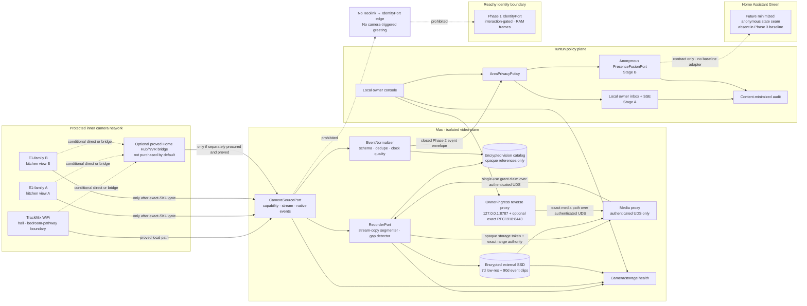
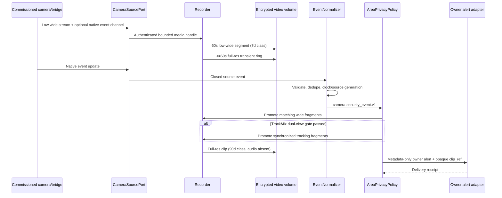
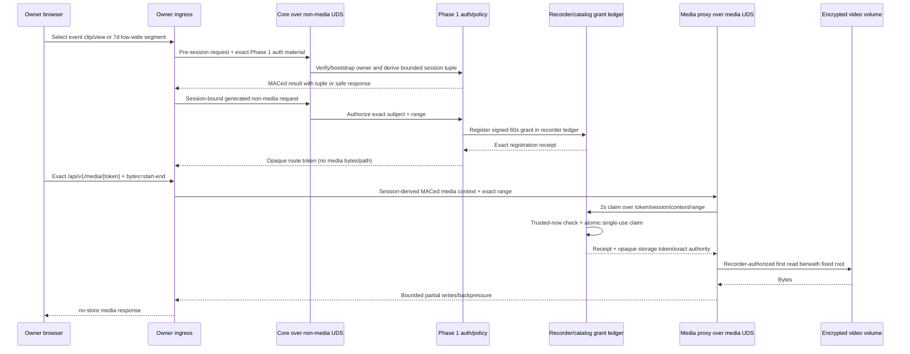
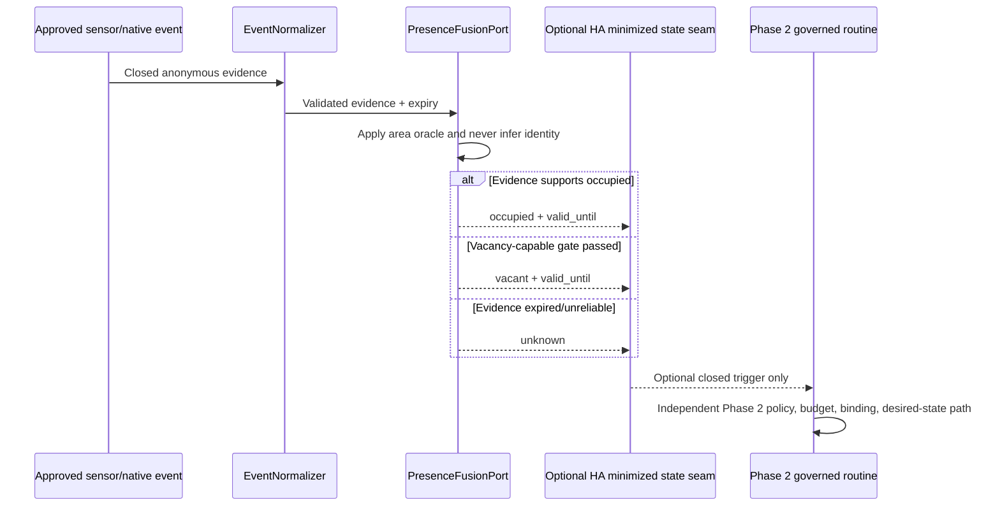

# Tuntun Phase 3 “Vision, Presence & Storage” Architecture Specification

**Status:** design baseline complete; implementation plan ready; implementation not started
**Date:** 2026-08-27
**Scope:** private camera recording, owner security alerts, anonymous presence, storage measurement, and future local-vision seams
**Primary operator:** one owner-managed household
**Depends on:** Phase 1 identity, privacy, authentication, memory, audit, and owner-console boundaries; Phase 2 topology, event, Home Assistant, network, and durable-action boundaries

## 1. Outcome

Phase 3 adds a local, owner-only vision and storage plane without turning household cameras into an identity system. It first establishes reliable storage and a truthful health/playback dashboard, then enables owner security alerts from proved camera-native events, and finally enables anonymous occupancy only in areas where independent sensor evidence can support it. All three outcomes are in scope, but they are delivered and accepted in that order.

The current household has one Reolink TrackMix WiFi in the hall, covering the pathway toward the bedrooms, and two Reolink E1-family cameras in the kitchen with different views. The exact E1 models, hardware revisions, firmware, protocols, and event capabilities are unknown. Phase 3 does not infer them from the “E1” marketing name. Each camera becomes eligible only after its own commissioning record proves the exact local stream, event, codec, audio, storage, restart, and WAN-off behavior.

The initial recorder uses the existing encrypted external SSD attached to the Intel Mac. It retains seven days of one low-resolution continuous wide view per eligible physical camera and 90 days of full-resolution native-event clips. The TrackMix tracking view may be retained beside its wide event clip only after a dual-view capability, synchronization, load, playback, and downstream-channel-count test passes. Otherwise, the deterministic TrackMix fallback is the wide view only. No NAS, NVR, or Reolink Home Hub purchase is approved until a representative seven-day run measures the actual capacity, reliability, Mac load, and camera-path requirements.

Reolink media and event metadata never identify a family member. Family personalization remains Reachy-only, local, short-lived, and interaction-gated under Phase 1. Raw camera media never reaches cloud, an LLM/VLM, canonical memory, or Home Assistant, and never enters an audit body or application log. Automatic camera-triggered greetings are absent.

## 2. Locked decisions

| Area | Decision |
|---|---|
| Delivery order | Storage/health/dashboard foundation → owner security alerts → anonymous occupancy where sensor evidence passes |
| Cameras | One TrackMix WiFi in the hall; two E1-family cameras in the kitchen with different views |
| E1 capability | Exact model, hardware revision, firmware, local protocol, codec, event, and storage support are commissioning gates; no E1 capability is assumed |
| Camera vendor egress | A source is eligible for the Tuntun recorder only when vendor cloud, UID/P2P, and all other outbound control, DNS, metadata, thumbnail, audio, and media paths are disabled in-device or blocked and verified at the network boundary; otherwise it remains vendor-native-only and absent from Phase 3 |
| Identity | Reolink is never an identity source; no face recognition, face embedding, named tracking, or correlation to a Reachy profile |
| Reachy identity | Reachy-only and interaction-gated for enrollment, an active conversation, or a current explicitly invoked physical identity-check ceremony; Phase 1 raw-frame non-retention remains unchanged and no passive re-encounter workflow exists |
| Raw-media boundary | No raw camera frame, thumbnail, clip, audio track, stream URL, or credential reaches cloud, an LLM/VLM, canonical memory, or Home Assistant, or enters audit bodies or ordinary logs |
| Camera audio | Disabled at the camera where supported and stripped/rejected again at ingest; no live or recorded camera audio is a Phase 3 feature |
| Continuous retention | Seven days of low-resolution continuous video, using one canonical wide substream per eligible physical camera |
| Event retention | Ninety days of full-resolution clips for approved native event classes |
| TrackMix dual view | Event clips may retain wide plus tracking views only if capability, synchronization, load, playback, privacy, and channel-count tests pass; otherwise wide only |
| TrackMix movement | Auto-tracking fails closed unless a full mechanical and automatic-tracking arc test proves that no bedroom interior is reachable; static privacy masks are not accepted as a substitute |
| Initial storage | Existing encrypted external SSD on the Mac, with a dedicated video volume/quota separate from Home Assistant backups |
| Procurement | Seven measured days are mandatory before any NAS, NVR, or Home Hub purchase; NAS decision remains pending |
| Playback and alerts | Owner only; no child, other adult, Guest, anonymous, or Home Assistant media access |
| Privacy controls | Tuntun Privacy Shield and the independent security recorder are separate truthful states; Privacy Shield does not stop recording unless the recorder is separately paused |
| Security alerts | Local, metadata-only by default, deduplicated, policy-scoped, and owner-only; no automatic greeting or direct device action |
| Occupancy | Anonymous `occupied`, `vacant`, or `unknown` only where evidence is commissioned; absence of a camera event never proves vacancy |
| Area and zone identity | Every camera zone is a versioned child of one exact canonical Phase 2 `(area_id, area_generation)` and one camera-binding generation; display names such as “room” never substitute for either identifier |
| Home Assistant | Receives no media, camera credentials, identity, face vector, or raw camera entity; any later device action still uses Phase 2's closed signed policy/action path |
| Remote access | No public inbound path, port forwarding, public camera URL, or remote playback; Phase 6 owns VPN access |
| Open source | Adapter-driven, Apache-2.0-publishable framework with synthetic media fixtures only |
| Owner-ingress lifecycle | Task 17 creates the sole owner-ingress wheel, signed route manifest, and canonical `phase3.owner_ingress.v1` service row. After later route changes, the Task 26 alert checkpoint refreshes/re-signs and fully lifecycle-qualifies that same row before its seven-day calibration, and Task 32 repeats the protocol for the final route graph. A stale row/receipt can be used only with its complete matching rollback set and cannot support current physical or promotion evidence |
| Continuous feature authority | Phase 3 reuses Phase 2's externally pre-issued `SignedFeatureManifestRolloverChainV1`, `FeatureManifestLeaseSupervisor`, `FeatureAuthorityLease`, and `FeatureAuthorityCampaignEvidenceV1`/canonical schema unchanged. No Phase 3 process can sign, renew, substitute, extend, or locally redefine authority. Every 48-hour, seven-day, or conditional 30-day campaign requires one frozen-candidate chain covering the complete interval; its counted clock starts only after an index-zero controlled-restart activation receipt exact-matches the live candidate/composition, and every admission/background iteration checks both the half-open wall validity and non-extendable monotonic lease. A changed code, package, service registration, route, policy, configuration, physical binding, firmware, storage volume, or candidate digest requires a newly externally signed chain; a sequential campaign may reuse its documented owner-only path only by atomically replacing the closed prior campaign's file, never by widening, merging, or copying an old chain. Missing/stale initial activation, nonzero initial index, missing, extra, late, reordered, widened, rollback, signature-invalid, candidate-drifted, or expired current/next authority, either exact deadline equality, wall rollback, stale composition, or a missing/substituted rollover/restart receipt closes affected work before preparation or I/O, invalidates the campaign, and enters controlled whole-composition recovery. The shared downstream adversarial harness proves no admission, preparation, provider-call, trigger, or effect counter advances after each injected fault and that a dishonest zero-gap claim is rejected. Evidence binds the chain ID/digest, ordered envelope and transition/restart-receipt digests, admission-sample-log digest, exact interval, and every canonical literal-zero counter |

## 3. Scope boundaries

### 3.1 Included

- Exact camera inventory, placement map, canonical Phase 2 area binding, versioned camera zones, privacy classification, firmware, and capability evidence.
- Local camera-source adapters for proved direct RTSP/ONVIF/vendor event paths, proved hub/NVR-mediated paths, and explicit camera-native-only fallbacks.
- A least-privilege Mac recorder using stream-copy segmentation, encrypted external-SSD storage, checksums, gap detection, crash reconciliation, and deterministic retention.
- A separate encrypted vision catalog containing media metadata and opaque references, never family identity.
- Owner-only local playback, search, event review, export, deletion, retention, health, capacity, and recorder controls.
- Native event normalization, schema validation, deduplication, time-quality checks, alert cooldown, and privacy-zone policy.
- Owner security alerts after the event-class quality gate passes.
- Anonymous occupancy state after an area-specific sensor/evidence gate passes.
- Camera, stream, event channel, recorder, catalog, clock, storage, and retention health.
- A disabled-by-default, bounded selected-frame contract for Phase 5 local vision; Phase 3 does not register an implementation.
- Seven-day measured sizing and an evidence-bound NAS/NVR decision record.
- Failure injection, privacy tests, network tests, retention tests, and a household soak.

### 3.2 Explicitly excluded

- Reolink or recorder-based face recognition, named person tracking, age/gender inference, gait recognition, biometric templates, or identity correlation.
- Camera-triggered family greetings, camera-triggered Reachy engagement, or camera-triggered memory retrieval.
- Raw media, thumbnails, audio, or vision prompts sent to cloud, any LLM/VLM (including OpenAI or Qwen), Home Assistant, or Tuntun canonical memory.
- Continuous local vision inference, object detection added by Tuntun, posture/emotion analysis, or any local/remote VLM use. Phase 5 may add only a bounded selected-frame, non-generative local computer-vision processor under Section 11.4; raw media still cannot enter a language model.
- Camera audio recording, acoustic event analysis, intercom/talkback, or microphone use.
- Child monitoring, child-specific presence history, private-room RGB cameras, or bedroom/bathroom vision.
- Automatic light/media/security actions from a camera event. A later action must be independently authorized through Phase 2.
- Home Assistant's Reolink camera/media entities in the household profile; they would place raw camera access and broad Reolink credentials in the device plane.
- Public RTSP/ONVIF/HTTP, vendor-cloud recording, automatic cloud thumbnails, public dashboards, or router forwarding.
- A NAS, NVR, Home Hub Pro, larger drive, accelerator, or new presence sensor purchase before its gate.
- A claim that the existing external SSD is redundant, off-site, theft-resistant, fire-resistant, or a backup of the video plane.
- Indefinite incident pinning. An owner may make an explicit encrypted export; that copy is outside managed retention and is disclosed as such.

## 4. Staged outcomes

| Stage | Owner-visible result | Prerequisite | Ineligible/failed fallback |
|---|---|---|---|
| C — storage and dashboard | Local recording, gap/health view, clip search, playback, export, exact retention, capacity forecast | Camera source + recorder + SSD + privacy gate | Camera remains inventory-only or native-SD-only; no central-retention claim |
| A — security alerts | Native event → canonical area/camera-zone/time policy → dedupe/cooldown → owner metadata alert with an authenticated clip link when available | C plus event-quality and owner policy approval | Alerts for that source/class remain absent; recording continues |
| B — anonymous occupancy | Expiring `occupied`, `vacant`, or `unknown` state and optional governed Phase 2 event/action seam | C plus area-specific sensor/evidence calibration | State is `unknown`; no automation or inferred vacancy |

Stage letters preserve the earlier alternatives, but implementation order is C, then A, then B. Reaching a later stage never retroactively weakens an earlier privacy or storage gate.

## 5. Architecture

Phase 3 uses two planes with a one-way, minimized event boundary. Raw video stays inside the video plane. The policy plane receives only closed derived events and opaque clip references.



### 5.1 Process and storage model

- `tuntun-camera-source`, `tuntun-recorder`, `tuntun-media-proxy`, and `tuntun-owner-ingress` run as four separate least-privilege side processes from `tuntun-core` (five closed Phase 3 processes including core).
- Owner ingress is the sole network-facing HTTP process. It always binds only `127.0.0.1:8787`; port 8787 never binds an interface, wildcard, or IPv6 address. An independently commissioned, enabled, unexpired private-LAN origin may additionally bind its one exact RFC1918 address on `:8443`. It forwards only the exact normalized media path over authenticated UDS to the media proxy and only generated non-media owner routes over a separate authenticated UDS to core. Core never reads or relays media bytes and owns no TCP listener; media proxy never owns any TCP listener.
- The recorder has access only to camera-stream handles, the dedicated video volume, and its own catalog/keys. It cannot open the Phase 1 database, memory keys, provider keys, Home Assistant action key, or Reachy identity store.
- Routine ingest uses codec stream-copy; no routine decoding, transcoding, or vision inference is allowed. This keeps the Intel Mac's CPU available for voice and policy work.
- One bounded on-demand playback transcode may run for the owner when the browser cannot play the native codec. It is paused behind an active voice turn, produces no durable cache, strips audio, and is deleted on completion/cancel/session expiry.
- The vision catalog is a separate SQLCipher database and Keychain namespace. It stores metadata, checksums, retention state, gaps, and opaque file tokens; canonical memories and identity records cannot reference it.
- Video media is excluded from Phase 1 portable backups, Home Assistant backups, Time Machine, cloud sync, Spotlight content indexing, crash reports, and source control.

## 6. Component ownership and trust boundaries

| Component | Owns | Must not own |
|---|---|---|
| Camera inventory service | Exact device/revision/firmware, placement, room class, source capability evidence, lifecycle state | Credentials, raw media, identity |
| `CameraSourcePort` adapter | Local authentication, stream/event connection, capability discovery, source health | Family profile, Home Assistant mutation, provider access |
| Recorder | Bounded segment write, pre-event ring, promotion, checksum, retention class, gap state | Event policy, alert recipient, identity, model inference |
| Vision catalog | Segment/clip metadata, opaque references, gap/retention/health state | Frames, thumbnails, transcripts, family names, memory IDs |
| Event normalizer | Closed-schema validation, dedupe, clock quality, native detector basis | Free-form labels, identity, actions, raw media |
| Area privacy policy | Canonical area/camera-zone sensor, recording, processing, access, alert, and presence rules | Stream credentials or media bytes |
| Local owner alert service | Durable owner-inbox item, authenticated same-origin SSE to a currently connected paired page, optional foreground browser notification mirror, cooldown/deduplication, delivery/delay result | Media body, identity, arbitrary recipients, service worker/background push, native Companion app, SMS/email, or vendor-cloud delivery |
| Presence fusion | Anonymous expiring area state from approved signals | Track identity, durable movement history, named-person state |
| Owner ingress | Loopback-only `127.0.0.1:8787`, optional exact commissioned RFC1918 `:8443`, TLS for LAN, trusted request-context signing, generated non-media route allowlist, exact media-path split, bounded backpressure/cancellation | LAN/wildcard/IPv6 `:8787`, uncommissioned/wildcard `:8443`, media/catalog/credential access, route invention, caching, response-body logging |
| Playback proxy | Authenticated-UDS media requests, recorder-owned single-use subject claims, one exact byte range, short-lived session | Catalog/database access, LAN listener, camera URL, reusable token, directory browsing, non-media route |
| Home Assistant Green | Future contract-only minimized anonymous state seam; no Phase 3 baseline adapter/entity/route | Camera entity, stream, clip, credential, face data, video history |
| Reachy IdentityPort | Phase 1 interaction-gated face/voice personalization | Reolink event/media or passive camera tracking |
| Owner console | Truthful status, exact approvals, recorder/privacy controls, playback | General filesystem access or reusable stream credential |

## 7. Camera commissioning gates

### 7.1 Required record for every camera

Before a source may record, emit an alert, or contribute to presence, the owner creates and passkey-approves one immutable commissioning generation containing:

- physical label, stable Tuntun device/endpoint IDs, exact product model, hardware revision, firmware/build/config version, and serial commitment;
- canonical Phase 2 `area_id`, versioned `camera_zone` records, camera orientation, complete visible-area map, prohibited areas, notice state, and owner-reviewed sample-frame commitment retained without the frame;
- direct and bridge protocol support, enabled ports, transport, authentication mode, account privilege, simultaneous-stream limit, and vendor/P2P/cloud state;
- every main/sub/tracking stream resolution, frame rate, codec, average/peak bitrate, GOP behavior, timestamps, and audio-track behavior;
- native event classes, event transport, confidence availability, zone support, pre/post-event behavior, and event/clip time relationship;
- microSD capacity/path if present, overwrite behavior, camera reboot/mains recovery, Wi-Fi quality, and WAN-off behavior;
- recorder compatibility, segment/playback result, CPU/RAM/disk impact, clock-skew result, and negative egress test;
- proof that every outbound vendor control, UID/P2P, DNS, metadata, thumbnail, audio, and raw-media route is disabled in-device or blocked at the network boundary and remains blocked through reboot, retry, WAN restoration, and vendor-app polling;
- capability digest, source-binding generation, policy generation, evidence bundle digest, approver, and expiry/review date.

A firmware update, factory reset, source-path change, mount/orientation change, credential rotation that changes privileges, or capability drift increments the generation and disables recording/event/presence routes until the affected gates pass again.

### 7.2 TrackMix hall and bedroom-pathway gate

The TrackMix WiFi can pan approximately 355° and tilt approximately 90° and may automatically follow a moving subject. Reolink's documented dynamic privacy-mask support does not include TrackMix; ordinary masks can offset when a PTZ camera moves. Phase 3 therefore treats a static privacy mask as a display aid, not a boundary that can protect a bedroom.

Commissioning uses the worst credible physical geometry:

1. Open each bedroom door and place a high-contrast privacy target immediately inside the threshold and at every deeper point that the camera could plausibly reach.
2. From the configured monitor/guard point, manually sweep the complete accessible pan/tilt range and capture only a test-run digest plus pass/fail observations.
3. Run each supported tracking mode while a test subject traverses the hall, bedroom pathway, every doorway, and both direction changes; repeat by day, infrared night, spotlight state, after reboot, and after camera calibration.
4. Verify wide and tracking lenses independently. A telephoto/tracking view that sees a prohibited target fails even if the wide view does not.
5. Repeat at least 30 adversarial traversals per doorway, including a subject briefly entering and leaving the room and another subject crossing in the hall.
6. Verify any claimed firmware pan/tilt limit after reboot, power loss, calibration, firmware update, monitor-point return, patrol, manual PTZ, and auto-tracking. A UI limit that can be bypassed by another mode is not a control.

The gate passes only when no prohibited target is visible in any accepted frame or recorded clip and the limit survives every reset/recovery case. If it fails, the deterministic fallback order is:

1. disable physical pan/tilt auto-tracking and patrol;
2. use digital tracking only from a fixed, proved guard point if that mode never moves the camera and passes the same test;
3. constrain the physical field by relocating/remounting the camera or installing a non-software field-of-view barrier; and
4. if a fixed view still reaches a bedroom interior, exclude or relocate the camera from Phase 3.

Recording is not enabled merely because a bedroom door is usually closed. Future room layout or mounting changes reopen the gate.

### 7.3 E1-family deterministic gate and fallback

The two kitchen cameras are recorded as `E1-family unknown` until device information proves otherwise. A base Reolink E1 is documented as lacking standalone RTSP, ONVIF, FTP, and web access, while E1 Pro/Zoom revisions have different capabilities. Therefore:

- neither E1 is assigned a direct stream, FTP, native-event, PTZ, privacy-mode, or dual-stream capability before the probe;
- each physical camera is tested separately even if their enclosures look identical;
- a standalone local RTSP/ONVIF or compatible vendor event path is preferred only when the exact revision proves it;
- a camera that lacks direct protocols may use a Reolink Home Hub/NVR bridge only after that bridge is separately procured, commissioned, WAN-off tested, and bound to the adapter;
- camera microSD may remain a disclosed local fallback only if overwrite, playback, time, audio-off, and retention behavior are proved; it does not satisfy central SSD, dashboard, or 7/90-day retention claims;
- if no approved source path exists, the camera remains inventory-only in Tuntun. The dashboard states `central recording unavailable`; Phase 3 does not scrape a vendor app, enable cloud recording, or buy a bridge silently.
- if vendor cloud/P2P or any other outbound control, DNS, metadata, thumbnail, audio, or media route cannot be disabled in-device or blocked and verified at the network boundary, the camera is ineligible for the Tuntun recorder. It may remain vendor-native-only under the owner's separate vendor account, but it has no Phase 3 binding, recording, event, alert, occupancy, playback, or selected-frame route.

This gate is deterministic: unknown means disabled, not “best effort.”

### 7.4 TrackMix wide/tracking event-view gate

The continuous policy always uses one low-resolution wide view. A full-resolution event may include both the wide and tracking views only when all of these pass:

- the delivered TrackMix revision exposes a stable, separately addressable tracking view with matching native event timing;
- both streams are locally available with camera audio disabled and recorder audio rejection enabled;
- event start/end alignment is within two seconds and the catalog can represent both as one event without false atomicity;
- the full TrackMix privacy-arc test passes for both views;
- seven-day recording remains within Mac CPU/RAM/network/SSD limits and does not reduce voice or backup acceptance;
- owner playback and export can label the views truthfully;
- a future third-party VMS/NAS quote counts the exact licensed channels required by the selected integration. Synology may treat the two views as two licenses; a compatible Reolink NVR may treat the physical camera as one channel. Neither result is assumed before the product-specific test.

Failure disables only the tracking-view recording. The full-resolution wide event clip remains the approved fallback.

## 8. Canonical camera and media contracts

### 8.1 Canonical area and camera-zone binding

Phase 3 imports the authoritative Phase 2 `AreaV1` and `CanonicalLocationRefV1` unchanged. Exact `(area_id, area_generation)` is required wherever location authority matters. A camera-specific zone is a stable nested entity, never a room-name string or an adapter-local alias:

```text
camera_zone.v1
  zone_id
  area_id
  area_generation
  camera_binding_id
  camera_binding_generation
  polygon_normalized[]
  exclusion_mask_commitment
  privacy_class: approved_common | boundary_exclusion | prohibited_private
  zone_generation
  status: commissioned | disabled | retired
```

One `zone_id` belongs to exactly one canonical `(area_id, area_generation)` and one camera-binding generation. `polygon_normalized` is interpreted only in the commissioned camera/view coordinate space; `exclusion_mask_commitment` binds the reviewed mask without putting an image in policy storage. A display label such as “Hall,” “kitchen,” “room,” or its Hindi translation is presentation metadata only and is never accepted where `area_id` or `zone_id` is required. Guest is an orthogonal narrowing actor/session policy and is never a room class.

Creating, moving, reshaping, reclassifying, disabling, or rebinding a zone requires an exact owner passkey and compare-and-swap against the current `zone_generation`. Phase 2 area reclassification increments `area_generation`. Either change increments affected privacy/source-policy generations, invalidates event, alert, occupancy, playback-selection, and selected-frame bindings, and keeps them disabled until the new geometry and privacy evidence pass. An event whose `area_id`, `area_generation`, `zone_id`, `zone_generation`, camera binding, or camera-binding generation does not resolve to the same commissioned record is quarantined. Restart and restore reopen the current area row; stale common-area authority never resurrects after private/prohibited reclassification.

### 8.2 Phase 2 event envelope reuse

Every Phase 3 event uses the unchanged Phase 2 envelope:

```text
event_id
schema_version
event_type
source_endpoint_id
source_generation
source_sequence
observed_at
ingested_at
expires_at
correlation_id
causation_id
deduplication_key
sensitivity_class
payload
```

Unknown versions, fields, event types, endpoint generations, excessive clock skew, invalid enum values, oversized payloads, duplicate content under a new key, and payload/type mismatches are quarantined before policy evaluation. The frozen publisher registry maps each accepted `event_type` to exactly one payload schema, publisher/source class, sensitivity, size/lifetime bounds, and consumer route. Phase 3 may register only the narrowed `camera.security_event.v1` and `presence.changed.v1` specializations; it does not add `direction`, `payload_schema_id`, or another routing field to the Phase 2 envelope. Dispatch reopens the current publisher/source/location generation and rejects stale-wrapper/fresh-payload, fresh-wrapper/stale-payload, sequence replay/reorder, and type/payload mismatch before advancing a consumer cursor. Camera events never contain a name, profile/child/guardian ID, face/body vector, conversation ID, memory ID, raw address, IP/MAC address, stream URL, filename, credential, vendor account, or free-form detector label.

### 8.3 Security event

```text
camera.security_event.v1
  camera_binding_id
  camera_binding_generation
  area_id
  area_generation
  zone_id
  zone_generation
  event_class: person | vehicle | pet | package | motion | unknown
  detector_basis: device_native | hub_native
  detector_version
  started_at
  ended_at: optional while active
  confidence_band: unavailable | low | medium | high
  verification: native | corroborated | uncertain
  clock_quality: synchronized | degraded | untrusted
  clip_ref: optional opaque UUID
  view_set: wide | wide_and_tracking
  privacy_policy_version
```

`confidence_band` is accepted only after calibration maps the device value to the bounded bands. The recorder never invents a numeric confidence. `clip_ref` is meaningful only to the owner media proxy and is not a URL. The event always carries the exact current `area_generation` adjacent to `area_id`.

### 8.4 Anonymous presence state

```text
presence.changed.v1
  event_id
  area_id
  area_generation
  state: vacant | occupied | unknown
  count_band: zero | one | multiple | unknown
  source_kinds: bounded enum list
  evidence_policy_version
  confidence_band: low | medium | high
  observed_at
  valid_until
  transition_reason
```

No source may assert `vacant` solely because no camera event arrived. A camera-native person event may set `occupied` for at most five minutes; expiry becomes `unknown`. `vacant` requires an independently commissioned sensor or a closed multi-signal rule whose false-vacant gate passes. `valid_until` may never be extended by replaying the same evidence. The only governed cross-domain route is the closed `CrossDomainEventV1[PresenceChangedV1]` direction from Phase 3 presence policy to the Phase 2 Home policy consumer. Envelope/payload type and event ID, source generation/sequence, deduplication key, expiry, and current area generation must match; replay, reorder, stale/absent baseline, or mismatch produces no HA/action dispatch.

### 8.5 Recording health

```text
recording.health.v1
  camera_binding_id
  stream_role
  source_state: online | degraded | offline | ineligible
  event_channel_state: online | degraded | offline | unsupported
  recorder_state: running | paused | failed
  last_complete_segment_at
  current_gap_seconds
  storage_state: healthy | warning | retention_at_risk | write_blocked
  projected_days_continuous
  projected_days_events
  clock_skew_seconds
  capability_generation
  health_reason_codes[]
```

Health events contain counts and reason codes only. They never include media paths, credentials, or raw errors returned by a camera.

### 8.6 Segment and clip catalog

```text
segment.v1
  segment_id
  camera_binding_id / generation
  stream_role: low_wide | event_wide | event_tracking | transient_event_ring
  started_at / ended_at
  sequence_start / sequence_end
  codec / width / height / fps_band
  byte_count
  sha256
  completeness: complete | truncated | corrupt | missing
  retention_class: continuous_7d | event_90d | transient_60s
  immutable_expires_at
  opaque_storage_token
```

```text
clip.v1
  clip_id
  event_id
  camera_binding_id / generation
  area_id / zone_id / event_class
  started_at / ended_at
  view_refs[1..2]
  completeness
  immutable_expires_at
  playback_capability_state
```

Paths and filenames are opaque random tokens. No file or directory name contains a family name, room display name, camera IP, or vendor identifier. A clip can contain one wide view or one wide plus one tracking view; it never falsely claims that two view files are a transactionally atomic recording.

### 8.7 Playback capability

```text
media.playback_grant.v1
  grant_id
  route_token_digest
  owner_subject_id
  owner_session_id / generation / binding commitment
  subject:
    event_clip: clip_id / clip_generation / catalog_generation / view
    continuous_segment: segment_id / catalog_generation / camera binding / low_wide
  allowed_operation: playback
  allowed_range_bytes
  issued_at / expires_at
  single_use
  policy_version
  parameter_commitment
```

Playback grants expire within 60 seconds and are bound to one current owner session, one exact subject—either a 90-day event clip/view or a seven-day `low_wide` continuous segment—the sole `playback` operation, and one inclusive range of at most 8 MiB. Core registers the signed grant in a recorder-owned durable single-use ledger before returning the opaque route token. The media proxy has read-only code and no catalog/database grant table. For each request it sends a two-second inner claim carrying the route-token digest, exact derived owner-session tuple, ingress-context commitment, and normalized requested range. The recorder validates `claim.issued_at <= trusted_now < claim.expires_at` before ledger/catalog/storage access, atomically consumes the matching live grant, and returns only an opaque storage token plus exact subject/range authority. The proxy exact-compares the receipt and rechecks both claim and grant deadlines at first read. A fresh outer IPC envelope cannot revive a stale inner claim.

The public media route accepts exactly one normalized `Range: bytes=start-end`; missing, multiple, suffix, open-ended, over-8-MiB, or unequal-to-grant ranges reject before any media read. Grants and receipts reveal neither storage path nor camera address. Export and early deletion use distinct five-second, single-use request contracts and require a fresh owner passkey plus exact clip generation/view/destination-or-delete-set, immutable expiry, managed byte/count, canonical request digest, and commitment. Core checks the inner deadline before send and immediately before IPC; the recorder checks it again before command/catalog/media access and inside the first-read or atomic-unlink primitive. Stale-inner/fresh-envelope requests produce zero read/unlink effect. Neither operation is representable in the range-playback proxy grant, and an authenticated console session alone cannot mint either operation.

## 9. Recorder and retention design

### 9.1 Recording profile

For every eligible physical camera:

- one low-resolution H.264/H.265 substream is recorded continuously using codec stream-copy into 60-second segments;
- segments expire exactly seven days after their immutable end time;
- the full-resolution wide stream feeds a bounded event pre-roll ring; unpromoted fragments expire within 60 seconds;
- an accepted native event promotes the corresponding full-resolution fragments, includes up to ten seconds before the event, continues until 30 seconds after the last accepted event update, and caps one clip at five minutes;
- overlapping events for the same camera and approved zone are coalesced into one clip with multiple event references; they do not create duplicate media;
- promoted full-resolution event clips expire exactly 90 days after the final event/clip end time;
- a TrackMix tracking stream follows the same event-only rule only when Section 7.4 passes;
- all audio tracks are rejected. A source that cannot disable or cleanly strip audio is ineligible.

Retention values are owner policy, not storage suggestions. No space-pressure job may delete a segment before its immutable expiry or silently change 7/90 days. Clock rollback cannot extend retention; catalog UTC plus a monotonic runtime reference drives active deadlines, and restart reconciles against trusted UTC.

### 9.2 External SSD layout

The existing physical SSD is inventoried before use. One immutable expected-volume record binds the APFS container UUID, exact `TUNTUN_VIDEO` volume UUID/root and quota bytes, minimum `HA_BACKUPS` reserve bytes, recorder UID, and volume-qualification generation. APFS encrypted volumes/quotas separate at least:

```text
TUNTUN_VIDEO       raw segments, event clips, vision catalog
HA_BACKUPS         Phase 2 encrypted Home Assistant backup artifacts
```

The recorder account can access `TUNTUN_VIDEO` only. Green's CIFS account can access `HA_BACKUPS` only. The video volume is not exported over SMB/NFS/FTP and is excluded from normal backups and indexing. The exact SSD model, firmware, nominal/usable capacity, SMART/health visibility, endurance indicator, cable/enclosure, filesystem, encryption state, sustained write rate, temperature, reconnect behavior, and cold-boot unlock are commissioning evidence.

An automatically unlocked volume key may live only in the Mac Keychain, protected by FileVault and owner account controls. A missing key, unencrypted volume, unexpected filesystem, APFS-container or mount-point substitution, wrong volume UUID/quota, insufficient HA-backup reserve, stale qualification generation, read-only mount, or ownership drift blocks recording. Startup and every disconnect/reconnect revalidate the complete expected record before any catalog/media write. The application does not format or erase a disk automatically.

### 9.3 Seven-day measured capacity method

The capacity decision uses complete segment bytes, not vendor bitrate marketing, and compares the result only with the bound `TUNTUN_VIDEO` quota—not physical-container free space. The pilot runs for seven consecutive representative days with the final intended stream settings, all three expected physical cameras, night modes, event classes, ordinary household traffic, Green backups, and normal Tuntun voice use.

The immutable campaign manifest fixes one generation and the exact three-unit physical-camera snapshot: physical-unit commitment, source endpoint/generation, camera binding/generation, capability, recording profile, source-eligibility, egress, exact area/area-generation, zone/generation, privacy-policy/privacy generation, plus common volume-qualification and catalog generations. Any drift invalidates and restarts the campaign; daily rows must exact-match this snapshot. Its semantic matrix contains exactly one row for each expected camera, each required/selected view, and each day index 1–7. Every eligible unit has `wide`; TrackMix has `tracking` only while its current dual-view gate passes. Every excluded unit still has seven explicit ineligible `wide` rows with zero measured bytes and a reason—never an estimated bitrate or omitted camera. Rows are unique by `(physical camera, view, day_index)` regardless of new measurement IDs, and their 24-hour windows are contiguous and anchored to campaign start. Eligible/ineligible counts and selected views are derived from this matrix, never caller-authored independently. The all-three-ineligible outcome is representable as a truthful blocked/native-only decision with every policy byte component—including otherwise measured catalog/filesystem overhead—projected as zero; signed operational evidence remains attached, and the outcome never fabricates a capacity pass. Projection identity, generation, projected time, validity, reason codes, and derived fields are deterministic functions of the stored signed campaign and operational evidence, so restart recomputes byte-identical authority rather than inventing a fresh UUID/time.

Every daily `StorageMeasurementV1` carries a canonical digest over its full campaign/camera/location/privacy/volume/catalog authority and measured facts. Operational evidence binds the exact qualified video volume/quota, measured filesystem/catalog overhead, voice latency/regression, and one independently signed minimized Green-backup receipt for the same campaign, volume, concurrent-load snapshot, backup-policy/objective generations, and reserve. The projection recomputes and exact-compares campaign manifest, measurement, backup-receipt, and operational-evidence digests before deriving any decision. A failed/cancelled backup, missed objective, substituted volume/quota/reserve/load snapshot, unsigned receipt, stale generation, missing matrix row, or restart-generated identity cannot produce `p3_2_pass`.

For each camera/view:

```text
D_continuous = maximum complete low-resolution bytes in any pilot 24-hour bucket
D_event      = max(
                 maximum promoted full-resolution event bytes in any pilot 24-hour bucket,
                 1.5 × seven-day mean event bytes/day
               )

policy_bytes = 7 × sum(D_continuous)
             + 90 × sum(D_event)
             + measured_catalog_and_filesystem_overhead

required_usable_capacity = policy_bytes / 0.80
```

The division by `0.80` reserves 20% free usable capacity for filesystem health, bursts, reconciliation, and measurement error. A planning-only cross-check is:

```text
decimal GB/day ≈ aggregate average megabits/second × 10.8
```

The measured report records per-stream bytes, daily/event variation, highest 15-minute bitrate, segment gaps, corrupt/truncated segments, event duty cycle, Wi-Fi loss, clock skew, SSD temperature/health, process CPU/RAM, network load, voice-latency change, Green-backup timing, and projected 7/90-day capacity with and without the conditional TrackMix view.

The SSD passes only if:

- the exact bound `TUNTUN_VIDEO` quota is at least `required_usable_capacity` under the selected view set, while the separate minimum `HA_BACKUPS` reserve remains available and a Green backup succeeds even when video reaches its quota;
- segment coverage is at least 99.5% per camera across the pilot and every gap longer than five seconds is surfaced within 30 seconds;
- sustained write, temperature, reconnect, cold boot, and crash recovery pass;
- the recorder adds no more than 10% to Phase 1 first-audio P95 and does not push it above the Phase 1 four-second target;
- the Green backup path meets its Phase 2 recovery objectives during recorder load; and
- the owner explicitly accepts that one Mac-attached SSD is one device and one site, not redundancy.

If it fails, the system does not shrink retention. The NAS/NVR decision opens with the failed evidence attached.

### 9.4 Runtime capacity pressure

The video volume maintains the following deterministic thresholds:

| Free usable capacity | Behavior |
|---:|---|
| Above 25% | Normal |
| 20–25% | Owner warning and immediate projection refresh |
| 15–20% | `retention_at_risk`; block new exports and on-demand transcodes; no early deletion |
| 10–15% | Stop admitting new low-resolution continuous segments at a segment boundary; preserve unexpired full-resolution event clips and record an explicit continuous gap |
| Below 10%, read-only, or catalog integrity uncertain | Stop all new recorder writes, preserve existing media/catalog, rely on proved camera-native storage only, and alert the owner |

Security event clips have failure-time priority over continuous context, but neither policy is described as satisfied while admission is stopped. Recovery requires sufficient space plus catalog/filesystem integrity verification; recording never resumes simply because a mount path reappears.

### 9.5 Deletion, export, and copies

- Retention expiry deletes catalog/file references in a bounded transaction and then unlinks the media. APFS encryption protects at rest, but deletion does not claim physical byte erasure from flash media.
- Every extra copy—camera microSD, Reolink hub/NVR, owner export, diagnostic copy, restore copy, or vendor cloud—is displayed separately with its own retention and deletion authority.
- Phase 3 makes no automatic raw-video backup. The seven/90-day store is the primary video record, not a recoverable backup.
- Owner export requires a fresh passkey, exact clip/view/destination commitment, an encrypted owner-selected local destination, checksum verification, and a warning that Tuntun no longer controls the exported copy's expiry.
- There is no indefinite managed pin. To preserve an incident beyond 90 days, the owner exports it deliberately.
- Early deletion requires a fresh owner passkey bound to the exact clip set and displayed time/size/count. The catalog leaves only a content-minimized audit commitment.

## 10. Area and placement privacy matrix

| Area class | Current/allowed Phase 3 input | Recording | Allowed derived state | Prohibited/default-off |
|---|---|---|---|---|
| Hall/common pathway | Current TrackMix only after full arc/doorway gate and household/visitor notice | 7-day low wide + 90-day full event; tracking view conditional | Native security event; bounded anonymous occupied state | Bedroom interior, identity, greeting, child tracking, microphone, unproved PTZ |
| Kitchen/common area | Two current E1-family cameras after exact-device/source/field gate | Same 7/90 policy for each eligible camera | Native security event; anonymous occupied state only after evidence gate | Identity, food/person profiling, microphone, private-memory inference |
| Bedroom doorway/interior | No RGB camera may see beyond the approved hall boundary | None | A separately approved non-imaging binary sensor may be considered later | Any RGB/thermal/depth image, audio, identity, posture, raw retention |
| Adult bedroom | Non-imaging PIR/mmWave/door sensor only after explicit owner policy | None | Short-lived anonymous state if calibrated | Camera, microphone, identity, durable history |
| Child bedroom | Minimal non-imaging binary presence only after owner plus distinct current guardian approval | None | Short-lived anonymous state under the child rule | Camera, microphone, posture/sleep tracking, named state, durable history |
| Bathroom | Door/PIR or carefully configured binary presence only | None | Ephemeral occupied/unknown only | Any imaging, stored thermal/depth data, microphone, identity |
| Exterior/entrance future | Explicitly commissioned camera and notice/legal gate | Per approved 7/90 policy | Native security event | Face recognition and cloud media |
| Unknown/unclassified | Inventory health only | None | None | Recording, alerting, presence, automation |

An endpoint-area mutation requires an owner passkey, increments topology and privacy generations, invalidates current source/event/presence bindings, and disables processing until commissioning passes. “Common area” never means child-readable media: playback remains owner-only.

## 11. Identity, memory, AI, and action isolation

### 11.1 Absolute identity separation

- The Reolink inventory and event schemas contain no profile, household member, child, guardian, voiceprint, face vector, or candidate identity field.
- No join key exists between the vision catalog and Phase 1 profile/biometric tables.
- The event normalizer cannot call `IdentityPort`; `IdentityPort` cannot query the vision catalog.
- A simultaneous Reachy conversation and Reolink event may share a coarse clock but are never joined into “who was seen.”
- No Reolink event changes the active speaker or memory namespace.
- Camera-native labels such as person/vehicle/pet are untrusted event classes, not identities.
- No alert names a person. Human-facing text says, for example, “Person event in the hall zone,” never “X is in the hall.”
- Automatic camera greetings and camera-triggered Reachy wake are not registered routes.

### 11.2 Memory and LLM isolation

- Raw video, audio, thumbnails, transcripts, OCR, filenames, stream URLs, and camera metadata never enter the seven canonical memory types.
- Phase 3 camera events do not automatically propose semantic, episodic, relational, preference, procedural, or policy memory.
- Provider context builders have no vision-catalog adapter and reject `clip_ref`, `segment_id`, camera endpoint, area presence, or media data.
- Cloud/search/provider adapters cannot open the video volume or media proxy.
- Audit contains action/outcome codes and HMAC commitments only, never event bodies, clip paths, frames, thumbnails, or occupancy timelines.

### 11.3 Home Assistant and action isolation

- Home Assistant receives no Reolink integration entry, camera entity, media source, snapshot, URL, credential, or recording.
- An approved anonymous presence transition may be emitted as a closed Phase 2 event with no clip reference; Recorder is disabled for that entity by default.
- A camera/presence event has no direct Home Assistant mutation authority.
- A later automation may act only through a separately installed Phase 2 bounded routine manifest. Its authority, target, rate limit, controller epoch, binding, and desired state remain independent of the camera event.
- A malformed or compromised camera cannot sign a Phase 2 action or routine.

### 11.4 Disabled Phase 5 selected-frame seam

Phase 3 publishes a contract but registers no `SelectedFrameVisionPort`. A Phase 5 implementation may receive a selected frame only through a non-generative local computer-vision processor—not `LanguageModelPort`, an LLM, or a VLM—and only when all of the following fields and limits are enforced:

```text
selected_frame_request.v1
  request_id
  camera_binding_id
  camera_binding_generation
  area_id
  zone_id
  zone_generation
  purpose: local_anonymous_cv_observation
  model_manifest_digest
  privacy_policy_version
  max_frames: 1..3
  max_total_bytes: <= 3 MiB
  max_dimension: <= 1920 px
  not_before / expires_at: window <= 5 seconds
  output_schema_id: anonymous_visual_observation.v1
  single_use
  authorization_commitment
```

The only response schema is:

```text
anonymous_visual_observation.v1
  request_id
  state: observed | not_observed | uncertain | rejected
  approved_class: person | vehicle | pet | package | motion | unknown
  count_band: zero | one | multiple | unknown
  zone_id
  confidence_band: low | medium | high | unavailable
  evaluated_at
  valid_until
  model_artifact_id
  model_digest
  calibration_digest
  reason_codes[]
```

The future path is local-only, RAM-only, audio-free, one-purpose, source/zone/model/policy-bound, and closed on result, cancel, timeout, privacy, recorder pause, capability drift, or process failure. It returns one closed typed anonymous observation with confidence/evidence versions. It cannot call or serialize into a language model, return a name/profile candidate, face/body embedding, free-form prose, arbitrary label, memory proposal, Home Assistant action, raw frame, or persistent feature vector.

The response is **advisory evidence only** and remains separate from `camera.security_event.v1` and `presence.changed.v1`. Phase 3 maps `request_id` to the single live request, requires `zone_id` to equal that request's commissioned zone, rechecks the request's exact `(area_id, area_generation)`, `zone_generation`, camera-binding generation and privacy generation, and verifies the exact model/calibration commitments. `state`, `approved_class`, and `confidence_band` may be displayed in an owner-only calibration review; model/calibration fields and `reason_codes` may feed content-minimized quality metrics. Phase 3 ignores `count_band` for occupancy and alert policy. No observation field changes `event_class`, `detector_basis`, `verification`, an alert decision, `occupied`, `vacant`, or a count band; the canonical area remains the request's exact Phase 2 location authority, not a model result. Success never promotes the observation into a security event or presence transition. Any gate failure yields no frame and no accepted observation, while native Phase 3 behavior remains unchanged.

## 12. Owner security alerts

### 12.1 Enablement and policy

Alerts are disabled per camera/event class until the owner approves an exact policy digest containing source/camera-binding generation, canonical area, zone ID/generation, event classes, schedule, cooldown, the fixed `local_owner_inbox_sse_v1` delivery class, privacy generation, and false-positive evidence. The safe initial class is `person`; motion/vehicle/pet/package remain individually disabled until calibrated and useful for that view.

Default alert behavior after approval:

- deliver metadata only: area display name, event class, local time, verification state, and a short-lived owner-authenticated clip action when the clip exists;
- include no image, thumbnail, audio, identity, camera address, or reusable playback token;
- deduplicate updates for one native event and coalesce repeated same-camera/class/zone events inside a 60-second cooldown;
- preserve the first-seen time and current status without generating one notification per update;
- commit the metadata-only item to the single owner's durable local inbox, then send its safe event ID/class/zone/time projection over authenticated same-origin SSE only while a paired owner-console page is connected on the home LAN; reconnect resumes from the last accepted event ID with bounded deduplication;
- the browser Notification API may mirror that safe projection only while the paired page and authenticated session are active and the owner has granted browser permission. There is no service worker, background push, native Companion application, SMS, email, or vendor-cloud delivery in the baseline;
- if every owner page is closed, asleep, unauthenticated, or offline, keep the bounded metadata-only undelivered item for 24 hours and show its original event time plus delayed status at the next local session. Make no immediate-delivery claim and create no public or remote camera path;
- never wake Reachy, speak a household-wide alert, greet a person, or control a light automatically.

An optional future outbound metadata notification requires a separate owner-passkey configuration, processor/retention review, and Phase 6 remote-access policy. It remains absent in Phase 3.

### 12.2 Alert quality gate

For every enabled camera/event class/zone:

- at least 30 scripted positive traversals across day, infrared night, and ordinary lighting produce at least 95% accepted-event recall;
- at least seven representative days produce no more than one owner-visible false alert per 24 hours for that policy;
- replay, reconnect from the last accepted SSE event ID, multi-tab delivery, and duplicate event tests produce zero duplicate owner alerts;
- local event-to-alert latency is P95 at most five seconds while the owner endpoint is reachable;
- an excluded zone, unapproved class, untrusted clock, stale binding, Privacy Shield, recorder/camera pause, or disabled alert policy produces zero alerts;
- a native detector quality failure disables only that class/source; recording remains available.

The owner may choose a stricter threshold, but cannot lower the release gate without an explicit high-risk deviation receipt bound to the exact camera, class, test bundle, measured values, expiry, and policy version.

## 13. Anonymous occupancy

### 13.1 Evidence hierarchy

Occupancy is a local, anonymous area state, not a person track. Evidence is ranked:

1. a calibrated non-imaging presence sensor capable of continuous occupied/vacant observation;
2. a calibrated door/contact plus non-imaging presence rule;
3. a camera-native person event, which may assert only temporary `occupied`;
4. lack of an event, Wi-Fi association, phone presence, audio, Reachy identity, or a TV state, none of which may assert vacancy.

The current hardware has no approved non-imaging room-presence sensor. Therefore Stage B initially exposes framework and `occupied → unknown` behavior from approved common-area native person events; `vacant` remains unavailable until a new sensor is separately selected, purchased, placed, calibrated, and approved. This is a deterministic functional limit, not a pending guess.

### 13.2 State machine

```text
UNKNOWN -> OCCUPIED       accepted current evidence
OCCUPIED -> OCCUPIED      new non-duplicate evidence; valid_until may advance only within policy max
OCCUPIED -> UNKNOWN       evidence expires or source degrades
UNKNOWN -> VACANT         only a commissioned vacancy-capable rule
VACANT -> OCCUPIED        any accepted occupied evidence
VACANT -> UNKNOWN         source/clock/policy/capability becomes unreliable
```

Camera-only occupied evidence expires no later than five minutes after the last accepted event. A source outage always becomes `unknown`, never `vacant`. Count band defaults to `unknown`; `one` or `multiple` requires an explicitly calibrated sensor output and cannot be derived from a transient camera track in Phase 3.

### 13.3 Privacy and retention

- Current presence state exists only in the policy process and an encrypted restart checkpoint with the original expiry; it is removed at expiry.
- No durable area movement timeline, per-person history, heatmap, or child history is stored.
- Home Assistant Recorder excludes presence entities by default. If a later bounded routine needs a state, HA receives only current anonymous state/expiry and still keeps no camera media.
- Audit records only policy/routine decisions and pseudonymous area/source commitments, not a presence timeline.
- Presence cannot personalize a response, retrieve memory, debit screen time, infer a viewer, or authorize an action.

### 13.4 Occupancy acceptance gate

Before an area may emit `vacant`, run at least 100 seeded entry/exit/dwell/source-failure sequences including two people, lingering, rapid re-entry, door left open, sensor outage, clock change, Mac restart, and delayed/reordered events. Acceptance requires zero false-vacant states, at least 95% occupied detection within the area-specific latency target, and every failed/unreliable case becoming `unknown`. A failed area remains `occupied/unknown` only or completely disabled; the owner console states which transitions are eligible.

## 14. Privacy Shield and recorder state matrix

Tuntun Privacy Shield and the camera recorder are independent state machines. The UI must show both prominently and never compress them into one “private” or “secure” badge.

| Privacy Shield | Recorder | Required behavior |
|---|---|---|
| Off | Running | Approved recording, catalog, alerts, and anonymous presence operate |
| On | Running | Reachy/Tuntun conversation media egress, camera outcome adapters, selected-frame seam, alerts, and presence processing stop; the independent local security recorder and retention continue; the UI states “Privacy Shield on — cameras still recording” |
| Off | Paused | Voice assistant remains available; camera stream/event subscriptions and new recorder writes are closed; prior clips remain owner-playable; camera hardware may remain powered and this is disclosed |
| On | Paused | Tuntun processing is shielded and Tuntun recording is paused; prior owner media remains; camera power/native-device behavior is stated separately |

Rules:

- `privacy.on` remains the Phase 1 immediate preemptive local safety operation and must stop Tuntun media/outcome processing within the Phase 1 P95 250 ms deadline. It does not issue camera recording commands.
- Privacy Shield off remains owner-authenticated and revalidates every Phase 1 prerequisite.
- `recorder.pause.camera`, `recorder.pause.all`, `recorder.resume.camera`, and `recorder.resume.all` are closed owner-only operations requiring a fresh passkey bound to exact endpoints, current states, consequences, policy generation, and expiry. Pausing reduces security coverage; resuming reduces privacy. Voice alone cannot perform either.
- Recorder pause closes streams/events and records an explicit gap; it does not claim the physical camera microphone/sensor is powered off.
- If an exact E1 firmware provides Reolink Privacy Mode, that device feature is separately inventoried. It is not renamed Tuntun Privacy Shield and is not assumed across cameras.
- Physical unplugging remains the only universal immediate hardware stop when the owner requires one.

## 15. Owner console extension

Phase 3 adds these owner-only local routes:

1. **Vision overview:** truthful Privacy Shield, recorder, camera power/reachability, stream, event, audio-off, clock, storage, retention, alerts, presence, and external-copy states.
2. **Camera inventory:** exact SKU/revision/firmware, canonical area/camera-zone placement and field map, source protocols, capability generation, enabled ports, complete outbound control/P2P/DNS/metadata/media state and evidence, credentials age, and commissioning evidence.
3. **Recordings:** time/camera/zone/event/health filters, low-resolution timeline, event clips, view labels, completeness, gaps, expiry, owner playback, local encrypted export, and exact deletion.
4. **Storage:** physical SSD/volume identity, encryption, health, temperature, bytes/day, event duty, 7/90 projection, reserve thresholds, Green-backup isolation, and NAS gate evidence.
5. **Security alerts:** source/class/zone/schedule/cooldown, quality evidence, paired owner endpoint, delivery state, queue age, and disable control.
6. **Anonymous presence:** eligible areas, current state/expiry/evidence kind, unavailable transitions, calibration report, and the absence of identity/history.
7. **Privacy map:** room classes, prohibited fields, TrackMix arc result, notice state, sensor rules, and all independent copies.
8. **Vision audit:** content-minimized access/export/delete/configuration/alert/routine decisions and integrity-chain verification.

The browser never receives a camera credential, raw stream URL, direct filesystem path, broad directory listing, reusable media token, or camera administration surface. Error messages are bounded and content-minimized. A clip page uses `Cache-Control: no-store`, strict same-origin policy, authenticated byte-range validation, and safe filenames.

## 16. Network and security design

### 16.1 Local network boundary

- The TrackMix, E1 cameras, Tuntun Mac, and any future bridge use the Phase 2 inner ASUS network; the BE800 remains the internet edge.
- No camera, recorder, event, playback, ONVIF, RTSP, HTTP, HTTPS, FTP, or vendor port is forwarded through either router.
- UPnP, NAT-PMP/PCP, DMZ host mode, and WAN administration remain disabled and forwarding tables are inspected.
- Cameras receive DHCP reservations; device-side static DHCP behavior is not trusted.
- Camera internet egress, UID/P2P, vendor cloud, email, FTP cloud, public push thumbnails, telemetry, and automatic remote access must be disabled in-device or blocked and verified at the network boundary. Eligibility tests cover all outbound control, P2P/relay discovery, DNS, time/update lookups, metadata, telemetry, thumbnails, audio, and raw-media traffic through boot, retry, WAN restoration, and vendor-app polling. If any unapproved outbound class cannot be blocked and verified, the source is vendor-native-only and absent from Phase 3; “the device does not offer a switch” is not an exception.
- Firmware updates occur in an owner-approved maintenance window. The owner obtains the exact artifact through the documented vendor route, records hash/version/evidence, and reopens every affected capability/privacy gate.
- A local NTP source is preferred. Untrusted clock state disables cross-camera correlation and alert/presence timing but does not rewrite stored media time silently.
- Stronger camera VLAN/SSID segmentation is not claimed until the exact BE800/GT-AX6000/AiMesh firmware proves multicast, routing, and consistent isolation. Double NAT is not camera isolation.

### 16.2 Credentials and process isolation

- Each camera or bridge uses a unique local account. The adapter gets the least privilege that can read only the proved streams/events; administrator credentials are restricted to owner commissioning and stored separately.
- If a source exposes only an administrator credential for event metadata, that event adapter remains disabled unless the owner accepts the exact residual risk and the process is isolated; the recorder never inherits the admin credential merely for convenience.
- Credentials live in a dedicated Keychain namespace and are passed through protected IPC/handles, never command-line arguments, URLs logged by FFmpeg, configuration committed to source, browser state, HA, or backup artifacts.
- The media parser/segmenter runs under a dedicated non-admin account with no network-listen privilege except loopback IPC, no shell/tool execution, no provider route, read-only camera sockets, bounded files, and a dedicated write root.
- Media and event inputs are hostile. Parsers enforce byte, frame, connection, stream, CPU, memory, and wall-time bounds before allocation or decode.
- Camera-generated filenames, metadata strings, and codec fields never become filesystem paths, HTML, prompts, commands, or Home Assistant service data.
- Logs contain stable pseudonymous endpoint IDs, counts, latencies, versions, and reason codes only. Debug mode uses synthetic streams in a separate data root.

### 16.3 Access control

- Only the owner profile can list, search, play, export, delete, configure, pause/resume, or receive alerts.
- The second adult, K2 child, N1 child, Guest, anonymous, Home Assistant users, and Reachy conversational sessions have zero media route.
- Playback requires a current owner session and one registered single-use event-clip/view or seven-day low-wide-segment grant. Export/deletion/retention/placement/alert/presence/credential changes require exact-scope fresh passkey grants consumed with the mutation.
- Replayed, stale, cross-subject, cross-clip, cross-segment, cross-view, edited/missing/multiple/suffix/open-ended range, wrong-session, or wrong-operation grants/claims are rejected before media access.
- No public or cloud CDN/cache is used. Remote owner access remains absent until Phase 6 VPN design.

## 17. End-to-end flows

### 17.1 Recording and native event clip



### 17.2 Owner playback



Ingress strips/rejects every `Forwarded`, `X-Forwarded-*`, proxy, and client-nominated hop-by-hop header; rejects duplicate/conflicting Host/Origin/length/range fields, obs-fold, CL/TE ambiguity, absolute-form targets, dot segments, percent/double-decode ambiguity, path smuggling, and every route not in its generated split before either UDS is opened. It parses Host, Origin, path, query, framing, body, and the sole normalized inclusive range once and classifies `loopback_http|commissioned_lan_https`. Before any session-bound dispatch it sends a bounded peer-authenticated pre-session request to core carrying exactly one Phase 1 auth shape: bootstrap, loopback Authorization+DPoP, or commissioned-LAN cookie+CSRF. Core alone verifies/bootstraps that authority and returns either a safe response or a two-second derived owner-session tuple bound to request, listener/source, generated route/generation, query/body digests, optional media range, and current core generation. Ingress then constructs the normal request context only from that tuple; it cannot assert an owner/session itself or mix loopback and LAN credentials.

The session-bound context repeats current listener generation, source peer, generated route ID/generation, destination, sequence, request ID, exact digests/range, and a two-second deadline. Core reconstructs WebAuthn/RP/origin authority only from this chain and atomically rechecks current listener and session/mutation authority; raw client proxy claims and direct network requests are rejected. For media, pre-session request, derived tuple, final context, grant, claim, and claim receipt all exact-compare the same inclusive range. Wrong UDS peer, MAC, generation, route, derivation, range, replay, or inner/outer expiry performs no application dispatch, grant claim, catalog access, or media read.

Range parsing, partial writes, slow clients, cancellation, Privacy Shield changes, and child-process failure are bounded and cancellation-safe. Neither ingress nor proxy caches or logs media bodies/grants. Core cannot receive a media request or byte stream, media proxy cannot receive a non-media request, and process/network tests prove loopback availability without LAN mode, no LAN/wildcard/IPv6 8787, only an exact commissioned RFC1918 8443 when enabled, and no core/media-proxy TCP listener through launch, crash, restart, and disable.

### 17.3 Anonymous presence



## 18. Failure behavior

| Failure | Required behavior |
|---|---|
| Camera/source offline | Mark source unavailable and recording gap; presence becomes `unknown`; never infer an area is clear |
| Event channel down, stream alive | Continuous recording continues; full-resolution event promotion, alerts, and camera-derived occupancy for that source are unavailable |
| Stream down, event channel alive | Metadata may be health-visible but no clip is promised; alerts state `clip unavailable`; no false recording claim |
| Recorder process down | Camera/source health remains separate; gap starts immediately; no event is described as recorded |
| SSD missing/substituted/read-only/full | Fail mount identity/integrity gate, preserve Tuntun/Green operation, follow Section 9.4, and never write to the Mac root disk as fallback |
| Catalog corrupt/inconsistent | Stop new writes/playback mutation, preserve media, rebuild only from checksummed opaque files, and keep all uncertain retention state fail-closed |
| Segment corrupt/truncated | Mark exact segment/clip incomplete, exclude it from verified playback claims, and preserve neighboring valid media |
| Mac sleeps/restarts | Record explicit gaps unless separately proved camera-native storage covers them; never assume later backfill |
| Camera/bridge restarts | Revalidate generation, stream/event time, audio-off, PTZ guard point, and gap; no stale event replay |
| TrackMix calibration or pan limit resets | Disable auto-tracking and tracking-view recording immediately; wide fixed view resumes only after its field gate passes |
| TrackMix enters a prohibited arc | Stop that camera's ingest/outcome adapters, preserve evidence commitments without frames, alert owner, and require remount/recommission |
| E1 capability differs from expected | Disable the unsupported route; leave inventory/native-SD state visible; never substitute vendor cloud |
| Unapproved or unverifiable camera outbound traffic appears | Revoke the source binding and all recorder/event/alert/occupancy/playback/selected-frame routes; it becomes vendor-native-only until a new egress gate passes |
| Duplicate/reordered/stale/flooded event | Deterministic dedupe/quarantine/rate limiting; zero duplicate alert, occupancy extension, clip promotion, or device action |
| Camera clock drift | Mark time untrusted; no cross-source correlation or time-sensitive alert/presence claim; media retained with ingest time plus disclosed source time |
| WAN/provider unavailable | Local recorder, catalog, playback, proved alerts, and anonymous presence continue; no cloud fallback |
| Inner router outage | IP ingest gaps truthfully; camera microSD helps only if separately proved; no unsafe retry flood |
| Privacy Shield on | Stop Tuntun outcome adapters/selected frames within Phase 1 deadline; independent recorder continues and UI says so |
| Recorder paused | Close Tuntun stream/event paths and create gap; do not claim the physical camera is powered or blinded |
| Credential rotation | Old connection closes, source disabled until new generation authenticates, no credential in logs |
| Firmware update/capability drift | Source becomes ineligible until re-commissioned; retention media stays owner-readable |
| Playback transcode overload | Cancel transcode before affecting an active voice turn; offer original encrypted local export/playback route |
| Restore/rollback | Camera actions, alerts, presence, and recording stay disabled until source bindings, volume ID, catalog, keys, time, retention, and privacy generations reconcile |
| Compromised camera | Cannot reach Phase 1 memory/identity/provider keys, Phase 2 action signer, HA general API, browser session, or arbitrary tool execution |

## 19. Commissioning and delivery milestones

### P3-0 — Inventory, placement, and privacy baseline

- Record the exact three cameras, revisions, firmware, accounts, ports, streams, events, audio, microSD, cloud/P2P, physical view maps, notice, and reset procedures.
- Prove the complete vendor-egress disposition for each source; an unblocked or unverifiable outbound control/P2P/DNS/metadata/media class makes that source vendor-native-only and absent from Phase 3.
- Record the TrackMix hall/bedroom-pathway geometry and execute the complete arc test before tracking or recording.
- Classify each E1 deterministically and document its direct/bridge/native-only path.
- Inventory the SSD, encrypted volumes/quotas, health path, cable, mount identity, cold boot, and Green-backup separation.

**Gate:** no central recording; unknown/unclassified cameras and areas are ineligible; every current copy and recovery path is disclosed.

### P3-1 — One-camera storage pilot

- Start with the TrackMix fixed wide view because its direct local protocols are documented, but keep auto-tracking off until its gate passes.
- Prove audio-free low stream-copy recording, full-resolution transient/event promotion, checksums, gaps, crash recovery, WAN-off operation, playback, deletion, seven/90-day policy simulation, and zero unapproved outbound control/P2P/DNS/metadata/media traffic.
- Verify no media/credential enters Tuntun core, HA, provider capture, logs, or backup roots.

**Gate:** one camera completes a 48-hour source/recorder failure campaign with truthful gaps and no unauthorized egress.

### P3-2 — Three-camera source and seven-day capacity campaign

- Add each E1 only through its proved source path.
- Run the exact final stream settings for seven representative days.
- Measure Section 9.3 and test SSD disconnect, low/full thresholds, Mac restart, router outage, camera reboot, event loss, clock drift, corruption, and Green backup contention.

**Gate:** the 7/90 capacity/reliability claim passes for every eligible camera, or central recording remains explicitly partial and the NAS/NVR/source-path decision opens.

### P3-3 — Storage and owner dashboard outcome

- Enable owner-only timeline, health, gap, search, playback, export, deletion, privacy map, retention, capacity, and recorder controls.
- Negatively test second-adult, child, Guest, anonymous, HA, raw URL, path traversal, range abuse, stale grant, and public-network access.

**Gate:** the C outcome passes; notification, presence, greeting, camera action, identity, and selected-frame routes are absent and negatively tested.

### P3-4 — Owner security alerts

- Calibrate and owner-approve exact camera/class/zone/schedule policies.
- Enable local metadata-only owner notifications, dedupe/cooldown, queue, authenticated clip link, and delivery receipts.
- Test Privacy Shield, recorder pause, event-without-clip, duplicate/reordered events, source outage, false positives, and unavailable owner endpoint.

**Gate:** Section 12 quality metrics pass per enabled source/class; automatic greeting and camera-triggered actions remain unreachable.

### P3-5 — Anonymous occupancy where evidence exists

- Register the closed presence state machine and area policy.
- Permit current common-area camera events to assert only bounded `occupied → unknown` when their event gate passes.
- Enable `vacant` or count bands only after a separately commissioned non-imaging sensor rule passes Section 13.4.
- Test that no identity, memory, screen-time/viewer inference, or durable movement history is reachable.

**Gate:** every unreliable case becomes `unknown`, zero false-vacant results occur, and unproved rooms/transitions remain unavailable.

### P3-6 — Household soak and storage decision

- Complete a seven-day household soak plus accelerated 90-day retention and restore simulations under one complete canonical same-candidate feature-manifest rollover chain.
- Review privacy/identity/egress sentinels, owner access, alert quality, presence evidence, storage projection, Mac effect, and every failure in Section 18.
- Produce one signed decision: `retain_external_ssd`, `open_hub_nvr_procurement`, or `open_nas_vms_procurement`, with exact evidence and revisit trigger.

**Gate:** no hidden media copy, false retention claim, false clear/vacant state, duplicate alert, unauthorized playback, identity path, raw-media egress, expired-authority interval, or unmitigated high/critical security finding. The receipt binds the rollover-chain ID, ordered signed-envelope and transition-receipt digests, and exact campaign interval.

### Conditional P3-F — Bridge or recorder migration pilot

- Run only after P3-2 proves a camera path or capacity/reliability requirement cannot be met safely.
- Procure at most the approved pilot bridge/NVR/NAS and drives/licences after a dated landed-cost and return/warranty review.
- Add one recoverable camera/view first; prove local protocols, audio-off, native events, dual view, WAN-off, complete outbound control/P2P/DNS/metadata/media blocking, retention, owner playback, backup/restore, power loss, channel licensing, and rollback before migrating the other cameras. Its 30-day parallel campaign must consume one complete canonical same-candidate rollover chain, verify every wall/monotonic lease and transition, and have zero expired-authority interval.

**Gate:** no bulk migration or decommissioning of the SSD/camera-native path until a 30-day parallel run passes.

## 20. Acceptance gates

Every enabled Phase 3 capability must pass its positive gate. A disabled capability must pass route, configuration, API, UI, package, and clean-install negative reachability tests proving it cannot be invoked or mistaken for available.

### 20.1 Inventory, privacy, and identity

- Exact model/revision/firmware/capability/placement/room/source records exist for all three physical cameras; `E1` alone never satisfies the gate.
- Every enabled source/event resolves one canonical Phase 2 `area_id` and one CAS-valid nested `camera_zone` whose exact `zone_generation`, camera-binding generation, polygon/mask commitment, and privacy class match. Display labels, adapter aliases, stale zone generations, cross-area zone IDs, wrong camera generations, and restore/config edits cannot substitute for or revive a binding.
- TrackMix auto-tracking, patrol, manual PTZ, monitor-point return, and tracking-view recording remain disabled until the full arc test passes. Bedroom targets are visible in zero accepted frame across at least 30 adversarial traversals per doorway for every enabled mode and reset condition.
- Kitchen views contain no prohibited room; any orientation/mount change invalidates the generation.
- Bedroom, child bedroom, bathroom, and unknown-area camera registrations are rejected by schema/policy and cannot be enabled through UI, API, config edit, restore, or stale signature.
- At least 1,000 randomized cross-boundary cases produce zero Reolink-to-profile join, named alert, identity candidate, memory proposal, provider context, screen-time viewer claim, or greeting.
- Reachy Phase 1 face/voice tests remain interaction-gated and raw-frame non-retaining; Reolink services cannot call them.

### 20.2 Media, audio, and egress

- A sentinel embedded independently in every camera/view test stream appears only in the approved encrypted video volume and owner playback response; it appears nowhere in Tuntun/HA databases, memory, logs, audit bodies, backups, temp/cache, crash artifacts, browser storage, or provider captures.
- Packet capture during seven days plus boot, failure, retry, WAN-restore, DNS, firmware-check, and vendor-app-polling tests finds zero unapproved outbound camera control, UID/P2P/relay discovery, DNS, metadata, telemetry, thumbnail, audio, or raw-media traffic. A source with any unblocked or unverifiable outbound class is absent from the Tuntun recorder, event, alert, occupancy, playback, and selected-frame paths.
- Every stored segment and playback response has no audio stream. Camera settings and runtime probes both report recording audio off; a deliberately re-enabled source audio track is rejected before storage.
- Media parser fuzzing, malformed codec/container, oversized metadata, connection flood, decompression/decoder bomb, path injection, and camera-generated filename tests do not escape the isolated process or fixed volume.
- No camera credential appears in process arguments, logs, URLs returned to the browser, source control, crash dumps, backups, or diagnostics.

### 20.3 Recording, retention, and storage

- Seven measured days satisfy the capacity/resource method and produce an immutable evidence bundle; no procurement decision uses a one-hour/vendor estimate as its primary proof.
- Each eligible camera has at least 99.5% measured segment coverage; all gaps over five seconds are visible within 30 seconds and exact affected clips are marked incomplete.
- Continuous segments remain accessible until exactly seven days and expire on the first bounded maintenance pass no later than 15 minutes afterward. Event clips do the same at 90 days. Clock rollback/restart/restore never extends expiry.
- Transient full-resolution ring fragments not promoted into an event become inaccessible within 60 seconds plus a 15-second cleanup bound.
- Low/full threshold tests follow Section 9.4, never delete unexpired media, never spill to the Mac root disk, and never starve Green backups or Tuntun canonical storage.
- SSD disconnect, mount substitution, wrong volume UUID, read-only mount, key unavailable, cable flap, cold reboot, sleep/wake, filesystem corruption, catalog corruption, segment truncation, and process crash are injected before/after each segment/catalog transition.
- Routine ingest is stream-copy. Recorder CPU/RAM/disk/network results remain bounded, Phase 1 first-audio P95 regresses by no more than 10% and remains at most four seconds, and Phase 2 backup objectives still pass.
- TrackMix wide/tracking dual-event recording passes all Section 7.4 gates or tracking recording is provably absent; the owner UI never presents a missing view as recorded.

### 20.4 Access, playback, and operations

- Owner playback/search succeeds locally for complete representative low/event clips, including TrackMix view labels when enabled.
- Second adult, both child classes, Guest, anonymous, Home Assistant, an inner compromised client, and a client on the disabled or separately gated outer interface of the same single Mac obtain zero clip list, metadata, bytes, URL, credential, or distinguishing existence response.
- Replay, stale, edited range, cross-clip, cross-view, wrong-operation, wrong-session, and expired playback grants are rejected; a valid grant cannot traverse outside the fixed media root.
- Export and early deletion require fresh exact-scope passkeys, survive before/after-crash injection, verify checksums/counts, and leave truthful content-minimized receipts without claiming exported-copy deletion.
- Privacy Shield and recorder combinations pass all four Section 14 states; Privacy Shield on with recorder running visibly states that cameras continue recording.
- No external scan finds a public camera, recorder, media proxy, Home Assistant, or Tuntun service; router mappings remain empty.

### 20.5 Alerts

- Every enabled camera/class passes Section 12.2; all disabled classes/routes are negatively unreachable.
- Duplicate, replayed, reordered, stale, clock-untrusted, flood, cooldown, source restart, multi-tab, and SSE reconnect-from-last-event-ID tests produce zero duplicate notification.
- Alerts contain metadata only and go only to the owner. No alert body or transport contains a thumbnail, clip bytes, reusable media token, person name, profile ID, camera address, or child identifier.
- With every paired page closed or asleep, the durable local inbox preserves the bounded event and the UI displays no immediate/background-delivery success. Service-worker, background-push, native-Companion, SMS, email, vendor-cloud, and unregistered external-notification routes are absent and negatively tested.
- Privacy Shield, camera/recorder pause, policy revocation, source-generation change, and excluded zone/class create zero new alert delivery after their authoritative transition.
- Automatic greeting, Reachy wake, speech broadcast, and direct Home Assistant action routes remain absent.

### 20.6 Anonymous occupancy

- Camera-native evidence can assert only temporary `occupied`; absence/timeout/outage always becomes `unknown`.
- `vacant`, `one`, or `multiple` remains absent unless the exact sensor/area calibration gate passes.
- Each vacancy-enabled area passes at least 100 seeded sequences with zero false vacancy, at least 95% occupied detection, bounded latency, restart, clock, duplicate, multi-person, and outage cases.
- No durable occupancy timeline, person track, identity field, memory proposal, viewer inference, or cross-room join exists in database, logs, API, HA Recorder, or audit.
- Any optional Phase 2 routine still passes its own authorization, signed manifest, rate, dedupe, restore, and failure gates independently.

### 20.7 Soak and release

- A seven-day household soak covers day/night, normal family use, WAN loss, router/camera/Mac/SSD/recorder failures, Green backups, Privacy Shield, recorder pause, alert delivery, presence expiry, retention, updates, and resource pressure.
- A simulated 90-day clock/retention run proves non-extension, no early deletion, bounded catalog size, and accurate projection.
- No high/critical unmitigated security finding, secret-scanner result, raw-media sentinel, family fixture, or undocumented data flow remains.
- The feature manifest marks each source/view/event/alert/occupancy/selected-frame capability `enabled` or `absent` and binds the exact evidence digest.

## 21. Alternatives and selection

| Approach | Advantages | Costs and risks | Decision |
|---|---|---|---|
| Camera microSD only | Lowest new cost; survives Mac outage; vendor-native | Fragmented playback, weak central health, uncertain 7/90 policy, theft/camera loss, exact E1 variability | Recovery layer only when proved; not the Phase 3 central record |
| Reolink Home Hub/NVR authoritative | Strongest E1-family compatibility; native events/app; a compatible Reolink NVR may handle TrackMix dual view as one camera channel | New purchase, vendor-specific appliance, not a general NAS, exact model/drive/camera compatibility and retention required | Conditional source/storage candidate after measurement |
| Mac + encrypted external SSD + bounded open recorder | Uses existing hardware; no surveillance licence; inspectable separation; directly implements 7/90 policy | Mac/SSD single failure domain, uptime/write endurance, E1 direct-path uncertainty, owner operations | **Selected initial Phase 3 architecture** |
| Synology NAS + Surveillance Station | General NAS plus mature VMS, owner accounts, long-term storage | Chassis/drives/UPS cost; NAS models commonly include only a bounded number of licences; TrackMix two-view configuration may consume two; added administration | Pending measured procurement comparison |
| QNAP NAS + QVR | General NAS plus surveillance software and channel options | Chassis/drives/UPS/licensing/version cost; larger TCB and operations; camera profile testing | Pending measured procurement comparison |
| DIY TrueNAS + Frigate | Open, flexible retention and future local detection; no proprietary VMS lock-in | Highest maintenance/security burden; Frigate/local vision adds sustained decoding/inference and belongs to Phase 5; hardware/accelerator likely | Future premium/private-AI option, not Phase 3 baseline |
| Home Assistant Reolink integration as video plane | Good local integration and tested TrackMix support | Requires broad Reolink access, creates camera/media entities in HA, risks connection limits, violates raw-media separation | Rejected for household profile |
| Cloud camera/VMS | Easy remote access and off-site copy | Raw-media egress, recurring cost, provider retention, public-account risk, conflicts with local-first boundary | Rejected |

The adapter ports keep the initial recorder replaceable. Migration moves the video plane and catalog adapter; it does not move identity, memory, policy, owner authentication, or Home Assistant action authority.

## 22. NAS/NVR procurement gate and dated cost method

### 22.1 Decision trigger

The owner signs one of three results after P3-6:

- **retain external SSD** when capacity, uptime, health, reconnect, workload, every required camera source, and single-failure-domain acceptance pass;
- **open Reolink hub/NVR procurement** when an E1 source path or native Reolink event/dual-view behavior is the primary blocker;
- **open NAS/VMS procurement** when general storage, capacity, redundancy, searchable retention, future cameras, or household file services justify a broader platform.

The decision reopens when camera count, view count, bitrate, retention, free-space reserve, SSD health, Mac availability, backup contention, alert/presence requirements, redundancy requirement, or household storage scope materially changes.

### 22.2 Initial cost position

As of 2026-08-27, the approved Phase 3 incremental hardware and software purchase is **S$0**: the existing Mac, three cameras, and existing SSD are reused, and the recorder/framework uses open-source components with no surveillance-channel licence. This is conditional on the SSD and source-path gates; it is not a claim that the current SSD is large or durable enough.

### 22.3 Quote record

No post-gate purchase may rely on an undated list price. Each candidate gets an owner-reviewed quote record with:

```text
quote_id
retrieved_at (Asia/Singapore)
seller / source URL / stock evidence
exact chassis SKU / hardware revision / warranty region
drive SKU / CMR-or-SSD technology / compatibility-list version
included camera-channel licences
additional perpetual/subscription licence units and activation dependency
TrackMix view/channel interpretation proved by pilot
usable capacity under selected RAID/redundancy
UPS model / signalling support / battery replacement
goods price / shipping / 9% Singapore GST / currency / dated FX
installation accessories / replacement-drive allowance
measured watts idle/record/playback/rebuild
one-, three-, and five-year electricity and licence cost
owner maintenance estimate / recovery evidence / exit cost
return window / local support / quote expiry
```

Quotes older than 30 days, out-of-stock listings, marketplace prices without exact SKU/warranty, or foreign prices without shipping/GST are comparison-only and cannot authorize purchase. Surveillance licensing is calculated for at least three physical cameras and separately for a four-stream case when TrackMix wide/tracking views consume independent VMS units. Synology's model-specific included licences and multi-lens rules, QNAP's current QVR product/version/channel terms, and Reolink NVR's exact physical-camera/view treatment must be captured on the quote date.

### 22.4 Capacity and TCO comparison

Candidate capacity uses measured `policy_bytes`, never raw advertised disk TB. RAID is availability, not backup. The comparison includes:

- usable binary/decimal capacity after RAID/filesystem/reserve;
- rebuild risk/time and one-/two-drive failure tolerance;
- 7/90 policy plus growth for 3, 4, 6, and 8 camera/view channels;
- separate quotas for video, Tuntun backups, Home Assistant backups, and household files;
- local encrypted backup and later Phase 6 off-site copy; and
- power, UPS battery, replacement drive, surveillance licence, warranty, patching, quarterly restore drill, and administrator time.

A Reolink Home Hub Pro is compared as a camera appliance, not a general NAS. A Synology/QNAP/TrueNAS candidate is compared as both a surveillance host and general storage system, with surveillance data isolated from Tuntun memory and private household datasets.

## 23. Effort and operating burden

After Phase 2 contracts and the Phase 1 family-private-beta boundary are stable, Phase 3 is estimated at **7–11 focused one-developer weeks**, excluding procurement lead time and a 30-day optional migration pilot:

- inventory, privacy map, TrackMix arc gate, E1 source probes, SSD baseline: 1–2 weeks;
- recorder/catalog/retention/playback/health and one-camera pilot: 2–3 weeks;
- three-camera integration and seven-day capacity campaign: 1–2 weeks elapsed;
- owner dashboard and access/security testing: 1–2 weeks;
- owner alerts: 1–2 weeks;
- anonymous occupancy framework and available-evidence calibration: 1–2 weeks;
- failure injection, soak, cost/decision evidence: 1–2 weeks, overlapping the elapsed campaign where safe.

The estimate does not include building local vision, buying/commissioning a NAS, rewiring cameras, or installing new room sensors. The Phase 3 planning allocation for steady-state owner work is approximately 30–60 minutes per month for health/storage/firmware review; the quarterly playback/export/recovery drill is timed separately. This is not a separate promotion trigger: all ordinary time contributes to the single Phase 6 full-system maintenance gate. A failed disk, camera-source, privacy, or firmware gate takes precedence over the calendar.

## 24. Phase 1 and Phase 2 invariants

Phase 3 adds no policy exception comparable to Phase 2's light-control amendments. It preserves these normative rules:

- Phase 1 remains the only family identity, consent, authentication, memory, provider, privacy, and audit authority.
- Face/voice biometrics personalize only and never authorize camera playback or recorder changes.
- Guest on identity uncertainty remains mandatory and has zero Phase 3 media/alert/presence authority.
- Child safeguards, guardian rules, memory audiences, no raw Reachy-frame retention, no public inbound path, owner-console authentication, and passkey action binding remain unchanged.
- Privacy Shield stays immediate and preemptive for Tuntun/Reachy processing; Phase 3 adds a separate recorder state rather than silently broadening the shield.
- Phase 2's topology IDs, binding generations, cross-domain event envelope, signed Home Assistant action/routine boundary, no general HA token, and truth-before-success behavior remain unchanged.
- Home Assistant Green remains the deterministic device plane, not an NVR, identity store, memory store, or raw-camera proxy.
- Any camera-derived downstream action uses a separate installed Phase 2 routine and cannot bypass its policy, rate, idempotency, restore, or failure gates.
- The inner-network/outer-router boundary, no forwarding, no fictitious VLAN, external-SSD Green-backup separation, and owner-only administration remain in force.

## 25. Operational prerequisites and residual assumptions

- The Mac remains plugged in, FileVault is enabled, sleep is disabled while recorder service is required, and the external SSD can be unlocked/mounted safely after a cold reboot.
- The existing SSD's capacity, endurance, health reporting, enclosure, filesystem, encryption, and shared physical failure domain are unknown until P3-0/P3-2.
- The TrackMix is the powered WiFi model, but exact hardware/firmware still requires capture.
- The hall placement covers the pathway toward bedrooms. Whether any current or tracked view can see inside a bedroom is not assumed; auto-tracking is therefore off until the full arc gate passes.
- Both kitchen cameras are E1-family devices, but their exact model/revision is unknown. A base E1 may require a Reolink hub/NVR for third-party local protocols.
- The cameras may contain microSD cards or vendor-cloud configuration that has not been inventoried. No retention disclosure is complete until every copy is captured.
- Camera Wi-Fi quality and simultaneous-stream limits may constrain recorder plus vendor app access. The pilot uses only the minimum required connections.
- Camera-native event accuracy is environment- and firmware-dependent. A supported event class is not an alert-quality guarantee.
- No approved non-imaging room-presence sensor exists today; `vacant` and precise count remain unavailable.
- Local recording is not off-site backup. Theft, fire, simultaneous Mac/SSD damage, ransomware under the recorder account, and owner-export custody remain residual risks.
- Household/visitor notice and applicable Singapore privacy expectations require owner review before routine camera alerts/recording. This design is technical architecture, not legal advice.

## 26. Reference baseline

Verified against primary/official sources on 2026-08-27:

- [Reolink TrackMix WiFi product specifications](https://reolink.com/gb/product/reolink-trackmix-wifi/)
- [Reolink TrackMix WiFi FAQ](https://support.reolink.com/articles/12930500642713-FAQs-Reolink-TrackMix-WiFi/)
- [Reolink dual-view and auto-zoom tracking](https://support.reolink.com/articles/19820498737817-Introduction-to-Reolink-Dual-View-Display-and-Auto-Zoom-Tracking/)
- [Reolink TrackMix tracking methods](https://support.reolink.com/articles/8119848769177-Introduction-to-Tracking-Methods-for-TrackMix-Series-Cameras/)
- [Reolink privacy-mask behavior and dynamic-mask model limits](https://support.reolink.com/articles/360003493454-How-to-Set-up-Privacy-Mask-for-Reolink-Cameras/)
- [Reolink audio recording controls](https://support.reolink.com/articles/900000498063-How-to-Enable-Audio-for-Recording-and-Live-Viewing-via-Reolink-Software/)
- [Reolink E1 FAQ and standalone protocol limitations](https://support.reolink.com/articles/11570024490777-FAQs-E1/)
- [Reolink E1 Pro revision-specific protocol behavior](https://support.reolink.com/articles/11569500995865-FAQs-Reolink-E1-Pro-E-Series-E330/)
- [Reolink CGI/RTSP/ONVIF support matrix](https://support.reolink.com/hc/en-us/articles/900000617826/)
- [Reolink FTP support matrix](https://support.reolink.com/articles/900000625446-Which-Cameras-NVRs-Support-FTP-Uploading/)
- [Reolink TrackMix two-view Synology configuration and channel behavior](https://support.reolink.com/articles/360004124293-How-to-Add-Reolink-Cameras-to-Synology-Surveillance-Station/)
- [Reolink TrackMix dual display on compatible Reolink NVRs](https://support.reolink.com/articles/16065559790105-How-to-View-the-Dual-Display-of-Reolink-TrackMix-Series-on-Reolink-NVRs/)
- [Home Assistant official Reolink integration and local/stream limitations](https://www.home-assistant.io/integrations/reolink/)
- [Apple external APFS encryption guidance](https://support.apple.com/guide/disk-utility/encrypt-protect-a-storage-device-password-dskutl35612/22.7/mac/26)
- [Synology Surveillance Station device licensing](https://www.synology.com/en-us/products/Device_License_Pack)
- [QNAP QVR Surveillance licence migration/current-product guidance](https://www.qnap.com/en-us/how-to/tutorial/article/how-to-use-qvr-pro-elite-licenses-on-qvr-surveillance)
- [Phase 1 Anchor architecture specification](./2026-08-27-tuntun-phase1-anchor-design.md)
- [Phase 2 Home Automation architecture specification](./2026-08-27-tuntun-phase2-home-automation-design.md)

Product pages and licence terms can change. They are capability references, not a purchase quote. Section 22 controls dated procurement evidence.

## 27. Decision record

| Decision | Rationale | Revisit trigger |
|---|---|---|
| Two-plane video/policy architecture | Keeps hostile, high-volume media outside identity, memory, HA, model, and audit planes | A future recorder cannot preserve the boundary |
| Storage/dashboard before alerts and presence | Capacity, health, access, and privacy must be truthful before derived outcomes rely on them | Never reorder by weakening gates |
| External SSD first | Uses existing equipment and produces real capacity/reliability evidence before a large purchase | Capacity, uptime, health, source path, redundancy, or general-storage requirement fails |
| Seven-day low continuous plus 90-day full event | Preserves short context and longer useful incident detail within bounded storage | Owner changes retention after a new measured capacity/privacy review |
| Event-priority low-space failure | Preserves security evidence without silently deleting unexpired media; declares continuous gaps | Owner approves different explicit priority with test evidence |
| No NAS/NVR decision now | Exact E1 paths and actual bytes/load are unknown; buying first risks the wrong platform/licences | P3-2/P3-6 evidence opens procurement |
| E1 unknown fails closed | Product-family name is insufficient and base/pro/revision capabilities differ | Exact device evidence establishes a new commissioning generation |
| Camera vendor egress fails closed | Recorder participation must not silently keep vendor control/P2P/DNS/metadata/media paths alive | A new device/firmware or proved network boundary passes the complete outbound test suite |
| TrackMix auto-tracking off until full arc proof | PTZ can reveal bedroom interiors and static masks do not move reliably with TrackMix | Remount/firmware change requires a new full test |
| TrackMix continuous wide only | One stable context stream controls storage and privacy cost | A future approved policy explicitly adds another continuous view |
| TrackMix event second view conditional | Close-up can add incident value but may add privacy, load, playback, and VMS-licence cost | Section 7.4 passes/fails after any source/platform change |
| Camera audio disabled twice | Audio is unnecessary for the selected outcomes and materially increases household surveillance sensitivity | A new phase with explicit consent, legal/privacy, retention, and security design |
| Reolink never identifies | Surveillance identity creates unacceptable cross-room and child/privacy risk and duplicates Reachy boundary | Not revisited without a new explicit system-wide design and consent model |
| Reachy identity remains interaction-gated | Preserves Phase 1 personalization and raw-frame minimization | Phase 1 identity design is formally revised |
| Raw media never reaches cloud, LLM/VLM, canonical memory, or Home Assistant | Preserves local-first privacy and prevents surveillance data from becoming prompt, memory, or broad device-plane content | A later phase may add only the bounded non-generative local CV seam; it may not route media to a language or vision-language model |
| Metadata-only owner alerts | Useful security signal without image push, household broadcast, identity, or public route | Owner approves a new local display/notification channel with its own gate |
| Anonymous occupancy expires to unknown | Absence of evidence is not evidence of vacancy and camera events do not support reliable tracking | A calibrated independent sensor proves vacancy-capable behavior |
| No automatic greetings | Camera presence is neither identity nor consent to interact | A future explicitly interaction-initiated feature, not a camera trigger |
| Privacy Shield and recorder separate | Security recording and conversational privacy are different owner intents; truthful UI prevents surprise | Owner explicitly chooses a coupled policy through a later reviewed design |
| Owner-only playback and alerts | Household video is more sensitive than general assistant responses and children/Guests need no access | A new role/consent design with exact audience, purpose, and audit |
| No HA Reolink media plane | HA should remain deterministic device control and not receive raw surveillance media/credentials | A future HA deployment proves a strictly separated media instance and need |
| Phase 5 selected-frame seam is contract-only | Future local vision stays possible without prematurely adding inference or raw-media persistence | Phase 5 enables it only after the stated local, bounded gate |
| Selected-frame observation is advisory-only | A local CV result must not acquire native-detector, alert, occupancy, or Home Assistant authority | A system-wide contract and privacy revision explicitly defines a new derived-event role |
