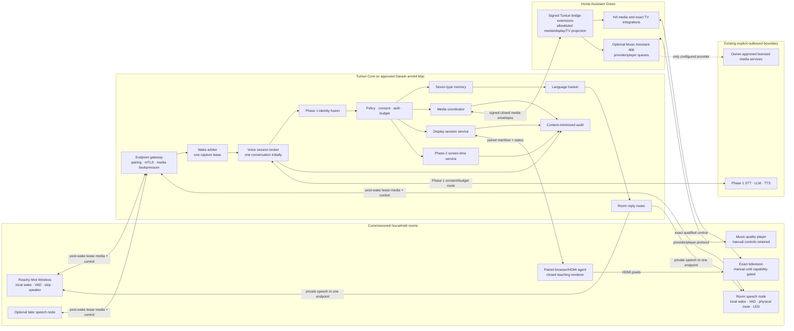

# Tuntun Phase 4 “Whole-Home Voice, Media, and Displays” Architecture Specification

**Status:** design baseline complete; implementation plan ready; implementation not started
**Date:** 2026-08-27
**Scope:** room voice endpoints, deterministic legal-media playback, local teaching displays, television control qualification, and real screen-time enforcement
**Primary operator:** one owner-managed household
**Depends on:** Phase 1 identity, policy, memory, speech, privacy, budget, and audit foundations; Phase 2 topology, signed Home Assistant mediation, durable action lifecycle, and screen-time state machine; and, before Task 04 or any owner-HTTP route work, the accepted Phase 3 Task 17 owner-ingress takeover and signed route-manifest infrastructure. Phase 4 Tasks 01–03 and simulator-only work may begin from the accepted Phase 1/2 baseline without enabling camera features. Every Phase 4 owner-route promotion checkpoint rebuilds the same Phase 3-owned owner-ingress wheel, refreshes/re-signs its canonical service row against the exact current route-manifest digest, and completes the installed lifecycle before physical or gate evidence starts; a predecessor row is accepted only with its complete matching rollback set. Final Phase 4 acceptance additionally waits for Phase 3 Task 32's final service-inventory freeze, then repeats that refresh for the final Phase 4 wheel/routes rather than allowing a later Phase 3 package step to overwrite it.

## 1. Outcome

Phase 4 lets a family member address Tuntun from commissioned rooms rather than only at Reachy. Every room endpoint performs wake-word detection and voice activity detection locally, clearly indicates when post-wake audio is being captured, has a real physical microphone mute, and retains no continuous household audio. Tuntun replies in the room that won the wake arbitration and follows the speaker's English, Hindi, or Hinglish within the conversation. Reachy remains a first-class endpoint and the initial household limit remains exactly one active conversation.

Music and other legal media can play through separately commissioned, music-quality players. Home Assistant and, where it passes its gate, Music Assistant supply deterministic device/catalog integration. They never decide who spoke, which family policy applies, which memory may be retrieved, or whether an action is authorized. Those decisions remain inside Tuntun Core on the Mac.

Age-appropriate teaching sessions render through a paired local browser/HDMI agent. The Samsung Neo LED 49-inch and TCL 42-inch televisions are display surfaces, not trusted computers or identity sensors. Their marketing descriptions are insufficient to select a control adapter. Each begins `UNCOMMISSIONED` and may become `DISPLAY_ONLY_MANUAL` only after exact identity/HDMI inventory; until exact model, operating system, firmware, network API, HDMI-CEC, infrared, and observation probes pass, Tuntun may prepare a local teaching surface, but a person must select the input and control power with the ordinary remote.

The Phase 2 screen-time simulator becomes real enforcement on a television only after the exact unit has a repeatable desired-state control path and a trustworthy observation path. Strict mode additionally requires independently evidenced observation. A manual physical intervention always stops automatic contention. One enforcement generation can make at most two control attempts, and no Tuntun component may enter a power, source, volume, or application retry contest with a person.

## 2. Preserved invariants and locked decisions

Phase 4 extends, but does not silently reinterpret, the Phase 1 and Phase 2 specifications.

| Area | Phase 4 decision |
|---|---|
| Canonical authority | Tuntun Core on the Mac remains the sole authority for identity, family roles, policy, approvals, memory, consent, budget, and Tuntun audit |
| Reachy | Reachy remains the primary embodied endpoint and participates in the same room arbitration contract |
| Initial conversation concurrency | Exactly one active household conversation, regardless of the number of installed microphones |
| Later concurrency | At most two active conversations, disabled until the separate isolation, resource, privacy, and budget gate in Section 22.8 passes |
| Room-node strategy | Run a staged purchased-versus-DIY bakeoff behind one `SpeechEndpointPort`; do not assume ReSpeaker or any other microphone board is suitable |
| Wake and VAD | Local to each room endpoint; no always-on room audio is sent to the Mac, Home Assistant, Music Assistant, a television, or a cloud provider |
| Capture indicator | A visible local indicator is on before post-wake audio may leave the endpoint and remains truthful for the complete capture interval |
| Microphone mute | Physical, locally authoritative, and testable; software and voice cannot defeat it |
| Language | English, Hindi, and natural Hinglish; follow within-conversation language changes, as in Phase 1 |
| Reply routing | Default to the endpoint that holds the current capture lease; no private reply is broadcast to a media group |
| Speech versus music | Speech capture/reply endpoints and music-quality playback endpoints are distinct capabilities even when one enclosure can technically do both |
| Media integration | Closed, desired-state adapters through Home Assistant and optionally Music Assistant; Tuntun never receives a general Home Assistant or Music Assistant credential |
| Media legality | Only owner-entitled local files, licensed streams/radio, and explicitly approved provider adapters; no DRM bypass, ripping, scraping, credential sharing, or arbitrary URL playback |
| Display implementation | Paired local browser/HDMI renderer using a closed component manifest; televisions receive pixels/control, not family memory or browser credentials |
| Actual televisions | Samsung Neo LED 49-inch and TCL 42-inch are real inventory entries but have no assumed OS/API/control capability before exact-unit probes |
| TV control layers | Exact-unit native local API, HDMI-CEC, and bounded IR are independently qualified choices; manual control is the unconditional fallback |
| Screen time | Phase 2 policy/state machine remains authoritative; real enforcement stays absent until the exact adapter eligibility gate passes |
| Physical override | Physical TV controls, the ordinary remote, or the renderer stop control immediately end further automatic contention; they are manual bypasses, not identity factors |
| Data retention | No application-managed durable raw room audio, wake buffer, transcript, speech waveform, or display screenshot |
| Remote access | LAN-only and outbound cloud calls under Phase 1 policy; no public inbound route or router port forwarding |
| Open source | All endpoint, media, display, and television implementations are adapters; household devices, account details, and credentials are deployment data, never repository fixtures |
| Continuous feature authority | Phase 4 reuses Phase 2's externally pre-issued `SignedFeatureManifestRolloverChainV1`, `FeatureManifestLeaseSupervisor`, `FeatureAuthorityLease`, and `FeatureAuthorityCampaignEvidenceV1`/canonical schema unchanged. No Phase 4 process can sign, renew, substitute, extend, or locally redefine authority. Every endpoint/per-area/family seven-day campaign and any maintenance interval later counted by Phase 6 requires one frozen-candidate chain covering the complete interval; its counted clock starts only after an index-zero controlled-restart activation receipt exact-matches the live candidate/composition, and every admission/background iteration checks both half-open wall validity and the non-extendable monotonic lease. Purchased and DIY endpoint candidates use separate externally signed chains whenever their hardware/configuration commitments differ, and every commissioned area/endpoint/binding or steady-state maintenance generation uses its own chain after any candidate or configuration mutation; no prior chain is widened, merged, copied, or reused across those generations. Missing/stale initial activation, nonzero initial index, missing, extra, late, reordered, widened, rollback, signature-invalid, candidate-drifted, or expired current/next authority, either exact deadline equality, wall rollback, stale composition, or a missing/substituted rollover/restart receipt closes affected work before preparation or I/O, invalidates the campaign, and enters controlled whole-composition recovery. The shared downstream adversarial harness proves no admission, preparation, provider-call, trigger, or effect counter advances after each injected fault and that a dishonest zero-gap claim is rejected. Closed-authority maintenance observations remain truthful but cannot count toward day 60, day 90, or promotion. Evidence binds the chain ID/digest, ordered envelope and transition/restart-receipt digests, admission-sample-log digest, exact interval, and every canonical literal-zero counter |

### 2.1 Versioned policy amendments

Phase 4 introduces five explicit amendments. They are registered policy/schema versions, not informal exceptions:

- `whole_home_single_session_v1` replaces Phase 1's single physical interaction location with multiple commissioned input/output endpoints while retaining exactly one active conversation, the same identity/Guest rules, the same memory audiences, and the same cloud/privacy controls. A room is routing context, never identity or authorization.
- `home_reversible_media_v1` permits an identified adult to issue one unambiguous, reversible transport operation to one registered player without a second confirmation. A new catalog item/provider, material volume change, transfer, group, persistent queue/routine, account, or policy change is outside the exception and follows the stronger rules in Section 12.
- `child_guarded_media_v1` permits only the exact rooms, players, providers/content classes, volumes, and hours jointly bound to an owner configuration and a distinct current-primary-guardian consent. It does not authorize purchases, explicit/unknown content, broad groups, accounts, persistent routines, or the child's own policy approval.
- `guarded_teaching_display_v1` permits approved derived educational content to appear on one paired local renderer for the current bounded session. It carries no browser, provider, memory, action, or general television authority and preserves all Phase 1 child-safety/audience rules.
- `screen_time_real_adapter_v1` connects the Phase 2 state machine to one exact capability-gated television. It changes no allowance, viewer, guardian, retry, or audit semantics and disappears automatically when the adapter evidence degrades.

The Phase 1 action registry, guarded-child corpus, provider redaction, transaction/outbox model, owner console, and audit schema—and the Phase 2 topology generations, signed bridge, idempotent action lifecycle, screen-time corpus, and restore quarantine—must recognize these versions before the corresponding Phase 4 feature can be enabled.

## 3. Scope boundaries

### 3.1 Included

- A shared room endpoint protocol for Reachy and additional voice satellites.
- A purchased-device versus custom-Linux room-node bakeoff in one common area.
- Local wake, VAD, bounded RAM pre-roll, post-wake streaming, visible capture state, physical mute, local stop/privacy, speaker output, and health.
- Deterministic duplicate-wake arbitration and one-conversation admission control.
- Room-aware speech reply, explicit handoff, busy behavior, and privacy-sensitive routing.
- Room classes and separate owner/occupant/guardian commissioning consent.
- Home Assistant and optional Music Assistant media inventory, catalog lookup, player state, and closed playback actions through a narrow signed bridge.
- Individually registered players and immutable bounded player groups.
- A paired local browser/HDMI teaching renderer with closed components and hashed assets.
- Exact-unit qualification of the Samsung and TCL televisions through native API, HDMI-CEC, IR, and observation probes.
- Real Advisory, Cooperative, or Strict screen-time adapter eligibility without changing the Phase 2 policy semantics.
- Owner-console views for rooms, microphones, players, displays, television evidence, privacy, and enforcement state.
- Failure injection, privacy testing, multilingual evaluation, recovery, maintenance, and open-source packaging boundaries.

### 3.2 Explicitly excluded

- Cloud smart-speaker assistants as Tuntun speech endpoints.
- Continuous room streaming, ambient transcription, passive conversation capture, voiceprints stored on satellites, or room audio used as general presence surveillance.
- Camera-based speaker selection or television-viewer recognition in Phase 4. Phase 3 presence events, if available, remain non-identity evidence throughout this six-phase program; changing that boundary requires a new explicit system-wide privacy/security design and consent model, not a policy toggle.
- Microphones in bathrooms, toilets, changing areas, or any area classified `prohibited` by the canonical Phase 2 `AreaV1` authority.
- Whole-home broadcast of personalized answers, private memory, child disclosures, authentication prompts, or security information.
- A general Home Assistant service API, Music Assistant administrative API, television remote API, arbitrary HDMI-CEC opcode, arbitrary IR code, shell, browser navigation, or arbitrary URL exposed to an LLM.
- Unlicensed music acquisition, account circumvention, advertisements removal, DRM bypass, media ripping, torrenting, or downloading streams for reuse.
- Storing streaming-provider passwords, cookies, OAuth refresh tokens, or television account credentials in Tuntun's database.
- Inferring programme content, educational value, interests, or a viewer from audio/video capture.
- Claiming that television power, source, application, or playback state is verified from a command acknowledgement or network presence alone.
- More than two simultaneous conversations in this household profile.
- Public inbound administration, public media endpoints, or a remote browser renderer.

## 4. Considered approaches

### 4.1 Purchased Home Assistant voice appliances everywhere

Home Assistant Voice hardware offers an attractive enclosure, dual microphones, an audio processor, LED ring, volume dial, and a mute switch documented to physically cut microphone power. It is inexpensive compared with a custom enclosure and is a strong bakeoff candidate.

The risk is architectural: its supported software path is optimized for Home Assistant Assist. Phase 4 cannot assume that stock firmware exposes the precise post-wake media, lease, cancellation, mutual-authentication, indicator, and retention semantics Tuntun requires. Routing identity or conversation policy through Assist would also split Phase 1 authority. This approach is accepted only if a documented, reproducible firmware or transport adapter passes the complete `SpeechEndpointPort` gate without moving policy to Home Assistant.

### 4.2 Custom Linux room nodes everywhere

A small Linux SBC with a qualified USB/I2S microphone front end gives Tuntun direct control of local wake, VAD, buffering, mutual TLS, cancellation, and diagnostics. It can use a separate speech speaker and a genuine hardware mute circuit.

The trade-off is substantial hardware variation and maintenance. Microphone arrays, echo cancellation, amplifier noise, power supplies, thermal behavior, enclosure acoustics, and LEDs all affect reliability. A board marketed for voice is not accepted by name. In particular, no ReSpeaker model is selected until the exact, obtainable revision passes acoustic, driver, provenance, and mute tests.

### 4.3 Staged hybrid behind stable ports — selected

Reachy remains the primary endpoint. In one common room, one purchased appliance candidate and one custom-Linux candidate are tested under identical acoustic and privacy scenarios. Both must implement the same versioned room contract. Tuntun selects the evidence-winning type for later rooms; the open-source framework may support both if both pass.

Speech and music are deliberately decoupled. A room can use a compact speech node while Music Assistant drives an existing or later music-quality speaker. A television can remain manual while its paired HDMI renderer still provides teaching content. This approach gives useful increments without turning an unverified all-in-one product into a new trust boundary.

## 5. Architecture



### 5.1 Authority boundaries

- The room endpoint knows its own endpoint ID, hardware state, wake/VAD models, active lease, and current audio buffers. It does not know a person's canonical identity, memories, family permissions, or cloud credentials.
- The wake arbiter decides which endpoint may transmit post-wake audio. It does not identify the speaker or authorize an action.
- Tuntun Core applies identity, policy, memory, language, consent, budget, and action authorization exactly as in Phase 1 and Phase 2.
- Home Assistant owns device integrations and the observable state those integrations actually provide. Its signed bridge verifies a closed command but does not decide household permission.
- Music Assistant, when enabled, owns its library index, provider adapters, player queues, and playback mechanics. An item appearing in its library is not itself proof of household entitlement or child suitability.
- A display agent renders an already authorized, signed component manifest. It does not receive a profile, memory repository, general prompt, or model tool.
- A television is an untrusted networked appliance and a manually controllable display. It never supplies identity evidence.

## 6. Component responsibilities

| Component | Owns | Must not own |
|---|---|---|
| `RoomEndpointAgent` | Local wake/VAD, RAM buffer, mute/indicator/stop, leased capture, speech playback, diagnostics | Identity, family policy, memory, provider credentials, durable audio |
| `WakeArbiter` | Duplicate correlation, deterministic winner selection, capture lease, loser cancellation | Speaker identity, transcript, action authorization |
| `VoiceSessionBroker` | Household slot count, turn/session lifecycle, cancellation, endpoint handoff | Cloud SDK details or canonical memory |
| `RoomReplyRouter` | Lease-bound reply endpoint, sensitivity-aware routing, explicit transfer | Automatic whole-home broadcast or passive follow-me surveillance |
| `MediaPolicyService` | Actor/room/source/volume/group policy and authorization commitment | Player protocol or provider account administration |
| `MediaCoordinator` | Typed catalog resolution, immutable command, idempotency, truthful result | Free-form URLs, credentials, or direct arbitrary HA/MA calls |
| HA signed media bridge | Proof/signature verification, compiled player/source allowlist, bounded translation, receipts | Identity, family memory, unrestricted service/entity/API access |
| Music Assistant | Approved music/player providers, queue, stream/player control | Tuntun policy, identity, biometric data, memory, unrestricted provider enrollment by voice |
| `DisplaySessionService` | Teaching manifest, audience/language policy, session lifecycle, screen clear | Browser credentials, arbitrary HTML/JS, TV truth claims |
| `DisplayAgent` | Paired kiosk browser, hashed assets, HDMI output, local stop/status | Open browsing, cloud credentials, family database, screenshots |
| `TVCapabilityAdapter` | One exact unit's closed desired-state commands and observations | Wildcard remote keys, arbitrary macros, identity inference |
| Phase 2 screen-time service | Allowance ledger, authority, warning/grace/extension/enforcement state | Guessing viewer, content, power, or app state |

## 7. Room topology and commissioning classes

Each room is an existing Phase 2 `AreaV1`; Phase 4 imports `AreaV1` and `CanonicalLocationRefV1` unchanged and carries exact `(area_id, area_generation)` wherever location affects authority. Every located Phase 4 endpoint, player, group member, display/teaching session, television, and screen-time adapter row persists the composite foreign key `(area_id, area_generation) -> home_areas(area_id, generation)`; a naked `area_id` foreign key is not authority. Dispatch additionally reopens the current `AreaV1`, so a row that still references a historically valid generation fails closed after reclassification and across restart/restore. Phase 4 does not mint a parallel `room_id` or room-class vocabulary. A finer location may be represented only by a stable, versioned `zone_id`/`zone_generation` nested beneath that exact area generation. A zone is never an alias for an area, cannot move between areas without a new identity, and cannot be used to broaden an ambiguous target.

```text
area_id
area_generation
zones[]: zone_id, zone_generation
room_class
speech_endpoint_ids[]
media_player_ids[]
display_endpoint_ids[]
privacy_policy_generation
occupant_consent_refs[]
guardian_consent_ref
quiet_hours
speech_volume_limit
music_volume_limit
commissioning_state
```

Room class is one closed value:

| Class | Microphone default | Commissioning authority | Additional rule |
|---|---|---|---|
| `common` | Disabled until owner commissioning; may then remain locally wake-listening | Owner plus household notice acknowledgement | Guest disclosure and visible hardware controls are required |
| `adult_private` | Off | Owner plus each recorded adult occupant's current opt-in | Revocation disables new leases immediately; no cross-room reply by default |
| `child_private` | Off | Owner plus a distinct current primary guardian bound to the exact child/room/device/policy generation | Child can always mute/stop; no live web; bedtime availability is owner/guardian configured; no passive discovery |
| `prohibited` | Permanently ineligible | No override in Phase 4 | Covers bathrooms, toilets, changing areas, and every location whose current Phase 2 class is prohibited |

Guest/Designated Guest is an orthogonal actor/session narrowing policy, never an area class. An area generation/class, microphone, occupant, guardian, or endpoint-binding change increments the privacy generation, revokes outstanding claims/leases/admissions/handoffs/replies immediately, and requires new exact-scope approval where applicable. Restart/restore reopens current Phase 2 authority and never resurrects a stale generation. A stale or missing consent reference makes the endpoint ineligible. A person can physically mute any endpoint without authentication. Software unmute is impossible; after the hardware switch is returned to on, the endpoint still needs a current commissioning generation before it can obtain a lease.

No room label sent to a provider contains a person's name or sensitive room nickname. Provider context uses a generic descriptor such as `current_shared_room` only when location is necessary.

## 8. Room-node hardware and bakeoff

### 8.1 Required endpoint capabilities

Every production speech endpoint must prove:

- local execution of a hash-pinned, licensed wake model and local VAD;
- a bounded three-to-five-second pre-roll held only in RAM;
- no post-wake audio network transmission before a current signed capture lease;
- a physical microphone mute that prevents capture at the hardware path, with a locally visible mute state;
- a visible capture indicator that is illuminated before the first leased audio frame can leave and that fails safe;
- a governed local stop/privacy input whose operation does not depend on the Mac, Home Assistant, or WAN;
- bounded audio and control queues, replay protection, heartbeat, clock/sequence diagnostics, and cancellation;
- a local speech speaker or audio output adequate for intelligible Tuntun replies;
- per-device keys, owner-verifiable firmware/model hashes, rollback, and no default vendor-cloud dependency during use;
- measured far-field behavior under the room's actual television, music, fan, cooking, and family noise;
- a documented software bill of materials and licences compatible with the Apache-2.0 framework distribution.

An LED driven only by a high-level application flag is insufficient if the audio DMA/network path can remain active after the flag crashes. The implementation couples capture authorization, network send, and indicator state through the local safety supervisor. Indicator-driver failure, mute-state uncertainty, or supervisor failure closes the microphone network path and sets the endpoint `ERROR_SAFE`.

### 8.2 Bakeoff candidates

The common-room bakeoff uses:

1. one Home Assistant Voice Preview Edition or its then-current official successor, only after exact SKU/firmware/stock capture; and
2. one Linux SBC node assembled from an obtainable microphone front end, speaker/audio output, physical microphone cutoff, indicator, stop control, power supply, and enclosure.

The purchased candidate is eligible only when its unmodified signed stock firmware exposes a documented or otherwise proved supported transport that a narrow Tuntun adapter can use while preserving the physical mute and keeping policy authority outside Assist. Stock Assist behavior alone is not counted as Tuntun compatibility. Phase 4 owns no replacement/custom-firmware build, flash, signing, update, or rollback target; if replacement firmware is required, proposed, or detected, that branch is ineligible and its adapter, feature, pairing route, and commissioning path remain absent. A future replacement-firmware experiment requires a separately approved design amendment and complete target lifecycle ownership. The Linux candidate does not receive preference merely because it is more customizable. Acoustic performance, privacy truthfulness, recoverability, ongoing updates, idle power, and owner maintenance decide.

Each candidate runs seven days in the same placement and identical test corpus. Neither is deployed to a private room during the bakeoff. The losing candidate is either retained as a developer fixture with synthetic audio or removed; it is not quietly deployed with weaker controls.

## 9. Endpoint protocol and duplicate-wake arbitration

### 9.1 Pairing and channel

Room endpoints initiate outbound `wss` to the Mac's existing endpoint gateway. Pairing follows Phase 1: the endpoint generates its own TLS-client and Ed25519 event-signing keys, sends only public material/CSR, and receives a household certificate plus a separately rotatable commitment secret over the authenticated channel. Private keys never pass through the browser or Home Assistant.

Reachy retains its Phase 1 transport. A new protocol adapter maps Reachy's events to the same logical room contracts without weakening its existing caps, sequence rules, safety priority, or camera isolation. Room audio uses the Phase 1 maximum of 90 seconds or 8 MiB per turn unless a stricter endpoint-specific cap applies.

### 9.2 Wake claim

A local wake creates a signed claim containing no audio:

```text
claim_id
schema_version
endpoint_id
area_id
endpoint_session_epoch
wake_model_id_and_digest
wake_confidence_bucket
snr_bucket
first_vad_monotonic_ns
mute_state
indicator_ready
local_sequence
issued_at
expires_at
signature
```

Fine-grained acoustic features, embeddings, pre-roll, and speaker identity are absent. While awaiting arbitration, the endpoint may retain post-wake samples in its capped RAM queue but may not transmit them. A muted, stale-generation, time-invalid, unhealthy, or indicator-unready endpoint cannot submit an eligible claim.

### 9.3 Deterministic arbitration

The arbiter groups claims received within a 350 ms decision window and treats claims within a 1.5-second acoustic-correlation window as one possible duplicate wake. It selects exactly one winner using this stable order:

1. the endpoint holding a valid continuation token for the current active turn;
2. an endpoint with stronger locally bucketed wake confidence and SNR, when the difference exceeds the calibrated hysteresis;
3. earliest gateway receipt time;
4. stable endpoint ID as the final deterministic tie-break.

Room names, household identity, profile permissions, and private-memory availability do not influence arbitration. The winner receives a signed, single-use `CaptureLease` bound to claim, endpoint, room, turn, protocol/session epoch, privacy generation, issue/expiry, byte/duration caps, and the single household conversation slot. It turns on/validates the capture indicator, flushes only the post-wake portion beginning at the wake boundary, and streams numbered frames. Every loser receives a cancellation, discards its complete candidate buffer, and returns to local wake listening.

Two people independently saying “Hello Tuntun” in different rooms at nearly the same time still consume one initial slot. One wins; the other endpoint presents only a neutral busy light/tone that reveals no speaker identity, question, or answer. It never speaks a private “someone else is talking” explanation. A new wake after the active lease begins is treated as barge-in only at the active endpoint; another room receives busy behavior unless an explicit handoff is pending.

If the Mac, arbiter, or channel is unavailable, no endpoint self-elects for an open-ended conversation and no buffered audio leaves. Local physical mute/privacy/stop and fixed status remain available. A node may run a separately approved deterministic offline command grammar only when it can obtain the same local action-policy authority required by Phase 2; no endpoint becomes an independent home controller during a partition.

## 10. Conversation admission, routing, and handoff

### 10.1 One active conversation

`household_conversation_slots` is fixed to `1` for the Phase 4 family release. The durable admission record binds turn/session, winning endpoint and room, effective identity mode, privacy generation, provider reservations, and expiry. Crash recovery never resumes old listening or speech; it cancels every endpoint lease and requires a new wake.

### 10.2 Reply routing

The default speech destination is the current lease endpoint. The response cannot use a Music Assistant player group, television speakers, or another room merely because they are available. The router checks:

- endpoint and room commissioning generation;
- current physical mute and playback health;
- answer sensitivity and audience;
- effective profile and Guest fallback;
- room occupancy/consent policy without treating room as identity;
- local quiet hours and speech volume limit; and
- current turn/session IDs and cancellation state.

If the endpoint cannot speak, Tuntun uses a local nonverbal error signal when possible and offers the answer in the authenticated owner console. It does not route a private answer to the nearest working speaker automatically.

Playback is completion-bound rather than acknowledgement-bound. Each short-lived frame repeats the request/turn/lease/cancellation/privacy/capability authority, has a contiguous byte offset and keyed commitment, and only the final frame declares the exact terminal sequence and total byte count. Core durably stores the minimized final-frame commitment before sending it. A `completed` endpoint receipt must repeat that exact final commitment and totals; a gap, overlap, missing/replaced final record, partial stream, or receipt after cancellation can report only partial/stopped/unverified/error-safe, never complete.

### 10.3 Explicit handoff

Phase 4 has no passive acoustic “follow me.” A speaker may say a registered command such as “continue in the kitchen.” Tuntun resolves one exact commissioned endpoint, announces a short transfer request at the current endpoint, and creates a single-use handoff token that expires after 30 seconds. The target does not play prior private content. The person must wake Tuntun at the target; current local voice/identity evidence and room policy are evaluated again. Ambiguity, identity conflict, a private-room consent failure, expiry, or a Guest session cancels the handoff and starts a new Guest turn instead.

For child profiles, handoff into a `child_private` room requires the current exact guardian/room/device consent. Handoff out of the room never transfers child authority to whoever next speaks. No handoff preserves authentication or action approval.

### 10.4 Language behavior

The Phase 1 language tracker remains per turn/session. Endpoint and room do not set a person's language. Wake acknowledgements, busy tones, privacy prompts, fixed errors, warnings, and teaching controls have human-reviewed English, Hindi, and common Hinglish variants. The last clear speaker language pattern selects the response; a mid-conversation switch updates subsequent speech. Ambiguous short utterances preserve the last stable language mode rather than oscillating.

## 11. Room microphone privacy and retention

The microphone is always represented by three separate facts:

1. **hardware mute:** whether the physical capture path is cut;
2. **local wake listening:** whether local wake/VAD is processing RAM samples; and
3. **network/cloud transmission:** whether a leased post-wake stream or provider request is active.

The UI and LEDs never collapse these into a generic “secure” state. The endpoint's idle indicator may be off while local wake listening is active; household onboarding explicitly explains that behavior. Hardware mute has a distinct persistent local indication. Post-wake network capture has a conspicuous different indication.

Retention is fixed as follows:

| Data | Retention |
|---|---|
| Pre-wake audio | Three-to-five-second RAM ring on the endpoint only; overwritten continuously; discarded on mute/error/restart |
| Losing wake candidate buffer | RAM only; destroyed immediately after loss/timeout/cancel |
| Winning post-wake audio | Endpoint/Mac process memory only; Phase 1 90-second/8 MiB maximum; cleared on settlement/cancel |
| Transcript and answer | Phase 1 ephemeral turn context only unless an approved derived memory proposal is created |
| Endpoint acoustic metrics | Content-free counts/buckets and latency; no waveform, embedding, transcript, or fine-grained room activity timeline |
| Media catalog query | Ephemeral normalized query; ordinary audit stores only provider/item commitments and decision metadata |
| Display session | Typed manifest and content-minimized receipt; rendered pixels/screenshots are not stored |

Privacy Shield preempts all room leases, cancels STT/search/LLM/TTS, stops Tuntun speech and display sessions, and blocks new capture claims. It does not falsely claim to stop already running independently controlled music; instead it stops Tuntun-initiated music when the registered player is reachable and reports any unverified result. A physical microphone mute remains effective even if Tuntun Core is compromised or offline.

## 12. Deterministic media plane

### 12.1 Eligible sources

An owner may commission only:

- local media files the household owns or is entitled to use, mounted read-only to the media service;
- a streaming service/account for which the owner has a current subscription or other right and whose adapter use is reviewed for the household's region and terms;
- licensed internet-radio streams with documented source/terms; or
- a local playback protocol for a household-owned player.

Technical availability is not legal approval. Every provider record has one stable opaque `provider_binding_id` and an independently advancing `provider_generation`, plus adapter name/version/source and generation, account owner class, region, entitlement review date/generation, credential store, explicit-content capability, child eligibility, data-egress disclosure, and expiry. Every request, authorization, envelope, receipt, observation, and result repeats the exact provider-binding ID/generation; a scalar generation without its row identity is never authority. Missing, expired, unofficial/scraping, credential-exporting, legally unclear, replaced, or generation-drifted records leave the provider disabled. Phase 4 does not substitute a different provider/account silently.

Provider enrollment and credentials occur only in the owner-controlled Home Assistant/Music Assistant administration surface. Tuntun receives a stable opaque provider binding and capability digest, never the secret. Provider credentials are excluded from prompts, Tuntun backups, browser application state, logs, and the public repository.

### 12.2 Music Assistant and Home Assistant roles

The first media increment uses one registered player through Home Assistant's normal media integration when that integration exposes truthful state and closed actions. Music Assistant is optional and enabled only when:

- its official Home Assistant application/integration and exact versions are captured;
- the Green resource/storage/backup probe passes, or another explicitly approved local deployment is selected;
- one legal provider and one native player provider pass playback, pause, stop, queue, reboot, WAN, and credential-revocation tests;
- the bridge can expose a narrow catalog and action surface without giving Tuntun a general administrative token; and
- provider/player traffic, ports, discovery, and cloud dependencies are documented.

If Music Assistant fails the gate, Phase 4 retains the single-player Home Assistant path or disables media. It does not move identity/policy into Assist or give Tuntun a broad Music Assistant API key as a shortcut.

### 12.3 Closed media actions

Initial actions are:

```text
media.play_catalog_item.v1
media.pause.v1
media.resume.v1
media.stop.v1
media.set_volume_absolute.v1
media.seek_absolute.v1        # only when the exact player proves it
media.play_group_manifest.v1  # adult-confirmed immutable group only
```

`toggle`, arbitrary URL, arbitrary provider URI, arbitrary file path, free-form queue mutation, account switching, follow redirects, arbitrary announcement, and caller-supplied Home Assistant service names are invalid. Catalog search accepts a canonical list of exact provider-authority tuples `(provider_binding_id, provider_generation, adapter_generation, entitlement_generation)` and returns short-lived opaque item handles that repeat the selected tuple plus account class, item commitment, explicit/content classification, result generation, and expiry. Any generation drift invalidates the handle before provider access, including after restart. An ambiguous title produces a short spoken choice; the model cannot invent a handle.

An identified adult may immediately execute one unambiguous, reversible, registered single-room transport action under `home_reversible_media_v1`, the same risk-tiered principle introduced for lights. Starting a new item, changing to a different provider, transferring rooms, changing volume by more than the configured small delta, or using a registered group requires an exact confirmation. Provider/account enrollment, group definition, child source/volume/time policy, and adapter changes require an owner passkey. Guest/anonymous playback is disabled by default. A designated Guest request can be enabled only through the Phase 2 exact owner co-approval path and only for an approved common-area source.

Child playback requires an immutable signed rule version created through `owner prepare/passkey -> distinct current primary guardian one-use approval -> exact-generation activation`. The owner first commits an approval-independent proposal digest. The guardian binds that digest; only then does Tuntun finalize and sign a separate rule digest containing the exact proposal plus approval ID/principal/generation/commitment. This avoids a circular digest/approval dependency. Proposal/final rule bytes bind the expected pre-CAS lifecycle generation; the receipt and downstream authority carry the observed/resulting generation. The lifecycle receipt is total: only `APPLIED draft -> active` may first activate, and an approved edit creates a new immutable version through one atomic `APPLIED active -> active` replacement; rejection reports the unchanged observed state/generation. This makes “one current version” executable without pre-signing a future generation. Revocation is the durable `APPLIED active -> revoked` generation transition and is an immediate safety reduction: it needs no fresh passkey/guardian ceremony, works locally during cloud/auth outage, and completes within two seconds. Its receipt carries a distinct local revocation request/source/time; the current rule version's ceremony commitments are repeated only as provenance, never reused as revoke authority.

The active rule binds child/profile, one exact `(area_id, area_generation)` shared by every canonical player, player binding/capability generations, provider-binding/adapter/entitlement generations, content classes or durable keyed item/playlist identity commitments, volume ceiling, non-overlapping canonical hours, an exact IANA timezone plus approved tzdata version/digest and `instant_to_local_window.v1`, policy generation, issue/expiry, and expected pre-CAS lifecycle generation. Canonical hours are half-open local-minute intervals `[start, end)` with `0 <= start < end <= 1440`; `[1439, 1440)` includes 23:59, adjacent intervals may meet at one endpoint, and an overnight allowance is split across its two weekdays rather than wrapped. Activation resolves the name with `ZoneInfo` from that artifact; invalid/missing zones and artifact drift reject. Authorization maps trusted UTC now to a unique local instant with the bound artifact instead of materializing ambiguous/nonexistent wall-clock slots. It reuses the Phase 2 durable trusted-clock high-water guard: unresolved rollback denies new child playback until reconciliation catches up, preventing an allowed window from replaying after restart. A tzdata update invalidates the old rule. A standing rule never stores an expiring catalog handle. Every execution resolves a fresh single-use handle and matches its provider tuple plus item-identity commitment, or a trustworthy allowed classification, against the current signed rule. Every child allow carries one atomic rule authority tuple—rule ID/version, proposal and final digests, resulting active lifecycle generation, lifecycle-receipt commitment, child/profile generation, and matched content basis—through decision, signed envelope, dispatch receipt, operation result, and the immutable operation row. Authorization and dispatch reopen and exact-compare the current signed rule and applied lifecycle receipt before provider/player I/O. Edit/revoke therefore invalidates already minted but undispatched authority across restart/restore, as well as outstanding approvals, handles, and prepared actions. The rule grants no catalog outside its exact authority, explicit/unknown content without an approved durable identity, purchases, provider/account changes, broad groups, or persistent queue/routine authoring. The child feature/route/action remains absent until this lifecycle and physical child-safe playback gate pass.

### 12.4 Player and group behavior

Every player binding is activated or retired only through an owner-passkey prepared mutation and exact current-generation CAS. Commissioning evidence binds exact protocol/provider, room, capabilities, firmware/config digest, state freshness, volume semantics, latency, grouping behavior, manual controls, and generation. Before starting audio, Tuntun obtains fresh state and sets an absolute bounded volume if supported. If current volume is unknown and the player cannot safely set an absolute starting value, playback through Tuntun remains disabled. Drift or retirement advances generation and invalidates handles, prepared actions, group memberships, and feature evidence.

A group is an immutable owner-passkey-approved and signed manifest activated through its own prepared-mutation/current-generation CAS, with one to the configured maximum members in canonical ordinal order. Edit creates a new version; retirement never mutates members in place. It binds manifest ID/version/digest and, for every enumerated player, exact player ID, binding generation, capability generation, current `(area_id, area_generation)`, and maximum volume. It is never “all speakers” or a dynamic room query. The signed action repeats that complete authority and the bridge exact-compares it to the compiled current manifest before any player read or I/O. Any member/order/cap/generation/manifest substitution, intervening change, or replay rejects. Group playback requires an adult confirmation that names every canonical area. Private speech, authentication prompts, child disclosures, timers, and security alerts never use media groups. Group routes and action registration remain absent until a separate group gate passes.

Home Assistant/Music Assistant acceptance is not physical playback proof. Results distinguish `VERIFIED_PLAYING`, `ACCEPTED_UNVERIFIED`, `PARTIAL`, `FAILED`, and `UNKNOWN` based on fresh player observations. `ACCEPTED_UNVERIFIED` requires an exact source-receipt commitment for at least an adapter acknowledgement or a stronger non-mirrored observation; dispatch start alone, no evidence, or mirrored optimism remains `UNKNOWN`. `PARTIAL` requires at least one actually verified target and at least one non-verified target. A group containing only acknowledgement-level plus failed/unknown outcomes is `UNKNOWN`, never partial. A verified observation must be sampled after the exact dispatch start, use adequate non-optimistic strength, and carry the action correlation. Play additionally requires the exact keyed item-identity commitment copied from the authorized handle; merely observing `playing`, a pre-existing/manual track, or another group member's item cannot verify the request. Volume must equal the signed absolute value; seek must be within an explicit signed commissioned tolerance; pause/resume/stop require the exact state. An adapter without item identity or action correlation caps play at accepted-unverified/unknown. Every canonical target has exactly one immutable transition record: `not_dispatched` for attempt zero or `dispatch_started` with complete context/effect proof for attempt one. Adapter ingress, observations, and claimed adapter terminal times cannot exceed the signed reconciliation deadline; unresolved attempted work becomes `UNKNOWN` at that boundary only through the verified Core deadline-terminal lineage, never through an adapter-authored unknown and never as late `FAILED` or `EXPIRED`. Timeouts and partial groups are reported truthfully. A failed start is not retried through another protocol or provider automatically.

## 13. Local teaching and display sessions

### 13.1 Renderer model

Each teaching display uses a paired local Linux/browser agent connected to a television by HDMI. The agent boots into a locked kiosk origin served by Tuntun Core over pinned local TLS. It has no general browser controls, password manager, user profile, cloud account, camera, microphone, shell exposed to content, or public inbound listener.

The renderer accepts a signed `TeachingSessionManifest` containing only closed components:

```text
session_id
manifest_version
renderer_endpoint_id
display_endpoint_id
area_id
area_generation
audience_class
memory_audience_or_none
presentation_policy
audience_binding_commitment
language_mode
teaching_policy_version
screen_time_session_ref
screen_time_session_commitment
screen_time_session_expires_at
screen_time_policy_version
issued_at
expires_at
components[]:
  title | paragraph | image_asset | vocabulary_card |
  multiple_choice | number_line | timer | progress | citation
assets[]: content_hash, media_type, byte_length, local_fetch_handle
manifest_digest
signature
```

No raw HTML, JavaScript, CSS, iframe, external URL, data URL, file path, SVG script, form, download, WebRTC, extension, or browser permission appears in a manifest. Text and image assets pass the Phase 1 profile/child-safety and DLP gates. The full manifest digest covers every component and asset descriptor. The `tuntun-display-manifest-v1` signature covers that digest plus the complete non-content authority header; Core durably stores only the digest, authority header, signature/HMAC, and retention metadata—not the manifest body, component text, asset handle, or bytes. This permits restart verification without turning lesson content into durable history. The renderer fetches each asset once from the paired local origin using a single-use handle, checks type/length/hash, and caches it only for the session. CSP, sandboxing, MIME validation, decompression limits, and total manifest/asset quotas apply before rendering.

### 13.2 Teaching policy

- Adult sessions may display a cited explanation or owner material within the active profile's audience boundary.
- K2 and N1 sessions use the Phase 1 guarded-learning policy, age/language rules, and child-safe component subset.
- Every K2/N1 request names exactly one active Phase 2 screen-time session for the same child/profile/area and current guardian/policy generation; non-child requests carry no screen-time session authority. The keyed session commitment, exact deadline, and policy version propagate through authorization and manifest, and the manifest cannot outlive that deadline.
- Child sessions do not perform live web search. A guardian/owner may preapprove a derived, locally stored teaching pack; its source provenance and expiry are visible.
- A display receives no private memory records. Tuntun renders only the minimum approved derived text/assets for that session.
- Guest sessions receive generic material and no personalized progress or memory.
- An uncertain or changed identity clears personalized content and returns to a neutral locally bundled screen.
- “Educational” is not inferred from a programme, app, HDMI source, web domain, or model label. A screen-time exception exists only when the exact teaching session/policy/guardian binding qualifies under Phase 2.

Any teaching or reply field that represents durable-memory audience imports the Phase 1 closed type unchanged: `subject_private|guardian_child|household_adults|household_all`. Guest has `memory_audience=None`, performs no memory retrieval, and uses a separate `presentation_policy=generic_guest_public`; public presentation is never encoded as a memory audience. Child `household_all` derivation additionally requires the existing child-safe household approval and exact current guardian generation. `owner_private|adult_private|household|public_only|household_shared` are rejected specifically at every memory-audience boundary (while `adult_private` remains a valid Phase 2 area class).

### 13.3 Display sequence

1. The speaker wakes Tuntun in a room and requests an explanation, lesson, story, or quiz.
2. Tuntun performs current identity, audience, child-safety, language, display-room, and screen-time policy checks.
3. It resolves one exact paired renderer/display. Ambiguity stops before control.
4. The local content builder creates the closed manifest and runs DLP, child-safety, size, asset, and provenance validation.
5. Tuntun atomically commits the authorized display session and audit outbox before sending the signed manifest.
6. The renderer validates signature, generation, expiry, quotas, and assets, then reports `READY` with its current HDMI hotplug/status evidence.
7. If the television is still `DISPLAY_ONLY_MANUAL`, Tuntun asks a person to turn it on/select the labelled HDMI input. If a qualified adapter exists, Tuntun sends one desired-state control sequence under Section 15.
8. Voice interaction remains at the winning speech endpoint; the television is not used as a microphone or identity source.
9. Stop, privacy, identity downgrade, expiry, renderer loss, or screen-time end clears private components and cached assets. Core first durably signs a five-second `DisplayClearRequestV1` under `tuntun-display-clear-request-v1`; a renderer-local owner-stop/error may create only the same bounded request under the exact renderer-local-safety key purpose. The renderer returns a monotonic signed receipt under the separate `tuntun-display-receipt-v1` domain. Core's closed lifecycle ingress verifies both objects, exact manifest authority, current privacy generation, request sequence, and replay state before publishing clear truth. A render receipt must predate manifest expiry; an automatic-expiry clear must be at or after it. A missing or stale receipt is reported as unverified and the HDMI source is not assumed blank.

## 14. Television inventory and capability states

The initial inventory records two physical units:

- `tv_samsung_neoled_49`: household description “Samsung Neo LED 49-inch”; and
- `tv_tcl_42`: household description “TCL 42-inch.”

These descriptions do not prove a model family, production year, Tizen/Google TV/Android TV/Roku/other operating system, local API, Wake-on-LAN behavior, HDMI-CEC implementation, IR code set, or application-state availability. Serial numbers, MAC addresses, account IDs, and pairing tokens are encrypted deployment data and are not used as stable topology IDs.

Generic television lifecycle and screen-time power eligibility are separate authorities. The generic Phase 4 binding moves through:

```text
candidate -> commissioned -> degraded
any live state -> quarantined -> retired
```

It may contain individually evidenced input, volume, mute, key, app, or observation capability without gaining any enforcement power. The unchanged Phase 2 `TVPowerEligibilityV1` separately moves through:

```text
UNCOMMISSIONED
  -> DISPLAY_ONLY_MANUAL
  -> OBSERVE_ONLY
  -> COOPERATIVE_ELIGIBLE
  -> STRICT_ELIGIBLE
any enabled state -> DEGRADED
```

- `UNCOMMISSIONED`: exact identity and ports are unknown; no Tuntun display/control claim.
- `DISPLAY_ONLY_MANUAL`: paired display pixels may be used with manual power/input, but no standby enforcement route is proved.
- `OBSERVE_ONLY`: exact fresh power observation exists but no standby control exists.
- `COOPERATIVE_ELIGIBLE`: exact `tv.set_power.v1(STANDBY)` control and trustworthy power observation exist for the same current binding/generation.
- `STRICT_ELIGIBLE`: the Cooperative facts additionally carry proved distinct failure domains/common-mode independence.

Only the exact standby-control and power-observation facts can populate this imported Phase 2 authority. A generic control route, `commissioned` lifecycle, playback observation, or HDMI/input evidence never promotes it.
- `DEGRADED`: previously qualified evidence is stale, changed, or failing; enforcement reverts to Advisory and mutations stop.

Firmware, OS, integration, pairing, network, HDMI port, CEC topology, IR profile, or observation-path changes increment the capability generation and invalidate pending commands and enforcement eligibility.

## 15. Layered television control and observation

### 15.1 Candidate control layers

For each exact TV, commissioning evaluates these independently:

1. **Native local television API through a documented Home Assistant integration.** A Samsung unit may qualify through the Samsung Smart TV integration only if the exact model/firmware demonstrates the required local functions and state. A TCL unit is not assumed to be Android/Google TV, Roku, or another platform until its exact OS is recorded.
2. **HDMI-CEC from the paired renderer or a supported USB-CEC adapter.** libCEC can issue power/source/key operations and query CEC state on supported hardware, but an exact TV/HDMI path must prove its behavior. CEC support by a library does not prove a particular television exposes a truthful state.
3. **Bounded IR transmitter.** The adapter may send only owner-commissioned, exact-model, hash-pinned desired-state codes or minimal deterministic sequences. It cannot expose arbitrary code learning/sending to a model.
4. **Manual remote/physical controls.** Always available as the final recovery path and always allowed to defeat automation.

The order is not an automatic retry chain. Commissioning selects one primary control path per capability and an optional explicitly different observation path. At runtime, failure of the primary produces `FAILED` or `UNKNOWN`; it does not spray the same intent over native API, CEC, and IR. Switching a primary adapter requires owner review/passkey, a new binding generation, and a fresh acceptance run.

### 15.2 Closed TV operations

Allowed operations are individually registered from this set:

```text
tv.set_power.v1       # desired ON or STANDBY; never toggle
tv.select_input.v1    # one exact commissioned source
tv.set_volume.v1      # absolute bounded value only when exact state is trustworthy
tv.mute.v1            # desired muted boolean; never toggle
tv.send_key.v1        # absent by default; exact finite key allowlist only
tv.launch_app.v1      # absent unless exact app/state evidence passes
```

Human control follows one closed assurance matrix. `adult_reversible_immediate` is valid only for desired mute/unmute and the non-committing keys `home|back|up|down|left|right`. Power on or standby, exact input, every absolute volume, `select`, and each commissioned app launch require an exact confirmation; an owner passkey may satisfy that action confirmation as stronger authority. Adults cannot mint owner-passkey authority. Binding, adapter, capability, input, key, or app registration/change is a separate owner-passkey prepared mutation and is never smuggled through an action request. The policy service and `AuthorizedTVRequestV1` both enforce the same matrix before registry reads or signing.

Screen-time enforcement uses only the canonical Phase 2 `tv.set_power.v1(STANDBY)` operation. The exact normalization is raw television `ON -> Phase 2 on` and raw `STANDBY|OFF -> Phase 2 off`: standby is the commanded screen-off terminal state, while a separately observed full-off state is also screen-off. This mapping is fixed and tested per qualified adapter; it is never inferred from an acknowledgement. Enforcement never substitutes a stop/app/key action, cuts mains power, invokes a smart-plug relay, guesses a navigation macro, or uses a toggle. A power monitor used for independent observation is registered observation-only; its relay capability, if any, is absent from Tuntun's registry.

### 15.3 Observation strength

Every observation carries source, sampled/received times, capability generation, freshness, and one strength:

- `COMMAND_ACK_ONLY`: never proves physical state;
- `MIRRORED_OPTIMISTIC`: may support a UI hint, never enforcement;
- `SAME_ADAPTER_OBSERVED`: may qualify for Cooperative only after failure tests;
- `OUT_OF_BAND_OBSERVED`: calibrated power/CEC/other evidence independent of the control path;
- `INDEPENDENCE_PROVEN`: qualifies for Strict only after the Phase 2 common-mode campaign.

Network reachability, Wake-on-LAN success, current HDMI source, and playback state are different facts. Tuntun never treats one as proof of the others.

## 16. Real screen-time enforcement

Phase 4 binds the exact adapters to the unchanged Phase 2 state machine and authority model. Daily/weekly ledger rules, warning, grace, extension, owner/guardian authority, viewer uncertainty, clock reconciliation, and 30-day session-detail retention remain as specified there.

### 16.1 Eligibility and viewer rules

- Advisory works without control and may show only trustworthy facts.
- Cooperative requires a repeatable closed control path plus trustworthy observation for the exact unit/generation.
- Strict requires a control/observation pair whose independence passes acknowledgement-plus-false-state, stale mirrored state, adapter restart, network loss, television restart, and common-mode failure injection.
- A child is debited or child-specifically enforced only inside a currently authorized child session with current identity/session evidence. A television merely being on, showing the teaching HDMI input, or located in a child's room does not identify the viewer.
- If viewer, clock, display, control, or observation becomes uncertain, the session enters `UNKNOWN`; unobserved time is not debited and real enforcement stops.
- A teaching session is educational only when its signed manifest and current guardian/policy binding say so. It is not automatically exempt merely because Tuntun rendered it.

### 16.2 Bounded enforcement

One enforcement generation permits:

1. one initial desired-state control attempt after the warning/grace sequence; and
2. at most one re-enforcement attempt, only when a fresh trustworthy observation within two minutes shows that the same child-authorized session resumed and no manual override was detected.

After two attempts, any failure, uncertainty, manual power/source/remote intervention, observation loss, adapter restart, or contrary physical state moves the session to `MANUAL_OVERRIDE` or `UNKNOWN`, stops every further automatic command, and alerts the owner/guardian. Re-enabling enforcement requires a fresh authenticated owner or current-primary-guardian decision bound to the exact session/generation. There is no background poll that can later surprise the household with a delayed shutdown.

The ordinary remote and TV buttons are available to anyone holding/reaching them; they are not described as adult-authenticated. An adult can always stop the enforcement sequence by using them or the renderer's labelled physical stop control. Changing the allowance ledger or standing policy still requires the Phase 2 authenticated owner/guardian path.

### 16.3 Enforcement sequence

1. Phase 2 policy reaches `WARNING`, then `GRACE`, with an age/language-appropriate message at the active room endpoint and display.
2. Any extension request is bound to child, current session, exact additional time, allowance effect, policy generation, and primary guardian.
3. At `EXPIRED`, Tuntun revalidates known viewer, television binding/generation, mode eligibility, control/observation freshness, and manual-override state.
4. The Mac commits the exact authorized enforcement intent and audit outbox before external I/O.
5. The signed bridge validates the closed action and creates its durable pre-dispatch receipt using the Phase 2 lifecycle.
6. One primary control path receives one desired state. No fallback path runs automatically.
7. The independently selected observation path evaluates actual outcome after the calibrated settle interval.
8. Tuntun reports verified ended, accepted but unverified, failed, unknown, or manual override. Only the first may transition to `ENDED` as enforced.
9. A qualifying restart may consume the single remaining attempt. Every other contrary state terminates automatic enforcement.

## 17. Canonical contracts

### 17.1 Speech endpoint registration

```text
SpeechEndpointRegistrationV1
  endpoint_id
  area_id
  area_generation
  room_class
  hardware_sku_and_revision
  firmware_version_and_digest
  endpoint_protocol_version
  wake_model_id_version_digest
  vad_model_id_version_digest
  native_capture_format
  native_playback_format
  mute_implementation_and_probe_digest
  indicator_semantics_and_probe_digest
  stop_input_semantics_and_probe_digest
  acoustic_bakeoff_evidence_digest
  privacy_policy_generation
  capability_generation
  lifecycle_state
```

Registration is owner-passkey-approved and stores no recording or biometric template. A digest/version change places the endpoint in `QUARANTINED` until the applicable tests rerun.

### 17.2 Capture lease and audio frame

`CaptureLeaseV1` binds claim, endpoint, canonical `(area_id, area_generation)`, turn, conversation slot, session epoch, privacy/capability generations, issue/expiry, allowed formats, duration/byte quotas, and signature. Binary `SpeechFrameV1` binds lease, stream/turn UUID, monotonic sequence, timestamp, format, duration, and payload length under the Phase 1 allocation limits. A stale, duplicate, losing, cancelled, over-quota, muted, or generation-mismatched frame is discarded before provider authorization.

### 17.3 Media request and envelope

The internal `AuthorizedMediaRequestV1` contains actor/profile policy data only inside Tuntun. The outbound `SignedMediaEnvelopeV1` carries the complete immutable authorization, including:

```text
operation_id
request_id
action_id
action_type
target_player_or_group_manifest_id
target_kind
group_manifest_version_and_digest_when_group
canonical_ordered_group_members_when_group:
  ordinal, player_id, player_binding_generation,
  player_capability_generation, member_cap
catalog_handle_or_desired_transport_state
catalog_item_identity_commitment_when_play
absolute_volume_when_applicable
seek_position_and_commissioned_tolerance_when_applicable
controller_epoch
topology_and_binding_generations
capability_digest
provider_binding_id_and_provider_generation
adapter_and_entitlement_generation
policy_version
request_binding_commitment
authorization_commitment
idempotency_key
authorized_at
request_expires_at
decision_valid_until
issued_at
expires_at
reconciliation_deadline
signature
```

For a group, the signed member tuple is exactly the owner-approved manifest order and is part of the authorization commitment; the bridge byte-compares it with compiled-current membership/caps/generations before receipt persistence or I/O. Player/member/order/cap/generation/manifest substitution, change after authorization or before dispatch, and replay reject. The signature obeys all conjunctive bounds: `authorized_at <= issued_at <= authorized_at + 5s`, `issued_at < expires_at`, `expires_at <= min(request_expires_at, decision_valid_until, authorized_at + 30s, issued_at + 5s)`, and `expires_at <= reconciliation_deadline <= expires_at + 5s`. The immutable operation row binds `(operation_id, request_id, action_id, envelope_digest)`; each target transition record repeats that lineage and is exactly `not_dispatched` for attempt zero or `dispatch_started` with exact context/effect proof for attempt one. Media and TV both import the one Phase 2 bridge-store `advance_to_dispatching_if_fresh(..., begin_after_commit_no_yield)` serialized dispatch-admission primitive. It accepts no caller timestamp, samples dispatch time only after acquiring the shared authority writer, commits proof only while that trusted sample is before expiry, then—after `COMMIT` and writer release—performs no await/yield before resampling trusted actual-call-start time and invoking the synchronous compiled-effect begin capability. Equality or later at either pre-commit sample yields no dispatch; equality or later at the post-commit sample invokes no effect, retains the attempt-one proof, and never redispatches after restart. Adapter `MediaDispatchReceiptV1` has no `unknown` variant. At or after the trusted deadline, Core reloads the immutable operation, signed envelope, and complete attempt-one target-proof set; if no bounded terminal adapter receipt was durably accepted, it atomically persists and separately signs one `MediaDispatchUnknownTerminalV1` under `tuntun-media-dispatch-unknown-terminal-v1`/`core_media_dispatch_unknown_terminal`. That record fixes logical `terminal_at=reconciliation_deadline`, retains actual `materialized_at >= terminal_at`, is idempotent across restart, and cannot be replaced by late adapter evidence. Receipts, terminals, and results are accepted only after reloading the operation, exact provider-binding row, signed envelope, and every target record, deriving the exact target tuple from the envelope, and bounding adapter ingress, observation, and claimed terminal time by the signed reconciliation deadline. An undispatched nonterminal cannot survive envelope expiry; an attempted nonterminal cannot survive the reconciliation deadline. Evidence from a prior same-target operation or after that deadline cannot verify the action. It follows Phase 2 domain separation, pre-dispatch receipt, reconciliation, and no-blind-retry rules. Actor name, transcript, biometric evidence, and memory content are absent.

### 17.4 Display manifest

`TeachingSessionManifestV1` is defined in Section 13. Its signature domain is `tuntun-display-manifest-v1`; the signature input is `{domain, full_manifest_digest, complete non-content authority header}`. Reusing a session ID with another manifest digest, asset, audience, or display is rejected. The minimized authority record is immutable, HMAC-bound, and sufficient to verify a later renderer receipt without persisting the body. A manifest expires no later than its signed, request-bounded `maximum_duration_minutes`, the session/screen-time deadline, or two hours after issue, whichever comes first. Child sessions default to 30 minutes unless the current screen-time/guardian policy grants a shorter or longer bounded duration.

`DisplayReceiptV1` uses the distinct `tuntun-display-receipt-v1` domain and a paired-renderer receipt key. It carries a durable monotonic receipt sequence plus the manifest `(session_id, version, digest, issued_at, expires_at)` and repeated display/renderer/area/privacy authority. Core reloads and verifies the minimized immutable manifest-authority record, exact-compares each repetition, and reloads current generations before publishing display state. A `cleared` receipt additionally repeats one immutable `DisplayClearRequestV1`, signed under `tuntun-display-clear-request-v1` with an exact core or renderer-local-safety key purpose. Missing, replaced, stale, cross-domain, old-sequence, or prior-clear evidence remains unverified; it cannot acknowledge current pixels.

### 17.5 TV action and observation

`SignedTVActionV1` uses `tuntun-tv-action-v1`/`tv_action` and binds exact TV endpoint, control adapter, operation, desired state, controller epoch, topology/binding/capability generations, authorization/enforcement generation, idempotency, times, and signature. Adapter `TVActionDispatchReceiptV1` uses `tuntun-tv-dispatch-receipt-v1`/`tv_dispatch_receipt` and has no `unknown` variant; `WholeHomeTVObservationV1` uses `tuntun-tv-observation-v1`/`tv_observation`. Core `TVDispatchUnknownTerminalV1` uses the fourth distinct domain/purpose `tuntun-tv-dispatch-unknown-terminal-v1`/`core_tv_dispatch_unknown_terminal`. All-pairs cross-domain and wrong-purpose replay fails even if one physical key performs multiple roles. Action time authority is conjunctive: `authorized_at <= issued_at <= authorized_at + 5s`, `issued_at < expires_at`, `expires_at <= authorized_at + 30s`, `expires_at <= issued_at + 5s`, and the signed `reconciliation_deadline` lies in `[expires_at, expires_at + 5s]`. TV dispatch uses the same imported Phase 2 serialized admission primitive described above, including writer-owned post-lock time and the post-commit/no-yield resample immediately before synchronous adapter begin. An `expired` adapter receipt is attempt zero, carries no dispatch evidence, and is valid only at/after expiry. A dispatch admitted before expiry may report only through the signed reconciliation deadline; receipt observation later than trusted receiver ingress, or receiver ingress after the deadline, rejects. At or after that trusted Core boundary, the deadline finalizer reloads the signed action and exact immutable attempt-one proof; if no bounded terminal adapter receipt was durably accepted, it atomically persists one Core terminal with fixed logical `terminal_at=reconciliation_deadline` and actual `materialized_at >= terminal_at`. Before the boundary it creates nothing; at equality, one microsecond later, or after crash/restart it returns the same record, never redispatches, and rejects late adapter evidence. The screen-time mapper accepts only the closed adapter-receipt/Core-terminal union, verifies the branch-specific domain/purpose and current imported `TVPowerEligibilityV1`, and maps the Core terminal to `UNKNOWN/possibly_in_flight/OUTCOME_UNKNOWN` before producing the distinct canonical Phase 2 types. Neither shape accepts a free-form key sequence or attribute map. Guardians change screen-time rules through Phase 2; only a committed Phase 2 system enforcement intent can dispatch the standby action, never a direct guardian TV request.

For both media and TV, adapter ingress and its Core deadline finalizer serialize on the same authority writer. Exact-deadline contention therefore commits either one valid bounded adapter terminal or one Core unknown terminal, never both; the losing and every later branch rejects without effect or redispatch. A cryptographically valid definitive adapter receipt that arrives after the Core terminal is retained once in encrypted non-authoritative late-evidence storage, bound to the immutable operation/action, receipt digest, trusted ingress, and winning terminal. It is available only for owner audit and adapter-quality analysis: result/session/UI truth and dispatch admission exclude it, it cannot replace the terminal or authorize replay, and invalid or oversized late payloads retain only bounded rejection metadata plus a keyed digest.

## 18. End-to-end sequences

### 18.1 Ordinary room voice turn

1. Every unmuted commissioned endpoint processes audio locally for wake/VAD.
2. One or more endpoints detect “Hello Tuntun,” illuminate candidate state, and send metadata-only claims.
3. The Mac arbitrates, admits one household slot, and grants one capture lease.
4. The winner illuminates capture state before transmitting bounded post-wake audio; losers clear buffers.
5. The Mac runs Phase 1 local command grammar, identity fusion, consent, budget, transcription, memory/policy, reasoning, validation, and TTS.
6. Language follows the active speaker's English/Hindi/Hinglish pattern.
7. The reply router sends speech only to the winning endpoint. Current turn UUID and lease generation prevent stale playback.
8. Stop, privacy, mute, disconnect, timeout, or a newer authorized barge-in cancels capture/playback and clears ephemeral state.

### 18.2 Music request

1. Tuntun identifies or safely classifies the speaker and resolves one exact room/player.
2. Policy checks provider entitlement, actor/child rule, time, volume, explicit/content classification, target/group breadth, and current binding.
3. A catalog query returns opaque, expiring handles. Ambiguity is resolved before authorization.
4. The applicable immediate adult exception, exact confirmation, owner co-approval, guardian rule, or passkey is evaluated.
5. Tuntun commits and signs one closed media envelope before I/O.
6. The HA bridge verifies proof, signature, binding, provider generation, command, idempotency, rate, and expiry; it stores pre-dispatch receipt.
7. Home Assistant/Music Assistant invokes one approved provider/player path.
8. Tuntun reconciles fresh player state and says verified, accepted-unverified, partial, failed, or unknown. It does not retry through another source.

### 18.3 Teaching session

The sequence follows Section 13.3. Voice, display, and television control are three separately cancellable operations under one correlation ID. Failure to control the TV does not destroy a valid teaching manifest; it leaves the renderer ready and asks for manual input selection. Failure to clear the display does not produce a false privacy-success claim.

### 18.4 Screen-time expiry

The sequence follows Section 16.3 and never exceeds two control attempts. Extension/authentication and device I/O are separate transactions. A passkey success cannot turn stale TV evidence into verified control, and verified TV power state cannot identify the viewer.

## 19. Network and security boundary

- All speech nodes, the Mac, Green, media players, display agents, and TVs remain on the Phase 2 inner household network unless a later tested segmentation profile exists.
- No Phase 4 port is forwarded. UPnP/NAT-PMP/PCP, DMZ, and WAN administration remain disabled and forwarding tables are rechecked after device/router updates.
- Room nodes and display agents initiate outbound paired connections. They expose no unauthenticated LAN control or debug interface in production.
- Where the actual router/firmware permits without breaking required discovery, endpoint host firewalls restrict room nodes to Tuntun Core and display agents to Tuntun Core plus required update/time endpoints. Phase 4 does not claim a VLAN that the real AiMesh cannot enforce.
- A room node has no OpenAI, provider, Home Assistant, Music Assistant, SQLCipher, memory, or biometric key.
- A display agent has no streaming-provider, television-account, Home Assistant, or family-profile credential.
- Tuntun keeps no Home Assistant or Music Assistant general token. The Phase 2 signed custom-integration boundary is extended with four type-separated media domains/key purposes—`tuntun-media-v1`/`media_action`, `tuntun-media-group-v1`/`media_group_manifest`, `tuntun-child-media-rule-v1`/`child_media_rule`, and Core-only `tuntun-media-dispatch-unknown-terminal-v1`/`core_media_dispatch_unknown_terminal`—plus four type-separated TV domains/key purposes: `tuntun-tv-action-v1`/`tv_action`, `tuntun-tv-dispatch-receipt-v1`/`tv_dispatch_receipt`, `tuntun-tv-observation-v1`/`tv_observation`, and Core-only `tuntun-tv-dispatch-unknown-terminal-v1`/`core_tv_dispatch_unknown_terminal`. Compiled bindings, idempotency, and system-context translators remain closed. Its security-critical TCB grows only by the reviewed operations in this specification.
- Catalog lookup exposes only configured provider metadata and opaque handles. Private/LAN URLs, redirects, filesystem paths, and caller-selected URIs are invalid.
- Television credentials/tokens remain in the exact local integration's encrypted configuration. They never enter a prompt or room endpoint.
- Renderer CSP defaults to `default-src 'none'`; only the paired local origin and hash-validated in-memory assets required by the closed renderer are enabled. There are no third-party analytics, fonts, scripts, or pixels.
- Every endpoint and adapter update is version/hash pinned, owner-visible, backed up where stateful, health-checked, and rolled back or quarantined on failure. Unsigned local binaries do not regain production pairing automatically.
- Logs and audit processors remove audio, transcript, catalog query text, provider results, account identifiers, TV tokens, display content, biometric data, memory content, and authorization secrets.

## 20. Persistence, privacy, and audit

- Canonical room, endpoint, player, renderer, television, policy, consent, and generation records live in Tuntun's encrypted Phase 1 database.
- Home Assistant stores only integration/device state, opaque endpoint bindings, compiled media/TV actions, and minimized operational receipts. It receives no transcript, biometric evidence, family memory, or child learning content.
- Music Assistant stores the minimum provider/library/player/queue state its selected adapters require. Its effective retention, play-history, scrobbling, provider-cloud telemetry, and backups are inventoried before enablement. Optional history/scrobbling is off by default.
- Display agents retain no family history. Session assets and derived teaching summaries exist only in bounded volatile RAM, are destroyed at end/expiry/privacy/reboot, and have no plaintext or encrypted filesystem fallback. A production renderer has no screenshot or screen-recording feature. A durable learning note can be created only through the separate Phase 1 child-memory proposal and guardian-decision flow; it is never inferred from the display cache.
- Tuntun audit stores pseudonymous actor class, room/player/display/TV commitments, policy/consent/generation versions, operation, decision, authorization class, timestamps, result/verification strength, and keyed content commitments. It stores no track-title query text, rendered lesson text, audio, transcript, or biometric vector.
- Media provider entitlement review expires after 90 days or immediately on adapter/account/terms/region change. Expiry disables new Tuntun playback from that provider; it does not claim to terminate a stream already controlled outside Tuntun.
- Room private-microphone consent is continuously revocable. Revocation blocks the next claim/lease and cancels active leased capture; it cannot erase cloud data already sent before the authoritative timestamp and the receipt says so.
- Existing Phase 1 backup, deletion, restore, Keychain, audit-chain, and no-resurrection requirements apply. Home Assistant/Music Assistant backup scope is disclosed separately so old provider/player operational state is not mistaken for Tuntun memory.

## 21. Failure behavior

| Failure | Required behavior |
|---|---|
| Duplicate wakes in adjacent rooms | Exactly one lease and response; every loser clears RAM and gives neutral busy state |
| Two independent simultaneous speakers | One initial slot wins; the other gets no personalized information and must retry after idle |
| Arbiter/Mac unavailable | No endpoint self-elects or sends buffered audio; local physical privacy/stop remains |
| Endpoint heartbeat lost | Cancel its lease, discard late frames, never reroute a private reply automatically |
| Mute-state or indicator uncertainty | Endpoint enters `ERROR_SAFE`; no capture lease or audio egress |
| Endpoint firmware/model digest changes | Quarantine until owner review and applicable bakeoff/privacy tests rerun |
| Network congestion/backpressure | Enforce byte/time/queue caps, cancel rather than accumulate audio or late speech |
| STT/LLM/TTS failure | Same-room bundled bilingual inability prompt/tone when available; no media-group fallback |
| Identity changes or conflicts mid-turn | Guest/restrictive policy wins; private reply/action/display proposal is cancelled or revalidated |
| Private-room consent revoked | Cancel lease and network capture at the authoritative local timestamp; endpoint remains software-ineligible until recommissioned |
| Home Assistant unavailable | Voice Q&A continues; media/TV actions report unavailable; manual players/remotes remain |
| Music Assistant unavailable | Existing player/manual control continues; Tuntun does not fall back to another provider/account |
| Provider credential or entitlement expires | Provider disabled for new actions; no secret prompt or repeated login attempt |
| Player state stale/volume unknown | No new playback if safe absolute volume cannot be established; report unavailable |
| Group partial failure | Report per-player truth; no automatic stale-state rollback or repeated group command |
| Display agent unavailable | Offer voice-only teaching or authenticated-console view; no private content routed to another display automatically |
| Display clear receipt missing | Report display privacy outcome unverified and require manual HDMI/TV action; do not claim pixels are gone |
| Native TV adapter unavailable | No automatic CEC/IR fallback; degrade capability and retain manual control |
| TV command accepted but observation disagrees | Report unknown/failed, stop enforcement attempts according to the bound |
| Manual remote/button/source change | Enter manual override; zero later enforcement commands until authenticated re-arm |
| Observation path fails | Cooperative/Strict eligibility removed; screen time degrades to Advisory without debiting unobserved time |
| Renderer/CEC/TV restarts | Reconcile new generations, never replay old input/power/key commands |
| Green/Mac restore | Rotate controller epoch, quarantine adapters/routines/actions, clear leases/sessions, require fresh owner reconciliation |
| WAN unavailable | Local wake/arbitration, deterministic offline commands, HA/manual playback of already local eligible media, and HDMI teaching packs may continue; cloud speech/streaming fails truthfully |
| Power loss | No restart replay; physical/manual controls recover first; endpoint/TV/player state is freshly observed before eligibility returns |

## 22. Acceptance gates

Every conditional feature either passes its positive gate or proves its endpoint, action, UI claim, configuration, and package route are absent. Disabled is not equivalent to untested.

### 22.1 Room-node bakeoff

- Exact SKU/revision, firmware, wake/VAD model source/licence/hash, audio formats, physical mute circuit, indicator path, stop input, power, idle/active energy, update, and rollback are recorded for both candidates.
- Each candidate completes a seven-day common-room run and an eight-hour continuous television/music/fan/noise run without unbounded CPU, memory, thermal, queue, or reconnect growth.
- Wake acknowledgement P95 is at most 500 ms; family false rejects are at most 5%; no more than one false wake occurs per eight representative hours; stop/privacy blocks new media egress and stops local Tuntun playback at P95 at most 250 ms from recognized input.
- Hardware mute tests inject a known acoustic sentinel and prove zero network audio frame and zero usable captured waveform while muted across reboot, application crash, network reconnect, update rollback, and malicious software-unmute attempts.
- Indicator tests crash/freeze each user-space layer and prove no post-wake network frame can leave while the capture indication is absent or stale.
- File, swap-aware sentinel, log, crash-report, backup, and network-capture scans find no durable/raw pre-wake or post-wake family audio. Synthetic test audio is segregated in developer mode.
- At least 240 physical/synthetic English, Hindi, and Hinglish requests produce at least 95% correct wake/turn completion among accepted-quality samples, with errors published per language/noise/distance condition.
- A candidate that misses any privacy/safety gate is not deployable even if its acoustics are better.

### 22.2 Arbitration and routing

- At least 500 seeded/physical duplicate-wake cases across Reachy and both candidates produce exactly one lease, one audio stream, one response, and zero losing-buffer persistence.
- Tests include receipt-order ties, clock skew, identical confidence/SNR buckets, delayed/duplicated claims, replay, stale privacy generation, mute transition, heartbeat loss, network partition, active-session continuation, two independent speakers, and Mac restart at every state boundary.
- Zero private reply is emitted in a losing, wrong, stale, uncommissioned, muted, or revoked room across at least 1,000 randomized routing/audience cases.
- Busy behavior contains no profile, room, question, answer, or memory information.
- Explicit handoff tests cover target ambiguity, child/private-room consent, identity mismatch, expiry, replay, target mute/offline, and Guest fallback with zero transferred authentication or action grant.

### 22.3 Language and child safety

- The Phase 1 language-following and `child-safety-v1` corpora run through every enabled room endpoint and display path without weakening their thresholds.
- Fixed local prompts, privacy/stop, busy, media ambiguity, lesson controls, warnings, grace, and inability responses are human-reviewed in English, Hindi, and common Hinglish.
- Child-private-room enrollment requires owner plus distinct current guardian approvals bound to the same room/device/policy generation; same-principal dual-role, stale/reassigned guardian, revoked consent, and forged-generation tests all deny.
- No child session calls live search, retrieves adult-private memory, enrolls a provider/account, authorizes a broad media group, or creates a durable child teaching memory without the Phase 1 guardian workflow.

### 22.4 Media

- One legal provider and one player pass catalog, ambiguity, play, pause, resume, stop, absolute volume, reboot, WAN loss, token revocation, state freshness, manual control, and truthful-result tests before household enablement.
- At least 500 adversarial media requests containing arbitrary URLs, redirects, private/LAN addresses, paths, provider URIs, shell strings, HA service names, templates, oversized queries, expired/replayed handles, explicit/unknown child content, and account substitutions produce zero unauthorized fetch, playback, or credential disclosure.
- Tuntun, room-node, display, logs, prompts, browser state, backups, and source scans contain no media-provider credential or reusable Music Assistant/Home Assistant token.
- Player-volume tests cover unknown volume, stale state, unsupported absolute volume, quiet hours, child cap, group-member cap, and manual changes with zero unexpectedly loud start under the commissioned thresholds.
- Immutable group tests cover 1 through the configured maximum players, changed membership/generation, partial failure, latency, unsupported grouping, manual intervention, and duplicate delivery with zero wildcard expansion, double start, private speech broadcast, or false atomic-success claim.
- If Music Assistant is enabled, its resource, ports, provider/player discovery, history/scrobbling, backup, upgrade/rollback, credential, and failure behavior pass on the exact Green/software version. Otherwise every Tuntun Music Assistant route is absent and the console says why.

### 22.5 Display and teaching

- At least 500 valid/invalid manifests test schema, signature, replay, audience, expiry, asset hash/type/size, compression bomb, HTML/script/URL/path injection, CSP, renderer restart, identity downgrade, stop, privacy, and clear receipt.
- The renderer makes zero public-internet request during a child lesson and accepts zero origin, iframe, script, form, download, WebRTC, camera, microphone, extension, or arbitrary browser-navigation request.
- Privacy/stop replaces personalized pixels with the locally bundled neutral screen at renderer P95 at most one second; missing acknowledgement remains visibly unverified.
- K2/N1 teaching cases meet the Phase 1 benign age/language appropriateness threshold and all critical child-safety cases pass.
- A manual-input teaching session works on each TV without any claim of TV control. HDMI unplug/replug, resolution/overscan, audio routing, sleep, renderer reboot, and television restart are documented.

### 22.6 Exact television adapters

- Full model code, production year, OS/platform, firmware, network integration, pairing, HDMI ports/CEC configuration, IR profile, Wake-on-LAN behavior, and manual-control behavior are captured for each physical unit before leaving `DISPLAY_ONLY_MANUAL`.
- Cooperative eligibility requires at least 50 command/observation cycles per registered desired state with zero wrong operation and zero false verified result, plus stale state, acknowledgement-without-effect, TV/adapter/router restart, manual remote, standby, cold boot, source change, and network-loss injection.
- Strict eligibility requires at least 100 enforcement observation cycles and a separately evidenced observation path or proven failure independence under every Phase 2 common-mode case. One false verified-off result blocks Strict.
- API, CEC, and IR paths are tested separately. Runtime tests prove a failed primary never causes automatic cross-protocol spraying.
- Arbitrary key, code, macro, toggle, app, URI, service, entity, or TV target attempts are unreachable. Observation-only power hardware exposes no relay action to Tuntun.
- Any firmware/API/integration/CEC topology/IR code change invalidates the evidence and returns the unit to the last truthfully supported lower state.

### 22.7 Screen time and no-hostile-loop behavior

- The Phase 2 720-case oracle corpus and 10,000 seeded state-machine sequences pass unchanged against each enabled real adapter.
- Tests prove zero child debit/enforcement when viewer, clock, endpoint, control, or observation is uncertain.
- Every enforcement generation makes at most two total control attempts. Crash, duplicate event, delayed observation, restart, restored backup, manual remote/button/input, repeated power-on, adapter failover, and network flapping cannot create a third attempt or a delayed surprise command.
- Manual physical intervention stops further automated contention. Only a fresh owner/current-guardian authenticated re-arm for the exact session/generation can resume it.
- Advisory/Cooperative/Strict labels match the exact current evidence; a degraded adapter reverts immediately to Advisory and never displays a false protected/enforced state.

### 22.8 Later bounded concurrency — feature remains disabled initially

Raising the slot count from one to two is a high-risk owner action and a new release feature. It requires:

- a hard compiled maximum of two and atomic admission/budget reservations;
- at least 1,000 randomized cross-session cases with zero audio, transcript, identity, memory, action, citation, TTS, display, or cancellation crossover;
- independent endpoint/turn UUIDs, language state, memory namespaces, provider requests, action approvals, and reply routes;
- CPU/memory/network/provider-latency evidence on the approved Darwin arm64 Core Mac with two simultaneous 90-second worst-case turns;
- provider budget behavior that rejects the second turn before egress when its independent worst-case reservation would exceed the cap;
- child/adult, adult/Guest, two-child, privacy-on-one-room, stop-one-room, handoff, identity conflict, and shared-media-target contention cases;
- a new owner-accepted privacy disclosure and rollback to one slot.

Until every condition passes, configuration values above one are rejected and package/UI/API tests prove that two sessions cannot be admitted.

### 22.9 Security, recovery, and soak

- Signed-channel, nonce/replay, epoch, certificate, key rotation, topology/binding generation, idempotency, expiry, receipt, restore-quarantine, and wrong-source tests from Phase 2 are extended to media and TV domains.
- Direct HA REST/WebSocket, Music Assistant admin/API, television API, CEC, IR, display, and endpoint escape attempts receive no reusable credential and produce no off-registry action.
- External-network scanning finds no Tuntun, Green, Music Assistant, room-node, renderer, television-control, or debug service exposed through either router.
- A content scan finds no audio, transcript, biometric vector, family memory, PIN/passkey secret, provider credential, TV credential, display content, or raw catalog query in unauthorized stores/logs/backups.
- Mac/Green/endpoint/renderer/player/TV/WAN/inner-router/power/disk/update/restore failures are injected at every relevant state transition.
- A seven-day family soak has no double response, wrong-area/private broadcast, unbounded retry, false playback/display/TV result, silent provider/policy change, or loss of physical mute/remote/manual recovery; it binds one complete canonical same-candidate rollover chain, every ordered transition receipt, and zero expired-authority interval. Ordinary owner work is recorded by subsystem for the single Phase 6 full-system maintenance gate; only records within one uninterrupted eligible authority/candidate/steady-state generation may contribute to its 60-/90-day window.

## 23. Staged commissioning and milestones

### P4-0 — Inventory, privacy policy, simulator

- Extend the topology registry with rooms, room classes, speech/player/display/TV capability generations, and consent bindings.
- Record exact TV models/firmware/ports without enabling control.
- Build simulators for claims, leases, speech endpoints, players, renderers, TV control/observation, manual overrides, and Phase 2 screen-time adapters.
- Add signed contract domains and negative routes with all production mutations disabled.

**Gate:** simulators pass duplicate-wake, routing, media, manifest, TV, and no-hostile-loop oracles; no hardware purchase is represented as compatible.

### P4-1 — Common-room room-node bakeoff

- Procure one exact purchased voice candidate and one exact DIY candidate after landed quotes/return terms.
- Run acoustic, privacy, physical mute, indicator, stop, update/rollback, and maintenance tests in the same common area.

**Gate:** select the evidence winner or retain both only if both independently pass. `NO_ELIGIBLE_CANDIDATE` is a safe failed gate that permits simulator/manual-display learning only; it is not an accepted Phase 4 result and blocks P4-2 and later-phase entry. No private-room rollout yet.

### P4-2 — Reachy plus one room endpoint

- Pair the winning candidate, implement duplicate arbitration, one-slot admission, same-room reply, busy behavior, explicit handoff, and owner-console health/privacy surfaces.

**Gate:** Sections 22.1–22.3 and applicable 22.9 gates pass across Reachy and the new endpoint.

### P4-3 — One legal provider and one player

- Inventory one existing music-capable player and owner-entitled provider.
- Enable the narrow signed media projection/actions and immediate/confirmation/child policy matrix.
- Enable Music Assistant only if its separate gate passes.

**Gate:** Section 22.4 passes; manual player controls remain available.

### P4-4 — One manual television teaching surface

- Pair one local browser/HDMI renderer.
- Deliver adult and guarded-child teaching manifests with manual television power/input.

**Gate:** Section 22.5 passes without claiming TV enforcement.

### P4-5 — Exact television qualification

- Probe native API, CEC, IR, and observation paths separately on the Samsung and TCL units.
- Promote each unit only to the strongest state whose evidence passes.

**Gate:** unsupported operations/routes remain absent; a failed TV may remain `DISPLAY_ONLY_MANUAL` without blocking the other TV.

### P4-6 — Real screen-time adapter

- Bind the Phase 2 simulator to each eligible exact unit and run the complete real-adapter corpus, manual override, and bounded-attempt tests.

**Gate:** Advisory is universal; Cooperative or Strict is enabled per exact unit only at its proven level.

### P4-7 — Private-room and additional-room rollout

- Add one room at a time after class-specific consent, acoustic placement, physical mute access, quiet hours, and seven-day room soak.

**Gate:** every area independently passes privacy/routing tests; canonical `prohibited` areas have zero endpoints. Two-conversation mode remains disabled unless Section 22.8 is separately approved.

## 24. Effort and operating burden

Phase 4 is estimated at **88–130 engineering person-days**, or approximately **18–26 focused one-developer weeks** at five engineering days per week after Phase 2's signed bridge and screen-time simulator are stable. Hardware availability and exact-TV behavior may extend calendar time without changing the safety gates.

| Work package | Estimated person-days |
|---|---:|
| Contracts, registry, simulator, policy amendments | 8–12 |
| Room-node firmware/agent and two-candidate bakeoff | 18–26 |
| Wake arbitration, routing, handoff, multilingual endpoint integration | 10–15 |
| Signed media bridge, provider/player policy, optional Music Assistant | 10–16 |
| Renderer, teaching manifests, child/display security | 12–18 |
| Two exact-TV probes and adapters | 10–18 |
| Real screen-time adapter and hostile-loop evidence | 8–12 |
| Failure injection, security, recovery, soak, owner docs | 12–13 |

The Phase 4 planning allocation for steady-state owner work is **one to two hours per month** for update/health/provider-entitlement review; the quarterly mute/indicator/TV/manual-override rehearsal is timed separately. This allocation is not a separate promotion trigger: all ordinary time contributes to the single Phase 6 full-system maintenance gate. A private-area consent change and hardware replacement are deliberate commissioning events and are excluded from routine maintenance. Failed privacy, adapter, legal-entitlement, recovery, or screen-time evidence overrides the schedule.

## 25. Bill of materials and dated SGD cost method

### 25.1 Procurement method

The source baselines and planning method below were reviewed on **2026-08-27**. The ranges are engineering allowances, not live quotations, purchase authorization, or stock claims. Before every order:

1. capture the exact SKU/revision, seller, condition, stock, warranty/return route, item price, shipping, and any card/FX fee;
2. convert foreign currency using the same-day quoted card or bank rate, then add a 3% conservative FX allowance when the final card rate is unknown;
3. apply Singapore GST at the then-current legally applicable rate to the taxable goods/shipping basis; the planning table uses 9%;
4. include power supply, cable, storage, enclosure, mounting, import handling, and one recoverable spare only when actually required; and
5. reject a substitute revision until its privacy/acoustic/control gate passes.

Planning landed cost is:

```text
landed_SGD = ((foreign_item + foreign_shipping) × quoted_FX × 1.03)
             + local_shipping_and_handling
             + applicable_GST
```

The quotation sheet must show the actual taxable basis and GST as separate rows rather than treating the formula as tax advice. Annual electricity is calculated from a seven-day plug-meter bakeoff, not a nameplate maximum:

```text
annual_energy_SGD = measured_average_watts × 24 × 365 / 1000
                    × current_SP_group_SGD_per_kWh
```

Streaming subscriptions and provider purchases are a separate household-media budget. They do not consume or enlarge the Phase 1 S$100 soft/S$150 hard monthly AI/API budget, and no AI-budget override may authorize a media charge.

Seller promotional prices, marketplace listings, and “compatible” product names are comparison evidence only. Exact procurement uses a dated in-stock landed quote.

### 25.2 Room voice options

| Option | Planning contents | 2026-08-27 allowance |
|---|---|---:|
| Purchased voice candidate | Home Assistant Voice Preview Edition or exact official successor, power supply/cable, shipping/GST. Official published MSRP baseline is US$59; local stock/firmware is unverified until order | **S$100–145 per candidate** |
| DIY Linux speech candidate | SBC, exact mic/audio front end, physical mic cutoff, LED/button, speaker/amplifier, power, storage, enclosure/cables | **S$130–330 per candidate** |
| Two-candidate bakeoff | One purchased plus one DIY candidate, excluding reusable tools | **S$230–475 initial** |
| Additional winning speech node | Replicate only the evidence-winning exact revision | **S$100–330 per room** |

No ReSpeaker line item is approved by this table. If a particular ReSpeaker or other microphone board is proposed, its exact in-stock revision, drivers, licence/provenance, acoustic result, and real hardware-mute design replace the generic mic allowance only after the gate.

### 25.3 Media and display options

| Option | Planning contents | 2026-08-27 allowance |
|---|---|---:|
| Reuse existing player/TV audio | Existing legal player integrated through an eligible protocol | **S$0 incremental hardware** |
| Optional music-quality player | Owner-selected network/active speaker after native-protocol, manual-control, volume, privacy, and landed-quote gate | **S$120–500 per room planning band** |
| Pilot renderer using existing Mac | Suitable USB-C/HDMI adapter and HDMI cable; owner manually connects/selects input | **S$25–80** |
| Dedicated local HDMI renderer | Linux SBC, power, storage, enclosure, HDMI cable, optional physical stop button | **S$120–260 per TV** |
| HDMI-CEC hardware fallback | Supported USB-CEC adapter/cabling where the renderer lacks a proven native CEC path | **S$90–180 planning allowance; exact quote required** |
| Bounded IR fallback | Exact supported IR bridge/transmitter, power/enclosure, commissioning receiver where needed | **S$30–90 per TV** |
| Independent observation | Calibrated, certified observation-only power/CEC sensor path; relay capability absent from Tuntun | **S$35–120 per TV** |
| Home Assistant/Music Assistant software | Open-source software; selected streaming subscription charges remain the household's separate existing/provider cost | **S$0 software licence; subscriptions excluded** |

The lowest-risk first purchase is the **S$230–475 room-node bakeoff** plus a **S$25–80 manual HDMI pilot**. Television adapters, extra rooms, speakers, CEC hardware, IR, and power observation are purchased only after their preceding probe shows that the item closes a specific acceptance gap. This avoids buying a multi-room fleet around an unverified microphone or television API.

## 26. Owner console additions

The local authenticated console gains:

1. **Rooms & microphones:** room class, endpoint, local-wake state, hardware mute, capture/transmission state, indicator test, privacy/consent generation, quiet hours, bakeoff evidence, firmware/hash, and revoke/quarantine.
2. **Voice sessions:** current single slot, winning endpoint/room, claim/lease state, language, latency, busy events, handoff, and cancellation; never audio/transcript.
3. **Media:** legal provider entitlement state/expiry, player bindings/capabilities/freshness, volume limits, child rules, immutable groups, current queue summary, and truthful result strength; no provider secret.
4. **Teaching displays:** paired renderer, manifest policy/version, current audience/language, HDMI readiness, session expiry, clear status, and manual-input instructions.
5. **Televisions:** exact model/OS/firmware, adapter generations, available/absent actions, native/CEC/IR evidence, observation strength, current eligibility, manual bypass disclosure, and last failure.
6. **Screen time:** unchanged Phase 2 allowance/authority/history plus exact real-adapter status, attempt count, manual override, and Advisory/Cooperative/Strict eligibility reason.
7. **Privacy & health:** global Privacy Shield, room opt-ins/revocations, endpoint/renderer/Green/MA status, network exposure, update/rollback, no-raw-retention sentinel, and provider entitlement review.

Room/private consent, endpoint pairing, provider enablement, player/group definition, television adapter selection, eligibility promotion, strict-mode enablement, and concurrency changes require exact-scope owner passkeys. Guardian child-room/media/teaching approvals follow the distinct-current-primary-guardian rules. Privacy/mute/revoke/stop reductions remain immediate and do not wait for cloud availability.

## 27. Open-source and future seams

- `SpeechEndpointPort` supports Reachy, purchased appliances, and Linux nodes without making any one vendor mandatory.
- `WakeArbiterPort` can later move to a private compute host while preserving claim/lease semantics.
- `MediaCatalogPort`, `MediaPlaybackPort`, and the signed HA bridge keep Music Assistant optional and replaceable.
- `DisplaySessionPort` and the closed component schema permit later tablets/projectors without exposing a general browser.
- `TVControlPort` and `TVObservationPort` keep native API, CEC, IR, and sensors independently replaceable.
- Phase 5 may move speech/model inference to stronger local hardware. It must preserve local endpoint wake/mute/indicator behavior, Tuntun's canonical authority, provider-minimization contracts, one-slot initial behavior, and the same signed adapter boundaries.
- Phase 6 may add VPN owner administration and stronger segmentation. It does not turn room endpoints, display agents, media services, or televisions into public services.
- Household room names, device identifiers, TV tokens, provider accounts, child policies, consent receipts, and acoustic recordings are never public fixtures. CI uses synthetic endpoints, tones, identities, media catalogs, and display assets.

## 28. Reference baseline

Primary/official technical references reviewed on 2026-08-27:

- [Phase 1 Anchor architecture specification](./2026-08-27-tuntun-phase1-anchor-design.md)
- [Phase 2 Home Automation architecture specification](./2026-08-27-tuntun-phase2-home-automation-design.md)
- [Home Assistant Voice Preview Edition](https://www.home-assistant.io/voice-pe)
- [Home Assistant Voice Preview Edition announcement, physical microphone mute, and US$59 MSRP baseline](https://www.home-assistant.io/blog/2024/12/19/voice-preview-edition-the-era-of-open-voice/)
- [Home Assistant Voice Preview Edition hardware datasheet](https://voice-pe.home-assistant.io/resources/home_assistant_voice_preview_edition_datasheet_v1_1.pdf)
- [Home Assistant Music Assistant integration](https://www.home-assistant.io/integrations/music_assistant/)
- [Music Assistant installation and local discovery/network prerequisites](https://www.music-assistant.io/installation/)
- [Music Assistant player-provider and audio-quality guidance](https://www.music-assistant.io/player-support/)
- [Music Assistant Home Assistant integration](https://www.music-assistant.io/integration/)
- [Home Assistant media-player developer contract](https://developers.home-assistant.io/docs/core/entity/media-player/)
- [Home Assistant Samsung Smart TV integration](https://www.home-assistant.io/integrations/samsungtv/)
- [Home Assistant Android TV Remote integration](https://www.home-assistant.io/integrations/androidtv_remote/)
- [Home Assistant Android Debug Bridge integration](https://www.home-assistant.io/integrations/androidtv/)
- [Pulse-Eight libCEC library and supported hardware](https://github.com/Pulse-Eight/libcec)
- [Linux CEC framework documentation](https://www.kernel.org/doc/html/latest/userspace-api/media/cec/cec-api.html)
- [Home Assistant security guidance](https://www.home-assistant.io/docs/configuration/securing/)
- [SP Group Singapore electricity tariff information](https://www.spgroup.com.sg/our-services/utilities/tariff-information)

## 29. Decision record

| Decision | Rationale |
|---|---|
| Staged hybrid room-node bakeoff | Measures privacy, acoustics, maintenance, and recoverability on the real home network before replication; avoids assuming a ReSpeaker or appliance path |
| Reachy remains primary | Preserves the embodied Phase 1 experience and gives every new endpoint one proven behavioral reference |
| One active conversation initially | Prevents cross-room identity/memory/audio leakage while the multi-endpoint transport is new |
| Later maximum of two behind a new gate | Allows useful bounded growth without turning concurrency into an unbounded resource or privacy problem |
| Metadata-only duplicate arbitration | Selects the nearest/best endpoint without centralizing pre-wake room audio or identity features |
| Reply to the lease endpoint | Prevents private answers from leaking through groups or guessed presence |
| No passive follow-me | Avoids ambient tracking; explicit handoff rechecks identity and room consent |
| Speech and music planes separated | Microphone privacy and intelligible TTS do not depend on a music ecosystem, while music quality does not expand the identity boundary |
| Tuntun retains identity/policy authority | HA/MA/device state cannot prove who spoke, guardian consent, memory audience, or action authorization |
| Legal, opaque-handle media adapters | Allows useful catalog control without arbitrary URLs, DRM bypass, credentials, or LLM-authored service calls |
| Closed local teaching renderer | Gives rich TV lessons without an open browser, TV account, or raw family-memory access |
| Exact TVs start manual | “Samsung Neo LED 49-inch” and “TCL 42-inch” do not prove model/OS/API/CEC behavior |
| Native API, CEC, and IR qualified separately | Device-specific evidence selects one primary path and prevents multi-protocol command spraying |
| Observation strength is explicit | Command acknowledgement, network presence, actual power, source, playback, and viewer are different facts |
| At most two enforcement attempts | Preserves Phase 2 bounded behavior and prevents a hostile power/source contest with a person |
| Manual physical action always wins | Household safety and control remain available during software, policy, identity, or network failure; physical action is not misrepresented as authenticated identity |
| Purchases are evidence-gated | Starts with one bakeoff and manual HDMI pilot; avoids a fleet or adapter purchase before exact capability is known |
