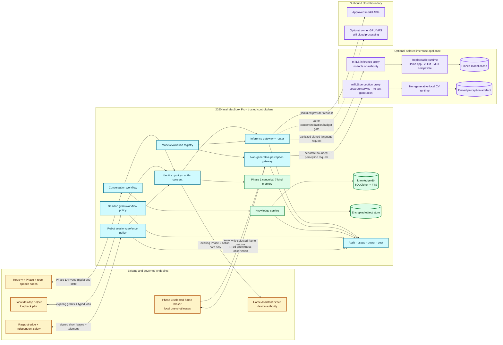
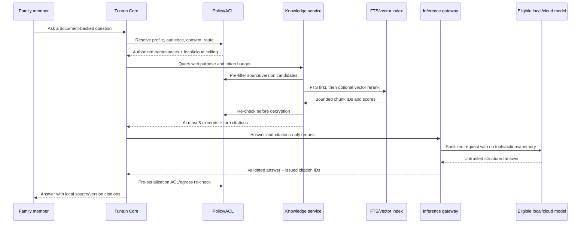
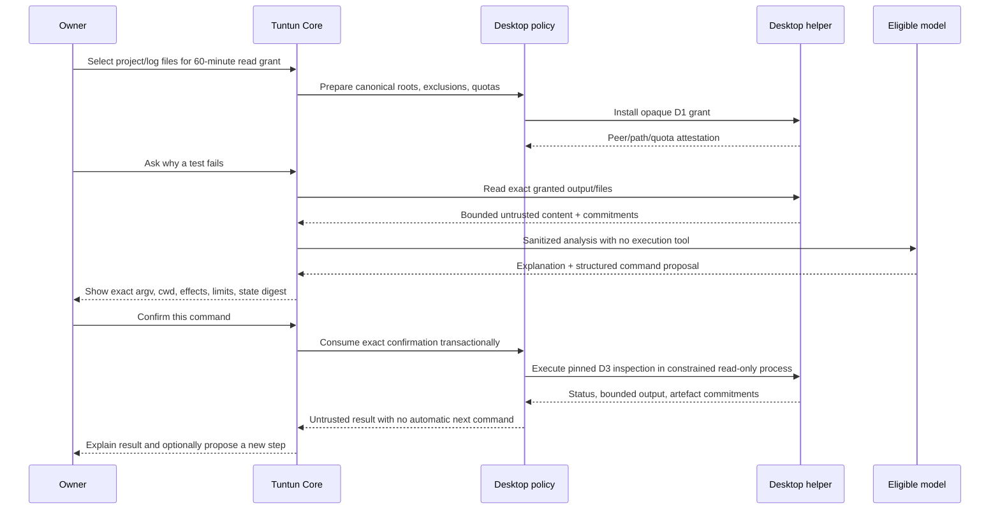
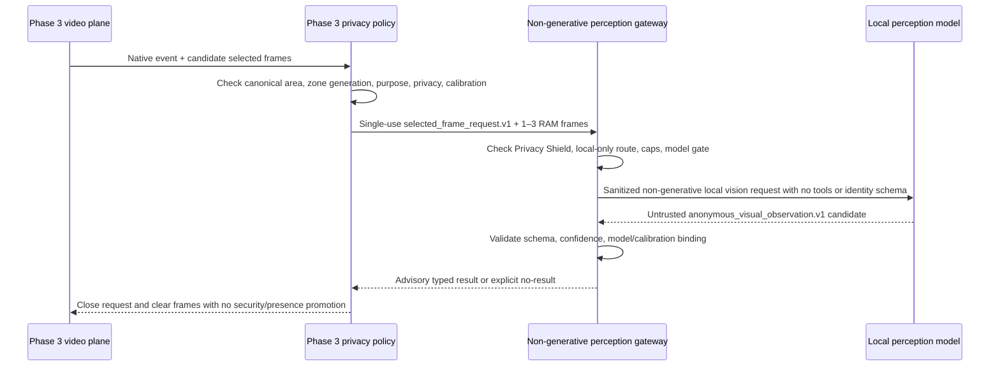
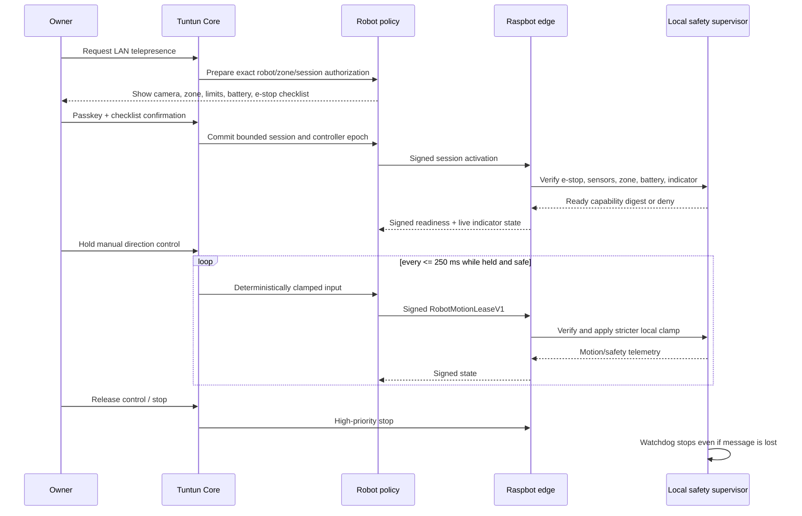

# Tuntun Phase 5 “Private AI, Desktop Assistance & Robotics” Architecture Specification

**Status:** design baseline complete; implementation plan ready; implementation not started
**Date:** 2026-08-27
**Scope:** evidence-gated private inference migration, a separate governed household knowledge corpus, risk-tiered owner desktop assistance, selected-frame local vision, and supervised Raspbot V2 integration
**Primary operator:** one owner-managed household
**Depends on:** Phase 1 identity/policy/memory/audit/provider gateway; Phase 2 topology/action contracts; Phase 3 video/privacy/frame-selection boundary; Phase 4 speech/media/display endpoint contracts

## 1. Outcome

Phase 5 moves suitable AI workloads toward private local execution without moving trust into a model server. The 2020 Intel MacBook Pro with 16 GB RAM remains Tuntun’s orchestration and control host. It continues to own canonical identity, family policy, authorization, the seven memory kinds, audit, cloud budget, and final routing decisions. A future inference appliance is a replaceable, model-independent compute worker behind the existing Tuntun gateway; it never becomes the household authority.

Migration is staged. The existing cloud route remains the measured quality baseline. The Intel Mac may run bounded small offline classifiers, embedding models, and deterministic support functions when resource tests pass, but it is not represented as capable of high-quality frontier-scale local conversation. No inference appliance is purchased merely because a large model can load. Purchase and route activation require task-specific quality, bilingual behavior, safety, latency, power, maintenance, privacy, and total-cost evidence.

Phase 5 also introduces a local document and knowledge corpus that is deliberately separate from conversational memory. The corpus combines relational provenance and access metadata, encrypted object storage, full-text retrieval, and optional rebuildable vector indexes. It can answer cited questions from owner-approved material without turning every document into a personal memory or silently uploading the corpus.

Desktop help is useful but bounded: conversation, owner-selected content, proposed commands and patches, exact-confirmed non-code inspections, and owner-approved sandboxed workflows for every project-code/test/lint/build operation. Grants expire. There is no unrestricted shell, screen, browser-cookie, accessibility, full-disk, or silent computer control.

Raspbot V2 is a later supervised endpoint, not an autonomous household agent. Its first production-capable modes are local manual control and LAN telepresence within commissioned common areas. Local safety code, physical exclusion, speed limits, obstacle stop, a real emergency stop, a visible camera indicator, and battery controls take precedence over AI output. Unsupported motion remains absent. The existing LILYGO T-Dongle-S3 is evaluated only as an optional status, secondary-stop, or provisioning experiment and is left out if it adds no unique value.

## 2. Locked decisions and inherited invariants

| Area | Decision |
|---|---|
| Migration strategy | **Staged local migration**; cloud remains the initial quality baseline and safe fallback only where consent, privacy, and budget permit |
| Control host | Existing 2020 Intel MacBook Pro, 16 GB RAM; owns orchestration and every canonical trust decision |
| Intel Mac inference | Bounded small offline models only after resource gates; never assumed sufficient for frontier-quality local conversation or sustained local vision |
| Inference appliance | Replaceable worker behind `InferenceGatewayPort`; no canonical memory, family policy, action authority, or direct endpoint access |
| Model serving | Adapter-compatible `llama.cpp`, vLLM, MLX-compatible, or future runtime; runtime compatibility never defines Tuntun’s public contract |
| Cloud/VPS | Outbound-only through the same privacy, consent, redaction, budget, audit, and routing gateway; an owner-operated VPS is still cloud processing |
| Canonical memory | The Phase 1 seven-kind SQLCipher memory remains authoritative and separate from documents, files, embeddings, model caches, and conversation checkpoints |
| Knowledge corpus | Separate SQLCipher relational catalog plus application-encrypted object store under one configured canonical storage binding; FTS baseline and vector retrieval only where measured useful |
| Camera vision | Phase 3 may issue bounded, selected-frame local leases only; no continuous cloud video and no Reolink-derived identity |
| Desktop posture | Risk-tiered and low-friction; D3 executes only pinned non-code inspection utilities, while every repository code/test/lint/build/format operation is D4 and runs only in a proved sandbox |
| Desktop scope | Initial production pilot is on the Tuntun Mac through loopback/Unix-domain transport; the outer-network office laptop receives no new inner-network route in Phase 5 |
| Desktop model egress | Selected files, excerpts, repository material, and command/workflow output are local-only by default; one exact owner-approved cloud exception is single-use, expiring, revocable, and bound to the current `DesktopGrantV1` plus content/output, provider, model, purpose, sensitivity, disclosure, and provider-policy commitments |
| Robot posture | Raspbot manual/telepresence first; common-area geofence; no stairs, water, kitchen hazards, private rooms, unsupervised exploration, following, carrying, or autonomous navigation |
| Robot authority | Models can explain or propose, but cannot mint motion leases or sit in the motor-control loop |
| LILYGO | Optional experiment; never the sole or primary emergency stop, authenticator, voice endpoint, or policy authority |
| Concurrency | Phase 4’s active conversation-slot limit remains unchanged; adding inference capacity does not increase household conversation concurrency |
| Public boundary | Apache-2.0 framework remains free of household data, private model artefacts, credentials, proprietary weights, and vendor firmware |

The following Phase 1 and Phase 2 controls remain unchanged:

- uncertain identity becomes Guest and biometrics do not authorize actions;
- child/guardian audiences and durable-memory consent apply before retrieval, decryption, and provider serialization;
- Privacy Shield preempts Tuntun processing and cloud egress;
- every cloud attempt reserves cost under the S$100 soft/S$150 hard monthly budget;
- Home Assistant remains the deterministic device plane and receives no model, document, identity, or desktop authority;
- no public inbound home service, router port-forwarding, or ambient cross-router trust is introduced;
- model output, retrieved text, command output, robot telemetry, and camera observations are untrusted inputs until local schema and policy validation pass.

## 3. Scope boundaries

### 3.1 Included

- A model-independent local/remote inference request and response contract behind the Phase 1 provider gateway.
- Governed model artefact registry, evaluation evidence, task routing, shadow evaluation, rollback, cost, and power accounting.
- Bounded small-model experiments on the Intel Mac and evidence-gated appliance candidates.
- A separate encrypted document/knowledge corpus with provenance, versioning, access policy, parsing isolation, FTS, optional embeddings, citation, export, deletion, backup, and restore.
- Local selected-frame vision requests consumed from the Phase 3 frame-lease boundary and separate advisory observations returned to Phase 3 policy without creating a security event or presence transition.
- An owner desktop companion with expiring read grants, exact command proposals, patch proposals, safe-command confirmation, sandboxed workflow manifests, resource bounds, audit, and cancellation.
- A Raspbot edge/safety adapter, capability probing, local manual/LAN telepresence, common-area geofencing, motor watchdog, obstacle stop, emergency stop, visible camera state, battery handling, and safe charging fallback.
- An optional LILYGO status/secondary-stop/provisioning probe with a documented removal gate.
- Simulator, synthetic fixtures, fault injection, model/corpus/desktop/robot evaluation, owner-console modules, staged household trials, and rollback.

### 3.2 Explicitly excluded

- Replacing the Mac as canonical identity, policy, memory, audit, budget, recovery, or action-signing authority.
- Treating a local model as trusted, self-authorizing, inherently private, or quality-equivalent to the approved cloud baseline without evidence.
- Hosting a high-quality frontier-scale LLM on the 16 GB Intel Mac as a Phase 5 requirement.
- Continuous camera decoding by a VLM, raw camera media in prompts or memory, cloud camera-frame analysis, face recognition from Reolink, or correlation of Reolink tracks with Reachy identities.
- Automatic document ingestion from entire drives, mailboxes, browser histories, cloud accounts, network shares, or Home Assistant.
- A non-owner adult file picker or desktop-content grant in the Phase 5 household profile; adding one requires a fully subject-scoped authority and UI design rather than reuse of the owner route.
- Allowing retrieved documents, source-code instructions, command output, or model text to execute a tool, change policy, write memory, or move a robot directly.
- Ambient screen capture, keylogging, clipboard history, Accessibility control, password-manager access, browser cookies, SSH-agent access, arbitrary shell strings, arbitrary package installation, or unrestricted full-disk access.
- Sending desktop-selected content or command/workflow output to a cloud/VPS model because a workflow has network access; model egress and workflow network authority are separate grants.
- A Phase 5 route from the BE800-connected office laptop into the inner ASUS network; a paired cross-network desktop helper waits for Phase 6 VPN/remote-access design.
- Autonomous Raspbot mapping, exploration, room-to-room navigation, person following, child supervision, fall detection, deliveries, object carrying, stair operation, operation near water/heat, or internet telepresence.
- Representing the Raspbot’s vendor face recognition, large-model package, or prebuilt image as Tuntun identity or authorization.
- Using the LILYGO as a far-field room voice node, primary e-stop, unattended credential vault, or reason to expand scope.
- Training or fine-tuning models on family conversations, raw media, canonical memories, documents, or desktop material.
- A NAS as an inference requirement. A NAS may later store encrypted objects or backups but does not replace measured accelerator compute.

## 4. Alternatives considered

### 4.1 End-to-end migration approaches

| Approach | Advantages | Costs and risks | Decision |
|---|---|---|---|
| **A. Cloud-first indefinitely** | Highest near-term answer quality; no new hardware; lowest maintenance | Continued sensitive-data boundary, recurring cost, WAN dependence, no local-only document/vision route | Retained only as baseline/fallback, not the selected long-term direction |
| **B. Replace the Mac with one large AI server** | One host and potentially simpler deployment | Couples safety, policy, storage, desktop, and expensive inference into one failure/update domain; makes migration and open-source portability worse | Rejected |
| **C. Staged hybrid with a narrow inference appliance** | Preserves trusted Mac control plane, enables per-task migration, supports local privacy and cloud quality, keeps runtimes replaceable | Two hosts, explicit networking, more evaluation and operational evidence | **Selected** |

### 4.2 Knowledge-store approaches

| Approach | Advantages | Costs and risks | Decision |
|---|---|---|---|
| Put documents into the seven memory kinds | One retrieval API | Conflates authored documents with personal claims, breaks memory approval/lifecycle semantics, makes deletion and provenance ambiguous | Rejected |
| Deploy PostgreSQL, object storage, and a separate vector service immediately | Mature scale and filtering | Too much operational surface for one household and one developer; premature distributed storage | Deferred scale option |
| Separate SQLCipher catalog + encrypted objects + FTS, optional rebuildable vector index | Simple local recovery, clear trust/lifecycle boundary, migration seam | Vector scan/index scale is bounded and must be measured | **Selected** |

### 4.3 Desktop approaches

| Approach | Advantages | Costs and risks | Decision |
|---|---|---|---|
| Unrestricted local agent with shell and screen control | Maximum apparent convenience | Prompt injection and model error become arbitrary owner compromise; unreviewable authority | Rejected |
| Read-only conversational companion | Small attack surface | Cannot run tests or validated workflows, limiting practical debugging | Kept as safe baseline |
| Capability grants + exact commands + sandboxed workflows | Useful coding/debugging with observable authority and expiry | Requires a command registry, grant lifecycle, sandbox probes, and confirmation UI | **Selected** |

## 5. Architecture



### 5.1 Trust boundary

The Mac is the policy-enforcement point before and after every inference or perception request. The appliance language service accepts only signed `SanitizedInferenceRequestV1` messages; its separate perception service accepts only Phase 3 `selected_frame_request.v1`. Both return untrusted typed output. Neither has a direct route or credential for SQLCipher, Keychain, the object store, Home Assistant, Reolink, Reachy media beyond the single-use selected frames, desktop files, Raspbot motion, the owner console, or cloud-provider administration.

Inference can move; authority does not. A local model response follows the same schema validation, DLP, child-safety, action/memory proposal, citation, confirmation, and audit path as a cloud response. A runtime claiming OpenAI compatibility does not bypass adapter conformance tests.

### 5.2 Deployment model

- `tuntun-core` remains one modular-monolith process on the Mac, with focused in-process modules and bounded worker pools.
- `tuntun-inference-proxy` is one least-privilege service on an optional appliance. The serving runtime may be a separate local process/container reachable only by the proxy over loopback.
- `tuntun-perception-proxy` is a different least-privilege appliance service and identity. It accepts only Phase 3 `selected_frame_request.v1`, reaches only a pinned non-generative CV runtime, and shares no language-model endpoint, prompt template, tool schema, or queue.
- `tuntun-desktop-helper` is a separate least-privilege process on the Mac. It uses a Unix-domain socket with peer-credential checks for the initial pilot and receives no provider/model key.
- `tuntun-robot-edge` runs on the Raspbot Raspberry Pi beside vendor motor/sensor code but behind an independent safety supervisor. Vendor ROS/DDS and control ports are restricted to loopback where the hardware/software probe permits.
- The knowledge catalog and object store remain under the single commissioned `KnowledgeStorageBindingV1` on the owner-controlled encrypted internal root or separately named `TUNTUN_KNOWLEDGE` volume. Large objects do not move to the inference appliance as an ambient mount.
- No new broker, service mesh, Kubernetes cluster, or distributed database is required. Typed queues and existing cross-domain envelopes remain sufficient.

## 6. Component ownership

| Component | Owns | Must not own |
|---|---|---|
| Inference gateway | Request sanitization, route eligibility, model selection, cancellation, budget/power reservation, response validation | Model runtime internals, action execution, corpus storage |
| Model/evaluation registry | Artefact manifests, licences, hashes, runtime compatibility, evaluation evidence, activation/rollback state | Family prompts, raw eval conversations, provider credentials |
| Inference proxy | mTLS verification, request quotas, runtime translation, model health, bounded output | Household identity, policy, memory, tools, endpoint credentials |
| Non-generative perception gateway | Validate the exact Phase 3 selected-frame request, local-only route, model/calibration binding, RAM lifetime, and closed observation | `LanguageModelPort`, free text, tools, identity, continuous camera access |
| Perception proxy | Translate one bounded frame request to one pinned non-generative CV artefact and clear RAM on every terminal path | Language runtime, text generation, cloud route, tools, durable media |
| Knowledge service | Canonical storage/recovery bindings, import grants, provenance, ACLs, parsing jobs, versioning, retrieval, citations, deletion | Canonical personal claims, implicit memory writes, or fallback to an unbound volume |
| Knowledge catalog | Source/object/chunk/version/ACL metadata, FTS index, rebuild state | Raw video, audio, biometric templates, command output history |
| Encrypted object store | Envelope-encrypted document bytes and explicit exports | Camera retention, model weights, plaintext keys |
| Desktop policy service | Owner grant preparation, exact model-egress/confirmation/passkey binding, workflow manifests, job reconciliation | Direct OS execution, arbitrary shell parsing, or treating workflow network as model egress |
| Desktop helper | Resolved-path reads, pinned D3 inspection, and approved D4 sandbox job execution | Model access, policy changes, Keychain, UI automation, or model-egress decisions |
| Selected-frame vision adapter | One-shot selected-frame request consumption and separate advisory local observation | Continuous stream, identity, raw-frame persistence, cloud vision, security/presence promotion |
| Robot policy service | Session authorization, geofence/version, signed motion leases, owner audit | Motor PWM, obstacle loop, local e-stop decisions |
| Raspbot safety supervisor | Motor watchdog, hard limits, sensor freshness, obstacle stop, e-stop latch, camera indicator | Family identity, model calls, household memory, policy editing |
| LILYGO experiment | Non-authoritative status and optional secondary stop/provisioning ceremony | Sole safety function, durable owner credential, policy authority |

## 7. Model-independent inference plane

### 7.1 Request contract

The gateway emits one canonical, JCS-signed request after local policy, consent, redaction, and route reservation:

```text
SanitizedInferenceRequestV1
  request_id
  schema_version = 1
  household_session_pseudonym
  turn_id
  task_class
  capability_required
  sensitivity_class
  allowed_execution_zone: local_mac | local_appliance | approved_cloud
  persona_descriptor
  language_mode: en | hi | hinglish
  input_segments[1..32]:
    segment_id
    kind: user_text | approved_memory_excerpt | knowledge_excerpt | command_output
    trust_class: trusted_policy | user_statement | untrusted_retrieval | untrusted_tool_output | untrusted_media
    content_or_single_use_ref
    token_or_byte_count
    provenance_commitment
  response_schema_id
  max_input_tokens
  max_output_tokens
  deadline_at
  cancellation_id
  policy_version
  prompt_template_digest
  model_route_policy_digest
  consent_receipt_commitments
  desktop_model_egress_authorization_commitment: optional
  budget_or_power_reservation_id
  key_id
  signature
```

The request contains no real family name, biometric data, stable profile/database identifier, provider secret, object-store key, filesystem path, camera URL, Home Assistant entity ID, desktop grant token, robot credential, or raw canonical-memory record. `persona_descriptor` reuses the canonical Phase 1 `PersonaProjection` exactly: `role`, `context`, `tone`, `depth`, and `learning_level`, with the same closed enums and no parallel alias or extension. Camera frames are not valid segments in this language-inference contract; Section 10 uses a separate `PerceptionGatewayPort` and the exact Phase 3 request. A desktop-derived segment sent to `approved_cloud` requires the commitment of the exact current `DesktopModelEgressAuthorizationV1`; a local route omits it, and an execution-network grant cannot populate it.

`input_segments` are ordered data, not an instruction hierarchy. Only the locally pinned system/policy template may supply instructions. A model adapter cannot add a tool, increase limits, change task class, or reinterpret one trust class as another.

### 7.2 Response contract

```text
InferenceResultV1
  request_id
  schema_version = 1
  status: completed | refused | cancelled | timed_out | failed
  response_schema_id
  output
  finish_reason
  model_artifact_id
  model_digest
  tokenizer_digest
  quantization
  runtime_name
  runtime_version
  prompt_template_digest
  input_tokens
  output_tokens
  first_token_ms
  total_ms
  safety_flags[]
  server_receipt_id
  proxy_key_id
  signature
```

The Mac rejects a result if request identity, schema, model activation, template digest, deadline, cancellation state, signature, or output limits do not match. Output remains model-generated and untrusted. Ordinary conversational schemas may carry only the existing closed Phase 1 intent unions; knowledge, web-assisted, desktop-output, and selected-frame schemas contain no action or memory proposal field. Local code alone resolves current IDs, authorization, and side effects.

### 7.3 Model artefact manifest

Every enabled artefact has an immutable manifest:

```text
model_artifact_id
upstream_name_and_revision
source_urls
licence_ids
redistribution_allowed
weights_digest
tokenizer_digest
prompt_template_digest
architecture
parameter_count
quantization_and_calibration
context_limit
required_runtime_and_accelerator
minimum_memory_evidence
supported_task_classes
prohibited_task_classes
evaluation_bundle_digest
approved_routes
activated_at / revoked_at
```

Weights are downloaded only during an owner-approved maintenance window into quarantine. Hash, licence, provenance, expected file set, malware/content-sentinel checks, and runtime load tests pass before activation. Model caches never enter source control or ordinary family backups. A manifest or runtime drift disables the route until evaluation is rebound to the new digests.

`required_runtime_and_accelerator` is the closed `RuntimeRequirementV1`: pinned runtime name/version/artifact digest, a unique `x86_64 | arm64` host-architecture set, `cpu_only | metal_optional | metal_required`, the closed `avx2 | fma` CPU-feature set where applicable, and a maximum of 16 worker threads. It contains no command, image, package source, environment, or arbitrary accelerator option. An ARM-only requirement cannot claim x86 CPU features.

### 7.4 Router policy

The router evaluates in this order:

1. Privacy Shield, consent, child/Guest restrictions, sensitivity, and raw-media prohibitions.
2. Required task capability and schema.
3. Activated model/evaluation status for the exact language/profile/task cell.
4. Local Mac/appliance health, memory pressure, queue, temperature, and deadline feasibility.
5. Cloud provider review, WAN state, data-egress policy, and budget when a cloud route remains eligible.
6. Quality preference, then latency and measured per-request energy/cost.

Hard policy beats availability. A `local_only` document or selected camera frame never falls back to cloud. A child task never falls back to a model that has not passed the complete child-safety gate. A timeout does not silently change privacy zone. The user receives a truthful local inability response when no eligible route exists.

### 7.5 Staged migration

| Stage | Enabled use | Evidence before advancing | Safe fallback |
|---|---|---|---|
| `M0 baseline` | Existing cloud conversation and synthetic/de-identified evaluation | Phase 1 provider controls and a fixed task corpus | Existing offline essentials |
| `M1 bounded Mac` | Embeddings, classification, DLP assist, query rewriting, small offline summaries where quality passes | RSS/CPU/thermal/latency soak and no impact on stop/privacy/voice | Deterministic code or existing cloud route if eligible |
| `M2 appliance shadow` | Candidate local models receive only synthetic/de-identified shadow cases, never mirrored live family turns | Conformance, quality, safety, power, isolation, update, and failure evidence | No household traffic reaches appliance |
| `M3 owner opt-in` | Owner low/medium-sensitivity task cells that individually pass | 14-day opt-in trial, route-level rollback, no safety/privacy regression | Cloud per existing consent or offline inability |
| `M4 adult household` | Approved adult conversation and local-only knowledge task cells | bilingual/adult acceptance, 30-day reliability, deletion/restore evidence | Per-task previous route |
| `M5 guarded child` | Only child cells that pass the full Phase 1 child corpus plus Phase 5 injection/RAG tests | distinct guardian/owner approval bound to artefact/eval/policy digests | Prior child route or offline inability |

Migration is per task cell, not a global “local AI on” switch. A stronger new model version re-enters `M2`; it does not inherit approval from a name or model family.

### 7.6 Intel Mac resource envelope

The Intel Mac can enable an `M1` model only when all of these hold under simultaneous Tuntun service load:

- model process resident memory is at most 4 GiB and system memory pressure remains green with at least 6 GiB available before launch;
- the artefact is at most 3.5 GiB and its configured context does not push the process above the memory cap;
- sustained inference uses at most two logical CPU cores on average and yields immediately to privacy, stop, audio, database, and owner-console work;
- wake acknowledgement, stop/privacy P95, and first-spoken-audio gates do not regress by more than 10% from the accepted Phase 1 baseline;
- a two-hour concurrent soak and an eight-hour idle/periodic-job soak show no swap storm, thermal runaway, queue growth, or unbounded cache;
- one inference job runs at a time; overload rejects or defers the bounded task rather than starving the household assistant.

These limits deliberately target small classifiers and embeddings. Failure leaves the capability deterministic/cloud-backed as already allowed; it never justifies reducing Phase 1 quality or safety.

### 7.7 Appliance isolation

- The appliance uses a dedicated non-admin service account, full-disk encryption, secure boot where supported, automatic security updates in owner-approved windows, and no household interactive login during service operation.
- A reserved inner-network address and host firewall accept the inference proxy only from the Mac. The appliance cannot initiate connections to Home Assistant, cameras, Reachy, Raspbot, room nodes, the object store, or management interfaces.
- Runtime containers/processes have no home-network route and no internet egress. Temporary egress opens only for a signed owner-approved model/update job, then closes and is packet-capture verified.
- mTLS uses a separate inference-device certificate and request-signing key. Rotation or revocation is independent of Reachy, Home Assistant, and robot credentials.
- The proxy enforces a 2 MiB text request cap, the Section 10 selected-frame cap, one active household generation by default, 32 queued evaluation jobs at most, per-task deadlines, output/token limits, and cancellation.
- Request/response bodies are RAM-only at the proxy and runtime. Production access logs contain identifiers, sizes, timings, artefact digests, and outcomes, not content.
- Swap is encrypted or disabled according to platform support. Core dumps and content-bearing crash upload are disabled.
- The appliance owns no corpus mount. For knowledge queries, the Mac sends only the locally authorized cited excerpts needed for that request.

### 7.8 Cloud and GPU-VPS rules

Cloud APIs continue through the Phase 1 `SanitizedProviderRequest` boundary. An owner-operated GPU instance adds no trust exemption: the Mac still minimizes input, checks consent and sensitivity, reserves cost, records the provider/region/runtime, and applies the same response validator. Canonical memory, knowledge objects, desktop files, command/workflow outputs, robot telemetry, and selected camera frames default to no VPS egress. The only Phase 5 desktop exception is the exact single-use `DesktopModelEgressAuthorizationV1` in Section 9.2; workflow/process network permission never implies model egress permission.

A GPU VPS is eligible only for synthetic/de-identified evaluation or a separately approved low-sensitivity task cell. It must use an outbound Mac-initiated TLS request, mTLS or equivalent workload identity, an encrypted ephemeral volume, no retained prompt/body logs, automatic termination after the reserved job window, no ambient administrator UI, and a packet-capture/forensic deletion test. Stopping an instance is not represented as secure erasure of provider media.

The AWS region catalogue checked on 2026-08-27 does not list G6e/L40S in `ap-southeast-1`; cross-region use therefore needs explicit data-residency review and cannot be the Singapore default. An on-demand GPU instance also consumes the existing S$150 hard monthly cloud cap. Tuntun reserves instance-hours, storage, snapshots, and estimated egress before start and terminates the resource at the reservation deadline. No 24×7 GPU instance is permitted under the household budget.

## 8. Separate local knowledge corpus

### 8.1 Boundary from canonical memory

The corpus stores source material: documents, notes, manuals, approved project files, and their derived indexes. Canonical memory stores approved claims about people, relationships, preferences, events, procedures, and policy. Importing a document does not create a semantic, episodic, preference, procedural, relational, or policy memory. A conversation about a document may separately propose a Phase 1 memory through the normal approval flow, but a knowledge-assisted answer schema itself contains no memory-write field.

Deleting a memory does not delete an independently imported source document; deleting a source document does not silently delete a separately approved memory derived from it. The owner console shows provenance and offers an explicit coordinated review when one references the other.

### 8.2 Storage layout

Exactly one `KnowledgeStorageBindingV1` is canonical at a time:

```text
KnowledgeStorageBindingV1
  binding_id
  storage_tier: internal_default | external_named
  canonical_root
  expected_mount_point
  expected_volume_uuid
  expected_filesystem
  encryption_evidence_commitment
  quota_bytes
  reserve_bytes
  recovery_policy_id
  version
  compare_and_swap_generation
  status: commissioned | disabled | retired
```

- The default is the FileVault-protected internal root `~/Library/Application Support/Tuntun/knowledge/`, with the Mac root volume UUID and mount identity captured in the binding. It contains `catalog.db`, `objects/`, `indexes/`, and `quarantine/` beneath that single canonical root.
- An external canonical root is permitted only on an explicitly separate encrypted APFS volume named `TUNTUN_KNOWLEDGE`, with its own quota, UUID, mount point, Keychain namespace, health evidence, and binding generation. It must not be `TUNTUN_VIDEO`, `HA_BACKUPS`, an alias into either volume, or a subdirectory sharing either quota.
- The service opens the root by commissioned volume identity and directory handle, not by path string alone. Missing encryption evidence, an absent or wrong volume UUID, mount substitution, mount-point drift, unexpected filesystem, read-only state, ownership change, quota loss, or CAS/version mismatch disables imports, retrieval, indexing, export, and restore. It never falls back automatically from external to internal storage or spills into the video, backup, or Mac root volume.
- Moving the canonical root is a separately approved migration: freeze writes, verify a complete encrypted copy and catalog/object commitments, atomically change the binding generation, re-open by volume identity, then retire the old root. Two roots are never merged or queried concurrently.
- `catalog.db` is a separate SQLCipher database with its own 256-bit key and schema version.
- Each object is encrypted with a random per-version DEK using an authenticated-encryption format; the DEK is wrapped by a knowledge-object root in Keychain.
- Object paths use random identifiers and reveal neither filename nor subject. Plaintext exists only in a bounded parser/retrieval workspace and RAM.
- FTS5 lives inside SQLCipher and is the mandatory baseline. It indexes normalized extracted text plus section/page locations.
- Embeddings are optional derived data. For the household-scale baseline they are encrypted records associated with chunk IDs and scanned only after ACL/metadata/FTS pre-filtering. A native vector extension or later PostgreSQL/pgvector adapter is enabled only after pinned-build, encryption, backup, deletion, and result-parity gates.
- Indexes are rebuildable from authorized source objects; they are not the source of truth and cannot extend source retention.
- The corpus has its own binding and quota, and an external corpus has its own volume, separate from Phase 3 video and Home Assistant backups; video or backup pressure cannot silently delete documents.

The recovery copy has an independent `KnowledgeRecoveryPolicyV1`, destination binding, encryption/key bundle, destination-volume UUID, quota, schedule, retention, and deletion generation. It is never the active retrieval root and must be on a different owner-controlled encrypted failure domain from the canonical corpus. The baseline recovery point objective is 24 hours: after a changed day, retain seven daily and four weekly encrypted generations, prune expired generations within 24 hours, and verify one offline restore quarterly. Source deletion or consent revocation immediately blocks affected generations from restore; within 24 hours Tuntun destroys or rekeys every affected managed recovery generation and creates a clean generation. Failure marks recovery `ineligible`, blocks new imports, and remains visible until reconciled. An owner-created export is not a recovery copy and follows its own disclosed lifecycle.

### 8.3 Relational model

```text
knowledge_source
  source_id, source_kind, import_actor, imported_at, origin_label,
  current_version_id, audience, subject_namespace, sensitivity,
  cloud_egress_policy, retention_policy_id, status

knowledge_object_version
  version_id, source_id, object_digest, encrypted_object_ref,
  media_type, byte_count, original_name_ciphertext, source_modified_at,
  parser_manifest_digest, extraction_status, created_at, superseded_at

knowledge_chunk
  chunk_id, version_id, ordinal, page_or_section, text_ciphertext,
  text_commitment, token_count, language, trust_class, index_status

knowledge_embedding
  chunk_id, model_artifact_id, dimensions, vector_ciphertext,
  normalization, created_at, stale_at

knowledge_acl
  source_id, audience, subject_namespace, guardian_consent_ref,
  allowed_purposes, effective_from, expires_at, revoked_at

knowledge_citation
  citation_id, request_id, source_id, version_id, chunk_id,
  issued_at, expires_at, display_label, commitment
```

The `audience` values and guardian semantics reuse Phase 1: `subject_private`, `guardian_child`, `household_adults`, and `household_all`. For a child subject namespace, only `guardian_child` or an explicitly approved child-safe `household_all` ACL is eligible; child `subject_private` and `household_adults` ACLs are invalid. Guest retrieves nothing. Child retrieval requires the current guardian/consent binding and child-safe classification at pre-filter, pre-decryption, and provider-serialization boundaries.

`cloud_egress_policy` is either `local_only` or `bounded_excerpt_with_current_consent`; default is `local_only`. Changing it is an exact owner passkey action bound to source/version, audience, sensitivity, provider policy, and expiry.

### 8.4 Import flow

1. An authenticated owner uses the native picker or console to select exact files; a directory import enumerates a preview and exact caps before approval.
2. The Mac resolves paths without following a symlink outside the selected root, rejects devices/sockets/FIFOs, records size/type/digest, and copies encrypted bytes into quarantine. The original is never modified.
3. A sandboxed parser with no network, no credentials, a read-only single-object mount, 512 MiB RAM, one CPU, 60-second deadline, and 25 MiB extracted-text cap processes the object. Macros, embedded executables, external references, active content, and archive recursion beyond two levels are rejected.
4. Local DLP and content classification propose sensitivity, audience, retention, and cloud-egress defaults. The owner reviews any document above household-public sensitivity and every child-audience document.
5. One serialized transaction commits source/version/chunk metadata and the encrypted object reference. FTS then indexes authorized extracted text. Embeddings are queued only when an activated local embedding model exists.
6. The temporary parser workspace is destroyed, and a sentinel scan verifies that plaintext did not enter logs, crash reports, model caches, or unrelated storage.

Import failure leaves no searchable partial document. Unsupported media remains an encrypted unindexed object only if the owner explicitly chooses archival storage; otherwise quarantine is destroyed.

### 8.5 Knowledge query sequence



Retrieval uses at most eight chunks and 12,000 total document tokens per turn, within the model-specific context limit. FTS is always available for exact terms. Vector candidates may improve semantic recall but never bypass ACL, sensitivity, source status, or current-version checks. A score threshold cannot convert `no result` into an invented answer.

Documents and retrieved chunks are untrusted data. The inference request labels them accordingly, says they cannot change instructions or request tools/secrets, and exposes an answer-and-citations-only schema. If the user wants to execute a command or remember a claim found in a document, a new ordinary turn restates the exact intent and goes through the desktop or memory policy path.

### 8.6 Retention, deletion, and backup

- Pending failed imports expire within 24 hours; successful imports follow their explicit source policy.
- Superseded versions remain inaccessible to routine retrieval and default to deletion after 30 days unless the owner pins a version for provenance.
- Issued citation capabilities expire at turn end plus five minutes and never grant object download.
- Query text, excerpts, and generated answers remain ephemeral under the Phase 1 raw-turn policy. Content-minimized receipts retain only source/version/chunk commitments, route, timing, and result class.
- Deleting a source destroys its wrapped object/version DEKs, chunk plaintext records, FTS rows, embeddings, citations, and pending parser data immediately. A deletion generation blocks every older managed recovery generation from restore; affected generations are destroyed or rekeyed and a clean recovery generation is made within the Section 8.2 24-hour bound. This is cryptographic inaccessibility, not a claim of physical SSD byte erasure.
- Corpus recovery copies use the Phase 1 encrypted portable-container design with a distinct knowledge key bundle and the independent Section 8.2 storage/policy binding. They exclude model caches, parser quarantine, and indexes that can be rebuilt. Restore opens no content until destination volume identity, policy/deletion generation, ACL, source status, checksum, and key state all reconcile.
- Owner-created exports are separate copies outside Tuntun’s revocation control and are labelled with sensitivity, source/version, export time, and recovery responsibility.

## 9. Desktop companion

### 9.1 Permission levels

Desktop filesystem capability is owner-only in the Phase 5 household profile. Other adults may use ordinary conversation, but the desktop picker, selected-file read, repository view, command-output view, grant, terminal, patch, and workflow routes are absent for them. Child and Guest profiles receive no desktop filesystem, terminal, patch, or workflow capability. A later non-owner route requires its own fully subject-scoped authority, consent, picker, disclosure, revocation, and negative-test design; the owner route cannot delegate it implicitly.

| Level | Capability | Authorization | Writes / execution network |
|---|---|---|---|
| `D0 conversation` | Explain commands, errors, architecture, or pasted text | Normal conversation policy | No computer access |
| `D1 selected_read` | Read exact files or a bounded selected project tree | Native picker/owner console creates an expiring grant | Read-only; no network |
| `D2 propose` | Propose exact argv commands or a unified patch from D1 material | Active D1 grant; model output remains a proposal | No execution or file write |
| `D3 confirmed_inspection` | Run one pinned non-code-executing inspection utility against granted material | Exact command confirmation bound to grant/job/repository state | Read-only and network-off; never repository code, test, lint, build, format, hook, plugin, or script execution |
| `D4 approved_workflow` | Run any repository code, test, lint, build, format, generator, or isolated patch workflow | Fresh owner passkey bound to complete workflow manifest and input digest | Proved sandbox; explicit mounts, writes, execution network, and limits |

No level grants unrestricted or silent control. A higher level includes only the operations named in its exact grant; it is not a general role. The owner can reduce or revoke a grant immediately without authentication. Increasing scope creates a new prepared authorization.

### 9.2 Desktop grant contract

```text
DesktopGrantV1
  grant_id
  schema_version = 1
  generation
  revocation_generation
  subject_id
  device_id
  level
  roots[1..8]:
    canonical_root_commitment
    filesystem_identity
    read_or_sandbox_write
    include_globs
    exclude_globs
  max_files
  max_bytes_per_file
  max_total_bytes
  allowed_command_registry_ids[]
  allowed_workflow_ids[]
  execution_network_policy
  desktop_model_egress_policy: local_only | exact_owner_exception
  created_at
  expires_at
  policy_version
  authorization_commitment
  revoked_at
```

The baseline grant lasts at most 60 minutes, covers at most eight selected roots, 250 regular files, and 50 MiB of extracted text. One file may contribute at most 5 MiB. `subject_id` must be the exact current owner subject in the Phase 5 household profile. The helper rejects paths outside the roots after realpath resolution, symlink escapes, hard-link identity changes, device nodes, sockets, FIFOs, mount-point crossings, world-writable executable search paths, and files whose identity/digest changes between preparation and use.

Each `filesystem_identity` is the closed `FilesystemIdentityV1`: encrypted volume UUID, persistent file ID, birth time, directory object type, snapshot generation, and observation time. It contains no hostname, username, absolute path, bookmark blob, file contents, or reusable filesystem capability. The separately committed canonical root and native picker authority are required to open it.

Sensitive defaults exclude `.ssh`, `.gnupg`, Keychain material, browser profiles/cookies, password stores, cloud credential directories, `.env*`, private keys, system logs containing other users, and Tuntun production data. Selecting a parent directory does not override those exclusions. An exact owner-passkey exception may include one named non-secret file for one job, but private keys, authentication cookies/tokens, Keychain, and Tuntun key roots are ungrantable.

The desktop helper receives an opaque grant and server-resolved capabilities, not policy rules or passkey material. It independently rechecks process identity, path, file identity, expiry, revocation generation, and quota before each read/job.

Desktop-selected content, repository material, and command/workflow output are `local_only` by default. A cloud or GPU-VPS model may receive a subset only after a fresh owner passkey creates this separate, single-use contract:

```text
DesktopModelEgressAuthorizationV1
  authorization_id
  schema_version = 1
  owner_subject_id
  desktop_grant_id
  desktop_grant_generation
  selected_file_identity_commitments[]
  selected_content_commitments[]
  selected_command_or_workflow_output_commitments[]
  provider_id
  provider_account_id_commitment
  model_id
  model_version_or_route_digest
  purpose
  sensitivity_class
  disclosure_text_digest
  provider_data_use_and_retention_policy_digest
  issued_at
  expires_at
  single_use = true
  revocation_generation
  revoked_at
  authorization_commitment
```

The UI shows the exact owner subject, files/excerpts/output portions, byte/token totals, provider, model, purpose, sensitivity, applicable disclosure, provider data-use/retention policy, and expiry before approval. Expiry is at most 15 minutes and never exceeds the bound `DesktopGrantV1`. Every serialized byte must match one selected commitment; a changed file, new command output, changed provider/model/purpose/sensitivity/policy, grant expiry/revocation, or egress-authorization revocation rejects the request. The gateway transactionally consumes the authorization for one provider attempt and records only content commitments and outcome metadata. Secrets and ungrantable paths remain ineligible even with owner approval. Without this exact contract the result is produced by an eligible local model or reported unavailable; it never falls back to cloud.

`execution_network_policy` controls network access of an executed D4 sandbox job only. It never authorizes model serialization. Conversely, `DesktopModelEgressAuthorizationV1` authorizes only the committed model request and never grants the helper, D3 process, or D4 workflow a network destination.

### 9.3 Command proposal and confirmation

The model produces a structured proposal, never a shell string:

```text
DesktopCommandProposalV1
  proposal_id
  registry_command_id
  executable_digest
  argv[]
  cwd_relative_to_grant
  environment_profile_id
  declared_reads[]
  declared_writes[]
  execution_network_policy
  timeout_seconds
  stdout_limit_bytes
  stderr_limit_bytes
  purpose_summary
  input_state_commitment
```

The registry defines the pinned operating-system executable, exact argv grammar, allowed subcommands/flags, controlled environment, mount mode, side effects, timeout, and output caps. The first `D3` registry contains only non-code-executing inspection operations:

- `git --no-pager status --porcelain=v2` for one granted repository;
- `git --no-pager diff --no-ext-diff --no-textconv --` with explicit granted paths;
- `git --no-pager log --oneline --max-count N` where `N <= 200`, with signature rendering disabled;
- `rg` with a literal/regex pattern, explicit granted paths, no preprocessor, and bounded results;

Git runs with a controlled empty home/config environment, external diff/text conversion, pagers, hooks, filters, filesystem monitors, credential helpers, signing, and optional object/program helpers disabled. D3 never runs a repository binary, script, hook, plugin, formatter, generator, package command, compiler, interpreter, test, lint, build, or application entry point. Whether dependencies are already installed is irrelevant: all repository or project code execution is D4 and requires a proved sandbox.

Shell interpreters, `eval`, pipes, redirection, command substitution, glob expansion by a shell, aliases, ambient `PATH`, package managers, network clients, privilege escalation, `sudo`, `ssh`, `scp`, `curl`, `wget`, destructive Git operations, and arbitrary script paths are absent. A project-supplied binary or script is not safe merely because it is in the repository; it must be part of a separately reviewed workflow manifest.

Every `D3` execution requires a confirmation bound to the canonical proposal digest, grant ID/generation, exact argv, executable digest, cwd filesystem identity, repository/worktree head and dirty-state digest when applicable, environment profile, execution-network policy, declared effects, timeout, subject, session, and a two-minute expiry. Any edit or state drift invalidates confirmation. The execution service atomically consumes confirmation and commits `AUTHORIZED_COMMITTED` before helper I/O, following the Phase 2 durable action pattern.

### 9.4 Workflow manifest

```text
DesktopWorkflowManifestV1
  workflow_id
  version
  digest
  display_name
  steps[1..20]
  command_registry_ids[]
  input_roots_and_commitments[]
  read_only_roots[]
  disposable_write_roots[]
  output_artifacts[]
  execution_network_policy
  cpu_limit
  memory_limit_mib
  wall_time_limit_seconds
  process_limit
  combined_output_limit_bytes
  disposable_disk_limit_bytes
  rollback_or_discard_behavior
  required_sandbox_backend
  owner_authorization_commitment
  issued_at
  expires_at
```

The initial sandbox is network-off, has a read-only source mount, a new disposable write layer, no host home directory, no Docker socket, no SSH agent, no device access, no host PID namespace, no Keychain, and no Tuntun production socket. Default limits are two CPUs, 4 GiB RAM, 20 processes, 15 minutes, 100 MiB combined output, and 1 GiB disposable disk. Increasing a limit or enabling an execution-network destination requires a future contract revision, its own threat/evidence gate, a new workflow version, and a fresh passkey action; the Phase 5 baseline DTO rejects it. Such a later grant would still convey no authority to send source or output to a model.

The nested manifest is closed as well. Every step has a stable ID, contiguous ordinal, one registered command, bounded argv, disposable working root, explicit in-range read/write mount indices, network `none`, bounded timeout/output, and success exit code exactly zero. Input-root records bind contiguous indices, read-only mount names, native filesystem identities, content-state commitments, and byte ceilings. Output records bind a stable artifact ID, one declared disposable-root index, relative path, closed media type, byte ceiling, and required/optional flag. Step commands must exactly equal the manifest registry in first-use order; input mounts must exactly equal the declared read-only roots; output IDs/paths are unique and their declared maxima fit the 100 MiB combined limit.

An `apply_patch_in_isolated_copy.v1` workflow may apply an exact reviewed unified diff only to a disposable copy/worktree, run registered tests, and produce a patch plus evidence. It cannot modify the owner’s live repository or commit/push. Moving the result into a live repository remains a later explicit owner operation outside the Phase 5 baseline.

If no sandbox backend on the 2020 Mac passes filesystem, process, network, escape, cleanup, and resource tests, `D4` is absent and negatively tested; D0–D2 and the non-code-executing D3 inspection registry remain available according to their own gates. No test, lint, build, format, generator, repository script/binary, or other project code runs through D3. A container label alone is not proof of isolation.

### 9.5 Desktop debugging sequence



Command output may contain prompt injection, terminal escapes, secrets, or hostile filenames. The helper strips unsafe terminal control sequences, enforces byte/line caps, labels output untrusted, and passes it through DLP before a model. It remains local-only unless the exact output commitment is covered by a current `DesktopModelEgressAuthorizationV1`. The result can propose the next job but cannot auto-chain. Each command/workflow is a fresh authorization event. Tests, lint, builds, formatters, generators, repository scripts/binaries, and all other project code use D4; the sequence above does not grant them a D3 route.

### 9.6 Initial device and network boundary

The initial desktop helper runs on the same Mac as Tuntun Core and communicates over an owner-only Unix-domain socket. It does not bind a LAN port. The office laptop remains directly attached to the outer BE800 network under the Phase 2 topology plus host and negative-reachability controls; this wording does not claim proved mutual or VLAN isolation. Phase 5 neither opens an outer-to-inner rule nor installs a relay. A future office-laptop helper must use the Phase 6 VPN/paired-device architecture and re-run device identity, data-flow, grant, remote-session, and recovery design.

## 10. Phase 3 selected-frame local vision

Phase 5 consumes only the Phase 3 frame-selection seam. The Reolink recorder/video plane remains independent, never performs family identity, and never supplies continuous streams, audio, credentials, or raw clips to a model. Privacy Shield blocks the Tuntun frame handoff; stopping the independent recorder remains a separate owner action and UI state.

### 10.1 Selected-frame request

```text
selected_frame_request.v1
  request_id
  camera_binding_id
  camera_binding_generation
  area_id
  zone_id
  zone_generation
  purpose: local_anonymous_cv_observation
  model_manifest_digest
  privacy_policy_version
  max_frames: 1..3
  max_total_bytes: <= 3 MiB
  max_dimension: <= 1920 px
  not_before / expires_at: window <= 5 seconds
  output_schema_id: anonymous_visual_observation.v1
  single_use
  authorization_commitment
```

The limits above are inherited without widening from Phase 3. Frames are JPEG/PNG, individually bounded by the remaining total and dimension limits, and stripped of audio, EXIF/device credentials, raw URLs, and unrelated zones before delivery. Phase 3 selects the camera, canonical area, commissioned zone, frame-selection trigger, and one to three frames; a model cannot browse, pan, fetch, or extend the request. `PerceptionGatewayPort` accepts it only for the local appliance's activated non-generative perception runtime and closes it on result, refusal, cancellation, recorder pause, privacy transition, timeout, capability drift, or quota breach.

### 10.2 Advisory observation

```text
anonymous_visual_observation.v1
  request_id
  state: observed | not_observed | uncertain | rejected
  approved_class: person | vehicle | pet | package | motion | unknown
  count_band: zero | one | multiple | unknown
  zone_id
  confidence_band: low | medium | high | unavailable
  evaluated_at
  valid_until
  model_artifact_id
  model_digest
  calibration_digest
  reason_codes[]
```

The schema and class union are identical to the Phase 3 contract. It contains no caption, name, face/profile candidate, biometric, clothing identity, emotion, age, gender, race, health diagnosis, text/OCR, action, greeting, memory, or raw-media reference.

Phase 3 accepts the response only against one live `request_id`, requires `zone_id` to equal the commissioned zone in that request, rechecks the exact request-bound `area_id`, `zone_generation`, camera-binding generation and privacy generation, and verifies the model/calibration commitments. `state`, `approved_class`, and `confidence_band` are advisory owner-calibration evidence only; model/calibration fields and `reason_codes` feed content-minimized quality metrics. Phase 3 ignores `count_band` for occupancy and alerts. No field is mapped into `camera.security_event.v1` or `presence.changed.v1`, changes native `event_class`, `detector_basis`, or `verification`, generates an alert, asserts occupied/vacant, or reaches Home Assistant. The canonical `area_id` is inherited from the request and cannot be supplied or changed by the observation.

Any missing capability, failed local model gate, stale calibration, privacy conflict, malformed frame, uncertain result, or unavailable appliance produces no accepted observation. Even a successful observation remains separate advisory evidence and leaves native Phase 3 security events and presence unchanged. It never falls back to cloud vision or a less constrained schema.

### 10.3 Selected-frame sequence



## 11. Raspbot V2 supervised endpoint

### 11.1 Product boundary and capability probe

The vendor baseline describes a Raspberry Pi 5, four Mecanum-wheel motors, a 1 MP USB camera on a two-degree-of-freedom pan/tilt unit, ultrasonic and line sensors, Python, and ROS 2 Humble examples. The delivered kit version, Pi memory, motor controller/firmware, battery chemistry/capacity, charger, camera, sensor field of view, encoder availability, watchdog behavior, motor-enable path, and vendor image provenance must be captured from the physical unit. Marketing examples for face recognition, tracking, or large-model driving do not count as a safety capability.

The first probe runs with wheels raised and motor power physically controllable. It records:

- exact board/SKU/firmware/image hashes and which portions are not source-available;
- motor command API, stop semantics, boot behavior, maximum command rate, stale-command behavior, and recoverability;
- encoder/odometry availability and error; IMU, line, ultrasonic, bump, cliff, and other sensor coverage by direction;
- battery voltage/current/percentage evidence, brownout behavior, charger interlock, and thermal behavior;
- camera on/off and whether a hardware-tied indicator can prove capture state;
- ROS/DDS, hotspot, SSH, web, vendor-cloud, and control ports plus firewall/loopback restrictions;
- whether an independent physical emergency stop can remove motor-enable power without software.

If an independent e-stop cannot be installed and tested, or no allowed motion direction has a fresh obstacle/cliff safety path, production floor motion remains absent. The safe fallback is simulator and wheels-raised bench testing, not a weaker household setting.

### 11.2 Robot architecture

```text
Mac Tuntun Core
  RobotPolicyService
    - owner/passkey telepresence session
    - commissioned geofence/version
    - signed short motion leases
    - audit and revocation
              |
         paired mTLS/WSS
              |
Raspbot Pi 5
  RobotEdgeAdapter
    - protocol, sequence, camera stream, telemetry
  SafetySupervisor  <--- physical e-stop / motor-enable cutoff
    - lease watchdog
    - directional speed clamps
    - sensor freshness + obstacle/cliff stop
    - allowed-zone and camera-indicator interlocks
              |
        vendor motor/sensor board
```

The robot initiates the paired connection to the Mac. It holds a device certificate and signing key but no family memory, provider key, Home Assistant credential, owner passkey, or inference-appliance credential. Vendor ROS/DDS/control endpoints stay loopback-only behind `RobotEdgeAdapter`; if that cannot be enforced, floor use is disabled pending a tested isolated network boundary.

### 11.3 Spatial and operational boundaries

- Commissioned zones may include only physically surveyed common areas such as living room and hall.
- Adult/child bedrooms, bathrooms, kitchen, balcony, utility/wet areas, office-private zones, stairs, thresholds that can trap wheels, pools/aquariums, open doors to exterior space, and every unclassified area are prohibited.
- Stairs, water, heat, and exterior exits require a physical barrier; a map, camera, line sensor, or language-model judgement is not sufficient.
- The initial hard ceiling is 0.15 m/s translational velocity and 0.5 rad/s rotation. Commissioning may lower or remove a direction; it cannot raise either ceiling in Phase 5.
- Each allowed direction must pass stopping-distance tests at the full permitted speed. The local obstacle threshold is at least measured worst-case stopping distance plus 0.20 m. A stale or contradictory sensor removes that direction from the capability manifest.
- A 250 ms motion lease and local watchdog stop motors when the next valid lease is absent. A missed Mac heartbeat, certificate failure, sequence gap, geofence uncertainty, low battery, camera-indicator fault, controller fault, obstacle/cliff trigger, competing controller, or e-stop activation latches stop.
- An initial floor session requires an adult supervisor physically at home, a cleared common area, and a pre-drive safety checklist. Child and pet proximity triggers immediate human stop; Phase 5 makes no autonomous child/pet avoidance claim.
- Manual/LAN telepresence is owner-only. Voice, child, Guest, model output, Home Assistant, a learned routine, camera event, and LILYGO status message cannot start motion.
- No exploration, path planning, waypoint navigation, following, mapping beyond an owner-assisted commissioning map, object carrying, docking search, or post-restart motion resume is registered.

### 11.4 Emergency stop

The primary e-stop is a conspicuous latching physical control that cuts or disables motor power independently of Linux, Wi-Fi, the Mac, and the model. Reset requires physical inspection and a manual local re-arm; software cannot clear it. Commissioning measures physical actuation to motor-current disable and requires P95 at most 250 ms across 100 trials.

The owner console and Robot Edge expose authenticated software stops as additional paths. A network stop requires a fresh signed high-priority message and local processing P95 at most 250 ms after receipt, but it is never called equivalent to the physical e-stop. Reachy stop and Privacy Shield also ask Raspbot to stop any current motion, while local robot safety does not depend on either message arriving.

The LILYGO may be evaluated as a **secondary** stop transmitter only. Loss, spoofing, battery failure, Wi-Fi failure, or firmware crash must not inhibit the physical e-stop or robot watchdog.

### 11.5 Camera and telepresence

- Video is local-LAN, owner-session-bound, live-only by default, and never supplied to identity, memory, a cloud model, or the Phase 3 security recorder automatically.
- Camera capture requires a physically visible indicator driven by the same power/enable path or a fail-closed monitored interlock. If the indicator cannot truthfully prove capture, telepresence video is disabled.
- A session uses short-lived authenticated media capabilities, `no-store`, bounded bitrate/resolution, no reusable camera URL, and no browser receipt containing frames.
- Pan/tilt uses separately bounded owner controls and respects privacy zones. It cannot turn toward a prohibited doorway or private area if the commissioning sweep shows that view is reachable; mechanical limits or camera removal are required.
- No audio recording is enabled. Two-way audio is absent until a later privacy, echo, notice, and retention design.

### 11.6 Motion lease contract

```text
RobotMotionLeaseV1
  lease_id
  schema_version = 1
  robot_endpoint_id
  telepresence_session_id
  sequence
  issued_at
  expires_at
  geofence_id
  geofence_version
  safety_capability_digest
  linear_x_mps
  linear_y_mps
  angular_z_radps
  allowed_direction
  owner_authorization_commitment
  controller_epoch
  key_id
  signature
```

The Mac constructs this envelope only from current owner manual input after local deterministic clamping. `expires_at` is at most 250 ms after issue. The edge verifies signature, sequence, session, epoch, geofence, capability digest, direction, and bounds, then applies stricter local clamps. Reusing, reordering, extending, or changing a lease is rejected. The model never emits this schema.

Telemetry uses the Phase 2 cross-domain envelope and a closed `robot.safety_state.v1` payload containing motion state, e-stop latch, controller/sensor health, allowed-zone state, battery band, charging state, camera/indicator state, last-valid-lease time, and reason codes. It contains no raw video, map image, person identity, or conversation data.

### 11.7 Manual and telepresence sequence



### 11.8 Battery, charging, and docking

Battery percentage is not trusted until voltage/current telemetry is calibrated under load. After calibration, below 25% blocks a new telepresence session and below 15% stops at the current safe common-area position and requests manual charging. Brownout or inconsistent telemetry stops immediately. If reliable percentage is unavailable, sessions are capped at ten minutes, the owner performs a physical voltage/charge check, and floor use ends at the first low-voltage warning.

Automatic docking is absent unless the exact delivered robot/dock exposes a reproducible charger interlock, approach sensor, obstacle path, battery state, and safe stop. A 100-cycle docking/undocking campaign with zero contact overheating, missed stop, prohibited-zone excursion, or unbounded retry is required before registration. Otherwise charging is manual with motors disabled. A marketing claim or successful single trial is not a docking capability.

## 12. LILYGO T-Dongle-S3 experiment

The existing board has an ESP32-S3, 16 MB flash, 512 KB SRAM, no PSRAM, a 160 × 80 display, one button, LED, microSD/TF slot, Wi-Fi, and Bluetooth LE. Those limits make it a poor voice or trusted-administration endpoint but potentially useful for a narrow physical status experiment.

Three candidate experiments are permitted:

1. **Status tile:** show `PRIVACY`, inference route/health, or Raspbot `SAFE/STOPPED/FAULT` from signed, non-sensitive state.
2. **Secondary stop:** one button sends a nonce-protected stop request while the physical robot e-stop and watchdog remain primary.
3. **Provisioning aide:** during a local physical ceremony, display a short-lived device fingerprint/challenge and expire all material after pairing.

It stores no family memory, provider key, passkey private key, robot motion authority, long-lived provisioning secret, or camera frame. Firmware is hash-pinned and updates require physical USB access. Status remains explicitly non-authoritative when disconnected or stale.

The board enters the main framework only if a two-week owner trial shows a capability that Reachy, the owner console, and the physical e-stop do not already provide more safely; update/maintenance remains under 15 minutes per quarter; signed-state replay/spoof and failure tests pass; and the owner elects to keep it. Otherwise the adapter and UI are absent, while the experiment may remain in a separate examples directory.

## 13. Security and prompt-injection controls

### 13.1 Instruction and data separation

- Only versioned local policy/system templates are instructions. Web pages, documents, filenames, source comments, repository instruction files, command output, model responses, OCR-like text, camera content, and robot telemetry are data.
- Every inference segment carries a trust class. Adapters serialize trusted policy separately and reject attempts to create a higher-priority role from content.
- Knowledge, web, desktop-output, and selected-frame tasks use schemas without tools, action proposals, memory proposals, robot commands, or policy mutations.
- Acting on retrieved or observed information requires a new turn with an exact local intent, fresh state, and ordinary authorization. Prior text has no delegated authority.
- Models never receive signing keys, grants, prepared mutation IDs, object keys, executable handles, camera credentials, or robot sessions.

### 13.2 Desktop containment

- Paths are resolved by the helper, not by a model or browser. File identities/digests are rechecked after confirmation and before use.
- DLP scans selected content before model serialization and output before display/export. Desktop content and command/workflow output remain local-only unless every serialized byte is covered by one current, exact `DesktopModelEgressAuthorizationV1`; a secret finding defaults to local explanation with the secret redacted and never becomes a cloud fallback.
- Command output is terminal-escape sanitized, size-capped, marked untrusted, and cannot trigger a follow-on job.
- D3 can invoke only the pinned non-code inspection registry under a controlled environment. Repository binaries/scripts, hooks, plugins, tests, lint, builds, formatters, generators, compilers, interpreters, and application entry points are impossible through D3 and require D4's proved sandbox.
- The sandbox has no Docker socket, host daemon socket, Keychain, SSH agent, browser profile, Tuntun data, camera/robot/Home Assistant route, or internet by default.
- D4 `execution_network_policy` and desktop model egress are separately authorized, displayed, revoked, audited, and negatively tested; neither policy can be interpreted as the other.
- Workflow manifests and executable images are digest-pinned. Project changes invalidate the prepared authorization when the state commitment no longer matches.
- A sandbox escape, unexpected network packet, undeclared write, process-limit breach, or timeout terminates the job, revokes the grant, quarantines outputs, and disables that backend pending owner review.

### 13.3 Model and supply-chain containment

- Model weights, tokenizers, runtimes, prompt templates, containers, and parsers are independent signed/hash-pinned artefacts with SBOM/licence/provenance records.
- Loading a model never enables its sample server, web UI, telemetry, plugin loader, remote code, or `trust_remote_code` equivalent by default.
- Model formats are parsed by least-privilege processes under file/size/resource bounds. Unknown custom model code is prohibited.
- Runtime health and output do not attest model truth or safety. Acceptance evidence is bound to the exact artefact/runtime/template set.
- Appliance or robot vendor firmware that cannot be fully reproduced is an explicit residual supply-chain risk. A new hash/version re-enters quarantine and commissioning.

### 13.4 Network containment

- No Phase 5 service is forwarded from the internet. UPnP/NAT-PMP/PCP remain disabled.
- The inference appliance, Raspbot, and Mac receive reserved inner-network identities and distinct certificates. They do not share private keys.
- Appliance ingress is Mac-only inference traffic. Raspbot ingress is its paired control/media channel. Desktop pilot is loopback-only.
- Network policy is verified from an untrusted inner client, the outer office network, and an external network after commissioning and updates.
- Cloud/VPS calls are outbound requests from registered adapters. A remote provider cannot open a control channel back into the home.

### 13.5 Data minimization and privacy

- The inference appliance logs no content. Canonical request bodies and ephemeral excerpts are destroyed on every terminal path.
- Raw desktop content is not added to the corpus or memory unless the owner performs a separate explicit import/proposal.
- Selected Phase 3 frames and Raspbot live video are RAM-only and local-only; they never enter application-managed durable storage.
- Family data is never used for model training, public eval fixtures, CI, bug reports, or open-source examples.
- Privacy Shield cancels current inference, selected-frame requests, desktop jobs, and Raspbot motion requests. A job already started is reported truthfully; prior egress or writes are not claimed undone.

## 14. Failure behavior

| Failure | Deterministic behavior |
|---|---|
| Local model unavailable, too slow, or out of memory | The route is disabled for that task generation; an eligible cloud fallback is considered only under the existing sensitivity, consent, review, and budget policy |
| Inference appliance unreachable or certificate invalid | No request is sent elsewhere merely for availability; local/offline behavior remains and the appliance enters quarantine |
| Model artefact, runtime, tokenizer, template, or evaluation digest drifts | Activation is revoked and the exact combination re-enters evaluation; a similarly named model is not substituted |
| Cloud/VPS unavailable | Local eligible routes and Phase 1 offline essentials continue; local-only content remains local and is never downgraded to another cloud route |
| Gateway cancellation or deadline | Authority and reservations settle according to transport evidence; a late response is discarded by request/cancellation generation |
| Knowledge parser crash or hostile file | The isolated job is killed, partial objects/chunks/index rows are removed, and the source version remains rejected/quarantined |
| Knowledge index unavailable or inconsistent | Retrieval falls back to authorized FTS only when its consistency gate passes; otherwise the corpus route is unavailable, never silently incomplete |
| Knowledge canonical root is absent, mounted at the wrong identity, unencrypted, read-only, over quota, or CAS-stale | Imports, retrieval, indexing, export, and restore fail closed; no automatic internal/external/video-volume fallback or spill occurs |
| Knowledge recovery copy misses identity, deletion generation, schedule, retention, or restore verification | Recovery is marked `ineligible` and new imports stop; the canonical readable corpus is not silently replaced by a stale copy |
| Source deletion/index reconciliation incomplete | The source becomes immediately ineligible for retrieval and remains visibly `deleting` until object, chunks, FTS, vectors, citations, and managed backups reconcile |
| ACL/guardian/consent becomes stale during retrieval | The result is discarded before decryption or serialization; no cached title or excerpt remains visible |
| Desktop grant expires or file/repository state changes | Reads/jobs stop; the prepared command/patch is invalidated and must be regenerated against fresh state |
| Desktop model-egress authorization is absent, changed, expired, consumed, or revoked | Selected content/output remains local; use an eligible local model or report unavailable, never an automatic cloud/VPS fallback |
| Desktop helper unavailable | D3/D4 execution is unavailable; D0 conversation and eligible owner D1/D2 read/proposal behavior may remain |
| D4 sandbox unavailable or loses proof | Every repository code/test/lint/build/format/generator route is absent; D0–D2 and eligible non-code D3 inspection may remain |
| Command times out, escapes its declaration, writes outside scope, or emits a secret | Terminate, revoke the grant, quarantine outputs, record a content-minimized reason, and disable the workflow/backend pending owner review |
| Patch applies partially or postcondition fails | The sandbox copy is discarded. No host write is claimed; a separately authorized publish/apply operation remains absent until its own gate exists |
| Phase 3 selected-frame request expires, privacy changes, or model returns uncertainty | Frames are cleared and no observation is accepted; native security/presence behavior is unchanged and there is no cloud or broader-schema fallback |
| Raspbot loses Mac/Wi-Fi/lease, sequence, sensor freshness, geofence, or battery state | Local supervisor stops and latches the appropriate fault; no motion resumes after reconnect or reboot |
| Physical e-stop is pressed | Motor power/enable is removed independently; every software session is revoked and only physical inspection/re-arm can clear the latch |
| Robot camera indicator cannot prove capture | Video and telepresence remain disabled; manual motor bench tests may continue only under their own gate |
| Robot state or location is uncertain | Stop in place if safe, otherwise motor-disable; never plan a route, search for a dock, or infer a permitted room |
| LILYGO lost, stale, spoofed, or uncharged | Its status is non-authoritative and secondary-stop messages may fail; primary physical e-stop, local watchdog, Reachy, and console paths are unaffected |
| Mac restart, restore, or rollback | Inference models, corpus indexes, desktop grants/workflows, selected-frame requests, robot sessions, and LILYGO pairings remain disabled until integrity, version, key, and capability reconciliation finishes |
| Privacy Shield | Cancel new and active Tuntun inference/frame/desktop/robot authority, stop robot motion, clear ephemeral buffers, and show any independent/past side effect truthfully |

No failure may cause an automatic retry through a more permissive model, provider, tool, filesystem grant, network route, camera purpose, or robot capability.

## 15. Acceptance gates

### 15.1 Model gateway and staged migration

- Every enabled runtime passes the same request/response schema, cancellation, deadline, length, signature, route, DLP, audit, and no-tool conformance suite.
- An artefact cannot activate without a complete Section 7.3 manifest, verified digest/licence/provenance, prohibited-task list, runtime/template binding, rollback target, and evidence expiry.
- English, Hindi, and Hinglish task corpora compare the exact candidate with the current cloud baseline for answer correctness, instruction following, language matching, child safety, privacy, hallucination/citation behavior, latency, and refusal quality.
- A route is enabled only for task cells that meet their predeclared quality floor. A global “local model enabled” switch is prohibited.
- At least 1,000 adversarial route cases cover sensitivity, child/Guest/adult identity, stale consent, budget, WAN, model drift, timeout, cancellation, malformed output, prompt injection, and no eligible route with zero policy downgrade or unauthorized egress.
- Shadow evaluation receives only synthetic or explicitly approved de-identified cases and cannot affect the live answer, action, memory, or robot path.
- A fourteen-day live-shadow/low-risk soak precedes a route promotion; rollback to the prior route is one owner action and loses no canonical state.
- Packet capture proves the appliance receives only Mac-authorized inference traffic and initiates no internet, Home Assistant, Reolink, Reachy, desktop-helper, robot, database, or owner-console connection.

### 15.2 Intel Mac resource gate

- Baseline and candidate runs measure CPU, resident memory, swap, thermal pressure, fan/noise, power, disk I/O, model-load time, p50/p95 latency, cancellation, and cold/restart behavior on the actual 2020 Intel Mac.
- Under one worst-case 90-second voice turn plus the candidate workload, no out-of-memory termination occurs, swap remains below the owner-approved threshold, and Phase 1 first-audio/stop/privacy deadlines remain inside their existing gates.
- Background embedding/index jobs pause behind an active voice turn and keep at least 4 GiB of physical-memory headroom or the greater measured safe reserve.
- A seven-day mixed workload has no thermal shutdown, uncontrolled queue growth, recording gap attributable to Phase 5, Green-backup failure, or more than 10% regression in the accepted voice p95 without explicit owner review.
- Failure leaves the task disabled or on its pre-existing eligible route; the gate never lowers quality, privacy, or safety thresholds to make the Mac appear sufficient.

### 15.3 Knowledge corpus

- Import tests cover supported document types, malformed/oversized archives, macros, external links, parser crashes, duplicate versions, conflicting metadata, Unicode/Hindi text, and encrypted/unsupported files.
- The default internal encrypted canonical root and optional `TUNTUN_KNOWLEDGE` root pass expected volume-UUID, mount, filesystem, encryption, ownership, quota, reserve, version/CAS, restart, unplug/replug, and substitution tests. Wrong/missing identity produces zero import, retrieval, index, export, restore, fallback, or spill into `TUNTUN_VIDEO`, `HA_BACKUPS`, or the Mac root.
- Cross-profile, child/guardian, Guest, stale-consent, source-version, audience, and sensitivity tests produce zero unauthorized title, snippet, FTS, vector, citation, or provider serialization.
- At least 500 prompt-injection documents and retrieved passages produce zero tool/action/memory/desktop/robot authority and preserve the answer-and-citations-only schema.
- Citation evaluation proves every quoted/derived assertion can resolve to the authorized source/version/chunk and that missing evidence is reported rather than invented.
- FTS is the baseline. Vector retrieval activates only after it produces a predeclared improvement on a household-safe benchmark without access-control, deletion, backup, or reproducibility regression.
- Delete, replacement, consent revocation, recovery copy, restore, key rotation, index rebuild, and interrupted reconciliation tests prove that ineligible content cannot be retrieved while work is incomplete. Seven-daily/four-weekly retention, 24-hour prune/deletion reconciliation, independent volume/key/policy generations, import blocking on recovery failure, and quarterly offline restore all pass.
- Export/import round trips preserve provenance, ACL, versions, keys, and citations without placing corpus objects into canonical memory.

### 15.4 Desktop companion

- D0–D4 are separately feature-gated. Failure of a higher level cannot remove the safer lower levels or expose a partial execution route.
- Owner identity is required before picker enumeration. Other-adult, child, Guest, anonymous, stale-owner, and cross-session tests obtain zero picker, path, title, excerpt, repository, command-output, grant, proposal, or job response, including through direct API, configuration, restore, and cached UI state.
- Path traversal, symlink/hard-link swap, Unicode/confusable names, mount replacement, file change, repository-head/dirty-state drift, grant replay, multi-tab duplication, expiry, and concurrent revocation produce zero out-of-grant read or execution.
- Direct process/API tests prove shell interpreters, arbitrary script paths, ambient `PATH`, pipes/redirection/substitution, package managers, privilege escalation, SSH agents, browser profiles, Keychain, Tuntun data, Docker/host sockets, and undeclared network destinations are unreachable.
- At least 500 hostile repository/document/terminal-output cases produce zero automatic command, auto-chaining, secret egress, permission expansion, or policy/memory/action mutation.
- Desktop file/excerpt/output egress defaults to local-only. Positive tests serialize only the exact commitments covered by one current, single-use `DesktopModelEgressAuthorizationV1`; changed owner subject, grant/generation, file/output, provider/account, model/route, purpose, sensitivity, disclosure, provider policy, expiry, consumption, or revocation produces zero cloud/VPS bytes.
- D4 execution-network tests and desktop model-egress tests prove independence in both directions: network-enabled workflow without egress authorization sends no material to a model, while model egress authorization opens no helper/workflow destination.
- Every D3 job binds exact executable digest, argv grammar, cwd identity, repository state, controlled environment, declared effects, read-only/network-off policy, limits, owner subject/session, grant generation, and two-minute confirmation expiry. Direct and indirect tests produce zero repository code, script, binary, hook, plugin, test, lint, build, format, generator, compiler, interpreter, or application execution through D3.
- D4 sandbox tests cover filesystem/process/network/device/IPC escapes, resource exhaustion, cleanup, cancellation, undeclared writes, malicious build scripts, output control sequences, and secret sentinels. Any escape disables D4.
- Every repository code/test/lint/build/format/generator operation is D4 and absent when no sandbox backend is proved. The initial production D4 set is limited to signed already-installed workflows in a disposable sandbox. Host patch publication or arbitrary write-back is absent until a separate exact-diff/apply design passes.

### 15.5 Selected-frame vision

- The feature consumes only Phase 3 `selected_frame_request.v1` objects and uses an activated local non-generative perception model; general language-model, cloud, continuous-stream, audio, PTZ, browse, OCR, free-caption, or identity routes are absent.
- The one-to-three-frame, 3 MiB total, 1,920-pixel, five-second, single-use, canonical-area/commissioned-zone/one-purpose, privacy, calibration, model, and `anonymous_visual_observation.v1` limits fail closed before allocation/inference.
- The accepted class union is exactly `person | vehicle | pet | package | motion | unknown`; aliases, arbitrary labels, extra fields, wrong zones, and stale camera/zone generations are rejected.
- At least 500 prohibited-schema and adversarial-image cases produce zero name, face/profile candidate, demographic/emotion/health claim, text extraction, greeting, action, memory proposal, or raw-media reference.
- Packet, filesystem, memory-dump-sentinel, log, database, backup, crash, and restart tests find no durable frame or cloud egress.
- Task-specific false-positive/false-negative and calibration thresholds are approved before an observation class activates. Uncertain, stale, unavailable, or conflicting cases produce no result.
- Phase 3 independently validates and expires the advisory observation. Tests prove no observation is promoted into `camera.security_event.v1`, `presence.changed.v1`, alert verification, occupancy, or Home Assistant; `count_band` is ignored, and the native Phase 3 event/presence outcome is byte-for-byte unchanged apart from content-minimized advisory quality metrics.

### 15.6 Raspbot

- Exact delivered hardware, firmware/image hashes, motor API, sensor coverage, camera/indicator, battery/charger, ports, boot/reconnect, motor-enable path, and vendor dependencies are recorded before wheels-down testing.
- The latching physical e-stop independently disables motor power/enable at p95 at most 250 ms across 100 trials, including Linux lockup, Wi-Fi loss, Mac loss, motor-command flood, and vendor-process crash.
- At least 10,000 randomized lease/sequence/epoch/expiry/geofence/sensor/battery/reconnect cases produce zero motion without one current valid lease and zero automatic resume.
- Direction-specific stopping distance, obstacle/cliff sensing, speed clamp, stale-sensor, threshold, carpet/threshold, low-light, reflective/dark obstacle, and full/low battery tests pass at the 0.15 m/s and 0.5 rad/s ceilings or the affected direction is removed.
- Physical barriers prevent stairs, water, heat, balcony/exterior exits, and every prohibited room. Software geofencing is not accepted as the only barrier.
- One hundred adversarial boundary runs per reachable restricted boundary produce zero prohibited-area entry. Any near miss disables floor operation pending a physical/design change.
- Camera indicator, no-audio, live-only, expiry, no-store, pan/tilt privacy, owner session, and no-cloud/no-identity/no-recorder tests pass before telepresence video.
- Child, Guest, voice, model, Home Assistant, camera event, routine, remote Phase 6 session, and LILYGO cannot start or extend motion through UI, API, configuration, replay, restore, or direct protocol.
- A seven-day supervised common-area soak has no uncommanded motion, missed local stop, prohibited view/area, session resurrection, or unsafe battery state; ordinary owner work is recorded by subsystem for the single Phase 6 full-system maintenance gate.

### 15.7 LILYGO experiment

- Firmware, USB update, pairing, signing, nonce/replay, stale status, lost-device, battery/power, Wi-Fi/BLE failure, reset, and factory-wipe tests pass using synthetic/non-sensitive state.
- It cannot store or derive a family profile, passkey, recovery key, long-lived robot authority, primary e-stop state, camera media, memory, provider key, or private network credential beyond its narrow paired device key.
- The two-week trial demonstrates a unique retained value and less than fifteen minutes quarterly maintenance. Otherwise the production adapter, route, UI, and package are absent.

### 15.8 Security, recovery, and household release

- Threat tests cover malicious models/tokenizers/runtimes/parsers, prompt injection, poisoned documents/repositories, hostile command output, model-server compromise, appliance/robot vendor firmware, credential theft, restore rollback, and cross-phase lateral movement.
- Secret, family-data, raw-media, and production-fixture scans pass for source, build, artefacts, model registry, logs, reports, diagnostics, backups, evals, screenshots, and public documentation.
- Backup/restore reproduces the canonical model registry, knowledge catalog/objects, workflow manifests, robot/LILYGO inventory, and audit receipts while keeping grants, sessions, pairings, motion, selected-frame requests, and routes disabled until reconciliation.
- Privacy Shield, stop, revoke, quarantine, key rotation, model rollback, corpus deletion, desktop cancellation, robot e-stop, and lost-device procedures pass during active work and partial component failure.
- External and outer-network scans find no Phase 5 public listener or new BE800-to-inner-network route.
- A thirty-day owner trial of enabled non-robot capabilities plus the separate seven-day supervised robot soak produces no high/critical unresolved finding, unauthorized data flow, policy downgrade, or canonical-state loss; ordinary owner work is recorded by subsystem for the single Phase 6 full-system maintenance gate.

## 16. Staged commissioning and milestones

### P5-0 — Contracts, inventory, simulators, and threat baseline

- Freeze inference, model artefact, knowledge, desktop grant/job, selected-frame request/observation, robot session/lease/state, and optional LILYGO contracts.
- Inventory the actual Intel Mac, Raspbot, LILYGO, storage, network, and candidate sandbox/runtime capabilities.
- Build synthetic inference, corpus, desktop-helper, camera-frame, robot-edge, sensor, and safety simulators.
- Register every production feature as absent.

**Gate:** contract/property/negative-reachability tests and threat-model amendments pass without a model, document, desktop permission, camera, or moving robot.

### P5-1 — Intel Mac local-support baseline

- Benchmark local deterministic classifiers, one embedding model, and one small offline-support model against the exact cloud/offline baselines.
- Establish resource/power/thermal envelopes and pause/preemption behavior.
- Enable only individual task cells that pass Section 15.1–15.2.

**Gate:** Phase 1 voice/privacy deadlines and Phase 3 recording/Phase 2 backup work remain within their accepted bounds.

### P5-2 — Local knowledge corpus

- Deliver owner-selected import, one volume-identity-bound canonical root, encrypted objects, SQLCipher catalog, FTS, ACL/provenance, citations, deletion, independent recovery-copy lifecycle, and restore.
- Keep embeddings absent initially; enable local embeddings/vector rerank only after the measured gate.

**Gate:** Section 15.3 passes and no corpus item becomes canonical memory automatically.

### P5-3 — Inference-appliance decision and optional pilot

- Use the real task benchmark and TCO/power/maintenance method to decide `no purchase`, `local appliance pilot`, or continued selective cloud use.
- If approved, isolate one candidate, enable only the inference proxy, and run shadow/low-risk route evidence.

**Gate:** no purchase or provider choice becomes an architecture dependency; every promoted task cell has an explicit rollback.

### P5-4 — Desktop read/propose pilot

- Enable D0, then owner-selected D1 reads, then D2 command/patch proposals on the Tuntun Mac.
- Add DLP, hostile-output handling, exact grants, expiry, revocation, local-only model routing, the exact owner cloud-egress ceremony, and owner-console evidence. Keep every non-owner desktop picker/read route absent.

**Gate:** no execution route exists and every Section 15.4 read/proposal isolation test passes.

### P5-5 — Desktop execution gate

- Enable the closed D3 registry only for pinned, network-off, non-code inspection utilities.
- Enable every repository code/test/lint/build/format/generator operation only as D4 after one proved sandbox backend and one signed workflow set pass escape/cleanup/resource tests.

**Gate:** sandbox failure leaves D0–D2 and eligible non-code D3 inspection available while D4 and every project-code execution route are absent; no host write-back or outer office-laptop route is introduced.

### P5-6 — Selected-frame local perception

- Bind one approved Phase 3 frame-selection trigger/purpose to one non-generative local model and the closed advisory observation schema.
- Run privacy, calibration, uncertainty, deletion, and no-cloud evidence.

**Gate:** Section 15.5 passes and still leaves Phase 3 native security/presence behavior unchanged; otherwise the advisory feature is absent.

### P5-7 — Raspbot bench and physical-safety commissioning

- Hash/inventory the delivered robot, install the independent motor e-stop, isolate control ports, and test with wheels raised.
- Survey one common-area zone and install physical barriers for every hazard/restricted boundary.

**Gate:** e-stop, watchdog, sensors, speed/stop, battery, camera indicator, and boundary tests pass before wheels touch the floor.

### P5-8 — Supervised Raspbot manual/telepresence pilot

- Enable owner-only LAN manual control in one commissioned zone, then local live video if its independent indicator/privacy gate passes.
- Keep all autonomy, carrying, following, docking search, private-room entry, voice motion, and remote driving absent.

**Gate:** the seven-day supervised soak and Section 15.6 pass; a failed subsystem falls back to simulator/bench rather than a weaker floor mode.

### P5-9 — Household release and optional LILYGO decision

- Complete the thirty-day non-robot soak, restore/rollback drill, maintenance measurement, and model/corpus/desktop/robot evidence bundle.
- Run the two-week LILYGO experiment only if an exact use still appears valuable.

**Gate:** the feature manifest lists each task cell, knowledge/vector capability, desktop level/workflow, frame purpose, robot capability, and LILYGO role as independently `enabled` or `absent`.

## 17. Owner-console additions

The authenticated local console gains the Phase 5 routes defined by the six-phase UI specification:

1. **AI routes:** local/cloud task-cell eligibility, active artefact/runtime/template digests, quality/safety evidence, latency/power/cost, review expiry, fallback, and one-action rollback.
2. **Knowledge:** source/version/audience/sensitivity/provenance, canonical-root volume identity/quota/generation, import/parser/index state, FTS/vector eligibility, citations, egress policy, export, deletion, independent recovery-copy state, and reconciliation.
3. **Desktop grants:** exact owner subject/device/path/workspace, exclusions, read/write/execution-network/command/workflow scope, resource limits, expiry/revocation, state digest, prepared command/patch, job/cancellation, content-minimized result, and a separately disclosed model-egress authorization bound to exact file/content/output, provider/model/purpose/sensitivity/policy, expiry, and revocation.
4. **Selected-frame perception:** camera/canonical area/zone/purpose, model/calibration generation, lease/advisory-result counts and rejection reasons; never frames, free captions, identities, security/presence promotion, or cross-camera histories.
5. **Raspbot:** exact hardware/software, paired state, safety capabilities, e-stop latch, commissioned zone/barriers, speed/directions, sensor/battery/camera-indicator state, supervised checklist, short session, stop, and incident recovery.
6. **LILYGO experiment:** exact firmware/digest, narrow role, pairing, freshness/battery, revoke/wipe, maintenance result, and keep/remove decision.

Model activation, source egress change, corpus storage/recovery binding or audience broadening/export/deletion, desktop grant/model-egress/command/workflow, robot pairing/session/re-arm, and LILYGO pairing require the exact assurance registered for that operation. Raspbot motion controls are available only on the local authenticated console while the owner holds the active supervised session. Phase 6 remote sessions receive health only and cannot execute desktop or robot operations.

## 18. Hardware, procurement, and cost model

### 18.1 Existing equipment baseline

| Item | Phase 5 use | Incremental purchase |
|---|---|---:|
| 2020 Intel MacBook Pro, 16 GB | Canonical control plane, bounded local support models, corpus, desktop helper | S$0 |
| Existing encrypted external SSD | Either an explicitly separate `TUNTUN_KNOWLEDGE` canonical volume/quota or a recovery destination after identity/health/failure-domain gates; never the `TUNTUN_VIDEO` root and never both canonical and its own recovery copy | S$0 |
| Yahboom Raspbot V2 | Bench/supervised manual and telepresence endpoint after physical-safety gate | S$0 device cost; safety parts may be required |
| LILYGO T-Dongle-S3 | Optional two-week status/secondary-stop/provisioning experiment | S$0 device cost |

The baseline can deliver contracts, local support benchmarks, knowledge/FTS, D0–D2 plus non-code D3 desktop capability where the helper/registry gates pass, robot simulation/bench work, and the optional LILYGO experiment without buying an inference server. Project code/test/lint/build execution remains conditional D4 work.

### 18.2 Evidence-gated planning allowances

These are 2026-08-27 engineering allowances, not live quotes or purchase approval:

| Candidate | Planning purpose | Allowance before dated quote |
|---|---|---:|
| Robot independent e-stop/motor-enable parts, enclosure, wiring, barriers, protected power accessories | Required only after delivered-board engineering review | S$100–400 |
| Dedicated corpus/backup SSD and enclosure | If existing storage quotas, endurance, or failure-domain policy fail | S$180–500 |
| Entry private-inference appliance | 32–64 GB usable model memory, encrypted storage, efficient idle, supported runtime | S$1,500–3,500 |
| Higher-capacity local GPU workstation | At least 24 GB accelerator memory, adequate RAM/storage/power/cooling | S$3,500–7,500 |
| Premium 48 GB-or-greater accelerator host | Only if exact quality/task and three-year TCO evidence justifies it | S$8,000–18,000 |
| UPS/network isolation additions | Graceful shutdown and measured local exposure improvement | S$180–800 |

An appliance purchase is rejected unless the candidate:

- beats or complements the cloud baseline for named task cells at the required English/Hindi/Hinglish quality and safety;
- satisfies model/runtime availability, memory, latency, concurrent household load, energy, acoustic, thermal, security-update, encryption, recovery, and three-year TCO gates;
- keeps Mac authority and supports the model-independent gateway; and
- has a dated Singapore landed quote, exact SKU/revision/warranty, 9% GST and shipping basis, measured watts, software/licence terms, replacement/exit cost, and return window.

Cloud/VPS remains part of the Phase 1 S$100 soft/S$150 hard monthly AI budget. A VPS is costed as compute, storage, egress, snapshots, idle leakage, regional tax/FX, and operator time; “turn it off when done” is not assumed to prove zero retained data or zero cost.

### 18.3 Purchase decision

Phase 5 does **not** preselect a NAS, GPU brand, accelerator vendor, model server, or workstation. The first decision after P5-2 is one of:

1. continue with the Mac plus selective cloud because local purchase does not meet quality/TCO;
2. pilot one returnable/private appliance for the task cells it demonstrably improves; or
3. defer purchase and re-run the same benchmark when models/hardware materially change.

The open-source framework supports all three without changing canonical data or policy.

## 19. Effort and operating burden

Phase 5 is estimated at **130–210 engineering person-days**, exactly **26–42 five-day engineer-weeks**, after Phase 3's frame boundary and Phase 4's endpoint contracts are stable. Calendar time includes elapsed safety/soak campaigns and may be longer.

| Work package | Estimated person-days |
|---|---:|
| Contracts, registries, simulators, routing/evaluation foundation | 14–22 |
| Intel Mac benchmark and optional appliance isolation | 12–22 |
| Knowledge catalog/object/FTS/citation/deletion/backup | 22–32 |
| Optional embeddings/vector evaluation | 6–12 |
| Desktop D0–D2 grants/read/proposal | 14–20 |
| Desktop D3 registry and conditional D4 sandbox | 18–32 |
| Selected-frame non-generative perception | 10–16 |
| Raspbot inventory, safety hardware, edge adapter, bench/floor/telepresence | 24–38 |
| LILYGO experiment, security/failure/recovery, release evidence | 10–16 |

The Phase 5 planning allocation for steady-state owner work is **two to four hours per month** for model/runtime/security review, corpus/import/index health, grants/workflows, robot physical inspection/battery, and evidence expiry; quarterly restore, model rollback, e-stop, robot-boundary, and lost-device rehearsals are timed separately. This allocation is not an independent promotion trigger. All ordinary time contributes to the single full-system rule: evidence logging may begin after 60 steady-state days, but evaluation for promotion requires at least 90 steady-state days and three complete monthly buckets. At that point, the rolling three-month median must be no more than eight hours per month, and three consecutive months above eight hours freeze optional expansion and trigger simplification or retirement review.

## 20. Operations and residual assumptions

- The Mac stays the trusted always-home control plane. Local model and corpus work yields to voice, recording, backups, privacy, and safety paths.
- The exact 2020 Intel CPU/GPU, macOS version, free disk, thermal condition, battery/power policy, and virtualization/sandbox options require P5-0 capture.
- The internal encrypted root is the default canonical knowledge binding. An external root requires the separately named `TUNTUN_KNOWLEDGE` encrypted volume/quota and can never reuse `TUNTUN_VIDEO` or `HA_BACKUPS`; a separately bound recovery copy on another encrypted failure domain is mandatory before corpus production use.
- The exact Raspbot kit revision, Raspberry Pi memory, motor/sensor board, battery/charger, camera/indicator, encoders, safety inputs, vendor image, and physical e-stop feasibility remain commissioning facts, not assumed capabilities.
- Mecanum wheels can slip and odometry may be unreliable; physical barriers and local obstacle/cliff safety remain necessary even if a map looks correct.
- The existing LILYGO board is not safety-certified and has constrained memory/peripherals; it remains optional and non-authoritative.
- Model quality/licensing/runtime compatibility changes quickly. Every activation is digest/version/evidence-bound and expires at most 90 days after a material model/runtime/provider change review.
- Local execution reduces a cloud data boundary but does not make prompts, models, documents, files, or robot video harmless. Host/appliance compromise, owner export, malicious source material, and physical theft remain residual risks.
- A GPU VPS remains a third-party/cloud trust boundary even when the account is owner-controlled.
- macOS sandbox/container capabilities may not satisfy D4. D4 being absent is an acceptable release outcome; unrestricted execution is not.
- Raspbot common-area floor use always requires a physically present adult in Phase 5. No remote, child, Guest, voice, routine, or autonomous session exists.
- This is an engineering and privacy design, not electrical, product-safety, child-safety, employment, copyright, or legal advice. Robot power/safety changes require competent review and testing.

Operational cadence:

- daily automated health: model/corpus/index, disk/quota, helper/sandbox, robot certificate/safety/battery, audit, and backup readiness;
- weekly owner review: failed imports/jobs, model route changes, grants, robot physical condition, firmware advisories, and quarantines;
- monthly: cost/power/maintenance, evidence expiry, dependency/model licences, corpus deletion reconciliation, and enabled-feature review;
- quarterly: offline restore, model rollback, secret/credential rotation sample, sandbox escape suite, robot e-stop/boundary/camera-indicator drill, and LILYGO lost-device drill if retained;
- device/model retirement: revoke routes/certificates/grants, stop sessions, export owner-approved data, destroy wrapped keys, wipe/reimage where feasible, remove network rules, and verify negative reachability.

## 21. Reference baseline

Technical references used as baseline seams; exact versions and terms are rechecked during procurement/implementation:

- [Phase 1 Anchor architecture specification](./2026-08-27-tuntun-phase1-anchor-design.md)
- [Phase 2 Home Automation architecture specification](./2026-08-27-tuntun-phase2-home-automation-design.md)
- [Phase 3 Vision, Presence & Storage architecture specification](./2026-08-27-tuntun-phase3-vision-presence-storage-design.md)
- [Phase 4 Whole-Home Voice, Media & Displays architecture specification](./2026-08-27-tuntun-phase4-voice-media-displays-design.md)
- [Tuntun six-phase UI/UX architecture specification](./2026-08-27-tuntun-six-phase-ui-ux-design.md)
- [llama.cpp official repository](https://github.com/ggml-org/llama.cpp)
- [vLLM official documentation](https://docs.vllm.ai/)
- [Apple MLX official repository](https://github.com/ml-explore/mlx)
- [SQLCipher official documentation](https://www.zetetic.net/sqlcipher/)
- [SQLite FTS5 documentation](https://www.sqlite.org/fts5.html)
- [Yahboom Raspbot V2 documentation portal](https://www.yahboom.net/study/Raspbot-V2)
- [LILYGO T-Dongle-S3 official product information](https://lilygo.cc/products/t-dongle-s3)
- [Espressif ESP32-S3 security overview](https://docs.espressif.com/projects/esp-idf/en/latest/esp32s3/security/security.html)

## 22. Decision record

| Decision | Rationale | Revisit condition |
|---|---|---|
| Staged task-cell migration | Locality is useful only when exact quality, safety, latency, power, maintenance, and cost pass | New model/runtime/hardware materially changes benchmark evidence |
| Mac retains canonical authority | Inference hardware should not combine model compromise with household policy, keys, devices, and robotics | Invariant across replaceable compute hosts |
| No immediate AI-server purchase | Current task demand and hardware economics are unmeasured | P5-1/P5-2 benchmark opens the dated procurement gate |
| Mac small-model envelope only | Sixteen-GB Intel hardware cannot be assumed to deliver frontier-quality or sustained multimodal inference | Exact measured task cell passes without system regression |
| Model-independent gateway | Prevents llama.cpp/vLLM/MLX/provider details becoming household contracts | Add adapters, not runtime-specific domain fields |
| Separate knowledge corpus | Documents have provenance/version/ACL/deletion semantics different from personal memory | Do not merge; scale storage/index adapters independently |
| One identity-bound knowledge root | A canonical corpus must not spill across the Mac, video, backup, or substituted external mounts | Explicitly migrate through a new volume/CAS generation; never auto-fallback |
| Independent knowledge recovery lifecycle | A second encrypted failure domain, retention/deletion generation, and restore gate are different from active retrieval | Change only through a reviewed recovery policy with restore evidence |
| FTS before vector | Household scale and explainability favour simpler retrieval; vectors are rebuildable derived data | Measured benchmark proves a material gain with equal controls |
| Local-only corpus default | Documents can be more sensitive than conversation and provider consent cannot be assumed | Exact source/version/provider approval enables bounded excerpts |
| Owner-only desktop selection baseline | One owner manages the household and no subject-scoped non-owner picker authority has been designed | A later design adds exact subject UI, consent, grants, revocation, and negative tests |
| Desktop levels D0–D4 | Makes authority incremental, visible, expiring, and negatively testable | New level requires its own contract/threat/gate |
| Every executable command exact-confirmed | Risk-tiered low friction does not justify model-authored execution authority | Invariant; signed workflows still need exact approval |
| D3 is non-code inspection only | Read-only repository visibility can remain useful when the Mac has no proved code sandbox | Any repository/project code, test, lint, build, format, or generator stays D4 |
| Desktop model egress is local-only by default | A workflow network grant must not become an undeclared content-disclosure grant | One exact, single-use owner authorization may disclose only its committed content/output |
| No arbitrary shell/UI automation | Prompt injection would otherwise become full owner compromise | Not revisited inside Phase 5 |
| D4 conditional on proved sandbox | A container label is not an isolation result | Exact backend passes escape/resource/cleanup suite |
| Selected frames use non-generative local perception | Preserves Phase 3 no-LLM/no-cloud/no-caption/no-identity boundary | A different design requires explicit Phase 3/system privacy revision |
| Selected-frame results stay advisory | CV evidence cannot impersonate a native detector, occupancy sensor, alert policy, or HA event | A new system-wide event contract and privacy design is approved |
| Raspbot manual/telepresence first | Delivers learning value while keeping models out of motor control | Autonomous feature needs new physical evidence and phase design |
| Physical e-stop and barriers | Wi-Fi, Linux, camera, model, map, and software geofence can all fail | Invariant for household floor motion |
| No kitchen/private room/stair/water operation | Current robot/sensors cannot safely prove those environments | New hardware and explicit safety/privacy design, not a setting |
| Local adult supervision required | Child/pet and household hazards exceed the Phase 5 autonomous safety claim | Separate safety certification/evidence and owner approval |
| LILYGO optional | Existing hardware is not a reason to add a maintenance or trust boundary | Keep only after unique-value and maintenance trial passes |
| Phase 6 remote cannot drive robot or desktop | Remote network membership cannot provide physical supervision or expand local grants | Not revisited without a new remote safety/security phase |
