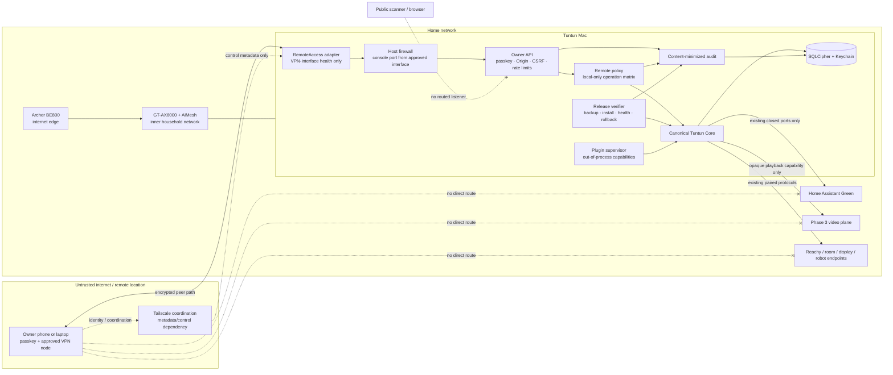

# Tuntun Phase 6 “Remote Access and Product Hardening” Architecture Specification

**Status:** design baseline complete; implementation plan ready; implementation not started
**Date:** 2026-08-27
**Scope:** opt-in owner VPN access, whole-platform security and privacy hardening, recovery, signed distribution, and an Apache-2.0 open-source beta
**Primary deployment:** one owner-managed household; the framework retains optional multi-owner adapters without enabling them for this home
**Depends on:** accepted Phase 1–5 release gates and their canonical identity, policy, memory, home, media, vision, desktop, and robotics contracts, including the canonical Phase 2 `SignedFeatureManifestRolloverChainV1` and `FeatureAuthorityLease`

## 1. Outcome

Phase 6 turns the household installation into a supportable, recoverable, and publishable local-first product without turning it into an internet service. Local operation remains the default. An owner may explicitly enable a VPN-only path to the existing owner console from enrolled personal devices; no router port-forward, public reverse proxy, public domain, public Home Assistant API, or unauthenticated remote endpoint is introduced.

Remote network membership is only the first boundary. The Tuntun console still requires its own passkey-authenticated session, exact-origin protection, authorization policy, and action-bound confirmation. Read-only health and alerts are the first remote capability. Camera playback and low-risk household actions remain separately gated. Recovery, identity enrollment, bulk deletion, key changes, restore, developer mode, household release installation, and the C0 household-candidate freeze remain owner-only local-presence operations. C1 approval/publication is a separate public-project ceremony: it uses an independently provisioned project-maintainer credential at a local release terminal and conveys no household authority, even when the same human is both household owner and project maintainer.

The phase also freezes stable public contracts, isolates the closed initial third-party extension surface, documents the complete threat and privacy model, produces signed and attested release artifacts, verifies install/upgrade/rollback/uninstall on clean systems, and proves that public source and diagnostics contain no household data. Tuntun stays useful locally if the VPN provider, internet, update service, or public repository is unavailable.

## 2. Locked decisions

| Area | Decision |
|---|---|
| Default remote state | Disabled; no remote listener, VPN client, subnet router, Funnel, tunnel, or public DNS dependency is required for local use |
| Household remote profile | Tailscale client-to-Mac access is the recommended first adapter because it needs no inbound router mapping and its Personal plan is currently available for non-commercial home use |
| Portable/open-source boundary | `RemoteAccessPort` is provider-independent, but Phase 6 implements and gates only the Tailscale adapter. Direct/self-managed WireGuard, relay and rendezvous profiles are deferred to a later explicit design; no Tailscale-only policy or identity enters the core |
| Public exposure | Public reverse proxies, Cloudflare Tunnel-style public hostnames, router port-forwarding, UPnP mappings, public Home Assistant access, and Tailscale Funnel are prohibited |
| Network reach | The default VPN policy exposes only the Tuntun owner-console origin on the Mac; it is not a whole-home subnet router and does not expose cameras, Reachy, Green, MZHUB, TVs, or router administration |
| Authentication | VPN device membership plus Tuntun passkey; neither replaces the other, and biometrics alone never authorize remote action |
| Remote privilege | Read-only health/alerts first; low-risk reversible actions and owner-only video playback require fresh scoped confirmation; recovery and high-impact administration remain owner-only and local-only |
| Camera access | Disabled remotely by default; if separately enabled, playback uses short-lived same-origin capabilities and never reveals RTSP/ONVIF credentials or camera URLs |
| Canonical authority | Mac-local Tuntun policy, identity, memory, audit, and keys remain authoritative; VPN/control-plane metadata is never canonical household state |
| Open-source deployment | Apache-2.0 core, household configuration excluded, the sole Phase 6 Tailscale adapter disabled until configured, provider-neutral port preserved without another implementation, simulator-first clean install |
| Extension model | First-party modules may remain in-process; the initial third-party extension surface is out-of-process and limited to the two signed, display-only, no-egress capabilities in Section 8. Third-party provider/device adapters are not part of the initial beta registry |
| Release integrity | Immutable versioned artifacts, checksum/signature verification, SBOM, build provenance, signed tags, dependency licences/notices, and verified rollback |
| macOS distribution | Developer ID signing and notarization are required for the public macOS package; unsigned developer builds are visibly non-production |
| Update policy | Owner-visible and owner-approved; pre-update encrypted backup, compatibility check, health gate, and atomic rollback; never silent |
| Telemetry | No external application telemetry by default; opt-in crash reports must be generated from content-safe fields and shown before transmission |
| Recovery | Owner-only encrypted portable backups plus an independently stored offline recovery key; quarterly owner restore drill; no provider key or VPN credential silently restored |
| Product administration | One owner for this household; the public schema can represent multiple owners, but enabling quorum/delegation requires a later explicit household policy |

### 2.1 Audited contract, topology, and evidence closure

- **One physical Mac and one ingress server:** the active canonical Tuntun Core host is the independently owner-approved opaque inventory target currently verified as Darwin arm64 and recorded in `docs/architecture/decisions/0001-phase1-host-baseline.md`; there is no second office laptop/helper. Architecture, model, product, and year observations are descriptive and never grant commissioning authority. The family-ready profile single-homes it on the inner GT-AX6000/AiMesh network with any direct BE800 link disconnected. An optional dual-home profile is a separately qualified feature with no forwarding, bridging, outer ingress, or ambient helper authority. Phase 6 extends the accepted Phase 3 owner-ingress server with listener class `owner_vpn_https`; Core and the media proxy own no TCP listener and no parallel HTTP server. Moving household deployment back to an Intel Mac requires fresh trusted owner approval plus opaque target-record/public-key-bound real-host qualification before it can carry live household or Tailscale evidence; Intel distribution support remains mandatory without making any model literal authoritative.
- **Canonical ingress and service digests:** Phase 6 extends the sole signed `ops/routes/owner-ingress-routes.v1.json`; it creates no parallel route manifest. Every owner-facing route is registered in Core `api/app.py`, supplied by `bootstrap/container.py`, matched by the owner-ingress router, and proven through installed listener→ingress→peer-authenticated Core/media UDS tests; unknown/disabled rows are 404 before dispatch. Because route/source bytes evolve across gates, the one canonical `phase3-owner-ingress.v1.json` row is deterministically rebuilt/re-signed at four checkpoints: Task 15 after the P6-1 graph and before its real seven-day pilot, Task 18 after the enabled/absent P6-2 graph, Task 29 after the P6-3 plugin/release graph, and Task 36A after Task 35A's final mutation and before the frozen build. Each checkpoint rejects the immediately preceding row/receipt against the changed graph, retains it only as a complete matching rollback set, and reruns installed dispatch, negative reachability, takeover, start/health/restart, update/rollback and applicable uninstall modes. Task 37A/38A then commit the remaining release tooling; Task 36B freezes the final bytes/rows before Task 34B's real maintenance epoch. Finalizer, Task 34B, Task 35R, U8B, Task 35B/P6-4, Task 36C, C0 and C1 consume only the post-Task-35A row. Likewise, adding sandbox/process/quota/cleanup modules invalidates the initial plugin-supervisor row; the same `phase6-plugin-supervisor.v1.json` is refreshed against the final wheel and the earlier row/receipt is rejected.
- **Continuous feature-manifest authority:** Phase 6 consumes, and does not duplicate, Phase 2's canonical `SignedFeatureManifestRolloverChainV1`, `FeatureManifestLeaseSupervisor` and per-admission `FeatureAuthorityLease`; the Core runtime never receives the acceptance signer. Every runner accepts that chain only through Phase 2's exact `--feature-manifest-chain PATH` interface; Phase 6 defines no alternate chain alias or file shape. Before any multi-day pilot, counted maintenance-eligibility window, soak, stress run, or final evidence collection, the complete externally signed pre-issued chain must hash-link in order, bind one frozen candidate and exact feature registrations, cover the complete planned wall-time interval, and install each successor before the predecessor expires. The earlier P6-1 pilot retains its own chronological candidate/chain receipt. For final acceptance, Task 36B first freezes one candidate; a single final-candidate chain then covers Task 34B's entire counted maintenance epoch and the later Task 36C campaigns. Task 35R refreshes all resilience drill evidence on those bytes, then U8B and Task 35B/P6-4 bind the same candidate, maintenance and post-drill state. Every admission and background-work iteration checks both the active manifest's wall expiry and its process-local monotonic lease. Missing, late, reordered, widened, rollback, signature-invalid, candidate-drifted, or expired current/next authority closes affected admission and background work before preparation or I/O, invalidates the campaign, and enters the existing controlled whole-composition recovery path. Maintenance observations during a closed-authority interval remain recorded but cannot count toward day 60, day 90 or a promotion bucket; controlled recovery starts a new frozen candidate, steady-state generation and eligible window. P6-1, Task 34B, Task 35R, U8B, Task 35B, the final Task 36C campaigns, C0, and final handoff evidence bind the chain/candidate commitments and require zero expired-authority interval where the chain governs elapsed work; no Phase 6 runner signs, renews, substitutes, or silently extends a manifest. After Task 36B, any source, route, service-row, lock, workflow, schema, package or release-artifact mutation invalidates the final evidence sequence.
- **Sole VPN admission authority:** Tailnet Lock must be enabled, the current Core `nodekey:` must be signed, the exact signed-node set and stable lock-status v1 `Head`/`State` must match commissioning, and recovery must prove at least two distinct trusted `tlpub:` signing keys. `Head` is the provider's exact 52-character unpadded RFC 4648 base32 BLAKE2s AUM hash—not a SHA-256 digest. The official surface does not expose lock or signed-node “generation” fields, so Tuntun allocates those generations durably from the exact commissioned Head/State/trusted-key/recovery and signed-node commitments; it never invents provider fields. A generation remains usable only while two complete provider projections and the commissioning receipt are unchanged. Recovery KDF evidence is local ceremony evidence anchored to that authority epoch, not a field fabricated from runtime status. Each attempt first commits a separate durable monotonic probe generation; the route controller atomically accepts only a strictly newer generation and suspends on any failure, so restart, replay or a delayed older success cannot replace a newer failure. If generation allocation itself is unavailable, an independent fail-closed lane closes the route and sessions without fabricating a generation. Tailscale Device Approval is disabled by separately signed provider-policy evidence and is mutually exclusive with this admission model. Either both mechanisms enabled, Device Approval enabled alone, an unsigned/extra/revoked or filtered node, one or duplicate signer, changed Head/State, stale local generation, recovery mismatch, partial snapshot, timeout or parse uncertainty suspends the route.
- **Bounded provider posture ingress:** under one five-second process-shared single-flight budget, the adapter reads two complete bundles of the pinned official client's `status --json`, stable `lock status --json` v1, `get --json all`, `serve status --json`, and `funnel status --json`. Every command has an at-most-two-second max-plus-one reader (256 KiB for status/lock/preferences; 64 KiB for Serve/Funnel), no shell, a fixed binary digest and empty nonessential environment. Structured concurrency cancels and reaps every sibling process if one fails. Exact bytes pass through the shared duplicate-safe parser before an allow-list projection that discards identity/address/metadata fields; the two minimized projections must be byte-equivalent. Invalid UTF-8, duplicates/non-finite or excessive numbers/depth/containers/structure, wrong roots, missing fields, unsupported no-config response, timeout and client failure produce only a short-lived typed `not_configured` or `unavailable` result. They register no route, retain no prior healthy posture and never trigger a fallback provider. Sanitized golden outputs and a fresh live capture from the pinned official client on the active approved Core Mac are a blocking gate; synthetic success cannot enable the adapter. Intel live capture is required only if the household target transitions back to Intel.
- **Canonical provider policy:** the only positive policy form is a current Tailscale `grants` document with a closed `tagOwners`, one canonical Tailnet IPv4 `src` for each exact approved owner node, the separate exact `dst: ["tag:tuntun-core"]`, and `ip: ["tcp:8443", "tcp:53", "udp:53"]`. Email, group, autogroup, and tag principals are forbidden as positive grant sources because they can select another device; they are represented only by the separately typed tag-owner policy, whose selectors are unique, at most eight, and at most 128 UTF-8 bytes each. The pinned official parser/check command and built-in policy tests must accept its canonical digest. Legacy `acls` documents/artifact names, port-suffixed `dst` selectors, hostname destinations, wildcard or broad-principal source, wildcard destination/port, untagged Core, subnet/exit/Funnel/Serve/SSH, or provider digest drift fail closed. Exact addresses remain owner-local and public evidence contains commitments only.
- **Two-view authoritative DNS:** the WebAuthn RP ID and sole record/SAN are `tuntun.home.arpa`. A commissioned LAN client receives only the exact commissioned LAN IPv4 address; an approved Tailnet node receives only the exact commissioned Tailnet IPv4 address. An unprivileged authoritative-only parser receives sockets from `launchd` on only those addresses for TCP/UDP 53. Recursion, dynamic update, AXFR, any other name/zone, wildcard, AAAA/IPv6, wrong source/listener/view, rebinding, cross-view cache reuse, and TCP truncation bypass are denied. One commissioning receipt binds both listener/answer addresses, record/TTL/client acceptance, local CA/SAN, and grants-policy digest.
- **Server-authoritative requests:** external `RemoteOperationRequestV1` JSON contains only `operation`, `resource`, and `idempotency_key`. The owner-ingress server preserves the exact body bytes and applies the shared bounded duplicate-safe canonical parser before framework decoding, session lookup or application I/O; the generated TypeScript client must match the Python RFC 8785/JCS golden corpus. Every client-visible opaque resource ID is random and deliberately unequal to its canonical target identifier. The server resolves the HttpOnly cookie plus current owner/session/node posture/resources/generations into server-only `AuthorizedRemoteContextV1`; policy, storage, action, private-detail, and media ports accept that context. Invalid UTF-8/JSON/canonical form, former client actor/session/node/policy/generation/assurance/time/commitment fields, and expired, replayed, or one-field-mutated opaque mappings are rejected before registry, database, adapter, action, media or audit-body I/O.
- **Closed privacy names:** memory audiences are exactly `subject_private`, `guardian_child`, `household_adults`, and `household_all`; `owner_self`, `adult_subject`, `guardian_for_child`, and `household_shared` are principal scenarios, never audience values or aliases. Every record binds the exact subject, audience generation, and the guardian/consent/child-safe approval generations required by that audience. Remote private detail is only the authenticated owner's own `subject_private` body. Owner-not-subject, cross-subject, and legacy audience aliases remain opaque. The shared permanent denial registry uses real identifiers, including `plugin_permission_change` and `recovery_key_import`; aliases such as `plugin_permission` and `recovery_import` are schema-unsupported.
- **Health and plugin truth:** every projected plane/component fact carries its own source generation, observation time, validity deadline, and commitment; component classes and attention codes are unique, the fact window covers the complete five-second snapshot, and the supervisor verifies the exact current source generation both before child invocation and after child return. A fresh wrapper cannot freshen stale, expired, duplicate, or superseded source data. The exact two-entry registry, plugin manifest, authenticated supervisor call/result frames and child stdin/stdout each have a fixed byte ceiling and use the shared duplicate-safe canonical parser before field access; detached signatures bind the exact registry/manifest bytes. Expected registry/admission faults block all capabilities or return `deny` with zero child launches; expected faults for a valid admitted call return a supervisor-authenticated `error_safe` result with no payload. The supervisor selects its codec out of band from the verified registry and sends the child only the exact payload bytes. No request/grant/commitment/plugin/version/capability/codec/registry metadata enters the child.
- **Backup, restore, and release:** attached and independent backup tiers bind identical source snapshot/archive digests, deletion generation/watermark, key-bundle commitment, generation, RPO deadline, and restore eligibility while remaining distinct failure domains. D4 restore has `network=none`. A live-system-unavailable, one-shot offline bootstrap may only verify, decrypt into quarantine, and quarantine; recovery then creates a new passkey generation and revokes every prior credential generation before phase reconciliation. Reconciliation progress never means feature enablement: the exact source feature-manifest digest and all optional absences are preserved, while effect routes remain closed until each previously enabled feature independently proves its current binding and generation. Release and publication verifiers read exact nofollow-bounded manifest and detached-signature files with independent max-plus-one ceilings, apply the shared duplicate-safe canonical parser, compare the exact digest and verify the fixed-domain signature before consulting a field; every expected raw, signature or binding fault returns a closed denial and performs no update/upload. After accepted C0 and the seven-day soak, the isolated maintainer terminal allocates one C1 UUID, signs/fsyncs an at-most-24-hour publication manifest with that UUID, and builds C1 from that exact immutable descriptor; it never generates a second candidate ID. Publication is a two-call local terminal ceremony: preparation reloads the accepted C1, candidate and immutable manifest and creates a two-minute action binding candidate, accepted-C1 commitment, both manifests, artifact-set/inventory and immutable tag; the canonical action bytes are the WebAuthn challenge. Execution and the uploader recheck the exact pending action and current bytes before assertion consumption and immediately before the first write. Cross-candidate use, mutation, replay, expiry or post-prepare drift performs no upload, and ambiguous reconciliation needs a new exact action/assertion without overwrite. The in-process release verifier produces a Core-HMAC-authenticated, at-most-five-minute decision bound to the exact update run, candidate ID, canonical manifest digest, artifact-set ID and artifact-set commitment; the updater checks the prepared, staged, decision and journal identities plus current validity before readiness backup, before drain, and once more immediately after the restore-set CAS before code switch, then journals the positive decision for restart verification. Updates use an early eligibility-only readiness backup, close authoritative admissions, drain writers and capture one quiescent update-run/candidate/admission-barrier/source/deletion/feature-generation-bound atomic restore set for code plus schema/data. Its attach CAS must still match the held global snapshot gate. A fixed-domain signed non-self-referential durable fsync/rename/fsync-parent journal, monotonic timestamps and CAS-ordered transitions protect recovery. A typed recoverable live-process failure is fsynced and immediately handed to the same reconciler under the held global lock; a final durable-state check reopens write admission only after terminal reconciliation, while handler failure leaves it closed for startup. Release ordering is build/SBOM/provenance, sign/notarize/staple, hash the exact final bytes, then sign the manifest/C1 inventory. C1 and publication must reuse the exact C0 artifact-set and named-inventory digests; rebuilding or changing one byte returns to C0.
- **Prepared publication and tag chronology:** one composite `PreparedPublicationStore` durably owns the descriptor, detached signature and exact manifest and remains the sole reader for C1 build, action preparation, publish, uploader revalidation and restart; there is no second store or copied authority. Before C1, evidence proves only that the intended tag is exactly `v{version}`, absent at the exact repository and governed by create-only/no-overwrite policy. Manifest preparation, action preparation and execution accept only absence or an exact tag owned by the same accepted-C1 incomplete journal; the uploader atomically creates rather than replaces an absent tag and independently verifies the final tag target plus every downloaded byte. An unowned/mismatched pre-existing tag, create race or retargeted tag yields no receipt, while a lost response for the exact owned tag is reconciled without a second create. The two-minute assertion must be claimed before expiry into one durable exact-byte `PublicationEffectRun`; work may finish after assertion expiry only in the half-open interval `authority_claimed_at <= published_at < operation_deadline <= authority_claimed_at + 30 minutes`, and expiry before claim or reaching the deadline permits no write. Failure before C1 acceptance leaves C0-only state; failure after accepted C1 but before a receipt preserves the accepted-C1 history and only the exact immutable incomplete run may reconcile. Later source/artifact/C0 drift invalidates eligibility without erasing history or permitting C1 reuse for changed bytes. Only signed `PublicationReceiptV1` and P6-5 may claim the tag was created without overwrite and verified against the exact source commit.
- **Evidence identities and ceremonies:** public x86_64/arm64 build smoke is collect-only. Every Mac compatibility claim needs a current real-hardware `MacTargetReceiptV1` bound to an opaque commissioned inventory record, target-held public key, unique receipt ID, actual architecture/OS/final-artifact digest, and install/update/rollback/both uninstall modes; descriptive model/product/year values cannot satisfy the binding. Every enabled signed Linux service target needs a current `LinuxServiceTargetReceiptV1` binding its target kind (`systemd|compose|reachy_managed_app`), exact final distribution/job-or-unit/config/service-row digests and clean install/start/health/crash-restart/wrong-account/update/rollback/both-uninstall/residue gates; disabled targets have neither production artifacts nor receipts. C0 approval/rejection/acceptance uses the household-owner credential namespace; a distinct fresh household assertion signs the short-lived C0 public handoff; C1 approval/rejection/acceptance uses the project-maintainer C1 namespace; the third publication assertion uses a distinct project-maintainer publication namespace at the separate local release terminal and signs the exact short-lived `PublicationActionBindingV1` challenge. Household UI exposes read-only C1 state only and cannot import or invoke maintainer authority.
- **Migration topology:** the sole core graph extends the accepted Phase 4 head exactly as `0019_screen_time_real_adapter -> 0020_private_ai_registry -> 0021_desktop_authority -> 0022_robotics -> 0023_remote_access -> 0024_plugins_releases -> 0025_recovery_incident_maintenance`. The private knowledge catalog uses its own Alembic configuration/version table and exact feature graph. Hidden fork/merge/orphan/extra head, wrong edge, edited applied revision, cross-table head, or downgrade authority resurrection blocks startup and restore.

## 3. Scope boundaries

### 3.1 Included

- Provider-independent VPN state, enrollment, posture, revocation, and health ports.
- A Tailscale household adapter behind the provider-independent `RemoteAccessPort`.
- Split DNS/local-CA access to the existing stable console origin over the VPN.
- Remote read-only status, alerts, approval inbox, and content-minimized audit views.
- Separately gated low-risk household actions and owner-only camera playback.
- Whole-platform service inventory, network exposure map, threat model, privacy design, risk register, and incident runbooks.
- Out-of-process plugin/skill contract with a deny-by-default capability manifest.
- Reproducible dependency locking, licence inventory, SBOM, provenance/attestation, signing, notarization, and immutable releases.
- Clean install, upgrade, rollback, uninstall, device retirement, backup, restore, compromise recovery, and disaster-recovery evidence.
- Public simulator, synthetic fixtures, contribution guide, security policy, disclosure process, code of conduct, and support boundaries.
- Security, privacy, fault-injection, compatibility, and long-duration release gates spanning all six phases.

### 3.2 Explicitly excluded

- A SaaS-hosted Tuntun control plane or cloud-hosted canonical family memory.
- A public web application, public webhook receiver, public REST API, public camera URL, or internet-facing Home Assistant instance.
- Remote identity enrollment, biometric calibration, recovery-key display/import, database restore, bulk/profile deletion, developer-mode activation, root shell, or release signing.
- Tailscale SSH or arbitrary remote shell as a Tuntun product capability.
- Unrestricted remote LAN access through a subnet router.
- Direct/self-managed WireGuard, home UDP listeners, router port-forwarding, and self-managed relay or rendezvous infrastructure. These require a later threat, privacy, availability, key-lifecycle, and operations design and cannot be enabled through Phase 6 configuration.
- Silent mobile-device management, remote microphone/camera activation, remote Raspbot driving, or remote desktop execution.
- Automatic publication to a package registry from an unreviewed commit.
- A claim of strong VLAN isolation on the current BE800/GT-AX6000/AiMesh equipment until the exact firmware passes the segmentation gate.
- Enterprise multi-tenant hosting, billing, shared cloud accounts, or centralized household analytics.

## 4. Alternatives and recommendation

| Approach | Advantages | Costs and risks | Decision |
|---|---|---|---|
| Tailscale node on owner device and Mac | No router port-forward; peer-to-peer WireGuard data plane; Tailnet Lock plus canonical `grants` policy support the closed signed-node profile; low owner maintenance | Tailscale identity/control plane is a third-party dependency; policy/pricing may change; metadata and availability are not fully local | **Recommended household adapter**, opt-in and replaceable |
| Self-managed WireGuard peer/server | Open protocol, no provider account, complete key and control-plane ownership | Key distribution, NAT reachability, relay/rendezvous, revocation, backups, mobile configuration, and monitoring need a separate design; a direct home listener would violate the no-forward Phase 6 boundary | **Deferred outside the six-phase scope**; the Phase 6 binary and configuration expose no such route |
| Public reverse proxy/tunnel | Convenient browser access and certificates | Creates an internet-reachable application surface, increases account/token dependence, complicates WebAuthn/origin security, and contradicts the chosen boundary | Rejected |

The recommendation is not “trust the VPN.” It is a layered path: approved VPN device → Mac firewall/VPN-interface allowlist → pinned local HTTPS origin → Tuntun passkey session → current policy → exact action confirmation. Removing any layer makes the remote route unavailable rather than falling back to public or password-only access.

## 5. Architecture and trust boundaries



### 5.1 Deployment invariants

- Local Tuntun, Home Assistant, camera recording, room voice, displays, and approved automations do not depend on VPN availability.
- The VPN adapter has no database key, memory access, provider key, camera credential, or Home Assistant authority. It reports only approved-node reachability and interface state.
- Tuntun never accepts an identity asserted only by a VPN username. The application actor comes from its own passkey-authenticated owner session.
- The Tailscale control plane is a coordination/identity dependency, not a recipient of Tuntun application bodies. A future policy/terms change can disable the adapter without changing core data.
- The canonical Tailscale `grants` policy permits only the canonical Tailnet IPv4 address of each exact approved owner node as `src` to reach the separate `dst: ["tag:tuntun-core"]` with `ip: ["tcp:8443", "tcp:53", "udp:53"]`. A same-account second device is not selected. Email, group, autogroup and tag principals are forbidden in `src`; the separately typed `tagOwners` map has closed ownership. There is no port-suffixed or wildcard destination, subnet route, or hostname destination.
- Tailnet Lock, the current signed Core node, the exact current signed-node set, and at least two independent recovery signing nodes are verified before remote access leaves commissioning. Device Approval is explicitly disabled; enabling it or both mechanisms together is a configuration error.
- Funnel, Serve-to-public, exit-node routing, subnet routing, and Tailscale SSH are absent from the release profile and checked continuously.
- Provider portability is an interface property, not a second enabled route. Phase 6 contains no direct-WireGuard listener, router mapping, relay/rendezvous service, configuration switch, or test exception; a future adapter must receive its own approved design before code is shipped.

## 6. Component catalogue

| Component | Responsibility | Interfaces and data owned | Security/failure boundary | Build/buy |
|---|---|---|---|---|
| `RemoteAccessPort` | Normalize VPN node/interface health, enrollment and revocation state | `RemoteNodeState`, `RemoteRouteState`; no family content | Failure removes remote reachability only | Build narrow port |
| Tailscale adapter | Read local client state and verify expected policy posture | Local Tailscale CLI/socket projection; hashed node identity mapping | Third-party control-plane outage never opens another route | Buy/use official client behind adapter |
| Host exposure guard | Enforce listener/interface/source/port allowlist and detect drift | Exposure manifest and scan receipts | Drift closes remote route and blocks release | Build verification around OS firewall |
| Remote policy | Decide which operation may be performed remotely | Closed operation matrix, local-presence evidence, passkey assurance | Unknown operation or state denies | Build in canonical policy service |
| Session/auth service | Passkey, exact origin, CSRF, nonce, expiry and reauthentication | Existing Phase 1 credential/session records | VPN membership alone creates no session | Extend existing service |
| Media capability broker | Issue short-lived same-origin playback capabilities | Opaque clip ID, scope, expiry, single-use state | No reusable URL/credential reaches browser | Build; reuse Phase 3 proxy |
| Plugin supervisor | Launch, attest, constrain and stop the closed initial third-party extension set | Signed manifest, exact two-capability registry, fixed DTOs and resource limits | Untrusted process cannot import core modules/keys, persist data or reach a network | Build minimal supervisor |
| Release verifier | Verify artifact, provenance, signer, schema and rollback compatibility | Release manifest, hashes, signatures, SBOM reference | Any ambiguity preserves prior release | Build; use standard signing/attestation tools |
| Backup/recovery service | Portable encrypted backup, verification, restore quarantine, key rotation | Existing encrypted archive slots and recovery receipts | Restore cannot reopen action routes until reconciliation | Extend existing service |
| Incident coordinator | Enter containment modes and guide evidence-safe response | Incident state/reason/timestamps, no family bodies | Local privacy/safety paths remain available | Build small state machine |
| Public documentation/tooling | Simulator, install, contribution, security and support artifacts | Synthetic fixtures only | Private-data scanner blocks publication | Build/project-owned |

## 7. Remote policy and session contracts

### 7.1 Remote session

```text
remote_session.v1
  session_id
  actor_subject_id
  vpn_adapter_id
  vpn_node_pseudonym
  tailnet_lock_generation
  signed_node_set_generation
  application_passkey_assurance
  established_at
  last_reauthenticated_at
  last_access_at
  absolute_expires_at
  idle_expires_at
  allowed_operation_classes
  operation_class_generation
  policy_version
  revocation_generation
```

The VPN node pseudonym is a random local mapping, not the vendor node name or user email. The closed operation-class values are `read_only_status`, `private_detail`, `light_power`, `media_stop`, `camera_metadata`, and `camera_playback`; every session includes `read_only_status`, while each other value is separately locally enabled. A session expires after fifteen minutes idle or eight hours absolute, whichever occurs first. `last_access_at` advances only after a serialized, currently authorized request admission and slides `idle_expires_at` to at most fifteen minutes after that access and never beyond the absolute expiry; ordinary access never changes `last_reauthenticated_at`. Camera playback, memory content, approvals, and any mutation require an actual passkey ceremony no older than five minutes. A server context with `last_reauthenticated_at > authorized_at` is invalid, and a wall-clock rollback cannot make stale assurance fresh. Enabling, disabling or changing an optional operation class increments `operation_class_generation`, revokes older sessions, and exposes the new closed class set only through a fresh passkey-authenticated session. Revoking the VPN node, passkey, owner session, or remote-access policy generation invalidates every associated session immediately.

External `remote_operation_request.v1` has exactly three fields: a closed operation discriminator, an optional `OpaqueRemoteResourceRefV1`, and an idempotency UUID. The opaque resource is only a bounded type plus random local opaque ID that is never equal to or derived from the canonical target; it is not a canonical target, desired state, binding, generation, or authority claim. Light intent is split into exact operations `light_power_on` and `light_power_off`, which the server maps to `light.set_power.v1` with fixed `on=true|false`; `media_stop` needs only an opaque `media_player` reference. The server resolves the resource after authenticating the HttpOnly session and current signed-node posture, then creates `AuthorizedRemoteContextV1`. Client fields named `target`, `desired_state`, actor/session/node/policy/generation/assurance/time/commitment, unknown resource type, or an expired, replayed, or one-field-substituted opaque mapping fail before downstream lookup or I/O.

### 7.2 Operation matrix

| Operation | Remote default | Additional requirement |
|---|---|---|
| Health, phase/device availability, content-minimized alerts and cost | Allow | Approved VPN node plus active passkey session |
| Approval inbox metadata | Allow | Bodies remain concealed until fresh passkey |
| View exact approval or owner-private memory | Disabled initially | Owner enables class locally; fresh passkey; subject/audience policy |
| One reversible allowlisted light/media stop action | Disabled initially | Local enablement; fresh passkey; exact per-action confirmation; ordinary Phase 2/4 policy |
| Camera event metadata | Disabled initially | Local enablement and fresh passkey |
| Camera clip playback | Disabled initially | Local enablement; owner-only; fresh passkey; ten-minute single-clip remote media session whose per-request Phase 3 request/grant expires at the earliest of five seconds, outer media-session expiry, and current authorized-context expiry; `no-store` |
| Export/download | Deny | Local-only |
| Identity/biometric enrollment or calibration | Deny | Local physical ceremony at Reachy |
| Profile, guardian, base policy, provider, budget hard cap, bind mode or plugin permission change | Deny | Owner-only local console with action-bound passkey |
| Backup-key display/import, restore, bulk/profile deletion, audit-key rotation | Deny | Owner-only local recovery ceremony |
| Developer mode, remote shell, desktop execution or Raspbot driving | Deny | Not a remote product capability |

An allowed remote action still traverses the ordinary action registry, topology/binding freshness, risk classifier, idempotency, controller epoch, and downstream adapter. Remote status never upgrades an identity result or bypasses child, Guest, device, room, time, or privacy policy.

### 7.3 Remote route state machine

```text
DISABLED -> COMMISSIONING -> READ_ONLY -> SCOPED_ACTIONS
any state -> SUSPENDED -> DISABLED | prior approved state
```

- `DISABLED` exposes no VPN route and ships as the default.
- `COMMISSIONING` accepts only a local owner workflow and test client; no household data is shown.
- `READ_ONLY` is the first production state.
- `SCOPED_ACTIONS` exists only after the read-only soak and local approval of enumerated operation classes.
- Lost device, grants-policy drift, Tailnet Lock failure, impossible signed-node state, stale client, DNS/firewall/certificate drift, repeated authentication failure, or owner action enters `SUSPENDED`.
- Re-enabling after compromise rotates the application revocation generation and every affected credential; it never resumes old sessions.

### 7.4 Cross-phase amendments

Phase 1 intentionally permits only localhost or paired private-LAN console access. Phase 6 adds one versioned exception, `owner_vpn_console_v1`, which is valid only while the complete layered route in this section is healthy. It does not broaden the public bind rule, WebAuthn trust, CORS, origin, CSRF, session, passkey, privacy, audit, export, or mutation controls. A VPN interface is an explicitly configured private interface; it is never treated as permission to bind `0.0.0.0` or an unclassified interface.

Phase 2 and later action registries add `remote_origin_v1` as an assurance-reducing context, never an authority boost. A locally permitted action can still be remote-denied; a locally denied action can never become remote-allowed. Home Assistant receives no VPN identity or route metadata. Phase 3 media gains only the opaque capability path described above, and Phases 4–5 expose no direct endpoint/desktop/robot remote control.

Privacy Shield gains a remote-session revocation effect but preserves its truthful two-plane camera behavior: it ends Tuntun application access and capture while the separately controlled Reolink recorder continues. These amendments must be present in the shared policy corpus, API schema, owner UI, audit schema, negative-reachability suite, backup/restore rules, and release feature manifest before P6-1 can pass.

## 8. Stable public contracts and plugin isolation

### 8.1 Contract policy

- Public contracts use semantic versioning and strict schemas. Unknown fields and unknown major versions fail closed.
- A released major contract remains supported for the current stable release and one documented migration release. Security fixes may remove an unsafe capability only with a migration and advisory.
- Canonical domain objects never cross a plugin boundary. Plugins receive purpose-specific DTOs with pseudonymous IDs and minimum fields.
- Core-to-plugin calls have size, time, rate, memory, CPU, network, and concurrency budgets. A timeout cancels authority; a late result is discarded by correlation/generation.
- A plugin result is untrusted input. The child emits only canonical bounded bytes for the exact display-only render DTO selected by the initial registry; the trusted supervisor applies the shared duplicate-safe parser before validation, binds that DTO to the admitted call, and is the sole creator of the P-256-signed result envelope returned to Core. Its service account alone can use the non-exportable signing key; Core pins only the public verifier, signer identity and key generation and cannot create an envelope. Invalid/late/crashed child output after admission becomes an authenticated `error_safe` result with no payload and cannot suppress the core surface. Preadmission, transport, malformed-envelope or signature failure is a distinct Core-local unavailable outcome, never a fabricated supervisor result. No signing key or trusted outer field enters the child. The registry never accepts an authorization, audit verdict, observation, proposal, memory commit, policy change, target, URL or downstream credential.

### 8.2 Plugin manifest

```text
plugin.manifest.v1
  plugin_id
  version
  publisher
  artifact_digest
  signature_identity
  protocol_major
  capability_registry_revision = "phase6.initial.1"
  entrypoint
  requested_capability_ids[]
  licence
  sbom_digest
```

The manifest requests identifiers only. A publisher cannot declare or relax purpose, DTO, actor, consent, sensitivity, retention, storage, egress, DNS, redirect, cleanup, or resource policy. Those rules live in the signed Tuntun capability registry and are fixed by the platform release. Production refuses an unsigned or digest-mismatched plugin, a capability absent from the registry, an unknown registry revision, or a manifest that contains a policy-like field not shown above.

### 8.3 Closed initial capability registry

The public Phase 6 beta implements exactly these two third-party capability IDs:

1. `system.health.render.v1`
2. `notification.local_alert.render.v1`

Every other identifier—including speech, audio, transcript, identity, biometric, memory, media, camera, file, document, device-command, Home Assistant, desktop, robot, arbitrary network, external-notification, and generic execution access—is unknown and denied. A new capability requires a reviewed registry revision, schema and privacy amendment, negative-reachability tests, and a new signed release; it cannot be introduced by manifest text or household configuration.

`system.health.render.v1` receives only:

```text
plugin_health_snapshot.v1
  request_id
  purpose = "owner_local_health_render"
  issued_at
  expires_at                 # no more than 5 seconds after issued_at
  components[0..16]
    component_class          # core | voice | identity | memory | automation |
                             # video | media | desktop | robot | storage | remote
    state                    # available | degraded | unavailable | disabled
    freshness                # current | stale | unknown
    source_generation
    observed_at
    valid_until
    fact_commitment
    attention_codes[0..7]    # backup_stale | storage_low | credential_expiring |
                             # unexpected_exposure | privacy_control_failed |
                             # safety_input_disabled | update_pending
```

It may return only:

```text
plugin_health_render.v1
  request_id
  headline                   # plain UTF-8 text, at most 160 characters
  items[0..16]
    component_class          # same closed enum as the request
    label                    # plain UTF-8 text, at most 160 characters
```

The result is rendered in a labelled, isolated **third-party plugin** panel. Markup, URLs, images, actions, hidden text, bidi control characters, and model/memory/tool ingestion are prohibited. Core health and warning surfaces remain authoritative.

`notification.local_alert.render.v1` receives only:

```text
plugin_local_alert.v1
  request_id
  purpose = "owner_local_alert_render"
  alert_code                 # backup_failed | storage_low | unexpected_listener |
                             # privacy_stop_failed | audit_integrity_failed |
                             # credential_expired | unsigned_component |
                             # robot_safety_input_disabled
  severity                   # warning | critical
  occurred_at
  expires_at                 # no more than 5 seconds after occurred_at
```

It may return only:

```text
plugin_local_alert_render.v1
  request_id
  title                      # plain UTF-8 text, at most 80 characters
  body                       # plain UTF-8 text, at most 240 characters
  accent                     # amber | red
```

This result is an optional local-console presentation beside the mandatory core-rendered alert. It cannot suppress, downgrade, acknowledge, close, forward, or replace the core alert. Markup, URLs, images, actions, hidden text, bidi control characters, and model/memory/tool ingestion are prohibited.

The platform-enforced policy for both capabilities is frozen as follows:

| Policy dimension | `system.health.render.v1` | `notification.local_alert.render.v1` |
|---|---|---|
| Eligible actor and invocation | A locally present owner with an active Tuntun passkey session explicitly invokes the plugin panel | The local core may invoke after generating one listed alert, but only while the owner-approved capability installation is active |
| Consent and guardian rule | Local owner installs and approves this exact capability with an action-bound passkey; each render also requires an explicit owner click. Adult partner, guardian, child, Guest, remote session, plugin and maintainer cannot grant or invoke it | Local owner installs and approves this exact capability with an action-bound passkey. The owner is shown that listed alerts may render automatically; no per-alert prompt is required. Adult partner, guardian, child, Guest, remote session, plugin and maintainer cannot grant it |
| Sensitivity ceiling | Internal operational status only; no subject, household, device, network, cost, content, timestamp history, identifier or free-form core text | Confidential operational alert class only; no subject, household, device, network, content, stable identifier or diagnostic detail |
| Retention and storage | Fresh sandboxed process per call; no writable mount; five-second execution deadline; request/result destroyed on return, timeout or cancellation and always by `expires_at`. Core keeps only plugin ID/version/digest, capability ID, random request ID, outcome and latency in the 180-day encrypted audit plane | Same ephemeral/no-write rule. There is no plugin queue. Request/result are destroyed on return, timeout or cancellation and always by `expires_at`; the authoritative core alert is not plugin-owned and is unchanged. The same content-minimized 180-day invocation receipt is retained |
| Egress, DNS and redirects | All network syscalls denied; no egress broker, DNS resolver, URL field or redirect handling is exposed | All network syscalls denied; no egress broker, DNS resolver, URL field or redirect handling is exposed. External notification delivery is not an initial plugin capability |
| Revocation and cleanup | Increment plugin grant generation; cancel the call; close IPC; terminate the process; invalidate outstanding request IDs; erase the per-call sandbox; preserve only the audit receipt | Same, and any pending presentation is dropped without changing the authoritative core alert. Removal cannot delete or acknowledge the core alert |

Third-party plugins run as fresh processes under a dedicated unprivileged account and an enforceable process sandbox, communicate through one authenticated Unix-domain socket, and receive no inherited environment secrets. They cannot mount or open the Tuntun database, Keychain, camera store, Home Assistant configuration, SSH keys, source repositories, family backup directory, user home directories, removable volumes, or network sockets. The trusted supervisor chooses `canonical_json_v1` out of band from the signed registry and passes the child only the exact untrusted payload bytes; request/grant/commitment/plugin/version/capability/codec/registry metadata is absent from stdin, argv, environment, and filenames. The supervisor enforces the registry-signed schema, five-second wall-clock deadline, one concurrent request per plugin, 128 MiB memory ceiling, 50% of one CPU core, a 64 KiB combined request-plus-response ceiling, expiry and grant generation before and after the call. A sandbox, quota, schema, cleanup, or negative-reachability failure blocks the plugin feature and the Phase 6 release; there is no production developer-mode exception.

Revocation closes the process, IPC endpoint, grants and outstanding requests immediately. Removal performs the same revocation, erases the plugin binary and empty sandbox, and leaves only the content-minimized audit receipt. Because the initial registry gives plugins no persistent storage, raw network access, DNS, redirects or arbitrary data DTOs, there is no publisher-controlled cache, retention setting or outbound allowlist to trust or clean up.

## 9. Supply-chain and release architecture

### 9.1 Source controls

- The public repository has protected default branch, required CI, secret/private-data scanning, dependency review, signed commits or verified merge provenance, and immutable release tags.
- Workflow actions and build dependencies are pinned by immutable digest/commit, not floating tags.
- Pull requests from forks receive no production, signing, notarization, provider, VPN, or household secret.
- Generated fixtures and screenshots pass the family-data scanner. Real household logs, memories, biometrics, videos, configuration, IP/MAC addresses, certificates, receipts, and evidence bundles are forbidden.
- Maintainer and release accounts use phishing-resistant MFA/passkeys; their project-signing/account recovery material is offline and tested and never contains or grants household recovery authority.

### 9.2 Build and publication

- CI produces deterministic lockfiles, tests, licence notices, an SPDX SBOM, and SLSA provenance/attestation. These pre-signing outputs are not the final distributable checksum inventory.
- Public GitHub artifact attestations use Sigstore-backed provenance and are independently verified before publication. The initial target is SLSA Build Level 2; a reusable isolated build workflow may raise the target after separate assessment.
- Release order is strict: first commit all maintenance/P6-4/U8A, release, campaign, C0, C1 and publication tooling, including the final owner-ingress row; then build and bind SBOM/provenance, Developer-ID sign/notarize/staple, freeze and stream-hash the exact final distributable bytes, sign `ReleaseManifestV1`, and qualify real targets. Only after that immutable boundary may the real 60-/90-day maintenance epoch begin; Task 35R then refreshes resilience evidence, U8B and P6-4 accept the post-drill state, and the final threat/stress/soak campaigns, C0 and C1 follow without another tracked or artifact change. Any earlier checksum, manifest, maintenance month or gate receipt is pre-freeze evidence and cannot authorize release.
- Release artifacts are bound to the exact source commit, workflow identity, dependency lock, SBOM, acceptance-evidence digest, feature manifest, compatibility manifest, and final post-staple bytes. Independent re-download streams and hashes those same immutable bytes; one changed byte denies.
- Every `ReleaseManifestV1.artifact_digests` member is a closed `NamedArtifactDigestV1`: basename-only artifact name, safe relative POSIX path whose final component exactly matches that name, SHA-256 digest, positive byte length capped at 8 GiB, closed media type, and executable flag. A manifest contains 1–64 artifacts with unique names and paths; absolute paths, traversal, empty segments, duplicate aliases, unbounded media types, and unnamed digest lists are rejected before signature or provenance verification.
- macOS packages use hardened runtime where applicable, Developer ID signing, Apple notarization, stapling, and Gatekeeper validation. Public pinned x86_64/arm64 build-and-launch smoke receipts are collect-only. Each advertised Mac architecture/OS/final-artifact tuple needs its own current `MacTargetReceiptV1` from real hardware. Each enabled Linux service target needs an exact signed `LinuxServiceTargetReceiptV1`; `CompatibilityManifestV1` binds both sets plus the signed feature/service-inventory digests and rejects a missing, extra, cross-artifact or disabled-target receipt.
- Reachy, Home Assistant integration, room/display nodes, and robot packages have their own manifest and compatibility matrix; one component cannot be substituted under another component’s signature.
- Publication is a manual project-maintainer action at the local release terminal after the release gate. The project credential has no household authority, and CI cannot publish a household candidate merely because tests pass.
- A published asset is immutable. A defect produces a new version and advisory, never an overwritten binary.

### 9.3 Update and rollback

1. Check current mode, disk, keys, backup recency, plugin state, and device compatibility.
2. Download to an unprivileged staging directory with strict size/type limits.
3. Verify artifact digest, signature/attestation, repository/workflow identity, release channel, version monotonicity, SBOM policy, and manifest; prepare the exact candidate/manifest/artifact-set review identity.
4. Show security notes, feature changes, migrations, data/egress changes, and rollback limits.
5. Require local owner approval bound to that exact prepared identity; remote update installation remains unavailable.
6. Re-stage and reverify the exact approved candidate, authenticate the short-lived verifier decision, then create and independently verify an encrypted readiness backup; this proves backup eligibility but is not rollback authority.
7. Stop accepting all authoritative writes, settle every in-flight writer, hold the durable global snapshot gate, then create and independently verify the quiescent backup and atomically bind it into one restore set for this update run, candidate manifest, admission-barrier/source generations, prior code/schema/data, deletion watermark, and feature manifest. No SQLCipher writer transaction remains open across backup filesystem I/O.
8. Install atomically, run migrations in quarantine, then run readiness, policy, privacy, storage, device, and negative-exposure probes.
9. Commit only when every mandatory check passes; otherwise the durable recovery state machine restores code and schema from the verified point.
10. Keep the prior signed package until the new version passes the configured soak.

The prepared update, staged candidate, authenticated verifier decision and durable update journal exact-match on update-run/candidate/manifest/artifact-set ID and commitment before any readiness backup or admission closure. A decision is valid for at most five minutes and not beyond manifest expiry; future, expired, replayed, cross-candidate or one-field-substituted decisions reject. A positive decision is journaled so restart must authenticate its current validity and every binding and recheck the staged candidate before continuing. The decision is checked again after readiness backup and before drain, then both decision and staged bytes are checked immediately after the restore-set CAS and before code switch. Each transition is recorded in an owner-only journal using create/write/fsync/atomic-rename/fsync-parent, with code and database parent directories fsynced after namespace changes. Startup takes the global update lock and reconciles every nonterminal/corrupt journal before exposing a listener, worker, scheduler, plugin, action, media, desktop, robot, or remote route. The early readiness backup is never eligible for rollback. Only a post-drain quiescent snapshot whose admission-barrier/source/deletion/feature generations still match in the restore-set attach CAS can authorize code/schema/data rollback, so a concurrent write is either committed before and included in that snapshot or rejected after admission closes. Code and schema/data cannot come from two independently valid but different restore points: every forward and inverse step verifies the one restore-set commitment and its update-run/candidate/backup/barrier/source-generation binding. A typed `RecoverableUpdateError` is fsynced and handled by that same reconciler before live return; admission is reopened only from a reloaded accepted/rejected/rolled-back terminal, and a handler crash leaves the gate closed for restart. Rollback fsyncs every inverse code/schema change, reruns migrations and all probes in quarantine, then records `rolled_back`; catching an arbitrary exception is not rollback evidence. Cross-run replay, every one-field decision/restore-set substitution, decision expiry across restart, readiness backup, drain, or snapshot, staged-identity drift, drain timeout, snapshot error, failure-handler crash, concurrent writes at drain/snapshot, source-generation change, SIGKILL and simulated power loss are injected before and after every admission, drain, snapshot, journal, namespace, migration, probe, acceptance, and inverse boundary.

## 10. System-wide threat model

### 10.1 Assets and actors

Protected assets are family identity/biometrics, memory, child data, audio/video, documents, device authority, desktop grants, robot control, passkeys/recovery keys, provider credentials, signing keys, audit integrity, backup confidentiality, availability, and the truthfulness of privacy/status UI.

Actors include owner, adult partner, primary guardian, child, designated Guest, anonymous visitor, service person, open-source maintainer, plugin publisher, cloud/VPN/provider operator, compromised household device, network attacker, malicious website/document/media input, stolen owner device, and an attacker with temporary physical access.

Entry points are Reachy/room audio, Reachy identity camera, Reolink streams/events, Home Assistant bridge, display/media content, desktop shared folders/terminal output, local model inputs, Raspbot sensors/control, owner console, VPN path, update/plugin artifacts, backups/imports, and physical buttons/ports.

### 10.2 Threats, controls, and residual risk

| ID | Threat or abuse path | Primary controls | Residual risk / owner response |
|---|---|---|---|
| T01 | Voice imitation, replay, or synthetic speech | Biometrics personalize only; liveness/quality fusion; Guest fallback; passkey/PIN for authority | False matches remain possible; sensitive operations never rely on voice |
| T02 | Printed/screen face or camera replay | Interaction-gated local liveness; no Reolink identity; passkey for action | Reachy camera/model limitations may disable automatic identity |
| T03 | Cross-profile or child-to-adult memory disclosure | Namespace/audience checks before search, decryption and serialization; adversarial corpus | Model wording may still reveal public inference; private sentinels block release |
| T04 | Prompt injection from web/document/camera/audio | Content treated as untrusted data; tool-free ingestion; schema boundary; later ordinary turn for action | Novel semantic attacks remain; high-risk tools stay unavailable |
| T05 | Hall/kitchen camera compromise | Dedicated video plane, least-privilege credentials, parser isolation, no identity/memory/HA mutation path | Camera may expose its own footage; revoke, isolate and reimage |
| T06 | Compromised Reachy or room node | Per-device keys, mTLS/signatures, replay bounds, no provider/database key, service isolation | Physical root extraction may require full revoke/re-pair |
| T07 | Compromised Home Assistant/IoT device | Closed signed translator, endpoint allowlist, no Tuntun credential in HA, manual recovery | HA owner/admin can bypass Tuntun; console discloses that boundary |
| T08 | Model hallucinates or escalates a tool | Model returns proposal only; closed local mapper/policy; exact target and generation | Incorrect low-risk proposal can inconvenience; idempotency/manual override mitigate |
| T09 | Child bypasses screen-time or policy | Transparent allowance, distinct guardian, independent observation gate, bounded enforcement | Physical remote/vendor app remains a bypass and is not misrepresented |
| T10 | Guest accesses private data/actions | Guest has no memory; designated session is scoped and every action needs owner co-approval | A shared physical device can expose what its native UI allows |
| T11 | Desktop agent executes destructive command | Expiring selected-folder grant, sandbox, closed safe-command registry, action confirmation, patch review | OS/sandbox defect remains; no unrestricted silent control |
| T12 | Raspbot enters unsafe/private area | Supervised mode, map/geofence, speed/obstacle stop, e-stop, no stairs/water/private rooms | Sensor/mechanical failure requires physical supervision |
| T13 | Remote owner device is stolen | Signed-node revocation, Tailnet Lock, app passkey, short sessions, no local-only operations | Unlocked device/session window remains; suspend route and rotate generation |
| T14 | VPN control plane or identity provider compromised | Application auth remains separate; canonical least-route `grants` policy; Tailnet Lock; no subnet route | Availability/metadata depend on provider; disable the adapter and use locally. A replacement adapter requires a later approved design |
| T15 | Internet scan reaches console/device | No public route/forward/Funnel; host/interface allowlist; external scans | Router/firmware drift can re-expose; continuous exposure check suspends remote |
| T16 | Malicious plugin steals data or acts | Signed manifest, exact two-capability registry, ephemeral sandboxed process, closed DTOs, zero plugin persistence/egress and display-only output | Kernel/sandbox defects remain; any missing enforceable control blocks production plugin support and the Phase 6 release |
| T17 | Malicious or compromised update | Pinned builder/signer, attestation, SBOM, immutable artifact, manual approval, rollback | Trusted maintainer/build compromise remains; advisory/revoke/rollback process |
| T18 | Secret/API key exposure | Keychain, purpose separation, no browser/plugin delivery, scanning and rotation | Root compromise can access runtime material; reimage and rotate all roots |
| T19 | Database corruption or ransomware | SQLCipher integrity, serialized writes, verified versioned backups, restore quarantine | Attached SSD shares local failure domain; Phase 6 adds independent encrypted copy |
| T20 | Backup theft or old-data resurrection | Encrypted container, offline recovery key, deletion reconciliation and managed-backup purge | Owner-retained exports cannot be revoked and must be handled explicitly |
| T21 | Storage exhaustion/DoS/repeated wakes | Per-source rate/size/time/queue quotas, reservations, circuit breakers, disk reserves | Sustained local attack may reduce availability; privacy/manual controls remain |
| T22 | Power/network/provider outage or deliberate egress containment | Local deterministic control, supervised restart, no unsafe replay, manual controls, and an independent local critical-alert surface | Remote access, external notifications and cloud intelligence disappear until dependency returns or containment ends |
| T23 | False emergency/presence/camera event | Calibrated source class, confidence/expiry, owner alert before action, no camera identity | Sensors are fallible; system never claims medical diagnosis or certainty |
| T24 | Privacy UI overstates protection | Separate microphone, Reachy camera, camera recorder, cloud, retention and remote states | Third-party hardware indicators may be imperfect; commissioning documents them |
| T25 | Malicious maintainer or poisoned contribution | Review/CI, private-data scanner, no secrets in fork CI, signed provenance, manual release | Single-maintainer project has bus-factor risk; project signing/maintainer succession is required but conveys no household recovery authority |

No phase claims elimination of all household risk. High/critical findings block the affected feature or release; medium residual risks require a named owner, expiry/review date, and visible operational control.

## 11. Privacy, audit, and retention

- Remote access has a separate consent-and-status panel within the existing owner surface. Enabling it shows the VPN provider, exposed origin, approved devices, allowed operation classes, last access, and disable action; it never creates a fifth UI surface.
- Tailscale account/user/device metadata is processed under Tailscale’s current service terms; Tuntun does not send prompts, memory, video, transcripts, or audit bodies to its control plane.
- Remote application requests use the same content-minimized audit fields as local requests plus VPN-adapter ID, local node pseudonym, route class, authentication assurance, and result. IP addresses, user email, device names, request bodies, memory content, and clip URLs are not ordinary audit fields.
- Remote session detail is retained for 180 days in the encrypted audit plane; rate-limit security counters expire after 30 days unless attached to an incident.
- Browser responses carrying memory, approvals, clips, documents, backups, or audit exports use `Cache-Control: no-store`; service workers and browser persistent storage are prohibited for private payloads.
- Clipboard/download operations are explicit. Remote export/download is denied, so a browser cannot turn the VPN route into an untracked backup channel.
- Remote camera playback, when enabled, does not create another media copy. A browser-capture or screen-recording made by the owner is outside Tuntun’s deletion control and is disclosed.
- Disabling remote access revokes application sessions and routes; it cannot erase VPN-provider metadata already governed by that provider’s policy.
- Privacy Shield stops Tuntun/Reachy capture, active application egress, remote application sessions, desktop/robot work, and plugin work. It does not suppress local critical privacy/safety alerts. The independent Reolink recorder continues unless the separately labelled camera-recording control is changed.

## 12. Backup, recovery, and incident operations

### 12.1 Backup tiers

1. **Primary local:** SQLCipher data and the Phase 3 video store on their dedicated Mac volumes.
2. **Attached encrypted backup:** seven daily and four weekly Tuntun generations plus Green configuration backups; not a separate disaster site.
3. **Independent encrypted recovery copy:** at least one current Tuntun/Green configuration backup on owner-controlled media stored separately, or an explicitly approved encrypted object-storage adapter. Raw camera retention is excluded unless separately chosen.

The attached and independent tiers match exactly on source snapshot digest, archive manifest digest, deletion generation/watermark, key-bundle commitment, generation, RPO deadline, and restore eligibility while retaining distinct volume/adapter and failure-domain commitments. A deletion immediately makes every affected older generation restore-ineligible.

Before independent-destination I/O, Core fsyncs a pending copy operation whose preallocated ID binds the exact source and destination. The destination object and authoritative backup row reuse that ID, and backup-row creation plus operation completion are one serialized transaction. A cancellation, process death, failed verification, or lost commit response is reconciled to exactly one recorded copy, a proved erase, or an owner-visible non-eligible quarantine; an uncertain outcome is never erased speculatively. Startup reconciles every pending copy operation before backup readiness or P6-4 can be healthy.

The independent copy contains no provider, VPN, Mac leaf-TLS, release-signing, or live device credential. Restore target D4 has no network interface or route (`network=none`); loopback, NAT, host, bridge, outbound-only, and inherited-network substitutes fail. If and only if the live Mac Keychain and identity database are unavailable, a one-shot offline bootstrap may verify, decrypt into quarantine, and quarantine. It cannot authenticate, enumerate bodies, enable routes, mutate policy, or perform actions. Archive/key halves, owner binding, expiry, generation, concurrency, restart, and each interruption boundary fail closed. Only after canonical identity restore does the owner create a new passkey generation and revoke all prior credential generations, then recreate excluded credentials and pair devices. The signed restore run binds the archived prior and replacement controller, session and route generations, and each replacement must be strictly greater; equal, lower, substituted or replayed generations leave all effect routes closed after restart. Phase reconciliation records validation progress, not enablement; the source and restored feature-manifest digests must match, every source-absent optional feature remains absent, and a source-enabled feature remains quarantined until its current adapter/binding/generation evidence passes. Safe restore completion may therefore leave all effect routes closed. Every quarter, the owner completes a clean isolated restore proving archive verification, Keychain reconstruction, schema migration, identity/memory access, action quarantine, plugin quarantine, device re-pairing, optional-absence preservation, and no deleted-profile resurrection.

The private restore journal is durable before the first decrypted byte and binds an HMAC commitment of the no-follow target-root identity (never its raw path), source archive, feature manifest and network-none proof. A target-local quarantine marker is also fsynced first. Each decrypt/migration/integrity/tombstone/credential/reconciliation boundary advances a fixed-domain HMAC chain with strictly increasing sequence and an authoritative pinned head; truncation, valid-head replay and substitution fail closed. Restore extraction cannot overwrite the reserved marker/control namespace. Startup scans the sole journal and every restore root behind a closed service/effect barrier. Corrupt, competing or orphan state remains network-none and is erased or retained in owner-visible recovery quarantine, never inferred. Public `RestoreRunV1` publication is journal-ID-idempotent across its separate durability boundary, and pending-journal truth supersedes any older or prematurely visible public row while every effect route stays closed.

### 12.2 Incident states

```text
NORMAL -> CONTAINED_REMOTE -> CONTAINED_EGRESS -> RECOVERY_QUARANTINE
RECOVERY_QUARANTINE -> NORMAL only after owner verification and new generations
```

- `CONTAINED_REMOTE` removes VPN routes and sessions while local household operation continues.
- `CONTAINED_EGRESS` additionally disables cloud providers, search, external/outbound notifications, updates and all non-local adapter egress. Mandatory critical alerts continue on the local owner console and physical/status surfaces through the local incident coordinator; containment cannot silence or acknowledge them. Initial third-party plugins already have no network access.
- `RECOVERY_QUARANTINE` opens only local read/verification paths; device actions, routines, remote access, plugins, desktop execution, camera outcomes and robot movement remain closed.
- Entry uses a durable two-commit containment protocol. The first commit creates a private pending effect run, closes the admission barrier, revokes Core authority/generations and enqueues exact idempotent external stops. Authorization and UI show `containment_pending`, never the older healthy state. The requested public incident state is committed only after every current stop-generation acknowledgement and an independent zero-residue probe pass. Failure or restart leaves the barrier closed and is reconciled before service exposure; exit and competing transitions are denied while a run is pending.
- The owner can enter containment locally without internet or a model. Exit requires a short-lived `PreparedIncidentExitV1` bound to the exact contained incident ID/state/generation, current controller/session generations, and unique current generation/digest/time evidence for integrity, secret rotation, credential recreation, network exposure, deletion reconciliation, and safety. Under one serialized writer, Core resamples trusted time, rechecks every binding, consumes the local action-bound passkey, rotates controller/session generations, transitions to normal, consumes the preparation, and appends audit/outbox in one CAS commit. A contained state has neither `exited_at` nor owner approval; an exited normal state has both. Stale, concurrent, or interrupted exit remains contained with no partially reopened authority.

Runbooks cover lost owner device, stolen Mac/Reachy/room node, compromised camera/HA/plugin/provider/VPN account, leaked key, malicious release, database corruption, deleted data, power loss, network reset, and owner lockout. They state what cannot be recovered and never advise uploading private diagnostics to a public issue.

## 13. Operations and support model

- `launchd`/device-native supervisors restart bounded services; repeated crashes open a circuit breaker instead of looping indefinitely.
- Weekly local health summary covers backup age/verification, disk reserve, database/audit integrity, certificates/keys, provider review, VPN state, public exposure scan, camera retention, Green status, plugin digests, dependency advisories, and pending update.
- Immediate local alerts cover failed privacy/stop, failed backup, audit break, low/full storage, unexpected listener/route, revoked/expired credential, repeated auth failure, unsigned component, unsafe robot state, or disabled physical safety input.
- The real steady-state epoch opens only after Task 36B has frozen, signed and target-qualified the final artifact/service inventory. Evidence logging may begin after 60 steady-state days; evaluation for promotion requires at least 90 steady-state days and three complete monthly buckets. The service derives both boundaries from its trusted UTC clock and one uninterrupted steady-state generation/epoch bound to that exact final-candidate digest—never from a caller-supplied day count—and accepts the complete uninterrupted eligible series through the latest closed UTC calendar month. Duplicate, partial, gapped, stale, omitted, mixed-generation or cross-candidate records fail as not yet eligible. The latest three buckets determine the promotion median, while every consecutive three-month window is scanned so delayed evaluation cannot hide an earlier sustained overage. Candidate or authority drift invalidates the full counted window; observations remain truthful but a newly frozen candidate starts a new generation at day zero. A local-owner clearance records the exact evaluated-through month; only three new post-clear overage months can latch a later freeze. At that point, the rolling three-month median of full Phase 1–6 ordinary owner maintenance targets **no more than eight hours per month**, including ordinary health review, backup review, certificate/key attention, storage cleanup, device/plugin checks and routine update approval. Time is reported by subsystem. Initial commissioning, quarterly restore/security/physical-safety drills, incidents, hardware replacement, unplanned repair, and major migrations are timed separately rather than hidden. Phase 4's five source subsystem values map only to `phase4_voice_media_displays`; its six exclusion values use a closed source-to-aggregate map. Because its `quarterly_drill` source does not distinguish restore, security, or physical-safety purpose, it remains the separate `phase4_quarterly_drill` aggregate class instead of being guessed. The mapper validates the source HMAC, normalizes `occurred_at` to UTC, requires the source `month_key` to equal that UTC calendar month, and rejects duplicate or dual ordinary/excluded accounting before any monthly sum. Crossing eight hours in each of three consecutive months freezes optional feature expansion and triggers simplification or retirement review.
- Device retirement is an owner-only local action-bound passkey ceremony. Its first serialized transaction locks and rechecks the prepared topology generation, consumes the exact preparation/passkey, enters `retirement_quarantined`, revokes certificates/keys/sessions and advances generations. Only after that commit may retirement-ID-bound dependent stop, approved owner export, vendor reset, managed-storage shred and reconnect-denial operations run; all five have idempotent durable checkpoints. A crash resumes the same quarantined retirement with the old identity denied. Final retirement rechecks the quarantined generation and all checkpoints, removes topology bindings, records unverifiable residual storage truth and never claims physical flash erasure without proof.
- The public project supports the documented stable release, current migration release, simulator, and exact tested hardware profiles. Unsupported devices/providers are community experiments until they pass the same capability and privacy gates.

## 14. Acceptance gates

### 14.1 Remote access

- Clean install exposes no public port and registers no remote adapter.
- External scans from independent internet hosts and both home-network sides find no routed Tuntun, HA, camera, Reachy, router, SSH, or plugin listener.
- Binary/configuration inspection and live negative probes find no direct-WireGuard listener or switch, home UDP mapping, UPnP/NAT-PMP mapping, self-managed relay/rendezvous route, Funnel, subnet route, exit node or public Serve route. Tailscale remains the only Phase 6 `RemoteAccessPort` implementation.
- Commissioning proves Device Approval disabled, enables Tailnet Lock with the current signed Core node/exact approved signed-node set/two independent recovery signers, verifies the canonical least-route `grants` policy with exact per-node Tailnet IPv4 sources and two-view authoritative DNS/local CA, then enables application passkey, revocation, and recovery before any household state is shown. A second unapproved device under the same owner account and a just-revoked approved node both fail at the network layer before application authentication.
- The owner’s approved remote device reaches only the Tuntun console origin; attempts to reach Green, cameras, Reachy, MZHUB, TVs, routers, SMB, SSH, plugin ports, and other inner clients fail.
- VPN membership without a valid application passkey returns no private state. A valid app session without VPN reachability is unusable remotely.
- Read-only mode passes a seven-day soak before scoped actions may be enabled; the receipt binds the canonical pre-issued feature-manifest rollover chain and every transition and proves zero expired-authority interval.
- Lost-device revocation, grants-policy drift, Tailnet Lock/signed-node generation failure, client expiry, DNS/certificate/firewall drift, IdP outage, replay, nonce reuse, CSRF, credential stuffing, session theft, and concurrent revocation are injected.
- Remote action tests prove every deny/local-only operation in Section 7.2 is unreachable through UI, API, configuration, replay and direct request.
- If camera playback is enabled, the owner-bound single-clip remote media session expires within ten minutes, while every byte-range/playback operation uses a separately minted Phase 3 request/grant capped to the earliest of five seconds, the outer media-session expiry, and the current authorized-context expiry. Phase 6 computes the domain-separated request HMAC from one immutable field map containing the generated request ID, exact subject/range/generations and timestamps; its bytes must equal Phase 3's canonical unsigned-request bytes, which exclude only `request_commitment`, and an exact recomputation contract test prevents drift. An exhausted outer window, mismatched commitment, or overlong inner grant is rejected before proxy I/O. Neither layer reveals a camera credential/URL or can enumerate another clip; both use `no-store` and revoke together.
- Disabling remote access immediately closes application sessions/listener route and leaves local operation unchanged.

### 14.2 Product security and privacy

- The accepted Phase 1–5 gate receipts preserve their canonical historical sequence, and Task 36C reruns every still-current mandatory control against the one Task 36B final candidate; a historical receipt cannot substitute for that final rerun and a candidate feature manifest cannot reclassify a requirement. A hardware-conditioned control is not applicable only when the canonical specification itself defines that condition and the named hardware/route is genuinely absent. A mandatory control cannot be waived, marked absent or converted to documentation. Only a route explicitly classified as optional in its canonical phase specification may be absent, and absence requires feature-manifest declaration plus negative reachability through UI, API, configuration, replay and direct request.
- The initial plugin registry contains exactly `system.health.render.v1` and `notification.local_alert.render.v1`. Tests reject every unknown or policy-bearing manifest field; enforce both DTOs, actor/consent/guardian rules, sensitivity ceilings, zero plugin persistence, no raw egress/DNS/redirect path, deadlines/quotas, revocation and cleanup; and prove a missing, malicious, crashed or revoked plugin cannot suppress a mandatory local alert.
- `CONTAINED_EGRESS` fault injection proves external/outbound notifications and adapters stop while mandatory critical alerts remain visible and actionable on the local owner console and physical/status surfaces.
- The system-wide threat model maps every high/critical threat to a test/control and has no unmitigated high/critical residual risk.
- Fuzz/property suites cover every public schema, media/document/archive parser, model/plugin result, URL/redirect/DNS boundary, update manifest and migration input.
- Sentinel scans find no secret, family fixture, biometric, transcript, raw media, private memory, stable household identifier or real network address in source, CI logs, artifacts, SBOM, docs, examples, issues, or public evidence.
- Privacy Shield and each separate hardware/recorder/remote truth state pass deadline and UI-truth tests under failure.
- Task 36B freezes/target-qualifies the final candidate before Task 34B starts its steady-state clock. Evidence logging may begin after 60 steady-state days. After at least 90 steady-state days and three complete monthly buckets, the owner-work log demonstrates for promotion that the rolling three-month median of full Phase 1–6 ordinary maintenance is no more than eight hours per month, with subsystem attribution. Three consecutive months above eight hours freeze optional expansion. Quarterly restore, incident and physical-safety drills, commissioning, hardware replacement and unplanned repairs remain separately timed and cannot be used to make the ordinary metric appear lower.
- Task 35R first reruns recovery/incident/retirement/update evidence on that exact candidate and restores its terminal healthy/quarantined truth; U8B accepts the resulting UI state, then Task 35B accepts P6-4. Only then do a seven-day household soak and two elapsed eight-hour stress runs show bounded CPU, memory, disk, queues, retries, cost and audit growth while the canonical feature-manifest rollover/lease verifier proves continuous same-candidate authority and fail-closed missing/stale/invalid successor behavior. These and the current Phase 1–6 control/absence reruns are evidence-only.

### 14.3 Release and recovery

- Fresh source checkout reproduces the documented build with locked dependencies and no household secret.
- Every published artifact has verified checksum, signature/attestation, source/workflow identity, SBOM, licences/notices, feature manifest and compatibility matrix.
- The pipeline proves build/SBOM/provenance precede signing/notarization/stapling and that only exact post-staple final bytes enter the signed manifest/C1 inventory; one-byte post-staple or re-download mutation denies.
- macOS package passes Developer ID, hardened-runtime/entitlement review, notarization, stapling, Gatekeeper, clean install, upgrade, rollback, preserve uninstall, and destroy uninstall on the active approved arm64 target and every advertised Intel or Apple Silicon architecture/OS/artifact combination claimed by the compatibility manifest. Every enabled Linux service target passes the corresponding exact-final-artifact systemd, compose or Reachy-managed-app lifecycle and residue matrix. Public runner smoke cannot substitute for a required real-target receipt.
- Wrong signer, wrong repository/workflow, unknown builder, modified SBOM, dependency policy violation, tag/artifact mismatch, downgrade, replayed manifest, corrupt download, expired/revoked release and failed post-install health all preserve the prior version.
- An isolated no-network clean-Mac recovery reconstructs every authorized durable state but no provider/VPN/device secret, reopens no action route before per-feature reconciliation, preserves the exact source feature manifest and all optional absences, strictly advances archived controller/session/route generations, and resurrects no deleted profile or authority. Both backup tiers bind the identical eligible generation, and the offline bootstrap proves one-shot quarantine-only authority plus new-passkey/prior-generation revocation.
- The owner alone completes the quarterly restore and device-retirement drill using the sealed recovery material and local action-bound passkey ceremonies. Adult partners, guardians, public maintainers and plugin publishers receive no restore, recovery, retirement, key-import or household-data authority.
- Public simulator completes the first POC with synthetic data and zero cloud/device requirement; public docs never imply unsupported hardware or privacy guarantees.

## 15. Delivery milestones and exit criteria

| Milestone | Scope | Exit result |
|---|---|---|
| P6-0 — consolidated baseline | Asset/service inventory, A–S architecture artifacts, threat/privacy/risk/decision maps | Every Phase 1–5 contract and residual risk has an owner and test |
| P6-1 — remote read-only pilot | VPN adapter, least route, local origin, passkey, health/alerts, revoke, canonical pre-issued manifest rollover chain | Seven-day read-only soak with zero expired-authority interval; no public/inner lateral exposure |
| P6-2 — optional remote scopes | Explicit low-risk actions and/or clip playback | Each enabled class passes positive, negative, theft and revocation gates; others are absent |
| P6-3 — extension and release pipeline | Closed two-capability plugin supervisor, compatibility, SBOM, provenance, signing, notarization | Both mandatory plugin capability paths, isolation/cleanup and unknown-capability denial pass; synthetic clean build/install verifies every artifact and no household data |
| P6-4 — resilience and incident gate | Task 36B frozen final candidate; independent backup, clean restore, containment, retirement, update/rollback, Task 34B maintenance, Task 35R current resilience and truthful U8B System UI | Every exact-candidate drill/failure injection and the non-compressible maintenance gate pass; no copy, restore, containment or retirement operation remains pending or ambiguous; Task 35R/U8B/Task 35B write evidence only |
| P6-5 — open-source beta | Docs, simulator, governance, support matrix, signed immutable release | Whole-program C0 is accepted, then the distinct C1 approval is bound to the immutable release and publication is performed manually |

### 15.1 Whole-program C0 and C1 gates

`C0` and `C1` are reserved for the complete six-phase program. Phase 1's `P1R0` and `P1R1` are standalone Phase 1 preview gates and can never satisfy, alias, or be renamed into these whole-program gates.

| Gate | Required evidence | Authority and result |
|---|---|---|
| `C0` — whole-program release-candidate freeze | One immutable version/commit/feature manifest; every current mandatory Phase 1–6 control and optional-absence check rerun against that same candidate; `T01`–`T25` closure; exact enabled hardware/firmware compatibility records; seven-day full-system household soak and two stress runs; the historical P6-1 sequencing receipt plus canonical rollover-chain/transition receipts proving the one Task 36B candidate and zero expired-authority interval across Task 34B maintenance, Task 35R, U8B, Task 35B/P6-4 and Task 36C; no unresolved blocker/high/critical finding; clean owner-only restore and deletion-no-resurrection; listener/route/private-data scans; rolling maintenance evidence | A fresh local owner passkey signs approve/reject over the candidate and all evidence digests. Approval freezes the already immutable candidate evidence for release verification; it does not publish, enable a missing feature, or waive a gate |
| `C1` — public open-source beta approval | Accepted C0 candidate unchanged; reproducible clean build; dependency/licence policy; SPDX SBOM; provenance/attestation; artifact checksum/signature; Developer ID/hardened-runtime/notarization/stapling/Gatekeeper evidence; clean real-hardware lifecycle runs for every advertised Intel and Apple Silicon target; exact lifecycle receipt for every enabled Linux service target; synthetic simulator/docs/support matrix; source/history/artifact household-data scan; exact intended `v{version}` tag absent under create-only/no-overwrite policy; and a post-soak signed publication manifest sharing the preallocated C1 UUID | A second fresh project-maintainer passkey at the local release terminal binds every artifact and evidence digest. The maintainer identity is independently provisioned, is distinct from the C0 household-owner approval, and has zero household authority. Publication is a separate manual action after this approval; only its signed receipt plus independent tag-target/artifact verification may claim immutable publication, and CI cannot infer C1 from green tests or publish automatically |

Any tracked source, route, signed service row, lockfile, workflow, schema, feature manifest, dependency, package, evidence-policy, or release-artifact change after Task 36B invalidates Task 34B, Task 35R, U8B, Task 35B/P6-4 and Task 36C, and therefore prevents C0/C1. A failed C1 check returns to a newly frozen Task 36B candidate and repeats the non-compressible final evidence sequence; it is never waived. Official C0/C1 evidence is generated in order on one frozen clean commit and contains no household content.

Phase 6 is complete only when local operation remains fully usable with VPN, repository, update service and internet unavailable; every enabled remote class passes its gate; and the exact public artifacts verify from their recorded source and evidence.

## 16. Cost, effort, and maintenance

Prices are planning anchors checked on 2026-08-27, not purchase authorization. Exchange rate, Singapore GST, stock, shipping and account eligibility are rechecked at purchase.

| Item | Planning cost | Notes |
|---|---:|---|
| Tailscale Personal | **S$0/month** for eligible non-commercial personal use | Current plan allows home use; framework/commercial deployments must review current terms and pricing independently |
| Apple Developer Program | **US$99/year; plan S$135–155/year** | Required for Developer ID/notarized public macOS distribution; actual local-currency charge and tax checked at enrollment |
| Two phishing-resistant hardware security keys | **S$160–300 estimate total** | Optional if current owner devices and sealed recovery provide adequate passkeys; exact FIDO2 model/support must be verified |
| Independent encrypted backup media or object storage | **S$100–250 one-time or S$5–30/month estimate** | Capacity excludes routine surveillance video unless separately approved |
| Open-source CI, SBOM and public attestations | **S$0 baseline** | Subject to current public-repository quotas/terms |

Focused one-developer engineering effort after Phase 1–5 contract stabilization is **8–12 weeks**: two weeks for consolidated threat/privacy/exposure and remote read-only work; one to two weeks for optional scopes; two to three weeks for plugin/compatibility/release pipeline; two weeks for recovery/incident/device-retirement work; and one to three weeks for full-system evidence, documentation and publication. This is an effort estimate, not a promise to bypass the required minimum 90 steady-state days and three complete monthly operations buckets. Security findings, Apple enrollment/notarization, provider review and non-compressible household soaks override the calendar.

Evidence logging for full Phase 1–6 ordinary owner work may begin after 60 steady-state days. Evaluation for promotion requires at least 90 steady-state days and three complete monthly buckets; at that point, owner work targets a **rolling three-month median no greater than eight measured hours per month**. Three consecutive months above eight hours freeze optional expansion and trigger simplification or retirement review. Quarterly isolated restore, incident and physical-safety rehearsals are scheduled and reported separately, as are commissioning, hardware replacement, unplanned repairs and major migrations. Recovery material is reviewed annually and immediately after an owner-device loss, major router/OS update, provider-policy change, signing-key event or security advisory.

## 17. Reference baseline

Primary sources checked 2026-08-27:

- [Tailscale pricing and Personal plan](https://tailscale.com/pricing)
- [Tailscale Device Approval reference (disabled in this design)](https://tailscale.com/docs/features/access-control/device-management/device-approval)
- [Tailscale Tailnet Lock](https://tailscale.com/docs/features/tailnet-lock)
- [Tailscale network security guidance](https://tailscale.com/kb/1429/secure)
- [WireGuard conceptual overview](https://www.wireguard.com/)
- [WireGuard quick start](https://www.wireguard.com/quickstart/)
- [SLSA specification v1.2](https://slsa.dev/spec/v1.2/)
- [SLSA build-track basics](https://slsa.dev/spec/v1.2/build-track-basics)
- [SLSA artifact verification](https://slsa.dev/spec/v1.2/verifying-artifacts)
- [GitHub artifact attestations](https://docs.github.com/en/actions/concepts/security/artifact-attestations)
- [GitHub supply-chain security](https://docs.github.com/en/code-security/concepts/supply-chain-security/supply-chain-security)
- [Apple Developer ID signing and notarization](https://developer.apple.com/developer-id/)
- [Apple Developer Program membership](https://developer.apple.com/programs/whats-included/)
- [Phase 1 Anchor architecture](./2026-08-27-tuntun-phase1-anchor-design.md)
- [Phase 2 Home Automation architecture](./2026-08-27-tuntun-phase2-home-automation-design.md)

## 18. Decision record

| Decision | Alternatives | Reason | Consequence and revisit condition |
|---|---|---|---|
| VPN-only remote boundary | Public proxy; port-forward; no remote ever | Preserves local-first posture while supporting the sole owner away from home | Remote fails with VPN/internet; revisit only if a public service gets its own threat/privacy design |
| Tailscale-only Phase 6 runtime behind a portable port | Self-host WireGuard first; ship two adapters | Meets the no-router-forward boundary with the lowest household operations while keeping provider identity out of core contracts | Third-party control dependency; disable it if terms, privacy or reliability become unacceptable. Any replacement adapter needs a later explicit design and release |
| Console-only route, no subnet | Whole-home VPN route | Reduces lateral exposure from a stolen owner device | Direct HA/camera/router remote administration remains unavailable |
| App passkey after VPN | VPN identity alone | Network admission does not prove application intent or operation authority | Slight extra friction; never remove without equivalent phishing-resistant app assurance |
| Read-only before actions | Enable all local owner privileges remotely | Contains remote attack and usability risk | Add one operation class only after its negative/revocation gates pass |
| High-impact operations owner-only and local-only | Remote passkey or household-role delegation | Recovery/key/identity/destructive actions need physical context and reduce stolen-device impact | No adult/guardian/maintainer delegation exists in Phase 6; any future delegation needs a separate explicit household-authority design |
| Closed, out-of-process third-party plugin baseline | In-process imports; publisher-defined capabilities; developer-mode escape | Exact DTOs, two display-only capabilities, zero plugin persistence/egress and per-call isolation contain secrets, faults and dependency collisions | More IPC/packaging work; absence of enforceable sandboxing blocks Phase 6 release rather than weakening policy |
| Containment preserves local critical alerts | Stop every notification path; leave external notification active | The owner still needs truthful privacy, safety and integrity warnings when outbound systems are untrusted | External/outbound delivery is unavailable in containment; the independent local core alert surface is mandatory and fault-tested |
| Full-system ordinary maintenance at most eight hours/month | Separate per-phase targets; weekly proxy; no measured target | A single cross-phase rolling median exposes the real household burden without mixing in scheduled drills | Logging may start after 60 steady-state days; promotion evaluation requires at least 90 steady-state days and three complete monthly buckets; three consecutive months above eight hours freeze expansion; quarterly drills, commissioning, incidents, hardware replacement, repairs and migrations are timed separately |
| SLSA L2 initial target | Checksums only; immediate L3 claim | Signed hosted provenance is attainable and independently verifiable | Assess reusable hardened builds before claiming L3 |
| Notarized public macOS package | Unsigned script install | Improves origin verification and clean-user experience | Annual Apple membership and notarization dependency |
| Independent encrypted recovery copy | Attached SSD only; mandatory NAS | Protects canonical state from single attached-drive failure without forcing the pending NAS decision | Surveillance archive remains single-site unless owner separately expands it |
| Manual evidence-bound publication | Auto-release on green CI | Tests do not equal household/privacy acceptance | Maintainer time; automate evidence collection but not final authorization |
