# Tuntun Six-Phase Program Architecture — Deliverables A–H

**Status:** consolidated design baseline complete; implementation not started

**Date:** 2026-08-27

**Scope:** project charter, scope, alternatives, master architecture, component catalogue, interaction sequences, data architecture, and contracts for all six phases

**Primary operator:** one owner-managed household

**Decision authority:** the phase specifications remain normative for phase-specific gates and limits; this document is normative for the cross-phase composition and catalogue

## 0. Authority, references, and reading rule

This document is the thin program-level map for master-prompt deliverables **A–H**. It does not weaken, replace, or repeat every commissioning and acceptance rule in the phase specifications. When a detailed value or gate differs, the owning phase specification controls unless this document explicitly identifies a later approved amendment.

Normative design sources:

- [Phase 1 — Anchor family assistant](./2026-08-27-tuntun-phase1-anchor-design.md)
- [Phase 2 — Home automation and household policy](./2026-08-27-tuntun-phase2-home-automation-design.md)
- [Phase 3 — Vision, presence, and storage](./2026-08-27-tuntun-phase3-vision-presence-storage-design.md)
- [Phase 4 — Whole-home voice, media, and displays](./2026-08-27-tuntun-phase4-voice-media-displays-design.md)
- [Phase 5 — Private AI, desktop assistance, and robotics](./2026-08-27-tuntun-phase5-private-ai-desktop-robotics-design.md)
- [Phase 6 — Remote access and product hardening](./2026-08-27-tuntun-phase6-remote-access-product-hardening-design.md)
- [Six-phase UI/UX architecture](./2026-08-27-tuntun-six-phase-ui-ux-design.md)

The words **must**, **never**, **only**, and **absent** express release requirements. A conditional capability is not available until its positive gate passes; its API, UI control, configuration route, and package registration must otherwise be absent and negatively tested.

---

## A. Project charter

### A.1 Mission

Build **Tuntun**, a private, bilingual, embodied family assistant that begins with Reachy Mini Wireless and grows into governed home automation, local camera storage, whole-home voice/media, private AI, supervised desktop/robotics help, and securely constrained owner access. It should feel personal to each family member while keeping identity, policy, memory, authorization, and audit under the household's control.

Tuntun responds naturally in English, Hindi, or Hinglish and follows language switching within a conversation. It always applies the canonical `owner|adult|k2|n1|guest` policy class and its safe closed defaults; current personalization consent may add only the subject's closed typed custom `PersonaProjection` traits. Security-architect, household-practical, and early-learning styles are configurations rather than identity-role defaults. No model, biometric match, room, camera, or VPN account becomes authority.

### A.2 Household baseline

| Category | Current baseline |
|---|---|
| Core host | 2020 Intel MacBook Pro, 16 GB RAM, kept at home |
| Embodied endpoint | Reachy Mini Wireless with official daemon retained |
| Home controller | Home Assistant Green, introduced in Phase 2 |
| Lights | 12 MOES Zigbee ceiling lights through an existing MOES MZHUB; exact capabilities are commissioned, not assumed |
| Cameras | Reolink TrackMix WiFi in the hall/bedroom pathway and two exact-model-unverified E1-family cameras in the kitchen |
| Displays | Samsung Neo LED 49-inch and TCL 42-inch; exact model, OS, and control capability remain commissioning evidence |
| Network | ISP ONT → Archer BE800 outer router → ASUS GT-AX6000 inner router with three AX5400 AiMesh nodes; office laptop remains wired to the outer network |
| Initial storage | Existing encrypted external SSD attached to the Mac; NAS/NVR decision remains evidence-gated |
| Cloud budget | S$100 soft warning and S$150 hard stop per Asia/Singapore calendar month |
| Administration | One owner; localhost/private-LAN first, owner VPN only in Phase 6, never a public inbound console |
| Distribution | Apache-2.0 open-source framework with synthetic fixtures and no household secrets or data |

### A.3 Outcomes

The program succeeds when it delivers all of the following, in evidence-gated increments:

1. A family member can say “Hello Tuntun” and complete a safe, natural, bilingual voice turn through Reachy.
2. Personalization uses locally governed identity and seven memory kinds without cross-profile leakage or silent durable child memory.
3. A spoken home request becomes a deterministic, authorized, idempotent action through Home Assistant while physical controls remain the recovery path.
4. Camera media stays in an isolated local video plane with truthful retention and owner-only playback; Reolink never identifies, and raw media never reaches cloud, an LLM/VLM, canonical memory, or Home Assistant.
5. Additional rooms, music, teaching displays, and screen-time controls preserve one-conversation routing and separate speech, media, display, and television authority.
6. Suitable inference and knowledge tasks can migrate locally without moving canonical authority to a model server; desktop and robot capabilities remain exact, expiring, and supervised.
7. Optional remote owner access is private-network-only, independently authenticated, read-only first, and incapable of opening local-only operations.
8. The owner can understand every active capture, processing, storage, cloud, device, and remote plane through a responsive English/Hindi console.
9. Installation, backup, restore, upgrade, rollback, incident containment, and public release have reproducible evidence rather than optimistic status.

### A.4 Governing principles

- **Local authority, movable inference.** The Mac owns household identity, policy, authorization, canonical memory, audit, budget, routing, and recovery even when a cloud or local model performs inference.
- **Models propose; deterministic code decides and acts.** No model, retrieved document, media observation, command output, or plugin can mint an authorization, memory commit, device action, desktop job, or robot motion lease.
- **Biometrics personalize; they do not authorize.** Uncertain, conflicting, replayed, or weak evidence becomes Guest.
- **Privacy is multiple truthful planes.** Microphone capture, Reachy camera processing, Reolink recording, cloud egress, durable retention, and remote access are separately represented and controlled.
- **No raw-by-default durable conversation record.** Tuntun retains no application-managed raw audio, raw Reachy frames, verbatim transcript, or ordinary speech waveform.
- **Children receive guarded help, not delegated administration.** Current guardian consent and exact approval govern child durability and exceptions.
- **Closed schemas over general tools.** No arbitrary Home Assistant service, browser URL, shell, television key sequence, media URL, display HTML, or robot command reaches a model-facing interface.
- **Failure is explicit and fail-closed.** Unknown physical outcome remains `UNKNOWN`; unavailable evidence removes eligibility; restart never replays old speech, device actions, or motion.
- **Physical/manual recovery remains.** Local mute/stop, physical light switches, ordinary remotes, camera-native storage where proved, and the robot's independent e-stop survive relevant controller failures.
- **Open-source portability is designed in.** Vendor SDKs, providers, appliances, and models sit behind bounded ports; household deployment data never becomes a fixture.

### A.5 Stakeholders and authority

| Stakeholder | Legitimate authority | Explicitly not authority |
|---|---|---|
| Owner | System configuration, high-risk approvals, provider/budget policy, backups, updates, plugins, local recovery | Bypassing child/other-subject audience rules without the recorded policy ceremony |
| Adult partner | Personalized use and approved reversible household actions | Owner-only system, identity, recovery, or product-release operations by default |
| Current primary guardian | Exact child memory/media/learning approvals within owner-configured bounds | Self-assigning guardianship or changing the base security policy |
| K2/N1 child | Guarded learning and explicitly configured child-safe capabilities | Durable-memory self-approval, adult-private retrieval, purchases, security/privacy administration |
| Designated Guest | Bounded common-area requests held for independent owner co-approval | Inferred identity, memory access, autonomous action authority |
| Anonymous/uncertain speaker | General Guest conversation and immediate privacy/stop paths | Personalized retrieval or external side effects |
| Open-source operator | Their own deployment and keys | This household's identities, secrets, media, or evidence |

### A.6 Success measures and stop conditions

Each phase has detailed acceptance gates in its specification. The program-level measures are:

- zero unauthorized cross-profile memory retrieval, device mutation, camera playback, desktop execution, or robot motion in the mandatory adversarial corpora;
- zero false “verified” physical outcomes and zero false full-privacy claims;
- all raw-media/secret negative-egress and negative-reachability tests pass;
- English/Hindi/Hinglish behavior, child safety, stop/privacy latency, and family usability meet the owning phase thresholds;
- backups restore on an isolated target, updates roll back, and a failure never resurrects deleted or pre-restore authority;
- routine owner maintenance remains appliance-like; a capability whose maintenance or reliability gate fails stays disabled;
- cloud attempts cannot exceed the hard budget through retry, search, model, or TTS accounting;
- every production build identifies the exact phase feature manifest, schemas, policy corpus, model/runtime artifacts, SBOM, provenance, and acceptance evidence.

A high/critical unresolved security finding, false privacy state, missing physical safety path, unbounded action surface, cross-profile disclosure, or unrecoverable canonical store blocks household release regardless of schedule.

### A.7 Program non-goals

The six-phase program does not create a public SaaS, public household API, ambient surveillance identity system, unrestricted web agent, general-purpose Home Assistant proxy, unrestricted desktop agent, autonomous mobile robot, child-monitoring system, or cloud video service. It does not promise strong VLAN isolation on unproved router firmware, frontier-quality local conversation on the 16 GB Intel Mac, redundant storage from one attached SSD, or secure erasure of physical flash bytes.

---

## B. Scope decomposition

### B.1 Release horizons

Release labels describe cumulative evidence, not calendar promises.

| Horizon | Included outcome | Explicit boundary | Exit meaning |
|---|---|---|---|
| Disposable POC | Phase 1 weeks 1–2: Reachy wake, bounded post-wake audio, cloud STT/reasoning/TTS, spoken bilingual reply, local stop/privacy, basic persona, cost receipt | No durable family memory, biometrics, child production use, web research, home control, camera integration, remote access, or public packaging | Proves the physical voice loop and measures latency/quality without making it the family system |
| Household MVP | Full Phase 1 family-ready private beta | One Reachy, one conversation, LAN/local owner console; smart home, Reolink, multi-room, local LLM, desktop, robot, and remote administration absent | Proves safe family conversation, identity fallback, seven memories, child policy, owner controls, offline essentials, and backup/restore |
| Household V1 | Phases 1–4, each independently accepted | Local/LAN operation; local inference migration, desktop/robotics, VPN, plugin ecosystem, and public-release hardening remain absent | Delivers the intended everyday home assistant: voice, governed lights, local camera storage/alerts, whole-home endpoints, media, teaching, and capability-gated screen time |
| Open-source V1 | Phases 1–6 plus the product-hardening gates | Remote stays opt-in/private, robotics stays supervised, conditional hardware remains conditional | A reproducible Apache-2.0 release with stable ports, secure updates, recovery, plugins, documentation, and household evidence |
| Later program | Capabilities deliberately deferred beyond Phase 6 | Requires a new design and threat/privacy review | May include proven stronger segmentation, bounded two-conversation mode, additional rooms/sensors, approved NAS/VMS, mature local appliance models, or new robots |

### B.2 Six cumulative phases

| Phase | Primary value | In scope | Key exclusion carried forward |
|---|---|---|---|
| 1 — Anchor | Personal family voice assistant | Reachy edge, bilingual voice, identity personalization, guarded child profiles, seven memories, policy/auth, controlled search, budget, audit, owner console, offline essentials | Smart-home, Reolink, multi-room, local LLM, remote admin |
| 2 — Home automation | Deterministic local household control | Home Assistant Green, MZHUB one-light pilot then twelve lights, topology/capability registry, signed bridge, scenes, governed routines, learning suggestions, screen-time simulator | General HA token/API, assumed TV enforcement, silent automation, immediate Zigbee migration |
| 3 — Vision/presence/storage | Private local camera evidence | Exact camera commissioning, isolated recorder/catalog/playback, external-SSD 7/90 retention, owner alerts, anonymous expiring presence where evidence passes, NAS decision evidence | Camera identity/greetings/audio, raw media reaching cloud/LLM/VLM/HA/canonical memory, automatic camera actions, immediate NAS purchase |
| 4 — Whole-home voice/media/displays | Room-aware family interaction and entertainment | Room endpoint bakeoff, metadata-only duplicate-wake arbitration, one active conversation, licensed music, paired teaching renderer, exact-TV probes, real screen-time adapter only where proved | Ambient room transcription, whole-home private broadcasts, arbitrary media URLs/TV keys, viewer inference, unproved enforcement |
| 5 — Private AI/desktop/robotics | More local capability without moving authority | Per-task local inference migration, separate knowledge corpus, bounded selected-frame anonymous local perception, owner desktop grants/commands/workflows, supervised Raspbot, optional LILYGO experiment | Mac-hosted frontier LLM claim, corpus-as-memory, ambient desktop control, language-model/VLM or cloud camera frames, autonomous robot/navigation/following |
| 6 — Remote/product hardening | Safe ownership away from home and publishable product operations | Disabled-by-default owner VPN, read-only-first route, stable contracts/plugins, SBOM/provenance/signing/notarization, update/rollback, incident and disaster recovery, public documentation | Public proxy/Funnel/API, subnet router, remote enrollment/recovery/desktop/robot driving, SaaS control plane |

### B.3 Cross-cutting workstreams

Every phase extends the same workstreams rather than creating a separate product:

1. **Family experience:** Reachy, room speech nodes, replies, language tracking, child-safe teaching.
2. **Canonical control:** identity, authorization, policy, consent, memory, audit, budget, feature registry.
3. **Device and media planes:** Home Assistant, cameras, players, televisions, displays, robotics.
4. **Data lifecycle:** encrypted stores, retention, export/deletion, backup, restore quarantine.
5. **UI/UX:** owner console, truthful privacy/state, Reachy cues, shared display-safe projections.
6. **Security and operations:** pairing, network exposure, key rotation, updates, incident containment, evidence.
7. **Open-source platform:** ports/adapters, synthetic simulator, stable contracts, plugin boundaries, packaging.

### B.4 Dependency and promotion rules

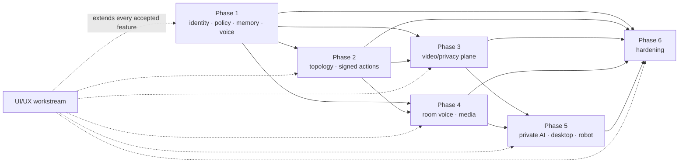

- A later phase may start simulator/adapter development once its upstream contracts are stable, but no household mutation route opens before all owning-phase prerequisites pass.
- Failure of a conditional capability removes only that capability. For example, failed E1 local streaming leaves the camera inventory/native fallback visible; failed TV observation leaves teaching display/manual TV use; failed local model evaluation leaves the accepted cloud/offline route.
- A later phase may narrow an earlier permission but cannot silently broaden it. A broadening requires a named, versioned amendment in Section D.7.
- “Disabled” means the route, UI control, configuration, and package registration are absent or reject every attempt—not merely hidden by a front-end flag.

---

## C. End-to-end architecture alternatives

### C.1 Alternative 1 — Cloud-centric assistant with direct device integrations

Reachy streams audio to a cloud agent, cloud services hold conversation/profile state, and the agent talks directly to MOES/MZHUB/Reolink/TV/provider APIs. A hosted web dashboard supplies remote access.

**Advantages:** quickest demo, strong frontier-model quality, little local compute, vendor clouds may simplify discovery and remote use.

**Trade-offs:** household audio/profile/device context crosses more providers; internet and vendor accounts become availability dependencies; a model-facing tool surface grows broad; camera/media retention and identity boundaries become hard to prove; subscriptions and pricing compound; public exposure and multi-provider incident response increase; open-source deployments inherit provider-specific authority.

**Decision:** rejected. It conflicts with local canonical memory, outbound-only cloud calls, local camera media, closed action schemas, and the no-public-console boundary.

### C.2 Alternative 2 — One all-local all-in-one server

A new high-end workstation or NAS hosts the LLM, speech, vision, Home Assistant, recorder, database, web console, and automation in one process/container stack.

**Advantages:** minimal routine data egress, one hardware purchase, potentially low inference marginal cost, straightforward high-bandwidth media access.

**Trade-offs:** expensive before workloads are measured; the server becomes one failure, update, compromise, thermal, and recovery domain; device authority and untrusted inference share privilege; a NAS is not automatically suitable inference compute; frontier bilingual/child quality may regress; hardware and model churn couple the whole product; a fault can simultaneously remove voice, lights, recording, policy, and recovery.

**Decision:** rejected as the program shape. A later isolated inference appliance or NAS/VMS may be added behind bounded ports, but neither becomes canonical authority.

### C.3 Alternative 3 — Staged local-authority, hybrid-inference, adapter-based planes

The existing Mac is the trusted control plane; Reachy and later endpoints are thin paired edges; Home Assistant Green is the device plane; an isolated video plane writes the encrypted SSD; cloud inference is outbound and minimized; future local compute is a replaceable worker; remote access is a private routed adapter; all external effects use closed, signed, versioned contracts.

**Advantages:** delivers quality early, contains each vendor/failure domain, makes storage and hardware purchases evidence-based, supports local migration per task, preserves physical/manual recovery, and produces an open-source architecture that can replace models and devices without rewriting policy.

**Trade-offs:** more explicit schemas, commissioning, negative tests, and operational evidence; the Mac remains important; two routers create practical discovery/segmentation constraints; multiple small processes and keys require disciplined recovery.

**Decision:** selected.

### C.4 Comparison

| Criterion | Cloud-centric/direct | One local server | Selected staged planes |
|---|---:|---:|---:|
| Near-term bilingual answer quality | High | Medium/variable | High with controlled cloud baseline |
| Household raw-data minimization | Low | High | High where sensitive; bounded outbound where approved |
| Device/action containment | Low | Medium | High through HA signed closed bridge |
| Independent physical recovery | Medium | Low if server fails | High |
| Camera privacy/isolation | Low | Medium | High, separate video/catalog/media proxy |
| Initial capital cost | Low | High | Low-to-moderate and staged |
| Operational simplicity | Superficially high, provider-dependent | Medium until failure/update | Moderate, explicit and testable |
| Vendor/model portability | Low | Medium | High through ports/contracts |
| Open-source household fit | Low | Medium | High |
| Blast-radius containment | Low | Low | High |

---

## D. Master system architecture

### D.1 Written architecture

Tuntun is a **local modular monolith plus bounded edge/adapter processes**. `tuntun-core` on the Intel Mac serializes canonical writes and owns the single active household conversation, identity fusion, family/child policy, exact authorization, seven memory kinds, provider/inference routing, cost reservation, audit, owner API, feature registry, and recovery coordination. It communicates in-process through typed ports and a bounded event router; Kafka, MQTT, NATS, Redis, a service mesh, Kubernetes, and a distributed database are not required.

Reachy and later room nodes detect wake/VAD locally, retain only bounded RAM audio, expose physical/local stop and mute behavior, and send post-wake media only under a current lease. Home Assistant Green owns device integration and deterministic routines but knows no family identity, transcript, biometric, memory, or policy rationale. The Mac sends only signed closed desired-state envelopes to a custom HA Core integration that independently enforces compiled bindings, idempotency, timing, and receipt state.

The Reolink video plane is process-, key-, and storage-separated from canonical identity/memory. It sends only validated event/health/presence metadata and opaque media references to policy. Music, display, TV, desktop, local inference, and robot services each have similarly narrow authority. Phase 6 permits a VPN-routed browser to reach only the owner API; it never makes HA, cameras, endpoints, desktop helpers, or robots remote services.

Cloud services are explicit outbound adapters. The core redacts and minimizes inputs, enforces consent and sensitivity, reserves budget before I/O, validates results, and never gives a provider direct tools or credentials. Privacy Shield atomically advances the canonical privacy generation and revokes every registered Tuntun authority before fan-out; requested, acknowledged, physically verified, and unverified downstream effects remain distinct. It truthfully does not stop the independently governed Reolink recorder or manual/native device and media controls unless the owner performs their separate actions.

### D.2 Logical component view

```mermaid
flowchart TB
  subgraph FAMILY[Family and owner surfaces]
    REACHY[Reachy Mini\nvoice · interaction-gated identity]
    ROOM[Room speech nodes\nPhase 4]
    DISPLAY[Display-safe teaching/media cards]
    BROWSER[Owner browser\nlocal/LAN and VPN in Phase 6]
    SUBJECT[Adult/guardian browser\none-use local decision only]
  end

  subgraph CORE[Tuntun trusted control plane · Intel Mac]
    EDGE[Edge gateway + wake arbiter]
    TURN[Conversation/session coordinator]
    ID[Identity fusion]
    POLICY[Policy · consent · auth · approvals]
    MEMORY[Seven-kind canonical memory]
    ROUTER[Provider/inference gateway]
    ACTION[Action + routine coordinator]
    KNOW[Knowledge corpus service]
    DESK[Desktop policy service]
    ROBPOL[Robot policy service]
    API[Owner API + separate subject-scoped API\nUI projections]
    AUDIT[Audit · usage · feature/evidence registry]
    DB[(SQLCipher + Keychain roots)]

    EDGE --> TURN --> ID --> POLICY
    POLICY --> MEMORY
    POLICY --> ROUTER
    POLICY --> ACTION
    POLICY --> KNOW
    POLICY --> DESK
    POLICY --> ROBPOL
    API --> POLICY
    MEMORY --> DB
    POLICY --> DB
    AUDIT --> DB
    TURN --> AUDIT
    ACTION --> AUDIT
    ROUTER --> AUDIT
  end

  subgraph DEVICE[Deterministic device/media plane]
    GREEN[Home Assistant Green\ncustom signed bridge + receipts]
    MZHUB[MOES MZHUB → 12 Zigbee lights]
    MEDIA[Music Assistant / approved players]
    TV[Qualified TV adapters]
  end

  subgraph VIDEO[Isolated local video plane]
    SOURCE[Camera source adapters]
    REC[Recorder + event normalizer]
    VCAT[(Vision catalog)]
    SSD[(Encrypted external SSD)]
    PROXY[Owner media proxy]
    FRAMEBROKER[Disabled-by-default selected-frame broker]
    SOURCE --> REC --> SSD
    REC --> VCAT --> PROXY
    VCAT --> FRAMEBROKER
  end

  subgraph OPTIONAL[Optional isolated Phase 5/6 services]
    INF[Inference proxy + local runtime]
    PERCEPT[Separate anonymous-CV proxy + non-generative runtime]
    HELPER[Desktop helper + sandbox]
    ROBOT[Raspbot edge + safety supervisor]
    VPN[VPN health adapter]
    PLUGIN[Plugin supervisor]
  end

  subgraph CLOUD[Explicit outbound-only dependencies]
    STT[Approved STT]
    LLM[Approved reasoning/search]
    TTS[Approved TTS]
    CPROV[Licensed media/provider services]
    VPNCP[Optional VPN coordination plane]
  end

  REACHY <-->|paired bounded media/control| EDGE
  ROOM <-->|capture leases| EDGE
  TURN -->|one private reply endpoint| REACHY
  TURN -->|one private reply endpoint| ROOM
  API <-->|same-origin protected UI| BROWSER
  API <-->|isolated subject passkey ceremony\nno owner session| SUBJECT
  ACTION <-->|signed typed state/action/routine| GREEN
  GREEN --> MZHUB
  GREEN --> MEDIA
  GREEN --> TV
  REC -->|closed event/health only| POLICY
  API -->|opaque short-lived capability| PROXY
  POLICY --> DISPLAY
  ROUTER <-->|signed sanitized requests| INF
  FRAMEBROKER -->|selected_frame_request.v1\n1–3 frames · ≤3 MiB · ≤5 s| PERCEPT
  PERCEPT -->|anonymous_visual_observation.v1| POLICY
  DESK <-->|expiring grants + typed jobs| HELPER
  ROBPOL <-->|250 ms signed leases + telemetry| ROBOT
  BROWSER <-->|approved private route only| VPN
  PLUGIN <-->|purpose DTOs only| POLICY
  ROUTER --> STT
  ROUTER --> LLM
  ROUTER --> TTS
  MEDIA -. approved account path .-> CPROV
  VPN -. coordination metadata only .-> VPNCP
```

### D.3 Deployment view

| Node | Deployed processes/data | Availability role | Secrets/authority | Failure behavior |
|---|---|---|---|---|
| Reachy CM4 | Official daemon plus `tuntun-edge`; wake/VAD, bounded RAM audio, speaker, safe gesture, interaction-gated frames | Family voice endpoint and local safety | Device TLS/signing keys only; no provider, memory, HA, or database key | Enters offline-essential/error-safe; no stale speech/motion resume |
| Intel Mac | `tuntun-core`, owner UI/API, camera-source/recorder/media-proxy processes, optional desktop helper; SQLCipher stores; Keychain roots | Canonical household control plane | Identity, policy, memory, auth, audit, provider/action keys | Device/manual controls and HA automations survive; new identity-governed actions stop |
| External encrypted SSD | Separate `TUNTUN_VIDEO` and `HA_BACKUPS` volumes/quotas | Initial video retention and recoverable HA backup copy | Volume key in Keychain; no shared cross-volume service account | Recorder stops by threshold without deleting unexpired media; voice remains available |
| Home Assistant Green | HA Core, Matter Server, Tuntun custom integration, receipt store, bounded routines | Local device authority independent of Mac restarts | Pinned Mac public key/controller epoch; no family/provider secret | Physical/native controls remain; Tuntun reports unavailable/unknown |
| MOES MZHUB | Existing Zigbee coordinator and conditional Matter bridge | Light network | Vendor commissioning material only | Physical/native recovery; no blind Tuntun retry |
| Reolink cameras | Local streams/native events and optional microSD fallback | Raw source plane | Camera-scoped least-privilege credentials in video process | Each source degrades independently; no identity/greeting path |
| Room/display/media/TV nodes | Paired endpoint agent, kiosk display agent, approved player/TV adapters | Optional room/media capabilities | Device-scoped pairing or vendor credential held in owning integration | Capability becomes absent/manual; private output is never rerouted automatically |
| Optional inference appliance | mTLS proxy, replaceable runtime, pinned model cache | Compute worker only | Device key and model artifacts; no household authority/store mounts | Route rolls back per task; policy and local essentials remain on Mac |
| Optional Raspbot Pi | Robot edge, independent safety supervisor, vendor motor/sensor process behind loopback | Supervised common-area endpoint | Robot device key; no memory/provider/passkey | Watchdog/e-stop stops motion locally; no restart resume |
| Owner phone/laptop in Phase 6 | Approved VPN client plus WebAuthn authenticator/browser | Constrained owner view | Authenticator key and VPN node identity | Revocation or drift ends application session; no alternate public route |

### D.4 Local/cloud boundary

| Data/capability | Local canonical handling | Cloud eligibility |
|---|---|---|
| Identity/biometric templates | Local encrypted, interaction-gated, purpose-specific keys | Never |
| Canonical family memory and policy | Local SQLCipher; minimum approved excerpts may be projected | Only sanitized, audience-approved excerpts for an eligible turn; never database records/IDs |
| Raw conversation audio | Bounded RAM; post-wake only | Approved STT request only; no Tuntun durable copy |
| Reasoning context | Locally assembled, redacted, token- and audience-bounded | Approved model route with `store=false` where supported and current provider controls |
| Web research | Search-only first pass, hostile result/citation gate, then no-search reasoning | Approved controlled search; no login/download/LAN/code/tool access |
| Reolink media/audio | Isolated local video plane; audio off/stripped | Never |
| Selected camera frames | One to three RAM-only frames, ≤3 MiB total, ≤1920 px maximum dimension, in an expiring ≤5-second `selected_frame_request.v1` to the separate eligible non-generative CV appliance | Never; no language-model/VLM route |
| Home actions | Local policy/signing and HA execution | Never delegated to a cloud model/provider |
| Knowledge documents | Encrypted local object/catalog/FTS; excerpts policy-filtered | Default `local_only`; bounded excerpt only with exact current consent; selected frames never follow |
| Desktop files/output | Exact owner-selected local grant and sandbox; untrusted/DLP-filtered | Local-only by default. One provider call needs a single-use `DesktopModelEgressAuthorizationV1` bound to exact source commitments, minimized payload, provider/model, purpose, output destination, policy/privacy generations and expiry; this never supplies execution-network authority |
| Robot video/control | LAN live-only and local deterministic leases/safety | No internet telepresence or cloud motion |
| VPN | Application bodies remain encrypted peer-to-peer and same-origin | Coordination provider may receive its own service metadata, never Tuntun bodies |

### D.5 Physical network and exposure view

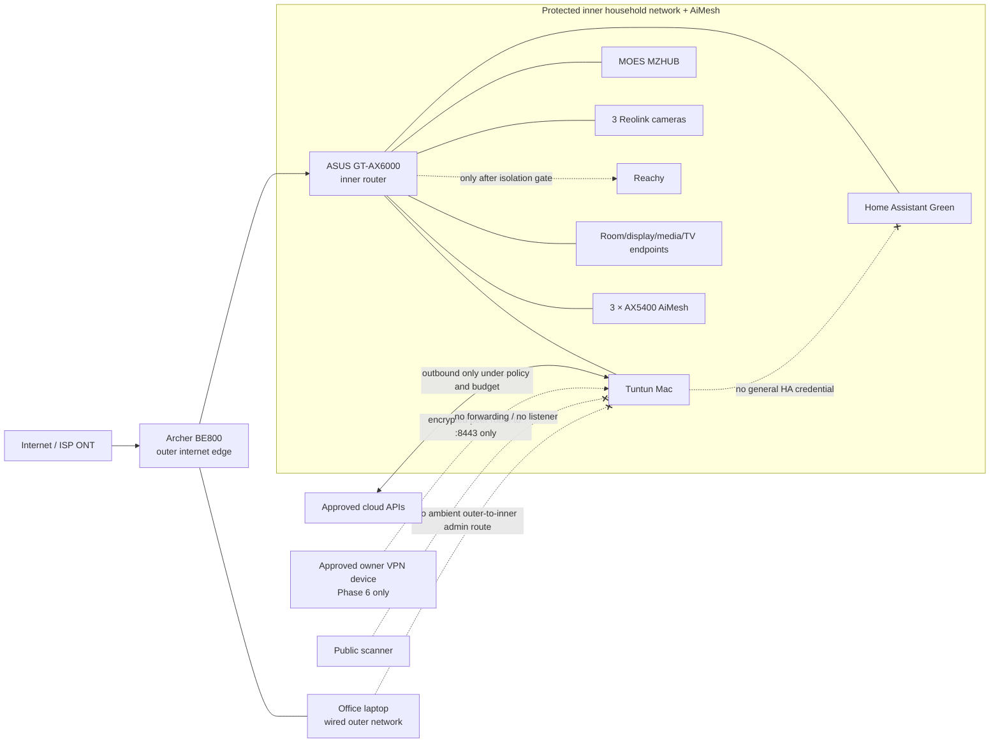

Network invariants:

- BE800 and GT-AX6000 use distinct non-overlapping subnets. Double NAT is accepted as topology, not claimed as complete mutual isolation.
- Green, the Mac, MZHUB, cameras, and later endpoints receive stable reservations where required. Matter/IPv6/mDNS is proved across the actual AiMesh path before use.
- UPnP, NAT-PMP/PCP automatic mappings where exposed, DMZ, WAN administration, public port forwarding, and public camera/HA/Tuntun URLs are disabled.
- The office laptop receives no ambient outer-to-inner route. Phase 5 does not bridge it; a future helper requires the Phase 6 paired VPN/device design.
- Reachy production voice/face processing remains disabled until daemon, SDK/media, API, WebRTC, and SSH negative reachability proves the accepted isolation boundary.
- Stronger SSID/VLAN claims require the exact router/AiMesh firmware gate. Host firewalls and the outer/inner boundary remain the deployable baseline.
- The Phase 6 Tailscale profile exposes only the Mac console origin/port to approved nodes; no subnet route, exit node, Funnel, public Serve, Tailscale SSH, or direct HA/video/endpoint path exists.

### D.6 Trust zones and enforcement points

| Zone | Trust posture | Permitted crossing | Enforcement point |
|---|---|---|---|
| Physical family interaction | Human intent may be ambiguous, replayed, mixed, or child-originated | Post-wake bounded media and local stop/privacy | Edge safety plus Mac identity/policy |
| Browser/UI | Authenticated but untrusted presenter | Versioned read models, opaque prepared IDs, short-lived media capabilities | Owner API, origin/CSRF/session/passkey, server-built binding |
| Mac canonical core | Highest application trust, still treats all external content as untrusted | Typed ports and serialized transactional commits | Policy/auth, schema registry, SQLCipher UoW, audit outbox |
| Home Assistant/device plane | Trusted narrow translator; physical state may be stale | Signed minimized state/action/routine DTOs | Pinned TLS, P-256 proofs, compiled bindings, receipts/controller epoch |
| Video plane | Trusted to store raw camera media, forbidden from identity/memory | Closed metadata events and opaque clip refs | Process/key/filesystem separation and media proxy |
| Endpoint/player/display/TV | Untrusted household appliance | Device-scoped commands/observations/projections | Pairing, generation/digest, closed capability, freshness |
| Inference/model | Untrusted computation even when local | Sanitized request and schema-bound result | Inference gateway before/after call; no tools/credentials |
| Desktop/robot helper | Privileged only within an exact expiring capability | Opaque grants, typed jobs, signed short leases, telemetry | Independent helper/safety checks and local watchdog |
| Plugin | Untrusted third-party process | Purpose-specific DTOs and closed capability values | Plugin supervisor, sandbox, resource/network limits, result validation |
| Cloud/VPN/provider | External dependency and possible metadata processor | Explicit outbound minimized data or encrypted coordination | Consent, sensitivity, budget, allowlist, route health, audit |

### D.7 Approved cross-phase amendments

Later capabilities do not rely on informal reinterpretation. The following versions must be registered in the shared policy/schema corpus, UI, audit, backup/restore, and negative-test manifest before use:

| Amendment | Changes | Does not change |
|---|---|---|
| `home_reversible_low_v1` (P2) | Identified adult may execute one unambiguous, registered, reversible single-light action with fresh binding/policy | No persistence, broad target, security/hazard, medium/high-risk bypass, or biometric authorization |
| `child_guarded_light_v1` (P2) | One reversible ordinary-light action inside jointly owner-configured/current-guardian-consented rooms/hours | No scene/routine/private/security/hazard authority or self-approval |
| `designated_guest_request_v1` (P2) | Owner-created bounded common-area request session may hold exact requests for independent owner co-approval | It is not inferred from uncertainty, provides no identity/memory/independent action authority |
| `offline_home_action_lifecycle_v1` (P2) | Closed bilingual light grammar can use the same transactional action path during WAN loss after Reachy isolation passes | No commissioning-harness substitution or weaker authorization/reconciliation |
| Phase 3 identity/media boundary | Adds isolated local recorder, owner alert, anonymous presence, and a disabled selected-frame seam | Reolink never identifies, greets, retrieves memory, routes raw media to cloud/LLM/VLM/HA/canonical memory, or triggers an action directly |
| `whole_home_single_session_v1` (P4) | Multiple commissioned speech endpoints may compete for exactly one household conversation slot | Room is not identity; pre-wake audio remains local; no passive follow-me/broadcast |
| `home_reversible_media_v1` (P4) | Identified adult may issue one registered single-player reversible transport action | New item/provider, material volume, transfer/group, persistence/account still needs stronger approval |
| `child_guarded_media_v1` (P4) | Child media within exact owner/current-guardian room/source/content/volume/time rule | No purchase, unknown/explicit content, broad groups, accounts, policy self-approval |
| `guarded_teaching_display_v1` (P4) | Bounded approved educational content may render on one paired display | No browser, prompt, memory, action, credential, or general-TV authority |
| `screen_time_real_adapter_v1` (P4) | Connects unchanged Phase 2 screen-time state machine to one qualified TV | No inferred viewer, stale-state success, unlimited retry, or policy change |
| Phase 5 movable-inference rule | Approved task cells may move from cloud to bounded Mac/appliance routes | Canonical authority, safety gates, egress rules, conversation slots, or direct model tools do not move |
| `privacy_effect_registry_v1` (P1–P6) | The UI/UX Section 13.1 registry defines one canonical privacy-generation authority revocation plus per-plane requested/acknowledged/physically-verified/unverified effects | A committed authority revocation never claims an independent Reolink recorder, HA/manual control, player, display, robot, provider, or prior write physically stopped |
| `owner_vpn_console_v1` (P6) | Adds a private VPN interface route to the same owner console under layered application auth | No public bind, VPN-as-identity, direct HA/video/endpoint access, or local-only recovery operation |
| `remote_origin_v1` (P6) | Marks remote origin as assurance-reducing context for otherwise local operations | Remote can never upgrade a locally denied operation; desktop execution and robot driving remain denied |

---

## E. Normalized component catalogue

The detailed phase catalogues remain authoritative. This normalized view shows how the parts compose. “Build” means project-owned code; “adopt” means an external product/library behind a project-owned adapter.

| Component | Phase | Responsibility | Interfaces and owned data | Location | Dependencies | Security boundary | Failure behavior | Build/adopt |
|---|---:|---|---|---|---|---|---|---|
| Reachy edge agent | 1 | Wake/VAD, bounded RAM buffer, speaker, camera sampling for active identity, local stop/privacy watchdog, safe gesture | Signed edge control/media frames; device health; no durable family data | Reachy CM4 | Official Reachy daemon/SDK, proved audio/stop paths | Device-scoped mTLS/signing; no provider/DB/HA secrets | Offline-essential/error-safe; clear buffers; no stale resume | Build adapter; adopt official SDK |
| Edge gateway / wake arbiter | 1/4 | Pair edges, enforce quotas/generations, arbitrate duplicate wake, issue one capture lease | Edge session, wake claims, `CaptureLeaseV1`, frame sequence state | Mac core | Reachy/room endpoint registrations | Reject stale/losing/over-quota media before provider | Cancel leases and require new wake | Build |
| Turn/session coordinator | 1 | Own exactly one active conversation, state transitions, cancellation, turn correlation | Household session, conversation, turn, ephemeral working context | Mac core | Edge gateway, policy, speech, workflow | Privacy/stop preempts workflow; no provider logic | Deterministic cancellation; no crash resume | Build |
| Speech adapters | 1 | Normalize audio, STT and TTS calls, segment/play validated speech | Sanitized bounded audio/text, usage receipts | Mac + approved cloud | Provider gateway and current provider review | No policy/memory writes; bodies absent from logs | Timeout/refusal to truthful offline inability | Build ports; adopt approved APIs |
| Identity service | 1 | Local active-interaction face/voice evidence, liveness/quality fusion, Guest fallback, enrollment lifecycle | Encrypted enrolled templates and expiring per-interaction evidence; no source samples or unknown-candidate records | Mac worker + SQLCipher/Keychain | Interaction-gated Reachy frames/post-wake speech | Personalization only, purpose keys, audience isolation; no passive discovery | Uncertain/conflict/replay/unknown → Guest | Build policy/fusion; adopt evaluated models |
| Policy/auth/consent service | 1–6 | Risk registry, audiences, child/guardian rules, prepared actions, passkey/PIN/recovery, all amendments | Policy/consent/credential public data/grants/commitments | Mac core + SQLCipher/Keychain | Identity evidence, feature registry, UI and action services | Sole application authorization authority; server builds exact binding | Unknown/stale/revoked → deny; privacy reduction remains immediate | Build; adopt WebAuthn primitives |
| Canonical memory service | 1 | Seven memory schemas, proposals/approvals, scoped retrieval, lifecycle/deletion | Memory records, wrapped DEKs, embeddings/provenance | Mac SQLCipher | Policy/audience/guardian, inference gateway | Triple audience check; LangGraph is not store | Fail closed on key/schema/consent; no fallback plaintext | Build; adopt SQLCipher |
| Conversation workflow | 1 | Ordered intent, retrieval, response, validation, resumable in-turn flow | Ephemeral graph checkpoints/typed state | Mac core | Turn, policy, memory, provider, action proposals | Cannot commit memory/action itself | Cancel/discard on privacy, stop, stale generation | Build; optional LangGraph adapter |
| Provider/inference gateway | 1/5 | Redaction, consent/sensitivity/budget reservation, route/model selection, cancellation, response validation | Sanitized request/result, pricing/model/evaluation manifests, usage | Mac core | Cloud APIs or optional local appliance | Only approved egress; model always untrusted; no endpoint credential | Per-task fallback only if same privacy zone eligible | Build ports; adopt SDKs/runtimes |
| Web/search gateway | 1 | Search-only bounded pass, URL/public-address and citation validation | Normalized source refs/commitments; no page bodies retained | Mac + approved search provider | Policy, provider gateway | No login/download/LAN/tool/action/memory route | Fall back to no-web, never uncited current claim | Build; adopt approved web-search API |
| Audit/usage/evidence service | 1–6 | Content-minimized append-only receipts, keyed commitments, chain, cost/power, feature/evidence status | Audit segments, usage ledger, evidence digests | Mac SQLCipher/Keychain | Every authoritative service | No body logs; trigger-protected chain; key versions separate | Chain failure blocks risky release/mutations; never silently rebuild | Build |
| Owner API and console | 1–6 | Versioned projections, exact prepared-action ceremonies, health/privacy/operations UI | UI read models, opaque prepared IDs, no canonical table exposure | Mac + authenticated browser | Policy/auth, feature registry, all phase read services | Same-origin, CSRF, passkey; browser untrusted | Stale/unknown shown explicitly; no client-side authority | Build React/API; adopt accessible primitives |
| Feature registry | 1–6 | Register only installed, accepted routes/contracts/UI modules | Signed feature manifest, schema/policy/evidence digests | Mac core/release artifact | Release verifier and acceptance evidence | Absence removes backend and UI capability | Digest drift quarantines feature | Build |
| Topology/capability registry | 2–6 | Stable areas/devices/endpoints/capabilities/bindings and generations | Non-sensitive stable IDs, bindings, capability evidence | Mac SQLCipher | Commissioned adapters; owner approvals | Binding mutation invalidates outstanding actions | Stale/drift/rebind → ineligible | Build |
| Tuntun HA adapter | 2/4 | Minimized state sync, translate internal authorization to signed closed envelopes, reconcile receipts | Compiled projection and action/routine/media/TV DTOs | Mac core | Policy/action service and HA custom integration | No general HA credential/API | Adapter unavailable; no claim of success | Build |
| HA Core custom integration | 2/4 | Verify channel/action signatures, compiled allowlist, durable idempotency, bounded translation/routines | `/config/tuntun_bridge/receipts.sqlite3`, controller epoch, pinned public key | Home Assistant Green | HA Core/system context, Matter/media/TV integrations | Security-critical narrow TCB; no HA/Supervisor token or caller-selected service | Quarantine on drift/restore; reconcile, never blind replay | Build; adopt HA extension APIs |
| Home Assistant Green | 2 | Device integration/state, Matter Server, deterministic approved routines, local backups | Device/integration state and minimized history only | Green appliance | MZHUB, network, UPS, exact adapters | No family identity/memory/transcript/provider context | Manual/native device control remains; daily local backup | Adopt selected appliance |
| MOES MZHUB and lights | 2 | Existing Zigbee mesh and conditional Matter exposure of twelve lights | Vendor device state and commissioning material | Inner LAN / Zigbee | Exact firmware/attestation and one-light pilot | No Tuntun identity/policy | Physical/native recovery; conditional ZBT-2 fallback only after gate | Adopt existing hardware |
| Screen-time policy service | 2/4 | Allowance/session state, warnings, grace, extension, bounded enforcement | Child/session/policy/ledger and observation commitments | Mac core | Guardian policy; exact TV control/observation | Does not infer viewer/content or claim unobserved state | Unknown evidence consumes no unobserved time; manual bypass ends contention | Build |
| Camera source adapters | 3 | Exact local stream/native-event discovery, auth, capability/clock health | Camera-scoped credentials/handles and binding evidence | Separate Mac video process | Exact Reolink units or future proved hub/NVR | No identity/provider/HA action/memory access | Source becomes inventory-only/native fallback | Build ports; adopt proved protocols/SDK |
| Recorder and event normalizer | 3 | Stream-copy segments, event ring/promotion, checksum/gaps/retention, closed event normalization | Raw media on SSD; segment/clip/event metadata | Least-privilege Mac video processes | Camera sources, dedicated SSD volume | Audio rejected; no canonical DB/provider access | Threshold-based stop, preserve unexpired media, surface gaps | Build around proven media tools |
| Vision catalog and media proxy | 3 | Opaque segment/clip catalogue and owner-only range/playback/export/delete grants | Separate SQLCipher catalog; opaque tokens/grants | Mac video plane | Recorder, owner auth, SSD | No family names/memory IDs/paths in DTOs; `no-store` | Catalog uncertainty blocks mutations/playback grant issuance | Build |
| Alert/presence services | 3 | Durable local owner inbox, authenticated same-origin SSE to an active paired console, and expiring anonymous area state | Closed events, cooldown/deduplication, bounded 24-hour undelivered queue, current checkpoint only | Mac policy plane | Event normalizer, area/zone privacy, optional independent sensors | No identity/greeting/action, public/background push, service worker, or durable movement history | Closed/asleep console retains delayed inbox item with no immediate-delivery claim; missing/stale presence evidence → `unknown`; recording continues independently | Build local inbox/SSE; future external notification adapter remains absent |
| Room endpoint agent | 4 | Local wake/VAD, real mute/indicator/stop, leased capture, speech playback | Registration, claim, frame, diagnostics; no durable audio | Commissioned room hardware | Bakeoff-winning device and edge gateway | No identity/memory/cloud key; private-room consent generation | No self-election during partition; local privacy works | Build adapter; adopt selected hardware |
| Media coordinator / signed bridge | 4 | Resolve approved catalog handles, policy-check player/source/group, execute closed media actions | `SignedMediaEnvelopeV1`, player observations/receipts | Mac + HA/optional Music Assistant | Licensed provider and exact player | No free URL/account admin/general MA or HA token | No source fallback/retry; report verified/unverified/unknown | Build; adopt HA/MA adapters |
| Teaching display service/agent | 4 | Issue and render closed, hashed, audience-bound teaching manifests | `TeachingSessionManifestV1`, display-safe assets/status | Mac service + paired kiosk/HDMI node | Guardian/screen-time policy, exact display | No browser navigation/HTML/JS/credentials/screenshots | Clear on expiry/privacy; manual TV input remains | Build; adopt browser runtime |
| TV capability adapter | 4 | Exact desired-state control and independent observations per television | `SignedTVActionV1`, `TVObservationV1`, evidence generation | HA/renderer adapter | Native local API, CEC, or bounded IR after probe | No wildcard keys/macros; command ACK is not physical proof | Degrade to manual/display-only; no hostile retry loop | Build adapters; adopt exact protocols |
| Knowledge service/store | 5 | Explicit import, sandbox parsing, provenance/ACL/versioning, FTS/optional vector retrieval/citations | Separate `knowledge.db`, encrypted objects, rebuildable indexes | Mac/external encrypted storage | Policy/guardian, local parser/embedding model | Separate from memory; retrieved text is untrusted; no automatic drives/accounts | Failed import is not searchable; local-only query can return inability | Build; adopt SQLCipher/FTS/parser libs |
| Inference proxy/runtime | 5 | Execute signed model-independent requests under quotas; return signed typed result | Model cache/manifests and content-free health/receipts | Optional isolated appliance | Mac gateway, pinned model/runtime | No tools, corpus mount, LAN device routes, provider/admin key | Task route disabled/rolled back; Mac remains authority | Build proxy; adopt llama.cpp/vLLM/compatible runtime |
| Selected-frame broker and perception proxy/runtime | 3/5 | Broker authorizes one exact P3 event/zone request; separate proxy runs only anonymous non-generative CV and returns a closed observation | `selected_frame_request.v1`, 1–3 transient frames (≤3 MiB, ≤1920 px, ≤5 s), `anonymous_visual_observation.v1`; no reusable media handle | Isolated video broker + optional isolated local appliance process | Accepted P3 seam, approved CV artifact/calibration, privacy generation | No language model/VLM, caption, OCR, identity, demographics, memory, tool, action, camera credential, general video mount, or cloud/VPS route | Any stale/oversize/unknown/crash/privacy path clears frames and returns denial/unknown; recording remains independent | Build separate broker/proxy; adopt pinned non-generative CV runtime |
| Desktop helper/sandbox | 5 | Owner-selected reads; pinned, network-off, non-code D3 inspection; separately signed D4 workflows for every repository code/test/lint/build/format/generator operation | Opaque expiring grants, bounded job output/artifact commitments, separate single-use model-egress authorization | Separate least-privilege Mac process | Unix socket peer checks; proved D4 sandbox backend | No arbitrary shell, Keychain, cookies, home mount, ambient network; D4 execution-network authority never implies model egress | Revoke/cancel; D4 and every project-code execution route are absent if sandbox proof fails, while eligible D0–D3 may remain | Build |
| Robot policy and Raspbot safety | 5 | Authorize supervised session; issue clamped short leases; enforce local e-stop/watchdog/geofence | `RobotMotionLeaseV1`, `robot.safety_state.v1`, live no-store media | Mac + Raspbot Pi | Physical e-stop, fresh directional sensors, commissioned common areas | Model/voice/child/HA cannot move robot; local safety overrides network | Latching stop on any uncertainty; simulator/bench if safety absent | Build adapters; adopt kit hardware |
| Remote access adapter/exposure guard | 6 | Normalize approved VPN posture and expose only owner origin/port | `remote_session.v1`, route/node state; no family body | Mac + owner VPN device | Tailscale is the sole six-phase adapter; direct WireGuard deferred | VPN identity is not app identity; no public/subnet/direct-service route | Drift → `SUSPENDED`, sessions revoked, local operation unaffected | Build port/guard; adopt official Tailscale client |
| Plugin supervisor | 6 | Verify manifest/signature and the `phase6.initial.1` registry, launch one fresh constrained process, enforce resources and revoke | `plugin.manifest.v1` plus only `system.health.render.v1` or `notification.local_alert.render.v1`; no plugin persistence | Mac isolated process/account | Release verifier and enforceable macOS sandbox | Display-only closed text DTOs; no inherited secrets/core imports/network/DNS/redirects/writable mount/wildcards; result untrusted | Kill/revoke sockets/grants and erase per-call sandbox; plugin support absent if isolation is unenforceable | Build |
| Release/backup/incident services | 6 | Verify artifacts/provenance/SBOM, pre-update backup, atomic install/rollback, restore quarantine, incident states | Signed release manifest, encrypted archives, recovery and incident receipts | Mac plus independent encrypted recovery copy | Developer ID/notarization, SLSA/GitHub attestations, Keychain | Ambiguity preserves prior release; restore cannot reopen authority early | Rollback/containment; local privacy/safety remain | Build orchestration; adopt standard signing/attestation tools |

---

## F. Required end-to-end sequence diagrams

These diagrams show authority and failure boundaries. The owning phase specs define exact time, size, retry, and corpus gates.

### F.1 Voice conversation — Reachy or a commissioned room endpoint

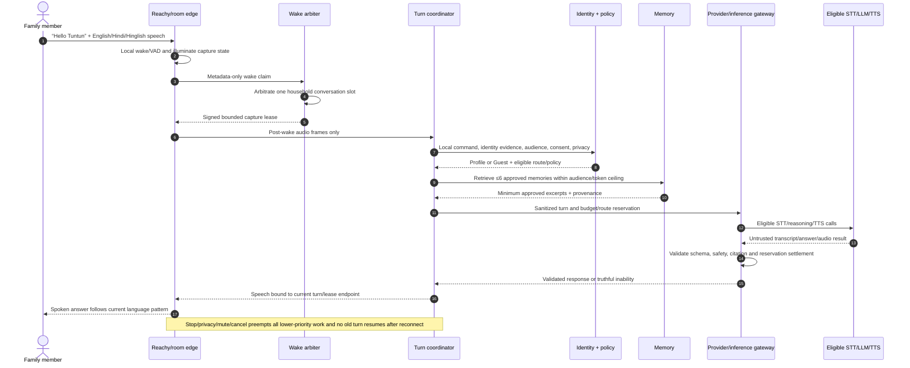

### F.2 Governed light action

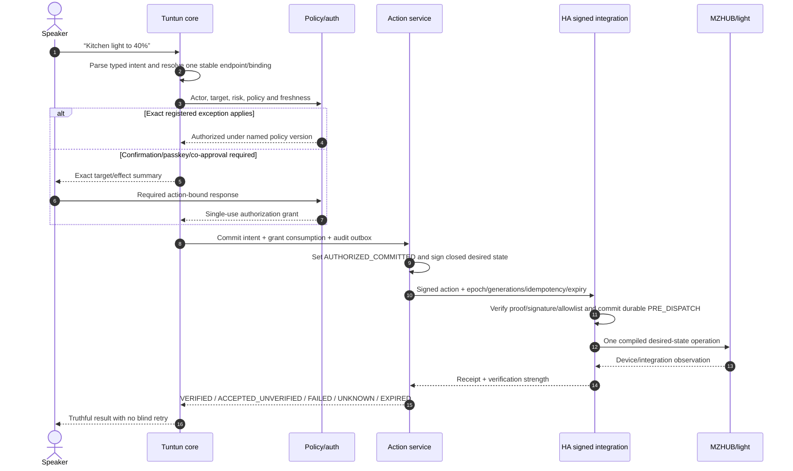

### F.3 Music request

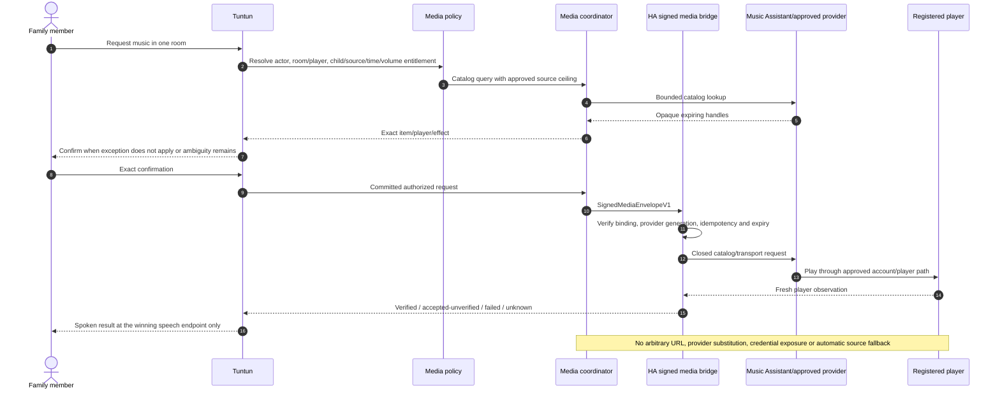

### F.4 Television teaching session

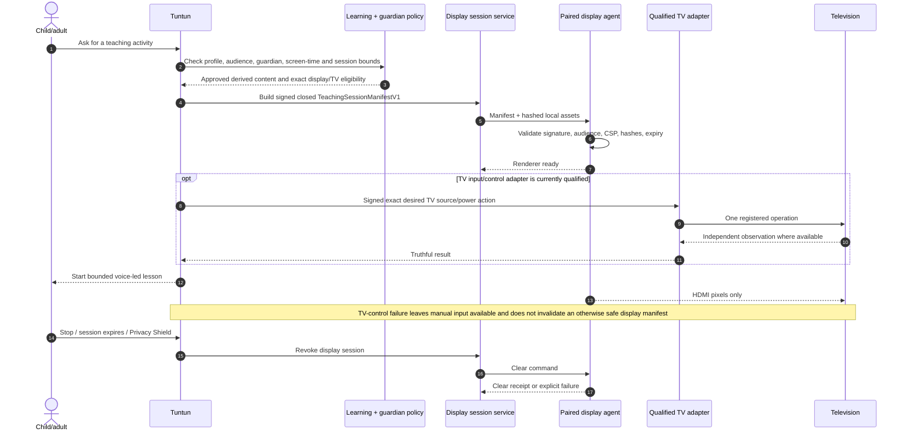

### F.5 Parent/guardian screen-time flow

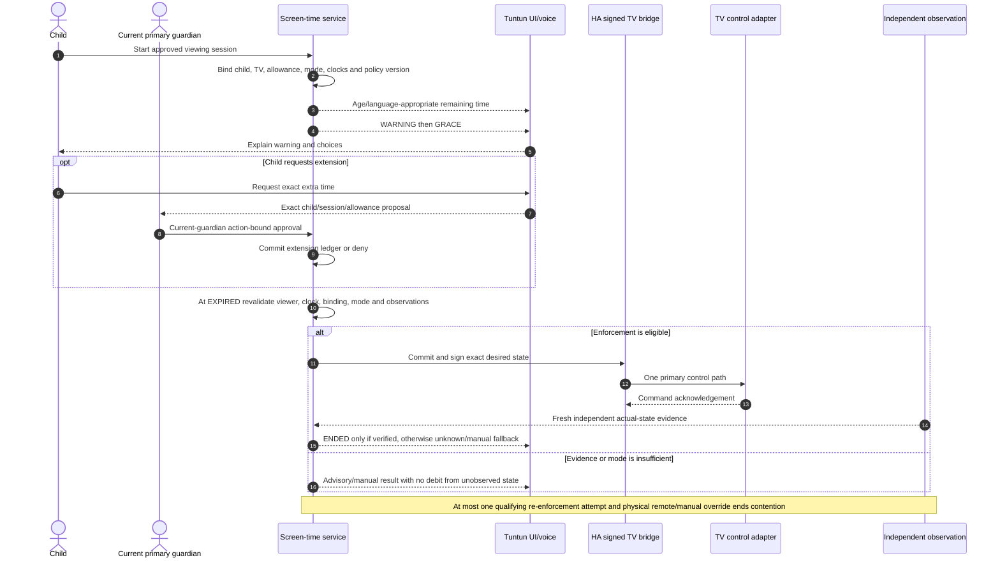

### F.6 Camera event, owner alert, and greeting boundary

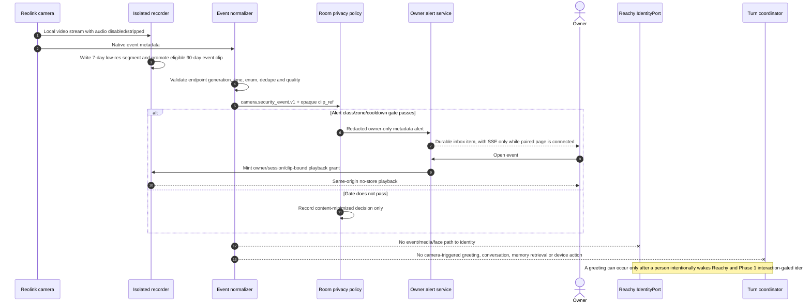

### F.7 Desktop debugging

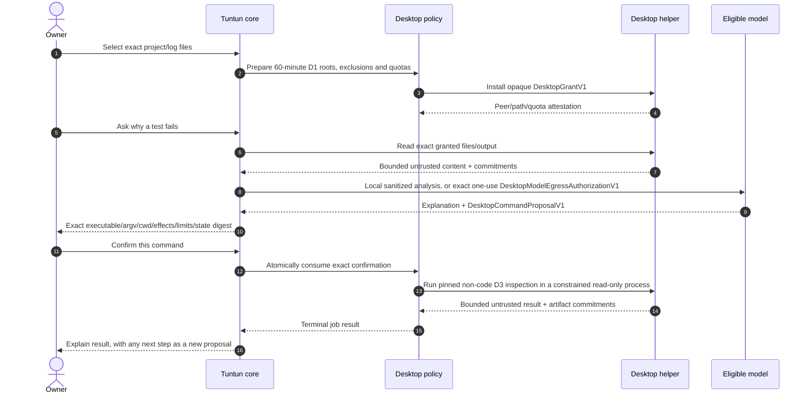

This sequence is D3 only. D3 never runs repository/project code, scripts, hooks, plugins, tests, lint, builds, formatters, generators, compilers, interpreters, or application entry points. Every such operation is a separately prepared D4 workflow with a fresh owner passkey and a proved disposable sandbox; if no backend passes the D4 escape/resource/cleanup suite, those routes are absent. A D4 execution-network permission and `DesktopModelEgressAuthorizationV1` are independent grants and neither implies the other.

### F.8 Canonical memory write

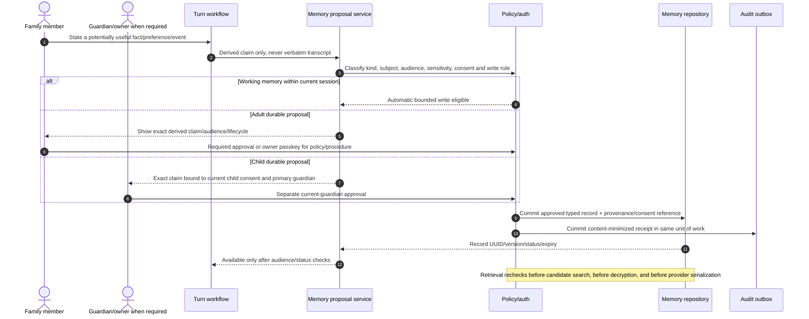

### F.9 Supervised Raspbot telepresence

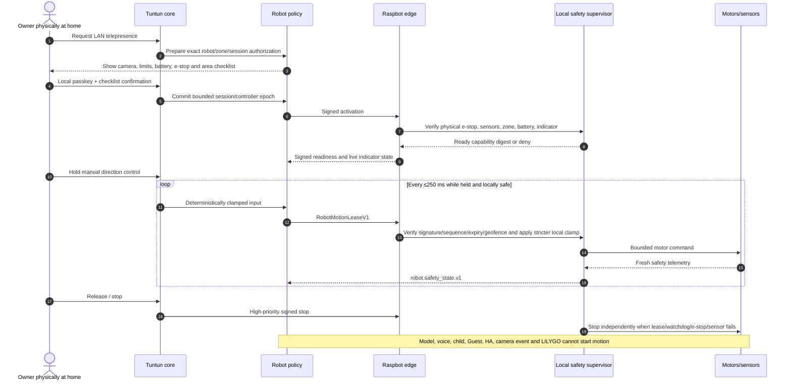

---

## G. Canonical data architecture

### G.1 Data ownership rules

1. Tuntun's canonical household control data lives in SQLCipher on the Mac; keys and provider/action roots live under separate macOS Keychain service identifiers.
2. Home Assistant stores only device/integration/routine operational state and its own minimized receipts/history. It is not a second identity, memory, or authorization store.
3. Camera media and its catalog use a separate SQLCipher/key/filesystem namespace. Canonical memory cannot reference media bytes or a camera identity.
4. The Phase 5 knowledge corpus is separate from memory: documents remain authored sources with provenance/ACL/version, while memory remains approved household claims.
5. Audit is append-only control evidence, not conversational recall. Logs are content-minimized operational diagnostics, not an audit substitute.
6. Derived indexes, embeddings, caches, and UI projections are rebuildable/non-authoritative and cannot extend the source record's audience or retention.
7. Stable IDs are random/pseudonymous and contain no name, IP/MAC, room-sensitive nickname, provider account, filesystem path, or vendor credential.

### G.2 Required core entities

| Entity | Canonical meaning and key fields | Owner/system of record | Principal relationships |
|---|---|---|---|
| `household` | Random household ID, locale/timezone, active policy/feature/revocation generations | Tuntun core | Has users, areas, sessions, policies, memories, skills and audits |
| `user` / `profile` | Subject ID, role/profile class, language/display defaults, lifecycle; child has current primary-guardian binding | Tuntun identity/policy | Member of household; subject of memories/consents; actor in sessions |
| `identity_template` | Purpose, modality, model/calibration version, encrypted template, consent/status/expiry | Identity store | Belongs to user; emits expiring evidence only; never grants action |
| `area` | Sole canonical stable household location ID (`area_id`), display name, room/privacy class, consent/generation | Topology registry | Contains devices/endpoints and versioned subordinate zones; scopes policies/events/sessions. `room_id` is never a parallel identifier |
| `zone` | Stable versioned sub-area (`zone_id`) nested beneath exactly one `area_id`, with owning adapter/binding generation and compare-and-swap state where applicable | Topology or owning phase registry | Refines a commissioned camera/robot/other boundary; cannot move across areas, replace an area, or broaden an ambiguous target |
| `device` | Physical/virtual product, exact SKU/revision/firmware, lifecycle/commissioning generation | Topology registry | Located in area; has endpoints |
| `endpoint` | One addressable function with stable ID, class, health and capability generation | Topology registry | Belongs to device; has capabilities/bindings; emits events |
| `capability` | Closed operation/observation schema, risk, bounds, eligibility evidence digest | Capability registry | Offered by endpoint; consumed by skills/actions |
| `binding` | Current adapter-specific mapping, topology/binding generation/digest, freshness and exact external commitment | Topology registry | Connects endpoint/capability to HA/camera/media/robot adapter |
| `session` | Bounded authenticated or conversational context, actor/effective role, origin, privacy/revocation generation, expiry | Session/auth service | Contains conversations/turns and scoped grants |
| `conversation` | One admitted household slot, winning endpoint/area, profile/Guest mode, language state, lifecycle | Turn coordinator | Belongs to session; has turns; references ephemeral working context |
| `turn` | Random ID, state/timing, selected route, correlation and content-free usage outcome | Turn coordinator | Belongs to conversation; may propose memory/action but stores no verbatim transcript |
| `policy` | Registry key, typed value, version/digest, scope, effective/revoked times, approval binding | Policy service | Applies to users/areas/capabilities/sessions/actions/memory |
| `consent` | Subject/guardian/purpose/disclosure/policy version, scope, validity and revocation | Policy service | Required by identity, child memory/media, room microphones, egress |
| `auth_grant` / `prepared_action` | Exact resource/parameters/purpose/idempotency/policy/session/subject/assurance/expiry commitment | Auth service | Consumed once with a mutation/action transaction |
| `memory` | UUID, one of seven kinds, household/subject/audience, typed payload, sensitivity/status/version/provenance/consent/validity/expiry | Memory service | Belongs to subject/household; selected into turns only after triple checks |
| `skill` | Registered closed intent handler, input/output schemas, eligible profiles, risk, required capabilities, implementation/feature version | Skill/feature registry | Invoked by turn; may propose an action or return a response, never self-authorize |
| `event` | Cross-domain envelope plus one registered typed payload, source, observation/ingest time, causation/dedupe/sensitivity | Event registry/router | Emitted by endpoint/service; may update policy state or propose work |
| `action` | Typed desired state, exact target/binding/policy/auth commitments, idempotency, lifecycle and truthful result | Action service + HA receipt counterpart | Caused by turn/routine/owner operation; targets one/bounded endpoints |
| `audit` | Append-only receipt ID, actor/resource pseudonyms, action/outcome/reasons, versions, keyed commitments, chain links/times | Audit service | Correlates authoritative decisions without storing bodies |

### G.3 Phase extension entities

| Phase | Entities | Boundary |
|---:|---|---|
| 2 | `scene_manifest`, `routine_manifest`, `routine_execution`, `screen_time_policy`, `screen_time_session`, `allowance_ledger`, `ha_receipt` | Immutable manifests and deterministic state; no arbitrary HA YAML/service |
| 3 | `camera_binding`, versioned/CAS `camera_zone`, `segment`, `clip`, `security_event`, `recording_health`, `presence_checkpoint`, `media_playback_grant`, `storage_measurement` | Every camera zone belongs to one canonical area and binding generation; media paths remain opaque/separate; no identity or durable movement history |
| 4 | `speech_endpoint_registration`, `wake_claim`, `capture_lease`, `player`, `player_group_manifest`, `media_request`, `teaching_session_manifest`, `tv_capability_evidence`, `tv_observation` | One conversation; display/media/TV permissions remain separate |
| 5 | `model_artifact`, `evaluation_bundle`, `inference_request/result`, `knowledge_source/object_version/chunk/embedding/acl/citation`, `desktop_grant/command_proposal/workflow/job`, `selected_frame_request/anonymous_visual_observation`, `robot_session/motion_lease/safety_state` | Language inference, perception, and helpers are separate bounded services and never receive canonical authority |
| 6 | `remote_node`, `remote_session`, `route_state`, `plugin_manifest/instance`, `release_manifest`, `backup_set`, `restore_run`, `incident` | Remote is assurance-reducing; plugins/release/restore remain quarantined until verified |

### G.4 Entity relationships

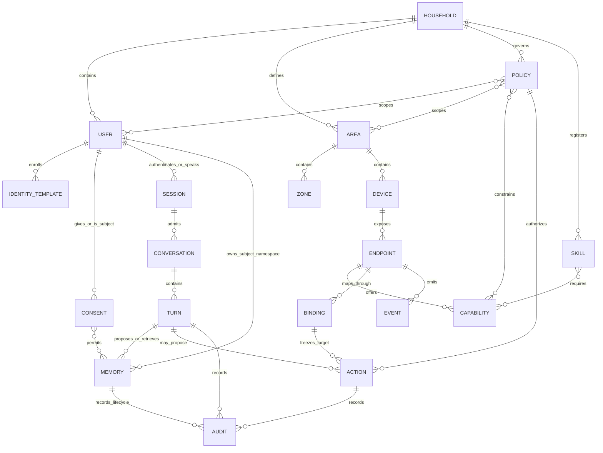

Phase relationships that must not be inferred from the general diagram:

- `camera_binding` is an `endpoint` extension, but neither `security_event` nor `clip` has a relationship to `user`, `identity_template`, `memory`, or `conversation`.
- `knowledge_source` may share the Phase 1 audience enum, but it is not a `memory`; a document claim becomes memory only through a new ordinary proposal/approval flow.
- `area` and its nested versioned `zone` provide routing/privacy context and never establish a `user` or action authority.
- `presence_checkpoint` belongs to an area and expires; it never relates to a person, viewer, or screen-time debit.
- `model_artifact`, plugin, VPN node, or provider can produce a result/observation but cannot relate directly to `auth_grant` consumption or an external action.

### G.5 Seven canonical memory kinds

| Kind | Purpose | Default write | Default lifecycle |
|---|---|---|---|
| Working | Current state summary/unresolved intent, never transcript | Automatic within active session | Session end + 30-minute cleanup grace |
| Episodic | Approved summary of an event/participants | Explicit approval | 180 days unless pinned/changed |
| Semantic | Stable subject–predicate–object fact | Pending approval | Review every 365 days |
| Preference | Category/key/value/confidence | Pending approval | Review every 365 days |
| Procedural | Inert named steps, never executable authority | Explicit owner approval | Review every 365 days |
| Relational | Approved relationship between profile IDs | Explicit owner approval | Until changed/revoked; annual review |
| Policy | Registry-backed typed control value | Fresh owner passkey | Until superseded; complete revision history |

All durable child kinds require current `child_durable_memory_v1` guardian consent plus a separate exact current-primary-guardian approval. A durable child record uses `guardian_child` or an explicitly approved child-safe `household_all`; child `subject_private` and `household_adults` records are invalid. Guest retrieves no memory. Pending/rejected/expired/deleted/superseded/revoked records never enter context.

Memory-body visibility is audience- and subject-bound, not administrator-bound. An adult subject may reveal/export/delete that subject's own `subject_private` memory through the local subject-privacy ceremony; an owner who is not the subject sees only opaque lifecycle/safety/consent health and counts. The current primary guardian may access `guardian_child` content only while the exact child, guardian, consent, policy, and record generations match; an owner who is not that guardian sees only opaque health/counts and may suspend personalization or request the guardian ceremony. `household_adults` and `household_all` remain limited by record sensitivity and consent. Policy-memory bodies are owner-visible because they are system authority. Children and Guests receive no browser memory administration. Deletion may crypto-shred a record without revealing its body to an administrator first.

### G.6 Storage map

| Store | Contents | Encryption/key scope | Exclusions |
|---|---|---|---|
| `tuntun.db` | Household/profile/policy/auth/session/memory/topology/action/audit/usage metadata | SQLCipher; separate Keychain roots and per-record DEKs where required | Raw audio/video/transcript, HA credentials, knowledge objects, plugin caches |
| Vision catalog | Segment/clip/event/health/retention metadata and opaque storage tokens | Separate SQLCipher DB and Keychain namespace | Family identity/name/memory, raw frames/thumbnails |
| `TUNTUN_VIDEO` | Continuous/event media files | APFS encrypted dedicated volume/quota | HA backups, cloud sync, indexing, Time Machine, general share |
| HA Green stores | Device state, custom-integration receipts/routines, minimal operational history | HA/backup encryption and controller epoch | Tuntun identity/memory/transcript/provider data, Reolink media |
| `HA_BACKUPS` | Encrypted Green backup artifacts only | Dedicated encrypted volume/share and Green-only account | Video and canonical Tuntun paths |
| Knowledge catalog/object store | Provenance/ACL/chunks/FTS plus application-encrypted document objects under one configured canonical root | Distinct SQLCipher/wrapped object DEKs and a bound volume UUID; default support path or one owner-selected `TUNTUN_KNOWLEDGE` root, never both; an independent recovery destination has separate policy/key/volume lifecycle and is never queried | Canonical memory, camera media, model caches, multiple active corpus roots, general shares |
| Model cache/index/cache | Pinned weights and rebuildable indexes | Encrypted host storage as supported; manifest digests | Household backups by default; cannot extend source retention |
| Audit/logs | Append-only content-minimized receipts; content-free operational status | SQLCipher/audit HMAC keys; owner-only log files | Prompts, transcript, audio, video, memory/document bodies, secrets |

### G.7 Retention and deletion matrix

| Data class | Default retention | Deletion/expiry rule |
|---|---|---|
| Pre-wake audio | 3–5 second endpoint RAM ring | Continuously overwritten; clear on mute/error/restart |
| Post-wake raw audio | RAM only, maximum 90-second/8 MiB turn | Clear on completion/cancel/privacy; no app-managed durable copy |
| Verbatim transcript / ordinary answer context | Process memory only | Clear when turn settles; working summary is derived, not verbatim |
| Reachy identity frames/source samples | RAM during exact operation | Clear immediately after identity/enrollment; only encrypted templates remain |
| Unknown biometric candidate | Not stored | Unknown or uncertain active interactions become Guest; no passive discovery queue or candidate record exists |
| Working memory | Session + 30 minutes | Bounded cleanup and backup no-resurrection rules |
| Pending memory proposal | Maximum 30 days | Rejection makes content inaccessible immediately, then bounded purge |
| Approved memory | Kind-specific Section G.5 lifecycle | Owner/guardian-governed crypto-inaccessibility; audit tombstone only where required |
| Audit receipts | Integrity chain retained; UI/export defaults to recent 180 days | Profile deletion removes pseudonym mapping; bodies never present |
| Provider cost ledger | 13 months | Bounded maintenance after finance/audit window |
| Tuntun encrypted backups | 7 daily + 4 weekly | Delete every managed generation containing deleted profile/data before clean backup |
| HA Recorder | Explicit allowlist, 10 days | Routine backups exclude Recorder; diagnostic full backup expires within 10 days |
| HA terminal action receipt | Full live detail through terminal +10d; tombstone through +30d | Backup artifacts may retain full detail to +38d and tombstone to +58d; archive deletion is the bound |
| Learning-mode projection/draft | Maximum 30 days | Disable deletes projections/unapproved drafts |
| Screen-time session detail | 30 days | Content-minimized policy/audit receipts follow audit view rules |
| Camera continuous video | Exactly 7 days after segment end | First maintenance pass no later than 15 minutes; no low-space early deletion |
| Camera event clip | Exactly 90 days after clip/event end | Same bounded expiry; incident beyond 90 days requires explicit separate export |
| Camera transient event ring | Maximum 60 seconds unless promoted | Unpromoted fragments deleted; audio always absent |
| Presence | Current encrypted checkpoint only; camera-occupied max 5 minutes | Remove at original expiry; no movement/person/child history |
| Playback authorization | Each P3 byte/time-range playback grant is single-use and ≤60 seconds. Phase 6 may additionally hold one remote single-clip media session for ≤10 minutes, but every range request still mints a fresh P3 grant within the 60-second cap | Session/clip/operation/range-bound; revoke on use, expiry, session, privacy, route, or policy change |
| Room/display audio/content cache | RAM/session only | Clear on end/expiry/privacy/reboot; no screenshots/history |
| Provider entitlement review | 90 days or immediate relevant change | Expiry disables new Tuntun playback |
| Failed knowledge import | Maximum 24 hours | Destroy quarantine; not searchable |
| Superseded knowledge version | Inaccessible; delete after 30 days unless explicitly pinned | Destroy object/version keys, chunks, FTS, embeddings and managed backup copies on source deletion |
| Knowledge citation capability | Turn end + 5 minutes | Cannot grant object download |
| Desktop grant | Maximum 60 minutes baseline | Revocation immediate; job cannot outlive grant/authorization bounds |
| Selected frame request | `local_anonymous_cv_observation` only; one to three frames, ≤3 MiB total, ≤1920 px maximum dimension, maximum 5 seconds | RAM-only; clear on result/refusal/cancel/privacy/timeout/quota/crash; separate local non-generative CV appliance only |
| Robot motion lease | Maximum 250 ms | Missing next lease triggers local stop; no restart/session replay |
| Remote owner session | 15-minute idle / 8-hour absolute | Any VPN/passkey/policy/revocation-generation change invalidates immediately |

Deletion means cryptographic inaccessibility and managed-copy removal where specified; it never claims physical byte erasure from SSD flash. Owner exports and vendor-native copies are separately disclosed and outside Tuntun's revocation control.

---

## H. Versioned API and event contract catalogue

### H.1 Contract rules

1. Every wire or durable payload has a registered schema ID and version. JSON is UTF-8, Unicode NFC, RFC 8785/JCS-canonical where signed, and rejects duplicate keys, non-finite numbers, unknown fields, unknown enum values, and unsupported versions.
2. Public contracts follow semantic versioning; released current-major support lasts through the current stable release and one documented migration release. Internal event schemas use an immutable `*.vN` name or integer `schema_version`; a breaking field/semantic change creates a new version.
3. Consumers fail closed on an unknown major, field, action/event type, payload discriminator, signature domain, generation, or feature. A newer capability is not silently down-converted.
4. IDs are random UUIDs or pseudonymous local mappings. Time is UTC with explicit precision. Money is integer micro-SGD. Physical values include fixed units.
5. Commands carry exact target/binding/capability/policy/auth/generation commitments, issue/expiry times, correlation, idempotency, key ID, and signature where they cross a trust boundary.
6. Events are observations, not authorization. Results are untrusted until schema/freshness/generation validation. No event can directly become a device action, memory write, desktop job, or robot lease.
7. Cross-process retry is at-least-once only where the receiver has a durable idempotency record. Unknown in-flight external effect is reconciled and never reissued under a new key automatically.
8. Errors use stable safe codes; responses, logs, and UI messages never include stack traces, provider bodies, transcript, media path, secret, credential, raw device error, or cross-profile existence signal.
9. No browser, model, plugin, or endpoint receives canonical domain tables. Each gets a minimum purpose-specific DTO.

### H.2 Logical transport catalogue

| Interface | Transport / authentication | Contract family | Producer → consumer | Retry/idempotency |
|---|---|---|---|---|
| Reachy/room edge | Outbound mTLS `wss`; device Ed25519/JCS control envelopes; bounded binary media frames | Phase 1 edge envelope; `SpeechEndpointRegistrationV1`, wake claim, `CaptureLeaseV1`, `SpeechFrameV1` | Endpoint ↔ Mac gateway | Persistent device sequence; duplicates/stale generations rejected; reconnect requires new wake |
| Owner UI | Same-origin localhost HTTP or paired HTTPS; session + Origin/CSRF; WebAuthn for step-up | `ui.household_posture.v1`, `ui.prepared_action.v1`, `ui.operation_result.v1` | Mac API ↔ browser | Read models cache only to `valid_until`; mutation uses server prepared ID + one idempotency key |
| Subject/guardian decision | Separate local same-origin subject zone; subject-bound WebAuthn; one-use opaque ceremony, no owner cookie/session | `ui.subject_self_service.v1`, `ui.guardian_exact_decision.v1`, matching prepared commitment/result | Mac subject API ↔ adult/current-primary-guardian browser | One subject/child/resource/decision only; expiry/revoke/generation change ends it; no navigation or upgrade into owner API |
| Shared display | Paired mTLS/HTTPS and signed manifest; no owner cookie/API | `ui.display_projection.v1`, `TeachingSessionManifestV1` | Display service → agent | Session/manifest digest prevents substitution; expiry/clear are authoritative |
| Internal domain events | Typed bounded in-process router | Cross-domain event envelope + registered payload | Core modules | Event/dedupe IDs; no durable broker or implicit replay |
| Home Assistant state/action | Pinned HTTPS/WSS, P-256 challenge/proofs and domain-separated signatures | State snapshot/delta; closed action; scene/routine/media/TV envelopes and receipts | Mac adapter ↔ HA custom integration | HA durable receipt; same key/content only; controller/verifier generations |
| Camera metadata | Local process IPC with OS identity and schema validation | `camera.security_event.v1`, `recording.health.v1`, `presence.changed.v1` | Video plane → policy plane | Dedupe key and binding generation; raw media excluded |
| Camera playback | Same-origin authenticated byte-range proxy with opaque capability | `media.playback_grant.v1` | Owner API/media broker → video proxy/browser | Grant bound to session/clip/view/operation/range; short-lived and no-store |
| Inference | Local mTLS/JCS-signed request to appliance; approved TLS SDK to cloud | `SanitizedInferenceRequestV1`, `InferenceResultV1` | Mac gateway ↔ model adapter/proxy | Request/cancellation IDs; late/cancelled result discarded; route cannot change privacy zone |
| Desktop | Owner-only Unix-domain socket with peer credentials in initial pilot | `DesktopGrantV1`, `DesktopCommandProposalV1`, `DesktopWorkflowManifestV1`, job result | Desktop policy ↔ helper | Exact state/argv/executable/grant commitment; each job separately consumed |
| Robot | Paired mTLS/WSS plus signed rapidly expiring envelopes | session activation, `RobotMotionLeaseV1`, `robot.safety_state.v1` | Mac robot policy ↔ edge/safety | Strict sequence; lease ≤250 ms; replay/reorder/expiry stops/rejects |
| Remote access | VPN peer path to pinned HTTPS owner origin plus passkey app session | `remote_session.v1`, remote route/node state | Owner device ↔ Mac owner API | Revocation generation terminates sessions; remote origin never upgrades authority |
| Plugins | Authenticated Unix socket from a fresh constrained process | `plugin.manifest.v1` + only the `phase6.initial.1` health-render or local-alert-render request/result DTOs | Core ↔ plugin supervisor/child | Correlation/grant generation, 5-second/64-KiB/resource limits, no network or writable mount; late results discarded and sandbox erased |

The concrete owner facade exposes these same-origin operation groups under `/api/v1`:

- `GET /api/v1/ui/posture` — `ui.household_posture.v1`;
- `GET /api/v1/ui/features` — signed feature-manifest projection;
- `GET /api/v1/ui/{domain}` — bounded server-authorized phase read models with opaque cursors;
- `POST /api/v1/actions/prepare` — canonicalize an allowlisted operation and return `ui.prepared_action.v1`;
- `POST /api/v1/actions/{prepared_action_id}/authorize` — complete the declared confirmation/PIN/passkey/local-presence challenge;
- `POST /api/v1/actions/{prepared_action_id}/execute` — consume matching grant/idempotency in the authoritative transaction and return `ui.operation_result.v1`;
- `POST /api/v1/privacy/shield` — immediate privacy-enhancing transition, with no voice-only disable counterpart;
- `GET /api/v1/media/{opaque_grant_id}` — one exact capability-bound byte-range stream, never a storage/camera URL.

Domain routes are registered only by the signed feature manifest. A missing Phase 3 feature therefore produces `FEATURE_ABSENT`, not an empty camera page that suggests recording exists.

The subject/guardian zone is a distinct route group and session namespace. It accepts only server-prepared self-consent revocation, one own-memory reveal/export/delete, or one registered guardian decision; owner initiation never transfers an owner bearer session. Direct owner-route, other-subject, bulk, policy, device, camera, corpus, desktop, robot, backup, audit and remote requests from that namespace are indistinguishably denied. The UI execution plan fixes the concrete paths and tests them across direct URL, API, prepared-action issuance, cookie/storage, feature registration and client-bundle reachability before Phase 1 family use.

### H.3 Common event envelope

```text
CrossDomainEventV1
  event_id
  schema_version
  event_type
  source_endpoint_id
  observed_at
  ingested_at
  correlation_id
  causation_id
  deduplication_key
  sensitivity_class
  payload
```

Payload type must match `event_type`. Device events contain no speaker identity, transcript, biometric, private memory, credential, or authorization. Registered families include:

| Event type | Purpose | Important prohibition |
|---|---|---|
| `device.state_changed.v1` | Allowlisted endpoint state/availability observation | No actor inference or arbitrary HA attribute bag |
| `action.result.v1` | Truthful terminal/reconciliation state | Acceptance is not physical verification |
| `camera.security_event.v1` | Native event class/zone/time/quality, positive privacy-policy and Privacy Shield generations, and optional opaque clip ref | No name, face/body vector, URL/path, greeting or action; a pre-Shield generation cannot replay after resume |
| `recording.health.v1` | Stream/event/recorder/storage/gap health | No camera raw error/path/credential |
| `presence.changed.v1` | Current anonymous area `occupied/vacant/unknown` with expiry | No person/viewer/history; no vacancy from missing camera event |
| `media.player_state.v1` | Registered player desired/observed state | No provider credential or inferred listener |
| `tv.observation.v1` | Exact TV dimensions/strength/freshness | No viewer/content inference; ACK alone is not proof |
| `robot.safety_state.v1` | Motion/e-stop/sensor/zone/battery/indicator state | No raw video/map/person/conversation |

Synthetic example:

```json
{
  "event_id": "6aa7c33f-b72b-43f2-a722-5cd43a0f1f8c",
  "schema_version": 1,
  "event_type": "camera.security_event.v1",
  "source_endpoint_id": "ep_8f1d40b8",
  "observed_at": "2026-08-27T12:30:00.000000Z",
  "ingested_at": "2026-08-27T12:30:00.120000Z",
  "correlation_id": "f53938a4-911b-4558-a511-fb20a65fd962",
  "causation_id": null,
  "deduplication_key": "dedupe_8cd44f85",
  "sensitivity_class": "household_private",
  "payload": {
    "camera_binding_id": "cam_bind_62d9",
    "camera_binding_generation": 4,
    "area_id": "area_common_02",
    "zone_id": "zone_entrance_01",
    "zone_generation": 5,
    "event_class": "person",
    "detector_basis": "device_native",
    "detector_version": "native-3",
    "started_at": "2026-08-27T12:29:58.000000Z",
    "ended_at": null,
    "confidence_band": "medium",
    "verification": "native",
    "clock_quality": "synchronized",
    "clip_ref": "398cb99f-6b9d-4cd7-9aa2-0a844043513c",
    "view_set": "wide",
    "privacy_policy_version": 7
  }
}
```

### H.4 Closed action envelope and result

```text
ClosedActionEnvelopeV1
  action_id
  action_schema_version
  action_type
  target_endpoint_id
  desired_state
  controller_epoch
  topology_version
  binding_id / binding_generation / binding_digest
  resolved_external_entity_commitment
  expected_capability_digest
  policy_version
  authorization_commitment
  signing_key_id
  authorized_at / issued_at / expires_at
  idempotency_key
  correlation_id
  envelope_signature
```

The HA integration validates and commits `PRE_DISPATCH` before physical I/O. The canonical lifecycle is:

```text
PREPARED
  -> AUTHORIZED_COMMITTED
  -> SIGNED
  -> DISPATCHING
  -> RECONCILING
  -> VERIFIED | ACCEPTED_UNVERIFIED | FAILED | UNKNOWN | EXPIRED
```

Synthetic action example; `envelope_signature` is deliberately non-secret test material:

```json
{
  "action_id": "cc24b2a3-3f90-40bb-84e6-98270b17c71f",
  "action_schema_version": 1,
  "action_type": "light.set_brightness.v1",
  "target_endpoint_id": "ep_light_synth_01",
  "desired_state": {"on": true, "brightness_percent": 40},
  "controller_epoch": "epoch_synth_03",
  "topology_version": 12,
  "binding_id": "bind_synth_01",
  "binding_generation": 6,
  "binding_digest": "sha256:1111111111111111111111111111111111111111111111111111111111111111",
  "resolved_external_entity_commitment": "hmac-sha256:synth-entity-commitment",
  "expected_capability_digest": "sha256:2222222222222222222222222222222222222222222222222222222222222222",
  "policy_version": 9,
  "authorization_commitment": "hmac-sha256:synth-authorization",
  "signing_key_id": "action-key-synth-02",
  "authorized_at": "2026-08-27T12:35:00.000000Z",
  "issued_at": "2026-08-27T12:35:00.100000Z",
  "expires_at": "2026-08-27T12:35:30.000000Z",
  "idempotency_key": "idem_4e248132",
  "correlation_id": "bdab1735-4782-44d5-bd4f-8e282e07eb58",
  "envelope_signature": "TEST_SIGNATURE_NOT_VALID_IN_PRODUCTION"
}
```

Wildcard targets, `toggle`, relative desired state, caller-supplied service names, templates, arbitrary arguments, and reused idempotency keys with changed content are invalid.

### H.5 UI projection and prepared-mutation examples

```json
{
  "generated_at": "2026-08-27T12:40:00.000000Z",
  "feature_manifest_version": "1.0.0-synthetic",
  "route_origin_class": "localhost",
  "facts": [
    {
      "fact_id": "fact_recorder",
      "plane": "reolink_recorder",
      "state": "active",
      "controller": "video.recorder.v1",
      "evidence_source": "recorder",
      "evidence_generation": 12,
      "verification_strength": "authoritative",
      "reason_code": "healthy_recording",
      "safe_summary_message_id": "recorder.running.independent",
      "evidence_observed_at": "2026-08-27T12:39:59.000000Z",
      "valid_until": "2026-08-27T12:40:10.000000Z",
      "owner_route": "/cameras"
    }
  ],
  "attention_counts_by_severity": {"critical": 0, "warning": 1, "info": 0},
  "privacy_shield_generation": 7,
  "privacy_shield_authority_state": "inactive",
  "privacy_effects": []
}
```

```text
ui.prepared_action.v1
  prepared_action_id
  action_name
  safe_title_message_id
  safe_parameter_rows[]
  consequence_message_ids[]
  resource_version
  policy_version
  risk_tier
  required_assurance
  local_presence_required
  authorization_policy: one_principal | all_named_distinct_principals
  principal_slots[]: slot_id, role, subject_scope, guardian_generation,
                     must_be_distinct_from_slot_ids[], state
  expires_at
  idempotency_key
```

The server—not the browser—canonicalizes values and builds the binding. Any resource/policy/principal/guardian change, edit, expiry, origin downgrade, stale challenge, slot substitution, distinctness failure, or idempotency mismatch invalidates it. The UI/UX specification's Section 21 is normative for `ui.plane_fact.v1`, per-target `ui.operation_result.v1`, subject self-service, exact guardian decisions, Privacy Shield effects, and the signed closed `ui.display_projection.v1` union. No `safe_payload`, arbitrary card/body map, HTML, URL, credential, raw memory, or camera media variant exists.

### H.6 Specialized contract catalogue

| Contract | Owning phase | Minimum binding | Authority limit |
|---|---:|---|---|
| Phase 1 signed edge envelope/binary media header | 1 | Device/household/session/sequence/type/time/signature and size quotas | Transport only; cannot claim identity or policy |
| Memory proposal/approval record | 1 | Subject/audience/kind/typed claim/sensitivity/source/consent/policy/version/expiry | Proposal cannot self-commit; child requires current guardian |
| Bounded scene manifest | 2 | 1–12 exact light endpoints, child idempotency keys, immutable digest/generations/deadline | No dynamic membership, nested scene, non-light endpoint or atomic physical-success claim |
| Signed bounded routine manifest | 2 | Closed time/light triggers/conditions/actions, generation CAS, owner passkey digest | No YAML/template/general automation, chaining or burst replay |
| `camera.security_event.v1` | 3 | Exact camera-binding generation, canonical area, zone ID and zone generation, class/basis/time/quality/policy; optional opaque clip ref | No identity, greeting, action, path or URL |
| `presence.changed.v1` | 3 | Area/state/count band/source kinds/policy/confidence/time/expiry/reason | Current anonymous state only; no person/history/viewer |
| `media.playback_grant.v1` | 3 | Owner subject/session/clip/view/operation/range/time/policy/commitment | No reusable stream credential or directory access |
| `CaptureLeaseV1` / `SpeechFrameV1` | 4 | Endpoint/canonical `area_id`/turn/slot/session/privacy/capability/time/format/quota/signature | Losing/stale/muted frame never reaches provider |
| `SignedMediaEnvelopeV1` | 4 | Exact player/group manifest, catalog handle/state, provider/binding/policy/auth/idempotency/time/signature | No actor identity/transcript or arbitrary URL/provider admin |
| `TeachingSessionManifestV1` | 4 | Session/audience/language/display/closed components/hashed assets/policy/expiry/signature | No open browser, script, memory or action authority |
| `SignedTVActionV1` / `TVObservationV1` | 4 | Exact endpoint/adapter/generations/operation/state/evidence strength/freshness | No arbitrary keys; observation cannot infer viewer |
| `SanitizedInferenceRequestV1` / `InferenceResultV1` | 5 | Task/capability/sensitivity/execution zone/trust-labelled segments/schema/limits/policy/model/template/reservation/signatures | No stable household IDs, credentials, tools, action/memory authority; output untrusted |
| `DesktopGrantV1` | 5 | Subject/device/level/exact roots/identities/globs/quotas/registries/network/time/policy/auth | No secret roots, symlink/mount escape, ambient shell/network |
| `DesktopCommandProposalV1` | 5 | Registered executable/argv/cwd/env/reads/writes/network/limits/state commitment | Proposal only; exact confirmation and state recheck required |
| `DesktopWorkflowManifestV1` | 5 | Signed steps/commands/mounts/artifacts/network/resources/sandbox/owner auth/expiry | Disposable sandbox only; cannot modify/commit/push live repo |
| `selected_frame_request.v1` / `anonymous_visual_observation.v1` | 3/5 | Exact P3 event, canonical area, zone ID/generation, camera-binding generation, purpose=`local_anonymous_cv_observation`, schema, 1–3 frames, ≤3 MiB, ≤1920 px, ≤5 seconds, privacy generation, calibration and CV artifact | Separate local non-generative perception only; no language model/VLM, caption, identity, demographics, OCR, tool, action, greeting, memory, reusable media handle, cloud, or VPS route |
| `RobotMotionLeaseV1` | 5 | Robot/session/sequence/≤250 ms expiry/geofence/safety digest/velocities/owner/controller/signature | Deterministically clamped manual input only; model cannot emit |
| `remote_session.v1` | 6 | App actor, VPN adapter/node pseudonym, device approval, passkey assurance, expiries/operations/policy/revocation | VPN membership alone grants nothing; local-only operations remain denied |
| `plugin.manifest.v1` | 6 | Exact publisher/artifact/signature/protocol fields, registry revision=`phase6.initial.1`, requested capability IDs, entry point, licence and SBOM; no publisher-controlled resource or policy field | Exactly `system.health.render.v1` and `notification.local_alert.render.v1`; closed local display text only, fresh no-write process, no network/DNS/redirect/persistence and no publisher-defined policy |

### H.7 Safe error envelope

```text
error.v1
  error_id
  code
  category: validation | authentication | authorization | conflict | unavailable | timeout | integrity | rate_limit
  correlation_id
  retryable
  safe_message_id
  current_resource_version: optional
  required_action: none | reauthenticate | refresh | local_owner | manual_recovery
```

| Code | Meaning | Retry rule |
|---|---|---|
| `SCHEMA_UNSUPPORTED` | Unknown major/schema/field/discriminator | Upgrade or disable feature; do not retry unchanged |
| `FEATURE_ABSENT` | Owning accepted feature is not installed/registered | No retry until signed feature state changes |
| `AUTHENTICATION_REQUIRED` | No valid app session | Reauthenticate through declared local/VPN origin |
| `ASSURANCE_INSUFFICIENT` | Exact action needs confirmation/PIN/passkey/local presence | Prepare a new exact challenge; never reuse old grant |
| `POLICY_DENIED` | Actor/audience/child/room/time/sensitivity policy denies | No automatic retry or route substitution |
| `IDENTITY_UNCERTAIN` | Evidence cannot safely personalize | Continue as Guest; action remains restricted |
| `PRIVACY_BLOCKED` | Privacy generation forbids processing/egress | No retry until authenticated local policy change |
| `BUDGET_HARD_STOP` | Worst-case reservation would exceed S$150 cap | Offline inability; no provider/model downgrade that weakens policy |
| `STALE_GENERATION` | Policy/topology/binding/capability/resource changed | Refresh and prepare a new request |
| `DUPLICATE_MISMATCH` | Idempotency key was reused with different content | Security error; never execute |
| `DEPENDENCY_UNAVAILABLE` | Required edge/HA/camera/player/model/TV/helper is unhealthy | Preserve manual/offline behavior; retry only through bounded health policy |
| `OUTCOME_UNKNOWN` | External I/O may have occurred but cannot be proved | Reconcile/manual check; never issue a new action automatically |
| `INTEGRITY_FAILURE` | DB/audit/catalog/signature/backup evidence is invalid | Quarantine affected capability and require local recovery |
| `RATE_LIMITED` | Bounded component/action quota exceeded | No delayed unsafe queue; retry only after declared window/new intent |
| `REMOTE_OPERATION_DENIED` | Operation is local-only or remote class disabled | Perform locally; remote route cannot elevate |

An HTTP facade may map validation to `400`, unauthenticated to `401`, authorization to `403`, conflict/stale/idempotency to `409`, rate limit to `429`, unavailable to `503`, and accepted-but-unresolved asynchronous operations to a versioned operation resource. The domain `code` and terminal state—not an HTTP phrase—remain the authoritative result.

### H.8 Contract compatibility and release gate

Every contract release must ship:

- canonical schema and generated producer/consumer validators;
- positive fixtures plus unknown-field/version, truncation, oversize, replay, reorder, signature, expiry, enum, cross-household, cross-profile and wrong-payload negative fixtures;
- transport quotas, deadline/cancellation rules, and content-safe observability fields;
- explicit migration from the prior supported version and rollback behavior;
- a feature-manifest entry binding implementation, schema, policy corpus, migrations, UI module, negative-reachability evidence, and package digest;
- synthetic examples only, scanned for household names, addresses, identifiers, credentials, media, memories and audit content.

No schema is considered complete because it serializes successfully. It is complete only when both ends reject every forbidden authority/data flow and the phase acceptance gate proves the real adapter obeys the contract.

---

## Completion map for A–H

| Deliverable | Authoritative section |
|---|---|
| A — Project charter | Section A |
| B — Scope decomposition | Section B |
| C — Architecture alternatives | Section C |
| D — Written/component/deployment/trust/local-cloud/network architecture | Section D |
| E — Normalized component catalogue | Section E |
| F — Nine required sequence diagrams | Section F |
| G — Canonical entities, relationships, storage and retention | Section G |
| H — API/event contracts, examples, errors and versioning | Section H |
