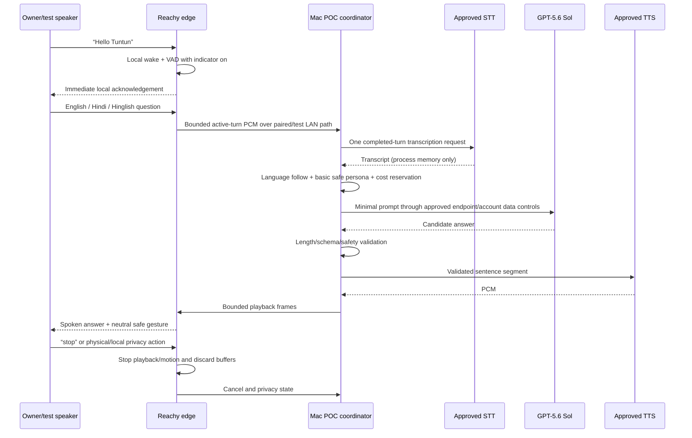

# Tuntun Program Assurance and Delivery Specification — Deliverables I–S

**Status:** consolidated six-phase design baseline complete; implementation not started
**Date:** 2026-08-27
**Scope:** whole-system security, privacy, procurement, stack, repository, testing, operations, cost, risk, decisions, and first proof of concept
**Primary deployment:** one owner-managed household in Singapore
**Authority:** this document indexes and connects the phase specifications; it does not weaken a phase gate or create a capability that its phase specification excludes

## 0. Normative map and interpretation

The following specifications remain normative for feature behavior and phase acceptance:

| Design authority | Normative subject |
|---|---|
| [Phase 1 — Anchor](./2026-08-27-tuntun-phase1-anchor-design.md) | Reachy conversation, identity, family policy, seven memory kinds, cloud routing/budget, authentication, privacy, backup, and the initial owner API |
| [Phase 2 — Home Automation](./2026-08-27-tuntun-phase2-home-automation-design.md) | Home Assistant Green, topology, closed actions, lights, routines, screen-time policy, and device-plane recovery |
| [Phase 3 — Vision, Presence & Storage](./2026-08-27-tuntun-phase3-vision-presence-storage-design.md) | Reolink isolation, local recording, retention, playback, alerts, anonymous presence, and the SSD/NAS evidence gate |
| [Phase 4 — Voice, Media & Displays](./2026-08-27-tuntun-phase4-voice-media-displays-design.md) | Room speech nodes, arbitration, media, teaching displays, exact-TV qualification, and real screen-time enforcement |
| [Phase 5 — Private AI, Desktop & Robotics](./2026-08-27-tuntun-phase5-private-ai-desktop-robotics-design.md) | Staged local inference, document corpus, desktop capability grants, selected-frame vision, Raspbot, and the LILYGO experiment |
| [Phase 6 — Remote Access & Product Hardening](./2026-08-27-tuntun-phase6-remote-access-product-hardening-design.md) | VPN-only remote access, system threat model, plugin isolation, release integrity, incident handling, and public packaging |
| [Six-phase UI/UX](./2026-08-27-tuntun-six-phase-ui-ux-design.md) | Owner console, Reachy/family surfaces, shared displays, truthful state, accessibility, localization, and UI engineering boundaries |

Rules for resolving this consolidation are deterministic:

1. A more restrictive safety, privacy, identity, child, network, retention, or authorization rule wins.
2. A conditional feature is absent until the named positive gate passes; a disabled toggle is not evidence of absence.
3. Estimated prices are planning inputs, never purchase approval. Exact SKU, landed cost, warranty, and capability evidence are captured at the procurement gate.
4. The current household has one owner/operator. Public contracts may represent multiple owners, but no second-owner authority is enabled without a new policy decision.
5. This document completes master-prompt deliverables **I through S**. System/component/data/API architecture and sequences remain in deliverables A–H and the linked phase specifications.

---

## I. Whole-system security threat model

### I.1 Security objectives and trust boundaries

The protected assets are family identity and biometric templates; child and adult-private data; seven-kind memory; audio, video, documents, and derived observations; household-device authority; desktop grants; robot motion; provider and device credentials; passkeys and recovery keys; signing keys; audit integrity; backups; service availability; and the accuracy of privacy/status claims.

The principal trust boundaries are:

- **Human and room → endpoint:** microphones, Reachy identity camera, physical controls, room class, and nearby bystanders.
- **Endpoint → Mac:** per-device paired channels; an endpoint is authenticated but still least-privilege and potentially compromised.
- **Browser → owner API:** exact origin, session, passkey, object authorization, prepared actions, and no browser-owned authority.
- **Mac core → Home Assistant/video/media/desktop/robot:** closed purpose-specific ports; no shared administrator credential or general tool surface.
- **Mac → cloud/VPS:** outbound-only, minimized provider requests; every result is untrusted and has no direct action authority.
- **Private data → model/plugin/parser:** content is data, never instruction; strict schema, quota, process, and capability boundaries apply.
- **Home → VPN:** Phase 6 exposes only the owner-console origin to approved devices; VPN membership does not authenticate to Tuntun.
- **Source/build → installed release:** dependency, maintainer, CI, signing, notarization, provenance, SBOM, migration, and rollback boundary.
- **Live state → backup/restore:** encrypted portable archive; excluded live credentials are recreated; restored actions remain quarantined.

### I.2 Threat-to-phase control and verification map

Phase 6 Section 10 is the authoritative threat description and residual-risk register. This table proves that every `T01`–`T25` threat has a prevention/detection owner and an evidence route rather than repeating its prose.

| Threat | Primary phase controls | Cross-phase assurance | Release evidence |
|---|---|---|---|
| `T01` voice imitation/replay | P1 local quality/liveness fusion; biometric personalization only; uncertain result becomes Guest | P2–P5 actions still use policy and step-up; room endpoints cannot upgrade identity | Recorded/synthetic replay corpus; zero sensitive authorization from voice; Guest fallback receipts |
| `T02` face presentation/replay | P1 interaction-gated Reachy camera, local liveness, expiring encrypted templates | P3 explicitly prohibits Reolink identity; P4 rooms/TVs are not identity sensors | Print/screen/replay tests; identity route absent when liveness gate fails |
| `T03` cross-profile/child disclosure | P1 namespace, audience, guardian, consent, pre-search/pre-decrypt/pre-egress checks | UI API object authorization; corpus/desktop and remote projections preserve subject policy | At least 1,000 randomized isolation cases; private sentinels absent from wrong-profile output |
| `T04` prompt injection | P1 two-pass web boundary and proposal-only models | P3 camera metadata, P4 manifests, P5 documents/output/frames, and P6 plugins remain untrusted typed data | Adversarial web/document/media/output corpus; no injected action, memory write, policy change, or tool call |
| `T05` camera compromise | P3 separate camera-source/recorder/media processes, least credentials, no audio, no identity or HA media edge | P2 action plane and P1 memory/key roots are unreachable; P5 selected frames are bounded/local-only | Credential-leak, parser-fuzz, lateral-reachability, WAN-off, and revoke/re-pair tests |
| `T06` Reachy/room compromise | P1/P4 per-device keys, signed/mTLS events, replay bounds, edge-local stop/mute | Endpoint receives no provider, database, policy, memory, HA, VPN, or owner credential | Clone/replay/stale-sequence tests; stolen-device revocation; negative secret and route scan |
| `T07` Home Assistant/IoT compromise | P2 signed minimized bridge, endpoint allowlist, durable action state, no Tuntun key in HA | Models only propose; manual/vendor bypass is disclosed and never written as a Tuntun authorization | Forged/stale result, topology drift, HA outage/restore, and lateral-access tests |
| `T08` hallucinated/escalated tool | P1 proposal schema plus local policy; P2 closed action registry and binding generation | P4 media/TV and P5 desktop/robot each have separate capability registries | Unknown action/field/target, stale binding, altered payload, replay, and late-result property tests |
| `T09` child policy/screen-time bypass | P1 guarded-child policy and distinct guardian; P2 allowance state machine | P4 adapter needs independent observation for Strict; physical bypass is visibly disclosed | Child/adversarial corpus; clock/restart/manual-override tests; no hostile device-control loop |
| `T10` Guest private access | P1 Guest has no memory; scoped Designated-Guest action needs owner co-approval | API, displays, remote route, cameras, corpus, desktop, and robot are owner/policy protected | Actor-by-resource authorization matrix and direct-API negative tests |
| `T11` destructive desktop execution | P5 owner-selected expiring roots; D3 is pinned non-code read-only inspection only; every repository code/test/lint/build/format/generator operation is a fresh-passkey D4 workflow in a proved disposable sandbox | P6 remote desktop execution remains prohibited; model cannot mint grant/executable handle; execution-network and model-egress grants are independent | Symlink/TOCTOU, D3 code-execution denial, shell-metacharacter, D4 escape/network/undeclared-write/cleanup, timeout, replay, and egress-cross-grant tests |
| `T12` unsafe robot motion | P5 adult supervision, commissioned geofence, speed/obstacle/cliff bounds, 250 ms leases/watchdog, independent e-stop | Voice, model, camera, HA, child, Guest, and remote sessions cannot start movement | Wheels-up probe; 100 e-stop trials; stopping-distance and stale-sensor tests; prohibited-area negative route |
| `T13` stolen remote device | P6 approved VPN node, Tailnet Lock, application passkey, short sessions, route revocation | High-impact operations remain local; clip capability is short-lived and owner-bound | Lost-device drill; concurrent revocation; session/capability replay; no inner-LAN reach |
| `T14` VPN/IdP compromise | P6 app auth remains independent, exact Tailscale `grants` policy for the console and authoritative DNS only, no subnet/exit/Funnel route | Local Tuntun remains usable with VPN/control plane unavailable | IdP outage and wrong-node tests; adapter disable; documented Tailscale exit/migration record; no direct-WireGuard implementation in the six-phase release |
| `T15` public exposure | P1–P5 no public inbound; P6 firewall/interface allowlist and continuous drift checks | UPnP/NAT-PMP/PCP and router forwarding remain disabled | External and both-side network scans after install/update/router change; unexpected listener suspends route |
| `T16` malicious plugin | P6 signed manifest, exact `phase6.initial.1` two-capability registry, fresh out-of-process sandbox, no inherited secrets/network/writable mount, display-only closed result | Canonical domain entities and credentials never cross plugin boundary; plugin cannot suppress or replace core health/alerts | Signature/digest/unknown-capability/IPC fuzz, denial, resource-exhaustion, exfiltration, cleanup and kill tests |
| `T17` malicious update | P6 immutable artifacts, pinned signer/builder, attestation, SBOM, manual approval, health-gated rollback | Pre-update encrypted backup; migrations start quarantined | Wrong signer/repository/workflow/SBOM/tag, downgrade/replay/corruption, failed-health rollback tests |
| `T18` secret exposure | P1 Keychain purpose separation and content-redacted logging | Endpoints/plugins/browser/backups exclude live secrets; P6 scanning and rotation runbooks | Repository, artifact, process-log, browser, export, crash, and fixture sentinel scans |
| `T19` corruption/ransomware | P1 SQLCipher integrity/migrations/backups; P3 video quota/isolation | P6 independent encrypted recovery copy and restore quarantine | Wrong-key/corruption/partial-write/migration interruption; clean-Mac restore and no-action-before-reconcile |
| `T20` backup theft/resurrection | P1 encrypted container, offline recovery key, key-scoped deletion and managed-copy purge | P3 video excluded from normal Tuntun backup; P6 deletion reconciliation | Stolen-archive confidentiality; deleted-profile restore test; owner-export limitation disclosed |
| `T21` exhaustion/DoS/repeated wakes | Per-source byte/time/rate/queue quotas, disk reserves, reservations, circuit breakers | Privacy/stop/manual home controls survive degraded mode | Long audio/JSON/media/archive/parser fuzz, full disk, repeated wake, bounded-restart and soak tests |
| `T22` outage | P1 offline essentials; P2 manual controls; supervised restart with no unsafe replay | P3 recorder truth, P4 manual media/TV, P5 robot local stop, P6 local independence | Power/WAN/provider/DNS/HA/VPN/repository loss injected at every durable state |
| `T23` false event/presence/emergency | P3 native event calibration, dedupe, expiring anonymous state, no inferred vacancy | Alerts precede action; no medical diagnosis or named camera identity | Seeded sequences, clock/outage/duplicate tests, confidence/expiry and false-vacancy gate |
| `T24` overstated privacy | Separate mic, Reachy camera, Reolink recorder, cloud, retention, remote, desktop, robot, and display facts | UI truthful-state contract never equates Privacy Shield with camera recording stop | Physical-state comparison, acknowledgement deadline, degraded/unknown state, and UI copy assertions |
| `T25` malicious maintainer/contribution | Review, least-privilege CI, synthetic data only, private-data scan, signed provenance, manual release | Recovery/transfer procedure and public disclosure policy reduce single-maintainer risk | Fork-PR secret isolation; source-to-artifact attestation; maintainer/recovery-key loss drill |

### Audited Phase 5–6 assurance closure

- The one active canonical Core host is the owner-approved Darwin arm64 Mac in `docs/architecture/decisions/0001-phase1-host-baseline.md`. Phase 6 extends the accepted Phase 3 owner-ingress server on that active host; neither an unstated helper Mac nor a parallel HTTP server may carry authority. The 2020 Intel Mac remains distribution and future-transition hardware until it passes fresh real-host qualification.
- Memory audiences are exactly `subject_private|guardian_child|household_adults|household_all`, with audience-driven subject, guardian, consent, and child-safe approval generations. D3 proposals and every D4 workflow declare `execution_network_policy='none'`; non-none policy values fail schema validation, and D4 runs in a proved disposable sandbox with no network.
- Robot activation, motion lease, readiness, safety, stop, and stop receipt bind the exact current Phase 2 area/zone and robot-binding generations plus activation commitment. Their signature domains do not overlap; disabled camera pairs only with indicator off and verified camera only with verified-on indicator.
- Tailnet Lock is the sole VPN node-admission mechanism and Device Approval is disabled. The canonical provider policy uses a closed `grants` document with separate exact `src`, `dst: ["tag:tuntun-core"]`, and `ip: ["tcp:8443", "tcp:53", "udp:53"]`; port-suffixed destination selectors and legacy ACL documents fail closed. Two-view authoritative DNS and the local certificate bind the exact LAN/Tailnet addresses and policy digest.
- Plugin children receive and return only bounded inner payload bytes using an out-of-band supervisor-selected codec. Recursive captured-wire tests reject request, grant, purpose, generation, time, commitment, plugin/version/capability/codec/registry metadata; the supervisor alone reconstructs and signs the outer result envelope.
- Both backup tiers bind the same exact source snapshot/archive, deletion watermark/generation, key bundle, RPO, and restore eligibility while remaining independent failure domains. Offline bootstrap is one-shot verify/decrypt/quarantine only; it grants no restored credential authority. D4 restore has no network.
- Update journals are owner-only, bounded, canonical, fixed-domain signed envelopes whose digest covers only the canonical payload. Every fsync-backed state transition is legal, monotonic, and CAS-sequenced; recovery arbitrates journals before service exposure, and a recoverable live-process exception immediately invokes the same reconciler under the held global lock.
- Phase 4 maintenance evidence crosses into the Phase 6 aggregate only through a total closed source map and a verified source commitment. Its five subsystem values map to the Phase 4 aggregate; each exclusion has one exact target; ambiguous `quarterly_drill` remains separately classified; and the source `month_key` must equal the UTC month of `occurred_at` before deduplication and summation.
- All release/campaign/C0/C1/publication tooling is committed before the authority-bearing candidate is built. Release order is then build/SBOM/provenance, sign/notarize/staple, hash final bytes, sign the manifest, run real-target/campaign evidence on those exact bytes, and only afterward approve C0/C1 without another tracked change. C0, C1, their accepted approval receipts, the publication manifest, and the publication receipt bind the same artifact-set and named-inventory digests. Public x86_64 and arm64 smoke is collect-only; compatibility additionally requires exact final-artifact real-hardware lifecycle receipts for both architectures. Household UI is read-only for C1; a separate local maintainer terminal holds no household authority.

### I.3 Risk acceptance and security release rule

- A high or critical finding blocks the affected feature and any release claiming it.
- Medium residual risks require an accountable owner, visible operational control, review date, and disable/fallback path.
- Low risks may be accepted in the evidence register when they cannot cross a privacy, child-safety, identity, action, or physical-safety boundary.
- A phase passes only when every omitted optional feature also passes negative-reachability tests across source registration, package manifest, configuration, API, UI, and network.
- No model benchmark, green CI run, VPN connection, camera health result, or device acknowledgement alone proves security.

---

## J. Privacy design

### J.1 Privacy principles

Tuntun is local-first, purpose-bound, data-minimizing, owner-visible, and child-protective. Canonical identity, consent, policy, memory, audit, and keys remain on the Mac. Raw household content is processed only for the active purpose; durable storage requires an explicitly defined data class and lifecycle. Cloud/local is a routing fact shown to the owner, not a synonym for safe/unsafe. A local model, NAS, camera, endpoint, or plugin is still untrusted outside its granted purpose.

Privacy Shield is the canonical generation-changing authority transaction defined by the UI/UX specification's Section 13.1 effect registry. On activation it atomically revokes eligibility for every registered Tuntun authority before fan-out, then separately requests and records downstream stop acknowledgement or physical verification for Tuntun/Reachy capture, active provider egress, room capture, remote application sessions, plugins, desktop jobs, selected-frame requests, displays, and robot motion. A committed authority revocation is never displayed as proof that an independent device physically stopped. It cannot undo earlier egress or writes. The independent Reolink recorder and manual/native Home Assistant, media, and device controls keep their own separately labelled states; the recorder continues unless the owner performs its separate recorder-pause action.

### J.2 Data-flow inventory

| Flow | Source → processor → destination | Purpose and lawful household consent | Durable data and location | External egress | Deletion/retention authority |
|---|---|---|---|---|---|
| `J01` wake audio | Reachy/room mic → local wake/VAD | Detect “Hello Tuntun” and stop; room commissioning plus visible capture/mute | Pre-roll RAM only, 3–5 seconds | None | Ring buffer overwrite; privacy/stop clears current buffer |
| `J02` active-turn audio | Winning endpoint → paired Mac gateway → approved STT | Transcribe one invoked turn; speaker notice/indicator | RAM only, 90-second cap; no app recording | Initial P1 sends bounded audio to the approved cloud STT | Completion/cancel/privacy clears application buffers; provider handling follows current account terms |
| `J03` transcript/context | STT → policy/memory router → approved model | Produce current answer using minimum authorized context | Process memory only; working summary is derived, not verbatim | Sanitized prompt to selected provider when cloud route is eligible | Transcript cleared when turn settles; working summary session + 30 minutes |
| `J04` spoken reply | model → validator → TTS → winning endpoint | Deliver answer in English, Hindi, or Hinglish | No durable waveform | Validated answer text reaches approved TTS | PCM buffers clear after playback/cancel |
| `J05` Reachy identity | current interaction frames/voice → local liveness/fusion | Personalize only; consented enrollment and active interaction | Encrypted expiring enrolled templates; frames/recordings and unknown-candidate records are never durable | None | Template expiry/review follows consent; revoke/delete blocks retrieval immediately and crypto-shreds managed record keys |
| `J06` canonical memory | derived proposal → approval/consent → SQLCipher | Approved personalization across seven closed memory kinds | Encrypted canonical DB, namespace/audience/DEK protected | At most six authorized memories can enter a permitted provider context | Working: session +30m; episodic: 180d; semantic/preference/procedural annual review; relational/policy until change; owner/guardian deletion |
| `J07` web lookup | adult/owner turn → isolated search pass → normalized sources → no-search reasoning | Current-information answer; mode-specific consent | Source commitments/content-minimized receipt, not raw page archive | Search query and bounded excerpts reach approved provider/search service | Per-turn result expires; audit metadata follows audit lifecycle |
| `J08` home action | user intent → policy/confirmation → HA signed bridge → device | Bounded registered household control | Durable action state/result and minimized audit | No internet required by Tuntun; vendor gateway behavior is independently disclosed | Operational/audit lifecycle; device/vendor history follows its own settings |
| `J09` camera recording | Reolink stream → isolated source/recorder → encrypted SSD | Owner security recording in commissioned hall/kitchen zones | 7d low-res continuous; 90d full-res native-event clips | No Tuntun/cloud AI egress; vendor WAN must pass commissioning policy | Automatic retention; explicit export becomes owner-managed copy |
| `J10` camera alert/presence | native event → normalizer/policy → durable local owner inbox and connected-console SSE / anonymous state | Security alert or anonymous occupancy where calibrated | Minimized event/catalog, bounded 24-hour undelivered queue, and expiring state; no identity | None in the baseline; browser notification mirrors only an active paired local page, with no service worker/background push | Event/catalog policy; occupancy expires to unknown; no camera greeting; a closed/asleep page carries no immediate-delivery claim |
| `J11` playback | owner console → capability broker → local media proxy | Owner-only review of local clips | No new durable copy; browser `no-store` | Phase 6 remote playback only after separate opt-in; never public | Remote single-clip media session ≤10 minutes; each requested byte/time range uses a single-use P3 playback grant ≤60 seconds; clip follows recorder retention |
| `J12` room/media/display | room endpoint/request → Tuntun/HA/MA → player or paired renderer | Voice routing, entitled media, bounded teaching | State/manifest receipts only; no raw room audio or display screenshot | Licensed provider traffic under its account; no Tuntun private context to TV/player | Display cache clears at end/expiry/privacy/reboot; media account history is provider-controlled |
| `J13` knowledge corpus | owner-selected file → isolated parser → one identity-bound encrypted corpus root and SQLCipher catalog/FTS/vector index | Cited household/owner document questions | Application-encrypted objects and provenance catalog under one configured volume UUID; rebuildable index; any independent recovery copy has its own policy/key/destination lifecycle | Local by default; cloud/VPS only via separately approved minimized route | Object/version/derived index deletion, managed recovery reconciliation, explicit export disclosure |
| `J14` desktop assistance | owner-selected roots/output → helper → local model or separately authorized provider → reviewed proposal | Owner debugging within expiring grant | Grant, commitment, bounded result/audit; selected raw content not copied to memory/corpus | Local-only by default. Each provider call requires a single-use `DesktopModelEgressAuthorizationV1` bound to exact source commitments, minimized payload, provider/model, purpose, output destination, privacy/policy generations and expiry after DLP | Grant/authorization expiry or revoke; disposable worktree/output cleanup; no ambient screen/clipboard history |
| `J15` selected-frame perception | P3 broker → `selected_frame_request.v1` → isolated local non-generative CV runtime → `anonymous_visual_observation.v1` | `local_anonymous_cv_observation` only; bounded anonymous advisory class evidence, never identity, OCR, captioning, free prose, alert promotion, or occupancy authority | One to three frames, ≤3 MiB total and ≤1920 px maximum dimension, RAM-only; only the typed expiring non-identifying observation may persist; returned count is ignored by Phase 3 | None; language-model, VLM, cloud, and VPS routes prohibited | Request expires in ≤5 seconds; frames clear on success, denial, timeout, cancellation, crash, and privacy activation |
| `J16` robot telepresence | owner local session → Raspbot camera/control → live owner view | Supervised common-area driving | Live video RAM-only; safety telemetry/receipts only | LAN only; remote driving prohibited | Session/lease expiry and privacy/stop clear media/control |
| `J17` owner console/remote | browser → local API; optionally approved VPN device → same origin | Household administration | Server-side session/revocation records and minimized audit | VPN provider receives its own control metadata, not Tuntun bodies | Session idle 15m/absolute 8h; remote detail 180d; security counters 30d unless incident |
| `J18` backups/releases | encrypted state → backup; source/build → public artifact | Recovery and open-source distribution | 7 daily + 4 weekly attached backups; independent encrypted copy; synthetic public artifacts | Optional approved encrypted object backup; public release contains no household data | Managed-copy reconciliation; owner exports are outside revocation; quarterly restore verifies |

### J.3 Room and surface privacy matrix

| Area/surface | Voice | Identity | Camera recording | Display/media | Default policy |
|---|---|---|---|---|---|
| Reachy interaction location | Local wake; post-wake only | Reachy-only, interaction-gated | Reachy is not a security recorder | Spoken reply; safe gestures | Allowed after device pairing, notice, and physical stop/privacy test |
| Hall | Room voice node only after consent and hardware mute gate | No room-node or Reolink identity | TrackMix may record; tracking disabled unless full arc proves no bedroom interior is reachable | Private reply only to winning endpoint; no broadcast | Camera and voice are separate opt-ins and separate state indicators |
| Kitchen view A/B | Room voice only if separately commissioned | No Reolink identity | Two exact E1-family units; audio disabled; source capability proved per unit | Common-area media only under household policy | Storage/alerts before anonymous occupancy; no automatic greeting |
| Adult bedroom/private office | Voice defaults off; an adult may explicitly commission a private room node | Reachy identity only during active Reachy interaction | No Phase 3 camera authorization | Private reply/display requires exact room/audience policy | Private by default; no implicit rollout from common rooms |
| Child bedroom | Voice absent by default; owner plus distinct current guardian consent required | No passive identity | No camera authorization | Child-safe teaching/media only with room/time/content/volume policy | Revocation is immediate; no durable child memory without separate guardian consent and approval |
| Bathroom/toilet/changing area | Prohibited | Prohibited | Prohibited | No personalized shared display | No endpoint/capture path may be registered |
| Shared television/display | No microphone/camera assumed or trusted | Never an identity source | No display screenshot/recording | Receives signed, bounded, display-safe manifest; session clears | Adult-private memory, passkeys, camera video, audit, and security details never appear by default |
| Owner console | Browser microphone/camera not required | Passkey authenticates owner; not biometric personalization | Owner-only playback if enabled | Full safe projections according to route/auth state | Loopback by default; paired LAN optional; VPN projection Phase 6; never public |
| Raspbot allowed common area | No audio in Phase 5 | No face recognition | Live owner telepresence only; not security recording | Owner local controls only | Adult present; visible camera indicator; no bedrooms, kitchen, wet areas, stairs, or exterior |

### J.4 Consent and authority

- The **subject** controls adult-profile enrollment, personalization, and memory consent for that subject; the owner controls system configuration but does not silently convert private content into household content.
- Each child has exactly one active **primary guardian**. Durable child memory requires a current `child_durable_memory_v1` consent plus exact-proposal approval from that guardian. Guardian reassignment revokes old grants and hides existing child memories until reapproved or deleted.
- A durable child memory uses only `guardian_child` or an explicitly approved child-safe `household_all` audience. Child `subject_private` and `household_adults` durable rows are invalid and remain quarantined if encountered during migration or restore; bounded working context remains ephemeral session state.
- The **owner** alone authorizes base policy, provider routes, hard budget cap, device/camera enrollment, remote access, plugin permission, backup/restore, and retirement. A high-impact action needs a fresh action-bound passkey and, where specified, local presence.
- A **Designated Guest** receives only a bounded current session and expressly co-approved reversible actions. Anonymous Guest has no private memory, camera, corpus, desktop, robot, or administration access.
- Room microphone, camera placement, child-room, display, and media consent are independent. Agreeing to one never opts into another.
- Revocation blocks new retrieval/processing immediately and triggers managed deletion where applicable. It cannot erase provider history, vendor state, owner exports, or physical copies that Tuntun does not control; the UI says so.

Administrative role never overrides memory audience. An adult subject may reveal/export/delete that adult's own `subject_private` records through the local subject-privacy ceremony. An owner who is not that subject sees only opaque lifecycle/safety/consent health and counts, never the body. The current primary guardian may access `guardian_child` content only while the exact child, guardian, consent, policy, and record generations remain current; an owner who is not that guardian sees only opaque health/counts and may suspend personalization or request the guardian ceremony. `household_adults` and `household_all` remain subject to each record's additional sensitivity/consent restriction. Policy-memory bodies are owner-visible because they constitute system authority. Children and Guests receive no browser memory administration, and profile deletion may cryptographically remove content without first revealing it to an administrator.

### J.5 Consolidated retention schedule

| Data class | Default lifecycle |
|---|---|
| Pre-wake buffer | RAM only; rolling 3–5 seconds |
| Active-turn audio | RAM only; maximum 90-second turn; clear on terminal path |
| Raw room audio, transcript, TTS waveform, Reachy frame/crop, display screenshot | No application-managed durable copy |
| Working memory | Session end plus 30-minute cleanup grace |
| Episodic memory | 180 days unless pinned/changed by authorized owner/subject policy |
| Semantic and preference memory | Review every 365 days |
| Procedural memory | Review every 365 days; inert and never action authority |
| Relational memory | Until changed/revoked; annual review |
| Policy memory | Until superseded; complete content-minimized revision history |
| Pending memory proposal | 30 days; rejection makes content immediately inaccessible then purges |
| Unknown biometric candidate | Not stored. An unknown or uncertain active interaction becomes Guest; no passive discovery queue exists |
| Camera continuous video | 7 days of one approved low-resolution wide view per eligible physical camera |
| Camera native-event clips | 90 days at full resolution; TrackMix tracking copy only after dual-view gate |
| Anonymous occupancy | Short-lived calibrated state; expires to `unknown`, never permanent person history |
| Knowledge document/object | Until owner deletion or source-specific expiry; every derived index is deleted/rebuilt with source |
| Desktop/robot/frame working material | Grant/session/request bounded; raw content and live video are not durable by default |
| Cost ledger | 13 months |
| Ordinary audit chain | Integrity chain retained; owner UI/export defaults to most recent 180 days; identity mapping removed at profile deletion |
| Remote application detail | 180 days; rate/security counters 30 days unless incident-bound |
| Attached backup | 7 daily and 4 weekly verified generations |
| Independent recovery copy | At least one current encrypted generation; quarterly refresh/restore check |

### J.6 Local-versus-cloud matrix

| Capability | Local authority/process | Permitted cloud boundary | Prohibited cloud content |
|---|---|---|---|
| Wake, VAD, stop, privacy, timers/status | Reachy/room/Mac | None | Raw ambient audio and physical-safety authority |
| Conversation | Mac policy/context/budget; selected provider adapters | Bounded STT, reasoning, TTS and controlled search when eligible | Biometrics, credentials, full memory store, audit ledger, camera video, child web search |
| Identity | Reachy/Mac local models and encrypted templates | None | Frames, recordings, embeddings/templates, profile matching |
| Memory | Mac SQLCipher and local retrieval policy | At most six already-authorized minimized memories in eligible reasoning request | Cross-profile, revoked, pending, policy authority, entire database/index |
| Home automation | Tuntun local policy plus HA Green | Vendor device/gateway traffic may exist independently and must be inventoried | General HA credential, unrestricted service calls, memory/identity context |
| Reolink/video | Cameras and isolated Mac recorder/SSD | None in selected Tuntun path | Raw frames, thumbnails, clips, audio, URLs, credentials, identity |
| Room/media | Local wake/routing; HA/MA device/catalog bridge | Existing licensed streaming service under household account | Private Tuntun memory, transcript, provider secret, general player/TV authority |
| Knowledge/desktop | Local corpus/helper first | Explicit approved minimized text only when grant and route allow | Secrets, unselected roots, arbitrary screen/clipboard, executable authority |
| Selected-frame vision | Local appliance only | None | Any frame, caption, identity attribute, OCR, reusable media handle |
| Raspbot | Local owner session and edge safety | None; internet telepresence absent | Live video, motion authority, telemetry identity |
| Remote access | Local application and VPN-encrypted data plane | VPN coordination metadata under provider terms | Tuntun prompts, memory, video, transcripts, API bodies, app authentication |
| Release/telemetry | Local diagnostics; public synthetic artifacts | Signed artifacts/attestations; opt-in previewed crash report only | Household fixtures, secrets, private network identifiers, raw logs/content |

---

## K. Phased hardware bill of materials

### K.1 Owned and reused baseline

These items are already in the household and carry **S$0 incremental acquisition cost** in the plan. Their exact model/revision/capability still requires commissioning; ownership is not acceptance evidence.

| Item | Quantity | Planned role | Commissioning constraint |
|---|---:|---|---|
| Owner-approved Darwin arm64 Core Mac | 1 | The active Phase 1 Tuntun Core, owner API, initial recorder, and bounded local utilities; no second Core Mac is assumed | FileVault, sleep/power, thermal, network, SQLCipher, SSD, Keychain receipt, and long-soak gates. Family-ready Phase 1 single-homes it with Reachy on the ASUS/AiMesh L2; any direct BE800 link is disconnected unless the separate dual-home gate passes |
| Intel MacBook Pro 2020, 16 GB RAM | 1 | Unqualified standby and mandatory supported-distribution class, not the active Phase 1 household Core | Hosted Intel CI is portability evidence only. Household deployment on this Mac requires fresh Keychain, SQLCipher, native-model, Reachy/audio/network, performance, preflight, backup/restore, lifecycle, soak, trial, and release receipts |
| Reachy Mini Wireless | 1 | Primary embodied voice/identity endpoint | Delivered daemon/SDK/audio/camera/stop behavior is probed; no assumed revision behavior |
| Encrypted external SSD | 1 | Initial Phase 3 video volume and separated backup areas | Exact capacity/endurance/free reserve and APFS encryption measured; not redundancy/off-site backup |
| Reolink TrackMix WiFi | 1 | Hall recording and native event source | Full tracking arc must prove no bedroom interior; wide stream is deterministic fallback |
| Reolink E1-family cameras | 2 | Two kitchen views | Exact model/revision/firmware/local stream/event/audio behavior proved independently |
| MOES Zigbee ceiling lights | 12 | Phase 2 governed lighting | Exact light model/revision and MZHUB exposure discovered; no marketing-name assumption |
| MOES `MZHUB` Zigbee gateway/bridge | 1 | Initial light bridge candidate | Exact Matter-bridge, Zigbee-coordinator, Thread-radio, and local-control capabilities are independently probed; none is assumed from the product name. Local HA operation and WAN-off recovery must pass or the direct-radio gate opens |
| TP-Link Archer BE800 | 1 | Primary router connected to ISP ONT; outer network and the Mac's presently available direct Ethernet attachment | No public forwarding/UPnP. Disconnect that direct Mac link for the Phase 1 family-ready single-home baseline; any later dual-home mode must prove no forwarding/bridging/outer ingress or transit and must survive restart, DHCP, interface-order, route, DNS, firewall, sleep/wake, and reconnect drift tests |
| ASUS GT-AX6000 + AX5400 AiMesh nodes | 1 + 3 | Downstream household network for phones/TVs/lights/devices | Do not claim VLAN isolation until exact firmware and discovery path prove it |
| Samsung Neo LED television, 49-inch | 1 | Manual display first; later exact-unit TV adapter candidate | Exact model/OS/firmware/API/CEC/IR/observation gate |
| TCL television, 42-inch | 1 | Manual display first; later exact-unit TV adapter candidate | Exact model/OS/firmware/API/CEC/IR/observation gate |
| Yahboom Raspbot V2 | 1 | Phase 5 supervised LAN-only telepresence and manual robot endpoint | Exact kit, battery, motor controller, camera, independent e-stop, obstacle/cliff behavior, and allowed-area safety case must pass before wheels touch the floor |
| LILYGO T-Dongle-S3 | 1 | Optional Phase 5 status, secondary-stop, or provisioning experiment | It receives no canonical authority; keep only if a two-week trial proves unique value, authenticated updates, and low maintenance |

The Raspbot and LILYGO are already owned or ordered and therefore carry S$0 acquisition cost here. Their presence does not authorize activation; both remain disabled until their independent Phase 5 gates pass.

### K.2 Gated additions

| Phase | Item | Qty | Planning allowance | Gate and decision |
|---|---|---:|---:|---|
| P1 | Reachy/Mac cabling, stand, Ethernet adapter, or small UPS accessory | As measured | S$0–150 | Buy only when physical/audio/power probe identifies the exact gap |
| P2 | Home Assistant Green, shipping, 9% planning GST | 1 | Included in S$294–333 landed Green allowance | **Selected architecture**, but exact in-stock SKU/warranty quote precedes order |
| P2 | APC `BX950MI-MS` or capability-equivalent UPS plus data cable | 1 | S$199–229 | Selected power-protection class; USB signalling and battery test must pass |
| P2 | Home Assistant Connect ZBT-2/direct Zigbee radio | 0 or 1 | S$80–101 landed | Conditional only if MZHUB/Matter path fails and direct-Zigbee fallback is approved |
| P3 | Larger external SSD | 0 or 1 | Quote after 7-day measured bitrate/write/endurance run | Not approved before capacity/reliability evidence |
| P3 | Reolink Home Hub/NVR | 0 or 1 | Exact landed quote after camera-path gate | Camera appliance candidate when E1/native-event compatibility is the blocker; not a general NAS |
| P3 | Synology/QNAP/TrueNAS chassis, CMR drives, UPS, VMS licences | 0 or 1 system | Provisional S$1,800–6,000 | NAS decision remains pending; compare 3/4/6/8 streams, licences, RAID, backup, power, 1/3/5-year TCO |
| P4 | Purchased HA Voice candidate | 1 for bakeoff | S$100–145 landed | Bake off against DIY node; do not replicate before acoustic/privacy/maintenance evidence |
| P4 | DIY Linux speech candidate | 1 for bakeoff | S$130–330 landed | Exact mic, hardware cutoff, speaker, PSU, storage, enclosure, drivers/provenance required |
| P4 | Additional winning room speech nodes | Only commissioned rooms | S$100–330 per room | Common-room pilot first; child/private rooms need separate consent |
| P4 | Manual Mac HDMI adapter/cable | 1 | S$25–80 | First teaching-display pilot; person selects input |
| P4 | Dedicated HDMI renderer | 0–2 | S$120–260 per TV | Only after local kiosk and clear/privacy gate; TV control can remain manual |
| P4 | USB-CEC, bounded IR, observation sensor | Per proved gap | S$30–180 per TV per required layer | Exact-unit capability closes a named acceptance gap; no blanket adapter purchase |
| P4 | Optional music-quality player | Per selected room | S$120–500 per room | Legal provider/native control/manual override/volume/privacy gate |
| P5 | Higher-capacity local-inference workstation, approximately 24 GB usable accelerator memory | 0 or 1 | Provisional S$3,500–7,500 landed | Preferred Phase 5 planning tier; no purchase until named-task quality, Hinglish, safety, latency, power, noise, update, and 3-year TCO beat the cloud/active-control-host baseline |
| P5 | Entry private-inference appliance | 0 or 1 alternative | Provisional S$1,500–3,500 landed | Consider only if measured workloads fit; it is an alternative to, not an addition to, the higher-capacity tier |
| P5 | Premium 48 GB+ local-inference host | 0 or 1 alternative | Provisional S$8,000–18,000 landed | Excluded from the default premium scenario; requires a separately recalculated quote and workload proof |
| P5 | Raspbot V2 independent e-stop and safety modifications | As required | Provisional S$100–400 | Robot acquisition is S$0; simulator and wheels-up testing first, with no floor motion before physical e-stop and directional safety evidence |
| P5 | LILYGO enclosure/power/prototype accessories | 0 or 1 set | S$0–80 | Dongle acquisition is S$0; spend only if the bounded two-week trial is approved |
| P6 | Independent encrypted backup medium | 1 | S$100–250 | Required recovery class unless owner approves an encrypted object-storage adapter instead |
| P6 | FIDO2 hardware security keys | 0 or 2 | S$160–300 | Recommended resilience option; exact platform/passkey/recovery compatibility gate |
| P6 | Tailscale client | Owner devices + Mac | S$0 for currently eligible personal use | Disabled by default; terms/pricing reviewed when enabled; no Funnel/subnet route |

### K.3 Procurement record

Every ordered line records quote timestamp in Asia/Singapore, seller, exact SKU/revision, stock, condition, warranty/return route, goods price, shipping, taxable basis, Singapore GST, currency/FX/card fee, accessories, measured/declared watts, compatibility evidence, licence units, and responsible disposal. A marketplace or foreign list price without landed cost and warranty is comparison-only. NAS/VMS and inference-appliance orders additionally require one-, three-, and five-year electricity, replacement, subscription/licence, maintenance, recovery, and exit costs.

---

## L. Software stack comparison and selection

| Layer | Selected baseline | Alternatives considered | Why selected / boundary |
|---|---|---|---|
| Operating systems | Current supported macOS on the approved Darwin arm64 Core Mac; Home Assistant OS on Green; vendor-supported Reachy OS/daemon; minimal pinned Linux only on later room/display/inference/robot appliances; hosted Intel macOS remains distribution evidence | Linux on the Core Mac; Windows host; one general-purpose NAS/VM OS for every service | Reuses owned/supported hardware and keeps deterministic HA separate; every exact OS/build is evidence-bound, patched, rollback-tested, and cannot silently change a trust boundary |
| Process and container isolation | Native supervised Mac processes for the canonical monolith; dedicated accounts/sandboxes for recorder, desktop, and plugins; OCI containers only for a proved disposable D4 job or separately isolated appliance | Docker Compose/Kubernetes for the whole home; one privileged container; no process isolation | Avoids a container control plane on the active Core Mac while using real process/key boundaries where raw media, code, or third-party plugins demand them; a container alone is never treated as a security sandbox |
| Core language/runtime | Python 3.12, `asyncio`, `uv`, Pydantic v2 | Go/Rust services; Node-only backend | Matches Reachy/AI ecosystem while strict DTOs and process isolation contain dynamic-language risk; do not split into microservices prematurely |
| Orchestration | Project-owned state machines and ports; LangGraph behind a replaceable adapter with in-memory checkpointing | LangGraph as canonical store; CrewAI/AutoGen multi-agent runtime; hand-coded monolith with no port | Keeps deterministic policy/storage outside agent framework; no multi-agent autonomy in household control |
| Canonical memory | SQLAlchemy/Alembic over SQLCipher, per-record DEKs, Keychain roots, purpose-built seven-kind repository | LangGraph checkpoint store; Mem0; Zep; plain SQLite/PostgreSQL | Exact audience/guardian/consent/deletion semantics are household authority and need local transactional control; third-party memory systems may be experimental adapters only |
| Knowledge retrieval/vector | SQLite FTS baseline plus `VectorIndexPort`; optional rebuildable local index after benchmark | `sqlite-vec`, FAISS, Qdrant, Chroma, hosted vector DB | FTS and provenance work on one Mac with simple recovery; benchmark selects an index library, never a new source of truth; external service is deferred until scale proves need |
| Home automation | Home Assistant OS on Green; custom signed/minimized Tuntun integration; official Matter/Zigbee path where proved | HA on Mac/container; direct vendor/MZHUB API; OpenHAB | Separates device authority from Mac AI restart domain and reuses mature integrations; HA never receives general Tuntun context/credential |
| Device messaging | Direct typed mTLS/WSS/HTTP ports; HA-native transports; Mosquitto only as an HA/adapter-contained dependency when a proved device needs MQTT | MQTT as global Tuntun bus; NATS, Kafka, Redis Streams | Household scale does not justify a new broker or eventual-consistency authority; an adapter transport cannot become the canonical event/action log |
| Voice edge | Reachy-local openWakeWord/Silero candidates behind governed model ports; exact audio conversion; room-node bakeoff | HA Assist/Wyoming path, Rhasspy-style stack, cloud smart speakers, ambient cloud streaming | Local wake/VAD/stop and physical mute preserve privacy; HA Voice hardware is a candidate only if it implements Tuntun’s endpoint contract without moving authority |
| STT/reasoning/TTS | Initial OpenAI route: GPT Transcribe → local policy/context → GPT-5.6 Sol → character-priced TTS-1; verified local bilingual TTS is the activation fallback; Qwen3.7 Plus disabled/evaluation-only fallback | Fully local Whisper/Piper/small LLM; Qwen Max; vendor assistants | Quality-first bilingual baseline within S$100 soft/S$150 hard cap; cloud speech requires the request-bound character-accounting gate, otherwise the local fallback must pass; Phase 5 migrates tasks only after evidence; provider results remain proposals |
| Camera ingest/recording | Replaceable `CameraSourcePort`/`RecorderPort`; codec stream-copy using a pinned bounded media toolchain; separate SQLCipher catalog and media proxy | Frigate, Shinobi, Scrypted, HA camera entities, vendor cloud VMS | Minimum decode/load and strict raw-media isolation on existing Mac; exact media implementation is selected by camera probe, not exposed as public contract |
| Local perception | Phase 5 `selected_frame_request.v1` to a separate isolated non-generative CV runtime | Frigate continuous detection; language-model/VLM vision; cloud vision; Reolink face recognition | The only purpose is local anonymous CV observation: 1–3 RAM-only frames, ≤3 MiB, ≤1920 px, ≤5 seconds, returning a closed typed non-identifying result; captioning, OCR, continuous/cloud vision, and camera identity are prohibited |
| Inference serving | `InferenceGatewayPort`; adapter-compatible `llama.cpp`, vLLM, MLX-compatible or future runtime | One hard-coded server; model server as authority | Hardware/runtime selected per task and artefact evidence; the Phase 1 control host is not assumed to run frontier conversational quality; appliance has no actions/keys |
| Owner API | FastAPI/Uvicorn, generated OpenAPI v1, same-origin hardened sessions/SSE | GraphQL; unrestricted REST; HA dashboard-only UI | Typed closed DTOs, server-staged mutations, strict Origin/CSRF/object auth, easy synthetic contract tests; API is not public |
| Admin UI | React 19, TypeScript, Vite, React Router, TanStack Query, shared design system/generated client | Next.js/SSR; HTMX; native macOS-only app | Local static SPA is portable and testable without a cloud server; browser owns presentation only; React memory/no-store rules protect sensitive projections |
| Mobile administration | The same responsive owner console in a supported phone/tablet browser: LAN-only through Phase 5 and owner-only Tailscale projection in Phase 6 | Native iOS/Android app; Home Assistant Companion as Tuntun admin; hosted PWA/background push | One authenticated surface keeps policy and accessibility consistent and avoids app-store/push/analytics trust; no service worker, persistent private cache, or background alert claim exists in the baseline |
| Persistence/eventing | SQLCipher transactions, durable action/outbox/reconciler pattern, JCS commitments and tamper-evident audit | Distributed queue/event store; Redis; Kafka | Exact-once authority and recovery fit one canonical Mac database; external effects start only after commit |
| Observability | `structlog` content-safe JSON, local health/read models, minimized audit, OpenTelemetry-compatible port where useful | SaaS APM/Sentry by default; raw debug logs; Prometheus fleet stack | No external telemetry by default; metrics must be bounded and content-free; public crash reporting is opt-in and previewed |
| Secrets/crypto | macOS Keychain, FileVault, SQLCipher, `cryptography`, separate service IDs/key roots, age/X25519-compatible recovery | `.env` secrets, repository config, Vault cloud service, shared master password | Uses existing secure storage and offline recovery for one household; no secret reaches browser/plugin/endpoint unless purpose-specific |
| Testing/build | pytest/pytest-asyncio/Hypothesis, Ruff, strict mypy; Vitest/Testing Library/Playwright; GitHub Actions; SBOM/attestations | Hardware-dependent CI; paid APIs in ordinary tests; snapshot-only UI tests | Deterministic fakes and synthetic fixtures keep public CI safe; hardware/cloud suites are explicit owner-run evidence |
| Packaging/release | Versioned macOS package, Developer ID/notarization, signed immutable artifacts, SPDX SBOM, SLSA L2 initial provenance target | Unsigned scripts; auto-release from green CI; containers as entire product | Clean install and origin verification for families; manual evidence-bound publish and rollback remain mandatory |

Versions are locked in implementation lockfiles after target-Mac/Reachy/Green probes. This design selects responsibilities and trust boundaries, not permission to auto-upgrade to a new major version.

---

## M. Recommended monorepo structure

```text
Project_TunTun/
├── .github/
│   ├── workflows/                 # least-privilege CI, release, attestation
│   └── dependabot.yml
├── apps/
│   ├── core/                      # Mac modular monolith, API, domain services, adapters
│   ├── edge/                      # Reachy thin edge service
│   ├── admin/                     # React owner console
│   ├── recorder/                  # isolated camera source/recorder/media processes
│   ├── room-node/                 # Phase 4 speech endpoint agent
│   ├── display-agent/             # locked local teaching renderer
│   ├── desktop-helper/            # loopback capability/sandbox helper
│   └── robot-edge/                # Raspbot transport and local safety adapter
├── packages/
│   ├── contracts/                 # versioned Pydantic/JSON/OpenAPI/event schemas and ports
│   ├── policy/                    # pure closed policy evaluators and corpora runners
│   ├── testing/                   # clocks, fakes, simulators, scenario/fault harnesses
│   ├── ui-contracts/              # generated TypeScript API/read-model types
│   ├── design-system/             # accessible tokens/components, no policy logic
│   └── plugin-sdk/                # Phase 6 capability-limited public DTOs
├── integrations/
│   ├── home-assistant/            # signed/minimized custom integration
│   ├── music-assistant/           # optional closed media adapter
│   ├── reolink/                   # exact-capability source adapters, no identity
│   └── remote-access/             # Tailscale adapter only in the six-phase release; portable port for a later separately designed replacement
├── firmware/
│   └── lilygo-status/             # optional experiment, absent from release if gate fails
├── models/
│   ├── manifest.yaml              # hashes/licences/provenance; no bundled private weights
│   └── manifest.schema.json
├── schemas/
│   ├── events/                    # immutable public schema versions
│   ├── plugins/
│   └── releases/
├── tests/
│   ├── unit/
│   ├── contract/
│   ├── property/
│   ├── integration/
│   ├── security/
│   ├── privacy/
│   ├── ui/
│   ├── fault/
│   ├── performance/
│   ├── hardware/                  # marker-gated, never ordinary public CI
│   ├── live_cloud/                # explicit synthetic/de-identified owner run
│   └── acceptance/                # phase and release evidence builders
├── fixtures/
│   ├── synthetic/                 # no household identifiers/content
│   └── adversarial/               # prompt, child, parser, auth, replay corpora
├── ops/
│   ├── install/                   # clean install/uninstall and prerequisite checks
│   ├── launchd/                   # Mac process supervision
│   ├── backup/                    # archive, verify, restore-quarantine tooling
│   ├── network/                   # listener/route/firewall verification
│   ├── release/                   # SBOM, signing, notarization, provenance, rollback
│   └── runbooks/                  # incident, recovery, rotation, retirement
├── docs/
│   ├── architecture/
│   ├── privacy/
│   ├── operations/
│   ├── procurement/
│   ├── evidence/                  # content-safe manifests/receipts only
│   └── superpowers/
│       ├── specs/
│       └── plans/
├── scripts/                       # bounded developer/release verification tools
├── pyproject.toml
├── uv.lock
├── package.json
├── pnpm-workspace.yaml
├── pnpm-lock.yaml
├── Makefile
├── LICENSE                        # Apache-2.0
├── SECURITY.md
└── README.md
```

Repository invariants:

- Domain packages communicate through `packages/contracts`; a phase app cannot import another app's internal module.
- Household configuration, local device inventory, certificates, keys, databases, backups, recordings, model weights, capability evidence containing identifiers, and real acceptance media live outside Git under `~/Library/Application Support/Tuntun`, the dedicated video volume, or an owner-only evidence directory.
- Third-party plugins use `plugin-sdk` DTOs and an out-of-process supervisor; they do not import `apps/core`.
- Generated OpenAPI/client/schema artifacts are committed and CI fails on regeneration drift.
- Conditional hardware/app packages may exist in source, but the production feature manifest and UI/API registration omit them until their evidence gate passes.

---

## N. Test and evidence strategy

### N.1 Test layers and default isolation

| Layer | Purpose | Runs where | Required evidence |
|---|---|---|---|
| Unit | Pure state, policy, lifecycle, money, language, retention, clamping | Every developer/CI change | Deterministic pass; no I/O |
| Contract/schema | Strict DTOs, canonical commitments, version compatibility, generated clients | CI and release | Unknown-field/version denial; generation diff clean |
| Property/fuzz | Parser, action, auth, memory, archive, media, model/plugin output invariants | CI bounded; extended before release | Seed/corpus, crash-free run, invariant counterexamples resolved |
| Integration | SQLCipher, transaction/outbox, API, fake providers/devices, process boundaries | CI with temporary encrypted stores | Correct commit/retry/recovery and no plaintext sentinel |
| Security/privacy | Object auth, replay, injection, egress, listener, secret/content scans | CI plus local network rig | Threat ID/control/evidence mapping; no high/critical open finding |
| UI/accessibility | Route states, prepared actions, cache/storage, keyboard, VoiceOver, localization, responsive/visual | CI browsers plus reviewed local run | WCAG checks, English/Hindi/mixed-script, narrow/wide/light/dark evidence |
| Hardware qualification | Reachy, Green/MZHUB/lights, each camera, room node, TV, appliance, Raspbot | Owner-controlled home lab only | Exact SKU/firmware/config/evidence digest and pass/absent decision |
| Fault/chaos | Process/power/network/provider/disk/clock/key/outage and late-result behavior | Simulator first; controlled home drills | No unsafe replay, data leak, false state, or unrecoverable corruption |
| Performance/soak | Latency, CPU, RAM, disk, queues, thermal, storage, power, cloud cost | Target hardware | Bounded measurements tied to exact build/config |
| Recovery/release | Backup, clean restore, migration, install, update, rollback, uninstall, attestation | Isolated Mac/release runner | Reproducible signed candidate and restore receipt |

Ordinary tests use fake clocks, synthetic profiles, fake devices/providers, temporary keys, and no paid API, hardware, Keychain, WAN, or household media. `hardware` and `live_cloud` suites require explicit flags, a named operator, bounded cost reservation, synthetic/de-identified inputs, and a content-safe evidence destination.

Project-wide branch coverage is at least 85%; audit-integrity and authorization-critical modules are at least 95%. Coverage never substitutes for adversarial or physical acceptance.

### N.2 Cross-phase acceptance matrix

| Phase | Mandatory evidence before family use |
|---|---|
| P1 | Exact Reachy media/stop probe; English/Hindi/Hinglish physical turns; wake/false-wake/latency/thermal evidence; child-safety corpus; identity replay and Guest fallback; 1,000-case memory isolation; SQLCipher/backup/restore; concurrent S$150 hard-cap; privacy/no-retention scan |
| P2 | Green/MZHUB/Matter inventory; one-light then twelve-light commissioning; signed bridge; topology drift and durable action recovery; manual/assisted/learning policy; screen-time simulator; WAN/HA/restart failures; quarterly-style Green restore |
| P3 | Exact three-camera capability/privacy records; TrackMix arc; audio-off verification; seven-day storage campaign; 7/90 deletion; gap/full-disk/reconnect; owner-only playback; alert-quality calibration; anonymous presence cannot assert false vacancy; NAS decision receipt |
| P4 | Purchased/DIY room-node bakeoff; local wake and physical mute; duplicate-wake arbitration; one-session isolation; legal media adapter; renderer sandbox/clear; exact Samsung/TCL probes; screen-time observation and two-attempt ceiling; room consent and multilingual/accessibility tests |
| P5 | Route/model artefact benchmark; corpus parser/provenance/deletion/restore; desktop grant/TOCTOU/sandbox tests; selected-frame no-egress/no-identity gate; Raspbot wheels-up, e-stop, stopping distance, geofence, watchdog and supervised floor evidence; optional LILYGO keep/remove receipt |
| P6 | No-public/least-route scans; Tailscale plus independent app-auth theft/revoke tests; exact `phase6.initial.1` two-capability display-only/no-egress plugin registry and mandatory isolation; full `T01`–`T25` closure; private-data scan; SBOM/provenance/sign/notarize; clean install/update/rollback/uninstall; independent owner-only clean restore; incident and retirement drills; seven-day household release soak |

Phase 2–6 real evidence whose interval exceeds one feature manifest's 24-hour maximum additionally binds the canonical externally pre-issued `SignedFeatureManifestRolloverChainV1`, one frozen candidate, every ordered signed-envelope and transition-receipt digest, the exact measured interval, and zero expired-authority interval. Synthetic time may test rollover semantics but cannot replace elapsed evidence. Runtime runners have no acceptance signer, renewal path, fallback manifest, or grace period; a missing/invalid successor or either half-open wall/monotonic deadline invalidates the uninterrupted run before further work.

### N.3 Program-wide invariants

Every release candidate proves:

1. no raw audio, transcript, biometric frame/vector, camera frame/URL/credential, private memory, provider body, secret, real household identifier, or private network address appears in unauthorized storage, browser persistence, logs, crashes, source, CI, docs, examples, artifacts, or public evidence;
2. actor/audience/guardian/consent checks occur before retrieval, before decryption, and before serialization;
3. models, web pages, documents, camera observations, plugin output, command output, and device acknowledgements cannot authorize an action;
4. every action is allowlisted, exact-bound, current-policy checked, idempotent, and recoverable without unsafe replay;
5. the canonical Privacy Shield authority generation and Reachy-local stop remain available during cloud, model, network, storage, HA, VPN, and update failure; every independent downstream acknowledgement/physical state is reported separately and manual controls remain available;
6. a missing capability produces `unavailable`, `unknown`, or absent registration—never an inferred success;
7. public/remote/outer-network scans see only the exact approved route for the active phase; and
8. restore, update, and restart begin with external actions quarantined until reconciliation; and
9. every real campaign longer than 24 hours uses Phase 2's single canonical pre-issued rollover chain and per-admission wall/monotonic lease, has zero interval under expired authority, and contains no phase-local signer, renewal service, fallback manifest, or grace extension.

### N.4 Evidence governance

Each gate receipt binds build/version, contract/schema versions, device model/firmware pseudonym, configuration digest, dataset/corpus version, start/end time, operator, test command, result, metrics, allowed deviations, artifact hashes, and review/expiry. A multi-day receipt additionally binds the canonical rollover-chain ID, frozen candidate, ordered signed-envelope and transition-receipt digests, authority-covered interval, and zero expired-authority interval. Raw family media and secrets are never embedded. A firmware, model, policy, dependency, router, room placement, camera arc, hardware revision, feature-registration change, or authority gap invalidates the affected receipt and returns that capability to quarantine.

---

## O. Installation and operations

### O.1 Clean install

1. Verify the approved Core Mac's supported macOS version, FileVault, disk reserve, time synchronization, owner account, no public forwarding/UPnP, and network topology.
2. Verify signed/notarized package, checksum, repository/workflow attestation, SBOM, licence notices, and compatibility manifest before executing it.
3. Install least-privilege `launchd` services, owner-only data/log paths, loopback owner API, and an empty feature manifest. No device, cloud provider, remote route, model download, or household identity activates automatically.
4. Create purpose-separated Keychain roots, encrypted database, audit genesis, local CA, backup public recipient, and one-time offline recovery material ceremony.
5. Run readiness, wrong-key, plaintext-sentinel, port/listener, privacy, backup verification, and simulator tests. Failure leaves services stopped with recovery instructions.
6. Register the first owner passkey locally, generate recovery codes/material, and prove lockout recovery before any family enrollment.

### O.2 Household onboarding order

| Order | Ceremony | Exit condition |
|---:|---|---|
| 1 | Mac + simulator | Encrypted core, audit, owner login, privacy/offline controls, fake turn all pass |
| 2 | Reachy | Physical media/wake/stop/privacy and paired-channel gate; disposable POC accepted |
| 3 | Owner profile | Consent, optional identity calibration, basic memory approvals, deletion/export walkthrough |
| 4 | Adult partner | Separate consent/audience/identity calibration; cross-profile isolation re-run |
| 5 | Guardian/children | Primary guardian assigned; child-safety/consent explanation; permanent child memory remains opt-in per proposal |
| 6 | Green + one light → twelve lights | Manual fallback, topology, signed action, recovery and policy gates |
| 7 | Cameras one at a time | Placement/audio/source/storage/privacy gate, then alerts, then eligible anonymous presence |
| 8 | One room node/media/display → additional rooms | Acoustic/privacy bakeoff, one-session routing, room consent, exact TV evidence |
| 9 | Local AI/corpus/desktop → robot | Each independent grant/sandbox/safety gate; no bundle enablement |
| 10 | VPN read-only → optional scopes | Local enablement, least route, passkey/revoke drill, seven-day read-only soak |

### O.3 Routine operations

- **Daily automation:** database/audit integrity marker, disk reserve, backup result, camera gap/retention, endpoint certificates, action reconciliation, privacy-state acknowledgements, and cost reservations.
- **Weekly owner summary:** backup age/verification, storage/camera health, Reachy/room/Green status, cloud spend/forecast, unexpected listener/route, certificate/key expiry, model/plugin digest, firmware/dependency advisory, and pending update. It reports time by subsystem against the full-system gate. Evidence logging may begin after 60 steady-state days; evaluation for promotion requires at least 90 steady-state days and three complete monthly buckets. At that point, the rolling three-month median of ordinary owner maintenance is at most eight hours per month. Three consecutive months above eight hours freeze optional expansion and trigger simplification or retirement review.
- **Monthly:** sample restore verification, camera playback/export drill, light/manual recovery sample, cloud/provider terms and billing review, retained approvals/memory review, and stale-device cleanup.
- **Quarterly:** isolated clean restore; UPS/power test; recovery-material and owner-lockout drill; camera retention/capacity review; Green backup restore; incident tabletop; hardware safety checks.
- **After any OS/router/firmware/model/plugin/security update:** affected capability returns to quarantine until its targeted compatibility, privacy, network, and rollback tests pass.

### O.4 Backup and restore

Backups have three explicitly different tiers:

1. canonical live SQLCipher data and the separate Phase 3 video volume;
2. attached encrypted Tuntun generations—seven daily/four weekly—plus Home Assistant configuration backups; and
3. at least one current independent encrypted Tuntun/Green recovery copy stored separately or in an explicitly approved encrypted object adapter.

Routine raw camera retention is not copied into the canonical backup unless a separate capacity/privacy/cost decision says so. Provider, VPN, Mac leaf-TLS, device, and release-signing credentials are excluded from portable recovery and recreated after restore.

Restore always follows: verify archive/signature → use offline recovery key → restore into isolated paths/Keychain → migrate in quarantine → verify SQLCipher/audit/deletion tombstones → keep every action/plugin/remote/desktop/camera outcome/robot route disabled → re-pair credentials/devices → reconcile topology and deleted subjects → owner reviews → issue new controller/session generations → enable one phase at a time. A restore that cannot prove no deleted-profile resurrection remains quarantined.

### O.5 Updates and rollback

Updates are owner-visible and never silent. The updater creates/verifies a pre-update backup, checks disk/power/compatibility, verifies immutable artifact/signature/attestation/SBOM, stops at a transaction boundary, installs atomically, migrates in quarantine, runs readiness/privacy/storage/network/device probes, and starts a bounded soak. The prior signed version remains available. Any signer, provenance, schema, health, privacy, listener, migration, or rollback ambiguity restores the prior package and data without replaying actions.

### O.6 Incident response

| State | Effect | Typical trigger | Exit authority |
|---|---|---|---|
| `NORMAL` | Approved local features operate | All gates healthy | Not applicable |
| `CONTAINED_REMOTE` | VPN routes/sessions removed; local household use continues | Lost remote device, VPN/grant-policy/firewall/cert drift | Local owner passkey after revoke/rotation/scan |
| `CONTAINED_EGRESS` | Cloud/search/notifications/updates/plugin network disabled | Provider/key leak, suspicious exfiltration, account compromise | Local owner after key/host integrity and DLP review |
| `RECOVERY_QUARANTINE` | Local read/verify only; actions, routines, plugins, remote, desktop, camera outcomes, and robot motion closed | Corruption, ransomware, malicious release, restore | Local recovery ceremony, reconciliation, new generations |

Runbooks cover lost owner device, owner lockout, stolen Mac/Reachy/room node, camera/HA/plugin/provider/VPN compromise, leaked secret, malicious update, audit break, storage corruption/full disk, deleted data, power loss, router reset, unsafe robot state, and public-data exposure. They preserve evidence without copying private payloads into public issues.

### O.7 Device retirement and uninstall

Retirement identifies exact device/data ownership; stops dependent features; exports only owner-approved data; revokes certificates, keys, sessions, grants, topology bindings, media capabilities, and vendor tokens; removes it from HA/Tuntun/VPN; resets vendor accounts/firmware where supported; securely removes Tuntun-managed storage or crypto-shreds its keys; records residual storage that cannot be verified; and proves the retired endpoint cannot reconnect or replay.

Uninstall offers either **preserve encrypted household data for reinstallation** or **authorized managed-data destruction**. It removes services, listeners, firewall rules, certificates, VPN route, plugins, caches, and temporary files without deleting preserved archives or unrelated vendor data. Destruction requires an exact local owner ceremony and still discloses owner exports/vendor/cloud history outside Tuntun control.

---

## P. Cost model

### P.1 Method and assumptions

All amounts are provisional Singapore dollars as of 2026-08-27. The planning model uses 9% GST where applicable, but every real order recalculates legal tax, shipping, stock, warranty, and same-day FX. Owned hardware is a sunk cost and is shown as S$0 incremental; replacement value is not silently included. Media subscriptions already chosen by the household are outside the Tuntun AI budget and excluded from TCO.

```text
landed_hardware = goods + shipping + applicable_GST + FX/card fee + required accessories
annual_electricity = measured_average_watts × 24 × 365 / 1000 × current_SGD_per_kWh
TCO_years = landed_one_time + (monthly_operating × 12 × years) + scheduled_annual_fees × years
```

The cloud AI control remains S$100/month soft warning and S$150/month hard stop. The ranges below are planning consumption bands within that policy, not promised bills. Electricity is measured with a plug meter; estimates include only incremental Tuntun load. Maintenance reserve is a cash allowance for batteries, cables, drives, and small replacements; owner labor is reported separately because hiding it as S$0 would be misleading.

### P.2 Scenario comparison

| Scenario | One-time landed plan | Monthly AI | Monthly electricity | Monthly storage/VPS | Monthly maintenance reserve | Annual release fee | 1-year TCO | 3-year TCO |
|---|---:|---:|---:|---:|---:|---:|---:|---:|
| **Low / reuse-first** | S$100–250 | S$30–70 | S$3–8 | S$0 | S$5–10 | S$0 | **S$556–1,306** | **S$1,468–3,418** |
| **Recommended / staged household** | S$1,010–1,670 | S$60–100 | S$8–20 | S$0–10 | S$15–30 | S$135–155 | **S$2,141–3,745** | **S$4,403–7,895** |
| **Premium / local-AI + storage expansion** | S$6,910–17,700 | S$100–150 | S$40–100 | S$0–30 | S$50–120 | S$135–155 | **S$9,325–22,655** | **S$14,155–32,565** |

TCO arithmetic uses the low/high value from every column. For example, recommended low-year cost is `1,010 + 12 × (60 + 8 + 0 + 15) + 135 = 2,141`; recommended high three-year cost is `1,670 + 36 × (100 + 20 + 10 + 30) + 3 × 155 = 7,895`. Premium low-year cost is `6,910 + 12 × (100 + 40 + 0 + 50) + 135 = 9,325`; premium high three-year cost is `17,700 + 36 × (150 + 100 + 30 + 120) + 3 × 155 = 32,565`.

### P.3 What each scenario contains

**Low / reuse-first**

- Existing Mac, Reachy, SSD, cameras, lights, MZHUB, routers, and TVs.
- First POC and much of Phase 1; Phase 3 measurement on existing SSD.
- One independent encrypted recovery medium at S$100–250.
- No Green, room-node fleet, NAS/VMS, inference appliance, remote VPS, public notarized release, robot purchase, or TV automation.
- Cloud consumption intentionally below the quality-first soft cap; if measured family use needs more, move to the recommended operating band rather than silently reducing privacy or safety.

**Recommended / staged household**

- Green/UPS landed planning total S$495–565.
- One purchased-versus-DIY room-node bakeoff plus manual HDMI pilot S$255–555.
- Independent backup plus two optional hardware security keys S$260–550.
- No NAS/NVR or inference appliance until the Phase 3 and Phase 5 gates pass.
- S$135–155 annual Apple Developer membership only because the stated program includes a notarized open-source macOS beta; a household-only unsigned developer build cannot be labelled the public production package.
- Expected owner work: roughly 1–2 hours/month during stable P1–P3 operation, rising during commissioning; quarterly drills are additional.

**Premium / local-AI + storage expansion**

- Recommended baseline plus additional winning room nodes/renderers/media adapters, a measured NAS/VMS/storage system, and an evidence-gated local inference appliance.
- Planning components: recommended S$1,010–1,670; multi-room/media/display S$500–2,130; NAS/VMS S$1,800–6,000; higher-capacity local inference S$3,500–7,500; owned-Raspbot safety modifications S$100–400. Those ranges sum to S$6,910–17,700.
- A 48 GB+ inference host is a separate S$8,000–18,000 alternative and is not hidden inside this scenario. Selecting it requires replacing the 24 GB tier and recalculating one-, three-, and five-year TCO from the current quote and measured power.
- NAS/VMS licensing, TrackMix view counting, drives, UPS, replacements, and 3/4/6/8-stream capacity are quoted explicitly. RAID is availability, not backup.
- Higher electricity and maintenance bands reflect always-on storage/compute; exact power may make cloud routing cheaper for some tasks.

### P.4 Cost decision rules

- **NAS:** buy only after the seven-day camera campaign shows the external SSD/availability/redundancy/general-storage requirement cannot be met acceptably.
- **Inference appliance:** buy only for named workloads whose quality, bilingual safety, latency, privacy, energy, maintenance, and three-year cost evidence justifies migration.
- **More room endpoints:** replicate only the exact winner of the one-room bakeoff.
- **TV adapters:** buy one layer only when it closes a measured capability/observation gap on the exact TV.
- **Cloud:** soft-cap warning triggers forecast review; hard cap denies the next projected-over-cap call. It never authorizes a cheaper unapproved provider or quality downgrade silently.
- **Owner time:** evidence logging may begin after 60 steady-state days; evaluation for promotion requires at least 90 steady-state days and three complete monthly buckets. At that point, keep the rolling three-month median of ordinary full-system maintenance at or below eight hours/month. Three consecutive months above eight hours freeze expansion and trigger simplification or retirement of the highest-burden optional subsystem. Initial commissioning, quarterly restore/security/physical-safety drills, incidents, hardware replacement, repairs, and major migrations are measured separately rather than hidden.

---

## Q. Ranked risk register

Likelihood and impact use `L`, `M`, `H`; rank `1` is highest. The owner/operator is accountable for household acceptance; component maintainers own engineering controls.

| Rank | Risk | Likelihood | Impact | Mitigation | Trigger / indicator | Owner | Phase |
|---:|---|:---:|:---:|---|---|---|---|
| 1 | Child or cross-profile private-data disclosure | M | H | Closed audience/guardian/consent checks at three boundaries; adversarial corpora; Guest fallback | Any wrong-subject sentinel, unauthorized candidate, or guardian-generation mismatch | Privacy/security maintainer + primary guardian | P1–P6 |
| 2 | Privacy control/UI claims more than hardware actually did | M | H | Independent truth states and acknowledgements; degraded/unknown display; physical verification | State disagreement, missed deadline, recorder continues while UI implies stopped | Product owner + UI/privacy maintainer | P1–P6 |
| 3 | Robot motion injures person/pet or enters unsafe area | M | H | Simulator/wheels-up first, physical e-stop, barriers, geofence, clamps, watchdog, adult supervision | Missing/stale safety sensor, e-stop >250 ms, prohibited-zone possibility | Owner + robot safety maintainer | P5 |
| 4 | Desktop/plugin/model prompt injection gains execution/data access | H | H | Untrusted-data boundary, exact grants, no shell, sandbox, out-of-process capability manifest | Undeclared write/network, forged tool/grant, sandbox escape, auto-chain | Security maintainer | P5–P6 |
| 5 | Public/remote network exposure or stolen owner device | M | H | No forwarding/Funnel/subnet route; VPN + app passkey; scans; local-only high-impact actions | Unexpected listener/route, lost device, Tailscale `grants`/Tailnet Lock/cert drift | Owner + remote/security maintainer | P1–P6 |
| 6 | Compromised update/dependency/maintainer publishes malicious build | M | H | Review, locked dependencies, SBOM, provenance, signing/notarization, manual release, rollback | Signer/builder/SBOM mismatch, secret in CI, maintainer-key loss | Release/security maintainer | P6 |
| 7 | Identity false match personalizes the wrong person | M | H | Local liveness/quality fusion; biometrics never authorize; ambiguous becomes Guest | Any held-out false personalization, spoof accepted, calibration drift | Identity maintainer + owner | P1 |
| 8 | Single Mac/SSD failure, corruption, theft, or ransomware loses state | M | H | SQLCipher integrity, attached generations, independent encrypted copy, restore quarantine | Failed backup/integrity, SMART/free-space issue, restore drill failure | Owner + storage maintainer | P1/P3/P6 |
| 9 | Camera compromise or TrackMix captures bedroom interior | M | H | Separate video plane, least credentials, audio off, full arc/mechanical restriction, no identity | Arc/firmware change, unexpected audio/WAN, parser fault, new reachable view | Owner + vision maintainer | P3 |
| 10 | Two-router/AiMesh topology permits lateral access or breaks discovery | H | M | Exact topology inventory, host firewalls, both-side scans, no false VLAN claim, manual recovery | Firmware change, outer host reaches inner service, Matter/mDNS failure | Owner + home/network maintainer | P2–P6 |
| 11 | MZHUB/exact light protocol does not support reliable local control | M | M | One-light capability probe, Green mediation, conditional direct-Zigbee fallback | WAN-off failure, stale state, missing local Matter path, repeated action uncertainty | Home automation maintainer | P2 |
| 12 | Exact E1/TrackMix stream/event behavior blocks 7/90 recorder | H | M | Per-device capability record, wide-view fallback, vendor hub/NVR procurement option | Unsupported codec/event/source, connection limit, unreliable restart | Vision/storage maintainer | P3 |
| 13 | SSD capacity/endurance or Mac uptime cannot sustain recording | M | M | Stream-copy, dedicated quota/reserve, seven-day campaign, gap/full-disk tests, NAS gate | Reserve breach, write wear, >policy gap, Mac sleep/thermal contention | Owner + storage maintainer | P3 |
| 14 | Multi-room wake collision/private reply goes to wrong room | M | H | Signed claims, deterministic arbitration, one active slot, endpoint-bound reply, no private broadcast | Duplicate winner, late audio, route mismatch, stale lease | Voice maintainer | P4 |
| 15 | TV cannot provide trustworthy screen-time enforcement | H | M | Exact-unit native/CEC/IR and independent observation gates; manual/advisory fallback; two attempts | State cannot be observed, physical override, tug-of-war/retry loop | Media maintainer + guardian | P2/P4 |
| 16 | Cloud AI quality/cost/availability conflicts with family expectations | H | M | Quality baseline, per-attempt reservation, soft/hard cap, offline essentials, provider adapters | Spend forecast >S$100, projected >S$150, latency/outage, safety regression | Owner + AI maintainer | P1/P5 |
| 17 | Local inference purchase underperforms or raises maintenance/power | M | M | No purchase before task benchmark, shadow stage, exact power/TCO, rapid route rollback | Quality below cloud gate, thermal/noise/power limit, update burden | Owner + inference maintainer | P5 |
| 18 | Vendor/API/firmware change breaks Reachy, cameras, HA, media, or VPN | H | M | Ports/adapters, version pin, compatibility manifests, quarantine on change, manual fallback | Unknown version/hash, contract probe failure, provider terms change | Relevant adapter maintainer | P1–P6 |
| 19 | False camera/presence event causes alarm or bad automation | M | M | Native-event calibration, dedupe/cooldown, owner alert first, state expires unknown, no false vacancy | Quality threshold miss, outage/clock skew, contradictory sensor | Vision/home maintainer | P3 |
| 20 | Scope and maintenance exceed a one-owner project's capacity | H | M | Six gated phases, conditional absence, monorepo/modular monolith, subsystem time reporting, full-system rolling maintenance gate, risk-based stop | Eight hours/month exceeded for three consecutive steady-state months, or unresolved P1 defect while expanding | Product owner | Program |
| 21 | Open-source fixtures/evidence leak household information | M | H | Synthetic-only repository/CI, sentinel scan source/history/artifacts, public diagnostics preview | Real name/path/IP/media/secret or private record found in public bytes | Release/privacy maintainer | P1/P6 |
| 22 | Recovery material is lost or usable by the wrong person | M | H | One-time offline key ceremony, independent storage, two-key option, quarterly lockout drill | Recovery key unavailable, unsealed copy, failed empty-Keychain restore | Owner | P1/P6 |

Any rank 1–9 risk with an active trigger freezes the affected household feature. Risks 1–6 also block public release until root cause, regression evidence, and residual-risk review are complete.

---

## R. Consolidated decision log

| Decision | Rationale | Consequence | Revisit when |
|---|---|---|---|
| Six sequential capability phases | Keeps feedback early while high-risk hardware/data features wait for foundations | Later phases cannot bypass earlier gates; full program is longer than the 1–2 week POC | A dependency or household priority changes materially |
| Mac remains canonical control host | The owner-approved Darwin arm64 Mac is sufficient for Phase 1 policy/storage/orchestration after host-bound probes | Single host needs power, backup, resource, and recovery controls; not frontier local LLM | Reliability or measured resource envelope fails, or a move back to Intel is requested without fresh qualification |
| Reachy is primary embodied endpoint | Matches desired family experience and interaction-gated identity | Delivered SDK/daemon behavior is a hard probe; no assumed camera/audio guarantees | Physical probe fails or another endpoint passes same contract better |
| “Hello Tuntun”; English/Hindi/Hinglish follow speaker | Natural family use without mode switching | Requires multilingual wake/STT/TTS/safety corpora and mixed-language UI | Measured usability shows a safer explicit mode is needed |
| Quality-first cloud route with S$100 soft/S$150 hard cap | Best initial answer quality while preventing unbounded spend | WAN/provider dependency; offline feature is intentionally smaller | Local route meets quality/safety/TCO or budget preference changes |
| Qwen3.7 Plus disabled by default; Max benchmark-only | Maintains optional comparison without silent family-data expansion | No live mirroring; fallback is narrower and evidence-gated | Terms, regional endpoint, privacy, and evaluation all pass owner review |
| Local SQLCipher seven-kind canonical memory | Exact audience, consent, deletion, recovery, and open-source portability | More domain engineering than hosted memory SaaS | Household scale exceeds measured SQLite limits without weakening semantics |
| Biometrics personalize only; uncertain becomes Guest | Face/voice error must not become authority | Sensitive actions require additional confirmation/passkey | Never weaken; replace only with stronger independent assurance |
| Child assistant is guarded, with distinct guardian approval | Personalization must not expose adult data or let children self-authorize | Extra consent/approval friction; child web search absent in baseline | Guardian chooses a separately designed, evidence-gated expansion |
| One active conversation initially | Prevents cross-room identity/context/reply leakage | Busy response for simultaneous family use | P4 two-session isolation/resource/privacy gate passes; never exceed two without new design |
| Home Assistant Green mediates deterministic device control | Separates reliable home control from Mac AI lifecycle | Additional appliance/UPS and integration work | Green capacity/reliability fails or migration evidence supports another host |
| MZHUB first, direct Zigbee conditional | Reuse existing gateway before buying radio | Exact local/Matter capability may block rollout | One-light WAN-off/local-control probe fails |
| External SSD first; NAS pending | Measures real camera load before buying a storage platform | Single failure domain and owner operations are accepted temporarily | 7-day capacity/uptime/endurance, redundancy, or general-storage need fails |
| 7d low-res continuous + 90d full-res native events | Bounded context plus useful incident retention | Capacity depends on measured streams; event classification must be reliable | Camera count/bitrate/privacy or owner retention need changes |
| Reolink never performs family identity | Separates surveillance from personalization | No camera-triggered named greeting or cross-camera person history | Do not revisit without a new explicit privacy design; current six-phase program keeps prohibition |
| Camera audio off; raw media never reaches cloud, LLM/VLM, canonical memory, or Home Assistant | Minimizes surveillance and prompt-injection surface | Some vendor features may be unavailable; local selected-frame seam is narrow | No cloud-media relaxation in this program; local seam can evolve only within P5 schema |
| Storage/dashboard → alerts → anonymous occupancy | Truthful recording and evidence precede outcomes | Presence arrives later and only in calibrated areas | Never reorder by lowering source/privacy gates |
| Hybrid room-node bakeoff | Avoids fleet purchase based on marketing and preserves stable endpoint port | Two pilot builds and evidence effort | One exact candidate wins or both fail |
| Speech and music are distinct capabilities | Far-field capture and quality playback have different engineering/privacy needs | May require two devices in a room | An all-in-one exact revision passes both independent gates |
| TVs start `UNCOMMISSIONED`; exact identity plus manual-HDMI evidence may promote one to `DISPLAY_ONLY_MANUAL` | Model names do not prove local API, CEC, IR, or observation | User selects input/power only after that unit's manual-display evidence; no control is implied | Each TV passes its own identity, manual-display, capability, and recovery gates |
| Staged local AI migration behind `InferenceGatewayPort` | Improves privacy without treating a model server as authority | Hybrid/cloud remains for quality; potential second host | Named local workload beats baseline on quality/safety/latency/power/TCO |
| Knowledge corpus is separate from memory | Documents and personal claims need different provenance, approval, and deletion | Separate catalog/object/index lifecycle | Never merge; storage engine may change behind ports |
| Desktop help uses expiring grants and exact commands | Useful debugging without unrestricted shell/screen authority | More confirmations and no silent auto-chain | A workflow can be made safer through a reviewed manifest; unrestricted mode remains rejected |
| Raspbot is supervised manual/LAN telepresence first | Physical safety cannot depend on AI perception | No autonomous navigation/following/child supervision | New hardware and safety case pass a separately approved design |
| LAN-only through P5; VPN console in P6 | Minimizes early attack surface while allowing future owner access | No public API or port-forward; high-impact remote actions stay absent | VPN design/provider no longer meets privacy/reliability; disable or swap adapter |
| Tailscale is the sole six-phase remote adapter; direct WireGuard is deferred | Low household NAT/key operations while keeping the application boundary replaceable | Third-party control metadata/terms dependency; replacement requires a later approved design and migration | Terms, availability, privacy, or cost becomes unacceptable; disable Tailscale locally before designing a replacement |
| React local console plus separate family/display surfaces | One authoritative management surface with purpose-limited projections | UI work spans all phases and must show truthful independent state | Native client becomes justified without moving policy client-side |
| Apache-2.0, signed/notarized evidence-bound release | Makes framework reusable without embedding household state | Public release requires CI, SBOM, Apple membership, recovery and support work | Licence obligations or distribution platform change |

The full alternatives and phase-specific consequences remain in each phase's Section 21/decision record (or corresponding final section). This table records program choices, not every implementation-library pin.

---

## S. First proof-of-concept plan — Mac + Reachy voice loop

### S.1 POC question and boundary

The first POC answers one question: **Can the actual Reachy Mini Wireless and the approved Darwin arm64 Core Mac deliver a responsive, interruptible English/Hindi/Hinglish “Hello Tuntun” voice turn through the selected cloud route without retaining raw household conversation data?**

It is disposable and not family-ready. It uses only the Mac and Reachy plus normal outbound internet. It deliberately excludes face/voice identity, family enrollment, children, durable/personal memory, web lookup, Qwen, Home Assistant/lights, TVs/media, Reolink/SSD recording, room nodes, NAS, local LLM appliance, document corpus, desktop execution, Raspbot, LILYGO, VPN/remote access, plugins, and public packaging.

### S.2 POC architecture



The POC may start with push-to-talk while the Reachy audio format is being measured, but it cannot be called complete until the tested local wake path works. The model receives no tools. The POC persona is a generic adult/Guest assistant; it must not pretend to recognize a family member.

### S.3 Work plan for the first 10 working days

| Day | Work | Exit evidence |
|---:|---|---|
| 1 | Inventory exact Mac/macOS, Reachy hardware, daemon, SDK, network, microphone/speaker/camera/stop APIs; capture only pseudonymous capability data | Capability record and explicit supported/unsupported list; no real serial/MAC/IP in Git |
| 2 | Prove local microphone capture and speaker playback; measure native sample type/rate/channels/interleaving; implement exact bounded PCM conversion in a disposable harness | Recorded synthetic tone/loopback metrics; no household recording saved |
| 3 | Prove Reachy → Mac bounded transport and cancellation; use push-to-talk and fake providers first | 50 synthetic fake turns, reconnect/replay/order limits, no duplicate playback |
| 4 | Add local wake/VAD and immediate acknowledgement; add local stop and Privacy Shield signal before cloud | Wake/stop model provenance/hash plus latency trace on physical device |
| 5 | Add one bounded STT adapter with retries disabled, request timeout, no body logging, and per-attempt cost reservation | Synthetic English/Hindi/mixed clip transcripts and HTTP-capture receipt |
| 6 | Add minimal turn coordinator, language-follow rule, generic persona, reasoning adapter, output length/safety validation | Deterministic fake-model tests plus ten synthetic cases per language mode |
| 7 | Add TTS sentence segmentation, explicit PCM format conversion, streamed playback, barge/stop cancellation, neutral gesture limits | No overlapping audio/gesture after cancel; malformed/late chunk discarded |
| 8 | Run physical scripted turns in quiet and ordinary TV/home-noise conditions; tune only versioned wake/VAD thresholds | At least 30 accepted-quality turns: 10 English, 10 Hindi, 10 Hinglish |
| 9 | Inject WAN loss, DNS failure, provider timeout/429/5xx, malformed output, Reachy reconnect, Mac service restart, stop/privacy during every stage | Safe local error; no repeated speech, unbounded retry, stale continuation, or spend over-reservation |
| 10 | Run no-retention/content scan, budget reconciliation, latency summary, two-hour representative false-wake observation, owner walkthrough, and keep/rework decision | Signed POC evidence manifest and decision; raw test speech remains outside durable product data |

### S.4 POC acceptance criteria

The POC passes only when all of the following are true on the actual devices:

- “Hello Tuntun” produces a local acknowledgement with P95 ≤500 ms across the accepted-quality physical set.
- At least 27 of 30 accepted-quality scripted turns complete end-to-end, with no language-family mismatch in at least 9 of 10 English, 9 of 10 Hindi, and 9 of 10 Hinglish cases. The full Phase 1 240-case/95% gate remains future P1 evidence and is not claimed by this POC.
- First spoken response audio has a P95 target ≤4 seconds on healthy broadband. If the provider cannot meet it, the measured distribution is reported and the POC decision explicitly accepts rework; the metric is not hidden.
- Stop/privacy halts Reachy playback and gesture and prevents new outbound media with measured P95 ≤250 ms from recognized stop/local activation. A request already sent is reported truthfully rather than claimed erased.
- Fifty simulated turns plus the physical set produce no duplicate request, duplicate speech, late playback, unbounded task/queue growth, or continuation after cancellation.
- Provider calls use bounded request sizes/timeouts, zero SDK automatic retry, no redirect, explicit model/host allowlist, and a separate conservative cost reservation for each attempt. The POC cannot cross the S$150 monthly hard cap under concurrent tests.
- WAN/provider failure gives a short local status/error and retains wake, stop, privacy, and fixed status behavior.
- A sentinel scan finds no raw audio, verbatim transcript, provider body, API key, private network identifier, or household identifier in application logs, source, fixtures, browser state, crash output, or unmanaged durable POC files.
- Reachy and Mac show truthful listening/thinking/speaking/privacy/error states; the speaker can always determine whether capture is active.
- The owner records **accept**, **rework**, or **stop**. Acceptance authorizes the governed Phase 1 foundation, not family enrollment or any excluded capability.

### S.5 Required POC evidence packet

The packet contains build/commit and dependency hashes; exact but locally pseudonymized Mac/Reachy capability record; provider/model/pricing versions; wake/stop artefact provenance; scripted dataset version; latency/error/cost aggregates; failure-injection result; content-scan result; known limitations; and owner decision. It contains no raw family speech, transcript, API key, serial number, MAC/IP, hostname, provider response body, or identifying screenshot.

### S.6 Stop conditions

The POC stops rather than weakening scope if Reachy cannot provide bounded local audio/stop behavior; wake/stop artefact provenance is unacceptable; the Mac/Reachy path requires a public listener; raw content cannot be kept out of durable logs; provider cost cannot be reserved atomically; privacy/stop misses its safety deadline; or bilingual output is materially unsafe. Push-to-talk may remain a diagnostic result, but it is not relabelled as the accepted wake-word POC.

---

## Completion checklist for deliverables I–S

- [x] **I:** `T01`–`T25` map every whole-system threat to phase controls and release evidence.
- [x] **J:** data flows, room/surface matrix, consent, retention, and local/cloud boundaries are explicit.
- [x] **K:** owned equipment and every conditional purchase are phased and gate-bound.
- [x] **L:** orchestrator, memory, vector, HA, messaging, voice, vision, admin, observability, secrets, test, and release stacks are compared.
- [x] **M:** the recommended monorepo layout and data/source boundaries are defined.
- [x] **N:** unit-to-hardware-to-release testing, phase gates, invariants, and evidence governance are defined.
- [x] **O:** install, onboarding, routine operation, backup, restore, update, incident, retirement, and uninstall paths are defined.
- [x] **P:** low/recommended/premium landed, monthly, electricity, storage, maintenance, and one-/three-year TCO are shown with provisional assumptions.
- [x] **Q:** risks are ranked with likelihood, impact, mitigation, trigger, owner, and phase.
- [x] **R:** the program decision log records rationale, consequence, and revisit condition.
- [x] **S:** the first POC is a concrete Mac+Reachy-only bilingual voice loop with explicit exclusions and measurable exit evidence.
