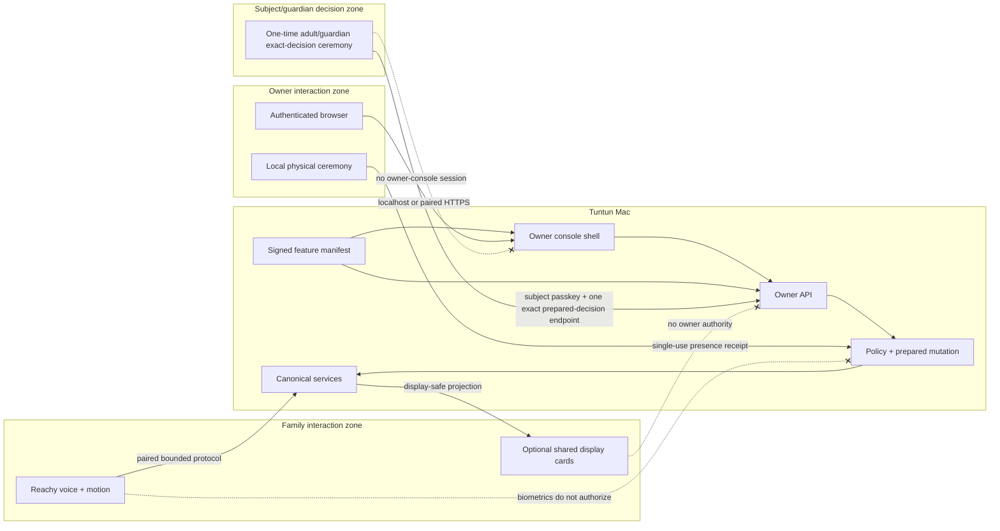

# Tuntun Six-Phase UI/UX Architecture Specification

**Status:** design baseline complete; implementation plan ready; implementation not started
**Date:** 2026-08-27
**Scope:** owner administration, Reachy family interaction, shared-display experiences, and privacy/safety state across Phases 1–6
**Primary operator:** one owner-managed household
**Normative dependencies:** the approved phase specifications, canonical policy and authorization services, and the phase feature manifest

## 1. Outcome

Tuntun has one coherent interface system with four deliberately different surfaces:

1. an owner-only responsive web console for administration and evidence;
2. a voice-first Reachy experience for everyday family conversation; and
3. a transient, subject-scoped local decision ceremony for an adult or current primary guardian who is not an administrator; and
4. optional glanceable household-display experiences for teaching, media, timers, and non-sensitive status.

The interface is calm and family-friendly without hiding technical truth. It never collapses microphone capture, Reachy camera processing, Reolink recording, cloud transmission, storage retention, or remote access into a vague “safe” score. It shows each plane independently, identifies stale or unknown state, and explains what an owner action will and will not change.

The Phase 1 four-area concept—Home, Family + Memory, Privacy, and System—is retained as the visual foundation. As later phases are installed, the console grows through feature-gated navigation groups rather than turning each Phase 1 page into an overloaded dashboard. Production navigation exposes only capabilities present in the signed feature manifest; it does not advertise an absent feature as if it were available.

## 2. Locked UI decisions

| Area | Decision |
|---|---|
| Primary administrative surface | Responsive local web application served by the Tuntun Mac; no native mobile application is required |
| Default reach | `127.0.0.1:8787`; optional paired private-LAN HTTPS; Phase 6 may add the separately gated owner-VPN route |
| Everyday family surface | Reachy voice, tones, and bounded movement; no administrative configuration by voice |
| Shared-display surface | Read-only or tightly scoped household cards; sensitive memories, identity evidence, camera footage, audit details, and secrets are absent by default |
| Information architecture | Stable task-oriented groups whose routes appear only when their owning phase is installed |
| Visual direction | Warm, calm, trustworthy and legible; neither a surveillance control room nor a generic enterprise dashboard |
| Privacy presentation | Separate truthful states for microphone, Reachy camera, Reolink recorder, cloud egress, durable retention, and remote sessions |
| Privacy emergency action | One persistent Privacy Shield action; its confirmation states exactly which independent systems continue |
| Authentication | Read-only household posture is low-friction after console authentication; mutations use the canonical risk-tiered, action-bound flow |
| High-impact actions | Passkey plus exact prepared-mutation summary; recovery/restore and other designated operations also require local presence |
| Identity | UI never treats a face or voice match as action authorization |
| Child access | No owner-console session, private-adult content, policy editor, camera playback, or security controls |
| Guest access | No console session or private household data; guest interaction is Reachy-only unless a later explicit kiosk design is approved |
| Non-owner subject/guardian decision | An adult or current primary guardian may use a single-purpose local ceremony for one exact consent, persona replace/clear, child-memory decision, or child-rule co-approval; this creates no owner-console or general household access |
| Languages | Owner console supports English and Hindi display preferences; Reachy independently follows English/Hindi/Hinglish speech per turn |
| Accessibility | WCAG 2.2 AA target, complete keyboard operation, reduced-motion support, 200% zoom, and non-colour status cues |
| Theme | Light and dark themes with the same semantic hierarchy and status meaning |
| Open-source boundary | Household names, images, events, memories, credentials, topology, and screenshots never ship in public fixtures or documentation |

### 2.1 Audited cross-phase UI closure

- The active Core/UI host is the owner-approved Darwin arm64 Mac recorded in `docs/architecture/decisions/0001-phase1-host-baseline.md`; the UI never depicts or requires a second office laptop/helper. Family-ready topology is the active Mac single-homed on the inner ASUS/AiMesh network with any direct BE800 link disconnected; optional dual-home state is a separately qualified fact, never ambient authority. Intel macOS remains distribution evidence only unless a fresh real-host transition qualification passes.
- Memory/knowledge audience vocabulary is exactly `subject_private`, `guardian_child`, `household_adults`, and `household_all`. Every row binds exact subject, audience, guardian, consent, and applicable child-safe-approval generations. Legacy aliases fail schema decoding; owner status never widens `subject_private`.
- Every `ui.plane_fact.v1` owns its source generation, observation time, validity deadline, and evidence commitment. A newly generated wrapper may shorten but cannot refresh an expired source fact; stale/unknown/error-safe facts never render green or enable controls.
- D3 and D4 execution network is exactly `none` in contract and presentation. The separately prepared desktop model-egress exception displays the exact bounded selections, provider/model/attempt, serialized-byte/token counts, commitments, disclosure/policy, and expiry and never authorizes helper network access.
- Robot readiness/safety binds the exact activation/location tuple and commitment, controller epoch, current edge/core key generations, lease, battery/charging/controller/sensor facts, and exact camera/indicator pair. Only `disabled/off` and `indicator_verified/on_verified` are coherent. Any stale/reclassified/substituted/contradictory fact removes green state and all motion controls. `geofence_state` is only the safety evaluation of the canonical bound zone.
- Remote UI renders canonical Tailscale `grants`, Tailnet Lock/current signed-node set/two independent recovery signers, Device Approval disabled, and the two authoritative DNS views. External requests contain only operation, typed opaque resource, and idempotency. Light buttons select `light_power_on|light_power_off`; the browser never sends target, desired state, actor/session/policy/generation, assurance, time, or commitment authority.
- The permanent remote-denial list is generated from shared real operation IDs, including `plugin_permission_change` and `recovery_key_import`; `plugin_permission`, `recovery_import`, and unknown aliases are schema-unsupported. Remote private detail shows only the authenticated owner's own current `subject_private` body.
- Recovery UI proves both backup tiers bind the identical eligible generation and D4 has `network=none`; one-shot offline bootstrap displays quarantine-only authority. Update UI projects durable accepted/rolled-back/quarantined journal truth. Household UI may approve C0 but only verifies and displays read-only C1/publication receipts. C1 decisions and the third publication action exist solely in a separate project-maintainer app/terminal with no household imports, API client, database, cookie, key, evidence body, backup, diagnostic, or support reader.

## 3. Alternatives and recommendation

### 3.1 Minimal owner dashboard

One compact desktop dashboard could expose health, privacy, profiles, and a settings page. It is fast to build and sufficient for the earliest voice loop, but it becomes difficult to navigate once rooms, cameras, media, local AI, desktop grants, robotics, backup, and remote access arrive. It would encourage dense settings pages and accidental privilege mixing.

### 3.2 Layered responsive console plus purpose-built family surfaces

The owner console remains one responsive web application, but its navigation and page modules are feature-gated by phase. Reachy stays voice-first. TVs or room displays receive only purpose-built cards. Shared design tokens and state semantics make the surfaces feel related without making them share the same permissions.

This is the selected design. It fits the one-owner household, reuses the Mac, does not require an app-store release, and keeps privileged administration away from child-facing surfaces.

### 3.3 Native multi-application suite

A macOS menu-bar app plus native iOS, iPadOS, Android, and TV applications could provide deeper platform integration. It would multiply release, signing, accessibility, secure-storage, notification, and compatibility work before the household value is proved. Native shells remain a future adapter opportunity, not a Phase 1–6 requirement.

## 4. Surfaces and trust boundaries

Surface identity is a closed four-value set: `owner`, `reachy`, `subject`, and `display`. Phase 6 remote use is the existing owner console under a remote route-origin context—`surface=owner`, `origin=remote`, corresponding to `route_origin_class=owner_vpn`—and never a fifth surface. The Reachy, subject/guardian, and display trust zones remain local-only and retain their existing protocols, credentials, imports, and authority boundaries.



### 4.1 Owner console

- The browser is an untrusted presenter. It never authors policy bindings, authoritative prices, retention eligibility, identity decisions, or action assurance.
- The server returns versioned read models and opaque prepared-action identifiers. The browser renders the safe summary and returns only the challenge response plus the opaque identifier.
- Every response includes freshness metadata. Unknown, stale, degraded, paused, disabled, absent, and healthy are distinct states.
- Content routes and download capabilities use `no-store`; no secret or reusable media URL enters browser history, query strings, analytics, error reporting, or local storage.

### 4.2 Reachy family experience

- Reachy acknowledges the wake phrase, indicates listening, thinking, speaking, stopped, privacy-on, offline, and error-safe states through bounded audio cues and motion available on the delivered hardware.
- Speech remains the primary interface. There is no assumption that Reachy has a screen or a specific unverified LED.
- One household conversation is active at a time. A second wake either receives a clear busy response or safely transfers control after the current turn is cancelled.
- Tuntun never speaks a secret, PIN, recovery code, private adult memory, camera detail, or administrative audit body merely because a recognized person asks.
- Turning privacy or mute on is available through the governed local path. Turning it off is never voice-only.

### 4.3 Shared displays

- Phase 4 may project timers, teaching material, song/media state, family-safe reminders, and an explicitly approved household status card.
- Display projection uses a dedicated display-safe DTO; the display cannot call owner APIs or expand a summary into private content.
- Lock-screen and idle states reveal no exact profile identity by default. A child teaching session may display the selected child-safe name or avatar only while the guardian-approved session is active.
- Camera footage, memory bodies, identity confidence, approval details, budget controls, network addresses, audit records, and recovery state are owner-console-only.
- A display disconnect or stale projection cannot cause an action. It becomes visibly stale and requires a fresh session.

### 4.4 Adult and guardian exact-decision ceremony

- The owner or an already-authorized workflow initiates an exact, short-lived local ceremony for one named subject, one closed decision type, one server-prepared immutable summary/commitment, current policy/guardian/resource generations, and expiry. The invitation carries no owner bearer session and reveals no unrelated profile, memory, device, audit, or household content.
- The participating adult signs in or enrolls their own subject-bound passkey and can grant, refuse, or revoke only the consent named by a `subject_consent` ceremony. With the separate `profile_persona` credential capability, the same adult may replace or clear only their own typed persona profile. The owner cannot answer on that adult's behalf or edit another adult's persona.
- A current primary guardian uses the same constrained surface only after the canonical guardian relation, current generation, and guardian-owned subject passkey are verified. Closed guardian decision types are `child_consent`, `child_persona_replace`, `child_persona_clear`, `child_memory_proposal_approve`, `child_memory_proposal_edit_approve`, `child_memory_proposal_reject`, `child_memory_delete_one`, `child_home_rule_coapprove`, `child_room_voice_coapprove`, `child_media_teaching_coapprove`, `child_screen_time_coapprove`, and `child_local_ai_route_coapprove`. Unknown types fail closed. Child persona replacement accepts only the closed K2/N1-safe context/tone/depth/learning-level shape and exact expected profile version.
- Consent and exact approval remain different records. Durable child memory requires current `child_durable_memory_v1` consent and a separate exact current-primary-guardian proposal approval. Deleting one child memory binds its ID/version/audience; a child home/media/room/local-AI rule binds the exact child, room/targets, hours/content/source/model or other phase-owned parameters plus both owner-configured and guardian-approved generations.
- The ceremony supports only the action named in its prepared summary. It cannot approve all pending memories, delete all memories, change the guardian, broaden audience, edit owner policy, create a routine, authorize a purchase, enroll a device, or substitute one child/room/target/model for another.
- The ceremony ends after one decision, expiry, cancellation, subject/guardian change, policy/disclosure change, or Privacy Shield. It cannot navigate to the owner console or be upgraded into a general session.
- Reachy may explain the ceremony in English/Hindi/Hinglish, but spoken assent alone does not create the receipt. A child never approves their own durable-memory, identity, search, media, room-microphone, local-AI route, or other guardian-controlled policy.

Self-revocation never depends on an owner invitation. A local `subject-privacy` entry point lets an adult authenticate with their subject-bound passkey, view only their own consent statuses and audience-safe memory metadata, and revoke one exact consent immediately. A current primary guardian may likewise revoke one exact child consent. It issues no owner session, reveals no unrelated household data, and cannot grant new authority without the applicable prepared ceremony. Revocation increments the subject/guardian consent generation synchronously; any in-flight route rechecks that generation before decryption or egress.

An adult may use the same local subject-privacy zone for one own-memory reveal, export, delete, persona replace, or persona clear decision at a time. Persona replacement binds the target profile, expected version, operation, and the complete closed `context|tone|depth|learning_level` payload and requires current personalization consent. Persona clear binds the same target/version with no traits payload and remains available to the otherwise-authorized adult or current guardian after personalization consent is revoked. The exact routes are `POST /api/v1/subject-privacy/self-service/persona/replace/prepare`, `POST /api/v1/subject-privacy/self-service/persona/clear/prepare`, and `POST /api/v1/subject-privacy/self-service/{ceremony_id}/decide`; child equivalents are `POST /api/v1/subject-privacy/guardian/persona/replace/prepare`, `POST /api/v1/subject-privacy/guardian/persona/clear/prepare`, and `POST /api/v1/subject-privacy/guardian/{ceremony_id}/decide`. All six are local-only, accept generated closed request types, and reconstruct the foundation `ProfileActionDraft`/`ActionBinding` server-side. The server filters and decrypts only after subject authorization. The subject session is local-only, idles after five minutes, ends absolutely after ten minutes, uses `Cache-Control: no-store`, persists no browser state, and cannot reach cameras, devices, other profiles, policy administration, audit, backup, provider settings, remote access, desktop execution, or robot controls.

### 4.5 Anonymous Guest cloud-disclosure receipt

Guest remains offline-only by default and receives no browser or console session. Phase 1 may offer the already-defined Reachy-local, versioned three-purpose disclosure sequence for cloud STT, reasoning, and TTS. A bounded yes/no utterance creates only a signed, current-session, current-purpose data-processing receipt while that exact challenge is active; it is not identity, consent for another person, memory access, or action authorization. The three purposes are presented and decided separately, silence/ambiguity/no remains offline-only, Guest web search stays disabled, and saying stop/no revokes further egress immediately. The receipt expires with the session and cannot be reused in a follow-up/new session. This narrow exception does not weaken the rule that spoken assent cannot create an adult/guardian durable consent, memory approval, child rule, device action, or administrative grant.

## 5. Information architecture

The full console uses eight task groups. A group is registered only when the feature manifest proves its backend, policy, migrations, route, and negative-reachability tests are present.

| Group | Primary routes | Owning phase |
|---|---|---|
| Home | Household posture, attention inbox, recent safe activity, quick local status | 1 |
| Family | People & identity, subject/guardian decision ceremonies, approvals, memory, child/guardian policy | 1 |
| Home & devices | Rooms, endpoints, lights, scenes, routines, household policies | 2 |
| Cameras & presence | Camera health, events, owner playback, storage, retention, anonymous occupancy | 3 |
| Media & learning | Room nodes, music, TVs/displays, teaching sessions, screen-time policy | 4 |
| AI workspace | Providers/local models, document corpus, desktop grants, robot supervision | 5 |
| Privacy & access | Privacy Shield, capture/recording planes, authentication, sessions, retention, exports/deletion | 1–6 |
| System | Health, costs, audit, backups, updates, plugins, remote access, diagnostics | 1–6 |

### 5.1 Navigation behavior

- Desktop and wide tablet use a persistent left rail with the current route and owner/session state in the top bar.
- Narrow tablet and phone use a compact top bar and an accessible navigation drawer. Privacy Shield and pending critical attention remain reachable without opening the drawer.
- Route titles describe tasks, not implementation components. “Cameras & presence” is preferred to “Vision adapter”; “System health” is preferred to “Observability.”
- The current prototype’s four tabs are the Phase 1 compact mode: Home, Family + memory, Privacy, and System. The expanded groups replace that compact navigation only after additional phases are installed.
- Advanced-owner diagnostics remain behind an explicit mode switch. Developer mode uses a separate origin, data root, visual warning, and synthetic-only fixtures.

## 6. Global shell

Every authenticated page contains:

1. Tuntun household wordmark and environment label;
2. current route and breadcrumb when deeper than one level;
3. signed feature-manifest version and stale-data indicator available through an information action;
4. owner session state and route origin: localhost, private LAN, or approved VPN;
5. pending approvals/critical attention count;
6. persistent Privacy Shield action;
7. keyboard-accessible global search limited to route names, device aliases, and owner-authorized records; and
8. help text that explains the boundary of the current view.

Global search never performs raw transcript search, cross-profile memory discovery, face search, camera person search, or unrestricted audit/body search. Search results are filtered server-side before their labels are returned.

## 7. Home

Home answers four questions in order:

1. Is Tuntun safe and available for the family right now?
2. Is anything waiting for the owner?
3. Which independent capture, cloud, storage, and remote planes are active?
4. Are budget, disk, backup, or device failures approaching a limit?

### 7.1 Household posture ribbon

The ribbon shows separate compact facts:

- microphone: muted, post-wake eligible, listening, unavailable, or unknown;
- Reachy camera processing: off, interaction-gated, active for a named purpose, unavailable, or unknown;
- cloud route: blocked, available, active attempt, budget-stopped, review-expired, unavailable, or unknown;
- Reolink recorder: recording, paused by separate owner action, degraded/gapped, unavailable, or unknown;
- remote owner route: absent, disabled, commissioning, read-only, scoped actions, suspended, or unknown.

The ribbon does not average these facts. Every item opens a plain-language explanation and source timestamp.

### 7.2 Attention inbox

The inbox sorts by action deadline and impact rather than alarm colour alone:

- immediate privacy/security failures;
- prepared or pending approvals;
- recording gaps or retention risk;
- failed backup/restore drill or stale provider review;
- soft budget warning and projected hard stop;
- degraded room/device health; and
- optional maintenance suggestions.

A warning card identifies whether the issue affects conversation, automation, recording, remote access, or only evidence/maintenance. Dismissing a card does not change the underlying condition.

### 7.3 Safe activity

The default activity feed contains event class, pseudonymous or friendly endpoint label, outcome, reason, and time. It excludes spoken text, memory bodies, images, biometric scores, document content, and camera URLs. Sensitive details require navigation to the owning protected route.

## 8. Family

### 8.1 People & identity

- Cards show profile class, enabled personalization modalities, calibration age, consent state, guardian relation, and safe fallback behavior.
- Identity confidence is not rendered as a celebratory score. The UI shows `personalized`, `guest fallback`, `conflicting evidence`, `liveness failed`, `calibration required`, or `disabled`, with the reason and next safe action.
- Enrollment begins only from a local owner route, creates a short-lived ceremony, and asks the family member to be physically present at Reachy.
- Active-interaction identity status shows only the current ceremony/turn's bounded quality, liveness, and Guest-fallback state. There is no passive candidate-review queue, unknown-person card, live camera proxy, stored portrait, or re-encounter workflow.
- Revoke, replace guardian, delete profile, or delete biometrics uses an exact scope/count summary and the canonical step-up flow.

### 8.2 Approvals

Approvals are grouped by memory, identity, household action, privacy/access, budget/provider, desktop, robot, and release. Each item shows:

- requester/subject in an audience-safe form;
- requested action and exact resource;
- safe parameter summary generated by the server;
- reason, risk tier, assurance required, policy version, creation and expiry;
- consequences of approve, edit, reject, and expiration; and
- whether local physical presence is required.

The approval body cannot be modified after authorization begins. Editing creates a new prepared version and invalidates the old challenge.

### 8.3 Memory

- The default view is person-scoped and displays the seven memory kinds: working, episodic, semantic, preference, procedural, relational, and policy.
- Filters include person, kind, audience, sensitivity, source, confidence, active/expired/proposed state, and validity range only across records for which the current actor is authorized to receive those attributes. An opaque owner-administration projection may be filtered, sorted, grouped, and counted only by its exact safe field set; the server does not accept audience, title, source, provenance, commitment, precise sensitivity, or body-derived predicates for another subject's private records and returns no hidden-value count oracle.
- A memory detail shows typed content only when the current actor is authorized by the matrix below. Otherwise the owner console receives an opaque metadata projection and cannot infer the body, source wording, title, embedding, or private provenance.
- Child-memory proposals visibly identify guardian approval and never display unnecessary verbatim child speech.
- Delete-one, delete-all, export, audience broadening, and policy-memory changes use separate prepared operations. A single generic “manage” permission is prohibited.
- The UI explains that logical deletion and key destruction do not claim secure physical erasure of every SSD remnant or external owner export.

### 8.4 Memory administration and subject visibility matrix

`subject_private` means private from the household administrator when the administrator is not the subject. Owner status is not a universal read key. Server-side authorization applies before listing, decrypting, projecting, exporting, searching, or counting bodies.

| Actor and memory scope | Body/reveal | Metadata | Export | Delete/approve |
|---|---|---|---|---|
| Owner acting on the owner's own memory | Allowed for every audience that includes the owner | Full authorized metadata | Exact owner export after step-up | Exact approve/edit/reject/delete under ordinary policy |
| Adult subject acting on their own `subject_private` memory | Allowed through the local subject-privacy zone | Own full metadata | One exact own-memory export after subject passkey | One exact own-memory delete; proposals/consent decisions as defined by policy |
| Owner administering another adult's `subject_private` memory | **Body denied**; no prefetch, search snippet, title, source text, or commitment oracle | Opaque ID, kind, state, sensitivity band, created/review/expiry time, storage/count impact, and consent health only | Denied; owner may send the adult a subject-self-service invitation | May suspend personalization or perform a blind exact/delete-all lifecycle operation after count/set commitment and required subject notification/authority; cannot approve or edit the body on the adult's behalf |
| Current primary guardian for `guardian_child` memory | Allowed only while current guardian/consent generations match | Full child-safe metadata; no unnecessary verbatim child speech | Exact scoped export with guardian passkey and owner administrative co-authorization where export policy requires | Separate exact proposal approve/edit-approve/reject/delete-one; bulk delete uses its own count/set ceremony |
| Owner who is not the current guardian for `guardian_child` memory | Body denied | Opaque lifecycle/safety/consent health and counts only | Denied | May suspend child personalization and request the current guardian ceremony; cannot approve content |
| Other adult | Only `household_adults` or `household_all` records whose audience includes that adult | Only authorized records | Only their authorized projection; never another subject's private export | No administration of another subject/child memory |
| Child | No owner-console or subject-privacy browser session; Reachy may retrieve only approved `guardian_child` and `household_all` context under current policy | No browser listing | Denied | Cannot self-approve, export, broaden, or delete durable memory; may ask the guardian/owner to review |
| Anonymous or Designated Guest | Denied for every memory body and metadata projection | None | Denied | Denied |

Policy-memory bodies are visible only to the owner because they are system authority, while subject consent receipts remain visible to that subject through the subject-privacy zone. `household_adults` and `household_all` never override a record's additional sensitivity/consent restriction. Profile deletion can cryptographically remove records without granting the administrator body visibility first.

## 9. Home & devices

### 9.1 Rooms and endpoint inventory

- Phase 2 `area_id` is the sole canonical household location identifier, including every Phase 4 wire contract; no parallel `room_id` or mapping table exists. A camera `zone_id` names a stable versioned polygon/mask nested under one camera binding and one `area_id`; it is not a room alias. Area or zone edits use optimistic version/CAS, increment their generation, and invalidate prepared device/media/camera operations bound to the old generation.
- Room pages show approved devices, controller, capabilities, firmware/config evidence, last state freshness, manual fallback, and privacy class.
- Unknown, uncommissioned, unsupported, quarantined, and unavailable devices cannot be mistaken for controllable devices.
- Device aliases are household configuration; public fixtures use synthetic names.
- The UI does not claim network isolation merely because equipment sits behind the downstream ASUS/AiMesh topology. Verified segmentation state is shown separately.

### 9.2 Lights, scenes, and routines

- A control presents requested target, current observed state, confidence/freshness, acting profile, risk tier, and whether confirmation is required.
- Optimistic visual state is prohibited for authoritative control. The UI may show “request sent,” then transitions only after a correlated observed result or a clear timeout/unknown state.
- Scene preview enumerates every affected endpoint and identifies any missing or stale binding before confirmation.
- Routine editing separates trigger, conditions, actions, quiet hours, child/guest eligibility, expiry, and manual fallback.
- Bypassing Tuntun through Home Assistant or a vendor application is disclosed where relevant; the UI does not promise exclusive enforcement.

### 9.3 Designated Guest request sessions

- `Anonymous/uncertain — no side effects` and `Designated Guest request session — owner co-approval required` are separate labels, icons, policy states, and test fixtures. Identity uncertainty never creates or extends a Designated Guest session.
- Only the owner can prepare a bounded common-area session with exact allowed light/media request classes, area/targets, start/expiry, and cancellation control. Creation uses an action-bound passkey; cancellation is immediate.
- A pending Guest request shows the exact desired state, target, current observation, remaining session time, and the fact that the visitor has no independent authority. Every request stays pending until a fresh owner passkey co-approves that exact action; no batch or voice-only approval exists.
- Expiry, cancellation, restrictive identity evidence, target/binding/policy change, Privacy Shield, or owner absence denies the request. The session carries no identity, memory, camera, corpus, desktop, robot, policy, routine, or console access.

### 9.4 Screen-time policy and history

- The owner configures allowance, eligible child, device/display, period, warning, grace, extension ceiling, and enforcement mode; the distinct current primary guardian co-approves the exact rule through the subject/guardian ceremony.
- The route shows remaining observed allowance, active session, evidence freshness, warnings, grace, extension requests/decisions, override, manual-device intervention, and a content-minimized 30-day history.
- `Advisory`, `Cooperative`, and `Strict` appear only when exact current Phase 2/4 evidence supports them. Unknown television/viewer state consumes no invented time and never claims enforcement.
- A child may request an extension through Reachy, but cannot approve it. Owner configuration and current-guardian decision are separate principal slots; stale or same-principal substitution fails closed.

## 10. Cameras & presence

### 10.1 Camera health and placement

- Each camera shows exact recorded SKU/revision/firmware, mapped `area_id`/nested `zone_id`, source path, stream/event capability, audio-off state, clock quality, last segment, gaps, and local-only/cloud/P2P posture.
- The TrackMix page shows the wide stream and separately validated tracking stream/channel only if commissioning proves both. It identifies whether the allowed pan arc can reach bedroom interiors; failure keeps automated tracking disabled.
- The two kitchen E1 pages remain separate because they have different views and may have different local-ingest capabilities.
- Unknown camera capability fails closed and produces a commissioning action, not an assumed green status.

### 10.2 Event inbox and playback

- Events are owner-only and show class, zone, native detector basis, time, verification quality, recording availability, and an opaque clip reference.
- No event is labelled with a family member’s identity. There is no face-search or named-person timeline.
- Playback occurs through a short-lived same-origin capability. Raw RTSP/ONVIF URLs, credentials, reusable tokens, and vendor identifiers never appear in the browser.
- The default event page does not autoplay video. Opening a clip is an explicit owner action; remote playback is separately disabled until Phase 6 policy enables it.
- Export creates a bounded, named incident package after owner step-up and warns that owner-created copies fall outside Tuntun retention.

The Phase 3 baseline alert transport is the durable owner-console inbox plus authenticated same-origin SSE. When an authenticated paired owner-console page is connected, the server emits a content-minimized event ID/class/zone/time notification; delivery to that reachable SSE client targets five seconds and reconnect uses the last accepted event ID for bounded deduplication. The browser Notification API may mirror the same safe summary only while that page has an active paired session and explicit permission. There is no service worker, background push provider, native Companion application, SMS, email, or vendor-cloud alert in the baseline. If every owner browser is closed, asleep, unauthenticated, or offline, the event remains unread in the local inbox and **no immediate-delivery claim is made**; the next authenticated view shows its original event time and delayed-delivery status. A future external notification adapter is a separate opt-in feature and cannot receive media, identity, or private memory.

Security containment disables future external/outbound notification adapters, but it does not hide the local owner-console critical inbox, local same-origin SSE, Reachy-local safety indication, or system health banner. The UI labels `local critical alert available` separately from `external notification delivery disabled`.

### 10.3 Storage and retention

- Capacity displays measured daily bytes, usable capacity, protected reserve, projected retention, recording gaps, effective copies, and the policy currently at risk.
- The hybrid policy is shown as two independent commitments: seven-day low-resolution continuous recording and ninety-day full-resolution event clips.
- Camera microSD, Reolink hub/NVR, Mac SSD, protected incident export, backup, and vendor cloud are listed as separate copies with independent deletion controls.
- The NAS decision page remains a measured recommendation until the seven-day pilot proves capacity, Mac uptime, performance, and ingest behavior. It never presents a purchase as already selected.

### 10.4 Anonymous occupancy

- Presence is `occupied`, `vacant`, `unknown`, `stale`, or `unavailable`; it is never a named-person state.
- A source list identifies only bounded sensor kinds and freshness. Camera video is not silently converted into identity or child tracking.
- Private-room presence appears only if the approved sensor/privacy matrix permits it. Unknown expires to unknown, never to vacant.

## 11. Media & learning

### 11.1 Room nodes and conversation arbitration

- Room-node pages show microphone/speaker health, privacy/mute, wake quality, latency, current conversation owner, and duplicate-wake arbitration.
- Only one active household conversation is allowed initially. A handoff view explains why another room is busy and provides stop/transfer actions according to policy.
- Speech output and music/media output have independent volume, routing, ducking, and stop states.

### 11.2 Music and TV

- Media views distinguish transport control from provider account/subscription state.
- A room page shows source, title safe for the current audience, target endpoint, volume, queue state, and last confirmed device state.
- TV controls remain capability-gated until exact Samsung/TCL models and authoritative control/state paths pass commissioning.
- The UI never claims screen-time enforcement if a physical remote, vendor application, HDMI source, or unobserved TV state can bypass it. It identifies the enforcement confidence and known bypasses.

### 11.3 Guarded teaching sessions

- A guardian starts or pre-approves a bounded session with child, subject, duration, display, content policy, and stop rules. For every child session, `web_mode=no_web` is a fixed, read-only policy fact rather than a selectable setting.
- No child-facing or guardian setup view exposes an enable-web/search control, and no UI/API/prepared-action mutation can alter `web_mode`. Guarded child teaching performs zero live search requests; it may use only locally available material or a guardian/owner-preapproved derived local teaching pack under the Phase 4 provenance and expiry rules.
- The child-facing display uses large type, simple progress, a clear stop/pause action, and no owner/private navigation.
- The end card may show topic, duration, and broad completion from RAM for at most five minutes or until dismissal/privacy/session end, whichever comes first. It is an ephemeral display projection, not a learning record; it has no free-form notes field and is absent from audit, history, backup, corpus, and memory. If a guardian wants a durable learning note, Tuntun creates a separate minimized Phase 1 child-memory proposal that remains uncommitted until the current guardian's exact approval and ordinary deletion/retention rules apply. Raw child speech is never that proposal.

## 12. AI workspace

### 12.1 Cloud and local AI

- Provider/local-model cards show availability, route eligibility by sensitivity, current model/config version, latency, recent bounded failure rate, and cost where applicable.
- The page differentiates `local`, `cloud eligible`, `cloud blocked by policy`, `cloud blocked by budget`, `provider review stale`, and `offline essential`.
- Model switching is policy-controlled; a user cannot send a protected body to a different provider by changing a dropdown.
- Benchmark results use synthetic or approved de-identified datasets and are visually separated from live household routes.

### 12.2 Document corpus

- Phase 5 baseline import/file selection is owner-only through the local console/native picker. A non-owner adult picker/upload route is absent across UI/API/feature registration; an adult may ask the owner to import a source but gains no filesystem or corpus-administration authority.
- Sources show owner, audience, sensitivity, index status, extraction/version time, and local/cloud eligibility.
- Search results carry source citations and access scope. A result title is not returned until server-side audience filtering succeeds.
- Removing a document triggers a visible index-deletion/reconciliation state. The interface does not claim deletion while derived chunks remain eligible.

### 12.3 Desktop assistance

- Grants are owner-only, task-scoped, time-bounded, resource-specific, and visually explicit: folder, repository, assistance level, command class, execution network (`none` for D3/D4), model-egress policy, provider/model, selected-content commitment, write authority, and expiry. Execution network and model/content egress are separate facts, and neither can authorize the other.
- The default is read-only inspection. Proposed writes show an exact diff or bounded action summary before execution.
- Desktop files and command output are `local_only` by default. Any cloud exception requires a separate exact prepared owner consent bound to content/output commitments, provider, model, purpose, sensitivity, disclosure/policy version, and expiry; the page names what will leave the Mac before authorization. Secrets and protected terminal output are redacted before display or any eligible model route. A grant does not silently expand after a tool failure.
- Remote desktop execution remains absent; the Phase 6 remote console cannot reach these actions.

### 12.4 Selected-frame anonymous perception

- This owner-only route exists only when the accepted Phase 3 broker and Phase 5 non-generative CV feature are installed. It shows the exact event, canonical area, zone ID/generation, camera-binding generation, purpose, CV artifact/calibration, request/result time, cap compliance, outcome/reason, privacy generation, and the fact that the advisory observation is ignored for Phase 3 alerts and occupancy.
- It never renders or persists a frame/thumbnail, caption, OCR text, person identity, demographic, reusable media handle, free prose, language-model/VLM output, or cloud route. Counts are advisory typed output and never become Phase 3 occupancy or a security event automatically.
- Oversize, stale, unsupported, privacy-cancelled, crashed, or uncalibrated requests show denied/unknown and confirm transient frames were cleared; recorder state remains independently visible.

### 12.5 Robotics

- Raspbot/LILYGO endpoints are shown only after their feature gate. The default page is health and supervised-session preparation, not a drive joystick.
- Movement requires local supervision, the exact activation-bound area/robot-binding/zone identities and generations, current controller/key/safety facts, stop path, and a short-lived lease. A fresh UI wrapper cannot refresh an expired readiness/safety fact.
- Camera and indicator are one exact safety pair: disabled requires off, and indicator-verified requires on-verified. Every other pair is error-safe and removes motion controls. Geofence status is explicitly the evaluation of the canonical bound zone, never another location identity.
- Camera/sensor preview follows the robotics privacy policy and cannot enter family identity or permanent memory automatically.
- Remote owner sessions cannot drive a robot.

## 13. Privacy & access

### 13.1 Privacy Shield and cross-phase effect registry

Privacy Shield is available from every owner route and represented on Reachy. It is a canonical generation change, not a collection of optimistic client toggles. On `privacy.on`, the Mac atomically increments `privacy_generation`, marks every registered Tuntun authority below ineligible, blocks new work, and commits the audit/outbox before fan-out. The Phase 1 P95 ≤250 ms deadline applies to this canonical authority revocation and to recognized Reachy-local audio/motion stop; it does **not** imply that every independent device has physically acknowledged within 250 ms.

| Effect ID | Authority revoked and command issued | Independent truth that may continue |
|---|---|---|
| `p1.conversation_capture` | Cancel graph, STT/search/LLM/TTS, Reachy capture windows, playback and requested gesture/motion; clear approved ephemeral context | A provider request already sent cannot be recalled; endpoint delivery can be unverified after disconnect |
| `p2.tuntun_home_dispatch` | Deny new Tuntun actions/routines and cancel work not yet externally committed | Physical switches, vendor controls, Home Assistant state and already-authorized/independent HA routines continue; an external effect already dispatched is reconciled, not claimed undone |
| `p3.camera_outcomes` | Cancel Tuntun camera alerts, anonymous-presence processing, selected-frame requests, playback/export grants and uncommitted event outcomes | The independent Reolink recorder, camera microSD/hub/NVR and existing exports continue unless their separately labelled controls change |
| `p4.room_media_display` | Revoke room capture leases, stop Tuntun speech, request Tuntun-initiated player stop and clear display sessions | A display has a one-second clear acknowledgement target; independently controlled/already-running music may continue and is reported verified, unverified, or unknown |
| `p5.private_ai_desktop_robot` | Cancel inference, knowledge response work, desktop grants/jobs, selected-frame CV, robot session authority and future motion leases; send robot stop | Prior model egress/writes cannot be undone; robot delivery/physical stop may be unverified, so local watchdog and physical e-stop remain authoritative |
| `p6.remote_plugin` | Revoke remote application sessions/routes and plugin capabilities/jobs | VPN-provider coordination metadata already recorded and a plugin result already rendered cannot be recalled; plugins still have no persistent or network write capability |
| `shared_display_projection` | Revoke every display fetch handle/manifest and send clear | A disconnected screen may retain pixels until local expiry/reboot; it is shown unverified and the owner may need physical action |

Every effect reports `authority_revoked`, `stop_requested`, `acknowledged`, `physically_verified`, or `unverified` independently. `authority_revoked` means Tuntun can no longer authorize new work under the prior generation. `acknowledged` means the responsible process/device accepted the stop/clear request. `physically_verified` requires the phase's accepted independent observation. Timeout, disconnect, stale generation, or missing observation becomes `unverified`, never silently successful.

The UI shows `activating` only until the canonical authority-revocation transaction commits. It then shows either `active — Tuntun authority revoked` or `active with unverified stops`; it does not wait for all external acknowledgements to make the authority state true. If canonical revocation cannot commit, the UI shows `error-safe — shield authority unconfirmed`, Reachy enforces its local shield, and no privacy reduction is allowed. Per-effect deadlines remain phase-owned: Reachy/core P95 ≤250 ms, display clear acknowledgement ≤1 second, and other controllers use their declared stop/lease/timeout bounds.

Before activation, the console states both the effect registry and the independent continuations. It says explicitly that the Reolink recorder continues; Privacy Shield does not imply camera power-off, deletion of media/exports, stopping physical/manual home controls, or erasure of data already sent/written.

Turning Privacy Shield off requires a server-prepared action bound to the current privacy generation and a fresh owner passkey. A physical ceremony is allowed only when it proves that same current owner credential plus required local presence; it is not an alternate unauthenticated authority path. Voice-only reactivation is prohibited. Deactivation revalidates each feature separately and cannot silently re-enable a stale/quarantined route.


### 13.2 Independent plane controls

The page has separate cards for:

- Reachy microphone eligibility;
- Reachy interaction-gated camera processing;
- commissioned room microphone hardware-mute, local-wake, and leased-capture state;
- independent Reolink camera recording and camera audio;
- Tuntun camera alerts, anonymous presence, playback grants, and selected-frame perception;
- cloud STT/search/model/TTS egress;
- durable memory and retention;
- Home Assistant/Tuntun action dispatch and independently continuing manual/routine state;
- Tuntun media control, independently playing media, and shared-display projection;
- local inference, desktop grants/jobs, and robot session/stop verification;
- plugin capability/job state; and
- LAN/VPN owner sessions.

Each card shows current state, controller, last authoritative update, what data is involved, retention, who can access it, and the exact action required to change it.

### 13.3 Authentication and sessions

- Passkeys, recovery material, LAN pairing, and VPN device posture have separate inventories and revocation actions.
- A session list shows origin class, pseudonymous device, created/last-active/expiry times, assurance age, permitted operation class, and revoke control.
- Browser session authentication never appears to authorize a prepared mutation by itself.
- PIN and recovery flows are deliberately distinguishable from passkey flows and cannot be phished through a generic modal.
- Recovery-key display/import, restore, bulk deletion, key rotation, and developer-mode transitions remain local-presence operations.

## 14. System

### 14.1 Health and diagnostics

- Health is organized by family impact: conversation, policy/identity/memory, home control, video/storage, media/displays, AI workspace, security/recovery.
- Every dependency reports state, evidence time, version, and failure consequence.
- A diagnostic bundle preview enumerates exactly which content-safe fields will be exported. Raw household data is absent.
- Household mode recommends one safe recovery action. Advanced-owner mode may show detailed checks, configuration diffs, and synthetic probes without weakening policy.

### 14.2 Cost and capacity

- The monthly panel shows actual, reserved, projected, soft-cap, and hard-cap amounts in integer-derived SGD display values.
- Provider/model price version, FX date, search/tool costs, and unpriced/uncertain attempts are visible.
- Storage capacity, cloud/API, optional music, electricity estimates, and future hardware TCO are separate categories; they are not combined into a misleading precise number when inputs are unmeasured.
- A hard-cap change uses a passkey-bound prepared mutation and has no voice override.

### 14.3 Audit

- The default 180-day view exposes content-minimized receipts, chain health, outcome/reason, actor/resource pseudonyms, assurance, and policy/config version.
- Commitments/hashes are expandable for an advanced owner; they are never presented as the original private content.
- Chain failure is critical and cannot be dismissed as healthy after an application restart.
- Export requires step-up, creates a no-store download, and records the exact exported scope.

### 14.4 Backup, update, plugins, and remote access

- Backup cards show both tiers' identical source generation/snapshot/archive/deletion/key/RPO/eligibility binding, distinct failure domains, verification, no-network restore drill, one-shot quarantine bootstrap, key availability, and next due action.
- Update review shows signed version, signer, exact final post-staple digest, release/security notes, compatibility, pre-update backup, expected restart, durable journal/reconciliation state, and rollback plan before approval.
- Plugins show publisher, signature/digest, requested/granted capabilities, network/filesystem/data access, resource limits, and disable/remove controls. Unknown capability denies installation.
- Remote access starts disabled. Commissioning shows canonical `grants`, Tailnet Lock/signed-node/recovery-signer generations, Device Approval disabled, two-view DNS/local CA, read-only, scoped action, suspended, and disabled states from the Phase 6 state machine and exact operation matrix.
- C0 is a household-owner local ceremony. C1 approval/rejection/acceptance and publication never appear as controls in this household application; it verifies and renders their signed read-only state. Those actions live only in the isolated project-maintainer terminal.

## 15. Authorization interaction model

| Interaction | UI behavior | Required assurance |
|---|---|---|
| View ordinary health after authenticated login | Direct, freshness shown | Active owner session |
| View private memory, exact approval, or camera clip | Reveal-on-demand; no prefetch | Fresh passkey where phase policy requires |
| Reversible allowlisted home/media action | Server preview, explicit confirmation when required, correlated result | Current phase risk policy |
| Edit profile, consent, room/device binding, retention, provider, or plugin grant | Prepared immutable summary | Fresh passkey |
| Export or delete one sensitive record/clip | Exact item/version/audience/copy summary | Fresh passkey |
| Delete profile/all memory, restore, rotate keys, change bind mode, recovery action | Count/set commitment and second exact confirmation | Fresh passkey plus local presence where registry requires |
| Enrollment/calibration | Local ceremony bound to currently present participant | Owner passkey plus physical Reachy presence |
| Adult self-consent or current-primary-guardian child consent | One exact subject/purpose/disclosure decision; no household browsing | Subject-bound passkey in the one-time local decision ceremony |
| Adult-self or current-primary-guardian child persona replace/clear | Exact profile/version/operation and closed typed traits commitment; replace requires current personalization consent, clear remains privacy-reducing after revocation; no cross-adult route | Subject-owned `profile_persona` passkey, plus current guardian generation for K2/N1 |
| Current-primary-guardian child memory decision or child-rule co-approval | One exact prepared memory ID/proposal/version or phase-owned child/room/target/time/content/model rule commitment; no batch or unrelated browsing | Guardian-owned subject passkey, current guardian generation, and one-time local decision ceremony |
| Remote action | Remote operation must be locally enabled and independently allowed | VPN posture plus app passkey plus ordinary action assurance |

The server prepares every authoritative summary. Any edit, stale resource version, policy version change, session revocation, idempotency mismatch, expiry, or replay invalidates the challenge. UI convenience cannot weaken this invariant.

## 16. Truthful state model

All stateful components use the same semantic vocabulary:

| State | Meaning | Presentation rule |
|---|---|---|
| Healthy/available | Current authoritative evidence satisfies the declared gate | Show evidence time and capability, never “perfect” |
| Active | A bounded operation is currently in progress | Show purpose, initiator class, start time, and stop path where safe |
| Disabled | Owner/policy intentionally prevents use | Explain who can enable and required ceremony |
| Absent | Capability is not installed in the signed release | Do not render an operational route or control |
| Degraded | Some declared capability is failing | Identify affected behavior and safe fallback |
| Stale | Last evidence exceeded its validity window | Never preserve a green state visually |
| Unknown | No trustworthy conclusion is available | Do not infer safe, vacant, stopped, or recorded |
| Suspended/quarantined | Security, privacy, or consistency gate closed the route | Show recovery steps without bypass control |
| Error-safe | An operation failed and authority has been cancelled | Show what stopped, what may continue independently, and retry policy |

Colour supports but never carries the meaning. Every state includes text and, where helpful, a consistent icon from an accessible licensed icon library. Animation is never the only indication and respects reduced-motion preferences.

## 17. Visual system

### 17.1 Character

The console should feel like a well-made household appliance: warm, composed, precise, and easy to trust. It avoids neon cyber-security styling, anthropomorphic surveillance cues, dense SOC dashboards, generic gradients on every card, and decorative charts that obscure exact facts.

### 17.2 Semantic palette

- neutral surfaces carry ordinary content;
- blue indicates selected/navigation/informational state;
- mint/green indicates current healthy evidence;
- amber indicates attention, degradation, or approaching limits;
- coral/red indicates stopped, failed, destructive, or security-critical state;
- orchid may identify family/memory concepts but never identity confidence or authority.

Light and dark themes must pass the same contrast and state-recognition tests. Status palettes are tokenized; component code does not choose raw colours.

### 17.3 Typography, spacing, and components

- Shipping defaults use platform/system fonts with a Devanagari-capable fallback, avoiding a proprietary font dependency in the open-source package.
- Headings are friendly but restrained; body text prioritizes long-form legibility; identifiers and commitments use a monospace stack.
- Hindi and mixed-script content receives at least 1.5 line height and is tested for glyph fallback, wrapping, punctuation, numerals, and text expansion.
- A four-pixel base spacing system and bounded density variants keep routine pages calm while allowing advanced diagnostic tables.
- Core components are shell, navigation, status fact, attention card, data table/card list, filter bar, detail drawer, timeline, safe summary, assurance prompt, empty/error state, toast/live announcement, and privacy control.
- Charts require a specific decision question. Exact values and a table alternative are always available.

## 18. Responsive behavior

| Width class | Behavior |
|---|---|
| Wide desktop | Persistent navigation, two-column detail where useful, dense advanced tables allowed |
| Laptop/tablet landscape | Persistent or collapsible rail, single primary reading column, side detail drawer |
| Tablet portrait/phone | Drawer navigation, stacked status facts, card-list replacement for wide tables, sticky privacy/critical action region |

- No essential action requires hover.
- Touch targets are at least 44 by 44 CSS pixels unless an equivalent larger grouped control is provided.
- At 200% zoom there is no two-dimensional page scrolling for ordinary workflows; code/commitment fields may scroll within labelled containers.
- Orientation changes preserve unsaved non-authoritative form input but invalidate an authorization challenge if the authoritative prepared request changes.

## 19. Accessibility and inclusive interaction

- All routes, dialogs, menus, tabs, tables, disclosures, media controls, and prepared-action flows are keyboard operable with visible focus.
- Page title, route heading, landmarks, field errors, status changes, and confirmation outcomes are announced correctly to assistive technology.
- Live regions report high-value state changes without repeatedly speaking background health polling.
- Focus moves to the first actionable error and returns predictably after a dialog closes.
- Captions/transcripts are not created from private speech merely to satisfy an unused display feature. When text equivalents are needed for an active owner interaction, they follow the same no-durable-raw-transcript rule.
- Reduced motion removes panel animations and non-essential Reachy/display animation; it does not hide state changes.
- Destructive actions use unambiguous verbs, target names, counts, consequences, and recovery limits. Colour and icon alone are insufficient.
- Automated checks are necessary but not sufficient; the release gate includes VoiceOver on macOS/Safari and keyboard-only testing on the supported Chromium browser.

## 20. Language and content design

- Owner console language is a display preference and does not change current conversation language, model route, or memory audience.
- English and Hindi strings use stable message identifiers and ICU-style parameters/plurals. UI source contains no concatenated sentence fragments that produce broken grammar.
- Hinglish is supported in Reachy conversation and user-entered labels/search, but the first console ships professionally reviewed English and Hindi interface strings rather than an artificial machine-translated Hinglish mode.
- Technical identifiers, model names, device SKUs, hashes, and error codes remain unchanged; their explanations are localized.
- Child-facing text uses shorter sentences and concrete choices, but safety meaning is never softened or omitted.
- Privacy and authorization copy is reviewed for equivalent meaning in both languages. A translation cannot claim broader protection than the canonical English policy text.

## 21. UI read-model and command contracts

The UI consumes presentation-specific contracts rather than exposing domain tables.

```text
ui.household_posture.v1
  generated_at
  valid_until
  feature_manifest_version
  route_origin_class: localhost | paired_lan | owner_vpn
  facts[]: ui.plane_fact.v1
  attention_counts_by_severity: exact non-negative critical/warning/info counts
  privacy_shield_generation
  privacy_shield_authority_state: inactive | activating | active_authority_revoked |
                                  active_with_unverified_stops | error_safe_unconfirmed
  privacy_effects[]: ui.privacy_effect_status.v1
```

```text
ui.plane_fact.v1
  fact_id
  plane: reachy_mic | reachy_identity_camera | room_mic | reolink_recorder |
         camera_outcomes | selected_frame_perception | cloud_egress | durable_memory |
         home_action_dispatch | home_assistant_independent | media_control |
         independent_media | display_projection | local_inference | desktop |
         robot | plugin | lan_admin | vpn_remote
  state: healthy | active | disabled | absent | degraded | stale | unknown | suspended | quarantined | error_safe
  controller: closed registered controller ID
  evidence_source: local_process | paired_endpoint | home_assistant | camera_source |
                   recorder | player_adapter | display_agent | model_proxy |
                   desktop_helper | robot_safety | plugin_supervisor | vpn_adapter
  source_generation
  verification_strength: authoritative | corroborated | acknowledged_unverified | none
  reason_code
  safe_summary_message_id
  evidence_observed_at
  valid_until
  evidence_commitment
  owner_route
```

```text
ui.privacy_effect_status.v1
  effect_id: one registered Section 13.1 effect
  privacy_generation
  state: authority_revoked | stop_requested | acknowledged | physically_verified | unverified
  authority_revoked_at
  stop_requested_at: optional
  acknowledged_at: optional
  physically_verified_at: optional
  deadline_at: optional
  controller
  reason_code
  safe_message_id
```

```text
ui.prepared_action.v1
  prepared_action_id
  action_name
  safe_title_message_id
  safe_parameter_rows[]
  consequence_message_ids[]
  resource_version
  policy_version
  risk_tier
  required_assurance
  local_presence_required
  authorization_policy: one_principal | all_named_distinct_principals
  principal_slots[]:
    slot_id
    role: owner | subject_adult | current_primary_guardian
    subject_scope
    guardian_generation: optional
    must_be_distinct_from_slot_ids[]
    state: pending | satisfied | expired | revoked
  expires_at
  idempotency_key
```

```text
ui.subject_self_service.v1
  ceremony_id
  subject_scope
  operation: consent_revoke | memory_reveal_one | memory_export_one | memory_delete_one |
             persona_replace | persona_clear
  resource_ref
  resource_version
  disclosure_version
  policy_version
  profile_expected_version: optional; required only for persona_replace | persona_clear
  persona_traits: optional closed {context, tone, depth, learning_level}; required only for persona_replace
  resource_and_parameter_commitment
  safe_summary_message_id
  expires_at
  one_use_commitment
```

```text
ui.guardian_exact_decision.v1
  ceremony_id
  child_scope
  guardian_generation
  decision_type: child_consent | child_memory_proposal_approve |
                 child_persona_replace | child_persona_clear |
                 child_memory_proposal_edit_approve | child_memory_proposal_reject |
                 child_memory_delete_one | child_home_rule_coapprove |
                 child_room_voice_coapprove | child_media_teaching_coapprove |
                 child_screen_time_coapprove | child_local_ai_route_coapprove
  prepared_action_id
  resource_and_parameter_commitment
  policy_version
  safe_summary_message_id
  expires_at
  one_use_commitment
```

For `persona_replace`, the typed traits object is required and `additionalProperties: false`; its generated enums are exactly `context=general|technical_security|household_practical|early_learning`, `tone=neutral|precise|practical|warm`, `depth=brief|standard|detailed`, and `learning_level=none|k2|n1`. For `persona_clear`, the traits object is forbidden. Both variants require `resource_ref` to be the exact profile, require `profile_expected_version`, and commit the operation plus all request fields. Adult self-service authorizes only `subject_scope == authenticated_subject`; guardian persona decisions authorize only a current-generation K2/N1 `child_scope` and the identity service further narrows values to its child-safe matrix. There is no owner-to-other-adult persona route. These two variants extend the existing closed contracts and do not add a fifth surface.

```text
ui.operation_result.v1
  operation_id
  action_name
  outcome: verified | accepted_unverified | partial | denied | duplicate | failed | unknown | expired | cancelled
  reason_code
  safe_message_id
  target_results[]: ui.operation_target_result.v1
  terminal_at
  operation_generation
  audit_receipt_id
```

```text
ui.operation_target_result.v1
  result_kind: light_v1 | player_v1 | television_v1 | display_v1 |
               clip_v1 | document_v1 | desktop_step_v1 | robot_v1
  target_id: opaque purpose-scoped identifier
  outcome: verified | accepted_unverified | denied | duplicate | failed | unknown | expired | cancelled
  dispatch_status
  reason_code
  safe_message_id
  observation_source: device | home_assistant | player_adapter | tv_sensor |
                      display_agent | media_proxy | knowledge_store |
                      desktop_helper | robot_safety | none
  verification_strength: authoritative | corroborated | acknowledged_unverified | none
  observed_state_schema_id
  observed_state_code
  evidence_generation
  observed_at: optional
  terminal_at
```

```text
ui.display_projection.v1
  projection_id
  projection_kind: timer_status_v1 | media_status_v1 | teaching_session_v1 |
                   family_safe_reminder_v1 | household_status_v1
  display_id
  audience_class
  payload: one matching closed variant below
  created_at
  valid_until
  source_session_id
  policy_version
  manifest_digest
  signer_key_id
  signature
```

```text
timer_status_v1: label_message_id, remaining_seconds, state
media_status_v1: safe_title, safe_artist, playback_state, volume_band, target_label
teaching_session_v1: teaching_manifest_id, teaching_manifest_digest
family_safe_reminder_v1: registered_message_id, bounded_scalar_parameters[], due_at
household_status_v1: allowed_fact_codes[], generated_at, valid_until
```

`target_results` is empty only for a true non-targeted operation and complete for every single- or multi-target device/media/display/workflow operation. Aggregate `partial` requires at least two manifest-ordered target rows with differing terminal outcomes; aggregate `verified` requires every target row to be `verified` with adequate current evidence. Unknown/unobserved physical state never collapses into success. Each `result_kind` selects a registered closed observed-state schema; unknown kind/schema/state fails closed.

A display projection is accepted only when its signature, digest, audience, policy, session, display binding, expiry, projection kind, and exact payload variant validate. The teaching variant resolves only to the separately signed Phase 4 `TeachingSessionManifestV1`. No projection variant accepts HTML, CSS, JavaScript, SVG script, URL, path, iframe, form, download, credential, raw memory, camera media, authorization prompt, or unregistered parameter type.

Rules:

- major-version mismatch fails closed to a safe incompatibility page;
- unknown state/action/plane/result/display/decision enum or payload discriminator fails closed and cannot produce a mutation or render untrusted content;
- list endpoints use opaque cursors, server-side authorization/filtering, bounded page size, and stable sort fields;
- sensitive bodies are fetched only after explicit navigation and are never prefetched;
- state-changing HTTP methods require the current origin/session protections plus exact prepared-action/grant semantics;
- error payloads use stable reason codes and localized safe messages, never stack traces or private provider/device bodies;
- feature-manifest absence removes both route registration and API capability, not merely the navigation link.
- server authorization precedes per-fact/list projection; global `generated_at` never extends a fact beyond its own `valid_until` or evidence generation;
- a multi-principal action executes only when every named slot is satisfied by the required current principal and all declared distinctness constraints hold against the same immutable prepared commitment.

## 22. Failure and recovery UX

| Failure | Required behavior |
|---|---|
| Mac API unreachable | Preserve no authoritative green state; explain that Tuntun status is unknown and show local recovery guidance |
| Browser loses session | Clear protected view and in-memory token; return to authentication without replaying a mutation |
| Stale read model | Mark stale immediately; retain last value only as historical evidence with timestamp |
| Prepared action expires or changes | Close challenge, preserve non-sensitive draft where safe, fetch a new server summary |
| Device action times out | Show `unknown`, not success; offer state refresh and manual fallback |
| Camera/recorder split failure | Show stream, event, recording, and playback state independently |
| SSD missing/full | Keep voice/home status available; show recording/retention impact and prohibited exports/pins |
| Cloud budget/provider failure | Explain local/offline behavior without implying privacy mode is active |
| Identity uncertainty | Continue as Guest or explicit non-biometric profile; never block privacy/stop |
| Privacy Shield downstream acknowledgement missing | If canonical authority revocation committed, show `active with unverified stops`, identify every unconfirmed plane and physical fallback, and never claim acknowledgement/physical stop; if the canonical revocation itself failed, show `error-safe — shield authority unconfirmed` |
| Audit-chain failure | Raise critical evidence failure; do not silently rebuild or reset the chain |
| VPN drift | Terminate remote application sessions and show suspended state locally |
| Update rollback | Show restored version/schema/health and any feature kept disabled pending reconciliation |

## 23. Phase delivery map

### Phase 1 — Anchor family assistant

Deliver the shell, Home, Approvals, People & identity, Memory, subject self-service/guardian exact-decision zone, AI & budget, Reachy & offline, Privacy & access, Audit, responsive behavior, English/Hindi strings, accessibility baseline, and all prepared-action/authentication components. The disposable weeks 1–2 loop may use a small developer status page, but family-beta cannot pass without the protected owner console and non-owner privacy/guardian flows.

### Phase 2 — Home automation and policy

Add Home & devices, room/endpoint inventory, capability commissioning, light controls, scene preview, routine editor, policy explanation, state correlation, bounded Designated Guest session creation/cancellation/pending co-approval, screen-time allowance/extension/override/history, and manual-fallback disclosures. Extend the approval components; do not build a separate Home Assistant-themed UI.

### Phase 3 — Vision, presence, and storage

Add camera health/placement, durable event inbox, connected-console SSE delivery state, same-origin playback, storage/retention dashboard, effective-copy disclosure, TrackMix dual-view capability, and anonymous occupancy only where approved sensors exist. Privacy Shield continues to show the independent recorder truth and separate alert/presence/frame cancellation.

### Phase 4 — Whole-home voice, media, and displays

Add room-node health/arbitration, speech-versus-media routing, music/TV state, teaching-session setup, signed closed display projections, and truthful screen-time enforcement confidence/history/guardian decisions.

### Phase 5 — Private AI, desktop assistance, and robotics

Add local/cloud route policy, owner-only document corpus import, benchmark evidence, selected-frame anonymous-perception health/evidence, desktop grant/diff/review with separate model-egress consent, and supervised robotics session controls. Keep desktop execution and robot driving local-only.

### Phase 6 — Remote access and product hardening

Add VPN commissioning/session posture, remote route state, plugin capability review, signed update flow, backup/restore evidence, incident states, public-release diagnostics, and complete accessibility/localization/recovery gates. Remote UI is a constrained projection of the same console, not a separate public application.

## 24. UI engineering boundaries for implementation planning

The implementation plan will preserve these bounded units:

| Unit | Responsibility | Must not own |
|---|---|---|
| `console-shell` | Routes, navigation, theme, localization, session presentation | Domain authorization or device credentials |
| `ui-contracts` | Generated/validated read-model and prepared-action client types | Canonical database entities |
| `design-system` | Tokens and accessible components | Phase-specific policy decisions |
| `feature-registry` | Register routes/components from signed feature manifest | Client-side entitlement overrides |
| `auth-ui` | Passkey/PIN/recovery/local-presence presentation | Authoritative action binding |
| `subject-decision-ui` | Adult self-service plus one-use subject/guardian ceremonies and their safe summaries | Owner session creation, unrelated household reads, or policy administration |
| `privacy-ui` | Independent plane facts and Privacy Shield ceremony | Recorder control unless using its separate action contract |
| Phase feature packages | Route modules and phase-specific safe projections | Cross-phase secrets or unscoped APIs |
| `display-client` | Display-safe card rendering and expiry | Owner API or private route discovery |
| Reachy interaction presenter | Bounded cues, spoken prompts, cancellations | Identity/policy authority |

The console may be packaged in the monorepo but depends only on versioned UI contracts. Domain services remain usable by simulator/CLI tests without a browser. Phase packages cannot import each other’s internals; they communicate through shared contracts and canonical services.

## 25. Testing and acceptance gates

### 25.1 Functional and contract gates

- Every installed route renders from synthetic fixtures and from the real versioned read model.
- Cross-surface matrices contain exactly `owner`, `reachy`, `subject`, and `display`. Remote authorization is tested as `surface=owner`, `origin=remote`; `remote` is rejected as a surface discriminator, and remote origin is unreachable for the other three trust zones.
- Every absent feature passes navigation, direct URL, API, configuration, client bundle/registration, and clean-install negative-reachability tests.
- Every mutation proves that the browser cannot invent or alter the authoritative binding, resource version, policy version, risk tier, assurance, or safe summary.
- Refresh, back/forward, multi-tab, duplicate submit, expiry, stale version, session revocation, privacy activation, and disconnect produce no replayed action.
- Device/camera/media/desktop/robot results remain correlated and late results cannot update a newer operation.
- Designated-Guest creation/pending co-approval, screen-time allowance/extension/history, and selected-frame perception each have positive route/API/feature-manifest fixtures when installed and direct-URL/API/bundle negative-reachability fixtures when absent. Anonymous Guest and ordinary child sessions cannot reach any of them.
- Guarded child teaching tests render `web_mode=no_web` as fixed/read-only, prove that no enable/search control or mutation operation exists across route, API/OpenAPI, prepared action, configuration, and client registration, and record zero child search calls.
- Document import, native file selection, corpus administration, desktop model-egress consent, and selected-frame perception are owner-only across navigation, direct URL, API, prepared-action issuance, and feature registration. A non-owner-adult picker/upload route is absent rather than merely hidden.
- Alert tests prove durable-inbox persistence, authenticated same-origin SSE reconnect from the last accepted event ID, bounded duplicate suppression, safe-summary minimization, and truthful delayed status. With every paired page closed or asleep, no background-push or immediate-delivery success may be displayed.

### 25.2 Privacy and security gates

- Automated browser traces, storage, cache, service workers, URLs, history, logs, screenshots, crash bundles, and exported fixtures contain no secret, raw audio, raw transcript, biometric vector/frame, reusable media URL, provider body, or unauthorized memory.
- Browser/API access-control tests cover every profile, audience, guardian state, route origin, assurance age, and remote/local context.
- Privacy Shield tests prove canonical authority revocation and Reachy-local stop meet the Phase 1 P95 ≤250 ms gate; effect statuses separately exercise request, acknowledgement, physical verification, timeout and disconnect. The UI may show active after canonical revocation, but must show unverified downstream stops and truthful independent Reolink/HA/media state rather than waiting for or inventing acknowledgement.
- Direct API calls cannot bypass hidden/disabled controls. CSRF, Origin/Host, rate, replay, cursor, object-level authorization, and content-type/size tests fail closed.
- Camera playback cannot reveal credentials or remain usable after capability expiry/revocation.
- Subject self-service and non-owner guardian ceremonies prove exact subject, closed operation/decision type, prepared resource/parameter commitment, passkey ownership, guardian/policy/resource generations, slot distinctness, one-use/expiry/revocation, and zero access to owner routes or unrelated household data. Tests separately cover adult self-revocation without owner invitation; own-memory reveal/export/delete; adult-self persona replace/clear; current-guardian K2/N1 child-safe persona replace/clear; clear after personalization-consent revocation; denial of owner cross-adult/stale-guardian/target/version/trait substitution; child consent; exact child-memory approve/edit-approve/reject/delete-one; and every registered child home, room-voice, media/teaching, screen-time, and local-AI route co-approval, including cross-child/room/target/model substitution denial.
- Multi-target light/player/display/workflow tests prove target results are complete and manifest-ordered, `partial` cannot appear without mixed terminal outcomes, and unverified/unknown targets never aggregate to `verified`.
- Every display projection variant passes signature/digest/audience/expiry and closed-payload tests; unknown variants and HTML/script/URL/path/credential/private-data payloads are rejected before rendering.

### 25.3 Accessibility and localization gates

- Automated WCAG checks run for every route in light/dark, narrow/wide, English/Hindi, normal/high-contrast, and reduced-motion fixtures.
- Keyboard-only workflows cover login, navigation, filter, detail, approval, Privacy Shield, destructive confirmation, playback, and logout.
- VoiceOver validates shell landmarks, status facts, tables/card alternatives, dialog focus, live announcements, and error recovery.
- At 200% zoom and at 320 CSS-pixel width, core workflows retain content and action reachability without page-level horizontal scrolling.
- Hindi and mixed-script visual regression fixtures prove no missing glyphs, clipping, overlapping, or direction/punctuation errors.

### 25.4 Visual and resilience gates

- Reference screenshots exist for every route’s default, loading, empty, error, stale, degraded, privacy-on, and authorization states at supported widths/themes.
- Visual review checks hierarchy, spacing, typography, focus, truncation, touch size, contrast, motion, and safe-summary legibility; snapshot equality alone is not approval.
- Fault injection covers API restart, database/key unavailable, cloud outage, HA outage, camera/event/recorder split failures, disk pressure, display disconnect, VPN drift, update rollback, and audit-chain failure.
- U8 has two ordered parts: U8A commits the UI acceptance verifier before Phase 6 freezes final bytes; U8B runs only after that exact frozen candidate completes its real maintenance window and the current Task 35R resilience drills, then writes evidence only before P6-4. This prevents the UI verifier from depending on evidence that cannot exist until after its own code is in the candidate and ensures it observes post-drill truth.
- The final-candidate maintenance epoch opens only after Phase 6 Task 36B freezes and target-qualifies the exact artifact/service inventory. Evidence logging may begin after 60 steady-state days; evaluation for promotion requires at least 90 steady-state days and three complete monthly buckets. At that point, the rolling three-month median of ordinary full-system owner maintenance is at most eight hours per month, excluding initial commissioning, incidents, hardware replacement, and explicitly scheduled quarterly restore/security drills; measured time is reported by subsystem. Crossing eight hours/month for three consecutive months freezes optional expansion and triggers simplification/retirement review. Candidate or authority drift invalidates U8B and restarts the full window; no source, route, service-row or artifact mutation is allowed after the freeze.

## 26. Performance budgets

- The authenticated shell becomes interactive within two seconds on the approved Darwin arm64 Core Mac over localhost under household load; paired-LAN performance is measured separately. Hosted Intel CI is functional portability evidence, not household performance evidence.
- Navigation to a cached non-sensitive read model completes within 250 ms at p95; a fresh local API view completes within one second at p95 under household load.
- Privacy Shield provides immediate input feedback and retains `activating` only until the canonical authority-revocation transaction settles. Downstream effect cards then show acknowledged, physically verified, or unverified under their own deadlines; animation can never mask a missed core or feature deadline.
- Lists render bounded pages and virtualize only when needed; no route requests an unbounded memory, event, clip, audit, or device history.
- Initial bundles exclude code for absent phases. Feature packages load by signed manifest and route, without exposing unauthorized data in prefetch.
- Background polling uses visibility-aware backoff, jitter, and server-provided validity windows. It never competes materially with the Reachy voice latency budget.

## 27. Cost and maintenance

- No paid design or UI runtime is required. The owner console and display client use open-source dependencies compatible with Apache-2.0 distribution.
- No dedicated tablet is required; the existing Mac browser is the supported baseline. A household tablet or wall display is an optional Phase 4 purchase, not hidden in Phase 1 cost.
- Native application signing, app-store accounts, push-notification services, analytics platforms, and hosted frontend infrastructure are excluded.
- UI dependency and icon/font licensing are included in the Phase 6 SBOM/licence gate.
- The design system reduces duplicate phase components, but each high-risk surface retains independent threat and acceptance tests.

## 28. Deferred UI ideas

- Native iOS/Android/macOS applications and widgets.
- Public internet console or SaaS household portal.
- Child or guest login to the owner console.
- Named-person camera timeline or cross-camera face search.
- Passive “Tuntun greeted you” camera automation.
- Remote desktop execution or remote robot driving.
- Multi-owner quorum/delegation UI. No dormant multi-owner principal, quorum, or delegation field/route exists in the current contracts; adding it requires an explicit versioned authority design and migration.
- Rich household social feed, gamification, streaks, behavioural scores, or child surveillance analytics.
- Voice creation of arbitrary automations, plugins, desktop grants, or policy rules.

## 29. Decision record

| Decision | Rationale | Revisit condition |
|---|---|---|
| One responsive owner console | Lowest operational burden and strongest reuse of canonical controls | Native platform capability becomes necessary and can preserve all policy/security gates |
| Separate owner, Reachy, subject/guardian, and display surfaces | Audience and authority differ fundamentally | Never merge privileged administration into a family or subject-scoped surface |
| Task-oriented feature-gated navigation | Scales across six phases without overwhelming Phase 1 | Revisit labels after household usability evidence, not to expose absent features |
| Truthful independent privacy planes | Prevents the UI from overstating what Privacy Shield or recorder controls do | Invariant; only add newly introduced planes |
| No optimistic authoritative device state | Prevents requests from being mistaken for observed outcomes | Invariant |
| No named identity in Reolink UI | Maintains Reachy-only interaction identity boundary | Requires a new explicit privacy/security design; not a routine setting |
| English/Hindi console; conversational Hinglish | Professional interface quality while preserving natural voice behavior | Add reviewed Hinglish UI only with a clear user need and qualified review |
| System-font baseline | Avoids proprietary font distribution and supports Devanagari | Revisit if an openly licensed, tested brand typeface is selected |
| No dedicated hardware purchase | Existing Mac/browser supports administration | Revisit during Phase 4 display experience, separately costed |

## 30. Written-spec review checklist

The design is ready to plan when review confirms:

- the four surface boundaries are accepted;
- the eight-group information architecture is understandable;
- Privacy Shield and independent recorder behavior are unambiguous;
- every phase has explicit UI scope and acceptance gates;
- child, Guest, remote, camera, desktop, and robot authority boundaries match the phase specs;
- there are no promised screens for absent or uncommissioned capabilities; and
- the implementation plan treats UI as a first-class tested workstream rather than late dashboard polish.
